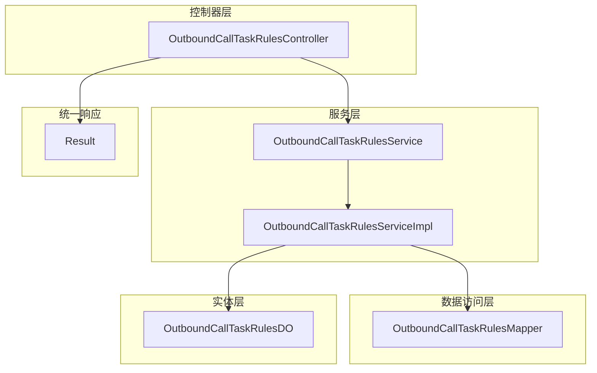
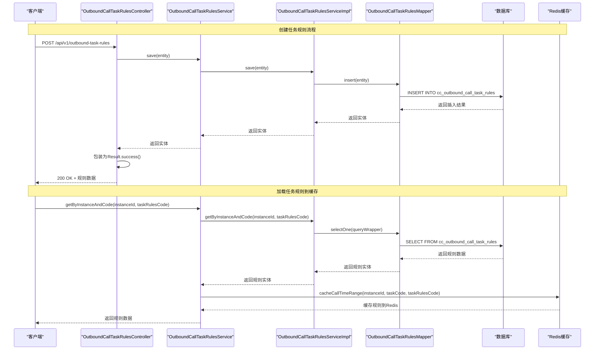
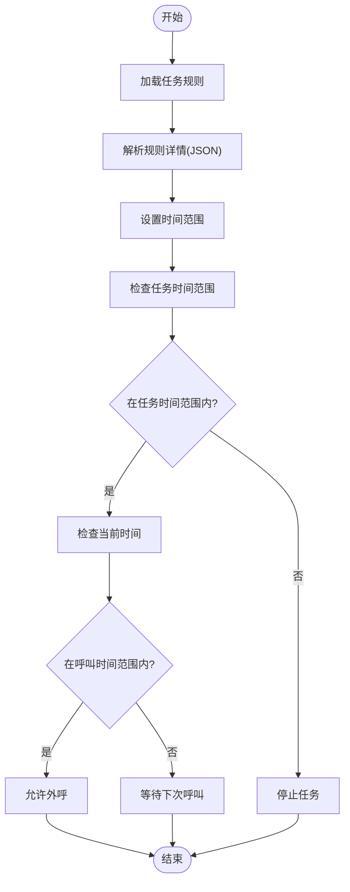
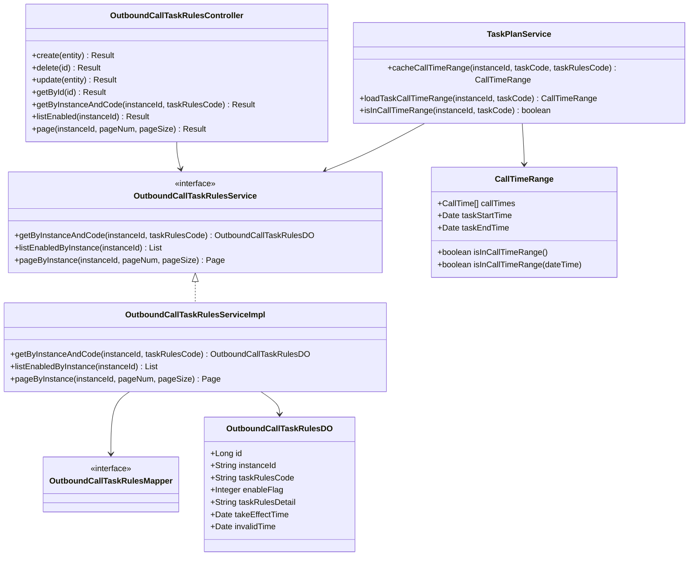

# 任务规则管理接口

<cite>
**本文档引用的文件**
- [OutboundCallTaskRulesController.java](file://src/main/java/org/qianye/controller/OutboundCallTaskRulesController.java)
- [OutboundCallTaskRulesService.java](file://src/main/java/org/qianye/service/OutboundCallTaskRulesService.java)
- [OutboundCallTaskRulesServiceImpl.java](file://src/main/java/org/qianye/service/impl/OutboundCallTaskRulesServiceImpl.java)
- [OutboundCallTaskRulesDO.java](file://src/main/java/org/qianye/entity/OutboundCallTaskRulesDO.java)
- [OutboundCallTaskRulesMapper.java](file://src/main/java/org/qianye/mapper/OutboundCallTaskRulesMapper.java)
- [TaskPlanService.java](file://src/main/java/org/qianye/TaskPlanService.java)
- [CallTimeRange.java](file://src/main/java/org/qianye/CallTimeRange.java)
- [OutboundRuleRangeModel.java](file://src/main/java/org/qianye/OutboundRuleRangeModel.java)
- [Result.java](file://src/main/java/org/qianye/common/Result.java)
- [OutCallServiceImpl.java](file://src/main/java/org/qianye/OutCallServiceImpl.java)
- [outcall.sql](file://src/main/resources/outcall.sql)
</cite>

## 目录
1. [简介](#简介)
2. [项目结构](#项目结构)
3. [核心组件](#核心组件)
4. [架构概览](#架构概览)
5. [详细组件分析](#详细组件分析)
6. [依赖关系分析](#依赖关系分析)
7. [性能考虑](#性能考虑)
8. [故障排除指南](#故障排除指南)
9. [结论](#结论)

## 简介
本文档为任务规则管理接口的完整API文档，涵盖智能外呼任务规则的创建、删除、更新、查询和分页查询接口。任务规则定义了外呼任务的执行时间范围、生效/失效时间以及规则启用状态，直接影响外呼任务的调度和执行。

## 项目结构
任务规则管理接口位于以下层次结构中：



**图表来源**
- [OutboundCallTaskRulesController.java](file://src/main/java/org/qianye/controller/OutboundCallTaskRulesController.java#L1-L65)
- [OutboundCallTaskRulesService.java](file://src/main/java/org/qianye/service/OutboundCallTaskRulesService.java#L1-L26)
- [OutboundCallTaskRulesServiceImpl.java](file://src/main/java/org/qianye/service/impl/OutboundCallTaskRulesServiceImpl.java#L1-L41)
- [OutboundCallTaskRulesMapper.java](file://src/main/java/org/qianye/mapper/OutboundCallTaskRulesMapper.java#L1-L10)
- [OutboundCallTaskRulesDO.java](file://src/main/java/org/qianye/entity/OutboundCallTaskRulesDO.java#L1-L82)
- [Result.java](file://src/main/java/org/qianye/common/Result.java#L1-L36)

**章节来源**
- [OutboundCallTaskRulesController.java](file://src/main/java/org/qianye/controller/OutboundCallTaskRulesController.java#L1-L65)
- [OutboundCallTaskRulesService.java](file://src/main/java/org/qianye/service/OutboundCallTaskRulesService.java#L1-L26)
- [OutboundCallTaskRulesServiceImpl.java](file://src/main/java/org/qianye/service/impl/OutboundCallTaskRulesServiceImpl.java#L1-L41)
- [OutboundCallTaskRulesMapper.java](file://src/main/java/org/qianye/mapper/OutboundCallTaskRulesMapper.java#L1-L10)
- [OutboundCallTaskRulesDO.java](file://src/main/java/org/qianye/entity/OutboundCallTaskRulesDO.java#L1-L82)
- [Result.java](file://src/main/java/org/qianye/common/Result.java#L1-L36)

## 核心组件
任务规则管理接口的核心组件包括：

### 控制器层
- **OutboundCallTaskRulesController**: 提供RESTful API端点，处理任务规则的增删改查请求
- 统一响应包装: 使用Result<T>封装所有API响应

### 服务层
- **OutboundCallTaskRulesService**: 定义任务规则服务接口，包括按实例和规则编码查询、启用规则列表查询、分页查询等功能
- **OutboundCallTaskRulesServiceImpl**: 实现具体的服务逻辑，基于MyBatis-Plus进行数据操作

### 数据访问层
- **OutboundCallTaskRulesMapper**: 基于MyBatis-Plus的通用Mapper接口
- **OutboundCallTaskRulesDO**: 任务规则实体类，映射数据库表cc_outbound_call_task_rules

### 规则生效机制
- **TaskPlanService**: 任务计划服务，负责加载和缓存任务规则到内存中
- **CallTimeRange**: 时间范围模型，包含具体的呼叫时间段配置
- **OutboundRuleRangeModel**: 规则时间段模型，定义开始和结束时间字段

**章节来源**
- [OutboundCallTaskRulesController.java](file://src/main/java/org/qianye/controller/OutboundCallTaskRulesController.java#L1-L65)
- [OutboundCallTaskRulesService.java](file://src/main/java/org/qianye/service/OutboundCallTaskRulesService.java#L1-L26)
- [OutboundCallTaskRulesServiceImpl.java](file://src/main/java/org/qianye/service/impl/OutboundCallTaskRulesServiceImpl.java#L1-L41)
- [TaskPlanService.java](file://src/main/java/org/qianye/TaskPlanService.java#L981-L1001)
- [CallTimeRange.java](file://src/main/java/org/qianye/CallTimeRange.java#L1-L133)
- [OutboundRuleRangeModel.java](file://src/main/java/org/qianye/OutboundRuleRangeModel.java#L1-L13)

## 架构概览



**图表来源**
- [OutboundCallTaskRulesController.java](file://src/main/java/org/qianye/controller/OutboundCallTaskRulesController.java#L24-L28)
- [OutboundCallTaskRulesServiceImpl.java](file://src/main/java/org/qianye/service/impl/OutboundCallTaskRulesServiceImpl.java#L19-L24)
- [TaskPlanService.java](file://src/main/java/org/qianye/TaskPlanService.java#L981-L1001)

## 详细组件分析

### RESTful API 端点定义

#### 创建任务规则
- **HTTP方法**: POST
- **路径**: `/api/v1/outbound-task-rules`
- **请求体**: OutboundCallTaskRulesDO 对象
- **响应**: Result<OutboundCallTaskRulesDO>

#### 删除任务规则
- **HTTP方法**: DELETE
- **路径**: `/api/v1/outbound-task-rules/{id}`
- **路径参数**: id (Long)
- **响应**: Result<Void>

#### 更新任务规则
- **HTTP方法**: PUT
- **路径**: `/api/v1/outbound-task-rules`
- **请求体**: OutboundCallTaskRulesDO 对象
- **响应**: Result<OutboundCallTaskRulesDO>

#### 获取单个任务规则
- **HTTP方法**: GET
- **路径**: `/api/v1/outbound-task-rules/{id}`
- **路径参数**: id (Long)
- **响应**: Result<OutboundCallTaskRulesDO>

#### 按实例和规则编码查询
- **HTTP方法**: GET
- **路径**: `/api/v1/outbound-task-rules/query`
- **查询参数**: 
  - instanceId (String): 实例ID
  - taskRulesCode (String): 任务规则编码
- **响应**: Result<OutboundCallTaskRulesDO>

#### 查询实例下所有启用的规则
- **HTTP方法**: GET
- **路径**: `/api/v1/outbound-task-rules/enabled`
- **查询参数**: instanceId (String)
- **响应**: Result<List<OutboundCallTaskRulesDO>>

#### 分页查询任务规则
- **HTTP方法**: GET
- **路径**: `/api/v1/outbound-task-rules/page`
- **查询参数**:
  - instanceId (String): 实例ID
  - pageNum (int, 默认1): 页码
  - pageSize (int, 默认20): 每页大小
- **响应**: Result<Page<OutboundCallTaskRulesDO>>

**章节来源**
- [OutboundCallTaskRulesController.java](file://src/main/java/org/qianye/controller/OutboundCallTaskRulesController.java#L24-L63)

### 数据模型定义

#### OutboundCallTaskRulesDO 实体属性

| 字段名 | 类型 | 描述 | 必填 |
|--------|------|------|------|
| id | Long | 主键ID | 否 |
| instanceId | String | 实例ID | 是 |
| taskRulesCode | String | 任务规则编码 | 是 |
| taskRulesName | String | 规则名称 | 否 |
| scheduleStartTime | String | 定时任务执行开始时间 | 否 |
| scheduleEndTime | String | 定时任务执行结束时间 | 否 |
| taskRulesDetail | String | 任务规则详情(JSON数组) | 否 |
| enableFlag | Integer | 启用状态(0=启用,1=禁用) | 是 |
| remarks | String | 备注 | 否 |
| takeEffectTime | Date | 生效时间 | 否 |
| invalidTime | Date | 失效时间 | 否 |
| envFlag | String | 环境标志(pre/prod/sit) | 否 |

#### 任务规则详情格式
任务规则详情采用JSON数组格式，包含多个时间段配置：

```json
[
  {
    "startTime": 900,
    "endTime": 1800
  },
  {
    "startTime": 2300,
    "endTime": 200
  }
]
```

时间格式为24小时制分钟数(0-1439)，支持跨天时间段配置。

**章节来源**
- [OutboundCallTaskRulesDO.java](file://src/main/java/org/qianye/entity/OutboundCallTaskRulesDO.java#L1-L82)
- [TaskPlanService.java](file://src/main/java/org/qianye/TaskPlanService.java#L981-L1001)

### 规则生效机制

#### 时间范围计算流程



**图表来源**
- [TaskPlanService.java](file://src/main/java/org/qianye/TaskPlanService.java#L382-L388)
- [CallTimeRange.java](file://src/main/java/org/qianye/CallTimeRange.java#L61-L113)

#### 规则缓存策略
- **缓存键**: `outboundTask:callTimeRange:{instanceId}:{taskCode}:{env}`
- **缓存时间**: 1天
- **缓存内容**: CallTimeRange对象序列化后的JSON字符串

**章节来源**
- [TaskPlanService.java](file://src/main/java/org/qianye/TaskPlanService.java#L81-L85)
- [TaskPlanService.java](file://src/main/java/org/qianye/TaskPlanService.java#L991-L997)

### 业务规则和约束

#### 规则验证逻辑
1. **实例ID唯一性**: 同一实例下的规则编码必须唯一
2. **启用状态**: enableFlag=0表示启用，1表示禁用
3. **时间范围有效性**: 
   - 生效时间必须早于失效时间
   - 时间范围必须在0-1439之间
4. **跨天处理**: 支持23:00-02:00这样的跨天时间段

#### 冲突检测机制
- **时间冲突**: 同一任务规则内的多个时间段不能重叠
- **环境冲突**: 不同环境标志(pre/prod/sit)的规则相互独立
- **状态冲突**: 禁用规则不会影响当前执行

**章节来源**
- [OutboundCallTaskRulesServiceImpl.java](file://src/main/java/org/qianye/service/impl/OutboundCallTaskRulesServiceImpl.java#L27-L31)
- [CallTimeRange.java](file://src/main/java/org/qianye/CallTimeRange.java#L85-L113)

## 依赖关系分析



**图表来源**
- [OutboundCallTaskRulesController.java](file://src/main/java/org/qianye/controller/OutboundCallTaskRulesController.java#L1-L65)
- [OutboundCallTaskRulesService.java](file://src/main/java/org/qianye/service/OutboundCallTaskRulesService.java#L1-L26)
- [OutboundCallTaskRulesServiceImpl.java](file://src/main/java/org/qianye/service/impl/OutboundCallTaskRulesServiceImpl.java#L1-L41)
- [TaskPlanService.java](file://src/main/java/org/qianye/TaskPlanService.java#L981-L1001)

**章节来源**
- [OutboundCallTaskRulesController.java](file://src/main/java/org/qianye/controller/OutboundCallTaskRulesController.java#L1-L65)
- [OutboundCallTaskRulesService.java](file://src/main/java/org/qianye/service/OutboundCallTaskRulesService.java#L1-L26)
- [OutboundCallTaskRulesServiceImpl.java](file://src/main/java/org/qianye/service/impl/OutboundCallTaskRulesServiceImpl.java#L1-L41)
- [TaskPlanService.java](file://src/main/java/org/qianye/TaskPlanService.java#L981-L1001)

## 性能考虑

### 缓存策略
- **Redis缓存**: 任务规则时间范围缓存1天，减少数据库查询压力
- **批量查询**: 分页查询支持大数据量场景，默认每页20条记录
- **并发控制**: 使用Redis分布式锁防止重复执行

### 数据库优化
- **索引设计**: 
  - `idx_instance`: 实例ID和规则编码联合索引
  - `idx_take_inval_time`: 生效时间和失效时间复合索引
  - `idx_env`: 环境标志索引
- **查询优化**: 启用规则查询使用等值条件，提高查询效率

### 异步处理
- **规则加载**: 通过异步方式加载规则到缓存，不影响主线程
- **任务调度**: 外呼任务采用异步队列处理，支持高并发场景

## 故障排除指南

### 常见问题诊断

#### 规则未生效
1. **检查启用状态**: 确认enableFlag=0且在生效时间内
2. **验证时间范围**: 检查taskRulesDetail格式是否正确
3. **确认缓存状态**: 查看Redis中是否存在对应缓存键

#### 查询结果异常
1. **实例ID匹配**: 确认查询参数中的instanceId是否正确
2. **规则编码唯一性**: 检查同一实例下是否存在重复的taskRulesCode
3. **分页参数**: 验证pageNum和pageSize参数的有效性

#### 性能问题
1. **缓存命中率**: 监控Redis缓存命中情况
2. **数据库负载**: 检查慢查询日志和索引使用情况
3. **并发控制**: 查看Redis锁的使用情况

**章节来源**
- [TaskPlanService.java](file://src/main/java/org/qianye/TaskPlanService.java#L954-L974)
- [OutCallServiceImpl.java](file://src/main/java/org/qianye/OutCallServiceImpl.java#L417-L443)

## 结论
任务规则管理接口提供了完整的外呼任务规则生命周期管理功能，包括规则的创建、删除、更新、查询和分页查询。通过Redis缓存机制和合理的数据库设计，系统能够高效地处理大量任务规则的加载和验证。规则的启用状态、生效时间和时间范围配置共同决定了外呼任务的执行时机，为智能外呼系统提供了灵活的时间调度能力。