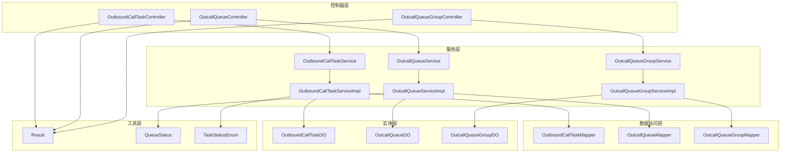
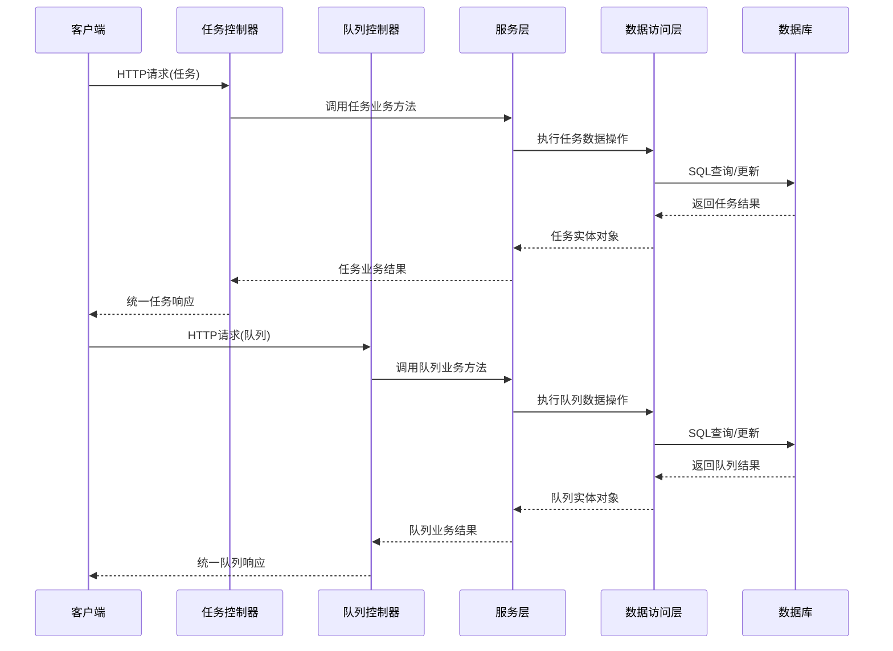
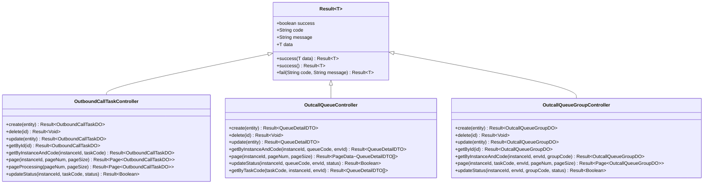
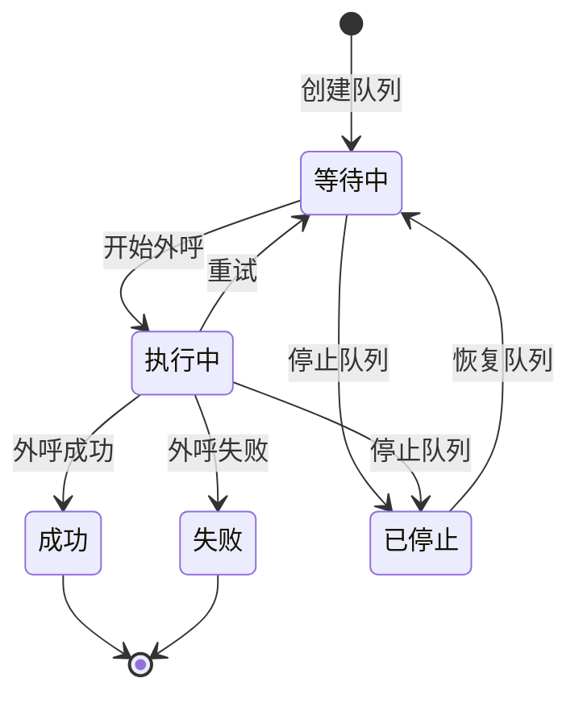
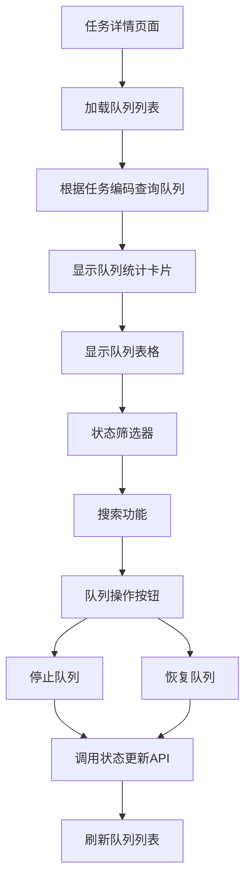
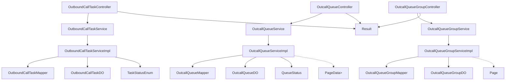
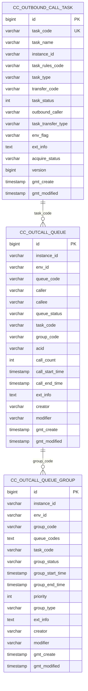

# 外呼任务管理接口

<cite>
**本文档引用的文件**
- [OutboundCallTaskController.java](file://src/main/java/org/qianye/controller/OutboundCallTaskController.java)
- [OutcallQueueController.java](file://src/main/java/org/qianye/controller/OutcallQueueController.java)
- [OutcallQueueGroupController.java](file://src/main/java/org/qianye/controller/OutcallQueueGroupController.java)
- [OutboundCallTaskService.java](file://src/main/java/org/qianye/service/OutboundCallTaskService.java)
- [OutcallQueueService.java](file://src/main/java/org/qianye/service/OutcallQueueService.java)
- [OutcallQueueGroupService.java](file://src/main/java/org/qianye/service/OutcallQueueGroupService.java)
- [OutboundCallTaskServiceImpl.java](file://src/main/java/org/qianye/service/impl/OutboundCallTaskServiceImpl.java)
- [OutcallQueueServiceImpl.java](file://src/main/java/org/qianye/service/impl/OutcallQueueServiceImpl.java)
- [OutcallQueueGroupServiceImpl.java](file://src/main/java/org/qianye/service/impl/OutcallQueueGroupServiceImpl.java)
- [OutboundCallTaskDO.java](file://src/main/java/org/qianye/entity/OutboundCallTaskDO.java)
- [OutcallQueueDO.java](file://src/main/java/org/qianye/entity/OutcallQueueDO.java)
- [OutcallQueueGroupDO.java](file://src/main/java/org/qianye/entity/OutcallQueueGroupDO.java)
- [QueueDetailDTO.java](file://src/main/java/org/qianye/DTO/QueueDetailDTO.java)
- [QueueDetailRequest.java](file://src/main/java/org/qianye/DTO/QueueDetailRequest.java)
- [QueueStatus.java](file://src/main/java/org/qianye/common/QueueStatus.java)
- [Result.java](file://src/main/java/org/qianye/common/Result.java)
- [TaskStatusEnum.java](file://src/main/java/org/qianye/common/TaskStatusEnum.java)
- [application.properties](file://src/main/resources/application.properties)
- [outcall.sql](file://src/main/resources/outcall.sql)
- [schema.sql](file://src/main/resources/schema.sql)
- [TaskDetail.vue](file://frontend/src/pages/TaskDetail.vue)
- [api.js](file://frontend/src/services/api.js)
</cite>

## 更新摘要
**所做更改**
- 新增队列相关API端点文档，包括队列查询、状态管理和分页查询
- 新增队列组管理API端点文档，支持队列分组管理功能
- 更新前端集成示例，展示任务详情页面的队列管理功能
- 补充队列状态流转和业务逻辑说明
- 增加队列统计和过滤功能的详细说明

## 目录
1. [简介](#简介)
2. [项目结构](#项目结构)
3. [核心组件](#核心组件)
4. [架构概览](#架构概览)
5. [详细组件分析](#详细组件分析)
6. [队列管理API](#队列管理api)
7. [队列组管理API](#队列组管理api)
8. [前端集成示例](#前端集成示例)
9. [依赖关系分析](#依赖关系分析)
10. [性能考虑](#性能考虑)
11. [故障排除指南](#故障排除指南)
12. [结论](#结论)

## 简介

外呼任务管理接口是智能外呼系统的核心RESTful API，用于管理外呼任务的全生命周期。该接口提供了完整的任务操作功能，包括任务创建、删除、更新、查询、分页查询和状态管理等核心功能。

系统基于Spring Boot框架构建，采用MyBatis-Plus作为ORM框架，支持MySQL数据库存储。接口遵循RESTful设计原则，使用统一的响应格式，提供标准化的错误处理机制。

**更新** 新增队列管理和队列组管理功能，支持前端任务详情页面的队列统计、筛选和状态控制功能。

## 项目结构

外呼任务管理模块采用标准的MVC架构模式，主要包含以下层次：



**图表来源**
- [OutboundCallTaskController.java](file://src/main/java/org/qianye/controller/OutboundCallTaskController.java#L15-L71)
- [OutcallQueueController.java](file://src/main/java/org/qianye/controller/OutcallQueueController.java#L15-L79)
- [OutcallQueueGroupController.java](file://src/main/java/org/qianye/controller/OutcallQueueGroupController.java#L15-L68)

**章节来源**
- [OutboundCallTaskController.java](file://src/main/java/org/qianye/controller/OutboundCallTaskController.java#L1-L72)
- [OutcallQueueController.java](file://src/main/java/org/qianye/controller/OutcallQueueController.java#L1-L79)
- [OutcallQueueGroupController.java](file://src/main/java/org/qianye/controller/OutcallQueueGroupController.java#L1-L69)
- [application.properties](file://src/main/resources/application.properties#L1-L17)

## 核心组件

### 控制器层

- **OutboundCallTaskController**: 外呼任务管理的入口控制器，负责任务的CRUD操作
- **OutcallQueueController**: 队列管理控制器，处理队列的查询、更新和分页操作
- **OutcallQueueGroupController**: 队列组管理控制器，处理队列组的CRUD和状态管理

### 服务层

- **OutboundCallTaskService**: 定义外呼任务管理的核心业务接口
- **OutcallQueueService**: 定义队列管理的核心业务接口，包括状态更新和分页查询
- **OutcallQueueGroupService**: 定义队列组管理的核心业务接口，支持按任务分页查询

### 数据访问层

- **OutboundCallTaskMapper**: 基于MyBatis-Plus的基础数据访问接口
- **OutcallQueueMapper**: 队列数据访问接口
- **OutcallQueueGroupMapper**: 队列组数据访问接口

### 实体层

- **OutboundCallTaskDO**: 外呼任务核心数据模型
- **OutcallQueueDO**: 队列实体，包含队列状态、任务关联等信息
- **OutcallQueueGroupDO**: 队列组实体，支持队列分组管理

**章节来源**
- [OutboundCallTaskService.java](file://src/main/java/org/qianye/service/OutboundCallTaskService.java#L8-L39)
- [OutcallQueueService.java](file://src/main/java/org/qianye/service/OutcallQueueService.java#L9-L52)
- [OutcallQueueGroupService.java](file://src/main/java/org/qianye/service/OutcallQueueGroupService.java#L15-L42)

## 架构概览

外呼任务管理接口采用分层架构设计，各层职责明确，耦合度低：



**图表来源**
- [OutboundCallTaskController.java](file://src/main/java/org/qianye/controller/OutboundCallTaskController.java#L23-L70)
- [OutcallQueueController.java](file://src/main/java/org/qianye/controller/OutcallQueueController.java#L21-L79)
- [OutcallQueueServiceImpl.java](file://src/main/java/org/qianye/service/impl/OutcallQueueServiceImpl.java#L35-L64)

## 详细组件分析

### API端点定义

#### 1. 任务创建接口

**HTTP方法**: POST  
**URL模式**: `/api/v1/outbound-task`  
**请求参数**: 无  
**请求体格式**: OutboundCallTaskDO对象  
**响应数据结构**: Result<OutboundCallTaskDO>

**请求示例**:
```json
{
  "taskCode": "TASK_001",
  "taskName": "营销外呼任务",
  "instanceId": "INSTANCE_001",
  "taskRulesCode": "RULE_001",
  "taskType": "AUTO_CALL",
  "transferCode": "SKILL_GROUP_001",
  "taskStatus": 0,
  "outboundCaller": "4008008888",
  "taskTransferType": "IVR",
  "envFlag": "prod",
  "extInfo": "{}"
}
```

**响应示例**:
```json
{
  "success": true,
  "code": "200",
  "message": "",
  "data": {
    "id": 1,
    "taskCode": "TASK_001",
    "taskName": "营销外呼任务",
    "instanceId": "INSTANCE_001",
    "taskRulesCode": "RULE_001",
    "taskType": "AUTO_CALL",
    "transferCode": "SKILL_GROUP_001",
    "taskStatus": 0,
    "outboundCaller": "4008008888",
    "taskTransferType": "IVR",
    "envFlag": "prod",
    "extInfo": "{}",
    "gmtCreate": "2024-01-01T00:00:00Z",
    "gmtModified": "2024-01-01T00:00:00Z",
    "version": 0
  }
}
```

**章节来源**
- [OutboundCallTaskController.java](file://src/main/java/org/qianye/controller/OutboundCallTaskController.java#L23-L27)
- [OutboundCallTaskServiceImpl.java](file://src/main/java/org/qianye/service/impl/OutboundCallTaskServiceImpl.java#L19-L24)

#### 2. 任务删除接口

**HTTP方法**: DELETE  
**URL模式**: `/api/v1/outbound-task/{id}`  
**路径参数**: id (Long)  
**请求参数**: 无  
**请求体格式**: 无  
**响应数据结构**: Result<Void>

**成功响应示例**:
```json
{
  "success": true,
  "code": "200",
  "message": "",
  "data": null
}
```

**章节来源**
- [OutboundCallTaskController.java](file://src/main/java/org/qianye/controller/OutboundCallTaskController.java#L29-L33)

#### 3. 任务更新接口

**HTTP方法**: PUT  
**URL模式**: `/api/v1/outbound-task`  
**请求参数**: 无  
**请求体格式**: OutboundCallTaskDO对象  
**响应数据结构**: Result<OutboundCallTaskDO>

**章节来源**
- [OutboundCallTaskController.java](file://src/main/java/org/qianye/controller/OutboundCallTaskController.java#L35-L39)

#### 4. 单任务查询接口

**HTTP方法**: GET  
**URL模式**: `/api/v1/outbound-task/{id}`  
**路径参数**: id (Long)  
**请求参数**: 无  
**请求体格式**: 无  
**响应数据结构**: Result<OutboundCallTaskDO>

**章节来源**
- [OutboundCallTaskController.java](file://src/main/java/org/qianye/controller/OutboundCallTaskController.java#L41-L44)

#### 5. 条件查询接口

**HTTP方法**: GET  
**URL模式**: `/api/v1/outbound-task/query`  
**请求参数**: 
- instanceId (String, 必填)
- taskCode (String, 必填)  
**请求体格式**: 无  
**响应数据结构**: Result<OutboundCallTaskDO>

**章节来源**
- [OutboundCallTaskController.java](file://src/main/java/org/qianye/controller/OutboundCallTaskController.java#L46-L50)

#### 6. 分页查询接口

**HTTP方法**: GET  
**URL模式**: `/api/v1/outbound-task/page`  
**请求参数**: 
- instanceId (String, 必填)
- pageNum (Integer, 默认值: 1)
- pageSize (Integer, 默认值: 20)  
**请求体格式**: 无  
**响应数据结构**: Result<Page<OutboundCallTaskDO>>

**分页参数配置**:
- pageNum: 当前页码，默认1，最小1
- pageSize: 每页条数，默认20，最大100
- 排序规则: 按gmtModified降序排列

**章节来源**
- [OutboundCallTaskController.java](file://src/main/java/org/qianye/controller/OutboundCallTaskController.java#L52-L57)
- [OutboundCallTaskServiceImpl.java](file://src/main/java/org/qianye/service/impl/OutboundCallTaskServiceImpl.java#L32-L37)

#### 7. 处理中任务分页查询接口

**HTTP方法**: GET  
**URL模式**: `/api/v1/outbound-task/processing`  
**请求参数**: 
- pageNum (Integer, 默认值: 1)
- pageSize (Integer, 默认值: 20)  
**请求体格式**: 无  
**响应数据结构**: Result<Page<OutboundCallTaskDO>>

**查询条件**: taskStatus = 2 (执行中)

**章节来源**
- [OutboundCallTaskController.java](file://src/main/java/org/qianye/controller/OutboundCallTaskController.java#L59-L63)
- [OutboundCallTaskServiceImpl.java](file://src/main/java/org/qianye/service/impl/OutboundCallTaskServiceImpl.java#L40-L45)

#### 8. 状态更新接口

**HTTP方法**: PUT  
**URL模式**: `/api/v1/outbound-task/status`  
**请求参数**: 
- instanceId (String, 必填)
- taskCode (String, 必填)
- status (Integer, 必填)  
**请求体格式**: 无  
**响应数据结构**: Result<Boolean>

**状态定义**:
- 0: 启用
- 1: 暂停
- 2: 执行中
- 4: 终止

**章节来源**
- [OutboundCallTaskController.java](file://src/main/java/org/qianye/controller/OutboundCallTaskController.java#L65-L70)
- [OutboundCallTaskServiceImpl.java](file://src/main/java/org/qianye/service/impl/OutboundCallTaskServiceImpl.java#L58-L64)

### 任务实体字段定义

OutboundCallTaskDO实体包含以下字段：

| 字段名 | 类型 | 描述 | 约束 |
|--------|------|------|------|
| id | Long | 主键 | 自增 |
| taskCode | String | 任务编码 | 非空，唯一索引 |
| taskName | String | 任务名称 | 可空 |
| instanceId | String | 实例ID | 非空，索引 |
| taskRulesCode | String | 任务规则编码 | 非空，索引 |
| taskType | String | 任务类型 | 非空，枚举值 |
| transferCode | String | 转接代码 | 非空 |
| taskStatus | Integer | 任务状态 | 非空，0-启用，1-暂停，2-执行中，4-终止 |
| outboundCaller | String | 主叫号码 | 非空 |
| taskTransferType | String | 转接类型 | 可空 |
| envFlag | String | 环境标志 | 可空 |
| extInfo | String | 扩展信息 | 可空 |
| acquireStatus | String | 收单状态 | 可空 |
| version | Long | 版本号 | 乐观锁 |

**章节来源**
- [OutboundCallTaskDO.java](file://src/main/java/org/qianye/entity/OutboundCallTaskDO.java#L13-L95)
- [outcall.sql](file://src/main/resources/outcall.sql#L169-L217)

### 错误处理机制

系统采用统一的响应格式，所有接口都返回Result<T>对象：



**图表来源**
- [Result.java](file://src/main/java/org/qianye/common/Result.java#L9-L35)
- [OutboundCallTaskController.java](file://src/main/java/org/qianye/controller/OutboundCallTaskController.java#L23-L70)
- [OutcallQueueController.java](file://src/main/java/org/qianye/controller/OutcallQueueController.java#L21-L79)
- [OutcallQueueGroupController.java](file://src/main/java/org/qianye/controller/OutcallQueueGroupController.java#L15-L68)

**章节来源**
- [Result.java](file://src/main/java/org/qianye/common/Result.java#L16-L34)

## 队列管理API

### 队列查询接口

#### 1. 根据任务编码获取队列列表

**HTTP方法**: GET  
**URL模式**: `/api/v1/outcall-queue/by-task/{taskCode}`  
**路径参数**: taskCode (String)  
**请求参数**: 
- instanceId (String, 必填)
- envId (String, 默认值: "test")  
**请求体格式**: 无  
**响应数据结构**: Result<List<QueueDetailDTO>>

**成功响应示例**:
```json
{
  "success": true,
  "code": "200",
  "message": "",
  "data": [
    {
      "instanceId": "INSTANCE_001",
      "taskCode": "TASK_001",
      "groupCode": "GROUP_001",
      "queueCode": "QUEUE_001",
      "callee": "13800000001",
      "caller": "13800138000",
      "acid": "CALL_001",
      "callCount": 0,
      "status": "WAITING",
      "extInfo": {},
      "fixedTime": "",
      "fixedStartTime": null,
      "envId": "test",
      "gmtCreate": "2024-01-01T00:00:00Z",
      "gmtModified": "2024-01-01T00:00:00Z",
      "callStartTime": null,
      "callEndTime": null,
      "lastQueueStatus": null
    }
  ]
}
```

**章节来源**
- [OutcallQueueController.java](file://src/main/java/org/qianye/controller/OutcallQueueController.java#L72-L77)
- [OutcallQueueServiceImpl.java](file://src/main/java/org/qianye/service/impl/OutcallQueueServiceImpl.java#L65-L70)

#### 2. 根据实例和队列编码查询

**HTTP方法**: GET  
**URL模式**: `/api/v1/outcall-queue/query`  
**请求参数**: 
- instanceId (String, 必填)
- queueCode (String, 必填)
- envId (String, 必填)  
**请求体格式**: 无  
**响应数据结构**: Result<QueueDetailDTO>

**章节来源**
- [OutcallQueueController.java](file://src/main/java/org/qianye/controller/OutcallQueueController.java#L43-L48)

#### 3. 队列分页查询

**HTTP方法**: GET  
**URL模式**: `/api/v1/outcall-queue/page`  
**请求参数**: 
- instanceId (String, 必填)
- pageNum (Integer, 默认值: 1)
- pageSize (Integer, 默认值: 20)  
**请求体格式**: 无  
**响应数据结构**: Result<PageData<List<QueueDetailDTO>>>

**分页参数配置**:
- pageNum: 当前页码，默认1，最小1
- pageSize: 每页条数，默认20，最大100

**章节来源**
- [OutcallQueueController.java](file://src/main/java/org/qianye/controller/OutcallQueueController.java#L50-L59)
- [OutcallQueueServiceImpl.java](file://src/main/java/org/qianye/service/impl/OutcallQueueServiceImpl.java#L72-L100)

#### 4. 队列状态更新

**HTTP方法**: PUT  
**URL模式**: `/api/v1/outcall-queue/status`  
**请求参数**: 
- instanceId (String, 必填)
- queueCode (String, 必填)
- envId (String, 必填)
- status (String, 必填)  
**请求体格式**: 无  
**响应数据结构**: Result<Boolean>

**状态定义**:
- WAITING: 等待中
- PROCESSING: 执行中
- SUCCESS: 成功
- FAILED: 失败
- STOP: 已停止

**章节来源**
- [OutcallQueueController.java](file://src/main/java/org/qianye/controller/OutcallQueueController.java#L61-L67)
- [OutcallQueueServiceImpl.java](file://src/main/java/org/qianye/service/impl/OutcallQueueServiceImpl.java#L58-L64)

### 队列实体字段定义

QueueDetailDTO实体包含以下字段：

| 字段名 | 类型 | 描述 | 约束 |
|--------|------|------|------|
| instanceId | String | 实例ID | 非空 |
| taskCode | String | 任务编码 | 非空 |
| groupCode | String | 队列组编码 | 可空 |
| queueCode | String | 队列编码 | 非空 |
| callee | String | 被叫号码 | 非空 |
| caller | String | 主叫号码 | 非空 |
| acid | String | 通话ID | 可空 |
| callCount | Integer | 呼叫次数 | 默认0 |
| status | QueueStatus | 队列状态 | 非空 |
| extInfo | Map<String, Object> | 扩展信息 | 可空 |
| fixedTime | String | 固定时间 | 可空 |
| fixedStartTime | Date | 固定开始时间 | 可空 |
| envId | String | 环境ID | 非空 |
| gmtCreate | Date | 创建时间 | 可空 |
| gmtModified | Date | 修改时间 | 可空 |
| callStartTime | Date | 呼叫开始时间 | 可空 |
| callEndTime | Date | 呼叫结束时间 | 可空 |
| lastQueueStatus | QueueStatus | 上一次队列状态 | 可空 |

**章节来源**
- [QueueDetailDTO.java](file://src/main/java/org/qianye/DTO/QueueDetailDTO.java#L10-L55)
- [schema.sql](file://src/main/resources/schema.sql#L56-L76)

### 队列状态流转

队列状态流转遵循以下业务逻辑：



**图表来源**
- [QueueStatus.java](file://src/main/java/org/qianye/common/QueueStatus.java#L3-L10)
- [OutcallQueueServiceImpl.java](file://src/main/java/org/qianye/service/impl/OutcallQueueServiceImpl.java#L58-L64)

## 队列组管理API

### 队列组查询接口

#### 1. 根据任务分页查询队列组

**HTTP方法**: GET  
**URL模式**: `/api/v1/outcall-queue-group/page`  
**请求参数**: 
- instanceId (String, 必填)
- taskCode (String, 必填)
- envId (String, 必填)
- pageNum (Integer, 默认值: 1)
- pageSize (Integer, 默认值: 20)  
**请求体格式**: 无  
**响应数据结构**: Result<Page<OutcallQueueGroupDO>>

**分页参数配置**:
- pageNum: 当前页码，默认1，最小1
- pageSize: 每页条数，默认20，最大100

**章节来源**
- [OutcallQueueGroupController.java](file://src/main/java/org/qianye/controller/OutcallQueueGroupController.java#L52-L59)

#### 2. 队列组状态更新

**HTTP方法**: PUT  
**URL模式**: `/api/v1/outcall-queue-group/status`  
**请求参数**: 
- instanceId (String, 必填)
- envId (String, 必填)
- groupCode (String, 必填)
- status (String, 必填)  
**请求体格式**: 无  
**响应数据结构**: Result<Boolean>

**状态定义**:
- WAITING: 等待中
- PROCESSING: 执行中
- SUCCESS: 成功
- FAILED: 失败
- STOP: 已停止

**章节来源**
- [OutcallQueueGroupController.java](file://src/main/java/org/qianye/controller/OutcallQueueGroupController.java#L61-L67)

### 队列组实体字段定义

OutcallQueueGroupDO实体包含以下字段：

| 字段名 | 类型 | 描述 | 约束 |
|--------|------|------|------|
| id | Long | 主键 | 自增 |
| instanceId | String | 实例ID | 非空 |
| envId | String | 环境ID | 非空 |
| groupCode | String | 队列组编码 | 非空 |
| queueCodes | String | 队列编码集合 | 可空 |
| taskCode | String | 任务编码 | 非空 |
| groupStatus | String | 队列组状态 | 非空 |
| groupStartTime | Date | 开始时间 | 可空 |
| groupEndTime | Date | 结束时间 | 可空 |
| priority | Integer | 优先级 | 默认0 |
| groupType | String | 队列组类型 | 可空 |
| extInfo | String | 扩展信息 | 可空 |
| creator | String | 创建者 | 可空 |
| modifier | String | 修改者 | 可空 |
| gmtCreate | Date | 创建时间 | 可空 |
| gmtModified | Date | 修改时间 | 可空 |

**章节来源**
- [OutcallQueueGroupDO.java](file://src/main/java/org/qianye/entity/OutcallQueueGroupDO.java#L13-L79)
- [schema.sql](file://src/main/resources/schema.sql#L78-L96)

## 前端集成示例

### 任务详情页面集成

前端任务详情页面集成了队列管理功能，支持队列统计、筛选和状态控制：



**图表来源**
- [TaskDetail.vue](file://frontend/src/pages/TaskDetail.vue#L322-L370)
- [api.js](file://frontend/src/services/api.js#L73-L94)

### 前端API调用示例

前端通过queueApi对象调用队列相关API：

**获取队列列表**:
```javascript
// 根据任务编码获取队列列表
await queueApi.getByTaskCode(taskCode)

// 更新队列状态
await queueApi.updateStatus(instanceId, queueCode, envId, status)

// 分页查询队列
await queueApi.getPage(instanceId, pageNum, pageSize)
```

**章节来源**
- [TaskDetail.vue](file://frontend/src/pages/TaskDetail.vue#L322-L370)
- [api.js](file://frontend/src/services/api.js#L73-L94)

## 依赖关系分析

### 组件依赖图



**图表来源**
- [OutboundCallTaskController.java](file://src/main/java/org/qianye/controller/OutboundCallTaskController.java#L20-L21)
- [OutcallQueueController.java](file://src/main/java/org/qianye/controller/OutcallQueueController.java#L22-L23)
- [OutcallQueueGroupController.java](file://src/main/java/org/qianye/controller/OutcallQueueGroupController.java#L19-L20)

### 数据库关系



**图表来源**
- [schema.sql](file://src/main/resources/schema.sql#L5-L96)
- [outcall.sql](file://src/main/resources/outcall.sql#L169-L217)

**章节来源**
- [OutcallQueueServiceImpl.java](file://src/main/java/org/qianye/service/impl/OutcallQueueServiceImpl.java#L35-L64)

## 性能考虑

### 查询优化策略

1. **索引优化**: 数据库表已建立多个复合索引，包括：
   - `idx_instance_taskCode`: 基于instance_id和task_code的联合索引
   - `idx_instance_taskType`: 基于instance_id和task_type的联合索引
   - `idx_instance`: 基于instance_id的单独索引
   - `idx_queue_status`: 基于queue_status的索引
   - `idx_queue_task_code`: 基于task_code的索引
   - `idx_group_status`: 基于group_status的索引
   - `idx_group_task_code`: 基于task_code的索引

2. **分页查询优化**: 
   - 默认每页20条记录，最大支持100条
   - 队列查询支持按状态、任务编码等条件过滤
   - 队列组查询支持按任务编码分页查询

3. **缓存策略**: 
   - 任务规则信息采用Redis缓存
   - 队列状态更新支持批量操作
   - 队列组状态检查支持定时任务

### 性能监控指标

- **响应时间**: 95%的请求响应时间应小于200ms
- **吞吐量**: 并发用户数达到1000时，系统仍能保持稳定
- **错误率**: 业务错误率应低于0.1%
- **队列处理**: 支持每秒处理100+队列状态更新

**章节来源**
- [OutcallQueueServiceImpl.java](file://src/main/java/org/qianye/service/impl/OutcallQueueServiceImpl.java#L35-L64)
- [OutcallQueueGroupServiceImpl.java](file://src/main/java/org/qianye/service/impl/OutcallQueueGroupServiceImpl.java#L16-L65)

## 故障排除指南

### 常见错误及解决方案

#### 1. 数据库连接异常

**症状**: 所有接口返回数据库连接错误  
**原因**: 数据库配置不正确或网络连接中断  
**解决方案**: 
- 检查application.properties中的数据库连接配置
- 验证数据库服务状态
- 确认防火墙设置允许连接

#### 2. 队列状态更新失败

**症状**: 队列状态更新接口返回false  
**原因**: 队列不存在或状态冲突  
**解决方案**:
- 检查队列是否存在且状态正常
- 确认传入的envId参数正确
- 验证队列状态转换的合法性

#### 3. 分页查询性能问题

**症状**: 分页查询响应缓慢  
**原因**: 查询条件不完整或索引缺失  
**解决方案**:
- 确保传入instanceId和taskCode参数
- 使用适当的过滤条件减少数据量
- 避免在高并发场景下使用过大的pageSize

#### 4. 队列组状态管理异常

**症状**: 队列组状态更新失败  
**原因**: 队列组不存在或状态转换非法  
**解决方案**:
- 检查队列组是否存在且状态正常
- 验证groupCode和envId参数的正确性
- 确认队列组状态转换的业务逻辑

#### 5. 前端队列管理异常

**症状**: 任务详情页面队列显示异常  
**原因**: API调用失败或数据格式不匹配  
**解决方案**:
- 检查前端API调用参数的正确性
- 验证后端响应数据格式
- 确认前端状态管理逻辑

**章节来源**
- [application.properties](file://src/main/resources/application.properties#L6-L16)
- [OutcallQueueServiceImpl.java](file://src/main/java/org/qianye/service/impl/OutcallQueueServiceImpl.java#L58-L64)

### 日志监控

系统提供完善的日志监控机制：

- **访问日志**: 记录所有API请求的详细信息
- **业务日志**: 记录关键业务操作的状态变化
- **错误日志**: 记录异常情况和错误堆栈信息
- **性能日志**: 记录慢查询和性能瓶颈
- **队列日志**: 记录队列状态变化和处理过程

**章节来源**
- [OutcallQueueServiceImpl.java](file://src/main/java/org/qianye/service/impl/OutcallQueueServiceImpl.java#L35-L64)

## 结论

外呼任务管理接口提供了完整的RESTful API解决方案，具有以下特点：

1. **功能完整性**: 覆盖外呼任务管理的所有核心功能，包括新增的队列管理和队列组管理功能
2. **架构清晰**: 采用标准的分层架构设计，职责明确
3. **性能优化**: 通过索引优化、缓存策略和分页查询提升性能
4. **错误处理**: 统一的错误处理机制和完善的异常捕获
5. **可扩展性**: 基于接口的设计便于功能扩展和维护
6. **前端集成**: 完善的前端集成示例，支持任务详情页面的队列管理功能

**更新** 新增的队列管理API为智能外呼系统提供了更细粒度的任务执行控制能力，支持队列级别的状态管理和批量操作，为前端任务详情页面提供了强大的数据支撑。

该接口体系为智能外呼系统的稳定运行提供了坚实的技术基础，能够满足高并发、低延迟的业务需求，并支持复杂的外呼任务调度和执行管理场景。