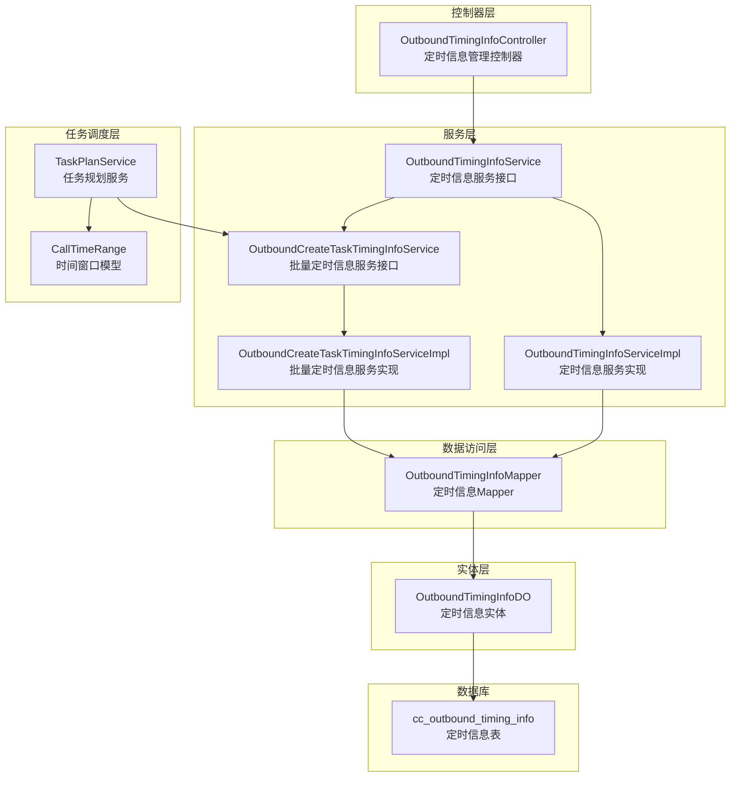
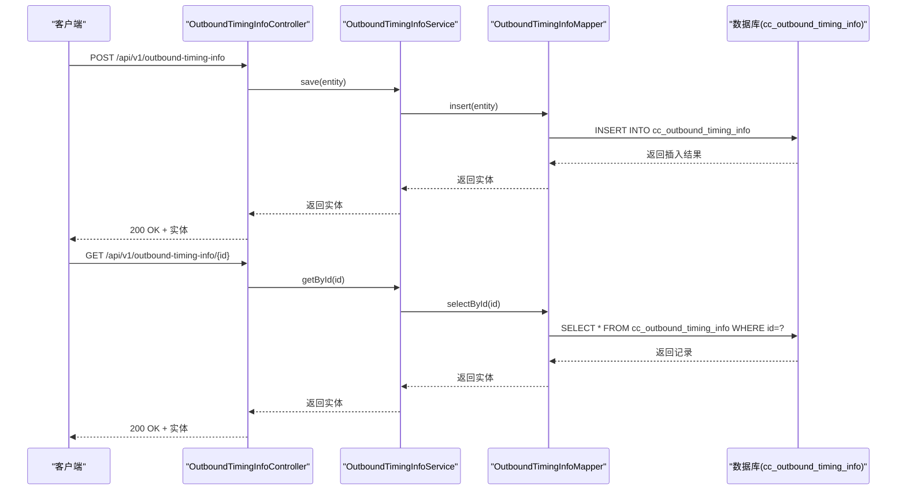
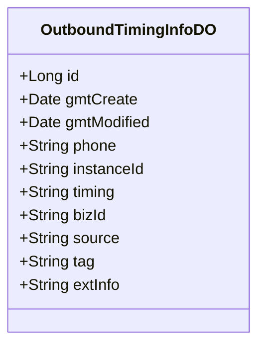
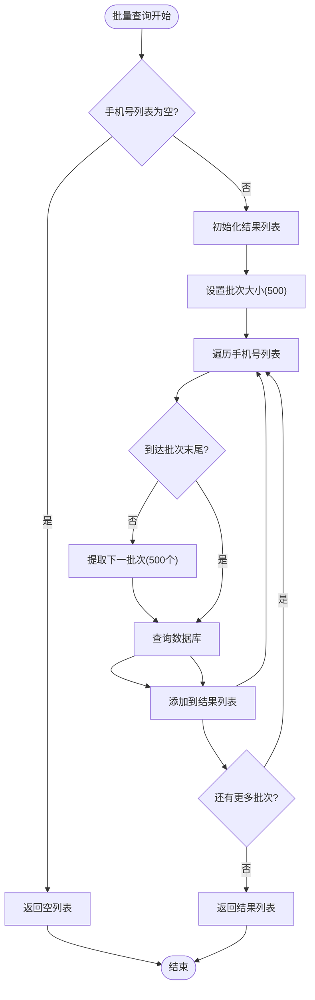
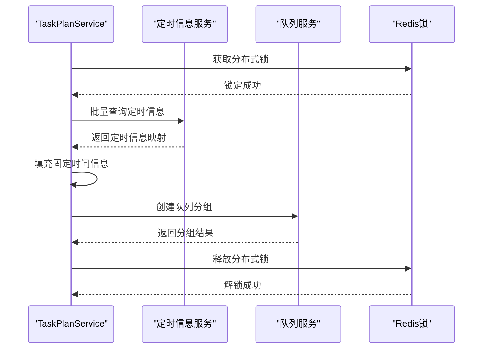
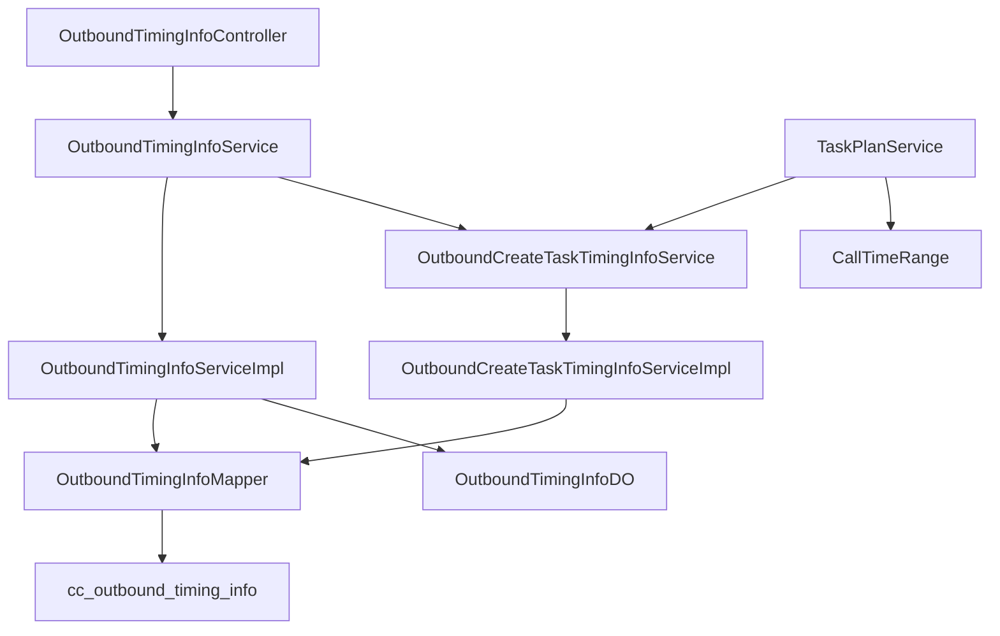

# 定时信息管理接口

<cite>
**本文档引用的文件**
- [OutboundTimingInfoController.java](file://src/main/java/org/qianye/controller/OutboundTimingInfoController.java)
- [OutboundTimingInfoService.java](file://src/main/java/org/qianye/service/OutboundTimingInfoService.java)
- [OutboundTimingInfoServiceImpl.java](file://src/main/java/org/qianye/service/impl/OutboundTimingInfoServiceImpl.java)
- [OutboundCreateTaskTimingInfoService.java](file://src/main/java/org/qianye/service/OutboundCreateTaskTimingInfoService.java)
- [OutboundCreateTaskTimingInfoServiceImpl.java](file://src/main/java/org/qianye/service/impl/OutboundCreateTaskTimingInfoServiceImpl.java)
- [OutboundTimingInfoDO.java](file://src/main/java/org/qianye/entity/OutboundTimingInfoDO.java)
- [OutboundTimingInfoMapper.java](file://src/main/java/org/qianye/mapper/OutboundTimingInfoMapper.java)
- [TaskPlanService.java](file://src/main/java/org/qianye/TaskPlanService.java)
- [CallTimeRange.java](file://src/main/java/org/qianye/CallTimeRange.java)
- [ScheduleConstants.java](file://src/main/java/org/qianye/ScheduleConstants.java)
- [application.properties](file://src/main/resources/application.properties)
- [outcall.sql](file://src/main/resources/outcall.sql)
</cite>

## 目录
1. [简介](#简介)
2. [项目结构](#项目结构)
3. [核心组件](#核心组件)
4. [架构概览](#架构概览)
5. [详细组件分析](#详细组件分析)
6. [依赖关系分析](#依赖关系分析)
7. [性能考虑](#性能考虑)
8. [故障排除指南](#故障排除指南)
9. [结论](#结论)
10. [附录](#附录)

## 简介
本文件为定时信息管理接口的详细API文档，涵盖外呼任务中定时配置的创建、删除、更新、查询和批量管理接口。文档重点说明定时信息的业务场景、配置参数和执行机制，提供每个接口的完整使用示例，包括时间窗口设置、重复规则配置和执行计划管理。同时记录定时信息与外呼任务的关联关系和触发条件，包含定时任务的调度精度、容错处理和异常恢复机制，并提供定时配置的验证规则、性能优化建议和监控告警的接口说明。

## 项目结构
定时信息管理接口位于后端服务的控制器层，通过服务层与数据访问层交互，最终持久化到数据库表中。系统还包含任务规划服务，用于将定时信息与外呼任务的执行计划相结合，实现按时间窗口触发的外呼调度。



**图表来源**
- [OutboundTimingInfoController.java](file://src/main/java/org/qianye/controller/OutboundTimingInfoController.java#L15-L56)
- [OutboundTimingInfoService.java](file://src/main/java/org/qianye/service/OutboundTimingInfoService.java#L6-L12)
- [OutboundTimingInfoServiceImpl.java](file://src/main/java/org/qianye/service/impl/OutboundTimingInfoServiceImpl.java#L13-L21)
- [OutboundCreateTaskTimingInfoService.java](file://src/main/java/org/qianye/service/OutboundCreateTaskTimingInfoService.java#L10-L16)
- [OutboundCreateTaskTimingInfoServiceImpl.java](file://src/main/java/org/qianye/service/impl/OutboundCreateTaskTimingInfoServiceImpl.java#L18-L48)
- [OutboundTimingInfoMapper.java](file://src/main/java/org/qianye/mapper/OutboundTimingInfoMapper.java#L7-L9)
- [OutboundTimingInfoDO.java](file://src/main/java/org/qianye/entity/OutboundTimingInfoDO.java#L12-L64)
- [TaskPlanService.java](file://src/main/java/org/qianye/TaskPlanService.java#L41-L75)
- [CallTimeRange.java](file://src/main/java/org/qianye/CallTimeRange.java#L14-L129)
- [outcall.sql](file://src/main/resources/outcall.sql#L95-L121)

**章节来源**
- [OutboundTimingInfoController.java](file://src/main/java/org/qianye/controller/OutboundTimingInfoController.java#L15-L56)
- [application.properties](file://src/main/resources/application.properties#L1-L17)

## 核心组件
定时信息管理涉及以下核心组件：
- 控制器：提供RESTful API端点，负责接收请求并返回响应结果
- 服务接口与实现：定义定时信息的业务逻辑，包括单条查询和批量查询
- 数据访问层：通过MyBatis-Plus操作数据库表cc_outbound_timing_info
- 实体类：映射数据库表结构，包含定时信息的关键字段
- 任务规划服务：将定时信息与外呼任务的执行计划结合，实现按时间窗口触发的外呼调度

**章节来源**
- [OutboundTimingInfoController.java](file://src/main/java/org/qianye/controller/OutboundTimingInfoController.java#L15-L56)
- [OutboundTimingInfoService.java](file://src/main/java/org/qianye/service/OutboundTimingInfoService.java#L6-L12)
- [OutboundTimingInfoServiceImpl.java](file://src/main/java/org/qianye/service/impl/OutboundTimingInfoServiceImpl.java#L13-L21)
- [OutboundCreateTaskTimingInfoService.java](file://src/main/java/org/qianye/service/OutboundCreateTaskTimingInfoService.java#L10-L16)
- [OutboundCreateTaskTimingInfoServiceImpl.java](file://src/main/java/org/qianye/service/impl/OutboundCreateTaskTimingInfoServiceImpl.java#L18-L48)
- [OutboundTimingInfoMapper.java](file://src/main/java/org/qianye/mapper/OutboundTimingInfoMapper.java#L7-L9)
- [OutboundTimingInfoDO.java](file://src/main/java/org/qianye/entity/OutboundTimingInfoDO.java#L12-L64)
- [TaskPlanService.java](file://src/main/java/org/qianye/TaskPlanService.java#L41-L75)

## 架构概览
定时信息管理采用典型的三层架构设计，控制器层负责HTTP请求处理，服务层封装业务逻辑，数据访问层负责数据库操作。系统通过Redis锁实现分布式锁控制，防止并发冲突。任务规划服务负责将定时信息与外呼任务的执行计划相结合，实现按时间窗口触发的外呼调度。



**图表来源**
- [OutboundTimingInfoController.java](file://src/main/java/org/qianye/controller/OutboundTimingInfoController.java#L23-L44)
- [OutboundTimingInfoService.java](file://src/main/java/org/qianye/service/OutboundTimingInfoService.java#L6-L12)
- [OutboundTimingInfoMapper.java](file://src/main/java/org/qianye/mapper/OutboundTimingInfoMapper.java#L7-L9)
- [outcall.sql](file://src/main/resources/outcall.sql#L95-L121)

## 详细组件分析

### API端点定义
系统提供完整的RESTful API端点，支持定时信息的增删改查和分页查询：

#### 创建定时信息
- **URL**: `POST /api/v1/outbound-timing-info`
- **功能**: 创建新的定时信息记录
- **请求体**: 定时信息实体对象
- **响应**: 创建成功的实体对象

#### 删除定时信息
- **URL**: `DELETE /api/v1/outbound-timing-info/{id}`
- **功能**: 根据ID删除定时信息记录
- **路径参数**: `id` - 定时信息ID
- **响应**: 成功状态

#### 更新定时信息
- **URL**: `PUT /api/v1/outbound-timing-info`
- **功能**: 更新现有定时信息记录
- **请求体**: 定时信息实体对象（需包含ID）
- **响应**: 更新后的实体对象

#### 查询单个定时信息
- **URL**: `GET /api/v1/outbound-timing-info/{id}`
- **功能**: 根据ID查询定时信息
- **路径参数**: `id` - 定时信息ID
- **响应**: 定时信息实体对象

#### 按手机号查询定时信息
- **URL**: `GET /api/v1/outbound-timing-info/phone`
- **功能**: 根据手机号查询定时信息
- **查询参数**: `phone` - 手机号
- **响应**: 定时信息实体对象

#### 分页查询定时信息
- **URL**: `GET /api/v1/outbound-timing-info/page`
- **功能**: 分页查询定时信息列表
- **查询参数**: 
  - `pageNum` - 页码，默认1
  - `pageSize` - 每页大小，默认20
- **响应**: 分页结果对象

**章节来源**
- [OutboundTimingInfoController.java](file://src/main/java/org/qianye/controller/OutboundTimingInfoController.java#L23-L55)

### 数据模型设计
定时信息实体类映射数据库表cc_outbound_timing_info，包含以下关键字段：



**图表来源**
- [OutboundTimingInfoDO.java](file://src/main/java/org/qianye/entity/OutboundTimingInfoDO.java#L12-L64)
- [outcall.sql](file://src/main/resources/outcall.sql#L95-L121)

#### 字段说明
- **id**: 主键，自增ID
- **gmtCreate**: 创建时间，自动填充
- **gmtModified**: 修改时间，自动填充
- **phone**: 手机号，唯一索引
- **instanceId**: 实例ID，标识所属实例
- **timing**: 时间段，格式为"HH:mm-HH:mm"
- **bizId**: 关联的来源业务ID
- **source**: 来源标识
- **tag**: 用户标签，多个标签以逗号分隔
- **extInfo**: 扩展参数

**章节来源**
- [OutboundTimingInfoDO.java](file://src/main/java/org/qianye/entity/OutboundTimingInfoDO.java#L18-L63)
- [outcall.sql](file://src/main/resources/outcall.sql#L95-L121)

### 批量查询机制
系统提供批量查询定时信息的能力，支持按手机号列表批量查询：



**图表来源**
- [OutboundCreateTaskTimingInfoServiceImpl.java](file://src/main/java/org/qianye/service/impl/OutboundCreateTaskTimingInfoServiceImpl.java#L24-L47)

**章节来源**
- [OutboundCreateTaskTimingInfoService.java](file://src/main/java/org/qianye/service/OutboundCreateTaskTimingInfoService.java#L10-L16)
- [OutboundCreateTaskTimingInfoServiceImpl.java](file://src/main/java/org/qianye/service/impl/OutboundCreateTaskTimingInfoServiceImpl.java#L24-L47)
- [ScheduleConstants.java](file://src/main/java/org/qianye/ScheduleConstants.java#L9-L14)

### 任务调度集成
定时信息与外呼任务的集成通过任务规划服务实现：



**图表来源**
- [TaskPlanService.java](file://src/main/java/org/qianye/TaskPlanService.java#L549-L586)
- [TaskPlanService.java](file://src/main/java/org/qianye/TaskPlanService.java#L1079-L1108)

**章节来源**
- [TaskPlanService.java](file://src/main/java/org/qianye/TaskPlanService.java#L549-L586)
- [TaskPlanService.java](file://src/main/java/org/qianye/TaskPlanService.java#L1079-L1108)

## 依赖关系分析



**图表来源**
- [OutboundTimingInfoController.java](file://src/main/java/org/qianye/controller/OutboundTimingInfoController.java#L20-L21)
- [OutboundTimingInfoServiceImpl.java](file://src/main/java/org/qianye/service/impl/OutboundTimingInfoServiceImpl.java#L13-L21)
- [OutboundCreateTaskTimingInfoServiceImpl.java](file://src/main/java/org/qianye/service/impl/OutboundCreateTaskTimingInfoServiceImpl.java#L18-L21)
- [TaskPlanService.java](file://src/main/java/org/qianye/TaskPlanService.java#L41-L41)

**章节来源**
- [OutboundTimingInfoController.java](file://src/main/java/org/qianye/controller/OutboundTimingInfoController.java#L20-L21)
- [OutboundTimingInfoServiceImpl.java](file://src/main/java/org/qianye/service/impl/OutboundTimingInfoServiceImpl.java#L13-L21)
- [OutboundCreateTaskTimingInfoServiceImpl.java](file://src/main/java/org/qianye/service/impl/OutboundCreateTaskTimingInfoServiceImpl.java#L18-L21)

## 性能考虑
系统在设计时充分考虑了性能优化：

### 批量查询优化
- **批次大小**: 默认500个手机号为一批，避免IN子句过长
- **分页查询**: 支持大数据量的分页处理
- **内存控制**: 使用流式处理减少内存占用

### 并发控制
- **分布式锁**: 使用Redis实现分布式锁，防止并发冲突
- **超时控制**: 锁超时时间为120秒，避免死锁
- **重试机制**: 支持锁获取失败时的重试

### 缓存策略
- **时间窗口缓存**: 任务时间范围信息缓存到Redis
- **批量查询缓存**: 定时信息查询结果缓存
- **过期策略**: 合理设置缓存过期时间

**章节来源**
- [OutboundCreateTaskTimingInfoServiceImpl.java](file://src/main/java/org/qianye/service/impl/OutboundCreateTaskTimingInfoServiceImpl.java#L29-L31)
- [TaskPlanService.java](file://src/main/java/org/qianye/TaskPlanService.java#L422-L424)

## 故障排除指南
系统提供了完善的错误处理和监控机制：

### 常见问题及解决方案
- **锁获取失败**: 检查Redis连接状态和锁超时设置
- **数据库连接异常**: 检查MySQL连接池配置
- **批量查询超时**: 调整批次大小和超时时间
- **定时信息不生效**: 检查时间窗口配置和当前时间

### 日志监控
- **操作日志**: 记录所有定时信息的操作日志
- **错误日志**: 记录异常情况和错误堆栈
- **性能日志**: 记录查询耗时和处理时间
- **业务日志**: 记录定时任务的执行情况

### 异常恢复机制
- **自动重试**: 关键操作支持自动重试
- **降级策略**: 系统异常时的降级处理
- **数据校验**: 入参和数据的完整性校验
- **事务回滚**: 数据库操作的事务控制

**章节来源**
- [TaskPlanService.java](file://src/main/java/org/qianye/TaskPlanService.java#L448-L456)
- [OutcallQueueGroupServiceImpl.java](file://src/main/java/org/qianye/service/impl/OutcallQueueGroupServiceImpl.java#L178-L183)

## 结论
定时信息管理接口提供了完整的外呼任务时间窗口管理能力，通过RESTful API实现了定时信息的全生命周期管理。系统采用分层架构设计，具备良好的可扩展性和性能表现。通过与任务规划服务的深度集成，实现了基于时间窗口的智能外呼调度，满足了复杂的业务需求。

## 附录

### API使用示例
以下为常见使用场景的示例说明：

#### 创建定时信息
```json
POST /api/v1/outbound-timing-info
{
  "phone": "13800001111",
  "instanceId": "instance_001",
  "timing": "09:00-18:00",
  "bizId": "lead_001",
  "source": "marketing_platform",
  "tag": "vip,premium",
  "extInfo": "{}"
}
```

#### 批量查询定时信息
```json
GET /api/v1/outbound-timing-info/page?pageNum=1&pageSize=50
```

#### 时间窗口配置
- **格式**: "HH:mm-HH:mm"
- **支持跨天**: 如"23:00-02:00"
- **多时间段**: 可配置多个时间段
- **时区**: 使用系统默认时区

### 验证规则
- **手机号格式**: 支持中国大陆手机号格式
- **时间格式**: 必须符合"HH:mm-HH:mm"格式
- **唯一性**: 手机号在数据库中唯一
- **长度限制**: 各字段长度限制在合理范围内

### 监控告警
- **查询性能**: 监控批量查询耗时
- **锁竞争**: 监控锁获取成功率
- **数据库负载**: 监控SQL执行时间和连接数
- **业务指标**: 监控定时任务执行成功率

**章节来源**
- [CallTimeRange.java](file://src/main/java/org/qianye/CallTimeRange.java#L61-L113)
- [outcall.sql](file://src/main/resources/outcall.sql#L95-L121)