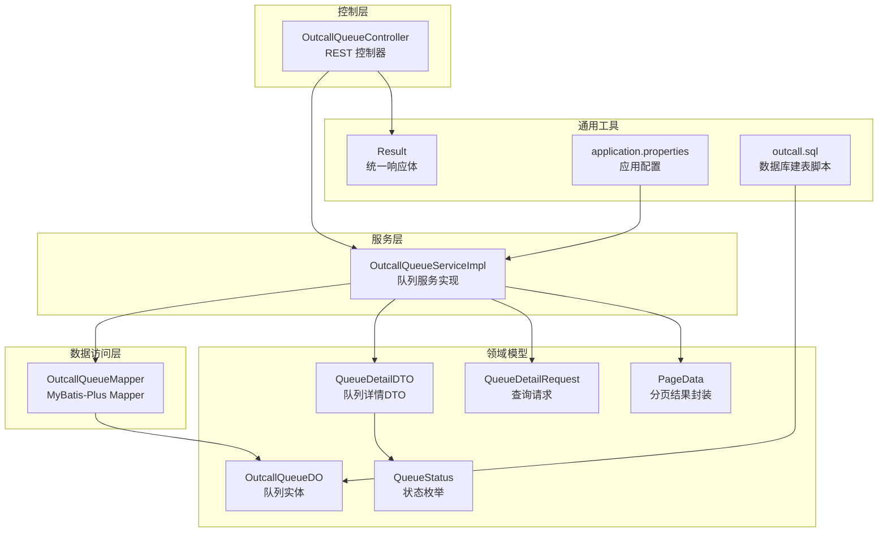
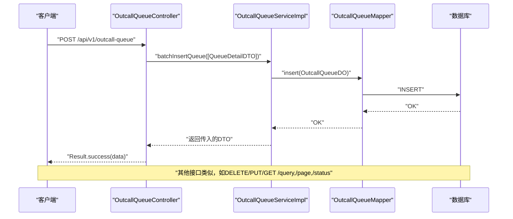
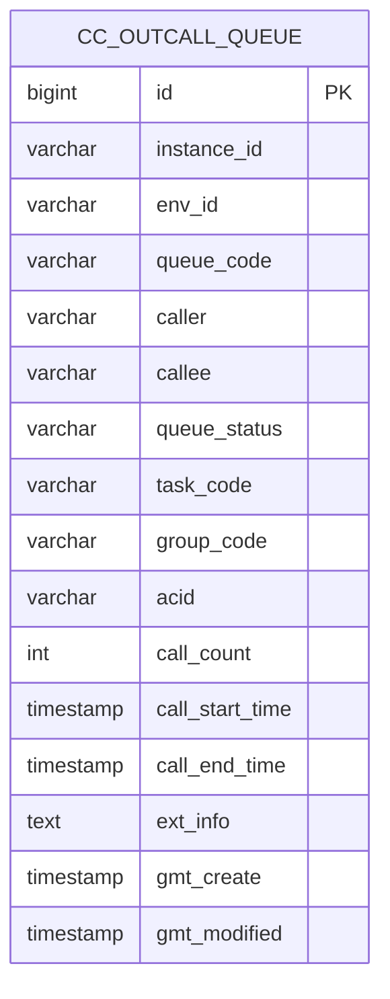
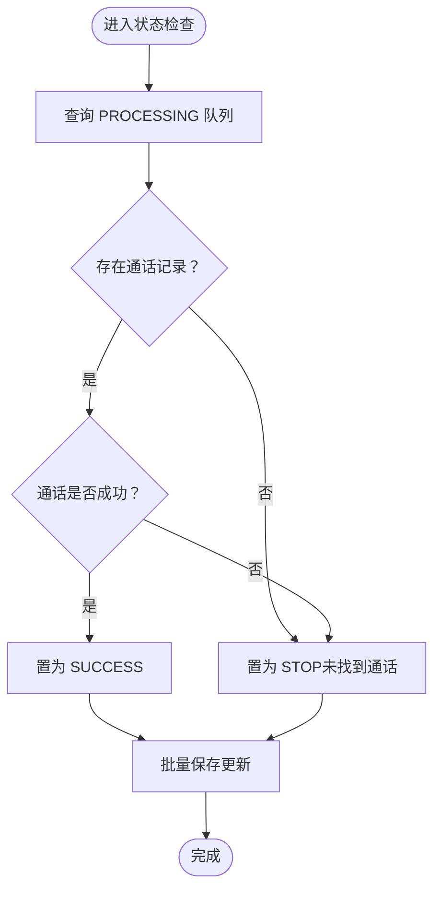
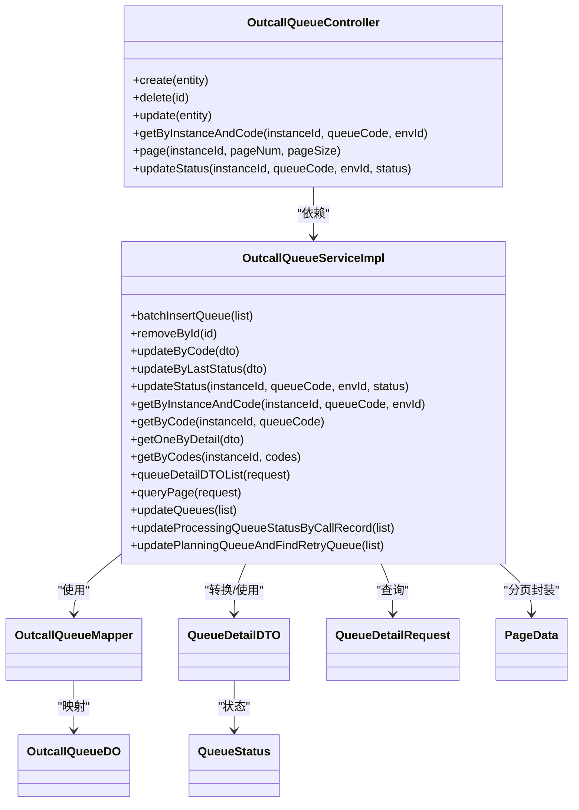
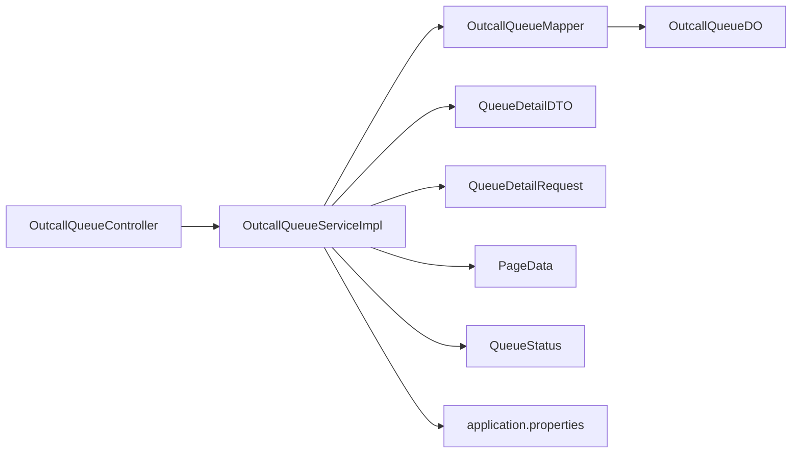

# 队列管理接口

<cite>
**本文引用的文件**
- [OutcallQueueController.java](file://src/main/java/org/qianye/controller/OutcallQueueController.java)
- [OutcallQueueServiceImpl.java](file://src/main/java/org/qianye/service/impl/OutcallQueueServiceImpl.java)
- [OutcallQueueDO.java](file://src/main/java/org/qianye/entity/OutcallQueueDO.java)
- [OutcallQueueMapper.java](file://src/main/java/org/qianye/mapper/OutcallQueueMapper.java)
- [QueueDetailDTO.java](file://src/main/java/org/qianye/QueueDetailDTO.java)
- [QueueDetailRequest.java](file://src/main/java/org/qianye/QueueDetailRequest.java)
- [QueueStatus.java](file://src/main/java/org/qianye/QueueStatus.java)
- [PageData.java](file://src/main/java/org/qianye/PageData.java)
- [Result.java](file://src/main/java/org/qianye/common/Result.java)
- [application.properties](file://src/main/resources/application.properties)
- [outcall.sql](file://src/main/resources/outcall.sql)
- [CommonConstants.java](file://src/main/java/org/qianye/CommonConstants.java)
- [ScheduleConstants.java](file://src/main/java/org/qianye/ScheduleConstants.java)
</cite>

## 目录
1. [简介](#简介)
2. [项目结构](#项目结构)
3. [核心组件](#核心组件)
4. [架构总览](#架构总览)
5. [详细组件分析](#详细组件分析)
6. [依赖分析](#依赖分析)
7. [性能考量](#性能考量)
8. [故障排查指南](#故障排查指南)
9. [结论](#结论)
10. [附录](#附录)

## 简介
本文件为“队列管理接口”的全面 API 文档，覆盖队列实体的数据结构、字段含义与业务规则，以及与任务之间的关联关系。文档详细说明了队列的创建、删除、更新、查询与分页查询接口，包含队列状态管理、批量操作与条件查询能力；并提供统一响应体规范、最佳实践、性能优化建议与常见错误处理策略。同时，结合现有实现，给出队列监控与统计查询的可用能力说明。

## 项目结构
围绕队列管理的核心模块由以下层次构成：
- 控制层：对外暴露 RESTful 接口，负责参数接收与统一响应包装
- 服务层：实现业务逻辑，包括状态检查、通话记录联动、分页查询、批量插入等
- 数据访问层：基于 MyBatis-Plus 的 Mapper 接口，提供数据库 CRUD 能力
- 实体与模型：队列实体、请求/响应 DTO、分页封装类、状态枚举
- 配置与资源：应用配置、数据库建表脚本

图表来源
- [OutcallQueueController.java](file://src/main/java/org/qianye/controller/OutcallQueueController.java#L1-L71)
- [OutcallQueueServiceImpl.java](file://src/main/java/org/qianye/service/impl/OutcallQueueServiceImpl.java#L1-L800)
- [OutcallQueueMapper.java](file://src/main/java/org/qianye/mapper/OutcallQueueMapper.java#L1-L10)
- [OutcallQueueDO.java](file://src/main/java/org/qianye/entity/OutcallQueueDO.java#L1-L105)
- [QueueDetailDTO.java](file://src/main/java/org/qianye/QueueDetailDTO.java#L1-L62)
- [QueueDetailRequest.java](file://src/main/java/org/qianye/QueueDetailRequest.java#L1-L29)
- [PageData.java](file://src/main/java/org/qianye/PageData.java#L1-L24)
- [QueueStatus.java](file://src/main/java/org/qianye/QueueStatus.java#L1-L10)
- [Result.java](file://src/main/java/org/qianye/common/Result.java#L1-L36)
- [application.properties](file://src/main/resources/application.properties#L1-L17)
- [outcall.sql](file://src/main/resources/outcall.sql#L1-L41)

章节来源
- [OutcallQueueController.java](file://src/main/java/org/qianye/controller/OutcallQueueController.java#L1-L71)
- [OutcallQueueServiceImpl.java](file://src/main/java/org/qianye/service/impl/OutcallQueueServiceImpl.java#L1-L800)
- [application.properties](file://src/main/resources/application.properties#L1-L17)

## 核心组件
- 队列实体 OutcallQueueDO：持久化存储队列记录，包含实例标识、环境标识、队列编码、主被叫、状态、任务/分组关联、通话 ID、计数与时点、扩展信息及时间戳等字段
- 队列详情 DTO QueueDetailDTO：面向接口层的传输对象，包含状态枚举、扩展信息 Map、固定时间字段、时间戳等
- 查询请求 QueueDetailRequest：支持按任务编码、状态、时间范围、被叫列表、状态集合等条件查询
- 分页封装 PageData：统一分页返回结构
- 状态枚举 QueueStatus：WAITING、PLANNING、PROCESSING、FAILED、STOP
- 统一响应 Result：success/fail 统一包装，便于前端消费

章节来源
- [OutcallQueueDO.java](file://src/main/java/org/qianye/entity/OutcallQueueDO.java#L1-L105)
- [QueueDetailDTO.java](file://src/main/java/org/qianye/QueueDetailDTO.java#L1-L62)
- [QueueDetailRequest.java](file://src/main/java/org/qianye/QueueDetailRequest.java#L1-L29)
- [PageData.java](file://src/main/java/org/qianye/PageData.java#L1-L24)
- [QueueStatus.java](file://src/main/java/org/qianye/QueueStatus.java#L1-L10)
- [Result.java](file://src/main/java/org/qianye/common/Result.java#L1-L36)

## 架构总览
队列管理采用典型的三层架构：
- 控制层负责路由与参数校验，返回统一响应体
- 服务层承担业务编排，包括与通话记录服务联动、状态机推进、分页查询与批量写入
- 数据访问层通过 MyBatis-Plus 提供基础 CRUD 能力

图表来源
- [OutcallQueueController.java](file://src/main/java/org/qianye/controller/OutcallQueueController.java#L26-L70)
- [OutcallQueueServiceImpl.java](file://src/main/java/org/qianye/service/impl/OutcallQueueServiceImpl.java#L28-L588)
- [OutcallQueueMapper.java](file://src/main/java/org/qianye/mapper/OutcallQueueMapper.java#L1-L10)

## 详细组件分析

### 队列实体与数据模型
- 表名：cc_outcall_queue
- 主键：自增 id
- 关键字段与约束：
  - instance_id、queue_code、env_id 组成唯一索引，确保同一实例/队列/环境下的唯一性
  - queue_status 默认值为 waiting
  - ext_info 为文本字段，用于存放扩展信息
  - gmt_create/gmt_modified 记录创建与更新时间
- 字段与含义（节选）：
  - instanceId：实例标识
  - envId：环境标识
  - queueCode：队列编码
  - caller/callee：主被叫
  - queueStatus：队列状态（WAITING/PLANNING/PROCESSING/FAILED/STOP）
  - taskCode/groupCode：关联任务与分组编码
  - acid：通话 ID
  - callCount：呼叫次数
  - callStartTime/callEndTime：呼叫起止时间
  - extInfo：扩展信息
  - gmtCreate/gmtModified：创建与更新时间

图表来源
- [outcall.sql](file://src/main/resources/outcall.sql#L1-L41)

章节来源
- [OutcallQueueDO.java](file://src/main/java/org/qianye/entity/OutcallQueueDO.java#L1-L105)
- [outcall.sql](file://src/main/resources/outcall.sql#L1-L41)

### 队列状态管理与业务规则
- 状态枚举：WAITING（待调度）、PLANNING（已排程）、PROCESSING（处理中）、FAILED（失败）、STOP（停止）
- 状态更新策略：
  - 单条更新：按 instanceId、queueCode、envId 定位，设置 queueStatus
  - 按最后状态更新：仅在 lastQueueStatus 匹配时更新，避免并发覆盖
  - 批量更新：将 DTO 列表转换为 DO 并逐条更新
- 与通话记录联动：
  - 对 PROCESSING 状态队列，依据 acid 或 callee 查询通话记录，成功则置为 SUCCESS，否则置为 STOP
  - 对 PLANNING 状态队列，匹配通话记录中的任务记录编码，填充主被叫、通话时间、状态等

图表来源
- [OutcallQueueServiceImpl.java](file://src/main/java/org/qianye/service/impl/OutcallQueueServiceImpl.java#L154-L213)
- [CommonConstants.java](file://src/main/java/org/qianye/CommonConstants.java#L1-L17)

章节来源
- [QueueStatus.java](file://src/main/java/org/qianye/QueueStatus.java#L1-L10)
- [OutcallQueueServiceImpl.java](file://src/main/java/org/qianye/service/impl/OutcallQueueServiceImpl.java#L52-L588)

### API 接口清单与规范

- 基础路径
  - /api/v1/outcall-queue

- 统一响应体
  - 成功：success=true，code=200，data 为具体数据
  - 失败：success=false，code/message 描述错误原因

章节来源
- [Result.java](file://src/main/java/org/qianye/common/Result.java#L1-L36)

#### 1) 创建队列
- 方法与路径
  - POST /api/v1/outcall-queue
- 请求体
  - QueueDetailDTO（见“核心组件”与“模型定义”）
- 响应
  - Result<QueueDetailDTO>
- 说明
  - 服务端执行批量插入（单条场景即为批量长度为 1）

章节来源
- [OutcallQueueController.java](file://src/main/java/org/qianye/controller/OutcallQueueController.java#L26-L30)
- [OutcallQueueServiceImpl.java](file://src/main/java/org/qianye/service/impl/OutcallQueueServiceImpl.java#L28-L64)

#### 2) 删除队列
- 方法与路径
  - DELETE /api/v1/outcall-queue/{id}
- 路径参数
  - id：Long
- 响应
  - Result<Void>

章节来源
- [OutcallQueueController.java](file://src/main/java/org/qianye/controller/OutcallQueueController.java#L32-L36)
- [OutcallQueueServiceImpl.java](file://src/main/java/org/qianye/service/impl/OutcallQueueServiceImpl.java#L62-L64)

#### 3) 更新队列
- 方法与路径
  - PUT /api/v1/outcall-queue
- 请求体
  - QueueDetailDTO（包含 instanceId、taskCode、queueCode、envId、status、extInfo 等）
- 响应
  - Result<QueueDetailDTO>
- 说明
  - 服务端按 instanceId、taskCode、queueCode、envId 定位并更新

章节来源
- [OutcallQueueController.java](file://src/main/java/org/qianye/controller/OutcallQueueController.java#L38-L42)
- [OutcallQueueServiceImpl.java](file://src/main/java/org/qianye/service/impl/OutcallQueueServiceImpl.java#L564-L588)

#### 4) 条件查询（按实例+队列+环境）
- 方法与路径
  - GET /api/v1/outcall-queue/query
- 查询参数
  - instanceId、queueCode、envId
- 响应
  - Result<QueueDetailDTO>

章节来源
- [OutcallQueueController.java](file://src/main/java/org/qianye/controller/OutcallQueueController.java#L45-L50)
- [OutcallQueueServiceImpl.java](file://src/main/java/org/qianye/service/impl/OutcallQueueServiceImpl.java#L44-L50)

#### 5) 分页查询
- 方法与路径
  - GET /api/v1/outcall-queue/page
- 查询参数
  - instanceId（必填）、pageNum（默认 1）、pageSize（默认 20）
- 请求体
  - QueueDetailRequest（包含 instanceId、taskCode、status、startTime、endTime、calleeList、queueStatusList）
- 响应
  - Result<PageData<List<QueueDetailDTO>>>

章节来源
- [OutcallQueueController.java](file://src/main/java/org/qianye/controller/OutcallQueueController.java#L52-L61)
- [OutcallQueueServiceImpl.java](file://src/main/java/org/qianye/service/impl/OutcallQueueServiceImpl.java#L377-L471)

#### 6) 更新队列状态
- 方法与路径
  - PUT /api/v1/outcall-queue/status
- 查询参数
  - instanceId、queueCode、envId、status（枚举值：WAITING/PLANNING/PROCESSING/FAILED/STOP）
- 响应
  - Result<Boolean>

章节来源
- [OutcallQueueController.java](file://src/main/java/org/qianye/controller/OutcallQueueController.java#L63-L69)
- [OutcallQueueServiceImpl.java](file://src/main/java/org/qianye/service/impl/OutcallQueueServiceImpl.java#L52-L59)

### 模型定义与字段说明

- QueueDetailDTO
  - instanceId、taskCode、groupCode、queueCode、callee、caller、acid、callCount、status、extInfo、fixedTime、fixedStartTime、envId、gmtCreate、gmtModified、callStartTime、callEndTime、lastQueueStatus

- QueueDetailRequest
  - instanceId、taskCode、env、pageNum、pageSize、status、endTime、startTime、calleeList、queueStatusList

- PageData
  - list、total、pageNum、pageSize

章节来源
- [QueueDetailDTO.java](file://src/main/java/org/qianye/QueueDetailDTO.java#L1-L62)
- [QueueDetailRequest.java](file://src/main/java/org/qianye/QueueDetailRequest.java#L1-L29)
- [PageData.java](file://src/main/java/org/qianye/PageData.java#L1-L24)

### 类关系图（代码级）

图表来源
- [OutcallQueueController.java](file://src/main/java/org/qianye/controller/OutcallQueueController.java#L1-L71)
- [OutcallQueueServiceImpl.java](file://src/main/java/org/qianye/service/impl/OutcallQueueServiceImpl.java#L1-L800)
- [OutcallQueueMapper.java](file://src/main/java/org/qianye/mapper/OutcallQueueMapper.java#L1-L10)
- [OutcallQueueDO.java](file://src/main/java/org/qianye/entity/OutcallQueueDO.java#L1-L105)
- [QueueDetailDTO.java](file://src/main/java/org/qianye/QueueDetailDTO.java#L1-L62)
- [QueueDetailRequest.java](file://src/main/java/org/qianye/QueueDetailRequest.java#L1-L29)
- [PageData.java](file://src/main/java/org/qianye/PageData.java#L1-L24)
- [QueueStatus.java](file://src/main/java/org/qianye/QueueStatus.java#L1-L10)

## 依赖分析
- 控制器依赖服务接口，服务实现依赖 Mapper 与实体
- 查询条件通过 LambdaQueryWrapper 动态拼装，支持多字段过滤与排序
- 环境标识 env 由配置注入，查询时默认按 env 过滤
- 批量查询对 IN 子句长度进行限制，避免 SQL 过长

图表来源
- [OutcallQueueController.java](file://src/main/java/org/qianye/controller/OutcallQueueController.java#L1-L71)
- [OutcallQueueServiceImpl.java](file://src/main/java/org/qianye/service/impl/OutcallQueueServiceImpl.java#L1-L800)
- [application.properties](file://src/main/resources/application.properties#L1-L17)

章节来源
- [OutcallQueueServiceImpl.java](file://src/main/java/org/qianye/service/impl/OutcallQueueServiceImpl.java#L377-L471)
- [application.properties](file://src/main/resources/application.properties#L1-L17)

## 性能考量
- 分页查询
  - 默认每页 20 条，支持按 gmtModified 倒序
  - 支持 startTime/endTime、status、queueStatusList、calleeList 等条件过滤
- 批量查询
  - 按被叫列表查询时，限制单次 IN 子句数量（参考常量），分批处理
- 批量更新
  - 将 DTO 转换为 DO 后逐条更新，适合小批量场景
- 状态检查
  - 对 PROCESSING 队列异步检查通话记录，避免阻塞主线程
- 环境隔离
  - 服务层默认按 env 过滤，避免跨环境误操作

章节来源
- [OutcallQueueServiceImpl.java](file://src/main/java/org/qianye/service/impl/OutcallQueueServiceImpl.java#L377-L471)
- [ScheduleConstants.java](file://src/main/java/org/qianye/ScheduleConstants.java#L1-L16)

## 故障排查指南
- 常见错误与处理
  - 参数缺失：如分页查询缺少 taskCode 会抛出异常，需确保 taskCode 必填
  - 被叫列表过大：超过限制会抛出异常，需分批传入
  - 状态非法：从字符串转枚举失败会记录告警日志，需检查传入状态值
  - 未找到通话记录：PROCESSING 队列若无对应通话记录，会被置为 STOP
- 日志与可观测性
  - 服务层广泛使用日志工具记录关键流程与耗时，便于定位问题
  - 状态检查与批量更新均输出详细上下文，便于审计

章节来源
- [OutcallQueueServiceImpl.java](file://src/main/java/org/qianye/service/impl/OutcallQueueServiceImpl.java#L377-L471)
- [OutcallQueueServiceImpl.java](file://src/main/java/org/qianye/service/impl/OutcallQueueServiceImpl.java#L154-L213)

## 结论
本队列管理接口以清晰的分层设计与统一响应体为基础，提供了完整的队列生命周期管理能力。通过与通话记录服务的联动，实现了对 PROCESSING/PLANNING 队列的状态自动化治理。配合分页查询、条件过滤与批量操作，满足了生产环境的高可用与高性能需求。建议在实际接入时严格遵循参数规范与状态枚举，合理规划分页与批量大小，充分利用环境隔离与日志定位能力。

## 附录

### 统一响应体结构
- 成功：success=true，code=200，data=业务数据
- 失败：success=false，code/message 描述错误

章节来源
- [Result.java](file://src/main/java/org/qianye/common/Result.java#L1-L36)

### 环境配置
- env：默认 test，服务层按此值过滤数据

章节来源
- [application.properties](file://src/main/resources/application.properties#L1-L17)
- [OutcallQueueServiceImpl.java](file://src/main/java/org/qianye/service/impl/OutcallQueueServiceImpl.java#L30-L31)