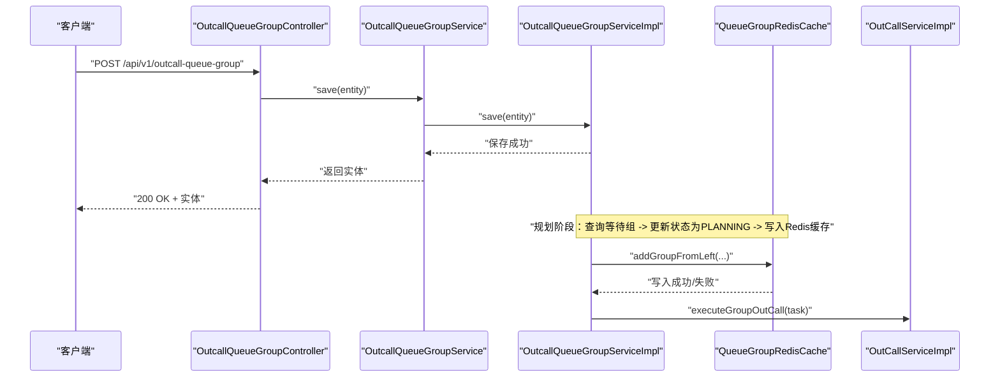
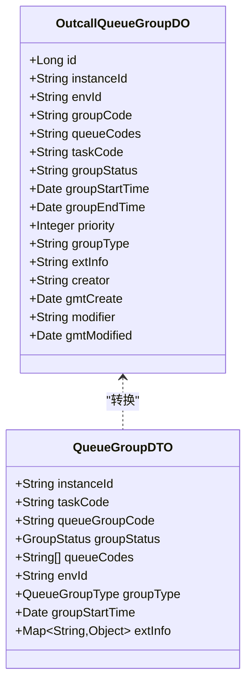
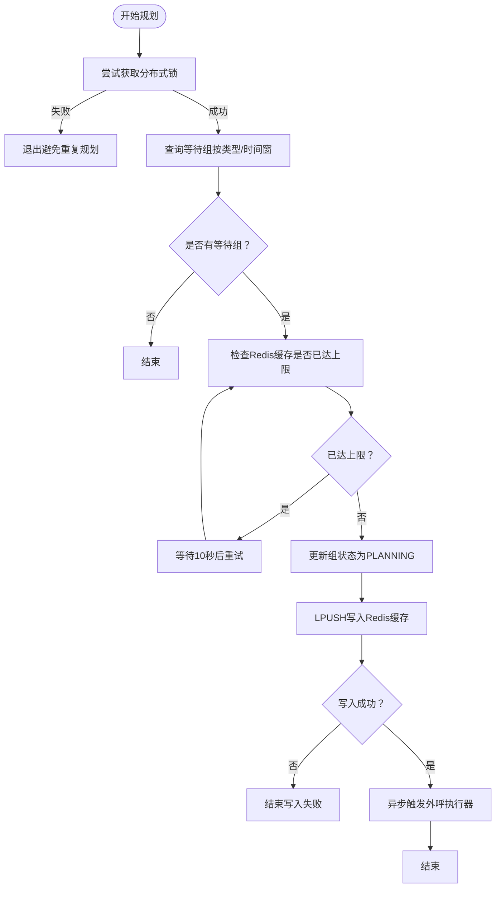
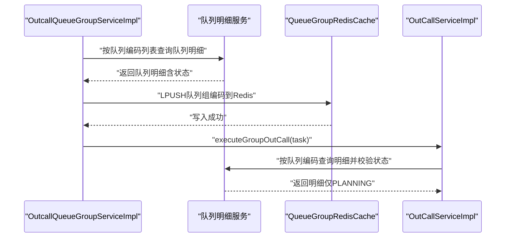
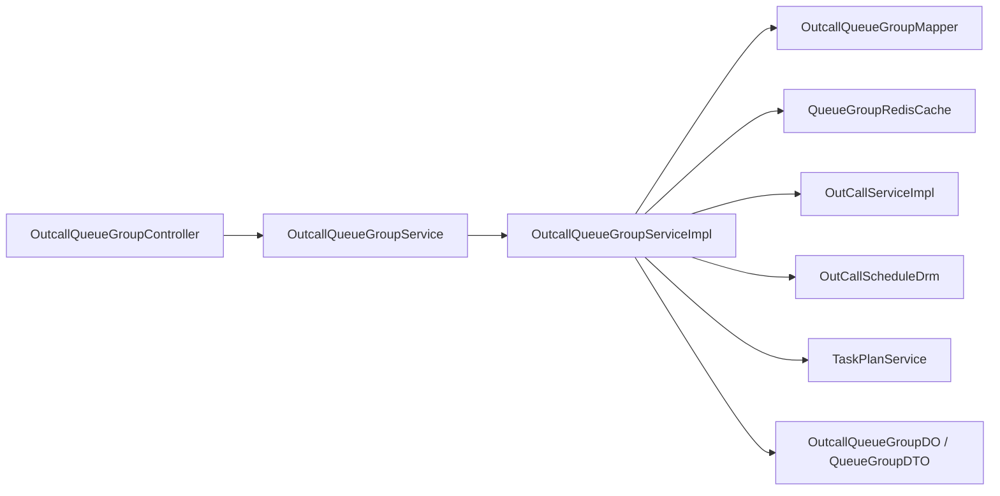

# 队列组管理接口

<cite>
**本文引用的文件**
- [OutcallQueueGroupController.java](file://src/main/java/org/qianye/controller/OutcallQueueGroupController.java)
- [OutcallQueueGroupService.java](file://src/main/java/org/qianye/service/OutcallQueueGroupService.java)
- [OutcallQueueGroupServiceImpl.java](file://src/main/java/org/qianye/service/impl/OutcallQueueGroupServiceImpl.java)
- [OutcallQueueGroupDO.java](file://src/main/java/org/qianye/entity/OutcallQueueGroupDO.java)
- [OutcallQueueGroupMapper.java](file://src/main/java/org/qianye/mapper/OutcallQueueGroupMapper.java)
- [QueueGroupDTO.java](file://src/main/java/org/qianye/QueueGroupDTO.java)
- [QueueGroupRequest.java](file://src/main/java/org/qianye/QueueGroupRequest.java)
- [GroupStatus.java](file://src/main/java/org/qianye/GroupStatus.java)
- [QueueGroupType.java](file://src/main/java/org/qianye/QueueGroupType.java)
- [QueueGroupRedisCache.java](file://src/main/java/org/qianye/QueueGroupRedisCache.java)
- [OutCallServiceImpl.java](file://src/main/java/org/qianye/OutCallServiceImpl.java)
- [OutCallScheduleDrm.java](file://src/main/java/org/qianye/OutCallScheduleDrm.java)
- [application.properties](file://src/main/resources/application.properties)
</cite>

## 目录
1. [简介](#简介)
2. [项目结构](#项目结构)
3. [核心组件](#核心组件)
4. [架构总览](#架构总览)
5. [详细组件分析](#详细组件分析)
6. [依赖分析](#依赖分析)
7. [性能考量](#性能考量)
8. [故障排查指南](#故障排查指南)
9. [结论](#结论)
10. [附录](#附录)

## 简介
本文件为“队列组管理接口”的权威技术文档，覆盖以下范围：
- 队列组的 RESTful API 端点：创建、删除、更新、按 ID 查询、按实例+环境+组编码查询、分页查询、状态更新。
- 队列组实体设计：字段语义、业务约束、与队列的层级关系。
- 调度策略与运行机制：普通组、择时组、重试组的规划流程；与 Redis 缓存的交互；状态流转与故障转移。
- 平滑切换与负载均衡：基于 Redis 的队列组缓存与弹出策略；线程池与限流控制。
- 运维与监控：关键配置项、日志与告警点位。

## 项目结构
围绕队列组管理的关键模块如下：
- 控制层：提供 REST API，接收请求并返回统一结果包装。
- 服务层：定义队列组业务契约，包含状态检查、分页查询、插入/更新等。
- 服务实现层：具体执行逻辑，包括规划、状态检查、与 Redis 缓存交互、与外呼执行器协作。
- 数据模型：持久化实体与 DTO 映射，支持查询请求封装。
- 配置与缓存：调度参数、Redis 缓存键空间与 Lua 原子操作。

```mermaid
graph TB
subgraph "控制层"
C1["OutcallQueueGroupController"]
end
subgraph "服务层"
S1["OutcallQueueGroupService"]
S2["OutcallQueueGroupServiceImpl"]
end
subgraph "数据层"
M1["OutcallQueueGroupMapper"]
E1["OutcallQueueGroupDO"]
end
subgraph "模型与配置"
D1["QueueGroupDTO"]
R1["QueueGroupRequest"]
G1["GroupStatus 枚举"]
T1["QueueGroupType 枚举"]
C2["OutCallScheduleDrm"]
RC["QueueGroupRedisCache"]
end
subgraph "执行与监控"
O1["OutCallServiceImpl"]
end
C1 --> S1
S1 < --> S2
S2 --> M1
M1 --> E1
S2 --> D1
S2 --> R1
S2 --> G1
S2 --> T1
S2 --> RC
S2 --> C2
S2 --> O1
```

图表来源
- [OutcallQueueGroupController.java](file://src/main/java/org/qianye/controller/OutcallQueueGroupController.java#L1-L70)
- [OutcallQueueGroupService.java](file://src/main/java/org/qianye/service/OutcallQueueGroupService.java#L1-L78)
- [OutcallQueueGroupServiceImpl.java](file://src/main/java/org/qianye/service/impl/OutcallQueueGroupServiceImpl.java#L1-L120)
- [OutcallQueueGroupMapper.java](file://src/main/java/org/qianye/mapper/OutcallQueueGroupMapper.java#L1-L10)
- [OutcallQueueGroupDO.java](file://src/main/java/org/qianye/entity/OutcallQueueGroupDO.java#L1-L95)
- [QueueGroupDTO.java](file://src/main/java/org/qianye/QueueGroupDTO.java#L1-L43)
- [QueueGroupRequest.java](file://src/main/java/org/qianye/QueueGroupRequest.java#L1-L25)
- [GroupStatus.java](file://src/main/java/org/qianye/GroupStatus.java#L1-L9)
- [QueueGroupType.java](file://src/main/java/org/qianye/QueueGroupType.java#L1-L11)
- [OutCallScheduleDrm.java](file://src/main/java/org/qianye/OutCallScheduleDrm.java#L1-L113)
- [QueueGroupRedisCache.java](file://src/main/java/org/qianye/QueueGroupRedisCache.java#L1-L279)
- [OutCallServiceImpl.java](file://src/main/java/org/qianye/OutCallServiceImpl.java#L127-L217)

章节来源
- [OutcallQueueGroupController.java](file://src/main/java/org/qianye/controller/OutcallQueueGroupController.java#L1-L70)
- [OutcallQueueGroupService.java](file://src/main/java/org/qianye/service/OutcallQueueGroupService.java#L1-L78)
- [OutcallQueueGroupServiceImpl.java](file://src/main/java/org/qianye/service/impl/OutcallQueueGroupServiceImpl.java#L1-L120)

## 核心组件
- 控制器：提供 REST API，负责参数校验、调用服务层并返回统一结果包装。
- 服务接口：定义队列组的查询、分页、状态变更、规划与检查等能力。
- 服务实现：承载复杂调度逻辑，包括普通组/择时组规划、状态检查、与 Redis 缓存交互、与外呼执行器协作。
- 实体与映射：持久化实体与 DTO 的双向转换，支持查询请求封装。
- 缓存与配置：Redis 缓存键空间与 Lua 原子操作，调度参数集中配置。

章节来源
- [OutcallQueueGroupController.java](file://src/main/java/org/qianye/controller/OutcallQueueGroupController.java#L1-L70)
- [OutcallQueueGroupService.java](file://src/main/java/org/qianye/service/OutcallQueueGroupService.java#L1-L78)
- [OutcallQueueGroupServiceImpl.java](file://src/main/java/org/qianye/service/impl/OutcallQueueGroupServiceImpl.java#L1-L120)
- [OutcallQueueGroupDO.java](file://src/main/java/org/qianye/entity/OutcallQueueGroupDO.java#L1-L95)
- [QueueGroupDTO.java](file://src/main/java/org/qianye/QueueGroupDTO.java#L1-L43)
- [QueueGroupRequest.java](file://src/main/java/org/qianye/QueueGroupRequest.java#L1-L25)
- [QueueGroupRedisCache.java](file://src/main/java/org/qianye/QueueGroupRedisCache.java#L1-L279)
- [OutCallScheduleDrm.java](file://src/main/java/org/qianye/OutCallScheduleDrm.java#L1-L113)

## 架构总览
队列组管理贯穿“控制层-服务层-数据层-缓存与执行器”四层，形成闭环：
- 控制层接收请求，调用服务层。
- 服务实现层执行业务规则：查询等待组、更新状态、写入 Redis 缓存、触发外呼执行。
- 数据层通过 Mapper 持久化实体。
- 缓存层通过 Redis 提供高性能的队列组弹出与容量控制。
- 执行器层负责实际外呼流程与限流控制。



图表来源
- [OutcallQueueGroupController.java](file://src/main/java/org/qianye/controller/OutcallQueueGroupController.java#L23-L27)
- [OutcallQueueGroupServiceImpl.java](file://src/main/java/org/qianye/service/impl/OutcallQueueGroupServiceImpl.java#L171-L271)
- [QueueGroupRedisCache.java](file://src/main/java/org/qianye/QueueGroupRedisCache.java#L86-L114)
- [OutCallServiceImpl.java](file://src/main/java/org/qianye/OutCallServiceImpl.java#L127-L150)

## 详细组件分析

### REST API 定义与使用示例
- 创建队列组
  - 方法与路径：POST /api/v1/outcall-queue-group
  - 请求体：队列组实体（包含实例ID、环境ID、组编码、队列编码列表、组类型、开始时间、优先级、扩展信息等）
  - 成功响应：返回创建后的实体
  - 示例场景：批量导入队列组，设置组类型为 NORMAL 或 FIXED_TIME，并填充队列编码列表
- 删除队列组
  - 方法与路径：DELETE /api/v1/outcall-queue-group/{id}
  - 路径参数：id（数据库自增主键）
  - 成功响应：无内容
  - 示例场景：清理历史或错误配置的队列组
- 更新队列组
  - 方法与路径：PUT /api/v1/outcall-queue-group
  - 请求体：队列组实体（可更新除组编码外的所有字段）
  - 成功响应：返回更新后的实体
  - 示例场景：调整优先级、扩展信息或组类型
- 按 ID 查询
  - 方法与路径：GET /api/v1/outcall-queue-group/{id}
  - 路径参数：id
  - 成功响应：返回对应实体
  - 示例场景：前端展示详情或二次编辑
- 按实例+环境+组编码查询
  - 方法与路径：GET /api/v1/outcall-queue-group/query
  - 查询参数：instanceId、envId、groupCode
  - 成功响应：返回对应实体
  - 示例场景：幂等写入前先查询是否存在
- 分页查询（按任务维度）
  - 方法与路径：GET /api/v1/outcall-queue-group/page
  - 查询参数：instanceId、taskCode、envId、pageNum、pageSize
  - 成功响应：分页结果（包含记录列表、页码、页大小、总数）
  - 示例场景：后台管理页面展示任务下的所有队列组
- 更新队列组状态
  - 方法与路径：PUT /api/v1/outcall-queue-group/status
  - 查询参数：instanceId、envId、groupCode、status（WAITING/PROCESSING/PLANNING/STOP）
  - 成功响应：布尔值表示是否成功
  - 示例场景：手动干预队列组状态，或外部系统触发状态变更

章节来源
- [OutcallQueueGroupController.java](file://src/main/java/org/qianye/controller/OutcallQueueGroupController.java#L23-L68)

### 队列组实体设计与字段说明
- 实体 OutcallQueueGroupDO 字段
  - id：自增主键
  - instanceId：实例标识
  - envId：环境标识（如预发/生产）
  - groupCode：组编码（唯一标识一个队列组）
  - queueCodes：组内队列编码集合（以逗号分隔）
  - taskCode：任务编码
  - groupStatus：组状态（WAITING/PROCESSING/PLANNING/STOP）
  - groupStartTime/groupEndTime：组开始/结束时间（择时组常用）
  - priority：优先级（数值越大优先级越高）
  - groupType：组类型（NORMAL/FIXED_TIME/RETRY）
  - extInfo：扩展信息（JSON 字符串）
  - creator/modifier/gmtCreate/gmtModified：创建与修改元数据
- DTO QueueGroupDTO 字段
  - instanceId/taskCode/queueGroupCode：上下文与标识
  - groupStatus：组状态（枚举）
  - queueCodes：队列编码列表
  - envId/groupType/groupStartTime：环境、类型与开始时间
  - extInfo：扩展信息（Map）
  - callTimeRange/startTime/endTime：与任务时间窗相关的辅助字段



图表来源
- [OutcallQueueGroupDO.java](file://src/main/java/org/qianye/entity/OutcallQueueGroupDO.java#L1-L95)
- [QueueGroupDTO.java](file://src/main/java/org/qianye/QueueGroupDTO.java#L1-L43)

章节来源
- [OutcallQueueGroupDO.java](file://src/main/java/org/qianye/entity/OutcallQueueGroupDO.java#L1-L95)
- [QueueGroupDTO.java](file://src/main/java/org/qianye/QueueGroupDTO.java#L1-L43)

### 调度策略与状态管理
- 组类型
  - NORMAL：常规组，按任务时间窗内的等待组进行规划
  - FIXED_TIME：择时组，按小时粒度的时间桶进行规划
  - RETRY：重试组，由故障转移生成
- 状态流转
  - WAITING → PLANNING：服务实现层将等待组更新为 PLANNING 并写入 Redis 缓存
  - PLANNING → PROCESSING：外呼执行器从缓存弹出组并标记为 PROCESSING
  - PROCESSING → STOP：若机器宕机或超时未续锁，服务实现层将组置为 STOP 并触发重试组生成
- 规划流程（普通组/择时组）
  - 加分布式锁，防止并发重复规划
  - 查询等待组（按类型、时间窗等条件）
  - 判断缓存是否达到上限，必要时等待后重试
  - 将组状态更新为 PLANNING，写入 Redis 左推（LPUSH）并设置过期
  - 异步触发外呼执行器执行组外呼



图表来源
- [OutcallQueueGroupServiceImpl.java](file://src/main/java/org/qianye/service/impl/OutcallQueueGroupServiceImpl.java#L171-L271)
- [QueueGroupRedisCache.java](file://src/main/java/org/qianye/QueueGroupRedisCache.java#L86-L114)

章节来源
- [OutcallQueueGroupServiceImpl.java](file://src/main/java/org/qianye/service/impl/OutcallQueueGroupServiceImpl.java#L171-L271)
- [QueueGroupRedisCache.java](file://src/main/java/org/qianye/QueueGroupRedisCache.java#L86-L114)

### 队列组与队列的层级关系与数据同步
- 层级关系
  - 一个队列组包含多个队列（queueCodes 为逗号分隔的队列编码列表）
  - 队列组与任务（taskCode）强关联，便于按任务维度进行规划与查询
- 数据同步机制
  - 队列明细状态与队列组状态保持一致：只有处于 PLANNING 的队列才会被纳入组
  - 外呼执行器在弹出组后，会再次校验队列状态，确保只处理规划中的队列
  - 故障转移：当组在规定时间内未续锁，服务实现层将其置为 STOP，并生成 RETRY 组



图表来源
- [OutcallQueueGroupServiceImpl.java](file://src/main/java/org/qianye/service/impl/OutcallQueueGroupServiceImpl.java#L171-L271)
- [OutCallServiceImpl.java](file://src/main/java/org/qianye/OutCallServiceImpl.java#L495-L510)
- [QueueGroupRedisCache.java](file://src/main/java/org/qianye/QueueGroupRedisCache.java#L86-L114)

章节来源
- [OutcallQueueGroupServiceImpl.java](file://src/main/java/org/qianye/service/impl/OutcallQueueGroupServiceImpl.java#L461-L515)
- [OutCallServiceImpl.java](file://src/main/java/org/qianye/OutCallServiceImpl.java#L495-L510)

### 负载均衡与平滑切换
- 负载均衡
  - Redis 缓存键空间区分“私有组（择时）”和“公共组”，分别维护独立列表，避免互相影响
  - 支持按小时粒度的时间桶（FIXED_TIME）进行分桶规划，提升负载均衡效果
- 平滑切换
  - LPUSH 左推与 RPOP 右弹的组合，保证先进先出且原子性
  - Lua 脚本保障多元素移动的原子性，减少竞态
  - 当缓存达到上限时，规划流程会等待并重试，避免丢弃任务

章节来源
- [QueueGroupRedisCache.java](file://src/main/java/org/qianye/QueueGroupRedisCache.java#L272-L279)
- [OutcallQueueGroupServiceImpl.java](file://src/main/java/org/qianye/service/impl/OutcallQueueGroupServiceImpl.java#L206-L223)

### 故障转移与重试机制
- 机器宕机检测
  - 通过 Redis 键存在性判断组是否仍在处理（锁键是否存在）
  - 若不存在，将组状态置为 STOP，并记录停机原因
- 重试组生成
  - 根据失败队列明细生成 RETRY 组，支持多次重试
  - 重试组类型为 RETRY，继承部分元信息（如开始时间、扩展信息）

章节来源
- [OutcallQueueGroupServiceImpl.java](file://src/main/java/org/qianye/service/impl/OutcallQueueGroupServiceImpl.java#L426-L436)
- [TaskPlanService.java](file://src/main/java/org/qianye/TaskPlanService.java#L201-L397)

### 性能监控与运维接口
- 关键配置项（调度参数）
  - 最大队列长度、请求速率控制、线程池核心/最大大小、限流等待时间、重试次数、缓存上限等
- 运维建议
  - 监控 Redis 缓存大小与写入失败率
  - 监控组状态变更（WAITING/PLANNING/PROCESSING/STOP）的分布
  - 监控外呼执行器线程池队列长度与拒绝情况
  - 监控规划与执行的延迟指标

章节来源
- [OutCallScheduleDrm.java](file://src/main/java/org/qianye/OutCallScheduleDrm.java#L1-L113)
- [OutCallServiceImpl.java](file://src/main/java/org/qianye/OutCallServiceImpl.java#L140-L150)

## 依赖分析
- 控制器依赖服务接口，服务接口委托服务实现
- 服务实现依赖 Mapper、队列明细服务、外呼执行器、Redis 缓存、调度参数、任务计划服务
- 实体与 DTO 之间存在双向转换关系，查询请求封装了查询条件



图表来源
- [OutcallQueueGroupController.java](file://src/main/java/org/qianye/controller/OutcallQueueGroupController.java#L1-L70)
- [OutcallQueueGroupService.java](file://src/main/java/org/qianye/service/OutcallQueueGroupService.java#L1-L78)
- [OutcallQueueGroupServiceImpl.java](file://src/main/java/org/qianye/service/impl/OutcallQueueGroupServiceImpl.java#L1-L120)
- [OutcallQueueGroupMapper.java](file://src/main/java/org/qianye/mapper/OutcallQueueGroupMapper.java#L1-L10)
- [OutcallQueueGroupDO.java](file://src/main/java/org/qianye/entity/OutcallQueueGroupDO.java#L1-L95)
- [QueueGroupDTO.java](file://src/main/java/org/qianye/QueueGroupDTO.java#L1-L43)
- [QueueGroupRedisCache.java](file://src/main/java/org/qianye/QueueGroupRedisCache.java#L1-L279)
- [OutCallServiceImpl.java](file://src/main/java/org/qianye/OutCallServiceImpl.java#L127-L217)
- [OutCallScheduleDrm.java](file://src/main/java/org/qianye/OutCallScheduleDrm.java#L1-L113)

## 性能考量
- Redis 缓存上限：超过上限时规划流程会等待并重试，避免丢弃任务
- 批量更新：服务实现层对状态更新采用批量提交（分批），降低数据库压力
- 线程池与限流：外呼执行器根据调度参数动态调整线程池大小，并在队列过长时回退
- 规划批大小：支持按配置调整规划组查询大小，平衡吞吐与延迟

章节来源
- [OutcallQueueGroupServiceImpl.java](file://src/main/java/org/qianye/service/impl/OutcallQueueGroupServiceImpl.java#L785-L800)
- [OutCallServiceImpl.java](file://src/main/java/org/qianye/OutCallServiceImpl.java#L841-L882)
- [OutCallScheduleDrm.java](file://src/main/java/org/qianye/OutCallScheduleDrm.java#L94-L103)

## 故障排查指南
- 规划失败
  - 检查 Redis 写入是否成功（返回 false）
  - 检查缓存是否已达上限并持续等待
  - 查看日志中的“GroupPlanError”与“GroupPlan fail”提示
- 组状态异常
  - 检查是否存在非 PLANNING 的组仍被弹出
  - 检查组状态是否被置为 STOP，以及 STOP 原因
- 限流导致的失败
  - 检查限流等待时间与重试次数配置
  - 观察外呼执行器线程池队列长度
- 环境配置
  - 确认 envId 与实例ID匹配，避免跨环境误操作

章节来源
- [OutcallQueueGroupServiceImpl.java](file://src/main/java/org/qianye/service/impl/OutcallQueueGroupServiceImpl.java#L256-L269)
- [OutcallQueueGroupServiceImpl.java](file://src/main/java/org/qianye/service/impl/OutcallQueueGroupServiceImpl.java#L426-L436)
- [OutCallServiceImpl.java](file://src/main/java/org/qianye/OutCallServiceImpl.java#L474-L490)
- [application.properties](file://src/main/resources/application.properties#L3)

## 结论
队列组管理接口通过清晰的 REST API、严谨的状态机与 Redis 缓存，实现了高并发、可扩展的外呼调度能力。结合完善的故障转移与重试机制，能够有效应对机器宕机与网络波动等异常场景。建议在生产环境中配合监控与告警体系，持续优化调度参数与缓存策略，以获得最佳性能与稳定性。

## 附录
- 环境变量与数据源
  - 环境标识：env（默认 test）
  - 数据源：MySQL（驱动、URL、用户名、密码）
- 常用查询请求封装
  - QueueGroupRequest：支持按实例ID、任务编码、环境ID、组编码、状态、类型、更新时间范围、组开始时间、分页参数等条件查询

章节来源
- [application.properties](file://src/main/resources/application.properties#L3-L17)
- [QueueGroupRequest.java](file://src/main/java/org/qianye/QueueGroupRequest.java#L1-L25)