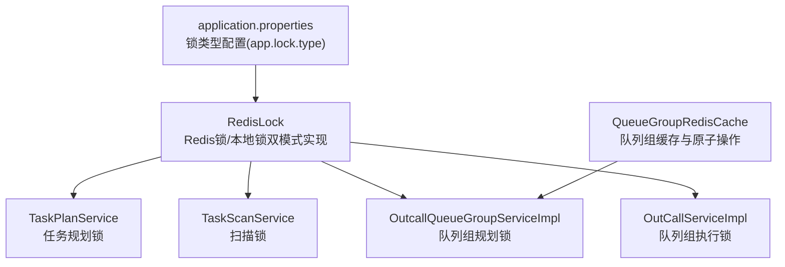
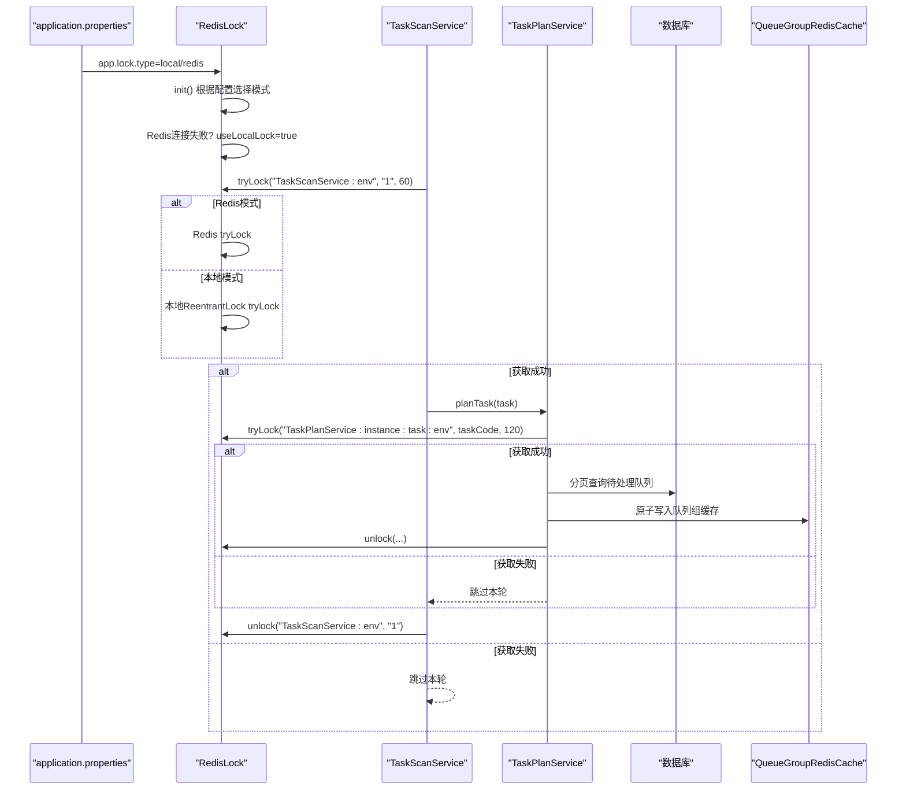
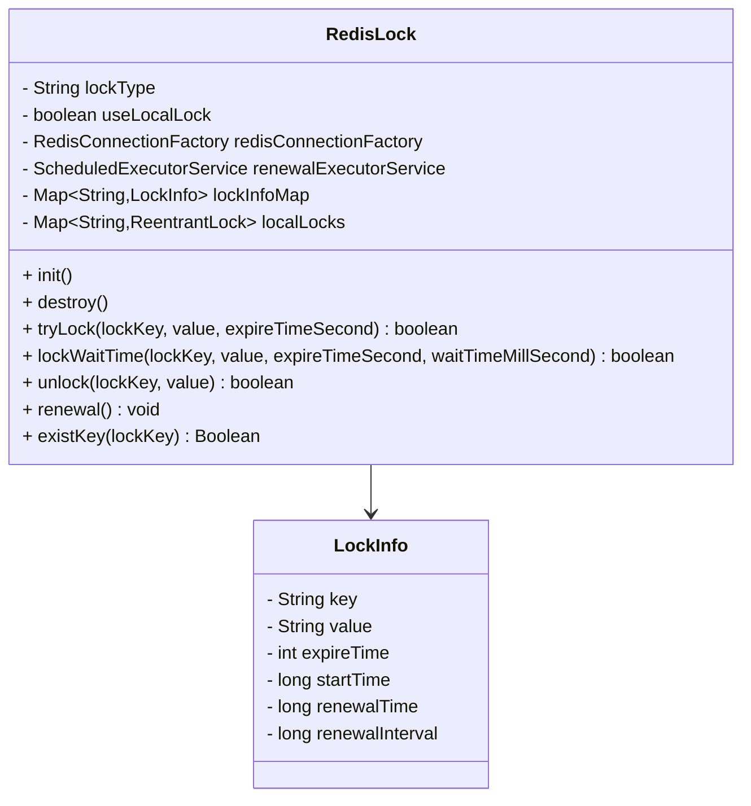
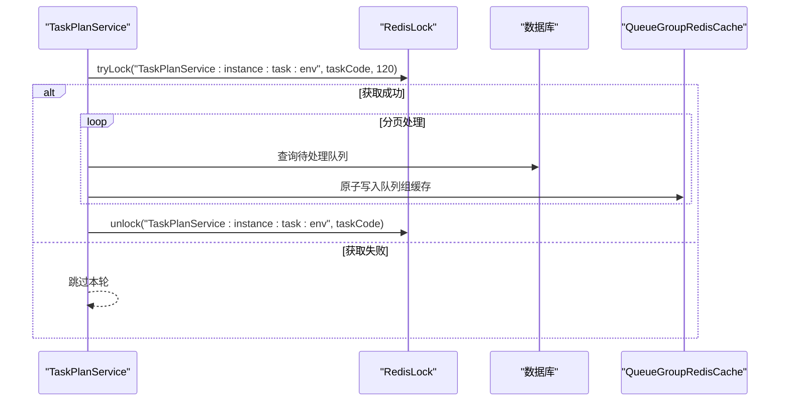
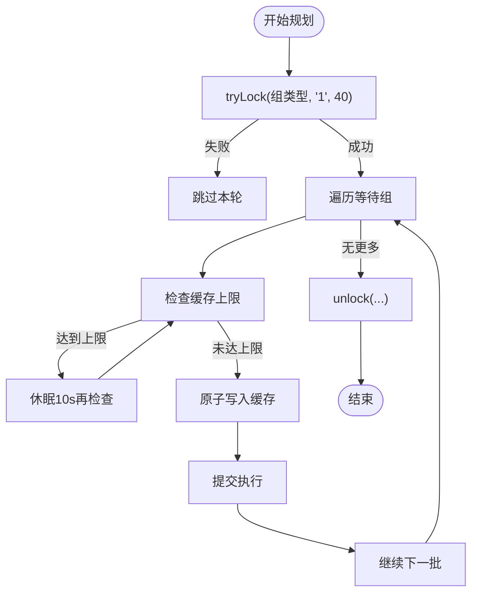
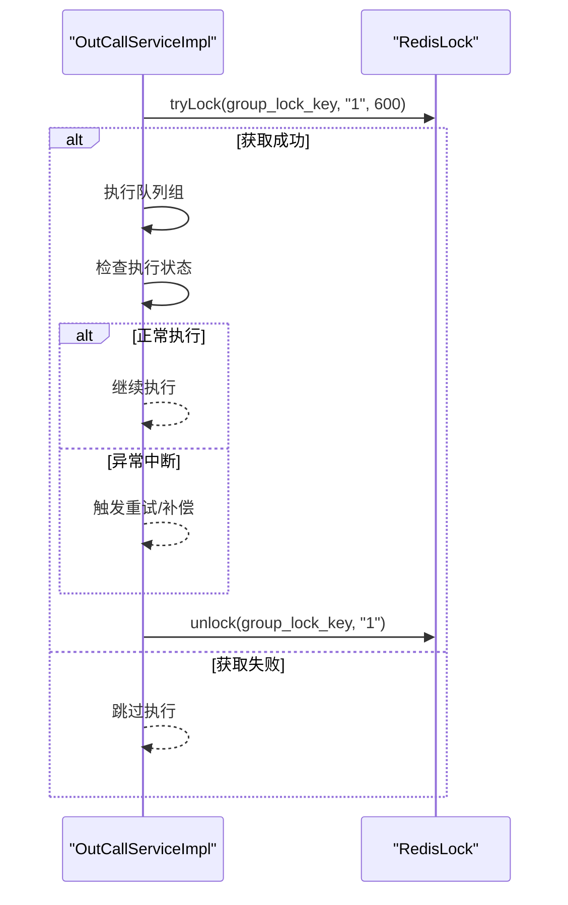
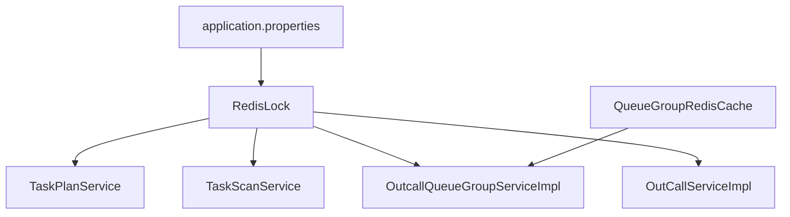

# 分布式锁

<cite>
**本文引用的文件**
- [RedisLock.java](file://src/main/java/org/qianye/cache/RedisLock.java)
- [OutcallQueueGroupServiceImpl.java](file://src/main/java/org/qianye/service/impl/OutcallQueueGroupServiceImpl.java)
- [TaskPlanService.java](file://src/main/java/org/qianye/service/impl/TaskPlanService.java)
- [TaskScanService.java](file://src/main/java/org/qianye/service/impl/TaskScanService.java)
- [OutCallServiceImpl.java](file://src/main/java/org/qianye/engine/OutCallServiceImpl.java)
- [application.properties](file://src/main/resources/application.properties)
</cite>

## 更新摘要
**变更内容**
- 更新RedisLock实现分析，反映其重大增强：新增本地锁支持、自动降级机制、双模式锁切换配置(app.lock.type)
- 新增Redis连接失败时的自动回退到本地锁功能
- 更新架构图，展示双模式锁切换和自动降级机制
- 新增配置说明和最佳实践，涵盖本地锁和Redis锁的使用场景
- 更新故障排查指南，包含本地锁模式的诊断方法

## 目录
1. [简介](#简介)
2. [项目结构与定位](#项目结构与定位)
3. [核心组件](#核心组件)
4. [架构总览](#架构总览)
5. [关键组件详解](#关键组件详解)
6. [依赖关系分析](#依赖关系分析)
7. [性能与可靠性](#性能与可靠性)
8. [故障排查指南](#故障排查指南)
9. [结论](#结论)
10. [附录：使用示例与最佳实践](#附录使用示例与最佳实践)

## 简介
本文档系统化梳理 Outcall 系统中的分布式锁机制，重点介绍基于 Redis 的增强型分布式锁实现。该实现采用 Redis 的 setIfAbsent 原子操作，提供基本的锁获取、释放和存在性检查功能，同时具备本地锁支持和自动降级机制。系统支持两种锁模式：Redis锁和本地锁，通过配置项 app.lock.type 进行切换，确保在Redis连接失败时能够自动回退到本地锁模式，保证系统的高可用性和稳定性。

## 项目结构与定位
- 分布式锁核心由 RedisLock 提供，支持Redis锁和本地锁两种模式，具备自动降级能力
- 业务层通过 TaskPlanService、TaskScanService、OutcallQueueGroupServiceImpl、OutCallServiceImpl 等服务在关键路径上使用 RedisLock 进行并发控制
- 队列组调度与缓存通过 QueueGroupRedisCache 提供原子操作与缓存能力，配合分布式锁实现更细粒度的并发控制
- 应用配置通过 application.properties 提供锁类型配置，支持local和redis两种模式

**图表来源**
- [RedisLock.java](file://src/main/java/org/qianye/cache/RedisLock.java#L47-L48)
- [TaskPlanService.java](file://src/main/java/org/qianye/service/impl/TaskPlanService.java#L257-L272)
- [TaskScanService.java](file://src/main/java/org/qianye/service/impl/TaskScanService.java#L33-L38)
- [OutcallQueueGroupServiceImpl.java](file://src/main/java/org/qianye/service/impl/OutcallQueueGroupServiceImpl.java#L134-L141)
- [OutCallServiceImpl.java](file://src/main/java/org/qianye/engine/OutCallServiceImpl.java#L472-L478)
- [application.properties](file://src/main/resources/application.properties#L11-L12)

## 核心组件
- **RedisLock**：增强型分布式锁实现，支持Redis锁和本地锁双模式，具备自动降级机制
- **TaskPlanService**：以任务维度加锁，串行化任务规划流程，避免多实例并发写入
- **TaskScanService**：周期扫描任务并触发规划，使用短锁避免长时间占用
- **OutcallQueueGroupServiceImpl**：队列组规划与处理阶段加锁，保证同一任务/环境下的规划幂等与顺序
- **OutCallServiceImpl**：队列组执行阶段使用"组级锁"键，结合缓存客户端的存在性检查实现存活判定与异常恢复
- **QueueGroupRedisCache**：提供原子化的队列组缓存操作，减少锁粒度冲突
- **application.properties**：提供锁类型配置，支持local和redis两种模式

**章节来源**
- [RedisLock.java](file://src/main/java/org/qianye/cache/RedisLock.java#L47-L48)
- [TaskPlanService.java](file://src/main/java/org/qianye/service/impl/TaskPlanService.java#L257-L272)
- [TaskScanService.java](file://src/main/java/org/qianye/service/impl/TaskScanService.java#L33-L38)
- [OutcallQueueGroupServiceImpl.java](file://src/main/java/org/qianye/service/impl/OutcallQueueGroupServiceImpl.java#L134-L141)
- [OutCallServiceImpl.java](file://src/main/java/org/qianye/engine/OutCallServiceImpl.java#L472-L478)
- [application.properties](file://src/main/resources/application.properties#L11-L12)

## 架构总览
分布式锁在 Outcall 中贯穿"任务规划—队列组规划—队列组执行"全链路，形成如下层次：
- **任务级锁**：TaskPlanService 对单任务加锁，避免多实例同时规划
- **队列组级锁**：OutcallQueueGroupServiceImpl 对"普通/择时"两类规划分别加锁，防止重复规划与并发写
- **组执行锁**：OutCallServiceImpl 对具体队列组加锁，结合缓存客户端的存在性检查实现异常恢复
- **缓存原子化**：QueueGroupRedisCache 提供原子操作，降低锁持有时间
- **双模式支持**：RedisLock 支持Redis锁和本地锁两种模式，具备自动降级能力

**图表来源**
- [application.properties](file://src/main/resources/application.properties#L11-L12)
- [RedisLock.java](file://src/main/java/org/qianye/cache/RedisLock.java#L59-L86)
- [TaskScanService.java](file://src/main/java/org/qianye/service/impl/TaskScanService.java#L33-L38)
- [TaskPlanService.java](file://src/main/java/org/qianye/service/impl/TaskPlanService.java#L257-L272)

## 关键组件详解

### RedisLock：增强型分布式锁实现
RedisLock 采用基于 Redis setIfAbsent 的增强实现，提供以下核心功能：

- **双模式支持**
  - `@Value("${app.lock.type:local}")`：通过配置项选择锁模式，默认为local
  - `useLocalLock`：标志位控制当前使用本地锁还是Redis锁
  - `RedisConnectionFactory`：Redis连接工厂，用于Redis模式初始化

- **锁获取**
  - `tryLock(lockKey, value, expireTimeSecond)`：根据当前模式调用对应实现
  - Redis模式：基于 Redis 的 setIfAbsent 原子操作，设置过期时间
  - 本地模式：基于 ReentrantLock 的本地互斥锁
  - 自动降级：Redis连接失败时自动切换到本地锁模式

- **锁释放**
  - `unlock(lockKey, value)`：根据当前模式调用对应实现
  - Redis模式：使用 Lua 脚本读取并比较值后删除
  - 本地模式：基于ReentrantLock的解锁，支持值匹配检查

- **续期机制**
  - `renewalExecutorService`：定时续期线程池，每2秒执行一次
  - `LockInfo`：锁信息管理，包含key、value、过期时间、续期时间等
  - `renewal()`：定时续期任务，超过阈值的锁自动续期

- **存在性检查**
  - `existKey(lockKey)`：检查锁是否存在，支持Redis和本地两种模式
  - Redis模式：使用hasKey检查
  - 本地模式：使用localLockOwners检查

- **初始化与销毁**
  - `init()`：初始化RedisTemplate和序列化器，处理Redis连接失败情况
  - `destroy()`：优雅关闭，确保资源回收

**图表来源**
- [RedisLock.java](file://src/main/java/org/qianye/cache/RedisLock.java#L47-L48)
- [RedisLock.java](file://src/main/java/org/qianye/cache/RedisLock.java#L396-L465)

**章节来源**
- [RedisLock.java](file://src/main/java/org/qianye/cache/RedisLock.java#L47-L48)
- [RedisLock.java](file://src/main/java/org/qianye/cache/RedisLock.java#L59-L86)
- [RedisLock.java](file://src/main/java/org/qianye/cache/RedisLock.java#L152-L170)
- [RedisLock.java](file://src/main/java/org/qianye/cache/RedisLock.java#L224-L245)
- [RedisLock.java](file://src/main/java/org/qianye/cache/RedisLock.java#L359-L394)
- [RedisLock.java](file://src/main/java/org/qianye/cache/RedisLock.java#L396-L465)

### 任务规划锁：TaskPlanService
- **锁键设计**：以服务名+实例+任务+环境拼接，确保任务级互斥
- **加锁策略**：在规划前 tryLock，若失败直接跳过，避免重复规划
- **并发处理**：规划过程采用分页与并行子批处理，同时通过锁保障整体一致性
- **锁存在性校验**：在长流程中定期检查锁是否存在，异常中断时也能安全退出

**图表来源**
- [TaskPlanService.java](file://src/main/java/org/qianye/service/impl/TaskPlanService.java#L257-L272)
- [TaskPlanService.java](file://src/main/java/org/qianye/service/impl/TaskPlanService.java#L273-L367)

**章节来源**
- [TaskPlanService.java](file://src/main/java/org/qianye/service/impl/TaskPlanService.java#L257-L272)
- [TaskPlanService.java](file://src/main/java/org/qianye/service/impl/TaskPlanService.java#L273-L367)

### 队列组规划锁：OutcallQueueGroupServiceImpl
- **锁键设计**：区分"普通组"与"择时组"，以任务+环境为维度，避免跨组干扰
- **加锁策略**：startPlanningGroup 在进入规划循环前获取锁，结束后释放
- **并发控制**：规划过程中检查缓存上限，必要时短暂休眠，避免缓存过载
- **死锁预防**：锁超时时间较短，避免长时间阻塞

**图表来源**
- [OutcallQueueGroupServiceImpl.java](file://src/main/java/org/qianye/service/impl/OutcallQueueGroupServiceImpl.java#L134-L141)
- [OutcallQueueGroupServiceImpl.java](file://src/main/java/org/qianye/service/impl/OutcallQueueGroupServiceImpl.java#L161-L173)

**章节来源**
- [OutcallQueueGroupServiceImpl.java](file://src/main/java/org/qianye/service/impl/OutcallQueueGroupServiceImpl.java#L134-L141)
- [OutcallQueueGroupServiceImpl.java](file://src/main/java/org/qianye/service/impl/OutcallQueueGroupServiceImpl.java#L161-L173)

### 队列组执行锁：OutCallServiceImpl
- **锁键设计**：使用统一的组级锁键构建方法，确保组级互斥
- **锁存在性检查**：通过缓存客户端检查组是否仍在执行，用于异常恢复与重试
- **释放策略**：在组执行完成后主动 unlock，避免遗留锁

**图表来源**
- [OutCallServiceImpl.java](file://src/main/java/org/qianye/engine/OutCallServiceImpl.java#L472-L478)
- [OutCallServiceImpl.java](file://src/main/java/org/qianye/engine/OutCallServiceImpl.java#L493-L497)

**章节来源**
- [OutCallServiceImpl.java](file://src/main/java/org/qianye/engine/OutCallServiceImpl.java#L472-L478)
- [OutCallServiceImpl.java](file://src/main/java/org/qianye/engine/OutCallServiceImpl.java#L493-L497)

### 队列组缓存与原子操作：QueueGroupRedisCache
- **原子写入**：将多个组原子地 LPUSH 到列表并设置过期时间，避免中间态
- **原子弹出**：支持一次性 RPOP 多个元素，保证消费一致性
- **键空间**：区分私有组与公共组，便于隔离与限流

**章节来源**
- [OutcallQueueGroupServiceImpl.java](file://src/main/java/org/qianye/service/impl/OutcallQueueGroupServiceImpl.java#L183-L188)

### 锁配置与自动降级机制
- **配置项**：`app.lock.type=local|redis`，默认为local
- **自动降级**：Redis连接失败时自动切换到本地锁模式
- **双模式支持**：Redis模式提供分布式一致性，本地模式提供高性能本地互斥
- **回退策略**：Redis初始化失败或连接异常时，useLocalLock=true

**章节来源**
- [application.properties](file://src/main/resources/application.properties#L11-L12)
- [RedisLock.java](file://src/main/java/org/qianye/cache/RedisLock.java#L63-L69)
- [RedisLock.java](file://src/main/java/org/qianye/cache/RedisLock.java#L82-L85)

## 依赖关系分析
- RedisLock 是所有业务锁使用的基础设施，被 TaskPlanService、TaskScanService、OutcallQueueGroupServiceImpl、OutCallServiceImpl 直接依赖
- QueueGroupRedisCache 与 RedisLock 协同，前者提供原子缓存操作，后者提供锁保障
- application.properties 为 RedisLock 提供配置支持，决定锁模式选择

**图表来源**
- [RedisLock.java](file://src/main/java/org/qianye/cache/RedisLock.java#L47-L48)
- [TaskPlanService.java](file://src/main/java/org/qianye/service/impl/TaskPlanService.java#L257-L272)
- [TaskScanService.java](file://src/main/java/org/qianye/service/impl/TaskScanService.java#L33-L38)
- [OutcallQueueGroupServiceImpl.java](file://src/main/java/org/qianye/service/impl/OutcallQueueGroupServiceImpl.java#L134-L141)
- [OutCallServiceImpl.java](file://src/main/java/org/qianye/engine/OutCallServiceImpl.java#L472-L478)
- [application.properties](file://src/main/resources/application.properties#L11-L12)

**章节来源**
- [RedisLock.java](file://src/main/java/org/qianye/cache/RedisLock.java#L47-L48)
- [TaskPlanService.java](file://src/main/java/org/qianye/service/impl/TaskPlanService.java#L257-L272)
- [TaskScanService.java](file://src/main/java/org/qianye/service/impl/TaskScanService.java#L33-L38)
- [OutcallQueueGroupServiceImpl.java](file://src/main/java/org/qianye/service/impl/OutcallQueueGroupServiceImpl.java#L134-L141)
- [OutCallServiceImpl.java](file://src/main/java/org/qianye/engine/OutCallServiceImpl.java#L472-L478)
- [application.properties](file://src/main/resources/application.properties#L11-L12)

## 性能与可靠性
- **性能特点**
  - 双模式支持：Redis模式提供分布式一致性，本地模式提供高性能本地互斥
  - 自动降级：Redis连接失败时自动切换到本地锁，保证系统可用性
  - 短锁策略：任务级锁（如 60s）、组级锁（如 600s），降低竞争烈度
  - 原子化操作：通过Lua原子操作减少锁持有时间

- **可靠性保障**
  - 显式过期时间：所有锁均设置过期时间，避免永久占用
  - 值匹配释放：unlock 使用Lua脚本，防止误删他人锁
  - 续期机制：定时续期线程池，超过阈值的锁自动续期
  - 异常恢复：Redis异常时自动回退到本地锁模式

- **配置灵活性**
  - 通过 `app.lock.type` 配置选择锁模式
  - 支持动态切换：运行时根据Redis连接状态自动调整

**章节来源**
- [RedisLock.java](file://src/main/java/org/qianye/cache/RedisLock.java#L59-L86)
- [RedisLock.java](file://src/main/java/org/qianye/cache/RedisLock.java#L152-L170)
- [RedisLock.java](file://src/main/java/org/qianye/cache/RedisLock.java#L224-L245)
- [RedisLock.java](file://src/main/java/org/qianye/cache/RedisLock.java#L359-L394)
- [application.properties](file://src/main/resources/application.properties#L11-L12)

## 故障排查指南
- **获取锁失败**
  - 检查锁键是否正确（服务名/实例/任务/环境），确认锁值是否一致
  - 查看Redis连接状态，确认Redis服务可用性
  - 检查锁模式配置，确认app.lock.type设置是否正确

- **锁释放异常**
  - 确认锁值与获取时一致，避免不同实例间的误删
  - 检查Lua脚本执行结果，确保值匹配后才能删除
  - 查看本地锁模式下的值匹配检查

- **Redis模式异常**
  - 检查Redis连接工厂配置，确认Redis连接正常
  - 查看RedisTemplate序列化器配置，确保序列化兼容性
  - 监控自动降级日志，确认是否发生Redis连接失败

- **本地锁模式异常**
  - 检查ReentrantLock的线程持有状态
  - 查看本地锁过期时间管理，确认锁是否正确清理
  - 监控本地锁的值匹配检查机制

- **续期机制问题**
  - 检查定时续期线程池状态，确认线程正常运行
  - 查看LockInfo的续期时间计算，确认续期间隔合理
  - 监控续期失败的日志，确认锁状态一致性

**章节来源**
- [RedisLock.java](file://src/main/java/org/qianye/cache/RedisLock.java#L152-L170)
- [RedisLock.java](file://src/main/java/org/qianye/cache/RedisLock.java#L224-L245)
- [RedisLock.java](file://src/main/java/org/qianye/cache/RedisLock.java#L359-L394)
- [RedisLock.java](file://src/main/java/org/qianye/cache/RedisLock.java#L59-L86)

## 结论
Outcall 的分布式锁体系采用基于 Redis 的增强实现，通过Redis锁和本地锁双模式支持，在保证基本并发控制的同时，显著提升了系统的可用性和灵活性。该设计不仅支持Redis模式的分布式一致性，还提供了本地锁模式的高性能本地互斥，通过自动降级机制确保在Redis连接失败时系统仍能正常运行。该实现有效规避了超时与死锁风险，并在队列组调度与并发控制中发挥了关键作用。

## 附录：使用示例与最佳实践
- **使用示例**
  - 任务规划锁：参考 TaskPlanService 的 tryLock/unlock 使用方式
  - 队列组规划锁：参考 OutcallQueueGroupServiceImpl 的 tryLock/unlock 使用方式
  - 组执行锁：参考 OutCallServiceImpl 的组级锁键构建与释放方式

- **最佳实践**
  - **锁模式选择**：生产环境推荐使用Redis模式，开发环境可使用本地模式
  - **锁键命名规范**：统一使用服务名/实例/任务/环境维度，避免冲突
  - **锁时长设置**：根据业务耗时合理设置过期时间，避免过短导致频繁失败或过长导致死锁
  - **原子化操作**：优先使用队列组缓存的原子脚本，缩短锁持有时间
  - **异常恢复**：执行阶段通过缓存客户端检查存活，异常时及时释放锁并重试
  - **监控告警**：关注Redis连接状态和自动降级日志，及时发现系统异常
  - **配置管理**：通过app.lock.type灵活切换锁模式，适应不同的部署环境

**章节来源**
- [TaskPlanService.java](file://src/main/java/org/qianye/service/impl/TaskPlanService.java#L257-L272)
- [OutcallQueueGroupServiceImpl.java](file://src/main/java/org/qianye/service/impl/OutcallQueueGroupServiceImpl.java#L134-L141)
- [OutCallServiceImpl.java](file://src/main/java/org/qianye/engine/OutCallServiceImpl.java#L472-L478)
- [application.properties](file://src/main/resources/application.properties#L11-L12)
- [RedisLock.java](file://src/main/java/org/qianye/cache/RedisLock.java#L59-L86)