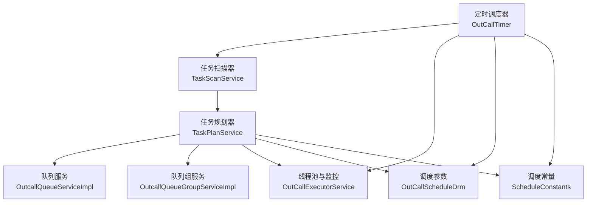
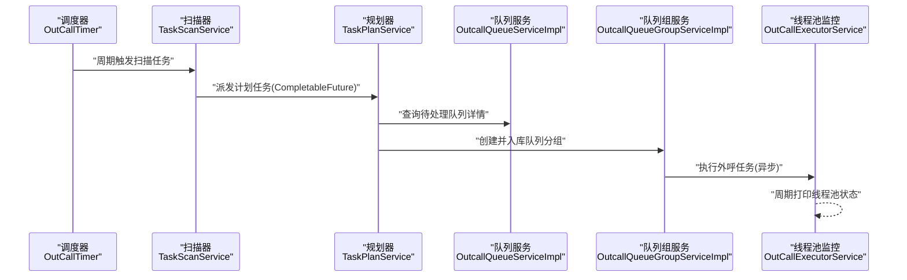
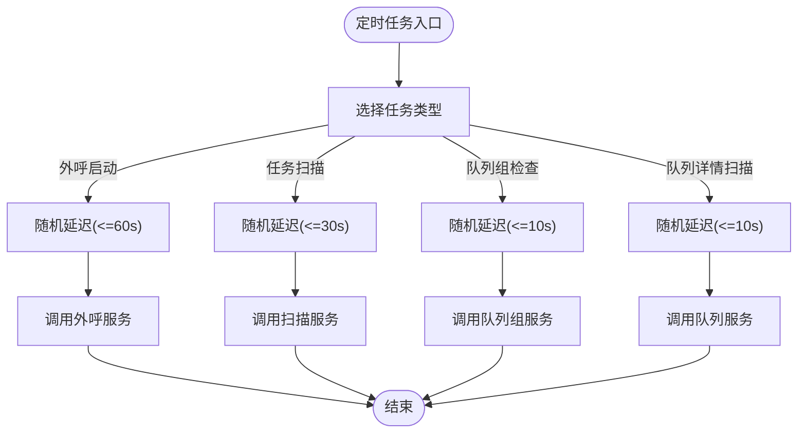
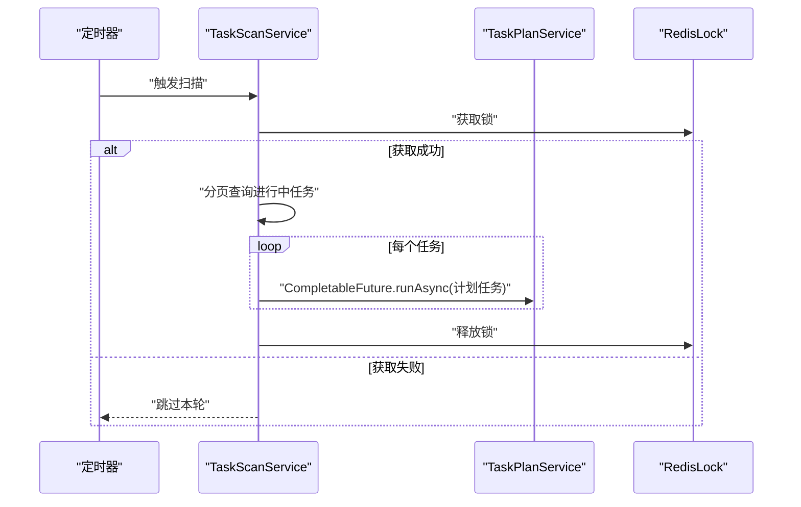
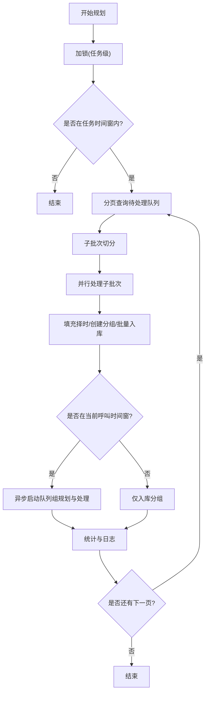
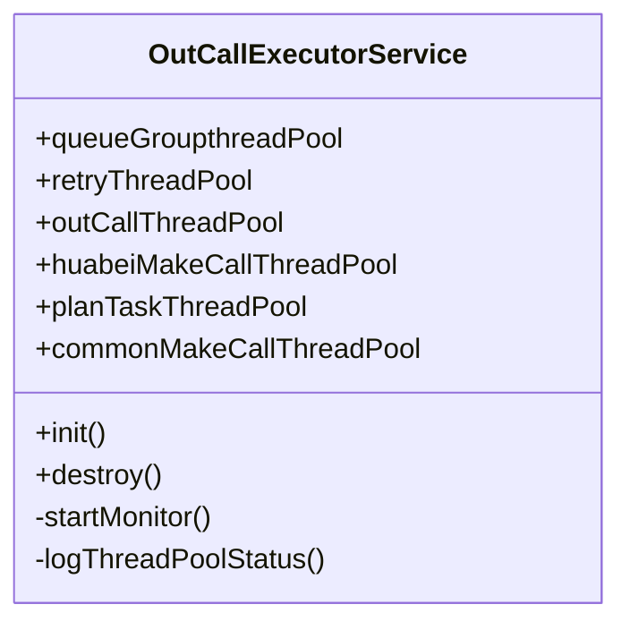
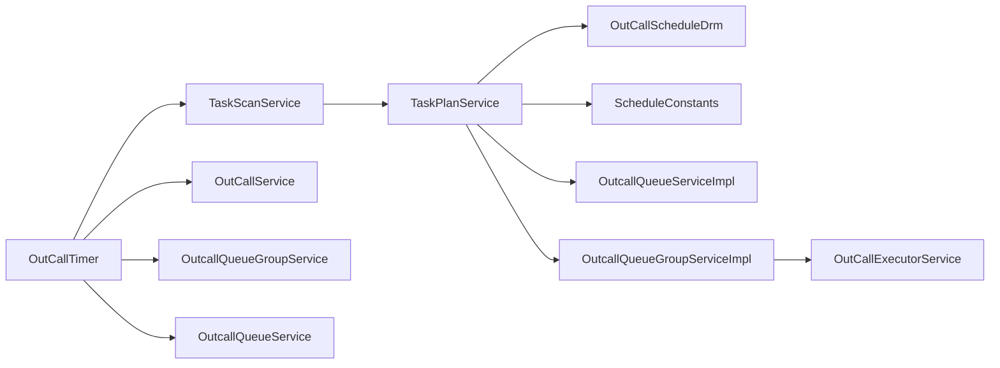

# 定时任务调度

<cite>
**本文引用的文件**
- [OutCallTimer.java](file://src/main/java/org/qianye/OutCallTimer.java)
- [TaskScanService.java](file://src/main/java/org/qianye/TaskScanService.java)
- [TaskPlanService.java](file://src/main/java/org/qianye/TaskPlanService.java)
- [OutCallExecutorService.java](file://src/main/java/org/qianye/OutCallExecutorService.java)
- [OutCallScheduleDrm.java](file://src/main/java/org/qianye/OutCallScheduleDrm.java)
- [ScheduleConstants.java](file://src/main/java/org/qianye/ScheduleConstants.java)
- [OutcallQueueServiceImpl.java](file://src/main/java/org/qianye/service/impl/OutcallQueueServiceImpl.java)
- [OutcallQueueGroupServiceImpl.java](file://src/main/java/org/qianye/service/impl/OutcallQueueGroupServiceImpl.java)
- [application.properties](file://src/main/resources/application.properties)
- [TracerRunnable.java](file://src/main/java/org/qianye/TracerRunnable.java)
</cite>

## 目录
1. [简介](#简介)
2. [项目结构](#项目结构)
3. [核心组件](#核心组件)
4. [架构总览](#架构总览)
5. [详细组件分析](#详细组件分析)
6. [依赖关系分析](#依赖关系分析)
7. [性能考量](#性能考量)
8. [故障排查指南](#故障排查指南)
9. [结论](#结论)
10. [附录](#附录)

## 简介
本文件系统性阐述 Outcall 系统的定时任务调度机制，覆盖任务注册、执行时机、调度算法、线程池协作与资源管理、监控与性能统计、配置参数与策略选择、异常处理与容错、以及高并发环境下的优化与资源控制策略。目标是帮助读者快速理解并安全地运维与扩展定时任务体系。

## 项目结构
围绕定时任务调度的关键模块如下：
- 定时任务入口与调度器：OutCallTimer（基于 Spring 的 @Scheduled 与 @Async）
- 任务扫描与派发：TaskScanService（扫描进行中的任务并派发到计划任务线程池）
- 任务规划与分组：TaskPlanService（按时间窗与规则生成队列分组并入库）
- 线程池与监控：OutCallExecutorService（统一管理多类线程池并周期性监控）
- 调度参数与限流：OutCallScheduleDrm（集中式调度参数配置）
- 常量与批次控制：ScheduleConstants（查询与分组的批次大小等）
- 队列与队列组服务：OutcallQueueServiceImpl、OutcallQueueGroupServiceImpl（状态检查、重试与规划执行）
- 运行环境：application.properties（数据库、MyBatis-Plus 等）

图表来源
- [OutCallTimer.java](file://src/main/java/org/qianye/OutCallTimer.java#L23-L116)
- [TaskScanService.java](file://src/main/java/org/qianye/TaskScanService.java#L17-L75)
- [TaskPlanService.java](file://src/main/java/org/qianye/TaskPlanService.java#L28-L75)
- [OutCallExecutorService.java](file://src/main/java/org/qianye/OutCallExecutorService.java#L11-L211)
- [OutCallScheduleDrm.java](file://src/main/java/org/qianye/OutCallScheduleDrm.java#L8-L112)
- [ScheduleConstants.java](file://src/main/java/org/qianye/ScheduleConstants.java#L3-L15)

章节来源
- [OutCallTimer.java](file://src/main/java/org/qianye/OutCallTimer.java#L23-L116)
- [TaskScanService.java](file://src/main/java/org/qianye/TaskScanService.java#L17-L75)
- [TaskPlanService.java](file://src/main/java/org/qianye/TaskPlanService.java#L28-L75)
- [OutCallExecutorService.java](file://src/main/java/org/qianye/OutCallExecutorService.java#L11-L211)
- [OutCallScheduleDrm.java](file://src/main/java/org/qianye/OutCallScheduleDrm.java#L8-L112)
- [ScheduleConstants.java](file://src/main/java/org/qianye/ScheduleConstants.java#L3-L15)

## 核心组件
- 定时调度器 OutCallTimer
  - 基于 @EnableScheduling 与 @Scheduled 的 Cron 表达式驱动
  - 提供外呼启动、任务扫描规划、队列组状态检查、队列详情扫描等定时任务
  - 使用 @Async 并绑定自定义线程池 outCallTaskExecutor，避免阻塞调度线程
  - 通过随机延迟降低并发峰值
- 任务扫描器 TaskScanService
  - 周期扫描“进行中”任务，使用 Redis 锁避免重复执行
  - 将具体任务派发至计划任务线程池（基于 CompletableFuture）
- 任务规划器 TaskPlanService
  - 在任务时间窗内进行队列分组与入库，支持择时分组与普通分组
  - 使用并行子批次处理与事务模板，控制数据库压力
  - 通过 OutCallScheduleDrm 控制批次大小、分组大小、重试上限等
- 线程池与监控 OutCallExecutorService
  - 统一管理多类线程池（队列组、重试、外呼、计划任务等），并内置监控线程池定期打印状态
  - 提供优雅关闭流程，确保任务在停机前完成或被中断
- 调度参数与常量 OutCallScheduleDrm、ScheduleConstants
  - 集中式参数（如队列查询批次、分组大小、最大重试次数、线程池规模等）
  - 常量（如任务查询最大条数、批量查询限制）

章节来源
- [OutCallTimer.java](file://src/main/java/org/qianye/OutCallTimer.java#L45-L116)
- [TaskScanService.java](file://src/main/java/org/qianye/TaskScanService.java#L29-L73)
- [TaskPlanService.java](file://src/main/java/org/qianye/TaskPlanService.java#L411-L691)
- [OutCallExecutorService.java](file://src/main/java/org/qianye/OutCallExecutorService.java#L14-L211)
- [OutCallScheduleDrm.java](file://src/main/java/org/qianye/OutCallScheduleDrm.java#L9-L112)
- [ScheduleConstants.java](file://src/main/java/org/qianye/ScheduleConstants.java#L3-L15)

## 架构总览
定时任务从调度器触发，经扫描器筛选任务，再由规划器进行分组与入库，并通过线程池异步执行后续动作；同时通过统一的监控线程池持续观察线程池健康状况。

图表来源
- [OutCallTimer.java](file://src/main/java/org/qianye/OutCallTimer.java#L64-L89)
- [TaskScanService.java](file://src/main/java/org/qianye/TaskScanService.java#L56-L64)
- [TaskPlanService.java](file://src/main/java/org/qianye/TaskPlanService.java#L507-L641)
- [OutcallQueueServiceImpl.java](file://src/main/java/org/qianye/service/impl/OutcallQueueServiceImpl.java#L68-L98)
- [OutcallQueueGroupServiceImpl.java](file://src/main/java/org/qianye/service/impl/OutcallQueueGroupServiceImpl.java#L106-L137)
- [OutCallExecutorService.java](file://src/main/java/org/qianye/OutCallExecutorService.java#L60-L137)

## 详细组件分析

### 定时调度器 OutCallTimer
- 任务注册与执行时机
  - 外呼启动：每分钟执行一次，带随机延迟，避免瞬时并发
  - 任务扫描规划：每两分钟执行一次，带随机延迟
  - 队列组状态检查：每五分钟执行一次，带随机延迟
  - 队列详情扫描：每五分钟执行一次，带随机延迟
- 线程池配置
  - 自定义线程池 outCallTaskExecutor：核心/最大/队列容量/存活时间/拒绝策略/优雅停机等待时间
- 启动/停止/重启
  - Spring Boot 启动时自动启用 @EnableScheduling；关闭时通过线程池优雅停机

图表来源
- [OutCallTimer.java](file://src/main/java/org/qianye/OutCallTimer.java#L64-L101)

章节来源
- [OutCallTimer.java](file://src/main/java/org/qianye/OutCallTimer.java#L45-L116)

### 任务扫描器 TaskScanService
- 扫描策略
  - 使用 Redis 锁避免并发重复执行
  - 分页扫描“进行中”任务，每页固定条数（来自常量）
  - 将单个任务派发到计划任务线程池，受队列长度阈值保护
- 异常处理
  - 捕获异常并记录日志，最终释放锁

图表来源
- [TaskScanService.java](file://src/main/java/org/qianye/TaskScanService.java#L29-L73)

章节来源
- [TaskScanService.java](file://src/main/java/org/qianye/TaskScanService.java#L29-L73)

### 任务规划器 TaskPlanService
- 规划流程
  - 加锁（Redis）避免重复规划
  - 若不在任务时间窗内直接返回
  - 分页查询待处理队列详情，按批次与子批次并行处理
  - 填充择时时间信息，按是否择时分组
  - 子批次内使用事务模板批量更新队列与插入队列组
  - 在当前呼叫时间窗内，异步启动队列组规划与处理
- 性能与压力控制
  - 子批次大小与队列查询批次来自 OutCallScheduleDrm
  - 每处理若干页后短暂休眠以缓解数据库压力
  - CompletableFuture.allOf 聚合并等待，设置超时避免长时间阻塞

图表来源
- [TaskPlanService.java](file://src/main/java/org/qianye/TaskPlanService.java#L411-L691)
- [OutCallScheduleDrm.java](file://src/main/java/org/qianye/OutCallScheduleDrm.java#L66-L96)

章节来源
- [TaskPlanService.java](file://src/main/java/org/qianye/TaskPlanService.java#L411-L691)
- [OutCallScheduleDrm.java](file://src/main/java/org/qianye/OutCallScheduleDrm.java#L66-L96)

### 线程池与监控 OutCallExecutorService
- 线程池职责
  - 队列组线程池：处理队列组规划与执行
  - 重试线程池：处理失败重试
  - 外呼线程池：执行外呼动作
  - 计划任务线程池：处理任务规划
  - 通用外呼线程池：通用并发场景
- 监控机制
  - 单线程监控线程池，每 10 秒打印一次各线程池关键指标
- 优雅停机
  - 关闭监控线程池，逐个优雅关闭各业务线程池，超时强制中断

图表来源
- [OutCallExecutorService.java](file://src/main/java/org/qianye/OutCallExecutorService.java#L14-L211)

章节来源
- [OutCallExecutorService.java](file://src/main/java/org/qianye/OutCallExecutorService.java#L14-L211)

### 队列与队列组服务
- 队列服务 OutcallQueueServiceImpl
  - 定期检查队列状态，依据通话记录更新处理中队列状态
  - 支持分页查询与批量更新，避免 SQL IN 过长
- 队列组服务 OutcallQueueGroupServiceImpl
  - 在呼叫时间窗内启动普通/择时队列组规划
  - 处理超时未存活的队列组并触发重试规划
  - 使用 Redis 锁与缓存上限控制规划并发与速率

章节来源
- [OutcallQueueServiceImpl.java](file://src/main/java/org/qianye/service/impl/OutcallQueueServiceImpl.java#L68-L213)
- [OutcallQueueGroupServiceImpl.java](file://src/main/java/org/qianye/service/impl/OutcallQueueGroupServiceImpl.java#L70-L271)

## 依赖关系分析
- 组件耦合
  - OutCallTimer 依赖 TaskScanService、OutCallService、OutcallQueueGroupService、OutcallQueueService
  - TaskScanService 依赖 TaskPlanService、OutboundCallTaskService、RedisLock
  - TaskPlanService 依赖多个服务与 OutCallScheduleDrm、ScheduleConstants
  - OutcallQueueGroupServiceImpl 依赖 OutCallService、OutCallExecutorService
- 外部依赖
  - Redis 锁与缓存用于并发控制与状态存储
  - 数据库通过 MyBatis-Plus 访问，配置见 application.properties

图表来源
- [OutCallTimer.java](file://src/main/java/org/qianye/OutCallTimer.java#L31-L42)
- [TaskScanService.java](file://src/main/java/org/qianye/TaskScanService.java#L19-L26)
- [TaskPlanService.java](file://src/main/java/org/qianye/TaskPlanService.java#L32-L75)
- [OutcallQueueGroupServiceImpl.java](file://src/main/java/org/qianye/service/impl/OutcallQueueGroupServiceImpl.java#L43-L56)
- [OutCallExecutorService.java](file://src/main/java/org/qianye/OutCallExecutorService.java#L14-L51)

章节来源
- [OutCallTimer.java](file://src/main/java/org/qianye/OutCallTimer.java#L31-L42)
- [TaskScanService.java](file://src/main/java/org/qianye/TaskScanService.java#L19-L26)
- [TaskPlanService.java](file://src/main/java/org/qianye/TaskPlanService.java#L32-L75)
- [OutcallQueueGroupServiceImpl.java](file://src/main/java/org/qianye/service/impl/OutcallQueueGroupServiceImpl.java#L43-L56)
- [OutCallExecutorService.java](file://src/main/java/org/qianye/OutCallExecutorService.java#L14-L51)

## 性能考量
- 并发控制
  - 定时任务采用随机延迟，降低同时触发概率
  - Redis 锁避免重复执行，减少无效工作
- 批处理与分页
  - 批次大小与分组大小由 OutCallScheduleDrm 控制
  - 分页查询与子批次并行，配合事务模板批量入库
- 线程池隔离
  - 不同职责线程池分离，避免相互影响
  - 监控线程池定期输出状态，便于容量评估
- 数据库压力
  - 处理若干页后短暂休眠，避免数据库过载
  - 批量更新与分批查询，减少 SQL 开销

章节来源
- [OutCallTimer.java](file://src/main/java/org/qianye/OutCallTimer.java#L50-L69)
- [TaskScanService.java](file://src/main/java/org/qianye/TaskScanService.java#L56-L64)
- [TaskPlanService.java](file://src/main/java/org/qianye/TaskPlanService.java#L534-L621)
- [OutCallExecutorService.java](file://src/main/java/org/qianye/OutCallExecutorService.java#L60-L137)
- [OutCallScheduleDrm.java](file://src/main/java/org/qianye/OutCallScheduleDrm.java#L66-L96)

## 故障排查指南
- 常见问题定位
  - 定时任务未执行：检查 @EnableScheduling 是否生效、Cron 表达式是否正确、线程池是否初始化
  - 任务扫描卡住：检查 Redis 锁是否释放、分页查询是否返回空页
  - 规划任务堆积：检查计划任务线程池队列长度、数据库写入性能、事务超时
  - 线程池异常：查看监控日志，关注活跃线程数、队列长度、拒绝策略触发情况
- 日志与追踪
  - 使用 TracerRunnable 包裹异步任务，便于链路追踪
  - 各服务均提供详细日志，包含实例 ID、任务代码、耗时等

章节来源
- [OutCallTimer.java](file://src/main/java/org/qianye/OutCallTimer.java#L103-L116)
- [TaskScanService.java](file://src/main/java/org/qianye/TaskScanService.java#L67-L71)
- [TaskPlanService.java](file://src/main/java/org/qianye/TaskPlanService.java#L588-L595)
- [OutCallExecutorService.java](file://src/main/java/org/qianye/OutCallExecutorService.java#L131-L135)
- [TracerRunnable.java](file://src/main/java/org/qianye/TracerRunnable.java#L6-L13)

## 结论
Outcall 的定时任务调度以 Spring 定时框架为基础，结合 Redis 锁、线程池隔离与分页/并行处理策略，在保证稳定性的同时兼顾吞吐。通过集中式参数配置与周期性监控，能够有效支撑高并发场景下的外呼任务编排与执行。

## 附录

### 定时任务配置参数与调度策略建议
- Cron 调度策略
  - 外呼启动：每分钟，带随机延迟
  - 任务扫描：每两分钟，带随机延迟
  - 队列组检查：每五分钟
  - 队列详情扫描：每五分钟
- 线程池参数建议
  - 计划任务线程池：核心/最大/队列容量需结合任务量与数据库写入能力调整
  - 外呼线程池：根据并发外呼量与下游系统承载能力设定
  - 监控线程池：保持固定大小，避免额外开销
- 参数调优参考
  - 队列查询批次：根据数据库与网络状况调整
  - 分组大小：平衡吞吐与内存占用
  - 最大重试次数：结合业务容忍度与 SLA 设定
  - 数据库压力控制：通过分页与休眠策略降低峰值

章节来源
- [OutCallTimer.java](file://src/main/java/org/qianye/OutCallTimer.java#L64-L101)
- [OutCallScheduleDrm.java](file://src/main/java/org/qianye/OutCallScheduleDrm.java#L66-L111)
- [ScheduleConstants.java](file://src/main/java/org/qianye/ScheduleConstants.java#L4-L14)