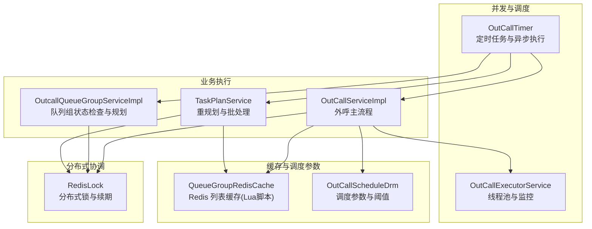
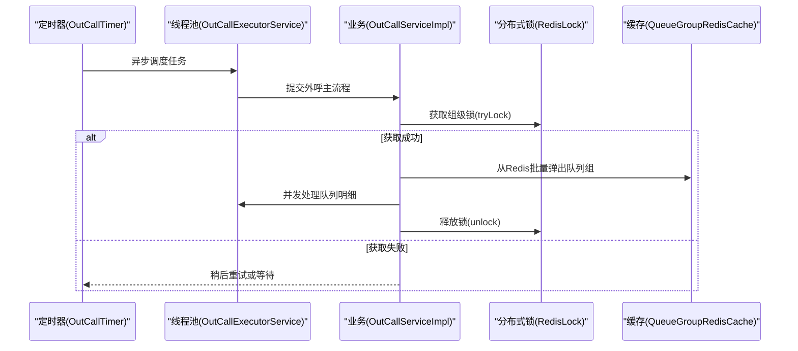
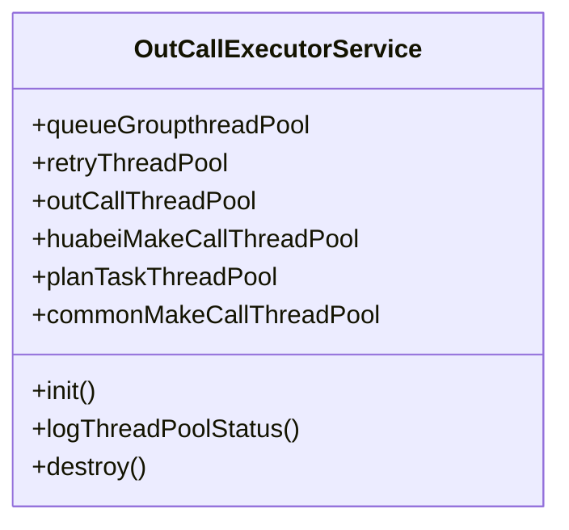
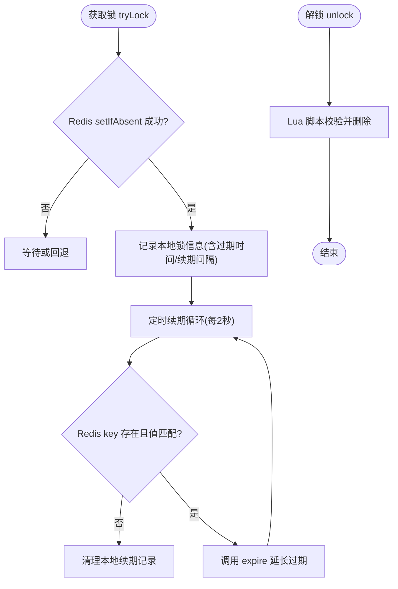
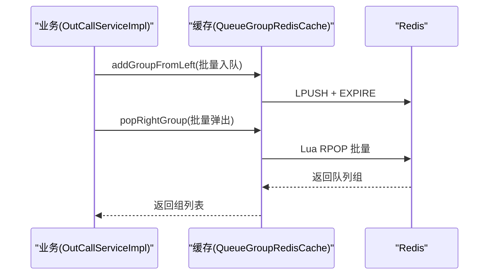
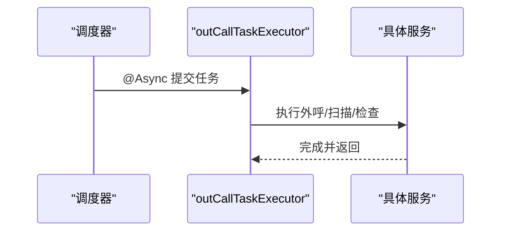
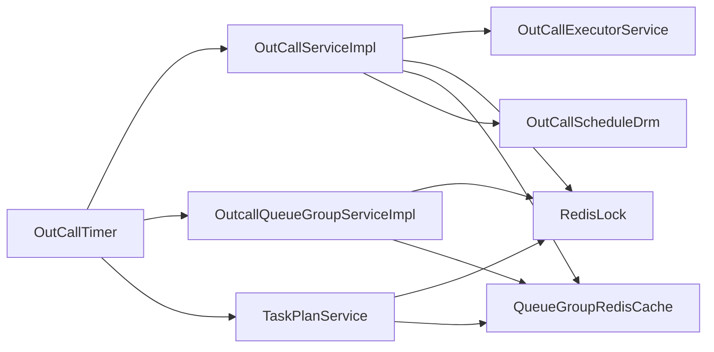

# 并发与分布式处理

<cite>
**本文引用的文件**
- [OutCallExecutorService.java](file://src/main/java/org/qianye/OutCallExecutorService.java)
- [RedisLock.java](file://src/main/java/org/qianye/RedisLock.java)
- [QueueGroupRedisCache.java](file://src/main/java/org/qianye/QueueGroupRedisCache.java)
- [OutCallTimer.java](file://src/main/java/org/qianye/OutCallTimer.java)
- [OutCallServiceImpl.java](file://src/main/java/org/qianye/OutCallServiceImpl.java)
- [OutcallQueueGroupServiceImpl.java](file://src/main/java/org/qianye/service/impl/OutcallQueueGroupServiceImpl.java)
- [TaskPlanService.java](file://src/main/java/org/qianye/TaskPlanService.java)
- [OutCallScheduleDrm.java](file://src/main/java/org/qianye/OutCallScheduleDrm.java)
- [OutCallRateLimitService.java](file://src/main/java/org/qianye/OutCallRateLimitService.java)
- [application.properties](file://src/main/resources/application.properties)
- [logback-spring.xml](file://src/main/resources/logback-spring.xml)
- [LoggerUtil.java](file://src/main/java/org/qianye/LoggerUtil.java)
- [TracerRunnable.java](file://src/main/java/org/qianye/TracerRunnable.java)
</cite>

## 目录
1. [简介](#简介)
2. [项目结构](#项目结构)
3. [核心组件](#核心组件)
4. [架构总览](#架构总览)
5. [详细组件分析](#详细组件分析)
6. [依赖分析](#依赖分析)
7. [性能考量](#性能考量)
8. [故障排查指南](#故障排查指南)
9. [结论](#结论)
10. [附录](#附录)

## 简介
本文件面向 Outcall 系统的并发与分布式处理，围绕以下主题展开：
- 线程池管理策略：配置、任务提交机制、监控与优雅停机
- Redis 分布式锁：实现原理、续期机制、超时与死锁预防
- 缓存管理策略：本地缓存与 Redis 缓存的协调与一致性
- 定时任务：调度机制、防抖与异步执行
- 并发控制最佳实践与性能优化建议
- 数据一致性与故障恢复机制
- 监控指标与调试方法

## 项目结构
Outcall 采用 Spring Boot 结构，核心并发与分布式处理由如下模块承担：
- 线程池与定时任务：OutCallExecutorService、OutCallTimer
- 分布式锁：RedisLock
- 缓存协调：QueueGroupRedisCache、OutCallScheduleDrm
- 业务执行入口：OutCallServiceImpl、OutcallQueueGroupServiceImpl、TaskPlanService
- 日志与配置：LoggerUtil、application.properties、logback-spring.xml

图表来源
- [OutCallExecutorService.java](file://src/main/java/org/qianye/OutCallExecutorService.java#L1-L211)
- [OutCallTimer.java](file://src/main/java/org/qianye/OutCallTimer.java#L1-L118)
- [RedisLock.java](file://src/main/java/org/qianye/RedisLock.java#L1-L645)
- [QueueGroupRedisCache.java](file://src/main/java/org/qianye/QueueGroupRedisCache.java#L1-L279)
- [OutCallServiceImpl.java](file://src/main/java/org/qianye/OutCallServiceImpl.java#L1-L1191)
- [OutcallQueueGroupServiceImpl.java](file://src/main/java/org/qianye/service/impl/OutcallQueueGroupServiceImpl.java#L1-L994)
- [TaskPlanService.java](file://src/main/java/org/qianye/TaskPlanService.java#L1-L1112)
- [OutCallScheduleDrm.java](file://src/main/java/org/qianye/OutCallScheduleDrm.java#L1-L113)

章节来源
- [OutCallExecutorService.java](file://src/main/java/org/qianye/OutCallExecutorService.java#L1-L211)
- [OutCallTimer.java](file://src/main/java/org/qianye/OutCallTimer.java#L1-L118)
- [application.properties](file://src/main/resources/application.properties#L1-L17)

## 核心组件
- 线程池管理：统一管理多类线程池，内置定时监控与优雅停机
- 分布式锁：基于 Redis 的 SETNX + Lua 解锁，配合本地续期表与定时续期
- 缓存协调：Redis 列表缓存 + Lua 原子操作；结合调度参数控制上限
- 定时任务：基于注解的调度，带随机抖动与异步执行
- 业务执行：按任务与队列组维度并发处理，结合限流与重试

章节来源
- [OutCallExecutorService.java](file://src/main/java/org/qianye/OutCallExecutorService.java#L1-L211)
- [RedisLock.java](file://src/main/java/org/qianye/RedisLock.java#L1-L645)
- [QueueGroupRedisCache.java](file://src/main/java/org/qianye/QueueGroupRedisCache.java#L1-L279)
- [OutCallTimer.java](file://src/main/java/org/qianye/OutCallTimer.java#L1-L118)
- [OutCallServiceImpl.java](file://src/main/java/org/qianye/OutCallServiceImpl.java#L1-L1191)

## 架构总览
Outcall 的并发与分布式处理以“线程池 + Redis + 定时任务”为核心，业务流程通过服务层编排，确保高吞吐与强一致。

图表来源
- [OutCallTimer.java](file://src/main/java/org/qianye/OutCallTimer.java#L64-L116)
- [OutCallExecutorService.java](file://src/main/java/org/qianye/OutCallExecutorService.java#L1-L211)
- [OutCallServiceImpl.java](file://src/main/java/org/qianye/OutCallServiceImpl.java#L680-L783)
- [RedisLock.java](file://src/main/java/org/qianye/RedisLock.java#L253-L313)
- [QueueGroupRedisCache.java](file://src/main/java/org/qianye/QueueGroupRedisCache.java#L130-L160)

## 详细组件分析

### 线程池管理策略
- 线程池类型与用途
  - 队列组处理线程池：用于并发处理单个队列组内的多个队列明细
  - 重试线程池：用于异常重试与补救
  - 外呼线程池：驱动任务分页与批次拉取
  - 华北外呼线程池：针对大租户的专用线程池
  - 计划任务线程池：用于规划与重规划
  - 通用外呼线程池：默认线程池，支持动态调整核心/最大线程
- 任务提交机制
  - 业务层通过 OutCallExecutorService 的静态线程池提交任务
  - 使用 DiscardPolicy 或 CallerRunsPolicy 控制饱和策略
- 线程池监控
  - 定时任务每 10 秒打印各线程池的活动线程数、池大小、队列长度等
- 优雅停机
  - PreDestroy 中关闭监控线程与各线程池，支持 awaitTermination 超时

图表来源
- [OutCallExecutorService.java](file://src/main/java/org/qianye/OutCallExecutorService.java#L14-L51)
- [OutCallExecutorService.java](file://src/main/java/org/qianye/OutCallExecutorService.java#L60-L137)
- [OutCallExecutorService.java](file://src/main/java/org/qianye/OutCallExecutorService.java#L141-L211)

章节来源
- [OutCallExecutorService.java](file://src/main/java/org/qianye/OutCallExecutorService.java#L1-L211)

### Redis 分布式锁实现与使用
- 实现原理
  - 获取锁：基于 Redis 的 setIfAbsent(key, value, expire)；成功后将锁信息写入本地 Map
  - 解锁：Lua 脚本判断 key 的值与期望值一致才删除，保证原子性
  - 续期：本地 Map 记录锁信息，定时任务每 2 秒检查并调用 expire 延长过期时间
- 超时与死锁预防
  - 锁过期间隔按锁总时长的 1/3 计算，避免频繁续期
  - 若续期失败且 Redis 中 key 已不存在，则清理本地续期记录
  - 锁过期时间超过阈值（如 10 秒）才开启续期
- 使用场景
  - 队列组级别的并发控制：同一任务+组在同一时刻仅允许一个实例持有锁
  - 规划阶段的互斥：规划普通组与择时组的互斥执行
- 错误处理
  - 续期异常与解锁异常均记录日志，不影响业务主流程

图表来源
- [RedisLock.java](file://src/main/java/org/qianye/RedisLock.java#L253-L273)
- [RedisLock.java](file://src/main/java/org/qianye/RedisLock.java#L291-L313)
- [RedisLock.java](file://src/main/java/org/qianye/RedisLock.java#L413-L487)
- [RedisLock.java](file://src/main/java/org/qianye/RedisLock.java#L491-L641)

章节来源
- [RedisLock.java](file://src/main/java/org/qianye/RedisLock.java#L1-L645)
- [OutcallQueueGroupServiceImpl.java](file://src/main/java/org/qianye/service/impl/OutcallQueueGroupServiceImpl.java#L171-L200)
- [TaskPlanService.java](file://src/main/java/org/qianye/TaskPlanService.java#L485-L526)

### 缓存管理策略：本地缓存与 Redis 缓存的协调
- Redis 列表缓存
  - 使用 LPUSH 批量入队，EXPIRE 设置过期时间，保证队列组缓存的时效性
  - 使用 RPOP 原子弹出，支持私有组与公共组两类键空间
  - 通过 Lua 脚本保证原子性，避免竞态
- 本地缓存与 Redis 的协调
  - 业务侧通过 QueueGroupRedisCache 读写 Redis 列表，减少数据库压力
  - 通过 OutCallScheduleDrm 控制缓存上限与批次大小，避免内存膨胀
- 一致性保障
  - 队列组状态变更通过服务层统一更新，Redis 缓存作为读路径
  - 对于需要强一致的写路径，仍依赖数据库事务（如规划与状态切换）

图表来源
- [QueueGroupRedisCache.java](file://src/main/java/org/qianye/QueueGroupRedisCache.java#L86-L114)
- [QueueGroupRedisCache.java](file://src/main/java/org/qianye/QueueGroupRedisCache.java#L130-L160)
- [OutCallScheduleDrm.java](file://src/main/java/org/qianye/OutCallScheduleDrm.java#L109-L111)

章节来源
- [QueueGroupRedisCache.java](file://src/main/java/org/qianye/QueueGroupRedisCache.java#L1-L279)
- [OutCallScheduleDrm.java](file://src/main/java/org/qianye/OutCallScheduleDrm.java#L1-L113)

### 定时任务的实现与调度机制
- 调度方式
  - 基于 @EnableScheduling 与 @Scheduled 的 Cron 表达式
  - 使用 @Async 指定线程池执行，避免阻塞调度线程
- 任务清单
  - 外呼主流程：每分钟触发
  - 任务扫描与规划：每两分钟触发
  - 队列组状态检查：每五分钟触发
  - 队列详情扫描：每五分钟触发
- 防抖机制
  - 每个任务在执行前加入随机延迟，降低同时触发的概率
- 线程池配置
  - 自定义 ThreadPoolTaskExecutor，设置核心/最大线程、队列容量、拒绝策略与优雅停机

图表来源
- [OutCallTimer.java](file://src/main/java/org/qianye/OutCallTimer.java#L64-L116)

章节来源
- [OutCallTimer.java](file://src/main/java/org/qianye/OutCallTimer.java#L1-L118)

### 并发控制最佳实践与性能优化建议
- 线程池优化
  - 根据负载动态调整核心/最大线程数（业务侧可读取调度参数）
  - 合理设置队列容量与饱和策略，避免内存积压
  - 监控线程池状态，及时发现阻塞与丢弃
- 限流与节流
  - 使用 waitForRateLimitRelease 进行带超时的限流等待
  - 控制请求速率（sleep），避免瞬时高峰
- 缓存与批处理
  - 使用 Redis 列表与 Lua 原子操作提升吞吐
  - 合理设置批次大小与缓存上限，避免过载
- 锁的粒度与超时
  - 锁粒度尽量细化（按任务+组），缩短持有时间
  - 设置合理的过期时间与续期阈值，避免频繁续期
- 异常与重试
  - 对异常任务进行重规划与延迟重试
  - 使用独立的重试线程池，隔离影响

章节来源
- [OutCallServiceImpl.java](file://src/main/java/org/qianye/OutCallServiceImpl.java#L841-L904)
- [OutCallServiceImpl.java](file://src/main/java/org/qianye/OutCallServiceImpl.java#L602-L679)
- [OutCallScheduleDrm.java](file://src/main/java/org/qianye/OutCallScheduleDrm.java#L1-L113)

### 数据一致性与故障恢复机制
- 一致性
  - Redis 缓存作为读路径，状态变更通过服务层统一落地数据库
  - Lua 脚本保证 Redis 操作的原子性
- 故障恢复
  - 分布式锁具备续期与失效清理逻辑，避免死锁
  - 业务异常时进行重规划与状态回滚
  - 定时任务兜底检查队列组状态，修复异常

章节来源
- [RedisLock.java](file://src/main/java/org/qianye/RedisLock.java#L413-L487)
- [TaskPlanService.java](file://src/main/java/org/qianye/TaskPlanService.java#L142-L190)
- [OutcallQueueGroupServiceImpl.java](file://src/main/java/org/qianye/service/impl/OutcallQueueGroupServiceImpl.java#L70-L162)

### 监控指标与调试方法
- 线程池监控
  - 每 10 秒打印各线程池的活动线程数、池大小、队列长度、完成任务数
- 日志规范
  - 使用 LoggerUtil 统一封装日志输出，支持占位符与异常堆栈
  - 日志配置位于 logback-spring.xml，控制台输出便于本地调试
- 调试建议
  - 结合线程池状态与业务日志定位瓶颈
  - 对锁续期失败与解锁失败进行专项排查

章节来源
- [OutCallExecutorService.java](file://src/main/java/org/qianye/OutCallExecutorService.java#L66-L137)
- [LoggerUtil.java](file://src/main/java/org/qianye/LoggerUtil.java#L1-L56)
- [logback-spring.xml](file://src/main/resources/logback-spring.xml#L1-L32)

## 依赖分析
- 组件耦合
  - OutCallServiceImpl 依赖线程池、RedisLock、QueueGroupRedisCache、调度参数等
  - OutcallQueueGroupServiceImpl 与 TaskPlanService 依赖 RedisLock 与缓存
  - OutCallTimer 依赖各服务并通过线程池异步执行
- 外部依赖
  - RedisTemplate、Lua 脚本、Spring Scheduling
- 潜在风险
  - 线程池饱和与队列积压
  - 锁续期失败导致的重复执行
  - Redis 脚本异常与网络抖动

图表来源
- [OutCallServiceImpl.java](file://src/main/java/org/qianye/OutCallServiceImpl.java#L31-L70)
- [OutcallQueueGroupServiceImpl.java](file://src/main/java/org/qianye/service/impl/OutcallQueueGroupServiceImpl.java#L34-L68)
- [TaskPlanService.java](file://src/main/java/org/qianye/TaskPlanService.java#L30-L76)
- [OutCallTimer.java](file://src/main/java/org/qianye/OutCallTimer.java#L23-L42)

章节来源
- [OutCallServiceImpl.java](file://src/main/java/org/qianye/OutCallServiceImpl.java#L1-L1191)
- [OutcallQueueGroupServiceImpl.java](file://src/main/java/org/qianye/service/impl/OutcallQueueGroupServiceImpl.java#L1-L994)
- [TaskPlanService.java](file://src/main/java/org/qianye/TaskPlanService.java#L1-L1112)
- [OutCallTimer.java](file://src/main/java/org/qianye/OutCallTimer.java#L1-L118)

## 性能考量
- 线程池参数建议
  - 根据 CPU 核心数与 IO 密集程度设置核心线程数
  - 队列容量与丢弃策略需结合业务峰值与 SLA
- Redis 优化
  - 使用 Lua 脚本减少往返
  - 控制过期时间与续期频率，避免频繁续期
- 限流与节流
  - 合理设置等待超时与睡眠间隔，平衡吞吐与延迟
- 缓存上限
  - 通过调度参数控制缓存上限，避免内存压力

## 故障排查指南
- 线程池问题
  - 观察线程池状态日志，定位队列积压与饱和丢弃
  - 检查优雅停机流程，确认线程池关闭顺序
- Redis 锁问题
  - 检查续期失败日志，确认锁是否被其他实例持有
  - 核对 Lua 解锁脚本是否正确执行
- 缓存问题
  - 核对 Lua 脚本执行结果，确认入队/出队原子性
  - 检查缓存上限与过期策略
- 定时任务问题
  - 查看随机抖动是否生效，避免集中触发
  - 检查线程池拒绝策略与任务耗时

章节来源
- [OutCallExecutorService.java](file://src/main/java/org/qianye/OutCallExecutorService.java#L66-L137)
- [RedisLock.java](file://src/main/java/org/qianye/RedisLock.java#L413-L487)
- [QueueGroupRedisCache.java](file://src/main/java/org/qianye/QueueGroupRedisCache.java#L237-L269)
- [OutCallTimer.java](file://src/main/java/org/qianye/OutCallTimer.java#L48-L116)

## 结论
Outcall 通过“线程池 + Redis + 定时任务”的组合，在保证高并发的同时实现了强一致与可恢复性。建议在生产环境中持续监控线程池与锁续期状态，结合调度参数动态调优，并完善限流与降级策略以应对突发流量。

## 附录
- 配置参考
  - 环境与数据源：application.properties
  - 日志输出：logback-spring.xml
- 关键类与职责
  - OutCallExecutorService：线程池与监控
  - RedisLock：分布式锁与续期
  - QueueGroupRedisCache：Redis 列表缓存与 Lua 原子操作
  - OutCallTimer：定时任务与异步执行
  - OutCallServiceImpl：外呼主流程与并发控制
  - OutcallQueueGroupServiceImpl：队列组状态检查与规划
  - TaskPlanService：重规划与批处理
  - OutCallScheduleDrm：调度参数与阈值
  - OutCallRateLimitService：限流接口（待完善）
  - LoggerUtil：日志工具
  - TracerRunnable：支持链路追踪的 Runnable 基类

章节来源
- [application.properties](file://src/main/resources/application.properties#L1-L17)
- [logback-spring.xml](file://src/main/resources/logback-spring.xml#L1-L32)
- [OutCallServiceImpl.java](file://src/main/java/org/qianye/OutCallServiceImpl.java#L1-L1191)
- [OutcallQueueGroupServiceImpl.java](file://src/main/java/org/qianye/service/impl/OutcallQueueGroupServiceImpl.java#L1-L994)
- [TaskPlanService.java](file://src/main/java/org/qianye/TaskPlanService.java#L1-L1112)
- [OutCallScheduleDrm.java](file://src/main/java/org/qianye/OutCallScheduleDrm.java#L1-L113)
- [OutCallRateLimitService.java](file://src/main/java/org/qianye/OutCallRateLimitService.java#L1-L17)
- [LoggerUtil.java](file://src/main/java/org/qianye/LoggerUtil.java#L1-L56)
- [TracerRunnable.java](file://src/main/java/org/qianye/TracerRunnable.java#L1-L15)