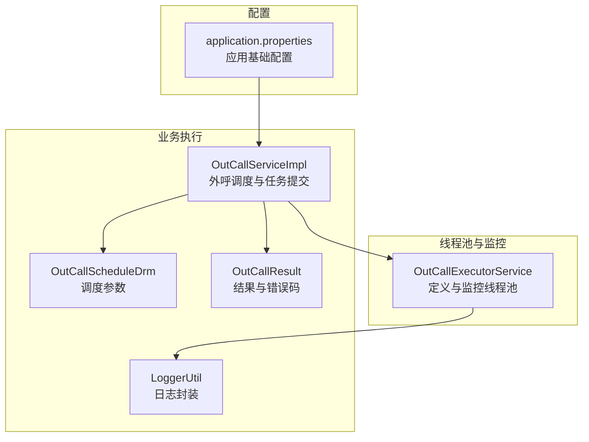
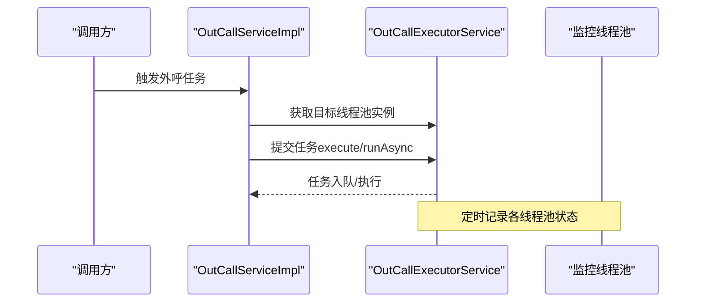
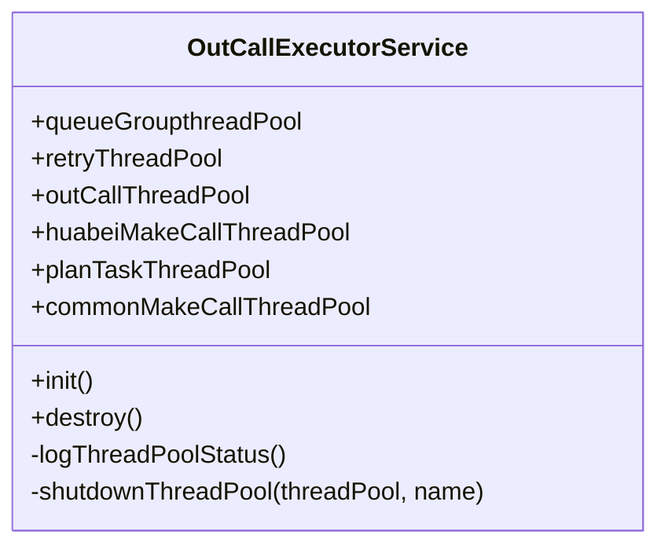
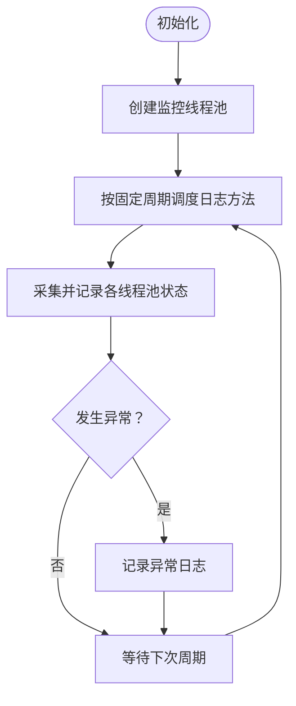
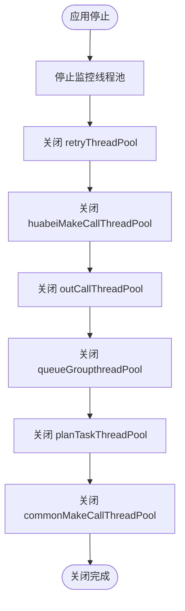
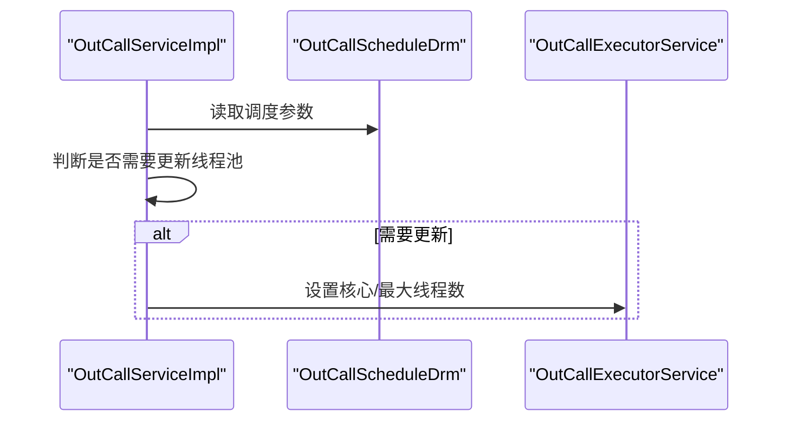
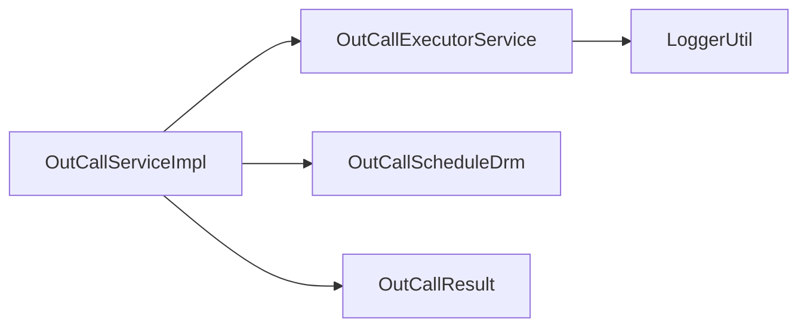

# 线程池管理

<cite>
**本文引用的文件**
- [OutCallExecutorService.java](file://src/main/java/org/qianye/OutCallExecutorService.java)
- [OutCallServiceImpl.java](file://src/main/java/org/qianye/engine/OutCallServiceImpl.java)
- [OutCallScheduleDrm.java](file://src/main/java/org/qianye/OutCallScheduleDrm.java)
- [application.properties](file://src/main/resources/application.properties)
- [LoggerUtil.java](file://src/main/java/org/qianye/LoggerUtil.java)
- [OutCallResult.java](file://src/main/java/org/qianye/OutCallResult.java)
</cite>

## 更新摘要
**变更内容**
- 更新了线程池配置简化部分，反映 OutCallExecutorService 中拒绝策略的统一化
- 修正了线程池参数配置的准确性，特别是 commonMakeCallThreadPool 的拒绝策略
- 更新了动态配置调整机制的描述，强调了核心线程数和最大线程数的动态调整
- 完善了监控机制的说明，增加了具体的监控指标解读

## 目录
1. [简介](#简介)
2. [项目结构](#项目结构)
3. [核心组件](#核心组件)
4. [架构总览](#架构总览)
5. [详细组件分析](#详细组件分析)
6. [依赖关系分析](#依赖关系分析)
7. [性能考量](#性能考量)
8. [故障排查指南](#故障排查指南)
9. [结论](#结论)
10. [附录](#附录)

## 简介
本文件围绕 Outcall 系统的线程池管理展开，系统通过多个专用线程池实现高并发外呼任务的分层处理与隔离控制。本文将详细说明各线程池的设计目的、参数配置、拒绝策略选择原理、监控机制、优雅关闭流程，并给出最佳实践与调优建议。

## 项目结构
与线程池管理相关的关键文件如下：
- 线程池服务与监控：OutCallExecutorService
- 外呼调度与任务执行：OutCallServiceImpl
- 调度参数与阈值：OutCallScheduleDrm
- 日志工具：LoggerUtil
- 结果枚举：OutCallResult
- 应用配置：application.properties

**图表来源**
- [OutCallExecutorService.java](file://src/main/java/org/qianye/OutCallExecutorService.java#L1-L152)
- [OutCallServiceImpl.java](file://src/main/java/org/qianye/engine/OutCallServiceImpl.java#L1-L772)
- [OutCallScheduleDrm.java](file://src/main/java/org/qianye/OutCallScheduleDrm.java#L1-L112)
- [LoggerUtil.java](file://src/main/java/org/qianye/LoggerUtil.java#L1-L55)
- [OutCallResult.java](file://src/main/java/org/qianye/OutCallResult.java#L1-L48)
- [application.properties](file://src/main/resources/application.properties#L1-L14)

**章节来源**
- [OutCallExecutorService.java](file://src/main/java/org/qianye/OutCallExecutorService.java#L1-L152)
- [OutCallServiceImpl.java](file://src/main/java/org/qianye/engine/OutCallServiceImpl.java#L1-L772)
- [OutCallScheduleDrm.java](file://src/main/java/org/qianye/OutCallScheduleDrm.java#L1-L112)
- [application.properties](file://src/main/resources/application.properties#L1-L14)

## 核心组件
本节对六个线程池逐一说明其用途、参数与拒绝策略选择原则。

- queueGroupthreadPool
  - 用途：处理"队列组"级别的异步任务，负责对单个队列组内的多个队列进行并发处理。
  - 参数：核心线程数 10、最大线程数 40、存活时间 60 秒、阻塞队列容量 2000、拒绝策略 DiscardPolicy。
  - 设计要点：队列容量适中，避免堆积导致内存压力；丢弃策略保证系统在高负载下仍能维持稳定。

- retryThreadPool
  - 用途：重试与异常恢复任务的处理，如队列或任务异常后的重计划。
  - 参数：核心线程数 20、最大线程数 40、存活时间 60 秒、阻塞队列容量 2000、拒绝策略 CallerRunsPolicy。
  - 设计要点：采用 CallerRunsPolicy 降低峰值冲击并保留关键路径。

- outCallThreadPool
  - 用途：外呼主流程的批处理与调度，承载"每页任务"的批量处理。
  - 参数：核心线程数 20、最大线程数 64、存活时间 60 秒、阻塞队列容量 10000、拒绝策略 DiscardPolicy。
  - 设计要点：较大的队列容量支持批量处理，丢弃策略保障系统稳定性。

- huabeiMakeCallThreadPool
  - 用途：面向大租户或高并发场景的专用外呼线程池，提升吞吐能力。
  - 参数：核心线程数 20、最大线程数 160、存活时间 60 秒、阻塞队列容量 20000、拒绝策略 DiscardPolicy。
  - 设计要点：支持动态扩容，满足大租户的高并发需求。

- planTaskThreadPool
  - 用途：计划类任务的处理，如定时/周期性任务的调度与执行。
  - 参数：核心线程数 20、最大线程数 40、存活时间 60 秒、阻塞队列容量 10000、拒绝策略 DiscardPolicy。
  - 设计要点：稳定的计划任务处理能力。

- commonMakeCallThreadPool
  - 用途：通用外呼任务的并发处理，作为默认线程池使用。
  - 参数：核心线程数 80、最大线程数 160、存活时间 60 秒、阻塞队列容量 10000。
  - 拒绝策略：未显式指定，默认采用 JDK 默认策略（通常为抛出异常）。
  - 设计要点：作为通用池使用，支持动态调整核心线程数和最大线程数。

**章节来源**
- [OutCallExecutorService.java](file://src/main/java/org/qianye/OutCallExecutorService.java#L14-L37)

## 架构总览
Outcall 的线程池管理采用"分层隔离 + 动态调整 + 可观测"的设计思路：
- 分层隔离：不同职责的任务分配到不同线程池，避免相互影响。
- 动态调整：根据调度参数实时调整核心/最大线程数，提升弹性。
- 可观测：定时记录各线程池状态，便于问题定位与容量评估。

**图表来源**
- [OutCallServiceImpl.java](file://src/main/java/org/qianye/engine/OutCallServiceImpl.java#L88-L93)
- [OutCallExecutorService.java](file://src/main/java/org/qianye/OutCallExecutorService.java#L40-L49)

## 详细组件分析

### 线程池定义与参数详解
- queueGroupthreadPool
  - 核心线程数 10、最大线程数 40、存活时间 60 秒、队列容量 2000、拒绝策略 DiscardPolicy。
  - 适用场景：队列组内并发处理，避免阻塞主流程。
- retryThreadPool
  - 核心线程数 20、最大线程数 40、存活时间 60 秒、队列容量 2000、拒绝策略 CallerRunsPolicy。
  - 适用场景：异常重试与补偿，采用 CallerRunsPolicy 降低峰值。
- outCallThreadPool
  - 核心线程数 20、最大线程数 64、存活时间 60 秒、队列容量 10000、拒绝策略 DiscardPolicy。
  - 适用场景：批量任务处理，丢弃策略保障系统稳定性。
- huabeiMakeCallThreadPool
  - 核心线程数 20、最大线程数 160、存活时间 60 秒、队列容量 20000、拒绝策略 DiscardPolicy。
  - 适用场景：大租户/高并发场景，支持动态扩容。
- planTaskThreadPool
  - 核心线程数 20、最大线程数 40、存活时间 60 秒、队列容量 10000、拒绝策略 DiscardPolicy。
  - 适用场景：计划类任务的周期性执行。
- commonMakeCallThreadPool
  - 核心线程数 80、最大线程数 160、存活时间 60 秒、队列容量 10000。
  - 适用场景：通用外呼任务，作为默认池使用。

**图表来源**
- [OutCallExecutorService.java](file://src/main/java/org/qianye/OutCallExecutorService.java#L14-L37)

**章节来源**
- [OutCallExecutorService.java](file://src/main/java/org/qianye/OutCallExecutorService.java#L14-L37)

### 线程池监控机制
- 定时任务：启动一个固定大小的监控线程池，按固定周期记录各线程池状态。
- 记录内容：活动线程数、池大小、核心/最大线程数、已完成任务数、队列长度等。
- 异常处理：监控过程出现异常会被捕获并记录，避免影响业务线程池。

**图表来源**
- [OutCallExecutorService.java](file://src/main/java/org/qianye/OutCallExecutorService.java#L40-L49)
- [OutCallExecutorService.java](file://src/main/java/org/qianye/OutCallExecutorService.java#L51-L110)

**章节来源**
- [OutCallExecutorService.java](file://src/main/java/org/qianye/OutCallExecutorService.java#L40-L110)

### 优雅关闭与销毁流程
- 关闭监控：先停止监控线程池，设定超时并强制终止。
- 关闭各线程池：逐个执行 shutdown，等待指定超时；若未完成则强制 shutdownNow。
- 日志记录：每个线程池关闭后记录成功或警告信息。

**图表来源**
- [OutCallExecutorService.java](file://src/main/java/org/qianye/OutCallExecutorService.java#L112-L133)
- [OutCallExecutorService.java](file://src/main/java/org/qianye/OutCallExecutorService.java#L135-L151)

**章节来源**
- [OutCallExecutorService.java](file://src/main/java/org/qianye/OutCallExecutorService.java#L112-L151)

### 动态线程池配置与调优
- 动态调整触发条件：当调度参数变化时，更新对应线程池的核心/最大线程数。
- 调整对象：huabeiMakeCallThreadPool 与 commonMakeCallThreadPool。
- 触发位置：在执行外呼流程前检查并更新线程池配置。

**图表来源**
- [OutCallServiceImpl.java](file://src/main/java/org/qianye/engine/OutCallServiceImpl.java#L576-L590)
- [OutCallScheduleDrm.java](file://src/main/java/org/qianye/OutCallScheduleDrm.java#L30-L44)

**章节来源**
- [OutCallServiceImpl.java](file://src/main/java/org/qianye/engine/OutCallServiceImpl.java#L576-L590)
- [OutCallScheduleDrm.java](file://src/main/java/org/qianye/OutCallScheduleDrm.java#L30-L44)

### 任务提交与拒绝处理
- 任务提交：业务侧根据场景选择合适的线程池提交任务。
- 拒绝处理：
  - DiscardPolicy：丢弃新任务，适合非关键路径。
  - CallerRunsPolicy：由调用线程直接执行，适合保护关键路径。
  - 默认策略：未显式设置时采用 JDK 默认策略（通常抛出异常）。
- 异常分支：当线程池满或队列达到阈值时，业务侧会将队列置为等待或失败，并记录相应原因。

**章节来源**
- [OutCallExecutorService.java](file://src/main/java/org/qianye/OutCallExecutorService.java#L14-L37)
- [OutCallServiceImpl.java](file://src/main/java/org/qianye/engine/OutCallServiceImpl.java#L494-L542)
- [OutCallResult.java](file://src/main/java/org/qianye/OutCallResult.java#L1-L48)

## 依赖关系分析
- OutCallServiceImpl 依赖 OutCallExecutorService 获取线程池实例，并在执行过程中根据租户与场景选择不同的线程池。
- OutCallScheduleDrm 提供动态参数，驱动线程池的动态调整。
- LoggerUtil 用于统一的日志输出，便于监控与排障。

**图表来源**
- [OutCallServiceImpl.java](file://src/main/java/org/qianye/engine/OutCallServiceImpl.java#L1-L772)
- [OutCallExecutorService.java](file://src/main/java/org/qianye/OutCallExecutorService.java#L1-L152)
- [OutCallScheduleDrm.java](file://src/main/java/org/qianye/OutCallScheduleDrm.java#L1-L112)
- [LoggerUtil.java](file://src/main/java/org/qianye/LoggerUtil.java#L1-L55)
- [OutCallResult.java](file://src/main/java/org/qianye/OutCallResult.java#L1-L48)

**章节来源**
- [OutCallServiceImpl.java](file://src/main/java/org/qianye/engine/OutCallServiceImpl.java#L1-L772)
- [OutCallExecutorService.java](file://src/main/java/org/qianye/OutCallExecutorService.java#L1-L152)
- [OutCallScheduleDrm.java](file://src/main/java/org/qianye/OutCallScheduleDrm.java#L1-L112)
- [LoggerUtil.java](file://src/main/java/org/qianye/LoggerUtil.java#L1-L55)
- [OutCallResult.java](file://src/main/java/org/qianye/OutCallResult.java#L1-L48)

## 性能考量
- 线程数与队列容量平衡：核心线程数决定并发能力，队列容量决定背压能力。应结合任务类型与 SLA 进行权衡。
- 拒绝策略选择：
  - 非关键路径：丢弃策略（DiscardPolicy）可避免雪崩。
  - 关键路径：调用方线程执行（CallerRunsPolicy）可保护系统。
- 动态扩缩容：在流量高峰前提升核心/最大线程数，在低峰期回收资源，减少空闲占用。
- 监控指标：关注活动线程数、队列长度、拒绝次数、任务完成数等，作为容量与策略优化依据。

## 故障排查指南
- 线程池状态日志：通过监控日志观察活动线程数、队列长度与完成任务数，判断是否存在积压或过载。
- 拒绝原因定位：结合业务侧对"线程池满/队列超限"的处理逻辑，定位具体错误码（如队列限制、池满等）。
- 优雅关闭验证：确认应用停止时监控线程池与各业务线程池均被正确关闭，避免资源泄漏。

**章节来源**
- [OutCallExecutorService.java](file://src/main/java/org/qianye/OutCallExecutorService.java#L51-L110)
- [OutCallServiceImpl.java](file://src/main/java/org/qianye/engine/OutCallServiceImpl.java#L494-L542)
- [OutCallResult.java](file://src/main/java/org/qianye/OutCallResult.java#L1-L48)

## 结论
Outcall 系统通过多线程池分层隔离、动态配置与全面监控，实现了高并发外呼任务的稳定与高效执行。合理选择拒绝策略、动态扩缩容与持续监控是保障系统性能与可用性的关键。

## 附录

### 线程池参数与含义对照
- 核心线程数：线程池保持的最小线程数，即使空闲也不回收。
- 最大线程数：线程池允许的最大线程数，超过核心线程数的任务将进入队列或创建新线程。
- 存活时间：非核心线程在空闲时的存活时间，超时后被回收。
- 阻塞队列容量：任务排队的最大容量，决定背压能力。
- 拒绝策略：
  - 丢弃策略（DiscardPolicy）：直接丢弃新任务。
  - 调用方线程执行（CallerRunsPolicy）：由提交任务的线程直接执行。
  - 默认策略：抛出异常（未显式设置时）。

**章节来源**
- [OutCallExecutorService.java](file://src/main/java/org/qianye/OutCallExecutorService.java#L14-L37)

### 监控指标解读
- 活动线程数：当前正在执行任务的线程数，反映瞬时并发压力。
- 池大小：当前线程池中的线程总数。
- 核心/最大线程数：当前配置的线程数，用于对比是否发生动态调整。
- 已完成任务数：累计完成的任务数，用于评估吞吐。
- 队列长度：当前等待执行的任务数，用于判断背压与积压风险。

**章节来源**
- [OutCallExecutorService.java](file://src/main/java/org/qianye/OutCallExecutorService.java#L51-L110)

### 配置示例与最佳实践
- 配置示例（基于代码中的默认值与调度参数）：
  - queueGroupthreadPool：核心线程数 10、最大线程数 40、队列容量 2000、丢弃策略。
  - retryThreadPool：核心线程数 20、最大线程数 40、队列容量 2000、调用方线程执行策略。
  - outCallThreadPool：核心线程数 20、最大线程数 64、队列容量 10000、丢弃策略。
  - huabeiMakeCallThreadPool：核心线程数 20、最大线程数 160、队列容量 20000、丢弃策略。
  - planTaskThreadPool：核心线程数 20、最大线程数 40、队列容量 10000、丢弃策略。
  - commonMakeCallThreadPool：核心线程数 80、最大线程数 160、队列容量 10000。
- 最佳实践：
  - 对关键路径采用 CallerRunsPolicy 或适度扩大线程池，避免阻塞。
  - 对非关键路径采用丢弃策略，防止系统过载。
  - 根据业务峰值动态调整核心/最大线程数，配合队列容量形成合理的背压。
  - 定期检查监控日志，结合错误码与队列长度进行容量与策略优化。

**章节来源**
- [OutCallExecutorService.java](file://src/main/java/org/qianye/OutCallExecutorService.java#L14-L37)
- [OutCallScheduleDrm.java](file://src/main/java/org/qianye/OutCallScheduleDrm.java#L30-L44)
- [OutCallServiceImpl.java](file://src/main/java/org/qianye/engine/OutCallServiceImpl.java#L576-L590)