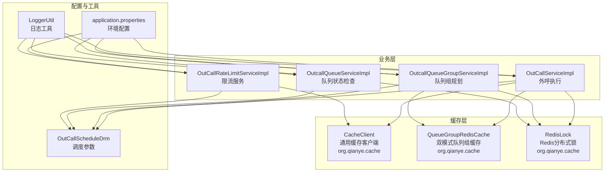
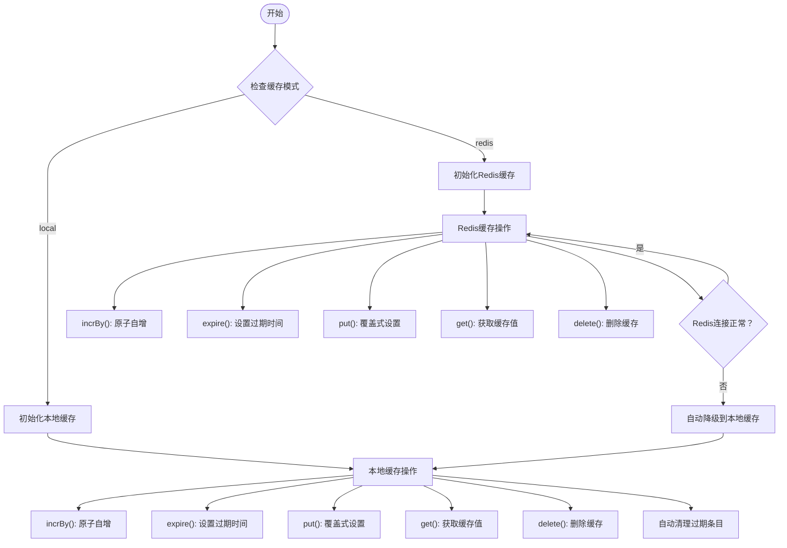
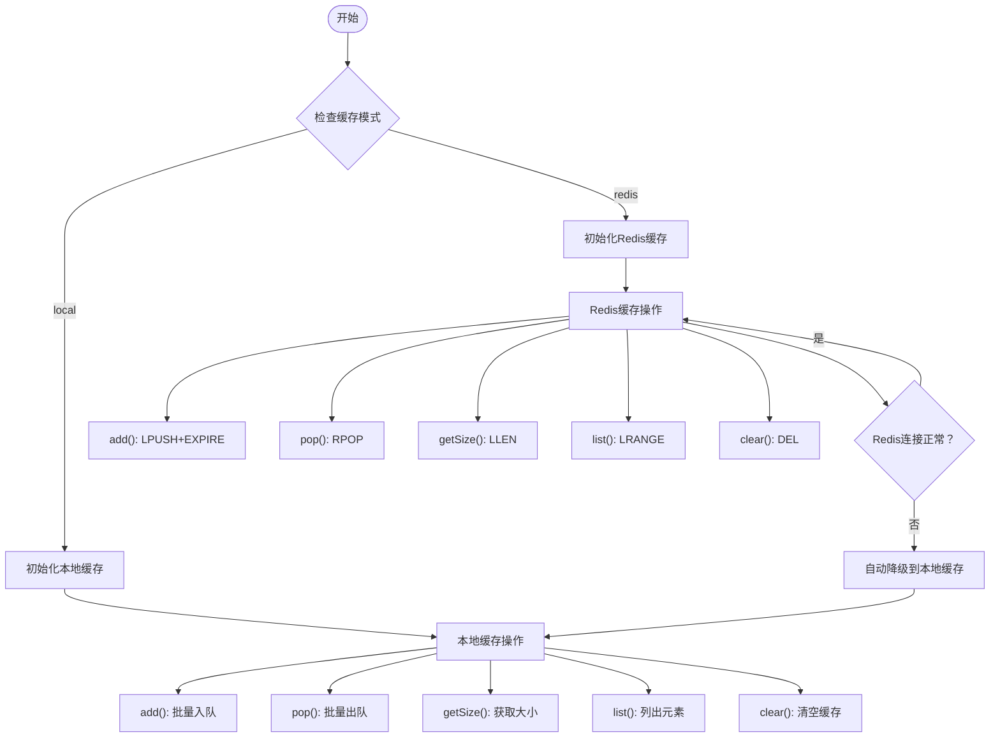
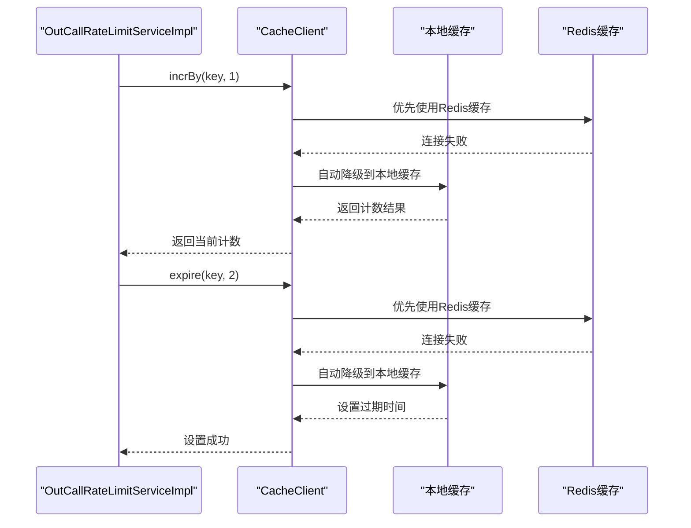
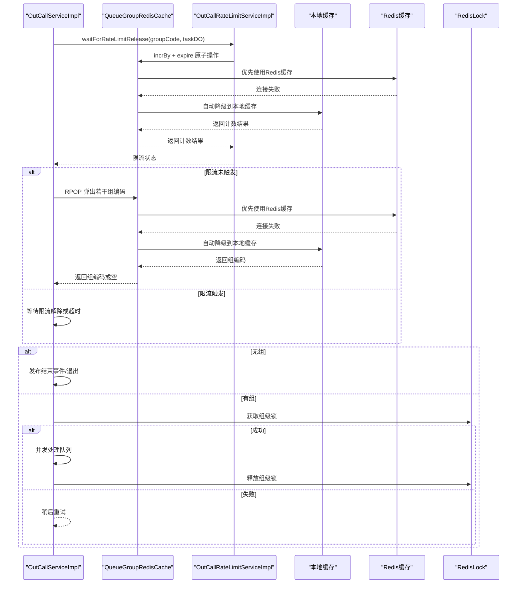
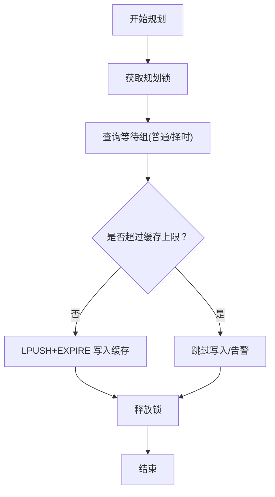
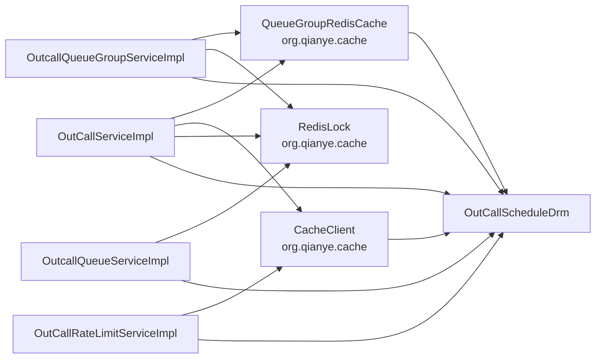

# 缓存管理

<cite>
**本文引用的文件**   
- [CacheClient.java](file://src/main/java/org/qianye/cache/CacheClient.java)
- [QueueGroupRedisCache.java](file://src/main/java/org/qianye/cache/QueueGroupRedisCache.java)
- [OutCallRateLimitServiceImpl.java](file://src/main/java/org/qianye/engine/OutCallRateLimitServiceImpl.java)
- [OutCallServiceImpl.java](file://src/main/java/org/qianye/engine/OutCallServiceImpl.java)
- [application.properties](file://src/main/resources/application.properties)
- [OutcallQueueGroupServiceImpl.java](file://src/main/java/org/qianye/service/impl/OutcallQueueGroupServiceImpl.java)
- [OutcallQueueServiceImpl.java](file://src/main/java/org/qianye/service/impl/OutcallQueueServiceImpl.java)
- [OutCallScheduleDrm.java](file://src/main/java/org/qianye/common/OutCallScheduleDrm.java)
- [LoggerUtil.java](file://src/main/java/org/qianye/util/LoggerUtil.java)
</cite>

## 更新摘要
**变更内容**   
- 新增 CacheClient 类，提供原子增量操作支持 (`incrBy`) 和过期管理功能
- QueueGroupRedisCache 实现了重大增强：新增本地缓存支持、自动降级机制、双模式缓存切换配置
- 新增配置项 app.cache.type 和 app.queue.group.cache.type，支持 local 和 redis 两种模式
- 新增限流系统支持，通过 CacheClient 为新的限流功能提供基础缓存能力
- Redis 连接失败时自动回退到本地缓存模式
- 本地缓存实现基于 ConcurrentHashMap 和读写锁，支持过期时间和原子操作
- 保持向后兼容性，原有 Redis 模式功能完全保留

## 目录
1. [简介](#简介)
2. [项目结构](#项目结构)
3. [核心组件](#核心组件)
4. [架构总览](#架构总览)
5. [组件详解](#组件详解)
6. [依赖关系分析](#依赖关系分析)
7. [性能与容量规划](#性能与容量规划)
8. [故障排查指南](#故障排查指南)
9. [结论](#结论)
10. [附录](#附录)

## 简介
本文件系统性梳理 Outcall 系统的缓存管理机制，重点覆盖：
- **双模式队列组缓存系统**：本地缓存与Redis缓存的无缝切换与自动降级
- **通用缓存客户端**：支持原子增量操作、过期管理和自动清理机制
- 队列组 Redis 列表的实现与使用
- 本地与远程缓存的协同策略
- 数据同步与一致性保障（基于 Redis Lua 原子操作、分布式锁）
- 缓存命中率优化与缓存穿透防护
- 序列化与反序列化处理
- 缓存配置参数与性能调优建议
- 监控指标与故障排查方法
- 分布式环境下的一致性与更新策略
- 限流系统支持与缓存穿透防护

## 项目结构
与缓存相关的关键模块现在都位于 org.qianye.cache 包中：
- **通用缓存客户端**：支持本地缓存和Redis缓存两种模式，提供原子增量操作和过期管理
- **双模式队列组缓存**：支持本地缓存和Redis缓存两种模式，可动态切换并自动降级
- 队列组 Redis 缓存：负责队列组的入队、出队、大小查询、清空等操作
- 分布式锁：提供 Redis 分布式锁与自动续期
- 业务服务：队列组规划、队列状态检查、外呼执行流程、限流服务
- 配置与环境：调度参数、环境变量
- 日志工具：统一日志格式化



**图表来源**
- [CacheClient.java](file://src/main/java/org/qianye/cache/CacheClient.java#L1-L237)
- [QueueGroupRedisCache.java](file://src/main/java/org/qianye/cache/QueueGroupRedisCache.java#L1-L380)
- [OutCallRateLimitServiceImpl.java](file://src/main/java/org/qianye/engine/OutCallRateLimitServiceImpl.java#L1-L105)
- [OutCallServiceImpl.java](file://src/main/java/org/qianye/engine/OutCallServiceImpl.java#L1-L764)
- [OutcallQueueGroupServiceImpl.java](file://src/main/java/org/qianye/service/impl/OutcallQueueGroupServiceImpl.java#L1-L633)
- [OutcallQueueServiceImpl.java](file://src/main/java/org/qianye/service/impl/OutcallQueueServiceImpl.java#L1-L527)
- [application.properties](file://src/main/resources/application.properties#L1-L39)
- [LoggerUtil.java](file://src/main/java/org/qianye/util/LoggerUtil.java#L1-L56)

## 核心组件
- **通用缓存客户端（CacheClient）**
  - 支持本地缓存和Redis缓存两种模式，默认使用本地缓存
  - 通过配置 `app.cache.type=local|redis` 切换缓存模式
  - 提供原子增量操作 `incrBy` 支持，用于限流和计数场景
  - 支持过期时间管理，提供 `expire` 方法设置缓存过期时间
  - 本地缓存实现基于 ConcurrentHashMap，支持自动过期清理
  - 支持 `putNotExist`、`exists`、`delete`、`get`、`put` 等基础缓存操作
- **双模式队列组缓存（QueueGroupRedisCache）**
  - 支持本地缓存和Redis缓存两种模式，默认使用本地缓存
  - 通过配置 `app.queue.group.cache.type=local|redis` 切换缓存模式
  - Redis模式下使用RedisTemplate.opsForList()进行缓存操作
  - 本地缓存实现基于ConcurrentHashMap，支持过期时间管理和原子操作
  - 自动降级机制：Redis连接失败时自动回退到本地缓存模式
  - 支持私有组与公共组两类键空间，便于隔离与清理
- **分布式锁（RedisLock）**
  - 基于 Redis setNx 实现分布式互斥锁，支持自动续期与线程池定时续期
  - 使用 Lua 脚本安全释放锁，避免误删他人锁
  - 支持锁信息跟踪和续期线程池管理
- **限流服务（OutCallRateLimitServiceImpl）**
  - 基于 CacheClient 实现的限流功能
  - 使用 `incrBy` 进行原子计数，支持每2秒窗口的CPS限流
  - 通过 `expire` 设置缓存过期时间，确保限流窗口的准确性
- **业务服务**
  - 外呼执行（OutCallServiceImpl）：在执行批次中从缓存取组、控制速率、发布开始/结束事件
  - 队列组规划（OutcallQueueGroupServiceImpl）：按时间窗口规划普通组与择时组，使用 Redis 分布式锁避免并发
  - 队列状态检查（OutcallQueueServiceImpl）：周期性扫描处理中的队列，结合通话记录回写状态

**章节来源**
- [CacheClient.java](file://src/main/java/org/qianye/cache/CacheClient.java#L1-L237)
- [QueueGroupRedisCache.java](file://src/main/java/org/qianye/cache/QueueGroupRedisCache.java#L1-L380)
- [OutCallRateLimitServiceImpl.java](file://src/main/java/org/qianye/engine/OutCallRateLimitServiceImpl.java#L1-L105)
- [application.properties](file://src/main/resources/application.properties#L8-L15)
- [OutCallServiceImpl.java](file://src/main/java/org/qianye/engine/OutCallServiceImpl.java#L1-L764)
- [OutcallQueueGroupServiceImpl.java](file://src/main/java/org/qianye/service/impl/OutcallQueueGroupServiceImpl.java#L1-L633)
- [OutcallQueueServiceImpl.java](file://src/main/java/org/qianye/service/impl/OutcallQueueServiceImpl.java#L1-L527)

## 架构总览
Outcall 的缓存管理以双模式缓存为核心，围绕"通用缓存客户端 + 双模式队列组缓存 + 自动降级 + 队列组列表缓存 + 分布式锁 + 限流服务 + 业务调度参数"构建：
- **双模式缓存切换**：根据配置动态选择本地缓存或Redis缓存模式
- **自动降级机制**：Redis连接失败时自动回退到本地缓存，确保系统可用性
- **原子增量操作**：CacheClient 提供 `incrBy` 方法，支持限流和计数场景的原子操作
- 队列组规划阶段将待执行的组编码批量写入 Redis 列表（LPUSH + EXPIRE），并通过 SIZE 限制总量
- 外呼执行阶段通过 RPOP 原子弹出组编码，避免重复消费
- 限流服务通过 CacheClient 实现每2秒窗口的CPS限流，支持动态阈值配置
- 对关键流程（如规划、组级处理）使用 Redis 分布式锁，防止多实例并发冲突
- 通过调度参数控制批大小、队列长度、限流等待时间等，平衡吞吐与一致性

```mermaid
sequenceDiagram
participant Config as "应用配置"
participant Cache as "CacheClient"
participant QCache as "QueueGroupRedisCache"
participant Local as "本地缓存"
participant Redis as "Redis缓存"
participant Planner as "队列组规划服务"
participant Exec as "外呼执行服务"
participant RateLimit as "限流服务"
participant Lock as "Redis分布式锁"
Config->>Cache : 设置缓存模式
Config->>QCache : 设置队列组缓存模式
Cache->>Local : 切换到本地缓存
Cache->>Redis : 尝试初始化Redis缓存
Redis-->>Cache : 连接失败
Cache->>Local : 自动降级到本地缓存
QCache->>Local : 切换到本地缓存
QCache->>Redis : 尝试初始化Redis缓存
Redis-->>QCache : 连接失败
QCache->>Local : 自动降级到本地缓存
Planner->>Lock : 获取规划锁
Lock-->>Planner : 成功/失败
alt 获取锁成功
Planner->>QCache : LPUSH+EXPIRE 批量写入组编码
QCache-->>Planner : 写入成功
Planner->>Lock : 释放锁
else 获取锁失败
Planner-->>Planner : 退出本轮
end
loop 外呼执行批次
Exec->>QCache : RPOP 弹出若干组编码
QCache->>Redis : 优先使用Redis缓存
Redis-->>QCache : 连接失败
QCache->>Local : 自动降级到本地缓存
Local-->>QCache : 返回组编码
QCache-->>Exec : 返回组编码或空
alt 无可用组
Exec->>Exec : 发布结束事件/退出
else 有组
Exec->>RateLimit : 检查限流状态
RateLimit->>Cache : incrBy + expire 原子操作
Cache->>Redis : 优先使用Redis缓存
Redis-->>Cache : 连接失败
Cache->>Local : 自动降级到本地缓存
Local-->>Cache : 返回计数结果
Cache-->>RateLimit : 返回计数结果
RateLimit-->>Exec : 限流状态
alt 限流未触发
Exec->>Lock : 获取组级锁
Lock-->>Exec : 成功/失败
alt 成功
Exec->>Exec : 并发处理队列
Exec->>Lock : 释放组级锁
else 失败
Exec-->>Exec : 稍后重试
end
end
end
```

**图表来源**
- [CacheClient.java](file://src/main/java/org/qianye/cache/CacheClient.java#L40-L53)
- [QueueGroupRedisCache.java](file://src/main/java/org/qianye/cache/QueueGroupRedisCache.java#L60-L84)
- [OutCallRateLimitServiceImpl.java](file://src/main/java/org/qianye/engine/OutCallRateLimitServiceImpl.java#L60-L71)
- [OutcallQueueGroupServiceImpl.java](file://src/main/java/org/qianye/service/impl/OutcallQueueGroupServiceImpl.java#L183-L205)
- [OutCallServiceImpl.java](file://src/main/java/org/qianye/engine/OutCallServiceImpl.java#L157-L177)
- [RedisLock.java](file://src/main/java/org/qianye/cache/RedisLock.java#L101-L131)

## 组件详解

### 通用缓存客户端（CacheClient）
**更新** 新增 CacheClient 类，提供原子增量操作支持 (`incrBy`) 和过期管理功能

- **缓存模式切换**
  - 通过配置 `app.cache.type=local|redis` 切换缓存模式
  - 默认使用本地缓存模式，支持动态切换
  - Redis模式下使用StringRedisTemplate进行缓存操作
- **原子增量操作**
  - `incrBy(String key, int delta)` 提供原子自增操作
  - 在Redis模式下使用 `opsForValue().increment()` 实现
  - 在本地模式下使用 AtomicLong 实现线程安全的原子自增
  - 自动管理计数器过期时间，默认60秒过期
- **过期管理**
  - `expire(String key, int expireSeconds)` 设置缓存过期时间
  - Redis模式下使用 `redisTemplate.expire()` 实现
  - 本地模式下维护独立的过期时间映射，支持自动清理
  - 同时更新普通缓存条目的过期时间（如果存在）
- **自动清理机制**
  - 本地缓存条目过期时自动清理
  - 计数器过期时自动清理，避免内存泄漏
  - 清理操作在每次访问时触发，确保及时回收资源
- **基础缓存操作**
  - `putNotExist(String key, String value, int expireSeconds)` 仅当key不存在时设置
  - `exists(String key)` 检查key是否存在
  - `delete(String key)` 删除缓存
  - `get(String key)` 获取缓存值
  - `put(String key, String value, int expireSeconds)` 覆盖式设置缓存



**图表来源**
- [CacheClient.java](file://src/main/java/org/qianye/cache/CacheClient.java#L20-L75)
- [CacheClient.java](file://src/main/java/org/qianye/cache/CacheClient.java#L107-L191)

**章节来源**
- [CacheClient.java](file://src/main/java/org/qianye/cache/CacheClient.java#L1-L237)
- [application.properties](file://src/main/resources/application.properties#L8-L9)

### 双模式队列组缓存（QueueGroupRedisCache）
**更新** QueueGroupRedisCache 实现了重大增强：新增本地缓存支持、自动降级机制、双模式缓存切换配置

- **缓存模式切换**
  - 通过配置 `app.queue.group.cache.type=local|redis` 切换缓存模式
  - 默认使用本地缓存模式，支持动态切换
  - Redis模式下使用RedisTemplate.opsForList()进行缓存操作
- **自动降级机制**
  - 初始化时检测Redis连接工厂，如果为null或初始化失败则自动使用本地缓存
  - Redis操作异常时自动回退到本地缓存模式
  - 降级过程中记录详细日志，便于问题排查
- **本地缓存实现**
  - 基于ConcurrentHashMap实现高性能本地缓存
  - 支持过期时间管理和自动清理
  - 使用ReentrantReadWriteLock保证读写一致性
  - LocalListGroup内部类封装缓存值和过期时间
- **Redis缓存实现**
  - 使用RedisTemplate.opsForList()进行缓存操作
  - 支持原子操作：LPUSH批量入队、RPOP批量出队
  - 支持Lua脚本保证原子性，避免竞态条件
  - 支持过期时间设置和键存在性检查
- **核心API接口**
  - `addGroupFromLeft(String instanceId, String taskCode, String env, List<String> groups, boolean isFixedGroups)` - 左侧批量入队
  - `popRightGroup(String taskCode, String envId, String instanceId, int count)` - 右侧批量出队
  - `getGroupSize(String taskCode, String envId, String instanceId, boolean isFixedGroup)` - 获取队列大小
  - `listElements(String taskCode, String envId, String instanceId, boolean isPrivate)` - 列出所有元素
  - `clearGroupCache(String taskCode, String envId, String instanceId)` - 清空缓存



**图表来源**
- [QueueGroupRedisCache.java](file://src/main/java/org/qianye/cache/QueueGroupRedisCache.java#L60-L84)
- [QueueGroupRedisCache.java](file://src/main/java/org/qianye/cache/QueueGroupRedisCache.java#L89-L119)
- [QueueGroupRedisCache.java](file://src/main/java/org/qianye/cache/QueueGroupRedisCache.java#L158-L177)

**章节来源**
- [QueueGroupRedisCache.java](file://src/main/java/org/qianye/cache/QueueGroupRedisCache.java#L1-L380)
- [application.properties](file://src/main/resources/application.properties#L14-L15)

### 限流服务与缓存交互（OutCallRateLimitServiceImpl）
**新增** 限流服务基于 CacheClient 实现，为新的限流系统提供基础支持

- **限流策略**
  - 使用每2秒窗口的CPS（Calls Per Second）限流
  - 通过 `incrBy` 进行原子计数，避免竞态条件
  - 使用 `expire` 设置缓存过期时间，确保限流窗口的准确性
- **阈值配置**
  - 从任务扩展信息中获取 `cpsLimit` 配置
  - 默认阈值为100，可根据业务需求调整
  - 支持动态阈值配置，适应不同调用方的限流要求
- **缓存键设计**
  - 使用 `outcall:rate:{instanceId}:{taskCode}` 作为限流缓存键
  - 支持按实例ID和任务代码进行隔离
  - 避免不同任务间的限流干扰
- **缓存客户端使用**
  - 使用 CacheClient 的 `incrBy` 实现原子计数
  - 使用 CacheClient 的 `expire` 设置2秒过期时间
  - 支持双模式缓存切换，适应不同部署环境



**图表来源**
- [OutCallRateLimitServiceImpl.java](file://src/main/java/org/qianye/engine/OutCallRateLimitServiceImpl.java#L60-L71)
- [CacheClient.java](file://src/main/java/org/qianye/cache/CacheClient.java#L40-L75)

**章节来源**
- [OutCallRateLimitServiceImpl.java](file://src/main/java/org/qianye/engine/OutCallRateLimitServiceImpl.java#L1-L105)
- [CacheClient.java](file://src/main/java/org/qianye/cache/CacheClient.java#L1-L237)

### 外呼执行与缓存交互（OutCallServiceImpl）
- **执行流程要点**
  - 分页拉取进行中的任务，异步执行每个任务的批次
  - 从缓存弹出组编码，若为空则发布结束事件并退出
  - 控制速率与线程池队列长度，避免拥塞
  - 对组级处理加锁，完成后释放
  - **新增** 限流等待检查，通过 `waitForRateLimitRelease` 方法实现带超时的限流等待
- **事件驱动**
  - 首次处理发布开始事件，最后处理发布结束事件
- **缓存客户端使用**
  - 使用 QueueGroupRedisCache 进行外呼去重和分布式互斥
  - 使用 CacheClient 进行限流检查和计数
  - 支持缓存穿透防护和热点键保护
  - 支持双模式缓存切换，适应不同部署环境



**图表来源**
- [OutCallServiceImpl.java](file://src/main/java/org/qianye/engine/OutCallServiceImpl.java#L420-L459)
- [QueueGroupRedisCache.java](file://src/main/java/org/qianye/cache/QueueGroupRedisCache.java#L158-L177)
- [OutCallRateLimitServiceImpl.java](file://src/main/java/org/qianye/engine/OutCallRateLimitServiceImpl.java#L60-L71)

**章节来源**
- [OutCallServiceImpl.java](file://src/main/java/org/qianye/engine/OutCallServiceImpl.java#L1-L764)

### 队列组规划与缓存写入（OutcallQueueGroupServiceImpl）
- **规划策略**
  - 按时间窗口规划普通组与择时组，分别写入不同键空间
  - 使用 Redis 分布式锁避免并发重复规划
  - 写入前检查缓存上限，避免缓存膨胀
- **批处理与分页**
  - 分页查询等待组，批量写入缓存，提升吞吐
- **缓存客户端使用**
  - 使用 QueueGroupRedisCache 进行周期性任务的分布式互斥
  - 支持任务状态检查的去重
  - 支持双模式缓存切换，适应不同部署环境



**图表来源**
- [OutcallQueueGroupServiceImpl.java](file://src/main/java/org/qianye/service/impl/OutcallQueueGroupServiceImpl.java#L161-L205)
- [QueueGroupRedisCache.java](file://src/main/java/org/qianye/cache/QueueGroupRedisCache.java#L89-L119)

**章节来源**
- [OutcallQueueGroupServiceImpl.java](file://src/main/java/org/qianye/service/impl/OutcallQueueGroupServiceImpl.java#L1-L633)
- [QueueGroupRedisCache.java](file://src/main/java/org/qianye/cache/QueueGroupRedisCache.java#L1-L380)

### 队列状态检查与缓存（OutcallQueueServiceImpl）
- **周期性扫描处理中的队列，结合通话记录回写最终状态**
- **使用缓存客户端占位接口实现周期性任务的分布式互斥**
- **缓存客户端使用场景**
  - 周期性任务去重：使用 putNotExist 方法确保任务只执行一次
  - 队列状态检查的分布式锁管理
  - 支持双模式缓存切换，适应不同部署环境

**章节来源**
- [OutcallQueueServiceImpl.java](file://src/main/java/org/qianye/service/impl/OutcallQueueServiceImpl.java#L1-L527)

## 依赖关系分析
- **OutCallServiceImpl** 依赖 QueueGroupRedisCache、CacheClient 与 RedisLock，用于从缓存取组、限流检查与组级互斥
- **OutcallQueueGroupServiceImpl** 依赖 QueueGroupRedisCache 与 RedisLock，用于规划与写入缓存
- **OutcallQueueServiceImpl** 依赖 RedisLock 与 CallRecordService，用于周期性状态回写
- **OutCallRateLimitServiceImpl** 依赖 CacheClient、OutboundCallTaskService 与 OutCallScheduleDrm，用于限流功能
- **QueueGroupRedisCache** 依赖 OutCallScheduleDrm 为全局调度参数来源，影响缓存上限、批大小、限流等待等
- **CacheClient** 依赖 StringRedisTemplate 为Redis缓存提供支持，支持本地缓存作为后备方案
- **包结构变化**：所有缓存组件现在都位于 org.qianye.cache 包中，提供统一的缓存管理



**图表来源**
- [OutCallServiceImpl.java](file://src/main/java/org/qianye/engine/OutCallServiceImpl.java#L1-L764)
- [OutcallQueueGroupServiceImpl.java](file://src/main/java/org/qianye/service/impl/OutcallQueueGroupServiceImpl.java#L1-L633)
- [OutcallQueueServiceImpl.java](file://src/main/java/org/qianye/service/impl/OutcallQueueServiceImpl.java#L1-L527)
- [OutCallRateLimitServiceImpl.java](file://src/main/java/org/qianye/engine/OutCallRateLimitServiceImpl.java#L1-L105)
- [QueueGroupRedisCache.java](file://src/main/java/org/qianye/cache/QueueGroupRedisCache.java#L1-L380)
- [CacheClient.java](file://src/main/java/org/qianye/cache/CacheClient.java#L1-L237)
- [OutCallScheduleDrm.java](file://src/main/java/org/qianye/common/OutCallScheduleDrm.java#L1-L112)

**章节来源**
- [OutCallServiceImpl.java](file://src/main/java/org/qianye/engine/OutCallServiceImpl.java#L1-L764)
- [OutcallQueueGroupServiceImpl.java](file://src/main/java/org/qianye/service/impl/OutcallQueueGroupServiceImpl.java#L1-L633)
- [OutcallQueueServiceImpl.java](file://src/main/java/org/qianye/service/impl/OutcallQueueServiceImpl.java#L1-L527)
- [OutCallRateLimitServiceImpl.java](file://src/main/java/org/qianye/engine/OutCallRateLimitServiceImpl.java#L1-L105)
- [QueueGroupRedisCache.java](file://src/main/java/org/qianye/cache/QueueGroupRedisCache.java#L1-L380)
- [CacheClient.java](file://src/main/java/org/qianye/cache/CacheClient.java#L1-L237)
- [OutCallScheduleDrm.java](file://src/main/java/org/qianye/common/OutCallScheduleDrm.java#L1-L112)

## 性能与容量规划
- **缓存模式选择**
  - 开发环境推荐使用本地缓存模式，无需Redis依赖
  - 生产环境推荐使用Redis缓存模式，支持分布式一致性
  - 通过配置 `app.cache.type` 和 `app.queue.group.cache.type` 动态切换，支持灰度发布
  - 自动降级机制确保系统在Redis故障时仍可正常运行
- **缓存上限与批大小**
  - 缓存组数量上限由调度参数提供，超过阈值不再写入，避免缓存膨胀
  - 批大小与线程池队列长度受限流与等待时间控制，防止积压
- **过期策略**
  - 队列组缓存默认过期时间为 24 小时；规划阶段写入时设置过期，避免长期占用
  - 本地缓存支持自动过期清理，避免内存泄漏
  - 限流缓存默认2秒过期，确保限流窗口的准确性
- **原子操作性能**
  - CacheClient 的 `incrBy` 操作在Redis模式下通过原子操作实现，性能优异
  - 本地模式使用AtomicLong，提供线程安全的原子自增操作
  - 自动清理机制避免计数器内存泄漏
- **速率控制**
  - 外呼执行阶段对速率进行控制，避免瞬时高峰导致下游压力
  - 限流服务通过每2秒窗口实现精确的CPS控制
- **热点键与穿透防护**
  - 可通过布隆过滤器或缓存客户端占位接口实现"存在性"快速判定，减少无效查询
  - 对热点键增加随机抖动过期时间，避免同时失效
  - 支持分布式锁实现缓存穿透防护
- **序列化与反序列化**
  - 队列组缓存使用字符串序列化；其他场景（如通话时间范围缓存）使用 JSON 序列化
  - 建议统一序列化策略，减少解析开销与兼容性问题
- **包结构优化**
  - 缓存组件集中在 org.qianye.cache 包中，便于管理和维护
  - 提供统一的缓存操作接口，简化业务代码

**章节来源**
- [application.properties](file://src/main/resources/application.properties#L8-L15)
- [OutCallScheduleDrm.java](file://src/main/java/org/qianye/common/OutCallScheduleDrm.java#L108-L110)
- [CacheClient.java](file://src/main/java/org/qianye/cache/CacheClient.java#L30-L32)
- [QueueGroupRedisCache.java](file://src/main/java/org/qianye/cache/QueueGroupRedisCache.java#L34-L35)
- [OutCallServiceImpl.java](file://src/main/java/org/qianye/engine/OutCallServiceImpl.java#L136-L140)

## 故障排查指南
- **缓存写入失败**
  - 检查 Redis 连接与权限；查看 Lua 脚本执行日志
  - 关注缓存上限阈值是否触发
  - 验证 QueueGroupRedisCache 的 RedisTemplate 配置
  - 检查缓存模式配置是否正确
  - 查看自动降级日志，确认是否发生Redis连接失败
- **缓存读取为空**
  - 确认规划阶段是否成功写入；核对键空间前缀与 taskCode/env/instanceId 组合
  - 检查过期时间是否过短
  - 验证缓存键的构建逻辑
  - 检查本地缓存是否已过期清理
- **并发冲突**
  - 规划或组级处理是否获取到分布式锁；查看锁续期线程是否正常
  - 检查 RedisLock 的锁信息跟踪和续期机制
- **速率阻塞**
  - 检查限流等待时间与线程池队列长度；确认是否存在长时间阻塞
  - 验证限流阈值配置是否合理
- **缓存模式问题**
  - 确认 `app.cache.type` 和 `app.queue.group.cache.type` 配置是否正确
  - 检查 CacheClient 和 QueueGroupRedisCache 的模式切换逻辑
  - 验证本地缓存和Redis缓存的初始化
  - 查看自动降级日志，确认降级触发条件
- **限流功能异常**
  - 检查 CacheClient 的 `incrBy` 和 `expire` 操作是否正常
  - 验证限流阈值配置是否正确
  - 确认限流缓存键的生成逻辑
  - 查看限流日志输出，确认计数是否正确递增
- **日志定位**
  - 使用统一日志工具输出关键参数与异常堆栈，便于快速定位

**章节来源**
- [CacheClient.java](file://src/main/java/org/qianye/cache/CacheClient.java#L40-L53)
- [QueueGroupRedisCache.java](file://src/main/java/org/qianye/cache/QueueGroupRedisCache.java#L60-L84)
- [OutCallRateLimitServiceImpl.java](file://src/main/java/org/qianye/engine/OutCallRateLimitServiceImpl.java#L60-L71)
- [OutcallQueueGroupServiceImpl.java](file://src/main/java/org/qianye/service/impl/OutcallQueueGroupServiceImpl.java#L161-L205)
- [OutcallQueueServiceImpl.java](file://src/main/java/org/qianye/service/impl/OutcallQueueServiceImpl.java#L72-L95)
- [LoggerUtil.java](file://src/main/java/org/qianye/util/LoggerUtil.java#L1-L56)

## 结论
Outcall 的缓存管理以双模式缓存为核心，结合 Redis 列表与 Lua 原子操作、分布式锁，实现了高吞吐、低竞争的队列组调度。新增的 CacheClient 提供了完整的原子增量操作和过期管理功能，为新的限流系统奠定了坚实基础。QueueGroupRedisCache 的增强功能提供了完整的本地缓存和Redis缓存支持，支持动态模式切换和自动降级机制，适应不同的部署环境和故障场景。通过调度参数与过期策略控制缓存规模，配合速率控制与事件驱动，整体具备良好的可扩展性与稳定性。自动降级机制确保系统在Redis故障时仍可正常运行，提高了系统的容错能力和可用性。包结构重组后，缓存组件更加集中和规范，为后续功能扩展（如缓存穿透防护、布隆过滤器等）和限流系统的完善奠定了良好基础。

## 附录
- **关键配置项**
  - 通用缓存类型配置：`app.cache.type=local|redis`
  - 队列组缓存类型配置：`app.queue.group.cache.type=local|redis`
  - 缓存组数量上限：由调度参数提供
  - 批处理大小、队列长度、限流等待时间等
- **环境变量**
  - 环境标识（env）用于区分不同环境的缓存键空间
- **包结构说明**
  - 缓存相关组件现已统一迁移到 org.qianye.cache 包中
  - 提供清晰的职责分离和统一的接口设计
- **缓存客户端使用示例**
  - 基础缓存操作：add、pop、getSize、list、clear
  - 原子增量操作：`incrBy` 用于限流和计数场景
  - 过期管理：`expire` 设置缓存过期时间
  - 分布式锁实现：putNotExist、exists、delete
  - 缓存穿透防护：通过分布式锁实现存在性检查
  - 模式切换：通过配置动态切换本地缓存和Redis缓存
  - 自动降级：Redis连接失败时自动回退到本地缓存
  - 自动清理：本地缓存条目和计数器的过期清理机制

**章节来源**
- [application.properties](file://src/main/resources/application.properties#L8-L15)
- [OutCallScheduleDrm.java](file://src/main/java/org/qianye/common/OutCallScheduleDrm.java#L1-L112)
- [CacheClient.java](file://src/main/java/org/qianye/cache/CacheClient.java#L1-L237)
- [QueueGroupRedisCache.java](file://src/main/java/org/qianye/cache/QueueGroupRedisCache.java#L1-L380)