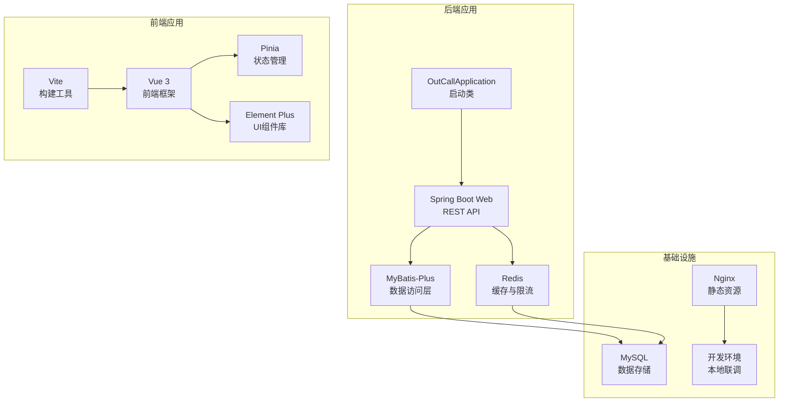
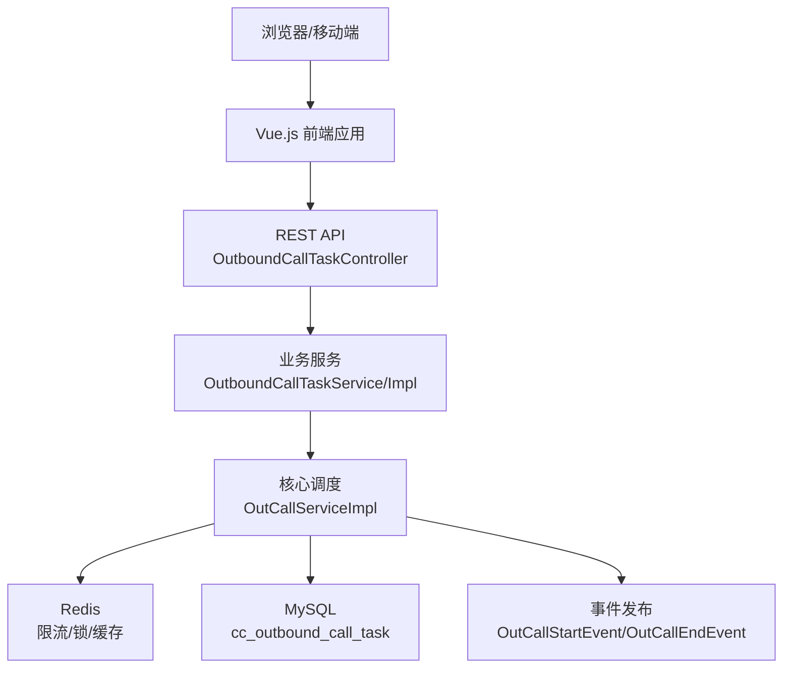
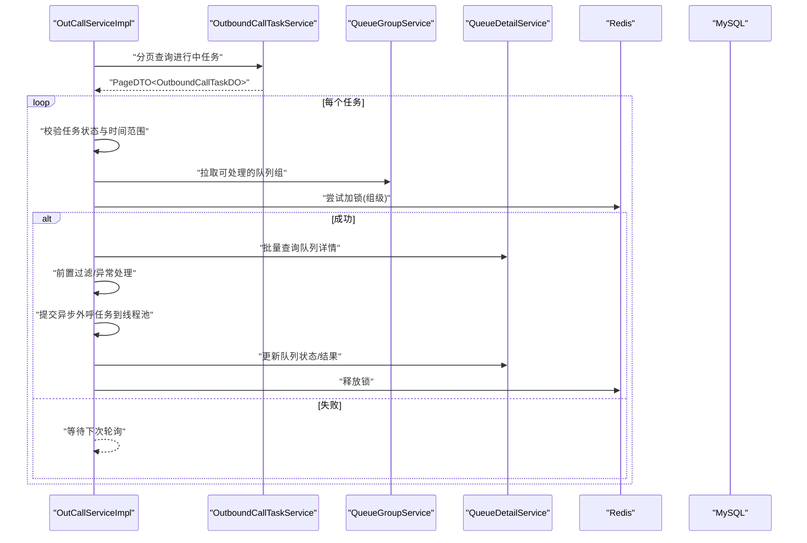
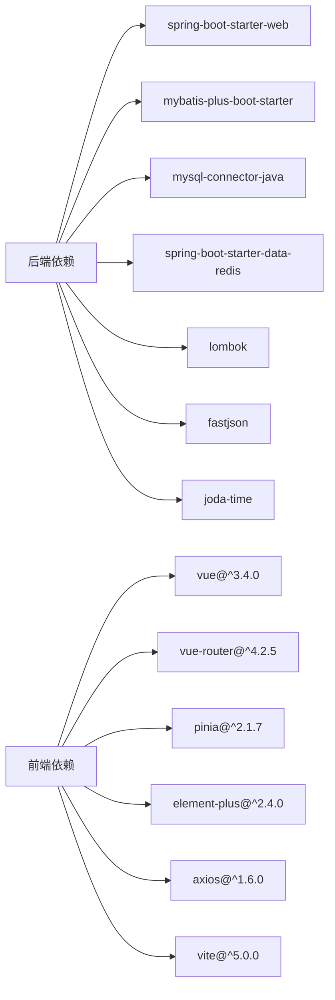

# 开发指南

<cite>
**本文引用的文件**
- [pom.xml](file://pom.xml)
- [application.properties](file://src/main/resources/application.properties)
- [OutCallApplication.java](file://src/main/java/org/qianye/OutCallApplication.java)
- [Result.java](file://src/main/java/org/qianye/common/Result.java)
- [MybatisPlusConfig.java](file://src/main/java/org/qianye/config/MybatisPlusConfig.java)
- [OutboundCallTaskService.java](file://src/main/java/org/qianye/service/OutboundCallTaskService.java)
- [OutboundCallTaskServiceImpl.java](file://src/main/java/org/qianye/service/impl/OutboundCallTaskServiceImpl.java)
- [OutboundCallTaskController.java](file://src/main/java/org/qianye/controller/OutboundCallTaskController.java)
- [OutboundCallTaskDO.java](file://src/main/java/org/qianye/entity/OutboundCallTaskDO.java)
- [OutCallService.java](file://src/main/java/org/qianye/OutCallService.java)
- [OutCallServiceImpl.java](file://src/main/java/org/qianye/OutCallServiceImpl.java)
- [CommonConstants.java](file://src/main/java/org/qianye/CommonConstants.java)
- [Constants.java](file://src/main/java/org/qianye/Constants.java)
- [TaskStatusEnum.java](file://src/main/java/org/qianye/TaskStatusEnum.java)
- [outcall.sql](file://src/main/resources/outcall.sql)
- [package.json](file://frontend/package.json)
- [vite.config.js](file://frontend/vite.config.js)
- [main.js](file://frontend/src/main.js)
- [App.vue](file://frontend/src/App.vue)
- [TaskManagement.vue](file://frontend/src/pages/TaskManagement.vue)
- [TaskFormDialog.vue](file://frontend/src/components/TaskFormDialog.vue)
- [UploadDialog.vue](file://frontend/src/components/UploadDialog.vue)
- [task.js](file://frontend/src/stores/task.js)
- [api.js](file://frontend/src/services/api.js)
- [global.scss](file://frontend/src/styles/global.scss)
- [index.html](file://frontend/index.html)
</cite>

## 更新摘要
**变更内容**
- 新增Vue.js前端开发指南章节
- 添加前端技术栈(Vue 3, Pinia, Element Plus, Vite)介绍
- 新增前端开发环境配置与构建流程说明
- 添加前端组件架构与状态管理说明
- 新增前后端联调与API对接指南

## 目录
1. [简介](#简介)
2. [项目结构](#项目结构)
3. [核心组件](#核心组件)
4. [架构总览](#架构总览)
5. [详细组件分析](#详细组件分析)
6. [前端开发指南](#前端开发指南)
7. [依赖分析](#依赖分析)
8. [性能考虑](#性能考虑)
9. [故障排查指南](#故障排查指南)
10. [结论](#结论)
11. [附录](#附录)

## 简介
本开发指南面向 Outcall 项目的新老开发者，目标是帮助你快速搭建开发环境、理解项目结构与模块职责、掌握编码与测试规范、熟悉调试与排障方法，并提供新增功能与扩展的实践建议。Outcall 是一个基于 Spring Boot 的智能外呼调度系统，围绕"外呼任务""队列组""限流与调度"等核心概念构建，采用 MyBatis-Plus 进行数据库访问，使用 Redis 与线程池实现并发与限流控制。项目现已提供完整的前后端开发指导，包括现代化的Vue.js前端界面与Spring Boot后端API。

## 项目结构
项目采用标准 Maven 结构，核心源码位于 src/main/java 下，按领域与层次组织：
- common：统一响应体封装
- config：MyBatis-Plus 插件与自动填充配置
- controller：REST 接口层
- entity：数据模型与映射
- mapper：MyBatis 映射接口
- service：业务服务接口与实现
- 工具与常量：日志、常量、枚举、通用工具类等
- resources：配置文件、SQL 初始化脚本
- frontend：Vue.js 前端应用，包含完整的用户界面



**图表来源**
- [OutCallApplication.java](file://src/main/java/org/qianye/OutCallApplication.java#L1-L13)
- [package.json](file://frontend/package.json#L1-L27)
- [vite.config.js](file://frontend/vite.config.js#L1-L17)

**章节来源**
- [pom.xml](file://pom.xml#L1-L91)
- [application.properties](file://src/main/resources/application.properties#L1-L17)
- [package.json](file://frontend/package.json#L1-L27)

## 核心组件
- 应用启动类：负责 Spring Boot 应用启动
- 统一响应体：Result<T> 提供 success/fail 统一返回格式
- 数据库配置：MyBatis-Plus 插件（乐观锁）与自动填充（创建/更新时间）
- 控制器：对外暴露外呼任务的增删改查、分页、状态更新等接口
- 服务层：任务查询、分页、状态更新；核心外呼调度逻辑
- 实体类：OutboundCallTaskDO 映射 cc_outbound_call_task 表，含乐观锁字段与自动填充字段
- 前端应用：Vue 3 + Vite + Pinia + Element Plus 的现代化用户界面

**章节来源**
- [OutCallApplication.java](file://src/main/java/org/qianye/OutCallApplication.java#L1-L13)
- [Result.java](file://src/main/java/org/qianye/common/Result.java#L1-L36)
- [MybatisPlusConfig.java](file://src/main/java/org/qianye/config/MybatisPlusConfig.java#L1-L49)
- [OutboundCallTaskController.java](file://src/main/java/org/qianye/controller/OutboundCallTaskController.java#L1-L72)
- [OutboundCallTaskServiceImpl.java](file://src/main/java/org/qianye/service/impl/OutboundCallTaskServiceImpl.java#L1-L66)
- [OutboundCallTaskDO.java](file://src/main/java/org/qianye/entity/OutboundCallTaskDO.java#L1-L96)
- [package.json](file://frontend/package.json#L1-L27)

## 架构总览
Outcall 采用经典的分层架构，现已实现前后端分离：
- 表现层：Spring MVC 控制器（后端API）
- 领域服务层：任务与外呼调度逻辑
- 数据访问层：MyBatis-Plus Mapper
- 基础设施：Redis 限流与分布式锁、线程池、日志与事件发布
- 前端层：Vue 3 + Vite + Pinia + Element Plus 用户界面
- API层：统一的RESTful接口，支持前后端联调



**图表来源**
- [OutboundCallTaskController.java](file://src/main/java/org/qianye/controller/OutboundCallTaskController.java#L1-L72)
- [OutboundCallTaskServiceImpl.java](file://src/main/java/org/qianye/service/impl/OutboundCallTaskServiceImpl.java#L1-L66)
- [OutCallServiceImpl.java](file://src/main/java/org/qianye/OutCallServiceImpl.java#L1-L800)
- [TaskManagement.vue](file://frontend/src/pages/TaskManagement.vue#L1-L427)

**章节来源**
- [application.properties](file://src/main/resources/application.properties#L1-L17)
- [api.js](file://frontend/src/services/api.js#L1-L74)

## 详细组件分析

### 统一响应体 Result
- 设计目的：统一接口返回结构，便于前端与调用方解析
- 关键点：success/fail 工厂方法，泛型承载业务数据

**章节来源**
- [Result.java](file://src/main/java/org/qianye/common/Result.java#L1-L36)

### MyBatis-Plus 配置
- 插件：乐观锁拦截器（用于版本控制），分页插件暂禁用以规避依赖冲突
- 自动填充：插入/更新时自动写入 gmtCreate/gmtModified

**章节来源**
- [MybatisPlusConfig.java](file://src/main/java/org/qianye/config/MybatisPlusConfig.java#L1-L49)

### 控制器 OutboundCallTaskController
- 路径：/api/v1/outbound-task
- 功能：创建、删除、更新、按 ID 获取、按实例+任务编码查询、分页查询、查询进行中任务、更新任务状态
- 返回：统一 Result 包裹

**章节来源**
- [OutboundCallTaskController.java](file://src/main/java/org/qianye/controller/OutboundCallTaskController.java#L1-L72)

### 服务接口与实现 OutboundCallTaskService/Impl
- 接口能力：按实例+任务编码查询、分页查询、查询进行中任务、更新任务状态
- 实现要点：基于 MyBatis-Plus 条件构造器与分页对象；PageDTO 转换

**章节来源**
- [OutboundCallTaskService.java](file://src/main/java/org/qianye/service/OutboundCallTaskService.java#L1-L40)
- [OutboundCallTaskServiceImpl.java](file://src/main/java/org/qianye/service/impl/OutboundCallTaskServiceImpl.java#L1-L66)

### 实体类 OutboundCallTaskDO
- 表映射：cc_outbound_call_task
- 字段：主键、创建/修改时间、任务编码/名称、实例ID、任务规则、任务类型、转移对象、任务状态、主叫、转接类型、环境标志、扩展信息、收单状态、版本号（乐观锁）

**章节来源**
- [OutboundCallTaskDO.java](file://src/main/java/org/qianye/entity/OutboundCallTaskDO.java#L1-L96)

### 核心调度 OutCallServiceImpl
- 职责：扫描"进行中"的外呼任务，按组并发外呼，结合 Redis 限流/锁、线程池、事件发布与异常重排
- 关键流程：
  - 分页拉取进行中的任务
  - 并发执行每个任务的组处理
  - 限流等待与超时控制
  - 队列组状态流转（WAITING/PROCESSING/STOP）
  - 异常场景重排与解锁



**图表来源**
- [OutCallServiceImpl.java](file://src/main/java/org/qianye/OutCallServiceImpl.java#L1-L800)
- [OutboundCallTaskServiceImpl.java](file://src/main/java/org/qianye/service/impl/OutboundCallTaskServiceImpl.java#L1-L66)

**章节来源**
- [OutCallServiceImpl.java](file://src/main/java/org/qianye/OutCallServiceImpl.java#L1-L800)

### 任务状态与常量
- TaskStatusEnum：RUNNING/STOP，提供 allowCallUpgrade 判定
- 常量类：CommonConstants、Constants 中的关键标识（如批量处理开关、外呼任务编码等）

**章节来源**
- [TaskStatusEnum.java](file://src/main/java/org/qianye/TaskStatusEnum.java#L1-L21)
- [CommonConstants.java](file://src/main/java/org/qianye/CommonConstants.java#L1-L17)
- [Constants.java](file://src/main/java/org/qianye/Constants.java#L1-L13)

## 前端开发指南

### 技术栈概览
Outcall 前端采用现代化技术栈，提供优秀的开发体验和用户体验：
- **Vue 3**：最新版本的渐进式JavaScript框架，支持Composition API
- **Vite**：极速的构建工具，提供热更新和快速开发体验
- **Pinia**：Vue官方推荐的状态管理库，替代Vuex
- **Element Plus**：基于Vue 3的桌面端组件库，提供丰富的UI组件
- **Axios**：HTTP客户端，用于API请求
- **SCSS**：CSS预处理器，支持变量和嵌套语法

### 开发环境配置
- **Node.js**：版本要求 >= 16.x
- **包管理器**：npm 或 yarn
- **IDE**：推荐VS Code，支持Vue 3和TypeScript
- **开发工具**：Vue DevTools浏览器扩展

### 项目结构
前端项目采用标准的Vue 3项目结构：
```
frontend/
├── src/
│   ├── components/     # 可复用组件
│   ├── pages/         # 页面组件
│   ├── router/        # 路由配置
│   ├── services/      # API服务层
│   ├── stores/        # Pinia状态管理
│   ├── styles/        # 全局样式
│   ├── App.vue        # 根组件
│   └── main.js        # 应用入口
├── public/           # 静态资源
├── package.json      # 依赖配置
├── vite.config.js    # Vite构建配置
└── index.html        # HTML模板
```

### Vite 构建配置
Vite提供了开箱即用的配置，支持以下特性：
- **开发服务器**：端口3000，默认关闭代理，前端直接请求后端
- **路径别名**：@ 指向 src 目录
- **Vue插件**：内置Vue 3支持
- **热更新**：快速的开发体验

### 状态管理 (Pinia)
项目使用Pinia作为状态管理方案：
- **store设计**：每个功能模块对应一个store
- **actions**：异步操作和业务逻辑
- **getters**：计算属性和派生状态
- **持久化**：支持localStorage或sessionStorage

### 组件架构
前端采用组件化的开发模式：
- **页面组件**：TaskManagement.vue 等主要页面
- **对话框组件**：TaskFormDialog.vue、UploadDialog.vue
- **基础组件**：可复用的UI组件
- **布局组件**：App.vue 提供全局布局

### API 服务层
统一的API服务层封装：
- **axios配置**：baseURL指向后端API地址
- **拦截器**：请求和响应拦截
- **错误处理**：统一的错误处理机制
- **接口定义**：清晰的API调用方法

### 开发工作流
1. **启动开发服务器**：`npm run dev`
2. **访问应用**：http://localhost:3000
3. **开发调试**：支持热更新和Vue DevTools
4. **构建生产包**：`npm run build`
5. **预览生产包**：`npm run preview`

### 前后端联调
- **API地址**：默认 http://localhost:8080/api
- **跨域处理**：开发环境下前端直接请求后端
- **数据格式**：统一使用JSON格式
- **错误处理**：前端统一处理API错误

**章节来源**
- [package.json](file://frontend/package.json#L1-L27)
- [vite.config.js](file://frontend/vite.config.js#L1-L17)
- [main.js](file://frontend/src/main.js#L1-L22)
- [App.vue](file://frontend/src/App.vue#L1-L88)
- [TaskManagement.vue](file://frontend/src/pages/TaskManagement.vue#L1-L427)
- [TaskFormDialog.vue](file://frontend/src/components/TaskFormDialog.vue#L1-L266)
- [UploadDialog.vue](file://frontend/src/components/UploadDialog.vue#L1-L363)
- [task.js](file://frontend/src/stores/task.js#L1-L147)
- [api.js](file://frontend/src/services/api.js#L1-L74)
- [global.scss](file://frontend/src/styles/global.scss#L1-L58)
- [index.html](file://frontend/index.html#L1-L14)

## 依赖分析
- Spring Boot Web：提供 Web 容器与 MVC
- MyBatis-Plus：ORM 与分页、乐观锁支持
- MySQL 驱动：JDBC 访问
- Redis Starter：缓存与分布式锁
- Lombok：简化实体与日志
- Fastjson：序列化
- Joda-Time：时间范围计算
- Vue 3：前端框架
- Vite：构建工具
- Element Plus：UI组件库
- Pinia：状态管理
- Axios：HTTP客户端



**图表来源**
- [pom.xml](file://pom.xml#L24-L81)
- [package.json](file://frontend/package.json#L11-L25)

**章节来源**
- [pom.xml](file://pom.xml#L1-L91)
- [package.json](file://frontend/package.json#L1-L27)

## 性能考虑
- 线程池与并发
  - 多级线程池：针对不同租户与场景设置专用线程池，避免相互影响
  - 任务分页批处理：外呼扫描采用分页，避免一次性加载过多任务
- 限流与锁
  - 组级 Redis 锁：保证同一组并发安全
  - 限流等待与超时：带超时的限流等待，防止长时间阻塞
- 数据库与缓存
  - 乐观锁：版本号控制并发更新
  - 缓存命中：队列组与任务计划通过缓存降低 DB 压力
- 前端性能优化
  - 组件懒加载：减少初始包体积
  - 图片优化：使用现代格式和适当的尺寸
  - 状态管理：合理使用Pinia，避免不必要的响应式更新
  - API缓存：前端对常用数据进行缓存
- 日志与可观测性
  - 统一日志工具：记录关键路径耗时与状态变化，便于定位瓶颈

**章节来源**
- [OutCallServiceImpl.java](file://src/main/java/org/qianye/OutCallServiceImpl.java#L1-L800)
- [MybatisPlusConfig.java](file://src/main/java/org/qianye/config/MybatisPlusConfig.java#L1-L49)
- [task.js](file://frontend/src/stores/task.js#L1-L147)

## 故障排查指南
- 启动与连接
  - 确认 application.properties 中数据库 URL/账号密码正确
  - 如需启用分页插件，请确保 jsqlparser 版本兼容
  - 前端开发服务器端口冲突：修改vite.config.js中的port配置
- 外呼无数据
  - 检查任务状态是否为 RUNNING，且当前时间处于允许外呼时段
  - 查看队列组状态是否为 PLANNING
  - 前端API请求失败：检查后端服务是否启动，确认baseURL配置
- 并发与限流
  - 观察线程池队列长度与拒绝情况，必要时调整最大线程数或队列阈值
  - 检查 Redis 锁是否及时释放，避免死锁
  - 前端状态管理异常：检查Pinia store的action是否正确处理异步操作
- 数据一致性
  - 出现并发更新冲突时，确认乐观锁版本号是否正确更新
- 接口返回
  - 统一使用 Result 包裹，若返回失败，检查 code/message 字段定位问题
  - 前端API错误：查看浏览器控制台和网络面板，检查错误响应

**章节来源**
- [application.properties](file://src/main/resources/application.properties#L1-L17)
- [OutboundCallTaskController.java](file://src/main/java/org/qianye/controller/OutboundCallTaskController.java#L1-L72)
- [OutCallServiceImpl.java](file://src/main/java/org/qianye/OutCallServiceImpl.java#L1-L800)
- [api.js](file://frontend/src/services/api.js#L1-L74)

## 结论
本指南从环境搭建、结构理解、核心组件、前端开发、依赖关系、性能与排障等方面对 Outcall 项目进行了系统梳理。项目现已提供完整的前后端开发指导，建议在新增功能时遵循现有分层与命名约定，优先复用统一响应体与配置，确保并发安全与可观测性。前端采用现代化技术栈，提供良好的开发体验和用户体验。

## 附录

### 开发环境搭建步骤
- 环境要求
  - JDK 8
  - Maven
  - MySQL 与 Redis（按 application.properties 配置）
  - Node.js >= 16.x（前端开发）
- 导入项目
  - 使用 IDE 导入 Maven 项目
  - 确认后端依赖下载完成
  - 在frontend目录下执行 `npm install` 安装前端依赖
- 初始化数据库
  - 使用 resources 下的 SQL 脚本初始化表结构
- 启动应用
  - 后端：运行 OutCallApplication 启动类
  - 前端：在frontend目录下执行 `npm run dev`
  - 访问 http://localhost:3000 进行前端验证
  - 访问 /api/v1/outbound-task 下的接口进行后端验证

**章节来源**
- [application.properties](file://src/main/resources/application.properties#L1-L17)
- [outcall.sql](file://src/main/resources/outcall.sql)
- [package.json](file://frontend/package.json#L1-L27)

### 代码规范与最佳实践
- 命名规范
  - 类名使用 PascalCase；包名为反向域名
  - 接口与实现分离，服务接口以 I 前缀或以 Service 结尾
  - Vue组件使用PascalCase命名，文件使用kebab-case命名
- 注释规范
  - 类与公共方法应提供中文注释，说明用途与关键参数
  - Vue组件提供props和emits的详细注释
- 测试规范
  - 单元测试覆盖核心业务分支与边界条件
  - 集成测试覆盖数据库与外部依赖（Redis/MySQL）
  - 前端组件测试：使用Vue Test Utils进行单元测试
- 日志规范
  - 使用统一日志工具记录关键路径与异常堆栈
  - 前端错误日志：使用console.error记录错误信息

### 新功能模块与扩展指南
- 新增实体与 Mapper
  - 在 entity 与 mapper 包下新增对应类，配置 XML 映射
- 新增服务
  - 在 service 下新增接口与实现，遵循分页与条件查询约定
- 新增控制器
  - 在 controller 下新增 REST 接口，返回统一 Result
- 前端新页面
  - 在 src/pages 下新增Vue组件
  - 在 src/router/index.js 中注册路由
  - 在 src/stores 下新增Pinia store
- 配置与常量
  - 在 Constants 或枚举中新增常量与状态码
- 并发与限流
  - 按需引入 Redis 锁与线程池，确保幂等与超时控制

### 单元测试与集成测试编写指南
- 单元测试
  - 使用 Spring Boot Test 与 Mockito 模拟依赖
  - 覆盖正常路径、异常路径与边界条件
  - 前端使用Vue Test Utils进行组件测试
- 集成测试
  - 使用 Testcontainers 或本地容器启动 MySQL/Redis
  - 调用控制器或服务方法，断言数据库状态与返回值
  - 前端使用Cypress或Playwright进行端到端测试

### 代码审查标准与流程
- 代码审查清单
  - 是否遵循分层与命名规范
  - 是否存在冗余或重复逻辑
  - 是否充分考虑并发与异常场景
  - 是否补充必要的注释与测试
  - 前端代码是否符合ESLint规范
  - Vue组件是否正确使用Composition API
- 审查流程
  - 提交 PR 前自检并通过本地测试
  - 指定至少一名 reviewer，关注关键路径与风险点
  - 修复 review 意见后再次审查

### 调试技巧
- 关键断点
  - 控制器入口、服务层关键方法、线程池提交处、Redis 加锁/解锁
  - Vue组件生命周期钩子、Pinia actions、API请求拦截器
- 观察指标
  - 线程池队列长度、任务耗时、限流等待次数、异常重排次数
  - 前端组件渲染性能、API响应时间、内存使用情况
- 日志定位
  - 使用统一日志工具输出上下文信息，便于回溯
  - 前端使用Vue DevTools检查组件状态和事件

### 版本控制与分支管理最佳实践
- 分支策略
  - develop：日常开发
  - feature/*：功能开发
  - release/*：预发布与回归
  - hotfix/*：紧急修复
- 提交规范
  - 语义化提交信息，简述变更与关联 Issue
  - 前端提交信息前缀：feat(frontend):、fix(frontend):、chore(frontend):
- 合并与审查
  - 合并前确保通过 CI 与测试，Review 通过后方可合并
  - 前端代码审查重点关注组件设计和状态管理

### 前端开发最佳实践
- 组件设计
  - 单一职责原则：每个组件专注于单一功能
  - Props验证：为所有props提供类型定义和默认值
  - 事件命名：使用camelCase命名事件
- 状态管理
  - Pinia store按功能模块组织
  - 避免在store中直接操作DOM
  - 使用computed进行派生状态
- 性能优化
  - 使用keep-alive缓存页面组件
  - 懒加载路由组件
  - 合理使用v-show和v-if
- 开发工具
  - 使用Vue DevTools进行调试
  - ESLint和Prettier保持代码风格一致
  - 使用TypeScript增强类型安全

**章节来源**
- [main.js](file://frontend/src/main.js#L1-L22)
- [task.js](file://frontend/src/stores/task.js#L1-L147)
- [api.js](file://frontend/src/services/api.js#L1-L74)
- [TaskManagement.vue](file://frontend/src/pages/TaskManagement.vue#L1-L427)