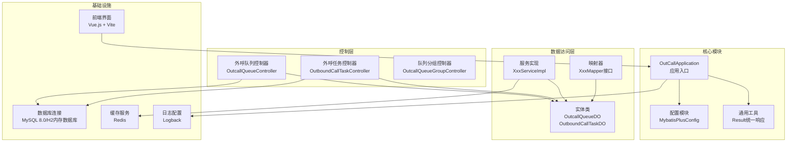
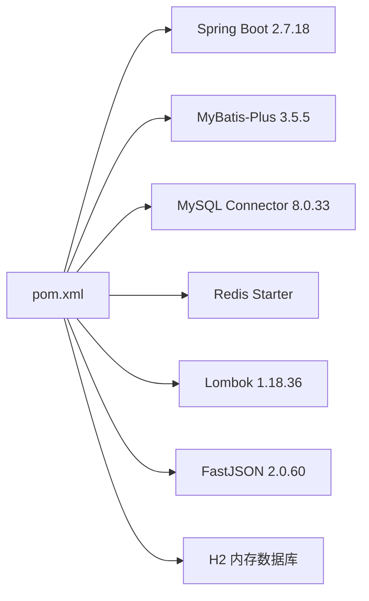
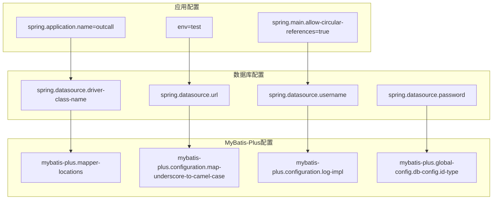
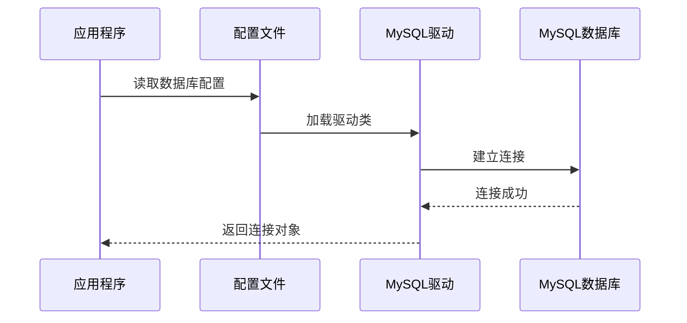
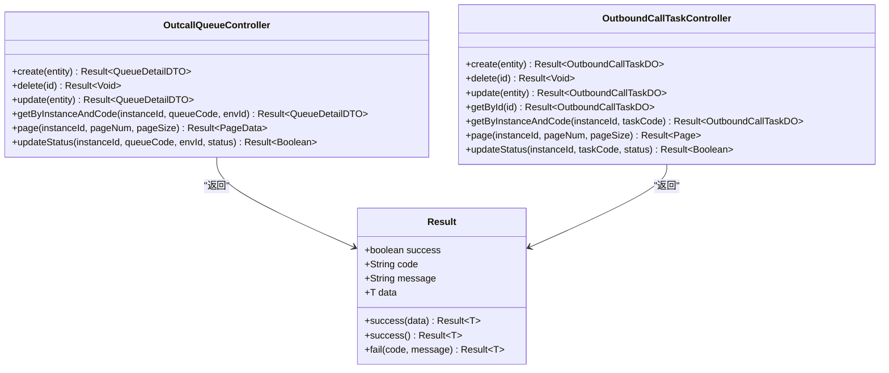

# 快速开始

<cite>
**本文档引用的文件**
- [pom.xml](file://pom.xml)
- [application.properties](file://src/main/resources/application.properties)
- [outcall.sql](file://src/main/resources/outcall.sql)
- [OutCallApplication.java](file://src/main/java/org/qianye/OutCallApplication.java)
- [MybatisPlusConfig.java](file://src/main/java/org/qianye/config/MybatisPlusConfig.java)
- [OutcallQueueController.java](file://src/main/java/org/qianye/controller/OutcallQueueController.java)
- [OutboundCallTaskController.java](file://src/main/java/org/qianye/controller/OutboundCallTaskController.java)
- [Result.java](file://src/main/java/org/qianye/common/Result.java)
- [OutcallQueueDO.java](file://src/main/java/org/qianye/entity/OutcallQueueDO.java)
- [OutboundCallTaskDO.java](file://src/main/java/org/qianye/entity/OutboundCallTaskDO.java)
- [logback-spring.xml](file://src/main/resources/logback-spring.xml)
- [QUICK_START.md](file://QUICK_START.md)
- [frontend/DEPLOYMENT.md](file://frontend/DEPLOYMENT.md)
- [frontend/package.json](file://frontend/package.json)
- [frontend/vite.config.js](file://frontend/vite.config.js)
</cite>

## 目录
1. [简介](#简介)
2. [项目结构](#项目结构)
3. [环境准备](#环境准备)
4. [项目克隆与构建](#项目克隆与构建)
5. [数据库初始化](#数据库初始化)
6. [应用配置详解](#应用配置详解)
7. [本地运行步骤](#本地运行步骤)
8. [核心API使用指南](#核心api使用指南)
9. [性能考虑](#性能考虑)
10. [故障排除指南](#故障排除指南)
11. [部署选项总览](#部署选项总览)
12. [总结](#总结)

## 简介

Outcall 是一个基于 Spring Boot 开发的智能外呼调度系统，支持预测外呼、预览外呼和 IVR 外呼等多种外呼模式。该系统提供了完整的外呼任务管理、队列管理和实时监控功能，适用于企业级外呼场景。

## 项目结构

Outcall 采用标准的 Spring Boot 项目结构，主要包含以下模块：



**图表来源**
- [OutCallApplication.java](file://src/main/java/org/qianye/OutCallApplication.java#L1-L13)
- [MybatisPlusConfig.java](file://src/main/java/org/qianye/config/MybatisPlusConfig.java#L1-L49)
- [OutcallQueueController.java](file://src/main/java/org/qianye/controller/OutcallQueueController.java#L1-L71)
- [OutboundCallTaskController.java](file://src/main/java/org/qianye/controller/OutboundCallTaskController.java#L1-L72)

**章节来源**
- [pom.xml](file://pom.xml#L1-L97)
- [OutCallApplication.java](file://src/main/java/org/qianye/OutCallApplication.java#L1-L13)

## 环境准备

### JDK 8+ 安装与配置

Outcall 项目要求使用 JDK 8 或更高版本：

1. **检查 JDK 版本**
   ```bash
   java -version
   javac -version
   ```

2. **下载安装 JDK**
   - 访问 Oracle JDK 官网或 OpenJDK 官网
   - 下载对应操作系统的 JDK 包
   - 按照官方安装指南进行安装

3. **配置环境变量**
   ```bash
   # Linux/Mac
   export JAVA_HOME=/usr/lib/jvm/java-8-openjdk
   export PATH=$PATH:$JAVA_HOME/bin
   
   # Windows
   set JAVA_HOME=C:\Program Files\Java\jdk-8
   set PATH=%PATH%;%JAVA_HOME%\bin
   ```

### MySQL 8.0 安装与配置

1. **安装 MySQL 8.0**
   ```bash
   # Ubuntu/Debian
   sudo apt update
   sudo apt install mysql-server
   
   # CentOS/RHEL/Fedora
   sudo yum install mysql-server
   
   # macOS
   brew install mysql
   ```

2. **启动 MySQL 服务**
   ```bash
   sudo systemctl start mysql
   sudo systemctl enable mysql
   ```

3. **安全配置**
   ```sql
   -- 运行安全配置向导
   mysql_secure_installation
   
   -- 创建数据库和用户
   CREATE DATABASE outcall CHARACTER SET utf8mb4 COLLATE utf8mb4_unicode_ci;
   CREATE USER 'outcall_user'@'localhost' IDENTIFIED BY 'your_password';
   GRANT ALL PRIVILEGES ON outcall.* TO 'outcall_user'@'localhost';
   FLUSH PRIVILEGES;
   ```

### Redis 服务器安装与配置

1. **安装 Redis**
   ```bash
   # Ubuntu/Debian
   sudo apt install redis-server
   
   # CentOS/RHEL/Fedora
   sudo yum install redis
   
   # macOS
   brew install redis
   ```

2. **启动 Redis 服务**
   ```bash
   sudo systemctl start redis
   sudo systemctl enable redis
   ```

3. **验证 Redis 连接**
   ```bash
   redis-cli ping
   # 应该返回 PONG
   ```

### 前端开发环境

项目前端使用 Vue.js + Vite 构建：

1. **Node.js 环境**
   - 安装 Node.js 16+
   - 验证安装：`node -v`

2. **前端依赖**
   - Vue 3.x
   - Element Plus UI 框架
   - Axios HTTP 客户端
   - Pinia 状态管理

**章节来源**
- [frontend/package.json](file://frontend/package.json#L1-L27)
- [frontend/vite.config.js](file://frontend/vite.config.js#L1-L17)

## 项目克隆与构建

### 克隆项目

```bash
git clone https://github.com/your-repo/outcall.git
cd outcall
```

### 依赖安装

项目使用 Maven 作为构建工具，依赖管理在 `pom.xml` 中定义：



**图表来源**
- [pom.xml](file://pom.xml#L24-L87)

### 构建项目

```bash
# 清理并编译
mvn clean compile

# 打包为可执行 JAR
mvn clean package

# 或直接打包
mvn package -DskipTests
```

构建完成后，可在 `target` 目录找到 `outcall-1.0-SNAPSHOT.jar` 文件。

**章节来源**
- [pom.xml](file://pom.xml#L1-L97)

## 数据库初始化

### 数据库表结构

项目提供了完整的数据库初始化脚本，包含以下核心表：

1. **外呼队列表 (cc_outcall_queue)**
   - 存储待呼叫的电话号码和呼叫状态
   - 支持实例隔离和环境标识
   - 包含主叫、被叫、队列状态等字段

2. **队列分组表 (cc_outcall_queue_group)**
   - 管理外呼队列的分组和优先级
   - 支持批量队列管理和状态跟踪

3. **外呼任务规则表 (cc_outbound_call_task_rules)**
   - 定义外呼任务的执行规则和时间窗口
   - 支持多环境配置和生效时间管理

4. **外呼任务表 (cc_outbound_call_task)**
   - 核心的外呼任务管理表
   - 支持多种外呼模式和状态管理

### 初始化步骤

1. **创建数据库**
   ```sql
   CREATE DATABASE IF NOT EXISTS outcall CHARACTER SET utf8mb4 COLLATE utf8mb4_unicode_ci;
   ```

2. **执行初始化脚本**
   ```sql
   -- 连接到数据库
   mysql -u username -p outcall
   
   -- 执行 SQL 脚本
   source src/main/resources/outcall.sql
   ```

3. **验证表结构**
   ```sql
   -- 查看所有表
   SHOW TABLES;
   
   -- 查看表结构
   DESCRIBE cc_outcall_queue;
   DESCRIBE cc_outcall_queue_group;
   ```

**章节来源**
- [outcall.sql](file://src/main/resources/outcall.sql#L1-L218)

## 应用配置详解

### 核心配置文件

应用配置位于 `src/main/resources/application.properties`，包含以下关键配置项：



**图表来源**
- [application.properties](file://src/main/resources/application.properties#L1-L17)

### 配置参数说明

| 配置项 | 默认值 | 说明 | 示例 |
|--------|--------|------|------|
| spring.application.name | outcall | 应用名称 | outcall |
| env | test | 环境标识 | dev/test/prod |
| spring.datasource.driver-class-name | com.mysql.cj.jdbc.Driver | MySQL 驱动类 | com.mysql.cj.jdbc.Driver |
| spring.datasource.url | jdbc:mysql://localhost:3306/outcall | 数据库连接 URL | jdbc:mysql://localhost:3306/outcall |
| spring.datasource.username | root | 数据库用户名 | outcall_user |
| spring.datasource.password | root | 数据库密码 | your_password |
| mybatis-plus.mapper-locations | classpath*:/mapper/**/*.xml | Mapper XML 文件位置 | classpath*:/mapper/**/*.xml |
| mybatis-plus.configuration.map-underscore-to-camel-case | true | 下划线转驼峰 | true |
| mybatis-plus.configuration.log-impl | StdOutImpl | 日志实现类 | org.apache.ibatis.logging.stdout.StdOutImpl |
| mybatis-plus.global-config.db-config.id-type | auto | ID 生成策略 | auto |

### 数据库连接配置



**图表来源**
- [application.properties](file://src/main/resources/application.properties#L6-L16)

**章节来源**
- [application.properties](file://src/main/resources/application.properties#L1-L17)
- [MybatisPlusConfig.java](file://src/main/java/org/qianye/config/MybatisPlusConfig.java#L1-L49)

## 本地运行步骤

### 启动前准备

1. **确保服务已启动**
   - MySQL 8.0 已启动并可连接
   - Redis 服务器已启动并可连接

2. **验证数据库连接**
   ```bash
   # 测试 MySQL 连接
   mysql -h localhost -u root -p
   
   # 测试 Redis 连接
   redis-cli ping
   ```

### 启动应用程序

有多种方式启动 Outcall 应用：

1. **使用 Maven 插件启动**
   ```bash
   mvn spring-boot:run
   ```

2. **使用 Java 命令启动**
   ```bash
   java -jar target/outcall-1.0-SNAPSHOT.jar
   ```

3. **IDE 启动**
   - 在 IDE 中运行 `OutCallApplication.main()` 方法
   - 或右键点击项目选择 "Run As" -> "Spring Boot App"

### 验证启动结果

应用程序启动后，可以通过以下方式验证：

1. **查看启动日志**
   - 确认应用成功启动
   - 检查数据库连接是否正常
   - 查看 Redis 连接状态

2. **访问健康检查端点**
   ```bash
   curl http://localhost:8080/actuator/health
   ```

3. **查看应用信息**
   ```bash
   curl http://localhost:8080/actuator/info
   ```

**章节来源**
- [OutCallApplication.java](file://src/main/java/org/qianye/OutCallApplication.java#L1-L13)
- [logback-spring.xml](file://src/main/resources/logback-spring.xml#L1-L32)

## 核心API使用指南

### 统一响应格式

所有 API 响应都遵循统一的格式：



**图表来源**
- [Result.java](file://src/main/java/org/qianye/common/Result.java#L1-L36)
- [OutcallQueueController.java](file://src/main/java/org/qianye/controller/OutcallQueueController.java#L1-L71)
- [OutboundCallTaskController.java](file://src/main/java/org/qianye/controller/OutboundCallTaskController.java#L1-L72)

### 外呼队列管理API

#### 创建外呼队列
```bash
POST /api/v1/outcall-queue
Content-Type: application/json

{
    "instanceId": "your_instance_id",
    "envId": "test",
    "queueCode": "queue_001",
    "caller": "4008008000",
    "callee": "13800000000",
    "taskCode": "task_001",
    "extInfo": "{}"
}
```

#### 查询外呼队列
```bash
GET /api/v1/outcall-queue/query?instanceId=your_instance_id&queueCode=queue_001&envId=test
```

#### 更新队列状态
```bash
PUT /api/v1/outcall-queue/status?instanceId=your_instance_id&queueCode=queue_001&envId=test&status=running
```

#### 分页查询
```bash
GET /api/v1/outcall-queue/page?instanceId=your_instance_id&pageNum=1&pageSize=20
```

### 外呼任务管理API

#### 创建外呼任务
```bash
POST /api/v1/outbound-task
Content-Type: application/json

{
    "taskCode": "task_001",
    "taskName": "测试外呼任务",
    "instanceId": "your_instance_id",
    "taskRulesCode": "rules_001",
    "taskType": "AUTO_CALL",
    "transferCode": "agent_group_001",
    "outboundCaller": "4008008000",
    "taskStatus": 0,
    "envFlag": "test"
}
```

#### 查询任务详情
```bash
GET /api/v1/outbound-task/{id}
```

#### 更新任务状态
```bash
PUT /api/v1/outbound-task/status?instanceId=your_instance_id&taskCode=task_001&status=1
```

#### 分页查询任务
```bash
GET /api/v1/outbound-task/page?instanceId=your_instance_id&pageNum=1&pageSize=20
```

### API 响应示例

成功的响应格式：
```json
{
    "success": true,
    "code": "200",
    "message": "操作成功",
    "data": {}
}
```

失败的响应格式：
```json
{
    "success": false,
    "code": "500",
    "message": "操作失败",
    "data": null
}
```

**章节来源**
- [OutcallQueueController.java](file://src/main/java/org/qianye/controller/OutcallQueueController.java#L1-L71)
- [OutboundCallTaskController.java](file://src/main/java/org/qianye/controller/OutboundCallTaskController.java#L1-L72)
- [Result.java](file://src/main/java/org/qianye/common/Result.java#L1-L36)

## 性能考虑

### 数据库优化

1. **索引设计**
   - 队列表包含多个复合索引，支持高效的查询
   - 建议根据实际查询模式调整索引策略

2. **连接池配置**
   - 使用 HikariCP 作为默认连接池
   - 可根据并发需求调整连接数

3. **查询优化**
   - 合理使用分页查询
   - 避免 N+1 查询问题

### 缓存策略

1. **Redis 缓存**
   - 使用 Redis 缓存热点数据
   - 设置合理的过期时间

2. **二级缓存**
   - MyBatis Plus 提供一级缓存
   - 可配置二级缓存提升查询性能

### 并发处理

1. **乐观锁机制**
   - 使用版本号实现乐观锁
   - 减少并发冲突

2. **异步处理**
   - 对耗时操作使用异步处理
   - 提升系统响应速度

## 故障排除指南

### 常见启动问题

#### 数据库连接失败
**问题症状**：
- 应用启动时报数据库连接错误
- 控制台出现连接超时提示

**解决方案**：
1. 检查数据库服务状态
   ```bash
   sudo systemctl status mysql
   ```

2. 验证数据库连接配置
   ```properties
   spring.datasource.url=jdbc:mysql://localhost:3306/outcall?useUnicode=true&characterEncoding=utf-8&useSSL=false&serverTimezone=Asia/Shanghai
   spring.datasource.username=root
   spring.datasource.password=root
   ```

3. 测试数据库连接
   ```bash
   mysql -h localhost -u root -p outcall
   ```

#### Redis 连接失败
**问题症状**：
- 应用启动时报 Redis 连接错误
- 缓存相关功能异常

**解决方案**：
1. 检查 Redis 服务状态
   ```bash
   sudo systemctl status redis
   ```

2. 验证 Redis 连接配置
   ```properties
   spring.redis.host=localhost
   spring.redis.port=6379
   spring.redis.database=0
   ```

3. 测试 Redis 连接
   ```bash
   redis-cli ping
   ```

### API 调用问题

#### JSON 解析错误
**问题症状**：
- API 调用返回 400 错误
- 控制台出现 JSON 解析异常

**解决方案**：
1. 检查请求体格式
2. 确保 Content-Type 设置正确
3. 验证 JSON 结构合法性

#### 权限认证问题
**问题症状**：
- API 调用返回 401 或 403 错误
- 认证相关功能异常

**解决方案**：
1. 检查认证配置
2. 验证用户权限
3. 重新登录获取有效 Token

### 性能问题

#### 响应缓慢
**问题症状**：
- API 响应时间过长
- 数据库查询超时

**解决方案**：
1. 分析慢查询日志
2. 优化数据库索引
3. 调整缓存策略
4. 检查网络延迟

#### 内存溢出
**问题症状**：
- 应用进程频繁重启
- OOM 异常

**解决方案**：
1. 调整 JVM 参数
2. 优化大对象处理
3. 检查内存泄漏
4. 实施分页查询

### 日志分析

#### 查看应用日志
```bash
# 查看控制台日志
tail -f ./log/application.log

# 查看 Spring Boot 日志
tail -f ./log/spring.log
```

#### 调试模式
```bash
# 启用调试日志
-Dlogging.level.root=DEBUG

# 启用 SQL 日志
-Dlogging.level.org.qianye.mapper=DEBUG
```

**章节来源**
- [logback-spring.xml](file://src/main/resources/logback-spring.xml#L1-L32)

## 部署选项总览

### 快速部署指南

项目提供了多种部署选项，满足不同场景的需求：

#### 一分钟快速部署（开发环境）

使用 H2 内存数据库，无需额外配置即可快速启动：

```bash
# 1. 启动后端（使用H2内存数据库）
mvn spring-boot:run

# 2. 启动前端（新终端窗口）
cd frontend
npm install
npm run dev
```

**访问地址**：
- 后端API: http://localhost:8080
- 前端界面: http://localhost:5173
- 数据库控制台: http://localhost:8080/h2-console

#### 生产环境部署（Docker）

使用 Docker 进行容器化部署：

```bash
# 1. 构建后端
mvn clean package

# 2. 构建前端Docker镜像
cd frontend
docker build -t outcall-frontend .

# 3. 运行（使用docker-compose）
docker-compose up -d
```

#### 配置文件模板

**后端生产配置 (application-prod.properties)**
```properties
# 数据库配置
app.database.type=mysql
spring.datasource.mysql.url=jdbc:mysql://localhost:3306/outcall_prod
spring.datasource.mysql.username=${DB_USER}
spring.datasource.mysql.password=${DB_PASS}

# 缓存配置
app.cache.type=redis
app.lock.type=redis
spring.redis.host=localhost
spring.redis.port=6379

# 服务器配置
server.port=8080
```

**前端生产配置 (.env.production)**
```bash
VITE_API_BASE_URL=https://your-domain.com/api
VITE_APP_TITLE=外呼任务管理系统
```

#### 默认端口汇总

| 服务 | 开发端口 | 生产端口 |
|------|----------|----------|
| 后端API | 8080 | 8080 |
| 前端开发 | 5173 | 80 |
| 数据库 | 内置H2 | 3306 |
| Redis | 无 | 6379 |

#### 环境变量清单

```bash
# 必需变量
DB_USER=数据库用户名
DB_PASS=数据库密码
REDIS_HOST=Redis主机地址

# 可选变量
APP_SECRET=应用密钥
LOG_LEVEL=日志级别
```

#### 部署检查清单

- [ ] JDK 8+ 已安装
- [ ] Maven 3.6+ 已安装  
- [ ] Node.js 16+ 已安装
- [ ] 数据库已创建（非H2模式）
- [ ] Redis已安装（可选）
- [ ] 端口未被占用
- [ ] 防火墙已配置

#### 常见问题快速解决

**后端启动失败**：
```bash
# 检查端口占用
lsof -i :8080

# 清理并重新构建
mvn clean compile
```

**前端白屏**：
```bash
# 清理node_modules
rm -rf node_modules package-lock.json
npm install
```

**数据库连接失败**：
```bash
# 测试数据库连接
telnet localhost 3306
```

**章节来源**
- [QUICK_START.md](file://QUICK_START.md#L1-L119)
- [frontend/DEPLOYMENT.md](file://frontend/DEPLOYMENT.md#L1-L489)

## 总结

Outcall 项目提供了完整的智能外呼解决方案，具有以下特点：

1. **完整的功能模块**：支持多种外呼模式和任务管理
2. **良好的架构设计**：基于 Spring Boot 和 MyBatis Plus
3. **完善的配置管理**：灵活的环境配置和数据库连接
4. **丰富的 API 接口**：标准化的 RESTful API 设计
5. **完善的错误处理**：统一的响应格式和错误处理机制
6. **多样化的部署选项**：从快速开发到生产级部署的完整覆盖

通过本快速开始指南，开发者可以快速搭建和运行 Outcall 项目，并基于提供的 API 进行二次开发。项目还提供了详细的快速部署指南和前端部署文档，为不同技术栈的开发者提供了便利的部署入口。

建议在生产环境中进一步完善监控、日志和安全配置，同时根据实际业务需求调整数据库和缓存配置。