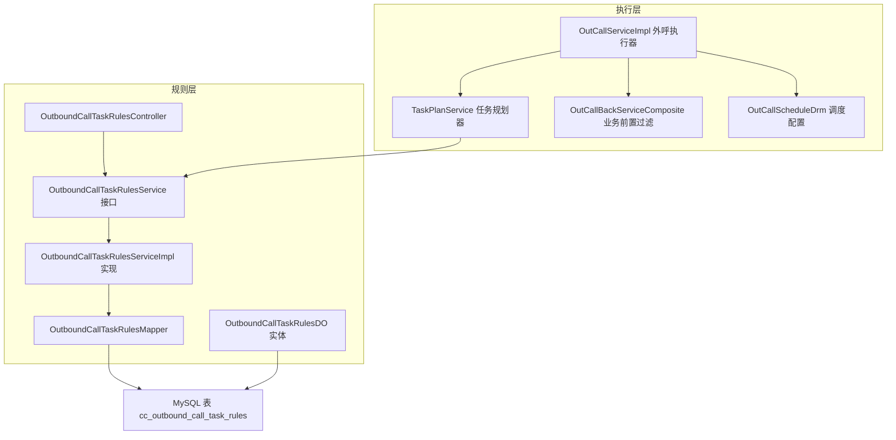
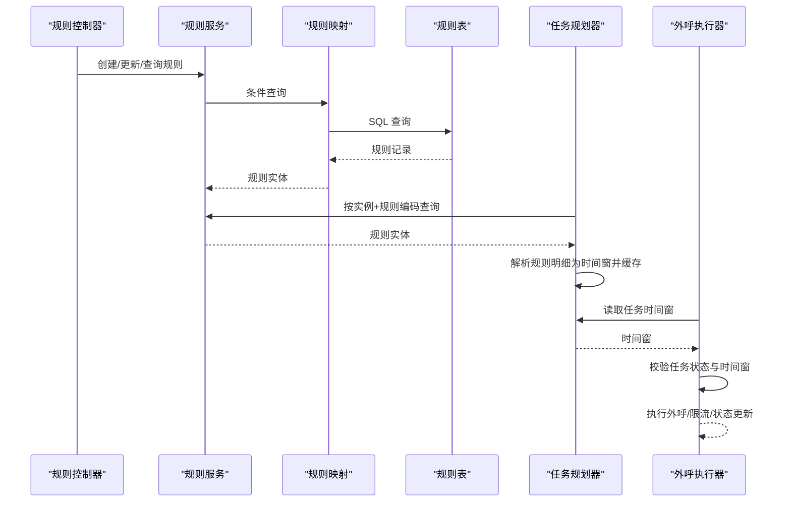
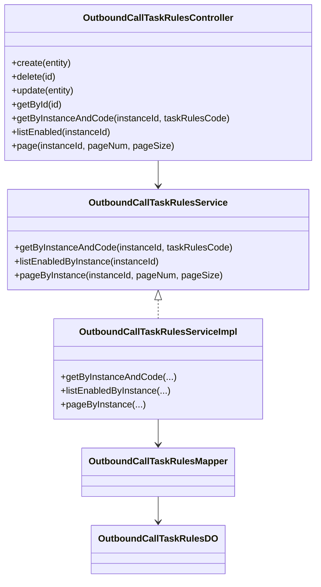
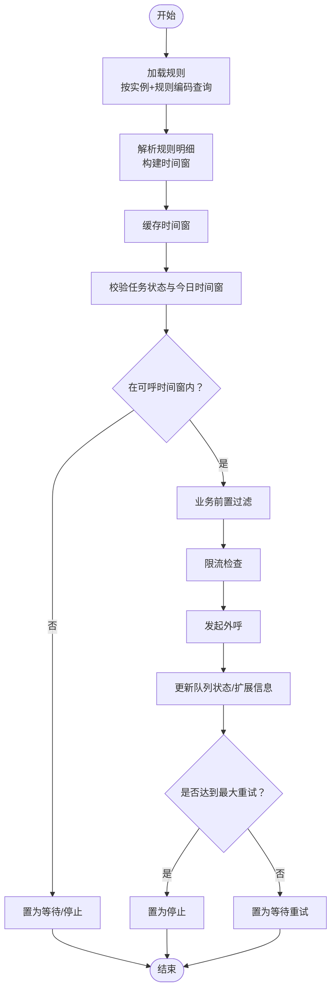
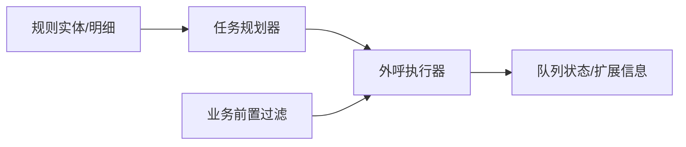
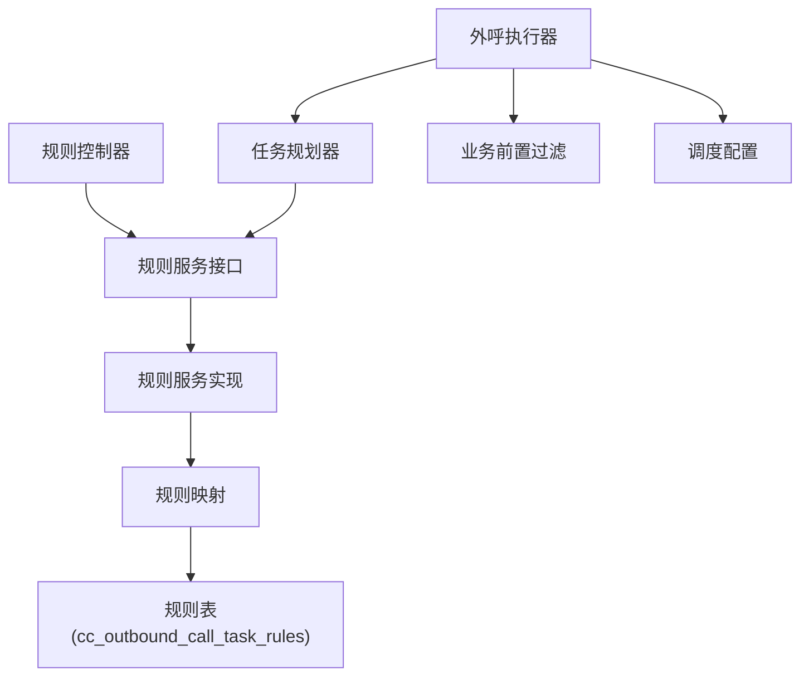
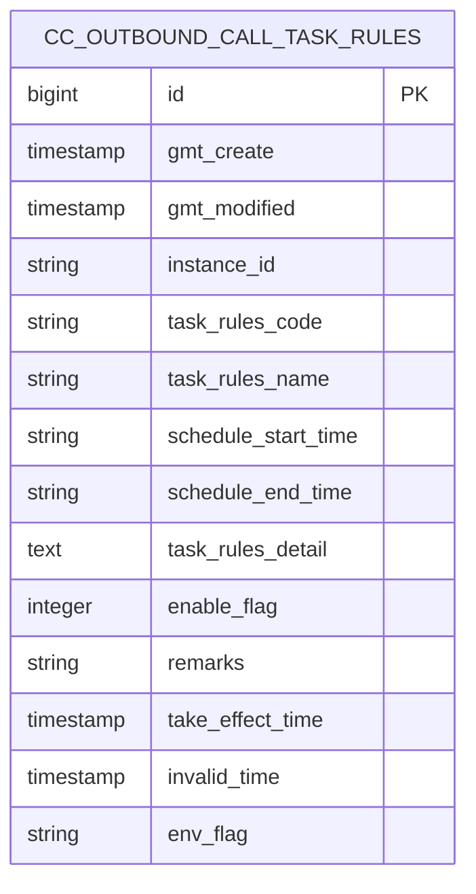

# 业务功能扩展

<cite>
**本文引用的文件**
- [OutboundCallTaskRulesService.java](file://src/main/java/org/qianye/service/OutboundCallTaskRulesService.java)
- [OutboundCallTaskRulesServiceImpl.java](file://src/main/java/org/qianye/service/impl/OutboundCallTaskRulesServiceImpl.java)
- [OutboundCallTaskRulesDO.java](file://src/main/java/org/qianye/entity/OutboundCallTaskRulesDO.java)
- [OutboundCallTaskRulesController.java](file://src/main/java/org/qianye/controller/OutboundCallTaskRulesController.java)
- [OutboundCallTaskRulesMapper.java](file://src/main/java/org/qianye/mapper/OutboundCallTaskRulesMapper.java)
- [OutCallServiceImpl.java](file://src/main/java/org/qianye/OutCallServiceImpl.java)
- [TaskPlanService.java](file://src/main/java/org/qianye/TaskPlanService.java)
- [OutCallBackServiceComposite.java](file://src/main/java/org/qianye/OutCallBackServiceComposite.java)
- [OutCallScheduleDrm.java](file://src/main/java/org/qianye/OutCallScheduleDrm.java)
- [application.properties](file://src/main/resources/application.properties)
- [outcall.sql](file://src/main/resources/outcall.sql)
</cite>

## 目录
1. [简介](#简介)
2. [项目结构](#项目结构)
3. [核心组件](#核心组件)
4. [架构总览](#架构总览)
5. [详细组件分析](#详细组件分析)
6. [依赖分析](#依赖分析)
7. [性能考虑](#性能考虑)
8. [故障排查指南](#故障排查指南)
9. [结论](#结论)
10. [附录](#附录)

## 简介
本文件面向“外呼系统”的业务功能扩展，重点围绕“外呼任务规则”与“自定义外呼策略”的扩展方法展开，系统性阐述 OutboundCallTaskRulesService 的扩展能力、规则配置与验证逻辑、执行流程及与外呼执行的关系。同时给出可落地的扩展示例（新增外呼类型与业务场景）、架构设计与实现模式、测试与验证策略，以及性能影响与优化建议。

## 项目结构
- 业务规则层：规则实体、持久层、服务层、控制器
- 执行层：外呼执行器、任务规划器、调度配置、业务前置过滤
- 配置与数据：应用配置、数据库脚本

图表来源
- [OutboundCallTaskRulesController.java](file://src/main/java/org/qianye/controller/OutboundCallTaskRulesController.java#L1-L65)
- [OutboundCallTaskRulesService.java](file://src/main/java/org/qianye/service/OutboundCallTaskRulesService.java#L1-L26)
- [OutboundCallTaskRulesServiceImpl.java](file://src/main/java/org/qianye/service/impl/OutboundCallTaskRulesServiceImpl.java#L1-L41)
- [OutboundCallTaskRulesMapper.java](file://src/main/java/org/qianye/mapper/OutboundCallTaskRulesMapper.java#L1-L10)
- [OutboundCallTaskRulesDO.java](file://src/main/java/org/qianye/entity/OutboundCallTaskRulesDO.java#L1-L82)
- [OutCallServiceImpl.java](file://src/main/java/org/qianye/OutCallServiceImpl.java#L1-L1191)
- [TaskPlanService.java](file://src/main/java/org/qianye/TaskPlanService.java#L1-L1112)
- [OutCallBackServiceComposite.java](file://src/main/java/org/qianye/OutCallBackServiceComposite.java#L1-L20)
- [OutCallScheduleDrm.java](file://src/main/java/org/qianye/OutCallScheduleDrm.java#L1-L113)
- [outcall.sql](file://src/main/resources/outcall.sql#L123-L165)

章节来源
- [application.properties](file://src/main/resources/application.properties#L1-L17)
- [outcall.sql](file://src/main/resources/outcall.sql#L123-L165)

## 核心组件
- 规则实体与表结构：OutboundCallTaskRulesDO 对应 cc_outbound_call_task_rules 表，承载实例维度的外呼规则配置（含生效/失效时间、规则明细、启用标志、环境标识等）。
- 规则服务接口与实现：OutboundCallTaskRulesService 定义按实例+规则编码查询、列出启用规则、分页查询；实现类基于 MyBatis-Plus Lambda 条件构造器完成查询。
- 规则控制器：提供创建、删除、更新、按 ID 查询、按实例+规则编码查询、列出启用规则、分页查询等 REST 接口。
- 执行与规划：TaskPlanService 负责从规则加载并缓存“任务可呼时间段”，OutCallServiceImpl 在执行阶段读取该时间窗并结合限流、队列状态等决策是否外呼。
- 业务前置过滤：OutCallBackServiceComposite 提供统一入口，用于实现业务规则前置过滤（如黑名单、标签、灰度等）。

章节来源
- [OutboundCallTaskRulesDO.java](file://src/main/java/org/qianye/entity/OutboundCallTaskRulesDO.java#L1-L82)
- [OutboundCallTaskRulesService.java](file://src/main/java/org/qianye/service/OutboundCallTaskRulesService.java#L1-L26)
- [OutboundCallTaskRulesServiceImpl.java](file://src/main/java/org/qianye/service/impl/OutboundCallTaskRulesServiceImpl.java#L1-L41)
- [OutboundCallTaskRulesController.java](file://src/main/java/org/qianye/controller/OutboundCallTaskRulesController.java#L1-L65)
- [TaskPlanService.java](file://src/main/java/org/qianye/TaskPlanService.java#L981-L1001)
- [OutCallServiceImpl.java](file://src/main/java/org/qianye/OutCallServiceImpl.java#L113-L255)
- [OutCallBackServiceComposite.java](file://src/main/java/org/qianye/OutCallBackServiceComposite.java#L1-L20)

## 架构总览
外呼执行与规则的关系：任务启动后，执行器先校验任务状态与“今日可呼时间窗”，再进入队列分组与逐条外呼。时间窗由规则服务加载并缓存到 Redis，执行器在每次处理前读取该时间窗，确保仅在允许的时间段内执行外呼。

图表来源
- [OutboundCallTaskRulesController.java](file://src/main/java/org/qianye/controller/OutboundCallTaskRulesController.java#L24-L63)
- [OutboundCallTaskRulesServiceImpl.java](file://src/main/java/org/qianye/service/impl/OutboundCallTaskRulesServiceImpl.java#L19-L40)
- [TaskPlanService.java](file://src/main/java/org/qianye/TaskPlanService.java#L981-L1001)
- [OutCallServiceImpl.java](file://src/main/java/org/qianye/OutCallServiceImpl.java#L422-L448)

## 详细组件分析

### 组件A：规则服务与控制器（扩展点）
- 扩展目标
  - 新增外呼类型：通过规则实体字段扩展或引入“规则类型”字段，配合控制器新增/编辑接口，支持不同类型的规则模板。
  - 自定义业务场景：通过规则明细字段存储复杂策略（如时间段集合、白名单/黑名单、标签过滤等），在执行阶段解析并应用。
- 关键扩展点
  - 规则实体字段扩展：在 OutboundCallTaskRulesDO 中增加新字段（如规则类型、策略参数等），并在数据库表中同步新增列。
  - 服务层扩展：在 OutboundCallTaskRulesService 接口新增方法（如按类型查询、按环境过滤等），在实现类中补充对应查询逻辑。
  - 控制器扩展：在 OutboundCallTaskRulesController 中新增 REST 接口，支持前端动态配置。
  - 执行侧适配：在 TaskPlanService 或 OutCallServiceImpl 中读取新字段并参与时间窗/策略计算。
- 验证与测试
  - 单元测试：针对服务层方法编写查询/分页/启用规则列表等用例。
  - 集成测试：通过控制器接口创建规则，验证执行器在不同规则下的行为差异。
  - 回归测试：确保现有规则仍能正确加载与缓存。

图表来源
- [OutboundCallTaskRulesService.java](file://src/main/java/org/qianye/service/OutboundCallTaskRulesService.java#L1-L26)
- [OutboundCallTaskRulesServiceImpl.java](file://src/main/java/org/qianye/service/impl/OutboundCallTaskRulesServiceImpl.java#L1-L41)
- [OutboundCallTaskRulesController.java](file://src/main/java/org/qianye/controller/OutboundCallTaskRulesController.java#L1-L65)
- [OutboundCallTaskRulesDO.java](file://src/main/java/org/qianye/entity/OutboundCallTaskRulesDO.java#L1-L82)
- [OutboundCallTaskRulesMapper.java](file://src/main/java/org/qianye/mapper/OutboundCallTaskRulesMapper.java#L1-L10)

章节来源
- [OutboundCallTaskRulesService.java](file://src/main/java/org/qianye/service/OutboundCallTaskRulesService.java#L1-L26)
- [OutboundCallTaskRulesServiceImpl.java](file://src/main/java/org/qianye/service/impl/OutboundCallTaskRulesServiceImpl.java#L1-L41)
- [OutboundCallTaskRulesController.java](file://src/main/java/org/qianye/controller/OutboundCallTaskRulesController.java#L1-L65)
- [OutboundCallTaskRulesDO.java](file://src/main/java/org/qianye/entity/OutboundCallTaskRulesDO.java#L1-L82)
- [OutboundCallTaskRulesMapper.java](file://src/main/java/org/qianye/mapper/OutboundCallTaskRulesMapper.java#L1-L10)

### 组件B：规则配置、验证与执行流程
- 规则配置
  - 规则明细字段：采用序列化结构存储时间段集合等策略，便于灵活扩展。
  - 启用标志与生效/失效时间：控制规则的生命周期与生效范围。
  - 环境标志：支持多环境隔离（如预发/生产/测试）。
- 验证逻辑
  - 服务层：按实例+规则编码精确匹配；列出启用规则时按启用标志过滤。
  - 执行前校验：执行器在每次处理前检查任务状态与“今日可呼时间窗”，不在时间窗内的组/队列将被置为等待或停止。
- 执行流程
  - 规划阶段：TaskPlanService 加载规则并缓存时间窗，生成队列分组。
  - 执行阶段：OutCallServiceImpl 读取时间窗，结合限流、队列状态、前置过滤决定是否外呼，并更新状态与重试机制。

图表来源
- [TaskPlanService.java](file://src/main/java/org/qianye/TaskPlanService.java#L981-L1001)
- [OutCallServiceImpl.java](file://src/main/java/org/qianye/OutCallServiceImpl.java#L422-L448)
- [OutCallServiceImpl.java](file://src/main/java/org/qianye/OutCallServiceImpl.java#L524-L548)
- [OutCallServiceImpl.java](file://src/main/java/org/qianye/OutCallServiceImpl.java#L602-L679)

章节来源
- [TaskPlanService.java](file://src/main/java/org/qianye/TaskPlanService.java#L981-L1001)
- [OutCallServiceImpl.java](file://src/main/java/org/qianye/OutCallServiceImpl.java#L422-L448)
- [OutCallServiceImpl.java](file://src/main/java/org/qianye/OutCallServiceImpl.java#L524-L548)
- [OutCallServiceImpl.java](file://src/main/java/org/qianye/OutCallServiceImpl.java#L602-L679)

### 组件C：业务规则与外呼执行的关系
- 业务规则来源
  - 规则表：通过规则实体与明细字段承载业务策略。
  - 业务前置过滤：OutCallBackServiceComposite 提供统一扩展点，可在执行前对队列进行过滤。
- 关系映射
  - 规则服务 → 规划器 → 执行器：规则驱动执行，执行器严格遵循规则约束。
  - 业务过滤 → 执行器：在规则允许的前提下，进一步细化业务准入条件。

图表来源
- [OutboundCallTaskRulesDO.java](file://src/main/java/org/qianye/entity/OutboundCallTaskRulesDO.java#L56-L75)
- [OutCallBackServiceComposite.java](file://src/main/java/org/qianye/OutCallBackServiceComposite.java#L15-L18)
- [TaskPlanService.java](file://src/main/java/org/qianye/TaskPlanService.java#L981-L1001)
- [OutCallServiceImpl.java](file://src/main/java/org/qianye/OutCallServiceImpl.java#L524-L548)

章节来源
- [OutboundCallTaskRulesDO.java](file://src/main/java/org/qianye/entity/OutboundCallTaskRulesDO.java#L56-L75)
- [OutCallBackServiceComposite.java](file://src/main/java/org/qianye/OutCallBackServiceComposite.java#L15-L18)
- [TaskPlanService.java](file://src/main/java/org/qianye/TaskPlanService.java#L981-L1001)
- [OutCallServiceImpl.java](file://src/main/java/org/qianye/OutCallServiceImpl.java#L524-L548)

### 组件D：扩展示例（新增外呼类型与业务场景）
- 示例一：新增“预测外呼”类型
  - 步骤
    - 在规则实体中新增“规则类型”字段，并在数据库表中新增对应列。
    - 在服务接口与实现中新增按类型查询的方法。
    - 在控制器中新增接口，支持前端配置该类型规则。
    - 在执行侧（TaskPlanService/OutCallServiceImpl）根据规则类型调整时间窗解析或外呼策略。
  - 验证
    - 创建一条“预测外呼”规则，观察执行器是否按新策略运行。
- 示例二：新增“标签白名单”业务场景
  - 步骤
    - 在规则明细中新增“白名单标签集合”字段，序列化存储。
    - 在 OutCallBackServiceComposite 中实现“根据标签过滤无效队列”的逻辑。
    - 在执行器的前置过滤环节调用该组合服务。
  - 验证
    - 创建带标签白名单的规则，执行器应仅对外呼名单中命中白名单的队列发起外呼。

章节来源
- [OutboundCallTaskRulesDO.java](file://src/main/java/org/qianye/entity/OutboundCallTaskRulesDO.java#L1-L82)
- [OutboundCallTaskRulesService.java](file://src/main/java/org/qianye/service/OutboundCallTaskRulesService.java#L1-L26)
- [OutboundCallTaskRulesServiceImpl.java](file://src/main/java/org/qianye/service/impl/OutboundCallTaskRulesServiceImpl.java#L1-L41)
- [OutboundCallTaskRulesController.java](file://src/main/java/org/qianye/controller/OutboundCallTaskRulesController.java#L1-L65)
- [OutCallBackServiceComposite.java](file://src/main/java/org/qianye/OutCallBackServiceComposite.java#L15-L18)
- [TaskPlanService.java](file://src/main/java/org/qianye/TaskPlanService.java#L981-L1001)

## 依赖分析
- 规则层依赖
  - 控制器依赖服务接口；服务实现依赖映射接口；映射接口访问数据库表。
- 执行层依赖
  - 执行器依赖规划器、业务过滤、调度配置；规划器依赖规则服务与 Redis 缓存。
- 外部依赖
  - MySQL 存储规则与任务数据；Redis 缓存时间窗；线程池与限流组件。

图表来源
- [OutboundCallTaskRulesController.java](file://src/main/java/org/qianye/controller/OutboundCallTaskRulesController.java#L1-L65)
- [OutboundCallTaskRulesService.java](file://src/main/java/org/qianye/service/OutboundCallTaskRulesService.java#L1-L26)
- [OutboundCallTaskRulesServiceImpl.java](file://src/main/java/org/qianye/service/impl/OutboundCallTaskRulesServiceImpl.java#L1-L41)
- [OutboundCallTaskRulesMapper.java](file://src/main/java/org/qianye/mapper/OutboundCallTaskRulesMapper.java#L1-L10)
- [outcall.sql](file://src/main/resources/outcall.sql#L123-L165)
- [OutCallServiceImpl.java](file://src/main/java/org/qianye/OutCallServiceImpl.java#L1-L1191)
- [TaskPlanService.java](file://src/main/java/org/qianye/TaskPlanService.java#L1-L1112)
- [OutCallBackServiceComposite.java](file://src/main/java/org/qianye/OutCallBackServiceComposite.java#L1-L20)
- [OutCallScheduleDrm.java](file://src/main/java/org/qianye/OutCallScheduleDrm.java#L1-L113)

章节来源
- [OutboundCallTaskRulesController.java](file://src/main/java/org/qianye/controller/OutboundCallTaskRulesController.java#L1-L65)
- [OutboundCallTaskRulesService.java](file://src/main/java/org/qianye/service/OutboundCallTaskRulesService.java#L1-L26)
- [OutboundCallTaskRulesServiceImpl.java](file://src/main/java/org/qianye/service/impl/OutboundCallTaskRulesServiceImpl.java#L1-L41)
- [OutboundCallTaskRulesMapper.java](file://src/main/java/org/qianye/mapper/OutboundCallTaskRulesMapper.java#L1-L10)
- [outcall.sql](file://src/main/resources/outcall.sql#L123-L165)
- [OutCallServiceImpl.java](file://src/main/java/org/qianye/OutCallServiceImpl.java#L1-L1191)
- [TaskPlanService.java](file://src/main/java/org/qianye/TaskPlanService.java#L1-L1112)
- [OutCallBackServiceComposite.java](file://src/main/java/org/qianye/OutCallBackServiceComposite.java#L1-L20)
- [OutCallScheduleDrm.java](file://src/main/java/org/qianye/OutCallScheduleDrm.java#L1-L113)

## 性能考虑
- 规则查询
  - 使用按实例+规则编码的精确查询，避免全表扫描；启用标志过滤减少无效规则。
- 缓存策略
  - 规则明细解析后缓存至 Redis，降低重复解析成本；合理设置过期时间。
- 执行节流
  - 通过调度配置控制队列长度、限流等待时间、线程池大小，避免过载。
- 并发与锁
  - 使用 Redis 分布式锁保护关键操作；线程池与异步处理提升吞吐。
- 数据库索引
  - 规则表与任务表具备实例、规则码、时间等常用查询字段的索引，保障查询效率。

章节来源
- [OutboundCallTaskRulesServiceImpl.java](file://src/main/java/org/qianye/service/impl/OutboundCallTaskRulesServiceImpl.java#L19-L40)
- [TaskPlanService.java](file://src/main/java/org/qianye/TaskPlanService.java#L981-L1001)
- [OutCallScheduleDrm.java](file://src/main/java/org/qianye/OutCallScheduleDrm.java#L11-L112)
- [OutCallServiceImpl.java](file://src/main/java/org/qianye/OutCallServiceImpl.java#L680-L783)
- [outcall.sql](file://src/main/resources/outcall.sql#L123-L165)

## 故障排查指南
- 规则未生效
  - 检查规则启用标志与生效/失效时间；确认缓存是否正确写入与读取。
- 执行器未外呼
  - 核对任务状态与“今日可呼时间窗”；查看队列状态是否被置为等待/停止。
- 业务过滤导致误杀
  - 检查业务前置过滤逻辑，确认白名单/黑名单/标签策略配置正确。
- 限流阻塞
  - 调整等待时间与线程池配置，观察队列长度与重试次数。

章节来源
- [TaskPlanService.java](file://src/main/java/org/qianye/TaskPlanService.java#L981-L1001)
- [OutCallServiceImpl.java](file://src/main/java/org/qianye/OutCallServiceImpl.java#L422-L448)
- [OutCallServiceImpl.java](file://src/main/java/org/qianye/OutCallServiceImpl.java#L602-L679)
- [OutCallBackServiceComposite.java](file://src/main/java/org/qianye/OutCallBackServiceComposite.java#L15-L18)

## 结论
通过规则服务与控制器的扩展，结合执行器与规划器的协同，系统实现了“规则驱动执行”的灵活架构。新增外呼类型与业务场景可通过规则实体字段扩展、明细策略解析与业务前置过滤实现。配合缓存、限流与并发控制，系统在保证稳定性的同时具备良好的扩展性与性能表现。

## 附录
- 数据模型（简化）

图表来源
- [outcall.sql](file://src/main/resources/outcall.sql#L123-L165)