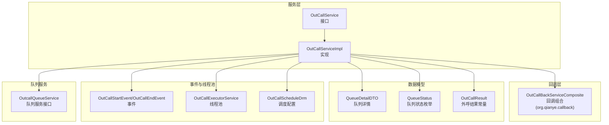
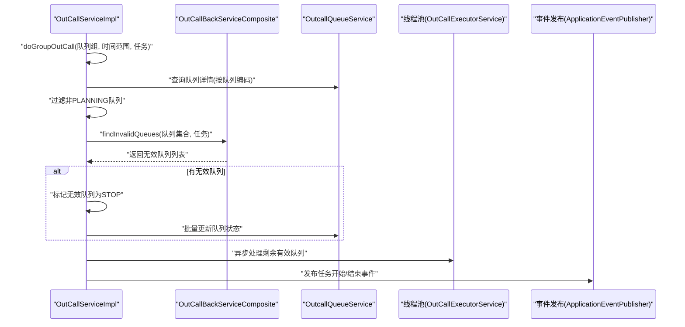
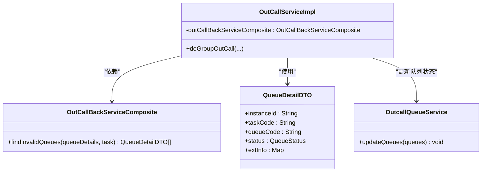
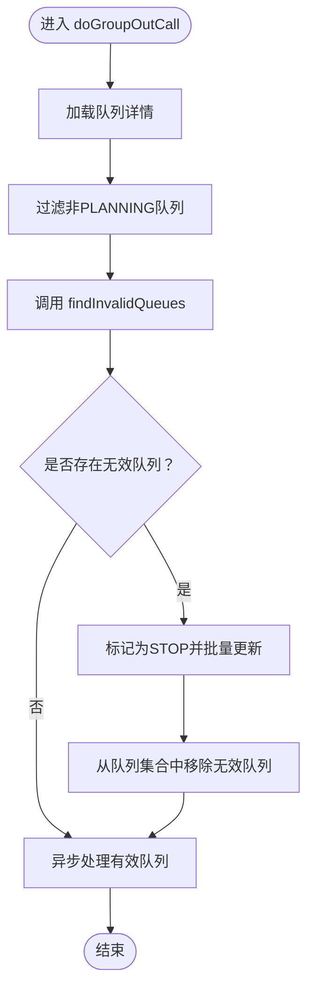
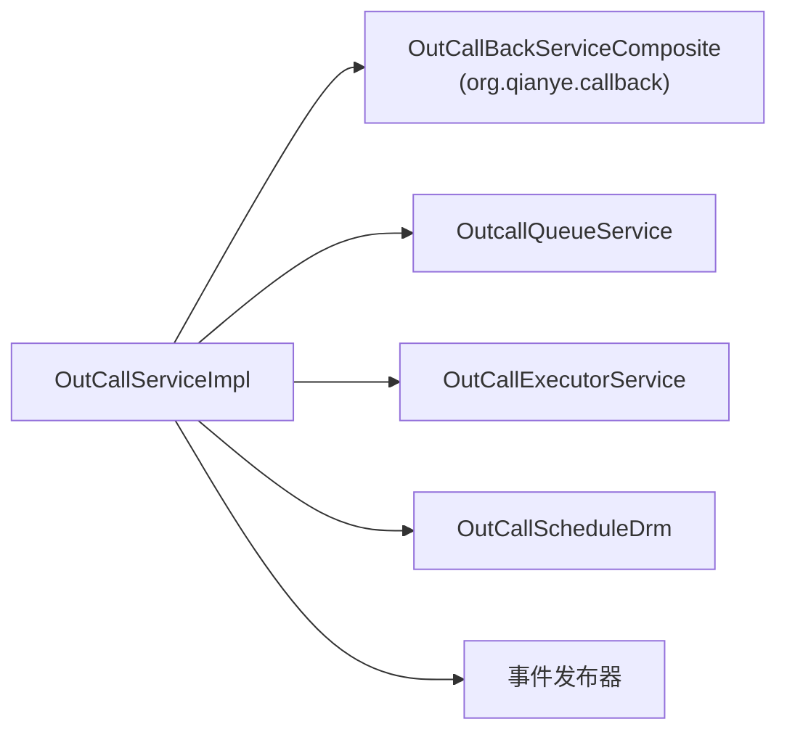

# 回调机制扩展

<cite>
**本文档引用的文件**
- [OutCallBackServiceComposite.java](file://src/main/java/org/qianye/callback/OutCallBackServiceComposite.java)
- [OutCallServiceImpl.java](file://src/main/java/org/qianye/engine/OutCallServiceImpl.java)
- [OutCallService.java](file://src/main/java/org/qianye/engine/OutCallService.java)
- [QueueDetailDTO.java](file://src/main/java/org/qianye/QueueDetailDTO.java)
- [QueueStatus.java](file://src/main/java/org/qianye/QueueStatus.java)
- [OutCallResult.java](file://src/main/java/org/qianye/OutCallResult.java)
- [OutCallStartEvent.java](file://src/main/java/org/qianye/listener/OutCallStartEvent.java)
- [OutCallEndEvent.java](file://src/main/java/org/qianye/listener/OutCallEndEvent.java)
- [OutCallExecutorService.java](file://src/main/java/org/qianye/OutCallExecutorService.java)
- [OutCallScheduleDrm.java](file://src/main/java/org/qianye/OutCallScheduleDrm.java)
- [OutcallQueueService.java](file://src/main/java/org/qianye/OutcallQueueService.java)
</cite>

## 更新摘要
**变更内容**
- 更新 OutCallBackServiceComposite 的包路径引用，从 `org.qianye` 迁移到 `org.qianye.callback`
- 修正相关导入语句和依赖关系
- 保持回调机制的核心功能和实现逻辑不变

## 目录
1. [简介](#简介)
2. [项目结构](#项目结构)
3. [核心组件](#核心组件)
4. [架构总览](#架构总览)
5. [详细组件分析](#详细组件分析)
6. [依赖关系分析](#依赖关系分析)
7. [性能考量](#性能考量)
8. [故障排查指南](#故障排查指南)
9. [结论](#结论)
10. [附录：扩展示例与最佳实践](#附录扩展示例与最佳实践)

## 简介
本文件围绕 Outcall 系统的回调机制扩展展开，重点解析 OutCallBackServiceComposite 的设计与实现，阐述其在队列前置过滤与业务校验中的作用，并说明该机制如何与 OutCallServiceImpl 集成，贯穿外呼流程的关键节点。文档同时提供可扩展的实现思路、生命周期管理与异常处理策略，以及性能优化建议与最佳实践。

## 项目结构
Outcall 系统采用分层与职责分离的设计：
- 服务接口层：OutCallService 定义外呼入口能力
- 服务实现层：OutCallServiceImpl 执行外呼主流程，包含任务调度、队列分组、限流控制、异步处理等
- 回调组合层：OutCallBackServiceComposite 提供业务前置过滤与队列验证的扩展点（位于 org.qianye.callback 包）
- 数据模型层：QueueDetailDTO、QueueStatus、OutCallResult 等承载队列状态与结果
- 事件与线程池：OutCallStartEvent/OutCallEndEvent 用于任务生命周期事件通知；OutCallExecutorService 提供多类线程池支撑异步执行；OutCallScheduleDrm 提供调度参数配置
- 队列服务：OutcallQueueService 提供队列查询与状态更新能力

**图表来源**
- [OutCallService.java](file://src/main/java/org/qianye/engine/OutCallService.java#L1-L10)
- [OutCallServiceImpl.java](file://src/main/java/org/qianye/engine/OutCallServiceImpl.java#L1-L120)
- [OutCallBackServiceComposite.java](file://src/main/java/org/qianye/callback/OutCallBackServiceComposite.java#L1-L20)
- [QueueDetailDTO.java](file://src/main/java/org/qianye/QueueDetailDTO.java#L1-L62)
- [QueueStatus.java](file://src/main/java/org/qianye/QueueStatus.java#L1-L10)
- [OutCallResult.java](file://src/main/java/org/qianye/OutCallResult.java#L1-L50)
- [OutCallStartEvent.java](file://src/main/java/org/qianye/listener/OutCallStartEvent.java#L1-L10)
- [OutCallEndEvent.java](file://src/main/java/org/qianye/listener/OutCallEndEvent.java#L1-L10)
- [OutCallExecutorService.java](file://src/main/java/org/qianye/OutCallExecutorService.java#L1-L211)
- [OutCallScheduleDrm.java](file://src/main/java/org/qianye/OutCallScheduleDrm.java#L1-L75)
- [OutcallQueueService.java](file://src/main/java/org/qianye/OutcallQueueService.java#L1-L60)

**章节来源**
- [OutCallService.java](file://src/main/java/org/qianye/engine/OutCallService.java#L1-L10)
- [OutCallServiceImpl.java](file://src/main/java/org/qianye/engine/OutCallServiceImpl.java#L1-L120)

## 核心组件
- OutCallBackServiceComposite：回调服务组合，提供 findInvalidQueues 方法用于业务前置过滤与队列验证，当前实现为占位，需按业务扩展（位于 org.qianye.callback 包）
- OutCallServiceImpl：外呼主流程实现，负责任务调度、队列分组、限流控制、异步处理与事件发布
- QueueDetailDTO/QueueStatus/OutCallResult：队列数据模型与状态/结果常量，支撑回调过滤后的状态变更与结果记录
- OutCallStartEvent/OutCallEndEvent：外呼任务生命周期事件，用于任务开始与结束的通知
- OutCallExecutorService/OutCallScheduleDrm：线程池与调度配置，支撑异步执行与限流控制
- OutcallQueueService：队列查询与状态更新接口，为回调过滤后的队列状态持久化提供能力

**章节来源**
- [OutCallBackServiceComposite.java](file://src/main/java/org/qianye/callback/OutCallBackServiceComposite.java#L1-L20)
- [OutCallServiceImpl.java](file://src/main/java/org/qianye/engine/OutCallServiceImpl.java#L43-L45)
- [QueueDetailDTO.java](file://src/main/java/org/qianye/QueueDetailDTO.java#L1-L62)
- [QueueStatus.java](file://src/main/java/org/qianye/QueueStatus.java#L1-L10)
- [OutCallResult.java](file://src/main/java/org/qianye/OutCallResult.java#L1-L50)
- [OutCallStartEvent.java](file://src/main/java/org/qianye/listener/OutCallStartEvent.java#L1-L10)
- [OutCallEndEvent.java](file://src/main/java/org/qianye/listener/OutCallEndEvent.java#L1-L10)
- [OutCallExecutorService.java](file://src/main/java/org/qianye/OutCallExecutorService.java#L1-L211)
- [OutCallScheduleDrm.java](file://src/main/java/org/qianye/OutCallScheduleDrm.java#L1-L75)
- [OutcallQueueService.java](file://src/main/java/org/qianye/OutcallQueueService.java#L1-L60)

## 架构总览
回调机制在 OutCallServiceImpl 的 doGroupOutCall 流程中被调用，作为"业务前置过滤"环节，对规划中的队列进行二次校验，剔除无效队列并将其标记为 STOP，随后进入异步处理阶段。

**图表来源**
- [OutCallServiceImpl.java](file://src/main/java/org/qianye/engine/OutCallServiceImpl.java#L374-L386)
- [OutCallBackServiceComposite.java](file://src/main/java/org/qianye/callback/OutCallBackServiceComposite.java#L15-L18)
- [OutcallQueueService.java](file://src/main/java/org/qianye/OutcallQueueService.java#L31-L31)
- [OutCallExecutorService.java](file://src/main/java/org/qianye/OutCallExecutorService.java#L1-L211)
- [OutCallStartEvent.java](file://src/main/java/org/qianye/listener/OutCallStartEvent.java#L1-L10)
- [OutCallEndEvent.java](file://src/main/java/org/qianye/listener/OutCallEndEvent.java#L1-L10)

## 详细组件分析

### OutCallBackServiceComposite 设计与实现
- 角色定位：作为回调服务组合体，提供 findInvalidQueues 方法，用于在队列进入外呼前进行业务层面的前置过滤与验证
- 当前实现：返回空列表，表示不做任何过滤，留待业务扩展
- 与 OutCallServiceImpl 的集成点：在 doGroupOutCall 中调用，过滤掉无效队列后，再进入异步处理
- **更新**：包路径已从 org.qianye 迁移到 org.qianye.callback

**图表来源**
- [OutCallBackServiceComposite.java](file://src/main/java/org/qianye/callback/OutCallBackServiceComposite.java#L1-L20)
- [OutCallServiceImpl.java](file://src/main/java/org/qianye/engine/OutCallServiceImpl.java#L43-L45)
- [QueueDetailDTO.java](file://src/main/java/org/qianye/QueueDetailDTO.java#L1-L62)
- [OutcallQueueService.java](file://src/main/java/org/qianye/OutcallQueueService.java#L31-L31)

**章节来源**
- [OutCallBackServiceComposite.java](file://src/main/java/org/qianye/callback/OutCallBackServiceComposite.java#L1-L20)
- [OutCallServiceImpl.java](file://src/main/java/org/qianye/engine/OutCallServiceImpl.java#L374-L386)

### findInvalidQueues 的作用与扩展方式
- 作用：在 doGroupOutCall 中，先过滤掉非 PLANNING 状态的队列，再调用 findInvalidQueues 对剩余队列进行业务前置过滤，返回无效队列集合
- 扩展方式：
  - 基于任务上下文与队列详情进行规则判断（如黑名单校验、时段限制、业务开关等）
  - 返回无效队列列表后，系统会将其状态置为 STOP 并批量更新，随后从处理队列中剔除
  - 可结合 OutCallResult 常量设置扩展信息，便于后续统计与追踪

**图表来源**
- [OutCallServiceImpl.java](file://src/main/java/org/qianye/engine/OutCallServiceImpl.java#L362-L386)
- [OutCallResult.java](file://src/main/java/org/qianye/OutCallResult.java#L8-L24)

**章节来源**
- [OutCallServiceImpl.java](file://src/main/java/org/qianye/engine/OutCallServiceImpl.java#L374-L386)
- [OutCallResult.java](file://src/main/java/org/qianye/OutCallResult.java#L1-L50)

### 与 OutCallServiceImpl 的集成关系
- OutCallServiceImpl 持有 OutCallBackServiceComposite 的实例引用
- 在 doGroupOutCall 中调用 findInvalidQueues，完成业务前置过滤
- 过滤后的队列进入异步处理流程，期间通过事件发布器发布任务开始/结束事件

**章节来源**
- [OutCallServiceImpl.java](file://src/main/java/org/qianye/engine/OutCallServiceImpl.java#L43-L45)
- [OutCallServiceImpl.java](file://src/main/java/org/qianye/engine/OutCallServiceImpl.java#L374-L386)
- [OutCallStartEvent.java](file://src/main/java/org/qianye/listener/OutCallStartEvent.java#L1-L10)
- [OutCallEndEvent.java](file://src/main/java/org/qianye/listener/OutCallEndEvent.java#L1-L10)

### 回调机制在整个外呼流程中的位置与作用
- 位置：在 doGroupOutCall 的早期阶段，紧接队列详情加载与非 PLANNING 队列过滤之后
- 作用：
  - 业务前置过滤：剔除不符合业务规则的队列，降低无效外呼成本
  - 队列验证：结合任务上下文与队列详情进行验证，确保后续外呼的合法性
  - 状态治理：对无效队列进行 STOP 标记与持久化，保证状态一致性

**章节来源**
- [OutCallServiceImpl.java](file://src/main/java/org/qianye/engine/OutCallServiceImpl.java#L362-L386)

## 依赖关系分析
- 组件耦合：
  - OutCallServiceImpl 依赖 OutCallBackServiceComposite 进行业务前置过滤
  - OutCallServiceImpl 依赖 OutcallQueueService 进行队列状态更新
  - OutCallServiceImpl 依赖 OutCallExecutorService 与 OutCallScheduleDrm 进行异步执行与限流控制
- 外部依赖：
  - Spring 应用事件发布器用于任务生命周期事件通知
  - 线程池策略与队列长度阈值影响回调过滤后的处理吞吐
- **更新**：OutCallBackServiceComposite 的导入路径已更新为 org.qianye.callback

**图表来源**
- [OutCallServiceImpl.java](file://src/main/java/org/qianye/engine/OutCallServiceImpl.java#L8-L9)
- [OutCallServiceImpl.java](file://src/main/java/org/qianye/engine/OutCallServiceImpl.java#L43-L45)
- [OutCallExecutorService.java](file://src/main/java/org/qianye/OutCallExecutorService.java#L1-L211)
- [OutCallScheduleDrm.java](file://src/main/java/org/qianye/OutCallScheduleDrm.java#L1-L75)
- [OutcallQueueService.java](file://src/main/java/org/qianye/OutcallQueueService.java#L1-L60)

**章节来源**
- [OutCallServiceImpl.java](file://src/main/java/org/qianye/engine/OutCallServiceImpl.java#L1-L120)

## 性能考量
- 线程池与队列长度：
  - OutCallExecutorService 提供多种线程池，合理选择与动态调整最大线程数可提升吞吐
  - OutCallScheduleDrm 的队列长度阈值与请求速率控制参数直接影响回调过滤后的处理效率
- 异步处理：
  - 回调过滤后的队列进入异步处理，避免阻塞主流程
  - 线程池饱和时的状态回退（如 WAITING）与扩展信息记录有助于可观测性与重试策略
- 限流与重试：
  - waitForRateLimitRelease 提供带超时的限流等待，防止长时间阻塞
  - 最大重试次数与睡眠间隔可配置，平衡吞吐与稳定性

**章节来源**
- [OutCallExecutorService.java](file://src/main/java/org/qianye/OutCallExecutorService.java#L1-L211)
- [OutCallScheduleDrm.java](file://src/main/java/org/qianye/OutCallScheduleDrm.java#L1-L75)
- [OutCallServiceImpl.java](file://src/main/java/org/qianye/engine/OutCallServiceImpl.java#L416-L455)

## 故障排查指南
- 回调过滤无效：
  - 检查 OutCallBackServiceComposite 的实现是否正确返回无效队列
  - 确认队列状态是否被正确标记为 STOP 并持久化
- 队列状态异常：
  - 非 PLANNING 队列会被过滤，确认业务规则与状态流转是否一致
- 事件未发布：
  - 确认任务开始/结束事件是否在 doGroupOutCall 的合适时机发布
- 线程池饱和：
  - 观察线程池队列长度与拒绝策略，必要时调整最大线程数或队列阈值

**章节来源**
- [OutCallServiceImpl.java](file://src/main/java/org/qianye/engine/OutCallServiceImpl.java#L374-L386)
- [OutCallStartEvent.java](file://src/main/java/org/qianye/listener/OutCallStartEvent.java#L1-L10)
- [OutCallEndEvent.java](file://src/main/java/org/qianye/listener/OutCallEndEvent.java#L1-L10)

## 结论
OutCallBackServiceComposite 作为外呼流程中的业务前置过滤与队列验证扩展点，通过与 OutCallServiceImpl 的紧密集成，实现了对无效队列的快速剔除与状态治理。结合 OutCallExecutorService 与 OutCallScheduleDrm 的异步执行与限流控制，系统能够在高并发场景下保持稳定与高效。包结构的调整（从 org.qianye 到 org.qianye.callback）不影响其核心功能，但要求正确的导入路径。建议在扩展回调服务时遵循"轻量、幂等、可观察"的原则，并配合完善的日志与事件机制进行监控与排障。

## 附录：扩展示例与最佳实践

### 扩展示例：新增自定义回调服务
- 步骤：
  - 新建一个实现类，实现回调过滤逻辑，返回无效队列集合
  - 将其实例注入到 OutCallServiceImpl（或通过 Spring 容器管理），确保在 doGroupOutCall 中被调用
  - 在回调逻辑中结合任务上下文与队列详情进行规则判断，并设置扩展信息以便后续统计
- 注意事项：
  - 回调方法应尽量轻量，避免阻塞主流程
  - 对无效队列进行 STOP 标记与批量更新，确保状态一致性
  - 记录扩展信息（如失效原因），便于后续审计与重试策略

**章节来源**
- [OutCallBackServiceComposite.java](file://src/main/java/org/qianye/callback/OutCallBackServiceComposite.java#L1-L20)
- [OutCallServiceImpl.java](file://src/main/java/org/qianye/engine/OutCallServiceImpl.java#L374-L386)
- [OutcallQueueService.java](file://src/main/java/org/qianye/OutcallQueueService.java#L31-L31)

### 生命周期管理与异常处理
- 生命周期：
  - 回调服务通常以 Spring 组件形式存在，随应用启动而初始化
  - 在 doGroupOutCall 中按需调用，结束后不保留状态
- 异常处理：
  - 回调方法内部异常应被捕获并记录，避免影响主流程
  - 对于不可恢复的错误，可通过扩展信息与事件发布器进行上报

**章节来源**
- [OutCallServiceImpl.java](file://src/main/java/org/qianye/engine/OutCallServiceImpl.java#L390-L401)

### 最佳实践
- 回调逻辑应具备幂等性，避免重复标记与更新
- 使用扩展信息记录失效原因，便于后续统计与优化
- 控制回调方法的复杂度，必要时拆分为多个子服务
- 结合事件发布器与日志，建立完整的可观测性体系
- **更新**：确保正确的包导入路径 org.qianye.callback.OutCallBackServiceComposite