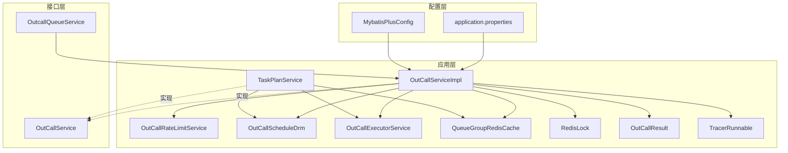
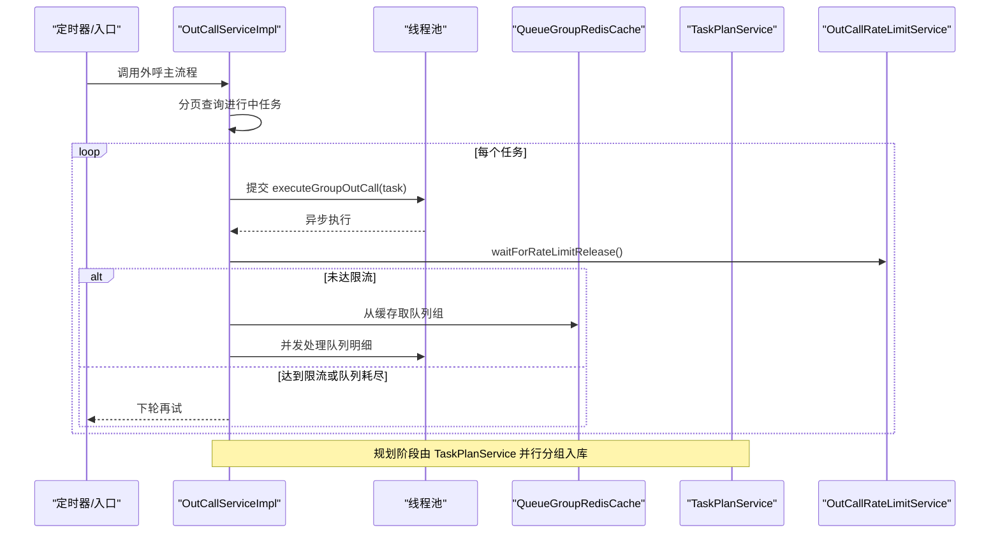
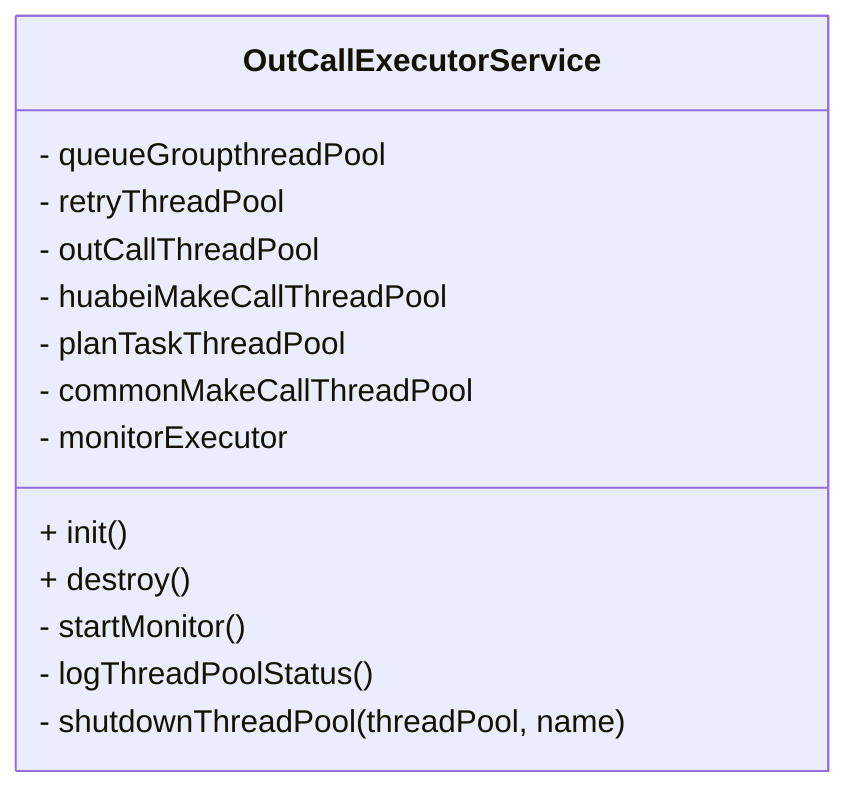
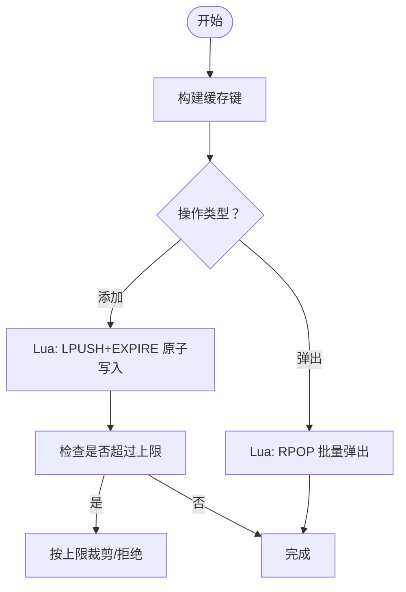
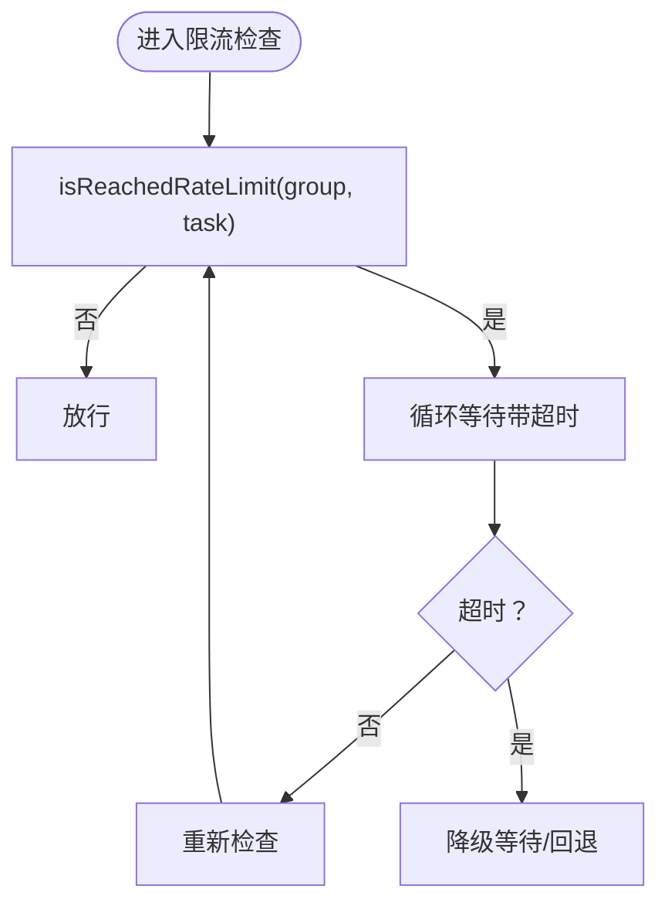
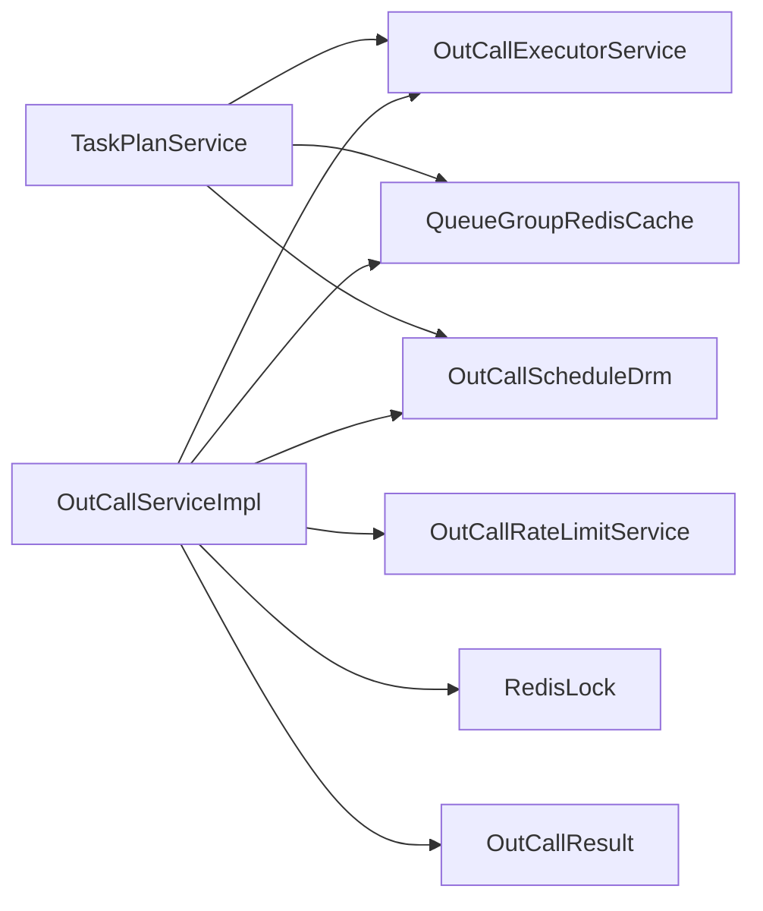

# 性能优化策略

<cite>
**本文档引用的文件**
- [OutCallExecutorService.java](file://src/main/java/org/qianye/OutCallExecutorService.java)
- [QueueGroupRedisCache.java](file://src/main/java/org/qianye/QueueGroupRedisCache.java)
- [CpsLimitHelper.java](file://src/main/java/org/qianye/CpsLimitHelper.java)
- [OutCallServiceImpl.java](file://src/main/java/org/qianye/OutCallServiceImpl.java)
- [OutCallRateLimitService.java](file://src/main/java/org/qianye/OutCallRateLimitService.java)
- [OutCallScheduleDrm.java](file://src/main/java/org/qianye/OutCallScheduleDrm.java)
- [TaskPlanService.java](file://src/main/java/org/qianye/TaskPlanService.java)
- [application.properties](file://src/main/resources/application.properties)
- [MybatisPlusConfig.java](file://src/main/java/org/qianye/config/MybatisPlusConfig.java)
- [RedisLock.java](file://src/main/java/org/qianye/RedisLock.java)
- [OutCallResult.java](file://src/main/java/org/qianye/OutCallResult.java)
- [OutCallService.java](file://src/main/java/org/qianye/OutCallService.java)
- [OutcallQueueService.java](file://src/main/java/org/qianye/OutcallQueueService.java)
- [TracerRunnable.java](file://src/main/java/org/qianye/TracerRunnable.java)
</cite>

## 目录
1. [引言](#引言)
2. [项目结构](#项目结构)
3. [核心组件](#核心组件)
4. [架构总览](#架构总览)
5. [详细组件分析](#详细组件分析)
6. [依赖分析](#依赖分析)
7. [性能考量](#性能考量)
8. [故障排查指南](#故障排查指南)
9. [结论](#结论)
10. [附录](#附录)

## 引言
本文件面向 Outcall 系统的性能优化，聚焦以下方面：
- 线程池配置与任务调度优化
- 缓存策略与性能影响
- 限流算法与动态调整
- 数据库查询优化与连接池配置
- 性能监控与调优方法论
- 高并发场景下的保障与扩展建议

目标是帮助读者快速定位性能瓶颈，并给出可落地的优化方案与实施步骤。

## 项目结构
Outcall 采用 Spring Boot 结构，核心模块围绕“外呼任务编排 + 队列分组 + 并发执行 + 缓存 + 限流”展开。关键文件分布如下：
- 线程池与调度：OutCallExecutorService
- 缓存与队列组：QueueGroupRedisCache
- 限流与调度参数：OutCallRateLimitService、OutCallScheduleDrm
- 业务主流程：OutCallServiceImpl、TaskPlanService
- 配置与环境：application.properties、MybatisPlusConfig
- 并发工具与结果定义：RedisLock、OutCallResult、TracerRunnable
- 接口契约：OutCallService、OutcallQueueService

图表来源
- [OutCallServiceImpl.java](file://src/main/java/org/qianye/OutCallServiceImpl.java#L1-L120)
- [TaskPlanService.java](file://src/main/java/org/qianye/TaskPlanService.java#L1-L120)
- [OutCallExecutorService.java](file://src/main/java/org/qianye/OutCallExecutorService.java#L1-L60)
- [QueueGroupRedisCache.java](file://src/main/java/org/qianye/QueueGroupRedisCache.java#L1-L60)
- [OutCallRateLimitService.java](file://src/main/java/org/qianye/OutCallRateLimitService.java#L1-L17)
- [OutCallScheduleDrm.java](file://src/main/java/org/qianye/OutCallScheduleDrm.java#L1-L60)
- [application.properties](file://src/main/resources/application.properties#L1-L17)
- [MybatisPlusConfig.java](file://src/main/java/org/qianye/config/MybatisPlusConfig.java#L1-L28)

章节来源
- [OutCallServiceImpl.java](file://src/main/java/org/qianye/OutCallServiceImpl.java#L1-L120)
- [application.properties](file://src/main/resources/application.properties#L1-L17)

## 核心组件
- 线程池管理：统一管理多类线程池，含监控与优雅关闭。
- 缓存与队列组：基于 Redis 的队列组缓存，支持原子操作与批量弹出。
- 限流与调度：调度参数集中配置，限流服务预留实现。
- 任务编排：按任务状态与时间窗口分批并发执行，支持重试与异常恢复。
- 并发工具：Redis 分布式锁、链路追踪 Runnable、结果码常量。

章节来源
- [OutCallExecutorService.java](file://src/main/java/org/qianye/OutCallExecutorService.java#L1-L211)
- [QueueGroupRedisCache.java](file://src/main/java/org/qianye/QueueGroupRedisCache.java#L1-L279)
- [OutCallServiceImpl.java](file://src/main/java/org/qianye/OutCallServiceImpl.java#L1-L200)
- [OutCallRateLimitService.java](file://src/main/java/org/qianye/OutCallRateLimitService.java#L1-L17)
- [OutCallScheduleDrm.java](file://src/main/java/org/qianye/OutCallScheduleDrm.java#L1-L113)
- [RedisLock.java](file://src/main/java/org/qianye/RedisLock.java#L83-L188)
- [OutCallResult.java](file://src/main/java/org/qianye/OutCallResult.java#L1-L49)
- [TracerRunnable.java](file://src/main/java/org/qianye/TracerRunnable.java#L1-L14)

## 架构总览
Outcall 的执行路径从任务扫描开始，按批次提交到线程池，通过缓存获取队列组，再并发处理队列明细，期间受限流与时间窗口约束，并在异常时触发重规划与重试。

图表来源
- [OutCallServiceImpl.java](file://src/main/java/org/qianye/OutCallServiceImpl.java#L78-L110)
- [OutCallServiceImpl.java](file://src/main/java/org/qianye/OutCallServiceImpl.java#L112-L255)
- [TaskPlanService.java](file://src/main/java/org/qianye/TaskPlanService.java#L411-L458)
- [QueueGroupRedisCache.java](file://src/main/java/org/qianye/QueueGroupRedisCache.java#L129-L160)
- [OutCallRateLimitService.java](file://src/main/java/org/qianye/OutCallRateLimitService.java#L12-L15)

## 详细组件分析

### 线程池配置与任务调度优化（OutCallExecutorService）
- 线程池类型与容量
  - 队列组处理线程池：核心/最大/队列容量分别为 10/40/2000，拒绝策略为丢弃。
  - 重试线程池：核心/最大/队列容量分别为 20/40/2000，拒绝策略为调用方执行。
  - 外呼线程池：核心/最大/队列容量分别为 20/64/10000，拒绝策略为丢弃。
  - 华北外呼线程池：核心/最大/队列容量分别为 20/160/20000，拒绝策略为丢弃。
  - 规划任务线程池：核心/最大/队列容量分别为 20/40/10000，拒绝策略为丢弃。
  - 通用外呼线程池：核心/最大/队列容量分别为 80/160/10000，无拒绝策略（默认饱和策略）。
- 监控与可观测性
  - 定时任务每 10 秒打印各线程池活动线程、池大小、最大值、完成任务数、队列长度。
- 优雅关闭
  - 关闭监控线程池；逐个线程池优雅关闭，超时强制关闭并记录日志。

优化建议
- 动态阈值：结合监控指标（队列长度、活跃线程占比、拒绝次数）动态调整核心/最大线程数与队列容量。
- 拒绝策略：对重试/规划线程池可考虑 CallerRunsPolicy 以保护下游；对外呼线程池保持 DiscardPolicy 以削峰填谷。
- 优先级队列：对紧急任务（如实时重试）可引入优先级队列，降低尾延迟。
- 线程池隔离：不同租户/任务类型使用独立线程池，避免相互影响。

图表来源
- [OutCallExecutorService.java](file://src/main/java/org/qianye/OutCallExecutorService.java#L14-L51)

章节来源
- [OutCallExecutorService.java](file://src/main/java/org/qianye/OutCallExecutorService.java#L1-L211)

### 缓存策略与性能影响（QueueGroupRedisCache）
- 缓存键设计
  - 主队列组与私有队列组分别使用不同前缀，区分固定/公共组。
- 原子操作
  - 使用 Lua 脚本保证 LPUSH+EXPIRE 的原子性，减少往返开销。
  - RPOP 批量弹出，避免多次网络往返。
- 限流与上限
  - 通过调度参数限制缓存组数量上限，防止缓存膨胀。
- 性能影响
  - Redis 命中率直接影响外呼吞吐；批量弹出与原子写入显著降低 RTT。
  - 过期时间统一设置为 24 小时，平衡内存占用与一致性。

优化建议
- 读写分离：热点组读取走本地副本或二级缓存，写入仍走 Redis。
- 分片与分区：按 taskCode/env/instanceId 做哈希分片，降低单实例压力。
- 预热与预估：根据历史峰值估算队列组规模，提前预热热点键。
- 监控指标：统计命中率、过期率、Lua 脚本执行耗时、队列组大小分布。

图表来源
- [QueueGroupRedisCache.java](file://src/main/java/org/qianye/QueueGroupRedisCache.java#L86-L160)
- [OutCallScheduleDrm.java](file://src/main/java/org/qianye/OutCallScheduleDrm.java#L109-L111)

章节来源
- [QueueGroupRedisCache.java](file://src/main/java/org/qianye/QueueGroupRedisCache.java#L1-L279)
- [OutCallScheduleDrm.java](file://src/main/java/org/qianye/OutCallScheduleDrm.java#L1-L113)

### 限流算法与动态调整（OutCallRateLimitService 与 OutCallScheduleDrm）
- 现状
  - 限流服务与 CpsLimitHelper 仅占位，尚未实现具体算法。
  - 调度参数提供等待时长、睡眠间隔、最大队列长度等阈值。
- 现有等待逻辑
  - waitForRateLimitRelease 循环等待，超时后降级为等待下次轮询。
- 优化建议
  - 算法选择：令牌桶/漏桶/滑动窗口，结合任务/组粒度与租户维度。
  - 动态阈值：基于线程池队列长度、CPU 使用率、Redis 延迟动态调节等待时长与睡眠间隔。
  - 多级限流：全局限流 + 租户限流 + 组内限流，配合退避与熔断。
  - 信号量：对下游接口限流，避免瞬时洪峰。

图表来源
- [OutCallServiceImpl.java](file://src/main/java/org/qianye/OutCallServiceImpl.java#L602-L679)
- [OutCallRateLimitService.java](file://src/main/java/org/qianye/OutCallRateLimitService.java#L12-L15)
- [CpsLimitHelper.java](file://src/main/java/org/qianye/CpsLimitHelper.java#L1-L11)

章节来源
- [OutCallServiceImpl.java](file://src/main/java/org/qianye/OutCallServiceImpl.java#L602-L679)
- [OutCallRateLimitService.java](file://src/main/java/org/qianye/OutCallRateLimitService.java#L1-L17)
- [CpsLimitHelper.java](file://src/main/java/org/qianye/CpsLimitHelper.java#L1-L11)
- [OutCallScheduleDrm.java](file://src/main/java/org/qianye/OutCallScheduleDrm.java#L1-L113)

### 数据库查询优化与连接池配置
- MyBatis-Plus 插件
  - 已启用乐观锁拦截器；分页插件暂禁用，避免依赖冲突。
- 查询策略
  - 任务扫描采用分页拉取，避免一次性加载全量数据。
  - 规划阶段按批次并行处理，减少数据库压力。
- 连接池与 SQL 日志
  - application.properties 中配置了 MySQL 连接信息与 MyBatis 日志输出。
- 优化建议
  - 分页与索引：确保分页查询的排序字段建立合适索引；限制每页大小。
  - 读写分离：规划阶段写入与查询阶段读取分离。
  - 批处理：批量插入/更新使用 JDBC 批处理或 MyBatis 批处理。
  - SQL 分析：开启慢查询日志，定期审查热点 SQL。

章节来源
- [MybatisPlusConfig.java](file://src/main/java/org/qianye/config/MybatisPlusConfig.java#L1-L28)
- [application.properties](file://src/main/resources/application.properties#L1-L17)
- [OutCallServiceImpl.java](file://src/main/java/org/qianye/OutCallServiceImpl.java#L82-L106)
- [TaskPlanService.java](file://src/main/java/org/qianye/TaskPlanService.java#L461-L457)

### 并发与分布式协调（RedisLock、TracerRunnable）
- RedisLock
  - 提供基于 Redis 的分布式互斥锁，内置续期线程池，避免锁过期。
- TracerRunnable
  - 包装任务以支持链路追踪，便于问题定位。
- 优化建议
  - 续期周期与锁过期时间匹配，避免频繁续期或锁过期。
  - 对长任务拆分，缩短单次持有锁的时间。

章节来源
- [RedisLock.java](file://src/main/java/org/qianye/RedisLock.java#L83-L188)
- [TracerRunnable.java](file://src/main/java/org/qianye/TracerRunnable.java#L1-L14)

## 依赖分析
- 组件耦合
  - OutCallServiceImpl 依赖线程池、缓存、限流、调度参数、队列服务、锁与结果码。
  - TaskPlanService 与 OutCallServiceImpl 协作完成“规划-执行”的闭环。
- 外部依赖
  - Redis：队列组缓存与分布式锁。
  - MySQL：任务与队列明细持久化。
- 潜在风险
  - 线程池队列堆积导致延迟放大。
  - 缓存未命中或过期导致 DB 压力上升。
  - 限流策略缺失导致下游雪崩。

图表来源
- [OutCallServiceImpl.java](file://src/main/java/org/qianye/OutCallServiceImpl.java#L31-L70)
- [TaskPlanService.java](file://src/main/java/org/qianye/TaskPlanService.java#L30-L75)

章节来源
- [OutCallServiceImpl.java](file://src/main/java/org/qianye/OutCallServiceImpl.java#L1-L120)
- [TaskPlanService.java](file://src/main/java/org/qianye/TaskPlanService.java#L1-L120)

## 性能考量
- 关键指标
  - 线程池：队列长度、活跃线程数、拒绝次数、任务完成时延。
  - 缓存：命中率、过期率、Lua 脚本耗时、键数量。
  - 限流：等待时长、超时比例、降级次数。
  - 数据库：QPS、P95/P99 延迟、慢查询数、连接池利用率。
- 监控与告警
  - 基于 OutCallExecutorService 的定时日志输出，补充 Prometheus/Grafana 指标采集。
  - 缓存侧埋点统计批量弹出耗时与失败率。
  - 限流侧记录等待/超时/降级事件。
- 调优步骤
  - 步骤一：评估当前负载与 SLA，确定目标 P95 延迟与吞吐。
  - 步骤二：针对瓶颈线程池/缓存/限流/数据库分别制定优化方案。
  - 步骤三：灰度上线，对比指标，逐步扩大流量。
  - 步骤四：形成基线与应急预案，持续迭代。

[本节为通用指导，无需列出章节来源]

## 故障排查指南
- 线程池相关
  - 现象：任务积压、队列长度持续增长。
  - 排查：查看线程池日志，确认拒绝策略与队列容量是否合理；必要时扩容。
  - 参考：OutCallExecutorService 的监控与关闭流程。
- 缓存相关
  - 现象：Redis 延迟升高、过期频繁。
  - 排查：核对键前缀与过期时间；检查 Lua 脚本执行耗时；评估命中率。
  - 参考：QueueGroupRedisCache 的初始化与脚本。
- 限流相关
  - 现象：大量等待/超时/降级。
  - 排查：确认限流策略是否启用；评估阈值是否过严；观察下游稳定性。
  - 参考：OutCallRateLimitService 与 waitForRateLimitRelease。
- 数据库相关
  - 现象：慢查询增多、连接池紧张。
  - 排查：检查分页大小与索引；评估批处理与事务大小；关注锁等待。
  - 参考：MybatisPlusConfig 与 TaskPlanService 的批处理逻辑。

章节来源
- [OutCallExecutorService.java](file://src/main/java/org/qianye/OutCallExecutorService.java#L60-L137)
- [QueueGroupRedisCache.java](file://src/main/java/org/qianye/QueueGroupRedisCache.java#L63-L79)
- [OutCallServiceImpl.java](file://src/main/java/org/qianye/OutCallServiceImpl.java#L602-L679)
- [MybatisPlusConfig.java](file://src/main/java/org/qianye/config/MybatisPlusConfig.java#L1-L28)
- [TaskPlanService.java](file://src/main/java/org/qianye/TaskPlanService.java#L538-L622)

## 结论
- Outcall 的性能优化应围绕“线程池隔离与容量、缓存原子化与上限、限流策略与动态阈值、数据库批处理与索引”四大支柱展开。
- 当前系统在缓存与线程池层面具备良好基础，限流与数据库优化仍有较大提升空间。
- 建议尽快补齐限流与 CpsLimitHelper 的实现，并配套完善的监控与自动调参能力，以支撑高并发场景下的稳定与弹性。

[本节为总结，无需列出章节来源]

## 附录
- 优化案例（示例）
  - 案例一：线程池扩容
    - 场景：队列组线程池队列长度长期超过 1000，P99 延迟上升。
    - 方案：将核心线程从 10 提升至 20，最大线程从 40 提升至 60，队列容量从 2000 提升至 5000。
    - 验证：监控队列长度下降、P99 延迟回落。
  - 案例二：缓存上限与过期
    - 场景：缓存组数量接近 10000，内存占用高。
    - 方案：将上限从 10000 调整为 8000，并缩短过期时间至 12 小时。
    - 验证：内存占用下降，命中率稳定。
  - 案例三：限流策略
    - 场景：下游偶发抖动，出现大量等待/超时。
    - 方案：引入令牌桶限流，设置租户级阈值；当队列长度超过阈值时主动降级等待。
    - 验证：等待/超时比例下降，下游稳定性提升。

[本节为示例说明，无需列出章节来源]