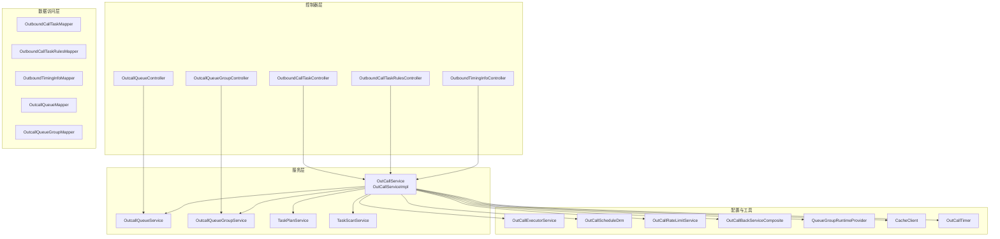
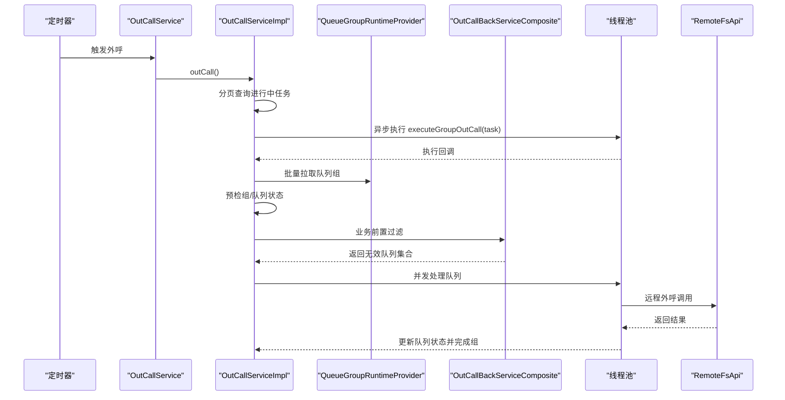
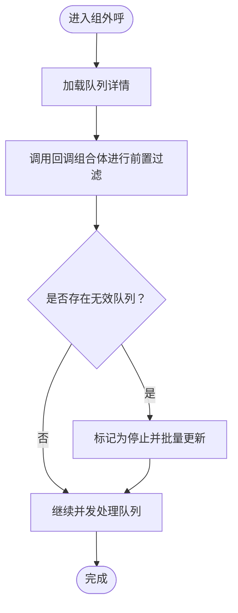
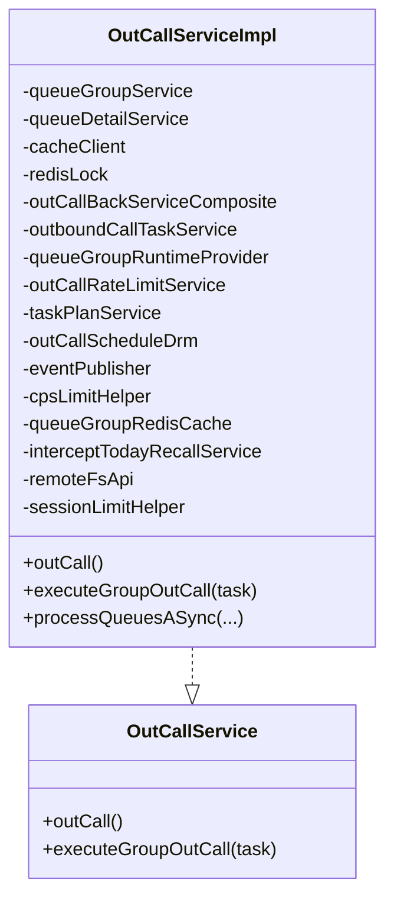
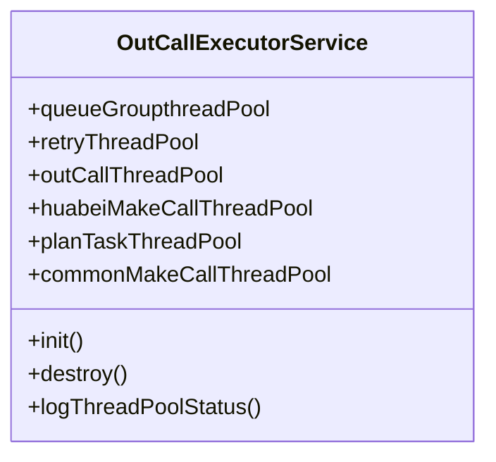
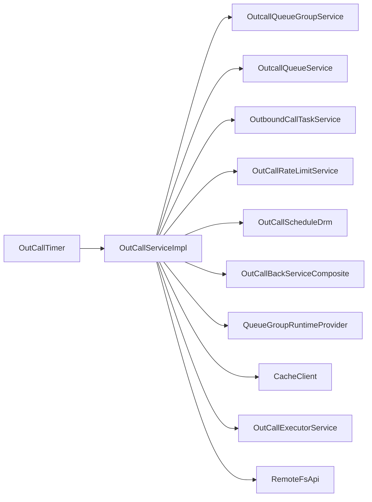

# 扩展与定制

<cite>
**本文引用的文件**
- [OutCallBackServiceComposite.java](file://src/main/java/org/qianye/OutCallBackServiceComposite.java)
- [OutCallService.java](file://src/main/java/org/qianye/OutCallService.java)
- [OutCallServiceImpl.java](file://src/main/java/org/qianye/OutCallServiceImpl.java)
- [OutCallExecutorService.java](file://src/main/java/org/qianye/OutCallExecutorService.java)
- [OutCallRateLimitService.java](file://src/main/java/org/qianye/OutCallRateLimitService.java)
- [OutCallScheduleDrm.java](file://src/main/java/org/qianye/OutCallScheduleDrm.java)
- [QueueGroupRuntimeProvider.java](file://src/main/java/org/qianye/QueueGroupRuntimeProvider.java)
- [CacheClient.java](file://src/main/java/org/qianye/CacheClient.java)
- [application.properties](file://src/main/resources/application.properties)
- [OutCallTimer.java](file://src/main/java/org/qianye/OutCallTimer.java)
- [OutcallQueueService.java](file://src/main/java/org/qianye/OutcallQueueService.java)
- [OutboundCallTaskService.java](file://src/main/java/org/qianye/service/OutboundCallTaskService.java)
- [OutboundCallTaskServiceImpl.java](file://src/main/java/org/qianye/service/impl/OutboundCallTaskServiceImpl.java)
- [OutCallResult.java](file://src/main/java/org/qianye/OutCallResult.java)
- [RemoteFsApi.java](file://src/main/java/org/qianye/RemoteFsApi.java)
</cite>

## 目录
1. [引言](#引言)
2. [项目结构](#项目结构)
3. [核心组件](#核心组件)
4. [架构总览](#架构总览)
5. [详细组件分析](#详细组件分析)
6. [依赖分析](#依赖分析)
7. [性能考虑](#性能考虑)
8. [故障排查指南](#故障排查指南)
9. [结论](#结论)
10. [附录](#附录)

## 引言
本文件面向希望对 Outcall 系统进行扩展与定制的开发者，系统性阐述以下主题：
- 回调服务的扩展机制与 OutCallBackServiceComposite 的使用
- 新增业务功能与自定义外呼策略的方法
- 配置项的扩展与参数定制
- 插件化架构的设计原理与实现方式
- 性能优化策略：数据库、缓存、线程池
- 第三方服务与外部系统集成
- 定制化开发指导与最佳实践
- 可扩展性设计与未来演进方向

## 项目结构
Outcall 采用分层清晰的 Spring Boot 结构，主要模块包括：
- 控制器层：对外提供 REST 接口
- 服务层：核心业务逻辑（外呼调度、队列管理、任务计划等）
- 数据访问层：MyBatis-Plus 映射器与服务实现
- 配置与工具：线程池、限流、调度、缓存、常量与工具类
- 资源：应用配置、日志配置、SQL 初始化脚本

图表来源
- [OutCallService.java](file://src/main/java/org/qianye/OutCallService.java#L1-L10)
- [OutCallServiceImpl.java](file://src/main/java/org/qianye/OutCallServiceImpl.java#L1-L120)
- [OutCallExecutorService.java](file://src/main/java/org/qianye/OutCallExecutorService.java#L1-L60)
- [OutCallScheduleDrm.java](file://src/main/java/org/qianye/OutCallScheduleDrm.java#L1-L60)
- [OutCallRateLimitService.java](file://src/main/java/org/qianye/OutCallRateLimitService.java#L1-L17)
- [OutCallBackServiceComposite.java](file://src/main/java/org/qianye/OutCallBackServiceComposite.java#L1-L20)
- [QueueGroupRuntimeProvider.java](file://src/main/java/org/qianye/QueueGroupRuntimeProvider.java#L1-L19)
- [CacheClient.java](file://src/main/java/org/qianye/CacheClient.java#L1-L25)
- [OutCallTimer.java](file://src/main/java/org/qianye/OutCallTimer.java#L1-L60)

章节来源
- [OutCallService.java](file://src/main/java/org/qianye/OutCallService.java#L1-L10)
- [OutCallServiceImpl.java](file://src/main/java/org/qianye/OutCallServiceImpl.java#L1-L120)
- [OutCallExecutorService.java](file://src/main/java/org/qianye/OutCallExecutorService.java#L1-L60)
- [OutCallScheduleDrm.java](file://src/main/java/org/qianye/OutCallScheduleDrm.java#L1-L60)
- [OutCallRateLimitService.java](file://src/main/java/org/qianye/OutCallRateLimitService.java#L1-L17)
- [OutCallBackServiceComposite.java](file://src/main/java/org/qianye/OutCallBackServiceComposite.java#L1-L20)
- [QueueGroupRuntimeProvider.java](file://src/main/java/org/qianye/QueueGroupRuntimeProvider.java#L1-L19)
- [CacheClient.java](file://src/main/java/org/qianye/CacheClient.java#L1-L25)
- [OutCallTimer.java](file://src/main/java/org/qianye/OutCallTimer.java#L1-L60)

## 核心组件
- 外呼服务接口与实现：定义外呼入口与具体执行流程，负责任务分页、组轮询、并发控制、限流与重试。
- 线程池服务：集中管理多类线程池，提供监控与优雅关闭。
- 调度配置：集中管理外呼调度参数（队列长度、轮询批次、限流等待、核心/最大线程等）。
- 限流服务：占位实现，用于统一接入限流策略。
- 回调服务组合：对外呼前的业务过滤点进行扩展，支持按任务维度定制无效队列识别。
- 队列组运行时提供者：占位实现，用于从缓存或存储中批量拉取队列组。
- 缓存客户端：占位实现，用于接入 Redis 等缓存能力。
- 定时任务：统一调度外呼主流程、任务扫描、队列状态检查等。

章节来源
- [OutCallService.java](file://src/main/java/org/qianye/OutCallService.java#L1-L10)
- [OutCallServiceImpl.java](file://src/main/java/org/qianye/OutCallServiceImpl.java#L1-L120)
- [OutCallExecutorService.java](file://src/main/java/org/qianye/OutCallExecutorService.java#L1-L120)
- [OutCallScheduleDrm.java](file://src/main/java/org/qianye/OutCallScheduleDrm.java#L1-L113)
- [OutCallRateLimitService.java](file://src/main/java/org/qianye/OutCallRateLimitService.java#L1-L17)
- [OutCallBackServiceComposite.java](file://src/main/java/org/qianye/OutCallBackServiceComposite.java#L1-L20)
- [QueueGroupRuntimeProvider.java](file://src/main/java/org/qianye/QueueGroupRuntimeProvider.java#L1-L19)
- [CacheClient.java](file://src/main/java/org/qianye/CacheClient.java#L1-L25)
- [OutCallTimer.java](file://src/main/java/org/qianye/OutCallTimer.java#L1-L118)

## 架构总览
Outcall 采用“定时触发 + 并发执行 + 限流与重试”的架构模式。核心流程如下：
- 定时器周期性触发外呼主流程
- 主流程分页查询进行中的任务，异步提交到线程池
- 对每个任务按组轮询，预检组与队列状态
- 通过回调服务组合进行业务前置过滤
- 按线程池容量与队列长度控制并发，逐个发起外呼
- 外呼完成后更新队列状态，并在组内聚合完成时解锁与收尾

图表来源
- [OutCallTimer.java](file://src/main/java/org/qianye/OutCallTimer.java#L60-L80)
- [OutCallService.java](file://src/main/java/org/qianye/OutCallService.java#L1-L10)
- [OutCallServiceImpl.java](file://src/main/java/org/qianye/OutCallServiceImpl.java#L78-L255)
- [QueueGroupRuntimeProvider.java](file://src/main/java/org/qianye/QueueGroupRuntimeProvider.java#L14-L17)
- [OutCallBackServiceComposite.java](file://src/main/java/org/qianye/OutCallBackServiceComposite.java#L15-L18)
- [RemoteFsApi.java](file://src/main/java/org/qianye/RemoteFsApi.java#L11-L14)

## 详细组件分析

### 回调服务组合：OutCallBackServiceComposite
- 设计目的：在执行外呼前，允许业务方注入自定义规则，筛选出无效或不应外呼的队列，减少无效调用与资源浪费。
- 使用位置：在组级外呼处理流程中，先获取队列详情，再调用该组合体进行前置过滤，将无效队列标记为停止并落库。
- 扩展方式：实现新的过滤策略，覆盖 findInvalidQueues 方法，返回应剔除的队列集合；可结合任务上下文、队列属性、时段规则等进行判断。

图表来源
- [OutCallServiceImpl.java](file://src/main/java/org/qianye/OutCallServiceImpl.java#L523-L548)
- [OutCallBackServiceComposite.java](file://src/main/java/org/qianye/OutCallBackServiceComposite.java#L15-L18)

章节来源
- [OutCallServiceImpl.java](file://src/main/java/org/qianye/OutCallServiceImpl.java#L523-L548)
- [OutCallBackServiceComposite.java](file://src/main/java/org/qianye/OutCallBackServiceComposite.java#L1-L20)

### 外呼服务接口与实现：OutCallService / OutCallServiceImpl
- 接口职责：定义外呼入口与按组执行的接口。
- 实现要点：
  - 分页扫描进行中的任务，异步提交执行
  - 任务级并发控制与运行标志去重
  - 组级轮询与状态校验
  - 限流等待与超时处理
  - 并发执行队列外呼，更新状态并完成组
  - 事件发布：开始/结束事件
  - 线程池选择：根据租户类型切换不同线程池

图表来源
- [OutCallService.java](file://src/main/java/org/qianye/OutCallService.java#L1-L10)
- [OutCallServiceImpl.java](file://src/main/java/org/qianye/OutCallServiceImpl.java#L29-L70)

章节来源
- [OutCallService.java](file://src/main/java/org/qianye/OutCallService.java#L1-L10)
- [OutCallServiceImpl.java](file://src/main/java/org/qianye/OutCallServiceImpl.java#L78-L255)

### 线程池服务：OutCallExecutorService
- 线程池类型：
  - 队列组线程池：处理组内队列并发
  - 重试线程池：异常重试
  - 外呼线程池：顶层任务调度
  - 华北专用线程池：针对大租户
  - 计划任务线程池：任务规划
  - 通用外呼线程池：常规并发
- 监控与优雅停机：定时输出各线程池状态，销毁时优雅关闭
- 扩展建议：根据租户规模与任务特征动态调整核心/最大线程与队列容量

图表来源
- [OutCallExecutorService.java](file://src/main/java/org/qianye/OutCallExecutorService.java#L13-L182)

章节来源
- [OutCallExecutorService.java](file://src/main/java/org/qianye/OutCallExecutorService.java#L1-L211)

### 调度配置：OutCallScheduleDrm
- 职责：集中管理外呼调度相关参数，便于灰度与快速调整
- 关键参数示例：最大队列长度、轮询批次、限流等待时间、睡眠间隔、核心/最大线程、压力测试开关、拦截召回实例等
- 扩展建议：接入配置中心，按环境/租户/任务动态下发

章节来源
- [OutCallScheduleDrm.java](file://src/main/java/org/qianye/OutCallScheduleDrm.java#L1-L113)

### 限流服务：OutCallRateLimitService
- 现状：占位实现，需按业务接入具体限流策略（如令牌桶、漏桶、Redis 计数）
- 扩展建议：基于租户/组/全局维度实现分级限流，结合等待超时与重试策略

章节来源
- [OutCallRateLimitService.java](file://src/main/java/org/qianye/OutCallRateLimitService.java#L1-L17)

### 队列组运行时提供者：QueueGroupRuntimeProvider
- 现状：占位实现，需从缓存或存储批量拉取队列组
- 扩展建议：对接 Redis/内存缓存，实现 LPOP/RPUSH 等原子操作，支持批大小与去重

章节来源
- [QueueGroupRuntimeProvider.java](file://src/main/java/org/qianye/QueueGroupRuntimeProvider.java#L1-L19)

### 缓存客户端：CacheClient
- 现状：占位实现，需对接 Redis
- 扩展建议：实现 setIfAbsent、exists、删除等常用操作，配合分布式锁与过期策略

章节来源
- [CacheClient.java](file://src/main/java/org/qianye/CacheClient.java#L1-L25)

### 定时任务：OutCallTimer
- 职责：统一调度外呼主流程、任务扫描、队列状态检查等
- 执行策略：异步+随机抖动，避免同时触发
- 线程池：独立的线程池执行器

章节来源
- [OutCallTimer.java](file://src/main/java/org/qianye/OutCallTimer.java#L1-L118)

### 队列详情服务：OutcallQueueService
- 职责：队列详情的查询、分页、状态更新、批量插入等
- 扩展建议：结合 OutCallResult 中的状态键，完善状态流转与重试逻辑

章节来源
- [OutcallQueueService.java](file://src/main/java/org/qianye/OutcallQueueService.java#L1-L61)

### 任务服务：OutboundCallTaskService / OutboundCallTaskServiceImpl
- 职责：任务的分页查询、状态更新、按实例与任务码查询
- 扩展建议：增加任务维度的限流键、状态变更审计、异常重试策略

章节来源
- [OutboundCallTaskService.java](file://src/main/java/org/qianye/service/OutboundCallTaskService.java#L1-L40)
- [OutboundCallTaskServiceImpl.java](file://src/main/java/org/qianye/service/impl/OutboundCallTaskServiceImpl.java#L1-L66)

### 应用配置：application.properties
- 职责：应用名称、环境标识、数据源、MyBatis-Plus 配置
- 扩展建议：按环境拆分配置，启用配置中心与密钥管理

章节来源
- [application.properties](file://src/main/resources/application.properties#L1-L17)

### 外呼结果模型：OutCallResult
- 职责：统一外呼结果与失败/重试原因键，便于上层统计与告警
- 扩展建议：新增业务特定原因键，完善错误码与描述

章节来源
- [OutCallResult.java](file://src/main/java/org/qianye/OutCallResult.java#L1-L49)

### 远程外呼接口：RemoteFsApi
- 现状：占位实现，需接入实际 RPC 外呼服务
- 扩展建议：封装 MakeCallCoreRequest/Response，增加超时、熔断、降级与可观测性

章节来源
- [RemoteFsApi.java](file://src/main/java/org/qianye/RemoteFsApi.java#L1-L15)

## 依赖分析
- 组件耦合：
  - OutCallServiceImpl 依赖多个服务与工具（队列、任务、缓存、限流、调度、线程池、远程调用等），体现高内聚低耦合
  - 回调组合体与运行时提供者为可替换扩展点
- 外部依赖：
  - MySQL（MyBatis-Plus）、Redis（占位）、Spring Scheduling/Async
- 循环依赖：
  - 通过接口与 Spring 注入避免硬编码循环

图表来源
- [OutCallServiceImpl.java](file://src/main/java/org/qianye/OutCallServiceImpl.java#L34-L69)
- [OutCallTimer.java](file://src/main/java/org/qianye/OutCallTimer.java#L37-L41)

章节来源
- [OutCallServiceImpl.java](file://src/main/java/org/qianye/OutCallServiceImpl.java#L34-L69)
- [OutCallTimer.java](file://src/main/java/org/qianye/OutCallTimer.java#L37-L41)

## 性能考虑
- 数据库优化
  - 使用分页查询进行中的任务，避免一次性加载
  - 对任务状态、队列状态、组状态建立合适索引，减少扫描
  - 批量更新队列状态，降低写放大
- 缓存优化
  - 利用队列组缓存与 Redis 锁，减少重复处理与并发冲突
  - 缓存命中率与过期策略需结合业务峰值与淘汰策略
- 线程池优化
  - 根据租户规模选择专用线程池，避免互相影响
  - 动态调整核心/最大线程与队列容量，结合监控指标
  - 为重试与计划任务设置独立线程池，隔离风险
- 外呼链路优化
  - 限流与等待超时策略，避免雪崩
  - 随机抖动与并发控制，平滑流量
  - 失败重试与熔断降级，提升稳定性

[本节为通用性能建议，无需列出章节来源]

## 故障排查指南
- 常见问题定位
  - 任务状态异常：检查任务状态枚举与状态转换逻辑
  - 队列状态异常：核对队列状态与组状态一致性
  - 限流超时：查看限流等待时间与睡眠间隔配置
  - 线程池积压：关注队列长度与线程池活跃度
- 日志与监控
  - 使用统一日志工具输出关键路径与耗时
  - 开启线程池状态监控，定期巡检
- 重试与回退
  - 异常时发布重试计划，确保兜底恢复
  - 对失败原因进行分类统计，持续优化策略

章节来源
- [OutCallResult.java](file://src/main/java/org/qianye/OutCallResult.java#L8-L25)
- [OutCallServiceImpl.java](file://src/main/java/org/qianye/OutCallServiceImpl.java#L602-L679)
- [OutCallExecutorService.java](file://src/main/java/org/qianye/OutCallExecutorService.java#L66-L137)

## 结论
Outcall 系统通过“定时触发 + 并发执行 + 限流与重试 + 可插拔扩展点”的架构，实现了高可用、可扩展的外呼能力。通过回调服务组合、调度配置、线程池与缓存等模块化设计，开发者可以低成本地定制业务规则、优化性能并集成第三方系统。建议后续重点完善限流、缓存与配置中心接入，并持续优化线程池与数据库索引以支撑更大规模并发。

[本节为总结性内容，无需列出章节来源]

## 附录

### 如何新增业务功能与自定义外呼策略
- 新增回调过滤：实现业务前置过滤逻辑，返回无效队列集合
- 自定义限流：实现限流策略并接入 OutCallRateLimitService
- 自定义运行时提供：实现队列组批量拉取逻辑
- 自定义缓存：实现 CacheClient 的 Redis 操作，提升读取性能

章节来源
- [OutCallBackServiceComposite.java](file://src/main/java/org/qianye/OutCallBackServiceComposite.java#L15-L18)
- [OutCallRateLimitService.java](file://src/main/java/org/qianye/OutCallRateLimitService.java#L12-L15)
- [QueueGroupRuntimeProvider.java](file://src/main/java/org/qianye/QueueGroupRuntimeProvider.java#L14-L17)
- [CacheClient.java](file://src/main/java/org/qianye/CacheClient.java#L11-L22)

### 配置项扩展与参数定制
- 环境与数据源：在 application.properties 中配置
- 调度参数：在 OutCallScheduleDrm 中集中管理，建议接入配置中心
- 线程池参数：在 OutCallExecutorService 中按需调整

章节来源
- [application.properties](file://src/main/resources/application.properties#L1-L17)
- [OutCallScheduleDrm.java](file://src/main/java/org/qianye/OutCallScheduleDrm.java#L11-L112)
- [OutCallExecutorService.java](file://src/main/java/org/qianye/OutCallExecutorService.java#L14-L52)

### 插件化架构设计原理与实现
- 设计原则：接口抽象、依赖注入、可替换扩展点
- 实现方式：回调组合体、运行时提供者、限流服务、缓存客户端等均为可替换组件
- 最佳实践：保持实现与接口解耦，通过 Spring 容器管理生命周期

章节来源
- [OutCallService.java](file://src/main/java/org/qianye/OutCallService.java#L5-L9)
- [OutCallServiceImpl.java](file://src/main/java/org/qianye/OutCallServiceImpl.java#L43-L47)
- [OutCallBackServiceComposite.java](file://src/main/java/org/qianye/OutCallBackServiceComposite.java#L12-L18)
- [QueueGroupRuntimeProvider.java](file://src/main/java/org/qianye/QueueGroupRuntimeProvider.java#L11-L17)
- [OutCallRateLimitService.java](file://src/main/java/org/qianye/OutCallRateLimitService.java#L9-L15)
- [CacheClient.java](file://src/main/java/org/qianye/CacheClient.java#L8-L24)

### 集成第三方服务与外部系统
- 远程外呼：通过 RemoteFsApi 接入实际 RPC 外呼服务，封装请求/响应与错误码
- 缓存：通过 CacheClient 接入 Redis，实现分布式锁与缓存
- 配置中心：将 OutCallScheduleDrm 参数接入配置中心，实现动态下发

章节来源
- [RemoteFsApi.java](file://src/main/java/org/qianye/RemoteFsApi.java#L11-L14)
- [CacheClient.java](file://src/main/java/org/qianye/CacheClient.java#L11-L22)
- [OutCallScheduleDrm.java](file://src/main/java/org/qianye/OutCallScheduleDrm.java#L8-L9)

### 定制化开发指导与最佳实践
- 业务定制：优先通过回调组合体与运行时提供者扩展，避免侵入核心流程
- 性能优化：结合监控指标动态调整线程池与调度参数，优化数据库索引与缓存命中
- 稳定性：完善限流、重试、熔断与降级策略，统一错误码与日志规范
- 可观测性：完善事件发布与监控埋点，形成闭环

[本节为通用指导，无需列出章节来源]