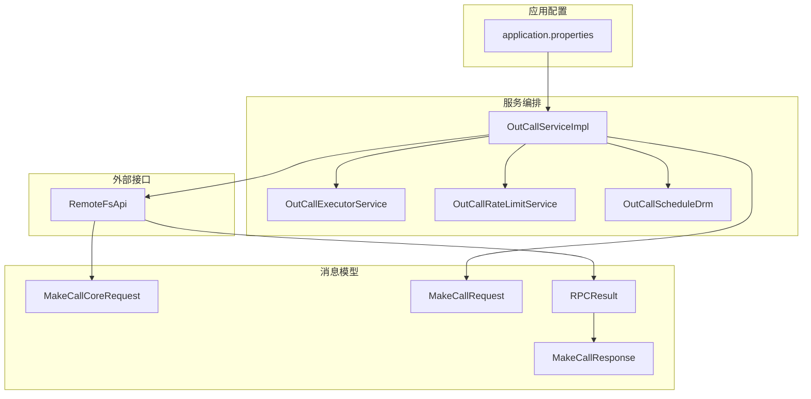
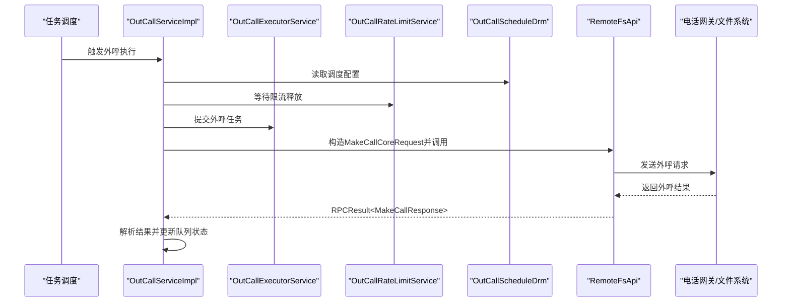
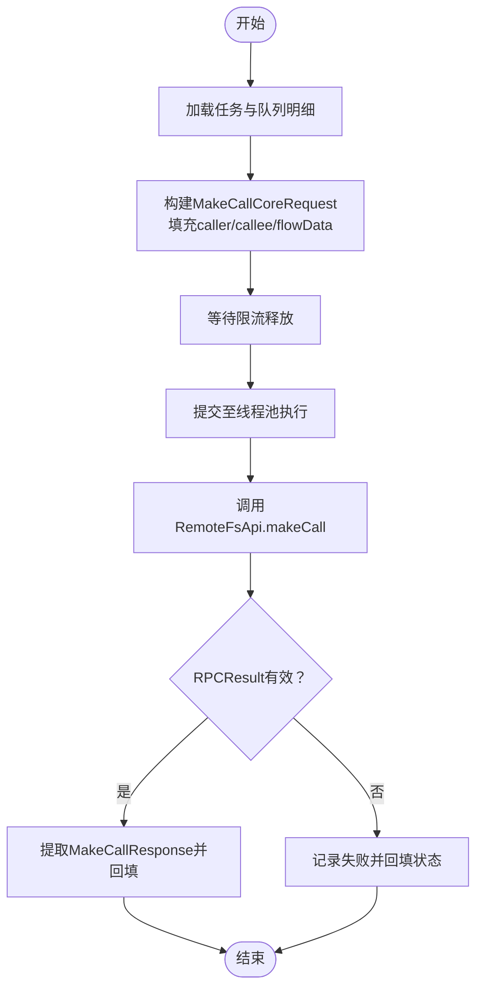
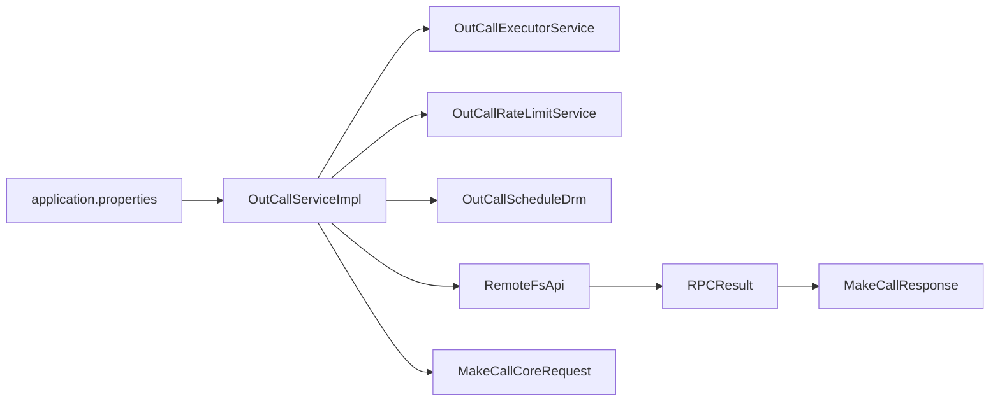

# 第三方系统集成

<cite>
**本文引用的文件**
- [RemoteFsApi.java](file://src/main/java/org/qianye/RemoteFsApi.java)
- [MakeCallCoreRequest.java](file://src/main/java/org/qianye/MakeCallCoreRequest.java)
- [MakeCallRequest.java](file://src/main/java/org/qianye/MakeCallRequest.java)
- [MakeCallResponse.java](file://src/main/java/org/qianye/MakeCallResponse.java)
- [RPCResult.java](file://src/main/java/org/qianye/RPCResult.java)
- [OutCallServiceImpl.java](file://src/main/java/org/qianye/OutCallServiceImpl.java)
- [OutCallExecutorService.java](file://src/main/java/org/qianye/OutCallExecutorService.java)
- [OutCallRateLimitService.java](file://src/main/java/org/qianye/OutCallRateLimitService.java)
- [OutCallScheduleDrm.java](file://src/main/java/org/qianye/OutCallScheduleDrm.java)
- [OutCallResult.java](file://src/main/java/org/qianye/OutCallResult.java)
- [application.properties](file://src/main/resources/application.properties)
</cite>

## 目录
1. [引言](#引言)
2. [项目结构](#项目结构)
3. [核心组件](#核心组件)
4. [架构总览](#架构总览)
5. [详细组件分析](#详细组件分析)
6. [依赖分析](#依赖分析)
7. [性能考量](#性能考量)
8. [故障排查指南](#故障排查指南)
9. [结论](#结论)
10. [附录](#附录)

## 引言
本文件面向需要对接 Outcall 系统的第三方系统（如电话网关、文件系统、外部 RPC 服务等），提供从接口设计、消息协议、集成流程到错误处理与性能优化的完整指南。重点覆盖以下方面：
- 与外部电话网关的集成：通过 RemoteFsApi 的 makeCall 接口发起外呼，并基于 OutCallServiceImpl 的调用链路完成参数转换、限流与状态回填。
- 文件系统与外部服务的集成：以 RemoteFsApi 为抽象入口，统一接入实际 RPC 或文件系统能力。
- 消息格式与协议规范：明确 MakeCallRequest、MakeCallCoreRequest、MakeCallResponse 及 RPCResult 的字段语义与使用约束。
- 数据转换、协议适配与错误处理：在 OutCallServiceImpl 中完成从队列明细到外呼请求的映射、异常捕获与重试策略。
- 集成测试与验证：给出可操作的测试步骤与验证清单。
- 安全与性能：结合线程池、限流与日志监控提出建议。

## 项目结构
Outcall 系统采用分层与职责分离的设计，核心围绕“任务调度—队列分组—异步外呼—结果回填”展开。第三方集成主要集中在 RemoteFsApi 与 OutCallServiceImpl 的协作路径上。

图表来源
- [OutCallServiceImpl.java](file://src/main/java/org/qianye/OutCallServiceImpl.java#L1-L1090)
- [OutCallExecutorService.java](file://src/main/java/org/qianye/OutCallExecutorService.java#L1-L211)
- [OutCallRateLimitService.java](file://src/main/java/org/qianye/OutCallRateLimitService.java#L1-L17)
- [OutCallScheduleDrm.java](file://src/main/java/org/qianye/OutCallScheduleDrm.java#L1-L113)
- [RemoteFsApi.java](file://src/main/java/org/qianye/RemoteFsApi.java#L1-L21)
- [MakeCallCoreRequest.java](file://src/main/java/org/qianye/MakeCallCoreRequest.java#L1-L13)
- [MakeCallRequest.java](file://src/main/java/org/qianye/MakeCallRequest.java#L1-L15)
- [MakeCallResponse.java](file://src/main/java/org/qianye/MakeCallResponse.java#L1-L10)
- [RPCResult.java](file://src/main/java/org/qianye/RPCResult.java#L1-L11)
- [application.properties](file://src/main/resources/application.properties#L1-L17)

章节来源
- [application.properties](file://src/main/resources/application.properties#L1-L17)
- [OutCallServiceImpl.java](file://src/main/java/org/qianye/OutCallServiceImpl.java#L1-L1090)
- [OutCallExecutorService.java](file://src/main/java/org/qianye/OutCallExecutorService.java#L1-L211)
- [OutCallRateLimitService.java](file://src/main/java/org/qianye/OutCallRateLimitService.java#L1-L17)
- [OutCallScheduleDrm.java](file://src/main/java/org/qianye/OutCallScheduleDrm.java#L1-L113)
- [RemoteFsApi.java](file://src/main/java/org/qianye/RemoteFsApi.java#L1-L21)
- [MakeCallCoreRequest.java](file://src/main/java/org/qianye/MakeCallCoreRequest.java#L1-L13)
- [MakeCallRequest.java](file://src/main/java/org/qianye/MakeCallRequest.java#L1-L15)
- [MakeCallResponse.java](file://src/main/java/org/qianye/MakeCallResponse.java#L1-L10)
- [RPCResult.java](file://src/main/java/org/qianye/RPCResult.java#L1-L11)

## 核心组件
- RemoteFsApi：对外呼请求的远程抽象，负责将 MakeCallCoreRequest 转换为 RPCResult<MakeCallResponse>。当前实现为占位，需接入真实 RPC 或文件系统。
- OutCallServiceImpl：外呼主流程编排，负责任务状态校验、队列分组、限流等待、线程池调度、调用 RemoteFsApi 并回填结果。
- OutCallExecutorService：集中管理多类线程池，包括队列组线程池、外呼线程池、重试线程池等，支撑高并发场景。
- OutCallRateLimitService：限流检查接口，当前为占位，需接入具体限流策略。
- OutCallScheduleDrm：调度与容量配置的集中入口，控制队列长度、轮询批次、等待超时、线程池规模等。
- 消息模型：MakeCallRequest（对外部 API 的请求）、MakeCallCoreRequest（内部 RPC 请求）、MakeCallResponse（外呼响应）、RPCResult（通用 RPC 包装）。

章节来源
- [RemoteFsApi.java](file://src/main/java/org/qianye/RemoteFsApi.java#L1-L21)
- [OutCallServiceImpl.java](file://src/main/java/org/qianye/OutCallServiceImpl.java#L1-L1090)
- [OutCallExecutorService.java](file://src/main/java/org/qianye/OutCallExecutorService.java#L1-L211)
- [OutCallRateLimitService.java](file://src/main/java/org/qianye/OutCallRateLimitService.java#L1-L17)
- [OutCallScheduleDrm.java](file://src/main/java/org/qianye/OutCallScheduleDrm.java#L1-L113)
- [MakeCallRequest.java](file://src/main/java/org/qianye/MakeCallRequest.java#L1-L15)
- [MakeCallCoreRequest.java](file://src/main/java/org/qianye/MakeCallCoreRequest.java#L1-L13)
- [MakeCallResponse.java](file://src/main/java/org/qianye/MakeCallResponse.java#L1-L10)
- [RPCResult.java](file://src/main/java/org/qianye/RPCResult.java#L1-L11)

## 架构总览
Outcall 的外呼链路由“任务扫描—队列分组—异步外呼—结果回填”构成，第三方系统通过 RemoteFsApi 与电话网关或文件系统交互。

图表来源
- [OutCallServiceImpl.java](file://src/main/java/org/qianye/OutCallServiceImpl.java#L1-L1090)
- [OutCallExecutorService.java](file://src/main/java/org/qianye/OutCallExecutorService.java#L1-L211)
- [OutCallRateLimitService.java](file://src/main/java/org/qianye/OutCallRateLimitService.java#L1-L17)
- [OutCallScheduleDrm.java](file://src/main/java/org/qianye/OutCallScheduleDrm.java#L1-L113)
- [RemoteFsApi.java](file://src/main/java/org/qianye/RemoteFsApi.java#L1-L21)

## 详细组件分析

### RemoteFsApi 文件系统接口设计与集成方法
- 设计定位：作为外呼请求的远程抽象，屏蔽底层电话网关或文件系统的差异，统一返回 RPCResult<MakeCallResponse>。
- 接口要点：
  - 输入：MakeCallCoreRequest（包含 caller、callee、flowData 等）
  - 输出：RPCResult<MakeCallResponse>（包含 code、data、message；data 为 MakeCallResponse）
  - 当前实现为占位，需替换为真实 RPC 调用或文件系统写入逻辑。
- 集成步骤（建议）：
  1) 在 OutCallServiceImpl 中将队列明细与任务信息映射为 MakeCallCoreRequest。
  2) 调用 RemoteFsApi.makeCall，解析 RPCResult 并提取 MakeCallResponse。
  3) 将响应中的 acid 等字段回填至队列明细状态扩展信息中。
  4) 若 RPCResult.code 非 200 或 data 为空，按 OutCallResult 失败路径处理并触发重试/降级。
- 错误处理：
  - RPCResult.code 非 200：视为调用失败，记录失败原因并更新队列为 WAITING 或 STOP。
  - data 为空：按未知错误处理，必要时触发重试计划。
  - 线程中断或超时：根据 OutCallServiceImpl 的限流等待逻辑进行降级处理。

章节来源
- [RemoteFsApi.java](file://src/main/java/org/qianye/RemoteFsApi.java#L1-L21)
- [RPCResult.java](file://src/main/java/org/qianye/RPCResult.java#L1-L11)
- [MakeCallCoreRequest.java](file://src/main/java/org/qianye/MakeCallCoreRequest.java#L1-L13)
- [MakeCallResponse.java](file://src/main/java/org/qianye/MakeCallResponse.java#L1-L10)
- [OutCallServiceImpl.java](file://src/main/java/org/qianye/OutCallServiceImpl.java#L965-L1090)

### MakeCallRequest 与 MakeCallCoreRequest 协议规范
- MakeCallRequest（对外 API 请求）：
  - 字段：callType、taskRecordCode、instanceId、callee、caller、callerDisplay、calleeDisplay
  - 用途：描述一次外呼的业务上下文与显示信息
- MakeCallCoreRequest（内部 RPC 请求）：
  - 字段：flowData（Map）、caller、callee
  - 用途：承载外呼的核心参数与流程数据
- 映射关系（建议）：
  - caller/callee 来源于任务与队列明细
  - flowData 由 OutCallServiceImpl 基于任务规则与队列属性组装
  - display 字段可由 MakeCallRequest 承载，但内部 RPC 通常仅保留 caller/callee

章节来源
- [MakeCallRequest.java](file://src/main/java/org/qianye/MakeCallRequest.java#L1-L15)
- [MakeCallCoreRequest.java](file://src/main/java/org/qianye/MakeCallCoreRequest.java#L1-L13)
- [OutCallServiceImpl.java](file://src/main/java/org/qianye/OutCallServiceImpl.java#L965-L1090)

### MakeCallResponse 与 RPCResult 消息格式
- RPCResult<T>：
  - 字段：code（默认 200）、data、message
  - 语义：统一承载 RPC 调用的返回码、业务数据与消息
- MakeCallResponse：
  - 字段：acid（会话标识）、flowLimit（是否限流）
  - 语义：外呼结果的关键标识与限流标记

章节来源
- [RPCResult.java](file://src/main/java/org/qianye/RPCResult.java#L1-L11)
- [MakeCallResponse.java](file://src/main/java/org/qianye/MakeCallResponse.java#L1-L10)

### 外呼调用链与数据转换流程

图表来源
- [OutCallServiceImpl.java](file://src/main/java/org/qianye/OutCallServiceImpl.java#L965-L1090)
- [RemoteFsApi.java](file://src/main/java/org/qianye/RemoteFsApi.java#L1-L21)
- [RPCResult.java](file://src/main/java/org/qianye/RPCResult.java#L1-L11)
- [MakeCallCoreRequest.java](file://src/main/java/org/qianye/MakeCallCoreRequest.java#L1-L13)

### 线程池与并发控制
- 线程池类型与用途：
  - queueGroupthreadPool：处理队列组维度的任务
  - retryThreadPool：处理异常重试
  - outCallThreadPool：通用外呼线程池
  - huabeiMakeCallThreadPool：针对大租户的专用外呼线程池
  - planTaskThreadPool：任务规划线程池
  - commonMakeCallThreadPool：通用外呼线程池（核心与最大线程数可调）
- 并发要点：
  - 使用 CountDownLatch 控制批量完成
  - 使用 RedisLock 对组级别加锁，避免重复执行
  - 超过队列阈值时将队列置为 WAITING 并记录原因

章节来源
- [OutCallExecutorService.java](file://src/main/java/org/qianye/OutCallExecutorService.java#L1-L211)
- [OutCallServiceImpl.java](file://src/main/java/org/qianye/OutCallServiceImpl.java#L668-L763)

### 限流与调度配置
- 限流等待：
  - waitForRateLimitRelease 支持带超时的限流等待，超时后按失败处理
- 调度参数：
  - getMakeCallMaxQueueSize、getPollFirstGroupSize、getRateLimitWaitingTimeSecond、getFlowLimitSleepMs 等
- 线程池规模：
  - 通过 OutCallScheduleDrm 动态调整核心/最大线程数与队列长度

章节来源
- [OutCallServiceImpl.java](file://src/main/java/org/qianye/OutCallServiceImpl.java#L597-L667)
- [OutCallScheduleDrm.java](file://src/main/java/org/qianye/OutCallScheduleDrm.java#L1-L113)

### 错误处理与重试策略
- 失败分类：
  - 状态无效、不在可呼时段、队列满、线程池满、限流、未知错误等
- 回填策略：
  - 将失败原因写入队列扩展信息（FAIL_REASON/STOP_REASON/RETRY_REASON）
  - 根据 OutCallResult 类型决定队列状态（WAITING/STOP）
- 重试与恢复：
  - 异常场景触发重试线程池，执行重规划与补偿

章节来源
- [OutCallResult.java](file://src/main/java/org/qianye/OutCallResult.java#L1-L50)
- [OutCallServiceImpl.java](file://src/main/java/org/qianye/OutCallServiceImpl.java#L926-L938)

## 依赖分析
- OutCallServiceImpl 依赖 OutCallExecutorService（线程池）、OutCallRateLimitService（限流）、OutCallScheduleDrm（配置）、RemoteFsApi（外呼）、OutCallResult（结果封装）。
- RemoteFsApi 依赖 RPCResult 与 MakeCallResponse，形成“请求—响应—包装”的闭环。
- application.properties 提供环境与数据库配置，间接影响任务扫描与持久化行为。

图表来源
- [OutCallServiceImpl.java](file://src/main/java/org/qianye/OutCallServiceImpl.java#L1-L1090)
- [OutCallExecutorService.java](file://src/main/java/org/qianye/OutCallExecutorService.java#L1-L211)
- [OutCallRateLimitService.java](file://src/main/java/org/qianye/OutCallRateLimitService.java#L1-L17)
- [OutCallScheduleDrm.java](file://src/main/java/org/qianye/OutCallScheduleDrm.java#L1-L113)
- [RemoteFsApi.java](file://src/main/java/org/qianye/RemoteFsApi.java#L1-L21)
- [RPCResult.java](file://src/main/java/org/qianye/RPCResult.java#L1-L11)
- [MakeCallCoreRequest.java](file://src/main/java/org/qianye/MakeCallCoreRequest.java#L1-L13)
- [application.properties](file://src/main/resources/application.properties#L1-L17)

章节来源
- [OutCallServiceImpl.java](file://src/main/java/org/qianye/OutCallServiceImpl.java#L1-L1090)
- [OutCallExecutorService.java](file://src/main/java/org/qianye/OutCallExecutorService.java#L1-L211)
- [OutCallRateLimitService.java](file://src/main/java/org/qianye/OutCallRateLimitService.java#L1-L17)
- [OutCallScheduleDrm.java](file://src/main/java/org/qianye/OutCallScheduleDrm.java#L1-L113)
- [RemoteFsApi.java](file://src/main/java/org/qianye/RemoteFsApi.java#L1-L21)
- [RPCResult.java](file://src/main/java/org/qianye/RPCResult.java#L1-L11)
- [MakeCallCoreRequest.java](file://src/main/java/org/qianye/MakeCallCoreRequest.java#L1-L13)
- [application.properties](file://src/main/resources/application.properties#L1-L17)

## 性能考量
- 线程池与队列：
  - 合理设置 OutCallScheduleDrm 的队列阈值与线程池规模，避免阻塞与丢弃
  - 使用 DiscardPolicy/CallerRunsPolicy 控制过载时的行为
- 限流与退避：
  - waitForRateLimitRelease 的等待时间与休眠间隔应与上游 SLA 匹配
- 监控与可观测性：
  - OutCallExecutorService 定期输出线程池状态日志，便于容量评估
- 大租户隔离：
  - huabeiMakeCallThreadPool 专用于大租户，降低相互干扰

章节来源
- [OutCallExecutorService.java](file://src/main/java/org/qianye/OutCallExecutorService.java#L1-L211)
- [OutCallScheduleDrm.java](file://src/main/java/org/qianye/OutCallScheduleDrm.java#L1-L113)
- [OutCallServiceImpl.java](file://src/main/java/org/qianye/OutCallServiceImpl.java#L597-L667)

## 故障排查指南
- 常见问题与定位：
  - 外呼未生效：检查任务状态与时间窗、队列状态、限流等待是否超时
  - 队列被置为 WAITING：检查队列满、线程池满、限流或超时
  - 队列被置为 STOP：检查不在可呼时段或异常重试达到上限
- 日志与指标：
  - 利用 OutCallServiceImpl 的日志输出定位阶段与耗时
  - 关注线程池队列长度与活动线程数
- 快速修复建议：
  - 临时放宽 OutCallScheduleDrm 的队列阈值与等待时间
  - 临时关闭限流或增大线程池规模进行压测验证

章节来源
- [OutCallResult.java](file://src/main/java/org/qianye/OutCallResult.java#L1-L50)
- [OutCallServiceImpl.java](file://src/main/java/org/qianye/OutCallServiceImpl.java#L668-L763)
- [OutCallExecutorService.java](file://src/main/java/org/qianye/OutCallExecutorService.java#L66-L137)

## 结论
通过 RemoteFsApi 抽象与 OutCallServiceImpl 的编排，Outcall 系统能够以统一的消息模型与线程池策略对接第三方电话网关或文件系统。集成时应重点关注：
- 参数映射与协议一致性（caller/callee/flowData）
- RPCResult 的解析与错误分支处理
- 限流与队列阈值的合理配置
- 并发与监控的协同保障

## 附录

### 集成测试方法与验证策略
- 单元测试（建议覆盖）：
  - RemoteFsApi.makeCall 的返回码与响应体解析
  - OutCallServiceImpl 中的参数映射与状态回填
  - 限流等待与队列阈值触发点
- 场景测试（建议覆盖）：
  - 正常外呼：验证 acid 回填与状态流转
  - 限流场景：验证 WAITING/STOP 与重试
  - 超时与异常：验证日志与补偿
- 性能测试（建议覆盖）：
  - 线程池饱和与队列积压下的吞吐与延迟
  - 大租户专用线程池的隔离效果

章节来源
- [RemoteFsApi.java](file://src/main/java/org/qianye/RemoteFsApi.java#L1-L21)
- [OutCallServiceImpl.java](file://src/main/java/org/qianye/OutCallServiceImpl.java#L965-L1090)
- [OutCallResult.java](file://src/main/java/org/qianye/OutCallResult.java#L1-L50)

### 安全考虑
- 认证与授权：确保 RemoteFsApi 的调用具备访问令牌与权限控制
- 数据脱敏：避免在日志中打印敏感字段（如完整号码）
- 防抖与幂等：利用 RedisLock 与队列状态避免重复外呼
- 配置安全：application.properties 中的数据库凭据与环境变量需妥善保护

章节来源
- [OutCallServiceImpl.java](file://src/main/java/org/qianye/OutCallServiceImpl.java#L678-L703)
- [application.properties](file://src/main/resources/application.properties#L1-L17)