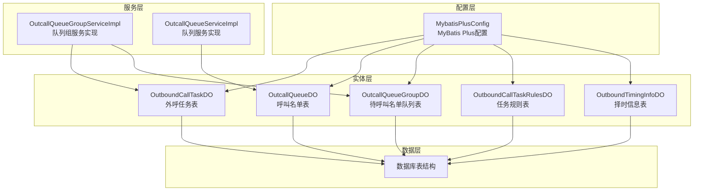
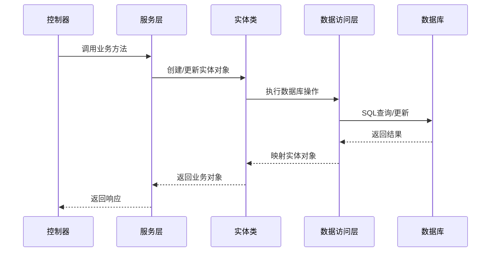
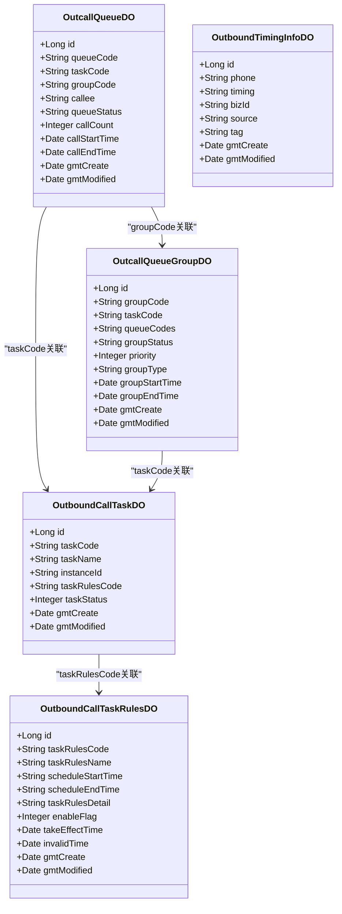
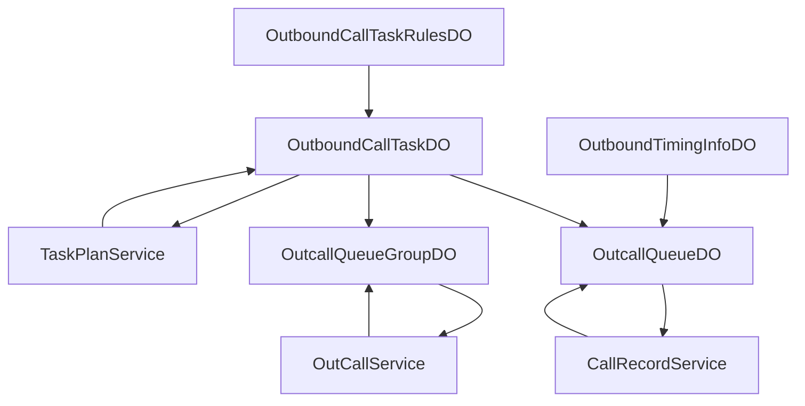

# 实体类关系设计

<cite>
**本文档引用的文件**
- [OutboundCallTaskDO.java](file://src/main/java/org/qianye/entity/OutboundCallTaskDO.java)
- [OutcallQueueDO.java](file://src/main/java/org/qianye/entity/OutcallQueueDO.java)
- [OutcallQueueGroupDO.java](file://src/main/java/org/qianye/entity/OutcallQueueGroupDO.java)
- [OutboundCallTaskRulesDO.java](file://src/main/java/org/qianye/entity/OutboundCallTaskRulesDO.java)
- [OutboundTimingInfoDO.java](file://src/main/java/org/qianye/entity/OutboundTimingInfoDO.java)
- [outcall.sql](file://src/main/resources/outcall.sql)
- [MybatisPlusConfig.java](file://src/main/java/org/qianye/config/MybatisPlusConfig.java)
- [OutcallQueueGroupServiceImpl.java](file://src/main/java/org/qianye/service/impl/OutcallQueueGroupServiceImpl.java)
- [OutcallQueueServiceImpl.java](file://src/main/java/org/qianye/service/impl/OutcallQueueServiceImpl.java)
</cite>

## 目录
1. [简介](#简介)
2. [项目结构](#项目结构)
3. [核心实体类](#核心实体类)
4. [架构概览](#架构概览)
5. [详细组件分析](#详细组件分析)
6. [依赖关系分析](#依赖关系分析)
7. [性能考虑](#性能考虑)
8. [故障排除指南](#故障排除指南)
9. [结论](#结论)

## 简介

Outcall 系统是一个智能外呼系统，通过实体类关系设计实现了外呼任务管理、队列调度和择时控制的核心功能。本文档详细分析了五个核心实体类的设计，包括属性定义、数据类型、注解配置以及它们之间的关联关系。

## 项目结构

Outcall 系统采用标准的 Spring Boot 项目结构，实体类位于 `entity` 包中，每个实体类对应一个数据库表：

**图表来源**
- [OutboundCallTaskDO.java](file://src/main/java/org/qianye/entity/OutboundCallTaskDO.java#L1-L96)
- [OutcallQueueDO.java](file://src/main/java/org/qianye/entity/OutcallQueueDO.java#L1-L105)
- [OutcallQueueGroupDO.java](file://src/main/java/org/qianye/entity/OutcallQueueGroupDO.java#L1-L95)
- [OutboundCallTaskRulesDO.java](file://src/main/java/org/qianye/entity/OutboundCallTaskRulesDO.java#L1-L82)
- [OutboundTimingInfoDO.java](file://src/main/java/org/qianye/entity/OutboundTimingInfoDO.java#L1-L65)

## 核心实体类

### 实体类设计原则

所有实体类遵循以下设计原则：
- 使用 Lombok 的 `@Data` 注解自动生成 getter、setter、toString 方法
- 使用 MyBatis Plus 注解进行数据库映射
- 采用统一的字段填充策略
- 使用驼峰命名转换规则

### 数据库表映射关系

基于数据库结构文件，实体类与数据库表的映射关系如下：

| 实体类 | 数据库表 | 主键策略 |
|--------|----------|----------|
| OutboundCallTaskDO | cc_outbound_call_task | AUTO_INCREMENT |
| OutcallQueueDO | cc_outcall_queue | AUTO_INCREMENT |
| OutcallQueueGroupDO | cc_outcall_queue_group | AUTO_INCREMENT |
| OutboundCallTaskRulesDO | cc_outbound_call_task_rules | AUTO_INCREMENT |
| OutboundTimingInfoDO | cc_outbound_timing_info | AUTO_INCREMENT |

**章节来源**
- [outcall.sql](file://src/main/resources/outcall.sql#L1-L218)
- [MybatisPlusConfig.java](file://src/main/java/org/qianye/config/MybatisPlusConfig.java#L1-L49)

## 架构概览

系统采用分层架构设计，实体类作为数据传输对象，通过 MyBatis Plus 进行持久化操作：

**图表来源**
- [OutcallQueueGroupServiceImpl.java](file://src/main/java/org/qianye/service/impl/OutcallQueueGroupServiceImpl.java#L1-L200)
- [OutcallQueueServiceImpl.java](file://src/main/java/org/qianye/service/impl/OutcallQueueServiceImpl.java#L1-L200)

## 详细组件分析

### OutboundCallTaskDO - 外呼任务表

#### 属性定义与数据类型

| 属性名 | 数据类型 | 注解配置 | 描述 |
|--------|----------|----------|------|
| id | Long | @TableId(type=IdType.AUTO) | 主键标识 |
| gmtCreate | Date | @TableField(fill=FieldFill.INSERT) | 创建时间 |
| gmtModified | Date | @TableField(fill=FieldFill.INSERT_UPDATE) | 修改时间 |
| taskCode | String | 无 | 任务编码 |
| taskName | String | 无 | 任务名称 |
| instanceId | String | 无 | 实例ID |
| taskRulesCode | String | 无 | 任务规则code |
| taskType | String | 无 | 任务类型 |
| transferCode | String | 无 | 实际执行对象 |
| taskStatus | Integer | 无 | 任务状态 |
| outboundCaller | String | 无 | 主叫号码 |
| taskTransferType | String | 无 | 转接类型 |
| envFlag | String | 无 | 环境标志 |
| extInfo | String | 无 | 扩展参数 |
| acquireStatus | String | 无 | 收单状态 |
| version | Long | @Version | 版本号 |

#### 关键特性

- 使用乐观锁机制，通过 `@Version` 注解实现并发控制
- 自动时间戳填充，通过 `@TableField(fill=...)` 实现
- 支持多种任务类型：预测外呼、预览外呼、IVR外呼

**章节来源**
- [OutboundCallTaskDO.java](file://src/main/java/org/qianye/entity/OutboundCallTaskDO.java#L1-L96)
- [outcall.sql](file://src/main/resources/outcall.sql#L169-L217)

### OutcallQueueDO - 呼叫名单表

#### 属性定义与数据类型

| 属性名 | 数据类型 | 注解配置 | 描述 |
|--------|----------|----------|------|
| id | Long | @TableId(type=IdType.AUTO) | 主键标识 |
| instanceId | String | 无 | 实例id |
| envId | String | 无 | 环境id |
| queueCode | String | 无 | 队列code |
| caller | String | 无 | 主叫 |
| callee | String | 无 | 被叫 |
| queueStatus | String | 无 | 呼叫状态 |
| taskCode | String | 无 | 关联的任务code |
| groupCode | String | 无 | 关联的分组code |
| acid | String | 无 | 通话id |
| callCount | Integer | 无 | 呼叫次数 |
| callStartTime | Date | 无 | 呼叫开始时间 |
| callEndTime | Date | 无 | 呼叫结束时间 |
| extInfo | String | 无 | 扩展信息 |
| creator | String | 无 | 创建者 |
| gmtCreate | Date | @TableField(fill=FieldFill.INSERT) | 创建时间 |
| modifier | String | 无 | 更新者 |
| gmtModified | Date | @TableField(fill=FieldFill.INSERT_UPDATE) | 修改时间 |

#### 状态管理

支持的呼叫状态包括：
- waiting: 等待中
- running: 执行中  
- success: 成功
- fail: 失败
- stop: 停止

**章节来源**
- [OutcallQueueDO.java](file://src/main/java/org/qianye/entity/OutcallQueueDO.java#L1-L105)
- [outcall.sql](file://src/main/resources/outcall.sql#L1-L51)

### OutcallQueueGroupDO - 待呼叫名单队列表

#### 属性定义与数据类型

| 属性名 | 数据类型 | 注解配置 | 描述 |
|--------|----------|----------|------|
| id | Long | @TableId(type=IdType.AUTO) | 主键标识 |
| instanceId | String | 无 | 实例id |
| envId | String | 无 | 环境标记 |
| groupCode | String | 无 | 组code |
| queueCodes | String | 无 | 队列codes |
| taskCode | String | 无 | 任务code |
| groupStatus | String | 无 | 状态 |
| groupStartTime | Date | 无 | 开始时间 |
| groupEndTime | Date | 无 | 结束时间 |
| priority | Integer | 无 | 优先级 |
| groupType | String | 无 | 组类型 |
| extInfo | String | 无 | 扩展信息 |
| creator | String | 无 | 创建者 |
| gmtCreate | Date | @TableField(fill=FieldFill.INSERT) | 创建时间 |
| modifier | String | 无 | 更新者 |
| gmtModified | Date | @TableField(fill=FieldFill.INSERT_UPDATE) | 修改时间 |

#### 组类型

支持的组类型：
- normal: 常规队列
- fixedTime: 择时队列

**章节来源**
- [OutcallQueueGroupDO.java](file://src/main/java/org/qianye/entity/OutcallQueueGroupDO.java#L1-L95)
- [outcall.sql](file://src/main/resources/outcall.sql#L53-L93)

### OutboundCallTaskRulesDO - 任务规则表

#### 属性定义与数据类型

| 属性名 | 数据类型 | 注解配置 | 描述 |
|--------|----------|----------|------|
| id | Long | @TableField(fill=FieldFill.INSERT) | 主键标识 |
| gmtCreate | Date | @TableField(fill=FieldFill.INSERT) | 创建时间 |
| gmtModified | Date | @TableField(fill=FieldFill.INSERT_UPDATE) | 修改时间 |
| instanceId | String | 无 | 实例ID |
| taskRulesCode | String | 无 | 任务规则编码 |
| taskRulesName | String | 无 | 规则名称 |
| scheduleStartTime | String | 无 | 定时任务执行时间区间 |
| scheduleEndTime | String | 无 | 定时任务执行区间 |
| taskRulesDetail | String | 无 | 任务执行时间范围 |
| enableFlag | Integer | 无 | 启用标志 |
| remarks | String | 无 | 备注 |
| takeEffectTime | Date | 无 | 生效时间 |
| invalidTime | Date | 无 | 失效时间 |
| envFlag | String | 无 | 环境标志 |

#### 规则管理

- 使用 `enableFlag` 字段控制规则启用状态
- 支持时间范围配置，通过 `taskRulesDetail` 存储序列化数据
- 支持规则的有效期管理

**章节来源**
- [OutboundCallTaskRulesDO.java](file://src/main/java/org/qianye/entity/OutboundCallTaskRulesDO.java#L1-L82)
- [outcall.sql](file://src/main/resources/outcall.sql#L123-L165)

### OutboundTimingInfoDO - 外呼择时信息

#### 属性定义与数据类型

| 属性名 | 数据类型 | 注解配置 | 描述 |
|--------|----------|----------|------|
| id | Long | @TableId(type=IdType.AUTO) | 唯一id |
| gmtModified | Date | @TableField(fill=FieldFill.INSERT_UPDATE) | 修改时间 |
| gmtCreate | Date | @TableField(fill=FieldFill.INSERT) | 创建时间 |
| phone | String | 无 | 手机号 |
| instanceId | String | 无 | 实例id |
| timing | String | 无 | 时间段 |
| bizId | String | 无 | 关联的来源业务id |
| source | String | 无 | 来源 |
| tag | String | 无 | 用户标签 |
| extInfo | String | 无 | 扩展参数 |

#### 择时控制

- 通过 `phone` 字段建立唯一约束
- 支持多标签管理，标签之间用逗号分隔
- 提供灵活的时间段配置

**章节来源**
- [OutboundTimingInfoDO.java](file://src/main/java/org/qianye/entity/OutboundTimingInfoDO.java#L1-L65)
- [outcall.sql](file://src/main/resources/outcall.sql#L95-L121)

## 依赖关系分析

### 实体类间的关系设计

**图表来源**
- [OutboundCallTaskDO.java](file://src/main/java/org/qianye/entity/OutboundCallTaskDO.java#L1-L96)
- [OutcallQueueDO.java](file://src/main/java/org/qianye/entity/OutcallQueueDO.java#L1-L105)
- [OutcallQueueGroupDO.java](file://src/main/java/org/qianye/entity/OutcallQueueGroupDO.java#L1-L95)
- [OutboundCallTaskRulesDO.java](file://src/main/java/org/qianye/entity/OutboundCallTaskRulesDO.java#L1-L82)
- [OutboundTimingInfoDO.java](file://src/main/java/org/qianye/entity/OutboundTimingInfoDO.java#L1-L65)

### 关联关系实现

#### 一对一关系
- OutboundCallTaskDO 与 OutboundCallTaskRulesDO：通过 `taskRulesCode` 字段关联
- OutboundTimingInfoDO：独立实体，无直接关联

#### 一对多关系
- OutboundCallTaskDO → OutcallQueueDO：一个任务对应多个队列记录
- OutboundCallTaskDO → OutcallQueueGroupDO：一个任务对应多个队列组

#### 多对多关系
- OutcallQueueGroupDO → OutcallQueueDO：通过 `queueCodes` 字段存储多个队列代码

### 数据流分析

**图表来源**
- [OutcallQueueGroupServiceImpl.java](file://src/main/java/org/qianye/service/impl/OutcallQueueGroupServiceImpl.java#L1-L200)
- [OutcallQueueServiceImpl.java](file://src/main/java/org/qianye/service/impl/OutcallQueueServiceImpl.java#L1-L200)

## 性能考虑

### 索引优化

根据数据库表结构，各表的关键索引设计：

#### cc_outcall_queue 表索引
- 唯一索引：`(instance_id, queue_code, env_id)`
- 复合索引：`(instance_id, task_code, gmt_modified)` - 时间任务索引
- 复合索引：`(task_code, instance_id, env_id, gmt_modified)` - 存储索引
- 复合索引：`(instance_id, task_code, env_id, queue_status, gmt_create)`
- 复合索引：`(instance_id, task_code, env_id, callee, gmt_create)`

#### cc_outcall_queue_group 表索引
- 唯一索引：`(instance_id, env_id, group_code)`
- 复合索引：`(instance_id, task_code, group_status, env_id, gmt_modified)`

#### cc_outbound_call_task_rules 表索引
- 复合索引：`(instance_id, task_rules_code)`
- 复合索引：`(instance_id, take_effect_time, invalid_time)`
- 单独索引：`(instance_id)`, `(env_flag)`, `(gmt_modified)`

### 缓存策略

系统采用多层缓存策略：
- Redis 锁机制防止重复执行
- 队列组运行时缓存
- 规则配置缓存

## 故障排除指南

### 常见问题及解决方案

#### 乐观锁冲突
**问题描述**：更新实体时出现版本号不匹配异常
**解决方案**：
- 检查实体类是否正确标注 `@Version` 注解
- 确保在更新操作中包含版本号字段
- 实现重试机制处理并发冲突

#### 数据库连接问题
**问题描述**：实体类映射失败或查询异常
**解决方案**：
- 检查 `@TableName` 注解是否与数据库表名一致
- 验证字段命名约定是否符合驼峰转换规则
- 确认 MyBatis Plus 配置正确加载

#### 索引性能问题
**问题描述**：查询操作性能不佳
**解决方案**：
- 分析 SQL 执行计划
- 确保查询条件使用了合适的索引
- 考虑添加复合索引优化常用查询模式

**章节来源**
- [MybatisPlusConfig.java](file://src/main/java/org/qianye/config/MybatisPlusConfig.java#L1-L49)

## 结论

Outcall 系统的实体类关系设计体现了良好的软件工程实践：

1. **清晰的层次结构**：实体类设计简洁明了，职责单一
2. **完善的注解配置**：充分利用 MyBatis Plus 注解实现自动化功能
3. **合理的关联设计**：通过外键关系实现数据一致性
4. **性能优化考虑**：合理的索引设计和缓存策略
5. **可扩展性**：模块化设计便于功能扩展和维护

该设计为智能外呼系统的稳定运行提供了坚实的数据基础，通过合理的实体关系设计和性能优化策略，能够有效支撑大规模的外呼业务场景。