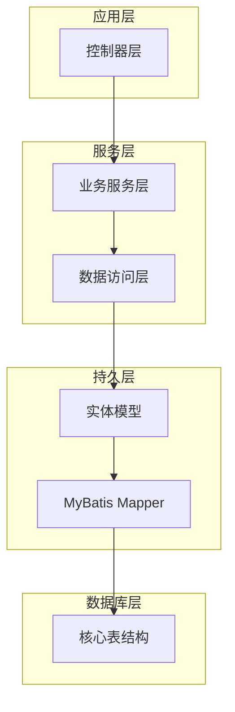
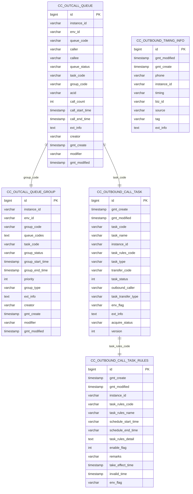
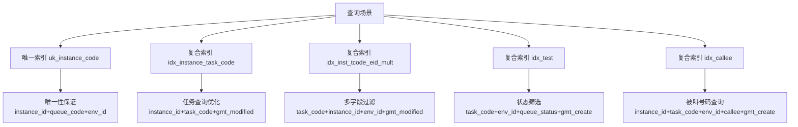
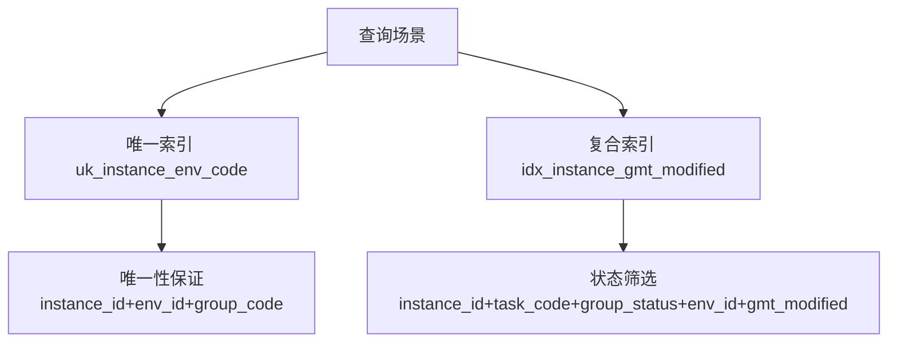
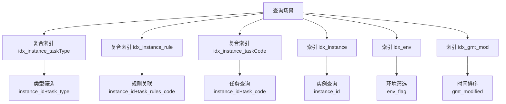
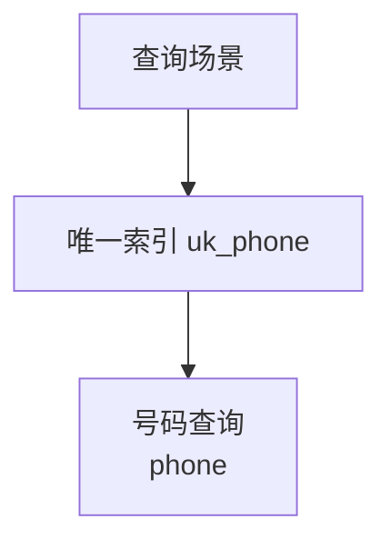
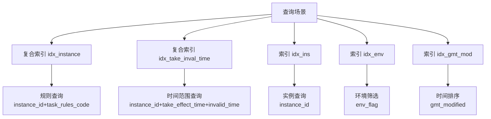
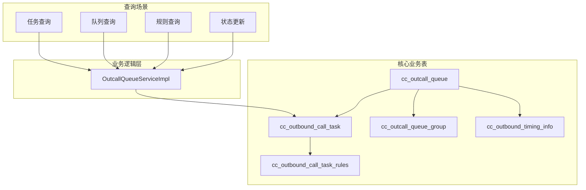
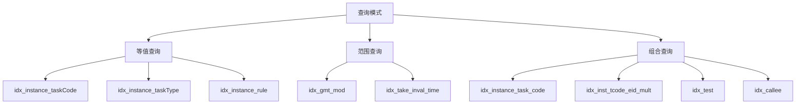

# 数据库表结构设计

<cite>
**本文档引用的文件**
- [schema.sql](file://src/main/resources/schema.sql)
- [outcall.sql](file://src/main/resources/outcall.sql)
- [OutcallQueueDO.java](file://src/main/java/org/qianye/entity/OutcallQueueDO.java)
- [OutcallQueueGroupDO.java](file://src/main/java/org/qianye/entity/OutcallQueueGroupDO.java)
- [OutboundCallTaskDO.java](file://src/main/java/org/qianye/entity/OutboundCallTaskDO.java)
- [OutboundTimingInfoDO.java](file://src/main/java/org/qianye/entity/OutboundTimingInfoDO.java)
- [OutboundCallTaskRulesDO.java](file://src/main/java/org/qianye/entity/OutboundCallTaskRulesDO.java)
- [OutcallQueueServiceImpl.java](file://src/main/java/org/qianye/service/impl/OutcallQueueServiceImpl.java)
- [QueueStatus.java](file://src/main/java/org/qianye/common/QueueStatus.java)
- [TaskStatusEnum.java](file://src/main/java/org/qianye/common/TaskStatusEnum.java)
</cite>

## 更新摘要
**变更内容**
- 更新以反映schema.sql的微小改进：添加了适当的换行终止符，改善文件处理一致性
- 保持原有的数据库表结构设计分析和性能优化策略不变
- 维护完整的OceanBase存储参数和索引策略说明

## 目录
1. [简介](#简介)
2. [项目结构](#项目结构)
3. [核心组件](#核心组件)
4. [架构概览](#架构概览)
5. [详细组件分析](#详细组件分析)
6. [依赖关系分析](#依赖关系分析)
7. [性能考虑](#性能考虑)
8. [故障排除指南](#故障排除指南)
9. [结论](#结论)

## 简介

Outcall 系统是一个智能外呼系统，负责管理外呼任务、队列和相关业务流程。该系统通过多个核心表实现完整的外呼生命周期管理，包括任务创建、队列管理、状态跟踪和性能监控等功能。

系统采用 OceanBase 数据库，使用 Organization Index 存储模式，具有高性能的分布式特性。所有表都采用了压缩和分区策略以优化存储和查询性能。

## 项目结构

Outcall 系统采用标准的三层架构设计，包含实体层、服务层和持久层：

**章节来源**
- [OutcallQueueDO.java](file://src/main/java/org/qianye/entity/OutcallQueueDO.java#L1-L87)
- [OutboundCallTaskDO.java](file://src/main/java/org/qianye/entity/OutboundCallTaskDO.java#L1-L80)
- [OutboundCallTaskRulesDO.java](file://src/main/java/org/qianye/entity/OutboundCallTaskRulesDO.java#L1-L68)

## 核心组件

Outcall 系统的核心由以下五个关键表组成：

### cc_outcall_queue - 呼叫名单表
存储具体的外呼任务明细，包含每个被叫号码的详细信息和呼叫状态。

### cc_outcall_queue_group - 待呼叫名单队列表  
管理外呼队列的分组信息，支持按任务和优先级进行组织。

### cc_outbound_call_task - 智能外呼任务表
定义外呼任务的基本信息、规则配置和执行状态。

### cc_outbound_timing_info - 外呼择时信息表
存储用户的可拨打时间段和相关限制信息。

### cc_outbound_call_task_rules - 智能外呼任务规则表
管理外呼任务的执行规则、时间窗口和环境配置。

**章节来源**
- [schema.sql](file://src/main/resources/schema.sql#L4-L96)
- [outcall.sql](file://src/main/resources/outcall.sql#L1-L218)

## 架构概览

**图表来源**
- [schema.sql](file://src/main/resources/schema.sql#L4-L96)
- [outcall.sql](file://src/main/resources/outcall.sql#L1-L218)

## 详细组件分析

### cc_outcall_queue 表结构分析

#### 字段定义与业务用途

| 字段名 | 数据类型 | 约束条件 | 业务含义 | 取值范围 |
|--------|----------|----------|----------|----------|
| id | bigint | PRIMARY KEY, AUTO_INCREMENT | 主键标识 | 自增整数 |
| instance_id | varchar(100) | NOT NULL | 实例ID | 系统实例标识符 |
| env_id | varchar(8) | NOT NULL | 环境标识 | pre/prod/sit |
| queue_code | varchar(100) | NOT NULL | 队列代码 | 唯一标识队列 |
| caller | varchar(100) | NULL | 主叫号码 | 电话号码格式 |
| callee | varchar(100) | NOT NULL | 被叫号码 | 电话号码格式 |
| queue_status | varchar(20) | DEFAULT 'waiting' | 呼叫状态 | waiting/running/success/fail/stop |
| task_code | varchar(100) | NOT NULL | 关联任务代码 | 外呼任务标识 |
| group_code | varchar(100) | NULL | 关联分组代码 | 队列分组标识 |
| acid | varchar(100) | NULL | 通话ID | 通话记录标识 |
| call_count | int | DEFAULT 0 | 呼叫次数 | 非负整数 |
| call_start_time | timestamp | NULL | 呼叫开始时间 | 日期时间戳 |
| call_end_time | timestamp | NULL | 呼叫结束时间 | 日期时间戳 |
| ext_info | text | NULL | 扩展信息 | JSON格式字符串 |
| creator | varchar(32) | NULL | 创建者 | 用户标识 |
| gmt_create | timestamp | NOT NULL, DEFAULT CURRENT_TIMESTAMP | 创建时间 | 系统时间戳 |
| modifier | varchar(32) | NULL | 更新者 | 用户标识 |
| gmt_modified | timestamp | NOT NULL, DEFAULT CURRENT_TIMESTAMP ON UPDATE CURRENT_TIMESTAMP | 修改时间 | 系统时间戳 |

#### 索引策略

**图表来源**
- [outcall.sql](file://src/main/resources/outcall.sql#L41-L49)

#### 设计特点

1. **主键设计**: 使用自增主键确保唯一性和有序性
2. **唯一约束**: uk_instance_code 确保同一实例下队列代码的唯一性
3. **状态管理**: 通过 queue_status 字段跟踪呼叫生命周期
4. **时间追踪**: 同时记录创建和修改时间，便于审计和统计

**章节来源**
- [outcall.sql](file://src/main/resources/outcall.sql#L1-L51)
- [OutcallQueueDO.java](file://src/main/java/org/qianye/entity/OutcallQueueDO.java#L1-L87)

### cc_outcall_queue_group 表结构分析

#### 字段定义与业务用途

| 字段名 | 数据类型 | 约束条件 | 业务含义 | 取值范围 |
|--------|----------|----------|----------|----------|
| id | bigint | PRIMARY KEY, AUTO_INCREMENT | 主键标识 | 自增整数 |
| instance_id | varchar(100) | NOT NULL | 实例ID | 系统实例标识符 |
| env_id | varchar(8) | NOT NULL | 环境标识 | pre/prod/sit |
| group_code | varchar(100) | NOT NULL | 分组代码 | 唯一标识分组 |
| queue_codes | mediumtext | NULL | 队列代码集合 | JSON数组格式 |
| task_code | varchar(100) | NOT NULL | 关联任务代码 | 外呼任务标识 |
| group_status | varchar(20) | DEFAULT 'waiting' | 分组状态 | waiting/processing/success/fail/stop |
| group_start_time | timestamp | NULL | 开始时间 | 日期时间戳 |
| group_end_time | timestamp | NULL | 结束时间 | 日期时间戳 |
| priority | int | DEFAULT 0 | 优先级 | 整数，数值越大优先级越高 |
| group_type | varchar(50) | NOT NULL, DEFAULT 'normal' | 分组类型 | normal/fixedTime |
| ext_info | text | NULL | 扩展信息 | JSON格式字符串 |
| creator | varchar(32) | NOT NULL | 创建者 | 用户标识 |
| gmt_create | timestamp | NOT NULL, DEFAULT CURRENT_TIMESTAMP | 创建时间 | 系统时间戳 |
| modifier | varchar(32) | NULL | 更新者 | 用户标识 |
| gmt_modified | timestamp | NOT NULL, DEFAULT CURRENT_TIMESTAMP ON UPDATE CURRENT_TIMESTAMP | 修改时间 | 系统时间戳 |

#### 索引策略

**图表来源**
- [outcall.sql](file://src/main/resources/outcall.sql#L89-L92)

#### 设计特点

1. **分组管理**: 支持将多个队列组织成逻辑分组
2. **优先级控制**: 通过 priority 字段实现任务调度优先级
3. **类型区分**: normal 和 fixedTime 类型支持不同的调度策略
4. **状态同步**: 与队列表的状态保持一致性和同步性

**章节来源**
- [outcall.sql](file://src/main/resources/outcall.sql#L53-L93)
- [OutcallQueueGroupDO.java](file://src/main/java/org/qianye/entity/OutcallQueueGroupDO.java#L1-L79)

### cc_outbound_call_task 表结构分析

#### 字段定义与业务用途

| 字段名 | 数据类型 | 约束条件 | 业务含义 | 取值范围 |
|--------|----------|----------|----------|----------|
| id | bigint | PRIMARY KEY, AUTO_INCREMENT | 主键标识 | 自增整数 |
| gmt_create | timestamp | NOT NULL, DEFAULT CURRENT_TIMESTAMP | 创建时间 | 系统时间戳 |
| gmt_modified | timestamp | NOT NULL, DEFAULT CURRENT_TIMESTAMP ON UPDATE CURRENT_TIMESTAMP | 修改时间 | 系统时间戳 |
| task_code | varchar(255) | NOT NULL | 任务代码 | 唯一标识任务 |
| task_name | varchar(255) | NULL | 任务名称 | 任务描述文本 |
| instance_id | varchar(255) | NOT NULL | 实例ID | 系统实例标识符 |
| task_rules_code | varchar(255) | NOT NULL | 任务规则代码 | 关联规则标识 |
| task_type | varchar(255) | NOT NULL | 任务类型 | AUTO_CALL/OUTBOUND_CALL/IVR_CALL |
| transfer_code | varchar(255) | NOT NULL | 转接代码 | 实际执行对象标识 |
| task_status | int | NOT NULL, DEFAULT 0 | 任务状态 | 0-启用，1-暂停，2-执行中，4-终止 |
| outbound_caller | varchar(255) | NOT NULL | 主叫号码 | 电话号码格式 |
| task_transfer_type | varchar(255) | NULL | 转接类型 | 转接方式描述 |
| env_flag | varchar(255) | NULL | 环境标志 | pre/prod/sit |
| ext_info | text | NULL | 扩展参数 | JSON格式字符串 |
| acquire_status | varchar(128) | NULL | 收单状态 | NOT_NEED/PENDING/COMPLETED |
| version | bigint | NOT NULL, DEFAULT 0 | 版本号 | 乐观锁机制 |

#### 索引策略

**图表来源**
- [outcall.sql](file://src/main/resources/outcall.sql#L205-L215)

#### 设计特点

1. **任务类型**: 支持预测外呼、预览外呼和IVR外呼三种模式
2. **状态管理**: 通过 task_status 字段跟踪任务生命周期
3. **版本控制**: 使用乐观锁防止并发更新冲突
4. **收单机制**: acquire_status 字段支持任务收单流程

**章节来源**
- [outcall.sql](file://src/main/resources/outcall.sql#L169-L217)
- [OutboundCallTaskDO.java](file://src/main/java/org/qianye/entity/OutboundCallTaskDO.java#L1-L80)

### cc_outbound_timing_info 表结构分析

#### 字段定义与业务用途

| 字段名 | 数据类型 | 约束条件 | 业务含义 | 取值范围 |
|--------|----------|----------|----------|----------|
| id | bigint | PRIMARY KEY, AUTO_INCREMENT | 唯一ID | 自增整数 |
| gmt_modified | timestamp | NOT NULL, DEFAULT CURRENT_TIMESTAMP ON UPDATE CURRENT_TIMESTAMP | 修改时间 | 系统时间戳 |
| gmt_create | timestamp | NOT NULL, DEFAULT CURRENT_TIMESTAMP | 创建时间 | 系统时间戳 |
| phone | varchar(32) | NOT NULL | 手机号码 | 电话号码格式 |
| instance_id | varchar(255) | NULL | 实例ID | 系统实例标识符 |
| timing | varchar(255) | NOT NULL | 时间段 | 时间范围描述 |
| biz_id | varchar(255) | NULL | 业务ID | 关联业务标识 |
| source | varchar(255) | NULL | 来源 | 平台或部门标识 |
| tag | varchar(255) | NULL | 用户标签 | 逗号分隔的标签列表 |
| ext_info | text | NULL | 扩展参数 | JSON格式字符串 |

#### 索引策略

**图表来源**
- [outcall.sql](file://src/main/resources/outcall.sql#L119)

#### 设计特点

1. **号码唯一**: 通过 uk_phone 索引确保号码的唯一性
2. **时间限制**: timing 字段定义可拨打的时间范围
3. **标签管理**: 支持多标签的用户画像管理
4. **业务关联**: 支持与不同业务系统的集成

**章节来源**
- [outcall.sql](file://src/main/resources/outcall.sql#L95-L121)
- [OutboundTimingInfoDO.java](file://src/main/java/org/qianye/entity/OutboundTimingInfoDO.java#L1-L55)

### cc_outbound_call_task_rules 表结构分析

#### 字段定义与业务用途

| 字段名 | 数据类型 | 约束条件 | 业务含义 | 取值范围 |
|--------|----------|----------|----------|----------|
| id | bigint | PRIMARY KEY, AUTO_INCREMENT | 主键标识 | 自增整数 |
| gmt_create | timestamp | NOT NULL, DEFAULT CURRENT_TIMESTAMP | 创建时间 | 系统时间戳 |
| gmt_modified | timestamp | NOT NULL, DEFAULT CURRENT_TIMESTAMP ON UPDATE CURRENT_TIMESTAMP | 修改时间 | 系统时间戳 |
| instance_id | varchar(255) | NOT NULL | 实例ID | 系统实例标识符 |
| task_rules_code | varchar(255) | NOT NULL | 任务规则代码 | 唯一标识规则 |
| task_rules_name | varchar(256) | NULL | 规则名称 | 规则描述文本 |
| schedule_start_time | varchar(255) | NULL | 定时开始时间 | 时间区间描述 |
| schedule_end_time | varchar(255) | NULL | 定时结束时间 | 时间区间描述 |
| task_rules_detail | text | NULL | 任务规则详情 | 序列化规则数据 |
| enable_flag | int | NOT NULL, DEFAULT 0 | 启用标志 | 0-启用，1-关闭 |
| remarks | varchar(255) | NULL | 备注 | 规则说明 |
| take_effect_time | timestamp | NULL | 生效时间 | 生效日期时间 |
| invalid_time | timestamp | NULL | 失效时间 | 失效日期时间 |
| env_flag | varchar(255) | NULL | 环境标志 | pre/prod/sit |

#### 索引策略

**图表来源**
- [outcall.sql](file://src/main/resources/outcall.sql#L155-L163)

#### 设计特点

1. **规则管理**: 支持复杂的外呼规则配置
2. **时间窗口**: 通过 take_effect_time 和 invalid_time 控制规则有效期
3. **启用控制**: enable_flag 字段支持规则的动态启停
4. **序列化存储**: task_rules_detail 支持灵活的规则定义

**章节来源**
- [outcall.sql](file://src/main/resources/outcall.sql#L123-L165)
- [OutboundCallTaskRulesDO.java](file://src/main/java/org/qianye/entity/OutboundCallTaskRulesDO.java#L1-L68)

## 依赖关系分析

**图表来源**
- [OutcallQueueServiceImpl.java](file://src/main/java/org/qianye/service/impl/OutcallQueueServiceImpl.java#L1-L200)

### 查询性能优化策略

基于服务层的查询模式，系统采用了以下优化策略：

1. **批量查询优化**: 对于大量队列查询，采用分批处理避免 SQL 过长
2. **状态筛选优化**: 利用队列表的状态字段进行快速筛选
3. **时间范围优化**: 通过 gmt_modified 字段实现高效的时间范围查询
4. **索引选择优化**: 根据查询模式选择最合适的索引组合

**章节来源**
- [OutcallQueueServiceImpl.java](file://src/main/java/org/qianye/service/impl/OutcallQueueServiceImpl.java#L82-L95)

## 性能考虑

### 存储参数优化

系统采用了 OceanBase 的高级存储特性：

1. **压缩设置**: 使用 zstd_1.3.8 压缩算法，提供高压缩比和快速解压
2. **副本数量**: 设置 REPLICA_NUM = 2，确保数据高可用性
3. **块大小**: BLOCK_SIZE = 16384，优化磁盘I/O性能
4. **表模式**: TABLE_MODE = 'EXTREME'，针对大数据量场景优化

### 索引优化策略

**图表来源**
- [outcall.sql](file://src/main/resources/outcall.sql#L43-L49)
- [outcall.sql](file://src/main/resources/outcall.sql#L155-L163)

### 文件处理一致性改进

**更新** 本次更新反映了schema.sql文件的微小改进：添加了适当的换行终止符，改善文件处理一致性。这一改进虽然不影响数据库结构和功能，但提升了脚本文件的标准化程度和跨平台兼容性。

该改进确保：
- 脚本文件在不同操作系统和编辑器中的一致性表现
- 避免因缺少换行符导致的文件处理问题
- 提升自动化部署和CI/CD流程的稳定性

### 查询性能分析

1. **高频查询优化**: 针对队列表的查询模式，系统提供了专门的复合索引
2. **状态管理优化**: 通过队列状态字段实现快速的状态筛选
3. **时间排序优化**: 利用 gmt_modified 字段支持高效的排序查询
4. **内存优化**: 采用 Organization Index 存储模式，减少内存占用

## 故障排除指南

### 常见问题及解决方案

#### 队列状态异常
- **问题**: 队列状态长时间停留在 PROCESSING
- **原因**: 通话记录未正确更新或系统异常
- **解决方案**: 检查 call_record_service 的调用状态，确认队列状态同步机制

#### 查询性能问题
- **问题**: 大量队列查询响应缓慢
- **原因**: 单次查询数据量过大
- **解决方案**: 使用分批查询策略，每批不超过 200 条记录

#### 并发更新冲突
- **问题**: 版本号冲突导致更新失败
- **原因**: 多个进程同时更新同一记录
- **解决方案**: 实现重试机制，使用乐观锁处理并发更新

**章节来源**
- [OutcallQueueServiceImpl.java](file://src/main/java/org/qianye/service/impl/OutcallQueueServiceImpl.java#L122-L152)
- [OutcallQueueServiceImpl.java](file://src/main/java/org/qianye/service/impl/OutcallQueueServiceImpl.java#L155-L200)

## 结论

Outcall 系统的数据库设计体现了以下核心特点：

1. **清晰的业务分层**: 通过五个核心表实现了外呼业务的完整生命周期管理
2. **高效的索引策略**: 针对高频查询场景设计了专门的复合索引
3. **强大的存储优化**: 采用 OceanBase 的高级特性确保高性能和高可用性
4. **完善的并发控制**: 通过版本号和缓存锁机制确保数据一致性
5. **灵活的规则管理**: 支持复杂的外呼规则配置和动态调整
6. **文件处理一致性**: 通过微小的schema.sql改进提升了脚本文件的标准化程度

该设计为大规模外呼业务提供了坚实的技术基础，能够满足高并发、低延迟的业务需求。最新的文件处理一致性改进进一步增强了系统的稳定性和可靠性。