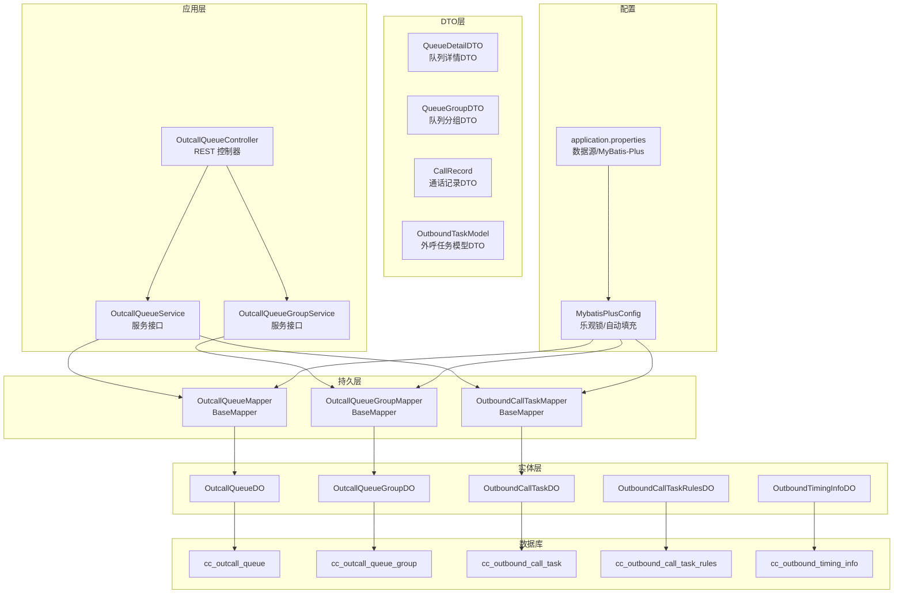
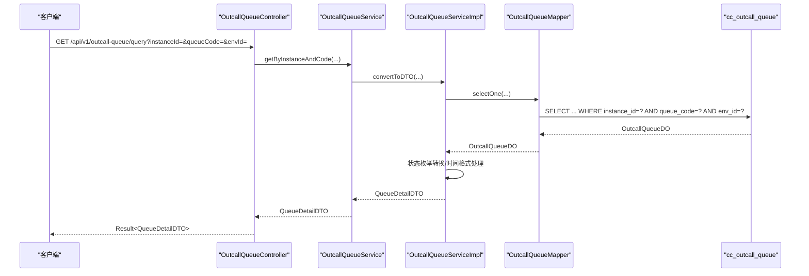
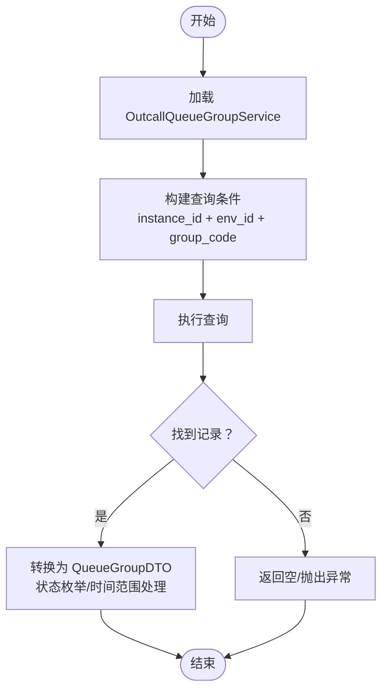
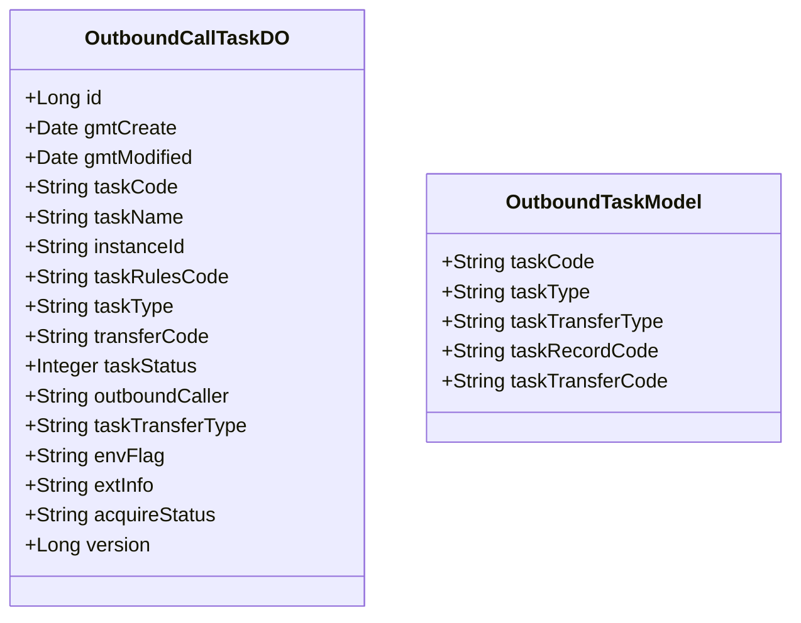
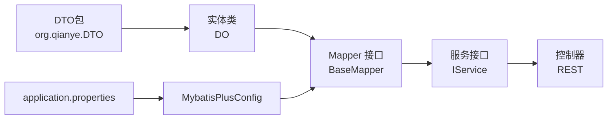

# 数据模型设计

<cite>
**本文引用的文件**
- [outcall.sql](file://src/main/resources/outcall.sql)
- [OutcallQueueDO.java](file://src/main/java/org/qianye/entity/OutcallQueueDO.java)
- [OutcallQueueGroupDO.java](file://src/main/java/org/qianye/entity/OutcallQueueGroupDO.java)
- [OutboundCallTaskDO.java](file://src/main/java/org/qianye/entity/OutboundCallTaskDO.java)
- [OutboundCallTaskRulesDO.java](file://src/main/java/org/qianye/entity/OutboundCallTaskRulesDO.java)
- [OutboundTimingInfoDO.java](file://src/main/java/org/qianye/entity/OutboundTimingInfoDO.java)
- [OutcallQueueMapper.java](file://src/main/java/org/qianye/mapper/OutcallQueueMapper.java)
- [OutcallQueueGroupMapper.java](file://src/main/java/org/qianye/mapper/OutcallQueueGroupMapper.java)
- [OutboundCallTaskMapper.java](file://src/main/java/org/qianye/mapper/OutboundCallTaskMapper.java)
- [MybatisPlusConfig.java](file://src/main/java/org/qianye/config/MybatisPlusConfig.java)
- [application.properties](file://src/main/resources/application.properties)
- [OutcallQueueController.java](file://src/main/java/org/qianye/controller/OutcallQueueController.java)
- [OutboundCallTaskService.java](file://src/main/java/org/qianye/service/OutboundCallTaskService.java)
- [OutcallQueueGroupService.java](file://src/main/java/org/qianye/service/OutcallQueueGroupService.java)
- [OutcallQueueService.java](file://src/main/java/org/qianye/service/OutcallQueueService.java)
- [OutcallQueueServiceImpl.java](file://src/main/java/org/qianye/service/impl/OutcallQueueServiceImpl.java)
- [CallRecord.java](file://src/main/java/org/qianye/DTO/CallRecord.java)
- [QueueDetailDTO.java](file://src/main/java/org/qianye/DTO/QueueDetailDTO.java)
- [QueueGroupDTO.java](file://src/main/java/org/qianye/DTO/QueueGroupDTO.java)
- [OutboundTaskModel.java](file://src/main/java/org/qianye/DTO/OutboundTaskModel.java)
- [QueryCallRecordRequest.java](file://src/main/java/org/qianye/DTO/QueryCallRecordRequest.java)
- [QueryCallRecordResponse.java](file://src/main/java/org/qianye/DTO/QueryCallRecordResponse.java)
- [MakeCallRequest.java](file://src/main/java/org/qianye/DTO/MakeCallRequest.java)
- [MakeCallResponse.java](file://src/main/java/org/qianye/DTO/MakeCallResponse.java)
- [Result.java](file://src/main/java/org/qianye/common/Result.java)
</cite>

## 更新摘要
**所做更改**
- 更新了DTO包结构说明，反映所有数据传输对象现位于org.qianye.DTO包中
- 新增了DTO类的详细说明，包括CallRecord、QueueDetailDTO、QueueGroupDTO等核心类
- 更新了数据访问模式章节，增加DTO在控制器和业务层的应用说明
- 完善了数据模型架构图，体现DTO与实体类的双向映射关系

## 目录
1. [简介](#简介)
2. [项目结构](#项目结构)
3. [核心组件](#核心组件)
4. [架构总览](#架构总览)
5. [详细组件分析](#详细组件分析)
6. [依赖分析](#依赖分析)
7. [性能考量](#性能考量)
8. [故障排查指南](#故障排查指南)
9. [结论](#结论)
10. [附录](#附录)

## 简介
本文件面向 Outcall 系统，系统性梳理数据库表结构与实体类映射关系，覆盖以下核心表：
- 呼叫名单表：cc_outcall_queue
- 队列分组表：cc_outcall_queue_group
- 外呼任务表：cc_outbound_call_task
- 外呼任务规则表：cc_outbound_call_task_rules
- 外呼择时信息表：cc_outbound_timing_info

**更新** 本版本特别关注DTO包结构重构后的数据传输对象设计，所有数据传输对象现位于org.qianye.DTO包中，包括CallRecord、QueueDetailDTO、QueueGroupDTO等核心类。

文档内容包括字段定义、数据类型、约束条件、主外键关系、索引策略与性能优化建议、数据访问模式、缓存策略、数据生命周期与保留策略、迁移与版本管理、以及数据安全与隐私要求。

## 项目结构
Outcall 使用 Spring Boot + MyBatis-Plus 架构，实体类通过注解映射到数据库表，Mapper 接口继承 BaseMapper，自动获得 CRUD 能力。全局配置启用乐观锁与自动填充。

**更新** DTO包结构现已重构，所有数据传输对象位于org.qianye.DTO包中，提供清晰的分层架构：



**图表来源**
- [OutcallQueueController.java](file://src/main/java/org/qianye/controller/OutcallQueueController.java#L1-L69)
- [OutcallQueueService.java](file://src/main/java/org/qianye/service/OutcallQueueService.java#L1-L58)
- [OutcallQueueGroupService.java](file://src/main/java/org/qianye/service/OutcallQueueGroupService.java#L1-L80)
- [OutcallQueueMapper.java](file://src/main/java/org/qianye/mapper/OutcallQueueMapper.java#L1-L10)
- [OutcallQueueGroupMapper.java](file://src/main/java/org/qianye/mapper/OutcallQueueGroupMapper.java#L1-L10)
- [OutboundCallTaskMapper.java](file://src/main/java/org/qianye/mapper/OutboundCallTaskMapper.java#L1-L10)
- [MybatisPlusConfig.java](file://src/main/java/org/qianye/config/MybatisPlusConfig.java#L1-L49)
- [application.properties](file://src/main/resources/application.properties#L1-L17)
- [outcall.sql](file://src/main/resources/outcall.sql#L1-L218)

**章节来源**
- [application.properties](file://src/main/resources/application.properties#L1-L17)
- [MybatisPlusConfig.java](file://src/main/java/org/qianye/config/MybatisPlusConfig.java#L1-L49)

## 核心组件
本节对核心表进行字段定义、约束与索引说明，并给出实体类映射关系。

**更新** 新增DTO层组件说明，展示数据传输对象的设计理念和使用场景。

- 呼叫名单表 cc_outcall_queue
  - 字段要点
    - 主键：id（自增）
    - 唯一索引：instance_id + queue_code + env_id
    - 复合索引：instance_id + task_code + gmt_modified；task_code + instance_id + env_id + gmt_modified（含存储列 queue_status）；instance_id + task_code + env_id + queue_status + gmt_create；instance_id + task_code + env_id + callee + gmt_create
    - 约束：非空字段包括 env_id、callee、task_code；默认值包括 queue_status='waiting'、call_count=0、创建/更新时间默认值
  - 实体映射：OutcallQueueDO，字段名遵循驼峰命名，自动填充 gmtCreate/gmtModified
  - DTO映射：QueueDetailDTO，提供队列详情的完整信息封装
  - 业务含义：记录一次外呼任务中的具体"名单条目"，包含主被叫、状态、计数、时间戳、扩展信息等

- 队列分组表 cc_outcall_queue_group
  - 字段要点
    - 主键：id（自增）
    - 唯一索引：instance_id + env_id + group_code
    - 复合索引：instance_id + task_code + group_status + env_id + gmt_modified
    - 约束：非空字段包括 env_id、group_code、task_code、creator；默认值包括 group_status='waiting'、priority=0
  - 实体映射：OutcallQueueGroupDO，包含优先级、分组类型、开始/结束时间、扩展信息等
  - DTO映射：QueueGroupDTO，提供队列分组的业务数据封装
  - 业务含义：将多个名单条目组织为"分组"，支持按优先级与状态调度

- 外呼任务表 cc_outbound_call_task
  - 字段要点
    - 主键：id（自增）
    - 复合索引：instance_id + task_type；instance_id + task_rules_code；instance_id + task_code；instance_id；env_flag；gmt_modified
    - 约束：非空字段包括 task_code、instance_id、task_rules_code、task_type、transfer_code、outboundCaller；状态枚举见实体注释；版本号用于乐观锁
  - 实体映射：OutboundCallTaskDO，包含任务类型、转接对象、状态、环境标志、版本号等
  - DTO映射：OutboundTaskModel，提供外呼任务的简化模型
  - 业务含义：定义一次外呼任务的元信息与执行策略

- 外呼任务规则表 cc_outbound_call_task_rules
  - 字段要点
    - 主键：id（自增）
    - 复合索引：instance_id + task_rules_code；instance_id + take_effect_time + invalid_time；instance_id；env_flag；gmt_modified
    - 约束：非空字段包括 instance_id、task_rules_code；启用标志、生效/失效时间
  - 实体映射：OutboundCallTaskRulesDO，包含规则名称、执行时间区间、规则详情、启用标志、生效/失效时间、环境标志
  - 业务含义：描述任务执行的时间窗口与规则集合

- 外呼择时信息表 cc_outbound_timing_info
  - 字段要点
    - 主键：id（自增）
    - 唯一索引：phone
    - 约束：非空字段包括 phone、timing；可选字段包括 instance_id、biz_id、source、tag、ext_info
  - 实体映射：OutboundTimingInfoDO，包含手机号、时间段、来源、标签、扩展信息
  - 业务含义：记录用户允许外呼的时间段，支撑择时外呼策略

**章节来源**
- [outcall.sql](file://src/main/resources/outcall.sql#L1-L218)
- [OutcallQueueDO.java](file://src/main/java/org/qianye/entity/OutcallQueueDO.java#L1-L105)
- [OutcallQueueGroupDO.java](file://src/main/java/org/qianye/entity/OutcallQueueGroupDO.java#L1-L95)
- [OutboundCallTaskDO.java](file://src/main/java/org/qianye/entity/OutboundCallTaskDO.java#L1-L96)
- [OutboundCallTaskRulesDO.java](file://src/main/java/org/qianye/entity/OutboundCallTaskRulesDO.java#L1-L82)
- [OutboundTimingInfoDO.java](file://src/main/java/org/qianye/entity/OutboundTimingInfoDO.java#L1-L65)
- [QueueDetailDTO.java](file://src/main/java/org/qianye/DTO/QueueDetailDTO.java#L1-L55)
- [QueueGroupDTO.java](file://src/main/java/org/qianye/DTO/QueueGroupDTO.java#L1-L42)
- [OutboundTaskModel.java](file://src/main/java/org/qianye/DTO/OutboundTaskModel.java#L1-L13)

## 架构总览
下图展示实体类与数据库表之间的映射关系及典型访问流程，新增DTO层的数据传输架构。

**更新** 架构图现在包含完整的DTO层，体现数据在不同层次间的传输和转换。

```mermaid
erDiagram
OUTCALL_QUEUE {
bigint id PK
varchar instance_id
varchar env_id
varchar queue_code
varchar caller
varchar callee
varchar queue_status
varchar task_code
varchar group_code
varchar acid
int call_count
timestamp call_start_time
timestamp call_end_time
text ext_info
varchar creator
timestamp gmt_create
varchar modifier
timestamp gmt_modified
}
OUTCALL_QUEUE_GROUP {
bigint id PK
varchar instance_id
varchar env_id
varchar group_code
text queue_codes
varchar task_code
varchar group_status
timestamp group_start_time
timestamp group_end_time
int priority
varchar group_type
text ext_info
varchar creator
timestamp gmt_create
varchar modifier
timestamp gmt_modified
}
OUTBOUND_CALL_TASK {
bigint id PK
timestamp gmt_create
timestamp gmt_modified
varchar task_code
varchar task_name
varchar instance_id
varchar task_rules_code
varchar task_type
varchar transfer_code
int task_status
varchar outbound_caller
varchar task_transfer_type
varchar env_flag
text ext_info
varchar acquire_status
bigint version
}
OUTBOUND_CALL_TASK_RULES {
bigint id PK
timestamp gmt_create
timestamp gmt_modified
varchar instance_id
varchar task_rules_code
varchar task_rules_name
varchar schedule_start_time
varchar schedule_end_time
text task_rules_detail
int enable_flag
varchar remarks
timestamp take_effect_time
timestamp invalid_time
varchar env_flag
}
OUTBOUND_TIMING_INFO {
bigint id PK
timestamp gmt_create
timestamp gmt_modified
varchar phone
varchar instance_id
varchar timing
varchar biz_id
varchar source
varchar tag
text ext_info
}
QUEUE_DETAIL_DTO {
string instanceId
string taskCode
string groupCode
string queueCode
string callee
string caller
string acid
int callCount
enum status
map extInfo
string fixedTime
date fixedStartTime
string envId
date gmtCreate
date gmtModified
date callStartTime
date callEndTime
enum lastQueueStatus
}
QUEUE_GROUP_DTO {
string instanceId
string taskCode
string queueGroupCode
enum groupStatus
list queueCodes
object callTimeRange
date startTime
date endTime
map extInfo
string envId
enum groupType
date groupStartTime
}
CALL_RECORD {
string acid
string caller
string callee
string taskCode
string queueCode
date startTime
date releaseTime
map flowData
}
OUTBOUND_TASK_MODEL {
string taskCode
string taskType
string taskTransferType
string taskRecordCode
string taskTransferCode
}
OUTCALL_QUEUE ||--o{ OUTCALL_QUEUE_GROUP : "分组包含多个名单"
OUTBOUND_CALL_TASK ||--o{ OUTCALL_QUEUE : "任务驱动名单"
OUTBOUND_CALL_TASK ||--|| OUTBOUND_CALL_TASK_RULES : "绑定规则"
OUTBOUND_TIMING_INFO ||--o{ OUTCALL_QUEUE : "择时期间约束"
DTO层与实体层转换关系：
QUEUE_DETAIL_DTO --> OUTCALL_QUEUE : "DO转DTO"
OUTCALL_QUEUE --> QUEUE_DETAIL_DTO : "DTO转DO"
```

**图表来源**
- [outcall.sql](file://src/main/resources/outcall.sql#L1-L218)
- [OutcallQueueDO.java](file://src/main/java/org/qianye/entity/OutcallQueueDO.java#L1-L105)
- [OutcallQueueGroupDO.java](file://src/main/java/org/qianye/entity/OutcallQueueGroupDO.java#L1-L95)
- [OutboundCallTaskDO.java](file://src/main/java/org/qianye/entity/OutboundCallTaskDO.java#L1-L96)
- [OutboundCallTaskRulesDO.java](file://src/main/java/org/qianye/entity/OutboundCallTaskRulesDO.java#L1-L82)
- [OutboundTimingInfoDO.java](file://src/main/java/org/qianye/entity/OutboundTimingInfoDO.java#L1-L65)
- [QueueDetailDTO.java](file://src/main/java/org/qianye/DTO/QueueDetailDTO.java#L1-L55)
- [QueueGroupDTO.java](file://src/main/java/org/qianye/DTO/QueueGroupDTO.java#L1-L42)
- [CallRecord.java](file://src/main/java/org/qianye/DTO/CallRecord.java#L1-L22)
- [OutboundTaskModel.java](file://src/main/java/org/qianye/DTO/OutboundTaskModel.java#L1-L13)

## 详细组件分析

### 呼叫名单表 cc_outcall_queue
- 字段与约束
  - 主键：id（自增）
  - 唯一索引：instance_id + queue_code + env_id
  - 复合索引：instance_id + task_code + gmt_modified；task_code + instance_id + env_id + gmt_modified（含存储列 queue_status）；instance_id + task_code + env_id + queue_status + gmt_create；instance_id + task_code + env_id + callee + gmt_create
  - 默认值：queue_status='waiting'；call_count=0；创建/更新时间默认值
- 实体映射
  - OutcallQueueDO：驼峰字段映射，自动填充 gmtCreate/gmtModified
- DTO映射
  - QueueDetailDTO：提供完整的队列详情信息，包含状态枚举转换、时间格式处理、扩展信息解析等功能
- 业务规则
  - queue_status 取值：waiting、running、success、fail、stop
  - 通过 task_code 与任务关联，通过 group_code 与分组关联
- 访问模式
  - 控制器提供按 instanceId+queueCode+envId 查询、分页查询、状态更新等接口
  - 服务层提供DO与DTO的双向转换，支持批量插入和状态更新
- 性能优化
  - 利用复合索引覆盖常见查询路径（instance_id + task_code + gmt_modified）
  - 使用存储列减少回表成本（如 idx_inst_tcode_eid_mult 存储 queue_status）
  - DTO层提供状态枚举转换，避免重复解析



**图表来源**
- [OutcallQueueController.java](file://src/main/java/org/qianye/controller/OutcallQueueController.java#L44-L48)
- [OutcallQueueService.java](file://src/main/java/org/qianye/service/OutcallQueueService.java#L47-L47)
- [OutcallQueueServiceImpl.java](file://src/main/java/org/qianye/service/impl/OutcallQueueServiceImpl.java#L430-L477)
- [OutcallQueueMapper.java](file://src/main/java/org/qianye/mapper/OutcallQueueMapper.java#L1-L10)
- [outcall.sql](file://src/main/resources/outcall.sql#L1-L51)

**章节来源**
- [outcall.sql](file://src/main/resources/outcall.sql#L1-L51)
- [OutcallQueueDO.java](file://src/main/java/org/qianye/entity/OutcallQueueDO.java#L1-L105)
- [QueueDetailDTO.java](file://src/main/java/org/qianye/DTO/QueueDetailDTO.java#L1-L55)
- [OutcallQueueController.java](file://src/main/java/org/qianye/controller/OutcallQueueController.java#L1-L69)
- [OutcallQueueServiceImpl.java](file://src/main/java/org/qianye/service/impl/OutcallQueueServiceImpl.java#L430-L509)

### 队列分组表 cc_outcall_queue_group
- 字段与约束
  - 主键：id（自增）
  - 唯一索引：instance_id + env_id + group_code
  - 复合索引：instance_id + task_code + group_status + env_id + gmt_modified
  - 默认值：group_status='waiting'；priority=0
- 实体映射
  - OutcallQueueGroupDO：包含优先级、分组类型、开始/结束时间、扩展信息
- DTO映射
  - QueueGroupDTO：提供队列分组的完整业务数据封装，包含分组状态枚举、时间范围、扩展信息等
- 业务规则
  - group_type：normal（常规队列）、fixedTime（择时队列）
  - 通过 task_code 关联任务，通过 group_code 唯一标识分组
- 访问模式
  - 提供按 instanceId+groupCode 查询、分页查询、状态更新、插入/批量插入等方法
  - 支持固定时间组的特殊处理逻辑



**图表来源**
- [OutcallQueueGroupService.java](file://src/main/java/org/qianye/service/OutcallQueueGroupService.java#L36-L40)
- [outcall.sql](file://src/main/resources/outcall.sql#L53-L93)

**章节来源**
- [outcall.sql](file://src/main/resources/outcall.sql#L53-L93)
- [OutcallQueueGroupDO.java](file://src/main/java/org/qianye/entity/OutcallQueueGroupDO.java#L1-L95)
- [QueueGroupDTO.java](file://src/main/java/org/qianye/DTO/QueueGroupDTO.java#L1-L42)
- [OutcallQueueGroupService.java](file://src/main/java/org/qianye/service/OutcallQueueGroupService.java#L1-L80)

### 外呼任务表 cc_outbound_call_task
- 字段与约束
  - 主键：id（自增）
  - 复合索引：instance_id + task_type；instance_id + task_rules_code；instance_id + task_code；instance_id；env_flag；gmt_modified
  - 版本号：version（配合乐观锁）
- 实体映射
  - OutboundCallTaskDO：包含任务类型、转接对象、状态、环境标志、版本号
- DTO映射
  - OutboundTaskModel：提供外呼任务的简化模型，便于跨模块传递
- 业务规则
  - task_status：0-启用、1-暂停、2-执行中、4-终止
  - 通过 task_rules_code 关联规则，通过 transfer_code 指向实际执行对象（坐席/技能组/IVR）



**图表来源**
- [OutboundCallTaskDO.java](file://src/main/java/org/qianye/entity/OutboundCallTaskDO.java#L1-L96)
- [OutboundTaskModel.java](file://src/main/java/org/qianye/DTO/OutboundTaskModel.java#L1-L13)

**章节来源**
- [outcall.sql](file://src/main/resources/outcall.sql#L169-L217)
- [OutboundCallTaskDO.java](file://src/main/java/org/qianye/entity/OutboundCallTaskDO.java#L1-L96)
- [OutboundTaskModel.java](file://src/main/java/org/qianye/DTO/OutboundTaskModel.java#L1-L13)
- [OutboundCallTaskService.java](file://src/main/java/org/qianye/service/OutboundCallTaskService.java#L1-L40)

### 外呼任务规则表 cc_outbound_call_task_rules
- 字段与约束
  - 主键：id（自增）
  - 复合索引：instance_id + task_rules_code；instance_id + take_effect_time + invalid_time；instance_id；env_flag；gmt_modified
- 实体映射
  - OutboundCallTaskRulesDO：包含规则名称、执行时间区间、规则详情、启用标志、生效/失效时间、环境标志
- 业务规则
  - enable_flag：0-启用、1-关闭
  - take_effect_time/invalid_time：规则生效/失效时间窗口

**章节来源**
- [outcall.sql](file://src/main/resources/outcall.sql#L123-L165)
- [OutboundCallTaskRulesDO.java](file://src/main/java/org/qianye/entity/OutboundCallTaskRulesDO.java#L1-L82)

### 外呼择时信息表 cc_outbound_timing_info
- 字段与约束
  - 主键：id（自增）
  - 唯一索引：phone
- 实体映射
  - OutboundTimingInfoDO：包含手机号、时间段、来源、标签、扩展信息
- 业务规则
  - 以 phone 作为唯一约束，用于限制外呼时间段

**章节来源**
- [outcall.sql](file://src/main/resources/outcall.sql#L95-L121)
- [OutboundTimingInfoDO.java](file://src/main/java/org/qianye/entity/OutboundTimingInfoDO.java#L1-L65)

### DTO数据传输对象
**新增** 详细介绍DTO层的数据传输对象设计。

- CallRecord 通话记录DTO
  - 字段：acid、caller、callee、taskCode、queueCode、startTime、releaseTime、flowData
  - 用途：封装通话过程中的关键信息，便于跨模块传递和处理
  - 特点：使用Map存储动态扩展数据，支持灵活的数据结构

- QueueDetailDTO 队列详情DTO
  - 字段：instanceId、taskCode、groupCode、queueCode、callee、caller、acid、callCount、status、extInfo、fixedTime、fixedStartTime、envId、gmtCreate、gmtModified、callStartTime、callEndTime、lastQueueStatus
  - 用途：提供队列详情的完整信息封装，支持状态枚举转换和时间格式处理
  - 特点：包含固定时间相关字段，支持择时外呼场景

- QueueGroupDTO 队列分组DTO
  - 字段：instanceId、taskCode、queueGroupCode、groupStatus、queueCodes、callTimeRange、startTime、endTime、extInfo、envId、groupType、groupStartTime
  - 用途：封装队列分组的业务数据，支持分组状态管理和时间范围控制
  - 特点：包含CallTimeRange对象，支持复杂的呼叫时间管理

- OutboundTaskModel 外呼任务模型DTO
  - 字段：taskCode、taskType、taskTransferType、taskRecordCode、taskTransferCode
  - 用途：提供外呼任务的简化模型，便于跨模块传递
  - 特点：字段精简，适合轻量级数据传输

- QueryCallRecordRequest/Response 查询通话记录DTO
  - QueryCallRecordRequest：包含查询条件（instanceId、acid、callee）
  - QueryCallRecordResponse：包含CallRecord列表的结果封装
  - 用途：支持通话记录的查询和响应处理

- MakeCallRequest/Response 外呼请求响应DTO
  - MakeCallRequest：包含外呼参数（callType、taskRecordCode、instanceId、callee、caller、callerDisplay、calleeDisplay）
  - MakeCallResponse：包含外呼结果（acid、flowLimit、callee、caller、queueCode、instanceId、taskCode、params）
  - 用途：封装外呼请求和响应的数据结构

**章节来源**
- [CallRecord.java](file://src/main/java/org/qianye/DTO/CallRecord.java#L1-L22)
- [QueueDetailDTO.java](file://src/main/java/org/qianye/DTO/QueueDetailDTO.java#L1-L55)
- [QueueGroupDTO.java](file://src/main/java/org/qianye/DTO/QueueGroupDTO.java#L1-L42)
- [OutboundTaskModel.java](file://src/main/java/org/qianye/DTO/OutboundTaskModel.java#L1-L13)
- [QueryCallRecordRequest.java](file://src/main/java/org/qianye/DTO/QueryCallRecordRequest.java#L1-L14)
- [QueryCallRecordResponse.java](file://src/main/java/org/qianye/DTO/QueryCallRecordResponse.java#L1-L14)
- [MakeCallRequest.java](file://src/main/java/org/qianye/DTO/MakeCallRequest.java#L1-L15)
- [MakeCallResponse.java](file://src/main/java/org/qianye/DTO/MakeCallResponse.java#L1-L18)

## 依赖分析
- ORM 映射
  - 实体类通过 @TableName 注解映射到对应表
  - Mapper 接口继承 BaseMapper，自动获得通用 CRUD 能力
- DTO包结构
  - 所有数据传输对象位于org.qianye.DTO包中，提供清晰的分层架构
  - DTO类使用Lombok注解简化代码，提供数据封装和转换功能
- 全局配置
  - MybatisPlusConfig 启用乐观锁拦截器与自动填充（gmtCreate/gmtModified）
  - application.properties 配置数据源与 MyBatis-Plus 全局设置
- 控制器与服务
  - 控制器通过服务层访问数据，服务层基于 MyBatis-Plus 进行查询与更新
  - DTO在控制器、服务层和持久层之间进行数据传输和转换

**更新** 依赖分析现在包含DTO层的详细说明，体现新的包结构和数据传输模式。



**图表来源**
- [CallRecord.java](file://src/main/java/org/qianye/DTO/CallRecord.java#L1-L22)
- [QueueDetailDTO.java](file://src/main/java/org/qianye/DTO/QueueDetailDTO.java#L1-L55)
- [OutcallQueueDO.java](file://src/main/java/org/qianye/entity/OutcallQueueDO.java#L1-L105)
- [OutcallQueueMapper.java](file://src/main/java/org/qianye/mapper/OutcallQueueMapper.java#L1-L10)
- [OutboundCallTaskService.java](file://src/main/java/org/qianye/service/OutboundCallTaskService.java#L1-L40)
- [OutcallQueueController.java](file://src/main/java/org/qianye/controller/OutcallQueueController.java#L1-L69)
- [MybatisPlusConfig.java](file://src/main/java/org/qianye/config/MybatisPlusConfig.java#L1-L49)
- [application.properties](file://src/main/resources/application.properties#L1-L17)

**章节来源**
- [MybatisPlusConfig.java](file://src/main/java/org/qianye/config/MybatisPlusConfig.java#L1-L49)
- [application.properties](file://src/main/resources/application.properties#L1-L17)

## 性能考量
- 索引策略
  - cc_outcall_queue：利用多维复合索引覆盖常见查询（instance_id + task_code + gmt_modified、task_code + instance_id + env_id + gmt_modified（含存储列）等），减少全表扫描
  - cc_outcall_queue_group：按任务与状态组合建立索引，支持高效分页与筛选
  - cc_outbound_call_task：按 instance_id + task_type、instance_id + task_code 等维度建立索引，提升任务查询效率
- 读写分离与副本
  - 表定义包含副本数量与表大小配置，适合在分布式环境下部署
- 乐观锁
  - 通过版本号字段与乐观锁拦截器实现并发更新保护，避免ABA问题
- 自动填充
  - gmtCreate/gmtModified 在插入/更新时自动填充，降低业务代码复杂度
- DTO转换优化
  - 服务层提供高效的DO到DTO转换方法，支持批量处理和状态枚举转换
  - DTO类使用Lombok注解，减少样板代码，提高开发效率

**更新** 性能考量现在包含DTO转换的优化策略，体现新的数据传输架构优势。

**章节来源**
- [outcall.sql](file://src/main/resources/outcall.sql#L1-L218)
- [MybatisPlusConfig.java](file://src/main/java/org/qianye/config/MybatisPlusConfig.java#L1-L49)
- [OutboundCallTaskDO.java](file://src/main/java/org/qianye/entity/OutboundCallTaskDO.java#L93-L94)
- [OutcallQueueServiceImpl.java](file://src/main/java/org/qianye/service/impl/OutcallQueueServiceImpl.java#L430-L477)

## 故障排查指南
- 常见问题定位
  - 唯一约束冲突：检查 instance_id + queue_code + env_id 或 instance_id + env_id + group_code 的重复
  - 查询性能差：确认 SQL 是否命中复合索引；必要时使用 EXPLAIN 分析执行计划
  - 并发更新失败：乐观锁版本号不匹配，需重试或检查业务逻辑
  - DTO转换异常：检查状态枚举值的有效性和扩展信息的JSON格式
- 日志与配置
  - MyBatis-Plus 日志输出已开启标准输出，便于调试 SQL
  - 控制器层返回 Result 包装，便于统一错误处理
  - DTO层提供详细的日志记录，便于追踪数据转换过程

**更新** 故障排查指南现在包含DTO相关的常见问题和解决方案。

**章节来源**
- [application.properties](file://src/main/resources/application.properties#L14-L15)
- [OutcallQueueController.java](file://src/main/java/org/qianye/controller/OutcallQueueController.java#L1-L69)
- [OutcallQueueServiceImpl.java](file://src/main/java/org/qianye/service/impl/OutcallQueueServiceImpl.java#L452-L457)

## 结论
本数据模型围绕"任务—分组—名单"三层结构设计，结合复合索引与乐观锁机制，满足高并发场景下的查询与更新需求。通过 MyBatis-Plus 的自动填充与全局拦截器，进一步简化了开发与维护成本。

**更新** 新的DTO包结构重构提供了更清晰的分层架构，所有数据传输对象位于org.qianye.DTO包中，增强了系统的可维护性和扩展性。通过DTO层的数据封装和转换，系统实现了更好的数据传输效率和类型安全性。

后续可在数据量增长后评估分区、归档与冷热分离策略，同时可以考虑在DTO层增加更多的数据验证和转换逻辑，进一步提升系统的健壮性。

## 附录

### 数据访问模式与缓存策略
- 访问模式
  - 控制器 → 服务 → Mapper → 数据库
  - 常见操作：按 instanceId+code 查询、分页查询、状态更新、批量插入
  - DTO转换：服务层负责DO与DTO的双向转换，支持批量处理
- 缓存策略建议
  - 对高频只读配置（如任务规则）可引入本地缓存或分布式缓存，结合失效时间与变更事件刷新
  - 对热点名单状态与分组状态可做短期缓存，注意与数据库版本号/时间戳保持一致性
  - DTO实例可进行轻量级缓存，减少重复的对象创建开销

**更新** 数据访问模式现在包含DTO层的详细说明，体现新的数据传输架构。

**章节来源**
- [OutcallQueueController.java](file://src/main/java/org/qianye/controller/OutcallQueueController.java#L1-L69)
- [OutcallQueueGroupService.java](file://src/main/java/org/qianye/service/OutcallQueueGroupService.java#L1-L80)
- [OutboundCallTaskService.java](file://src/main/java/org/qianye/service/OutboundCallTaskService.java#L1-L40)
- [OutcallQueueService.java](file://src/main/java/org/qianye/service/OutcallQueueService.java#L1-L58)

### 数据生命周期、保留策略与归档规则
- 建议策略
  - 名单状态历史：成功/失败/停止后可定期归档至历史表，保留周期依据合规要求设定
  - 任务与规则：长期保留关键元数据与审计日志，定期清理无效或过期数据
  - 择时信息：按手机号维度定期清理过期或用户取消授权的数据
  - DTO数据：临时性DTO对象随请求生命周期管理，无需长期保存
- 归档与清理
  - 建议按月/季度进行归档，保留最近 N 个周期的明细，其余迁移至归档库

**更新** 数据生命周期现在包含DTO层的管理策略。

[本节为通用实践建议，不直接分析具体文件]

### 数据迁移路径与版本管理
- 迁移路径
  - 新增字段：先加列并补全默认值，再上线读写兼容逻辑，最后删除旧字段（如需要）
  - 删除字段：先兼容读取，再清理旧值，最后删除列
  - 索引变更：评估影响范围，选择低峰时段执行
  - DTO包迁移：通过IDE重构工具批量更新包路径，确保编译正确性
- 版本管理
  - 通过数据库版本号与应用版本协同管理，确保迁移脚本幂等
  - DTO类的变更遵循向后兼容原则，避免破坏现有接口

**更新** 数据迁移路径现在包含DTO包结构变更的处理方案。

[本节为通用实践建议，不直接分析具体文件]

### 数据安全、隐私要求与访问控制
- 数据安全
  - 最小权限原则：数据库账号仅授予必要权限
  - 加密传输：生产环境使用 SSL/TLS
  - DTO数据脱敏：对敏感字段（如电话号码）在DTO层进行脱敏处理
- 隐私保护
  - 对手机号等敏感字段进行脱敏显示与最小化采集
  - DTO层提供隐私字段的访问控制机制
- 访问控制
  - 控制器层统一鉴权与参数校验，防止越权访问
  - DTO层提供数据验证和过滤机制

**更新** 数据安全现在包含DTO层的隐私保护和访问控制策略。

[本节为通用实践建议，不直接分析具体文件]