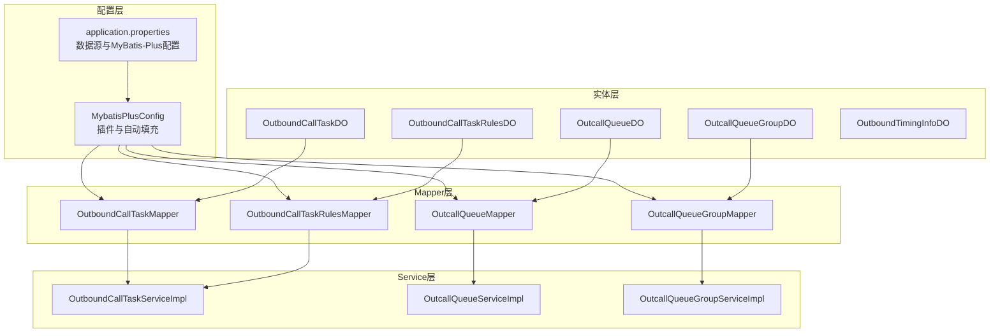
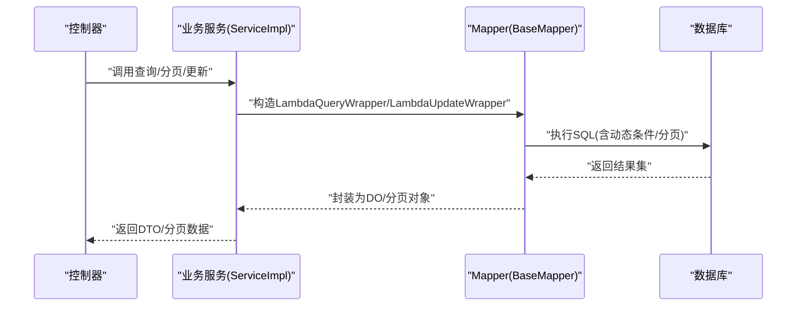
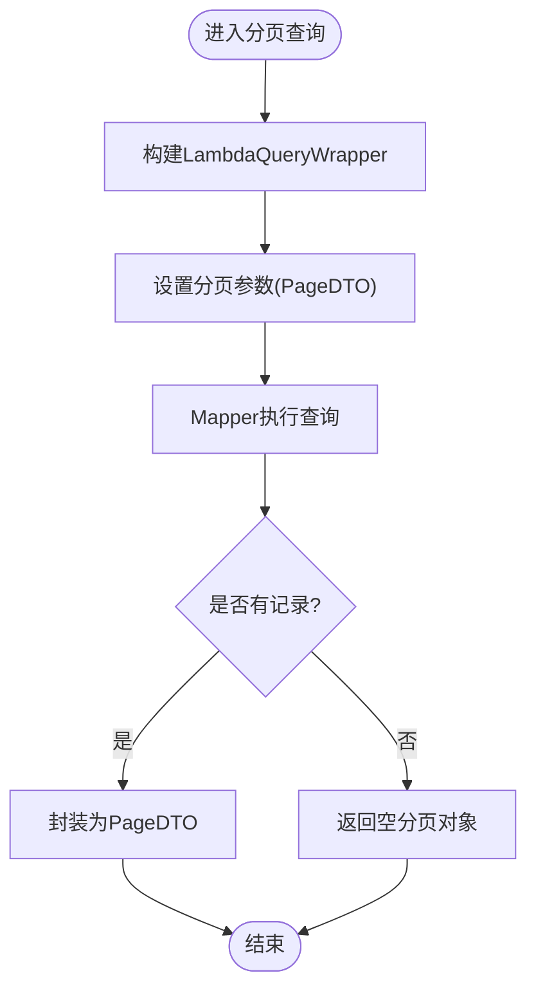
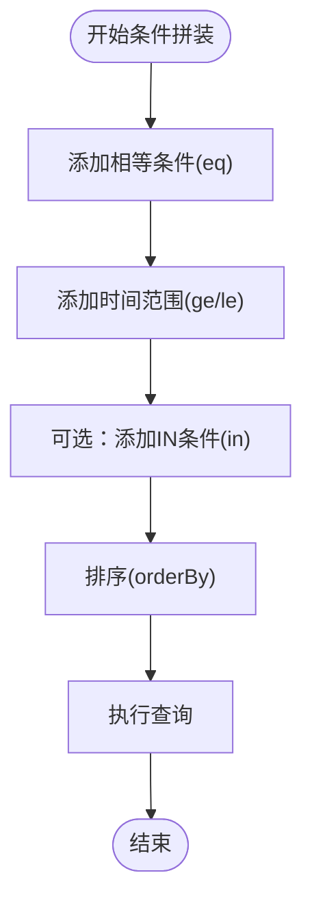
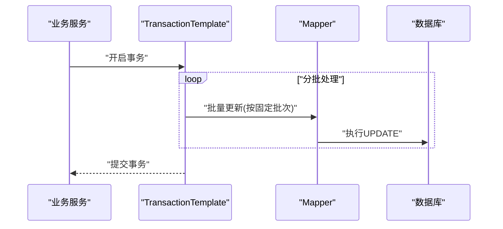
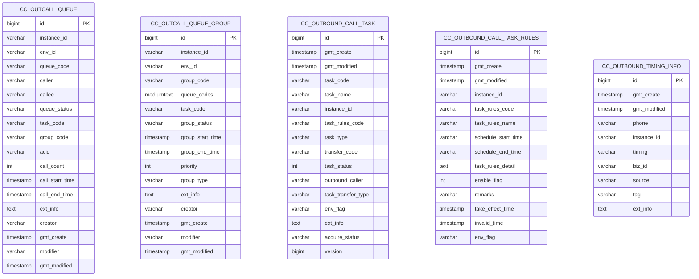
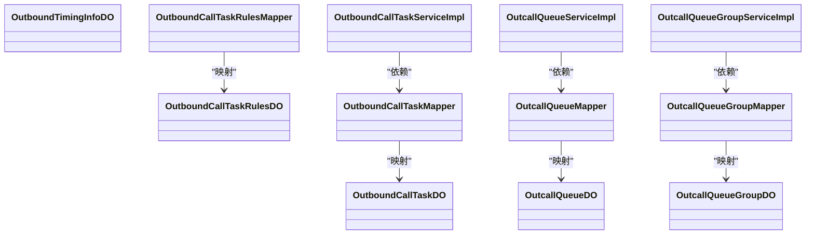

# 数据访问模式

<cite>
**本文引用的文件**
- [MybatisPlusConfig.java](file://src/main/java/org/qianye/config/MybatisPlusConfig.java)
- [application.properties](file://src/main/resources/application.properties)
- [OutboundCallTaskMapper.java](file://src/main/java/org/qianye/mapper/OutboundCallTaskMapper.java)
- [OutcallQueueMapper.java](file://src/main/java/org/qianye/mapper/OutcallQueueMapper.java)
- [OutboundCallTaskRulesMapper.java](file://src/main/java/org/qianye/mapper/OutboundCallTaskRulesMapper.java)
- [OutcallQueueGroupMapper.java](file://src/main/java/org/qianye/mapper/OutcallQueueGroupMapper.java)
- [OutboundCallTaskDO.java](file://src/main/java/org/qianye/entity/OutboundCallTaskDO.java)
- [OutcallQueueDO.java](file://src/main/java/org/qianye/entity/OutcallQueueDO.java)
- [OutboundCallTaskRulesDO.java](file://src/main/java/org/qianye/entity/OutboundCallTaskRulesDO.java)
- [OutcallQueueGroupDO.java](file://src/main/java/org/qianye/entity/OutcallQueueGroupDO.java)
- [OutboundTimingInfoDO.java](file://src/main/java/org/qianye/entity/OutboundTimingInfoDO.java)
- [OutboundCallTaskServiceImpl.java](file://src/main/java/org/qianye/service/impl/OutboundCallTaskServiceImpl.java)
- [OutcallQueueServiceImpl.java](file://src/main/java/org/qianye/service/impl/OutcallQueueServiceImpl.java)
- [OutcallQueueGroupServiceImpl.java](file://src/main/java/org/qianye/service/impl/OutcallQueueGroupServiceImpl.java)
- [outcall.sql](file://src/main/resources/outcall.sql)
</cite>

## 目录
1. [简介](#简介)
2. [项目结构](#项目结构)
3. [核心组件](#核心组件)
4. [架构总览](#架构总览)
5. [详细组件分析](#详细组件分析)
6. [依赖关系分析](#依赖关系分析)
7. [性能考量](#性能考量)
8. [故障排查指南](#故障排查指南)
9. [结论](#结论)
10. [附录](#附录)

## 简介
本文件系统性梳理 Outcall 系统的数据访问模式，围绕 MyBatis Plus 的数据访问层设计展开，覆盖 Mapper 接口定义、实体类注解、通用 CRUD 与分页实现、自定义 SQL 与动态条件查询、批量操作与事务管理、性能优化策略、索引与查询计划分析、慢查询优化、以及数据访问层与业务层的交互与异常处理机制。目标是帮助开发者快速理解并正确使用数据访问层，提升开发效率与系统稳定性。

## 项目结构
数据访问层采用“实体 + Mapper 接口 + Service 实现 + 配置”的分层组织方式：
- 实体层：通过 MyBatis Plus 注解映射数据库表结构与字段命名策略
- Mapper 层：基于 BaseMapper 提供通用 CRUD 与分页能力
- Service 层：基于 ServiceImpl 封装复杂查询、分页与批量更新逻辑
- 配置层：MyBatis Plus 插件与自动填充配置

图表来源
- [MybatisPlusConfig.java](file://src/main/java/org/qianye/config/MybatisPlusConfig.java#L1-L49)
- [application.properties](file://src/main/resources/application.properties#L1-L17)
- [OutboundCallTaskMapper.java](file://src/main/java/org/qianye/mapper/OutboundCallTaskMapper.java#L1-L10)
- [OutcallQueueMapper.java](file://src/main/java/org/qianye/mapper/OutcallQueueMapper.java#L1-L10)
- [OutboundCallTaskRulesMapper.java](file://src/main/java/org/qianye/mapper/OutboundCallTaskRulesMapper.java#L1-L10)
- [OutcallQueueGroupMapper.java](file://src/main/java/org/qianye/mapper/OutcallQueueGroupMapper.java#L1-L10)
- [OutboundCallTaskServiceImpl.java](file://src/main/java/org/qianye/service/impl/OutboundCallTaskServiceImpl.java#L1-L66)
- [OutcallQueueServiceImpl.java](file://src/main/java/org/qianye/service/impl/OutcallQueueServiceImpl.java#L1-L800)
- [OutcallQueueGroupServiceImpl.java](file://src/main/java/org/qianye/service/impl/OutcallQueueGroupServiceImpl.java#L1-L994)

章节来源
- [MybatisPlusConfig.java](file://src/main/java/org/qianye/config/MybatisPlusConfig.java#L1-L49)
- [application.properties](file://src/main/resources/application.properties#L1-L17)

## 核心组件
- MyBatis Plus 配置
  - 插件：乐观锁拦截器启用；分页插件暂未启用
  - 自动填充：插入与更新时自动填充时间字段
- 实体类注解
  - 表名映射、主键策略、字段填充、逻辑删除、版本号用于乐观锁
- Mapper 接口
  - 基于 BaseMapper，继承通用 CRUD 与分页能力
- Service 实现
  - 基于 ServiceImpl，封装复杂查询、分页、批量更新与事务控制

章节来源
- [MybatisPlusConfig.java](file://src/main/java/org/qianye/config/MybatisPlusConfig.java#L17-L47)
- [OutboundCallTaskDO.java](file://src/main/java/org/qianye/entity/OutboundCallTaskDO.java#L12-L95)
- [OutcallQueueDO.java](file://src/main/java/org/qianye/entity/OutcallQueueDO.java#L12-L104)
- [OutboundCallTaskRulesDO.java](file://src/main/java/org/qianye/entity/OutboundCallTaskRulesDO.java#L12-L81)
- [OutcallQueueGroupDO.java](file://src/main/java/org/qianye/entity/OutcallQueueGroupDO.java#L12-L94)
- [OutboundTimingInfoDO.java](file://src/main/java/org/qianye/entity/OutboundTimingInfoDO.java#L12-L64)
- [OutboundCallTaskMapper.java](file://src/main/java/org/qianye/mapper/OutboundCallTaskMapper.java#L1-L10)
- [OutcallQueueMapper.java](file://src/main/java/org/qianye/mapper/OutcallQueueMapper.java#L1-L10)
- [OutboundCallTaskRulesMapper.java](file://src/main/java/org/qianye/mapper/OutboundCallTaskRulesMapper.java#L1-L10)
- [OutcallQueueGroupMapper.java](file://src/main/java/org/qianye/mapper/OutcallQueueGroupMapper.java#L1-L10)
- [OutboundCallTaskServiceImpl.java](file://src/main/java/org/qianye/service/impl/OutboundCallTaskServiceImpl.java#L16-L66)
- [OutcallQueueServiceImpl.java](file://src/main/java/org/qianye/service/impl/OutcallQueueServiceImpl.java#L28-L800)
- [OutcallQueueGroupServiceImpl.java](file://src/main/java/org/qianye/service/impl/OutcallQueueGroupServiceImpl.java#L34-L994)

## 架构总览
数据访问层遵循“配置 → 实体 → Mapper → Service → 控制器”的调用链路，结合数据库索引与查询条件，形成稳定的查询与更新路径。

图表来源
- [OutboundCallTaskServiceImpl.java](file://src/main/java/org/qianye/service/impl/OutboundCallTaskServiceImpl.java#L19-L64)
- [OutcallQueueServiceImpl.java](file://src/main/java/org/qianye/service/impl/OutcallQueueServiceImpl.java#L377-L471)
- [OutcallQueueGroupServiceImpl.java](file://src/main/java/org/qianye/service/impl/OutcallQueueGroupServiceImpl.java#L462-L515)

## 详细组件分析

### 通用 CRUD 与分页实现
- 通用 CRUD
  - Mapper 继承 BaseMapper，天然具备 insert、deleteById、updateById、selectById、selectList、selectPage 等能力
- 分页查询
  - Service 中使用 PageDTO 构造分页参数，并通过 LambdaQueryWrapper 组合条件
  - 示例：按实例与状态分页查询任务、按修改时间倒序排序

图表来源
- [OutboundCallTaskServiceImpl.java](file://src/main/java/org/qianye/service/impl/OutboundCallTaskServiceImpl.java#L32-L45)
- [OutcallQueueServiceImpl.java](file://src/main/java/org/qianye/service/impl/OutcallQueueServiceImpl.java#L377-L471)

章节来源
- [OutboundCallTaskMapper.java](file://src/main/java/org/qianye/mapper/OutboundCallTaskMapper.java#L1-L10)
- [OutboundCallTaskServiceImpl.java](file://src/main/java/org/qianye/service/impl/OutboundCallTaskServiceImpl.java#L16-L66)

### 动态 SQL 与条件查询
- 动态条件拼装
  - 使用 LambdaQueryWrapper 根据请求参数动态添加 eq、ge、le、in、orderBy 等条件
  - 示例：按实例、任务码、环境、状态、时间范围、被叫列表等组合查询
- 批量 IN 查询
  - 对大列表分批处理，避免 SQL IN 过长导致性能问题
- 状态与扩展信息转换
  - 字符串状态转换为枚举，扩展信息从字符串解析为 Map

图表来源
- [OutcallQueueServiceImpl.java](file://src/main/java/org/qianye/service/impl/OutcallQueueServiceImpl.java#L331-L417)
- [OutcallQueueGroupServiceImpl.java](file://src/main/java/org/qianye/service/impl/OutcallQueueGroupServiceImpl.java#L465-L500)

章节来源
- [OutcallQueueServiceImpl.java](file://src/main/java/org/qianye/service/impl/OutcallQueueServiceImpl.java#L327-L471)
- [OutcallQueueGroupServiceImpl.java](file://src/main/java/org/qianye/service/impl/OutcallQueueGroupServiceImpl.java#L462-L515)

### 自定义 SQL 与 XML 映射
- 当前代码未显式出现 XML 映射文件
- 若需自定义 SQL，建议在 resources/mapper 下新增对应 Mapper 的 XML 文件，并在 application.properties 中确保 mybatis-plus.mapper-locations 生效
- 自定义 SQL 编写规范
  - 使用动态 SQL 标签拼装条件，避免硬编码
  - 合理使用索引列作为过滤条件，避免全表扫描
  - 对大结果集分页或分批处理，避免一次性加载过多数据

章节来源
- [application.properties](file://src/main/resources/application.properties#L13-L16)

### 批量操作与事务管理
- 批量更新
  - 对于大量状态更新，采用分批提交（如每批固定数量）以降低单次事务压力
  - 示例：队列组状态批量更新按固定批次循环更新
- 事务控制
  - 使用 @Transactional 或 TransactionTemplate 管理跨多表的原子性操作
  - 建议对批量更新包裹在事务中，失败回滚，保证一致性

图表来源
- [OutcallQueueGroupServiceImpl.java](file://src/main/java/org/qianye/service/impl/OutcallQueueGroupServiceImpl.java#L751-L800)

章节来源
- [OutcallQueueGroupServiceImpl.java](file://src/main/java/org/qianye/service/impl/OutcallQueueGroupServiceImpl.java#L751-L800)

### 乐观锁与并发控制
- 实体类使用 @Version 字段配合自动填充与乐观锁拦截器
- 并发更新时若版本不一致会抛出异常，需在上层捕获并提示重试

章节来源
- [OutboundCallTaskDO.java](file://src/main/java/org/qianye/entity/OutboundCallTaskDO.java#L93-L94)
- [MybatisPlusConfig.java](file://src/main/java/org/qianye/config/MybatisPlusConfig.java#L21-L27)

### 数据模型与索引设计
- 表结构与索引
  - 呼叫名单表、队列组表、任务规则表、任务表均定义了复合索引与单列索引
  - 建议查询条件尽量命中这些索引，减少回表与全表扫描

图表来源
- [outcall.sql](file://src/main/resources/outcall.sql#L1-L218)

章节来源
- [outcall.sql](file://src/main/resources/outcall.sql#L1-L218)

## 依赖关系分析
- Mapper 与实体
  - Mapper 接口与实体类一一对应，通过注解映射表与字段
- Service 与 Mapper
  - ServiceImpl 继承关系使 Service 直接获得通用 CRUD 与分页能力
- 配置与插件
  - MyBatisPlusConfig 注入插件与自动填充处理器，影响所有 Mapper 的行为

图表来源
- [OutboundCallTaskDO.java](file://src/main/java/org/qianye/entity/OutboundCallTaskDO.java#L12-L95)
- [OutcallQueueDO.java](file://src/main/java/org/qianye/entity/OutcallQueueDO.java#L12-L104)
- [OutboundCallTaskRulesDO.java](file://src/main/java/org/qianye/entity/OutboundCallTaskRulesDO.java#L12-L81)
- [OutcallQueueGroupDO.java](file://src/main/java/org/qianye/entity/OutcallQueueGroupDO.java#L12-L94)
- [OutboundCallTaskMapper.java](file://src/main/java/org/qianye/mapper/OutboundCallTaskMapper.java#L1-L10)
- [OutcallQueueMapper.java](file://src/main/java/org/qianye/mapper/OutcallQueueMapper.java#L1-L10)
- [OutboundCallTaskRulesMapper.java](file://src/main/java/org/qianye/mapper/OutboundCallTaskRulesMapper.java#L1-L10)
- [OutcallQueueGroupMapper.java](file://src/main/java/org/qianye/mapper/OutcallQueueGroupMapper.java#L1-L10)
- [OutboundCallTaskServiceImpl.java](file://src/main/java/org/qianye/service/impl/OutboundCallTaskServiceImpl.java#L16-L66)
- [OutcallQueueServiceImpl.java](file://src/main/java/org/qianye/service/impl/OutcallQueueServiceImpl.java#L28-L800)
- [OutcallQueueGroupServiceImpl.java](file://src/main/java/org/qianye/service/impl/OutcallQueueGroupServiceImpl.java#L34-L994)

章节来源
- [OutboundCallTaskServiceImpl.java](file://src/main/java/org/qianye/service/impl/OutboundCallTaskServiceImpl.java#L16-L66)
- [OutcallQueueServiceImpl.java](file://src/main/java/org/qianye/service/impl/OutcallQueueServiceImpl.java#L28-L800)
- [OutcallQueueGroupServiceImpl.java](file://src/main/java/org/qianye/service/impl/OutcallQueueGroupServiceImpl.java#L34-L994)

## 性能考量
- 索引使用
  - 命中复合索引：如实例+任务码+状态、实例+任务码+时间等
  - 单列索引：如手机号唯一索引、环境标识索引
- 查询计划分析
  - 使用 EXPLAIN 分析 SQL 访问路径，关注是否走索引、回表次数、扫描行数
- 慢查询优化
  - 将过滤条件尽可能前置到 WHERE 子句，避免函数包裹字段导致索引失效
  - 对 IN 列表分批处理，控制批大小，避免 SQL 过长
  - 对大结果集使用分页或流式处理，避免内存峰值过高
- 批量更新
  - 固定批次批量更新，减少事务开销与锁竞争
- 自动填充与乐观锁
  - 减少重复赋值，避免不必要的字段更新，降低写放大

章节来源
- [outcall.sql](file://src/main/resources/outcall.sql#L43-L49)
- [outcall.sql](file://src/main/resources/outcall.sql#L89-L92)
- [outcall.sql](file://src/main/resources/outcall.sql#L155-L163)
- [outcall.sql](file://src/main/resources/outcall.sql#L205-L215)
- [OutcallQueueServiceImpl.java](file://src/main/java/org/qianye/service/impl/OutcallQueueServiceImpl.java#L666-L714)
- [OutcallQueueGroupServiceImpl.java](file://src/main/java/org/qianye/service/impl/OutcallQueueGroupServiceImpl.java#L785-L800)

## 故障排查指南
- 常见异常
  - 乐观锁冲突：版本号不一致导致更新失败，需重试或提示用户刷新后重试
  - 参数校验异常：如被叫列表过大、必填字段为空，需在接口层或服务层提前校验
  - 分页边界：当最后一页不足 pageSize 时应停止循环，避免死循环
- 日志与监控
  - 在关键流程打印日志，便于定位问题
  - 对批量操作记录耗时，便于性能回归
- 事务回滚
  - 对批量更新包裹事务，异常时回滚，保证数据一致性

章节来源
- [OutcallQueueServiceImpl.java](file://src/main/java/org/qianye/service/impl/OutcallQueueServiceImpl.java#L353-L357)
- [OutcallQueueServiceImpl.java](file://src/main/java/org/qianye/service/impl/OutcallQueueServiceImpl.java#L379-L383)
- [OutcallQueueGroupServiceImpl.java](file://src/main/java/org/qianye/service/impl/OutcallQueueGroupServiceImpl.java#L751-L800)

## 结论
Outcall 系统的数据访问层以 MyBatis Plus 为核心，通过实体注解、BaseMapper 通用能力与 Service 层封装，实现了清晰的分层与良好的可维护性。结合合理的索引设计、动态条件查询、分批批量更新与事务控制，能够满足高并发场景下的稳定运行。建议后续补充 XML 自定义 SQL 与分页插件配置，进一步完善查询与分页能力。

## 附录
- 最佳实践清单
  - 查询条件优先命中索引，避免全表扫描
  - 大列表查询分批处理，控制批大小
  - 批量更新使用固定批次，包裹事务
  - 乐观锁冲突时进行重试或提示
  - 使用自动填充减少重复赋值
  - 对复杂查询使用 EXPLAIN 分析执行计划