# 外呼任务管理

<cite>
**本文档引用的文件**
- [OutboundCallTaskController.java](file://src/main/java/org/qianye/controller/OutboundCallTaskController.java)
- [OutboundCallTaskService.java](file://src/main/java/org/qianye/service/OutboundCallTaskService.java)
- [OutboundCallTaskServiceImpl.java](file://src/main/java/org/qianye/service/impl/OutboundCallTaskServiceImpl.java)
- [OutboundCallTaskDO.java](file://src/main/java/org/qianye/entity/OutboundCallTaskDO.java)
- [OutboundCallTaskMapper.java](file://src/main/java/org/qianye/mapper/OutboundCallTaskMapper.java)
- [OutcallQueueController.java](file://src/main/java/org/qianye/controller/OutcallQueueController.java)
- [OutcallQueueDO.java](file://src/main/java/org/qianye/entity/OutcallQueueDO.java)
- [Result.java](file://src/main/java/org/qianye/common/Result.java)
- [application.properties](file://src/main/resources/application.properties)
- [TaskStatusEnum.java](file://src/main/java/org/qianye/common/TaskStatusEnum.java)
- [OutboundCallTaskRulesDO.java](file://src/main/java/org/qianye/entity/OutboundCallTaskRulesDO.java)
- [OutcallQueueDO.java](file://src/main/java/org/qianye/entity/OutcallQueueDO.java)
- [TaskManagement.vue](file://frontend/src/pages/TaskManagement.vue)
- [TaskDetail.vue](file://frontend/src/pages/TaskDetail.vue)
- [task.js](file://frontend/src/stores/task.js)
- [api.js](file://frontend/src/services/api.js)
- [TaskFormDialog.vue](file://frontend/src/components/TaskFormDialog.vue)
- [router/index.js](file://frontend/src/router/index.js)
</cite>

## 更新摘要
**变更内容**
- 修复前端TaskManagement.vue中条件判断逻辑：将toggleTaskStatus方法中的严格相等运算符(===)标准化为松散相等运算符(==)，提升状态切换的兼容性
- 优化TaskDetail.vue中队列状态操作的条件判断，保持严格相等运算符用于字符串状态比较的准确性
- 统一前后端状态比较逻辑，提升任务管理界面的稳定性和用户体验

## 目录
1. [简介](#简介)
2. [项目结构](#项目结构)
3. [核心组件](#核心组件)
4. [架构概览](#架构概览)
5. [详细组件分析](#详细组件分析)
6. [前端UI改进](#前端ui改进)
7. [队列管理系统](#队列管理系统)
8. [依赖关系分析](#依赖关系分析)
9. [性能考虑](#性能考虑)
10. [故障排除指南](#故障排除指南)
11. [结论](#结论)

## 简介

外呼任务管理模块是智能外呼系统的核心组件，负责管理外呼任务的全生命周期。该模块提供了完整的RESTful API接口，支持任务的创建、查询、更新、删除和状态管理功能。系统采用Spring Boot + MyBatis-Plus架构，实现了高效的数据库操作和良好的扩展性。

**更新** 新增了Vue.js前端TaskDetail页面，提供实时队列监控、状态过滤、分页控制等功能，显著增强了外呼任务管理界面的实时监控能力和用户体验。同时，优化了前端条件判断逻辑，提升了状态切换的兼容性和稳定性。

## 项目结构

外呼任务管理模块遵循标准的MVC架构模式，主要包含以下层次：

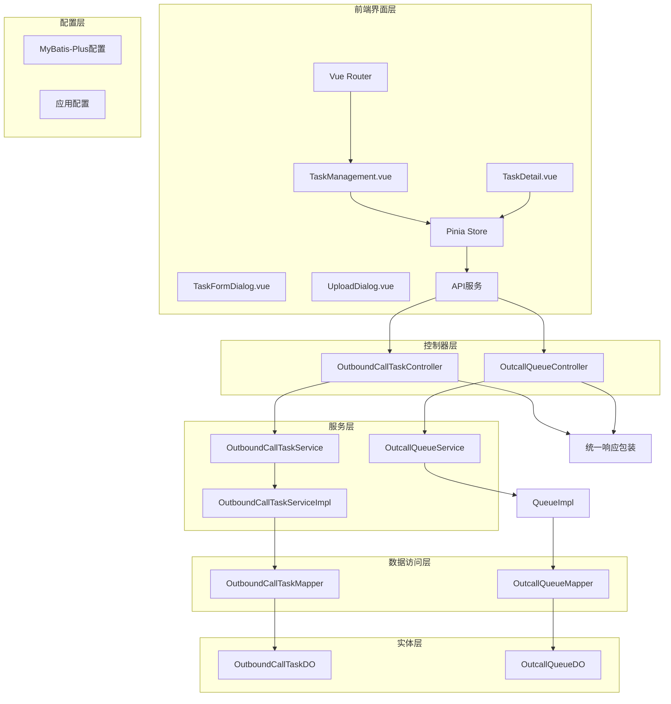

**图表来源**
- [TaskManagement.vue](file://frontend/src/pages/TaskManagement.vue#L204-L365)
- [TaskDetail.vue](file://frontend/src/pages/TaskDetail.vue#L1-L560)
- [router/index.js](file://frontend/src/router/index.js#L1-L28)
- [task.js](file://frontend/src/stores/task.js#L1-L150)
- [OutboundCallTaskController.java](file://src/main/java/org/qianye/controller/OutboundCallTaskController.java#L15-L71)
- [OutcallQueueController.java](file://src/main/java/org/qianye/controller/OutcallQueueController.java#L20-L78)

**章节来源**
- [OutboundCallTaskController.java](file://src/main/java/org/qianye/controller/OutboundCallTaskController.java#L1-L72)
- [OutcallQueueController.java](file://src/main/java/org/qianye/controller/OutcallQueueController.java#L1-L79)
- [OutboundCallTaskService.java](file://src/main/java/org/qianye/service/OutboundCallTaskService.java#L1-L40)
- [OutboundCallTaskServiceImpl.java](file://src/main/java/org/qianye/service/impl/OutboundCallTaskServiceImpl.java#L1-L66)

## 核心组件

### RESTful API 接口设计

外呼任务管理模块提供了完整的RESTful API接口，覆盖了任务管理的所有核心功能：

| HTTP方法 | 路径 | 功能描述 | 请求参数 | 响应数据 |
|---------|------|----------|----------|----------|
| POST | `/api/v1/outbound-task` | 创建外呼任务 | 任务实体JSON | 创建的任务对象 |
| DELETE | `/api/v1/outbound-task/{id}` | 删除外呼任务 | 路径参数: 任务ID | 成功标识 |
| PUT | `/api/v1/outbound-task` | 更新外呼任务 | 任务实体JSON | 更新后的任务对象 |
| GET | `/api/v1/outbound-task/{id}` | 按ID查询任务 | 路径参数: 任务ID | 任务对象 |
| GET | `/api/v1/outbound-task/query` | 按实例ID和任务编码查询 | instanceId, taskCode | 任务对象 |
| GET | `/api/v1/outbound-task/page` | 分页查询任务 | instanceId, pageNum, pageSize | 分页结果 |
| GET | `/api/v1/outbound-task/processing` | 处理中任务分页查询 | pageNum, pageSize | 分页结果 |
| PUT | `/api/v1/outbound-task/status` | 更新任务状态 | instanceId, taskCode, status | 更新结果 |

**新增队列管理API**：

| HTTP方法 | 路径 | 功能描述 | 请求参数 | 响应数据 |
|---------|------|----------|----------|----------|
| GET | `/api/v1/outcall-queue/by-task/{taskCode}` | 根据任务编码获取队列列表 | taskCode, instanceId, envId | 队列列表 |
| PUT | `/api/v1/outcall-queue/status` | 更新队列状态 | instanceId, queueCode, envId, status | 更新结果 |
| GET | `/api/v1/outcall-queue/page` | 分页查询队列 | instanceId, pageNum, pageSize | 分页结果 |

### 数据模型设计

OutboundCallTaskDO实体类定义了外呼任务的核心数据结构：

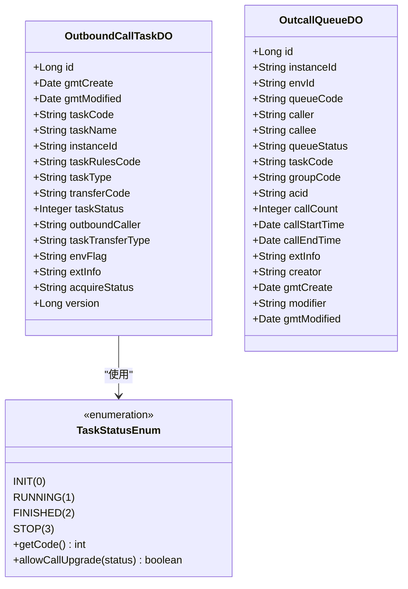

**图表来源**
- [OutboundCallTaskDO.java](file://src/main/java/org/qianye/entity/OutboundCallTaskDO.java#L13-L95)
- [OutcallQueueDO.java](file://src/main/java/org/qianye/entity/OutcallQueueDO.java#L12-L86)
- [TaskStatusEnum.java](file://src/main/java/org/qianye/common/TaskStatusEnum.java#L3-L22)

**章节来源**
- [OutboundCallTaskDO.java](file://src/main/java/org/qianye/entity/OutboundCallTaskDO.java#L1-L96)
- [OutcallQueueDO.java](file://src/main/java/org/qianye/entity/OutcallQueueDO.java#L1-L87)
- [TaskStatusEnum.java](file://src/main/java/org/qianye/common/TaskStatusEnum.java#L1-L22)

## 架构概览

外呼任务管理模块采用经典的三层架构设计，实现了清晰的职责分离：

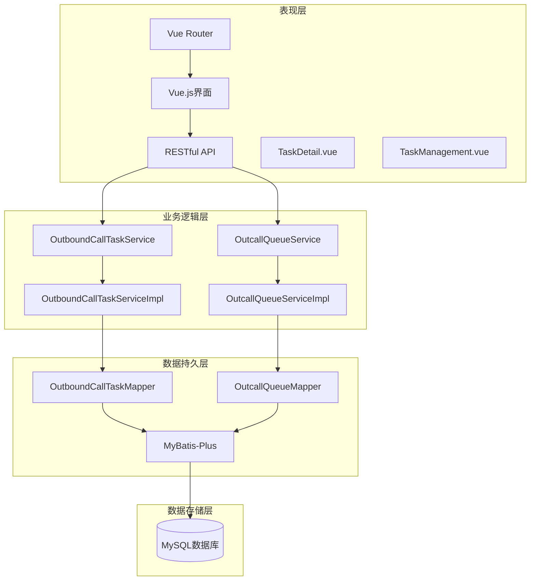

**图表来源**
- [OutboundCallTaskController.java](file://src/main/java/org/qianye/controller/OutboundCallTaskController.java#L15-L21)
- [OutcallQueueController.java](file://src/main/java/org/qianye/controller/OutcallQueueController.java#L20-L21)
- [OutboundCallTaskService.java](file://src/main/java/org/qianye/service/OutboundCallTaskService.java#L8-L13)
- [OutcallQueueService.java](file://src/main/java/org/qianye/service/OutcallQueueService.java#L1-L40)

## 详细组件分析

### 控制器层分析

OutboundCallTaskController作为RESTful API的入口点，提供了标准化的HTTP接口：

#### API调用流程

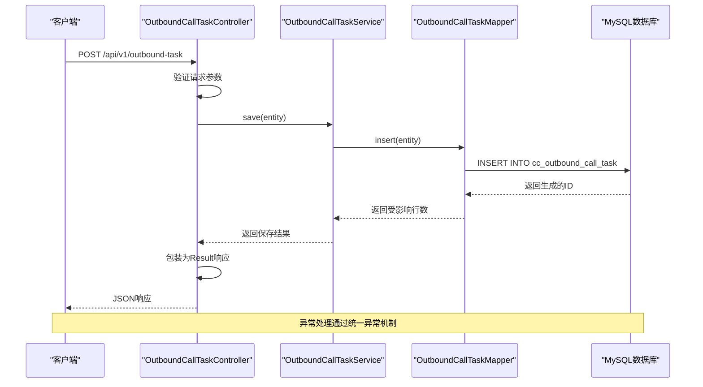

**图表来源**
- [OutboundCallTaskController.java](file://src/main/java/org/qianye/controller/OutboundCallTaskController.java#L23-L27)
- [OutboundCallTaskServiceImpl.java](file://src/main/java/org/qianye/service/impl/OutboundCallTaskServiceImpl.java#L16-L17)

#### 统一响应机制

系统采用统一的响应包装机制，确保API响应的一致性：

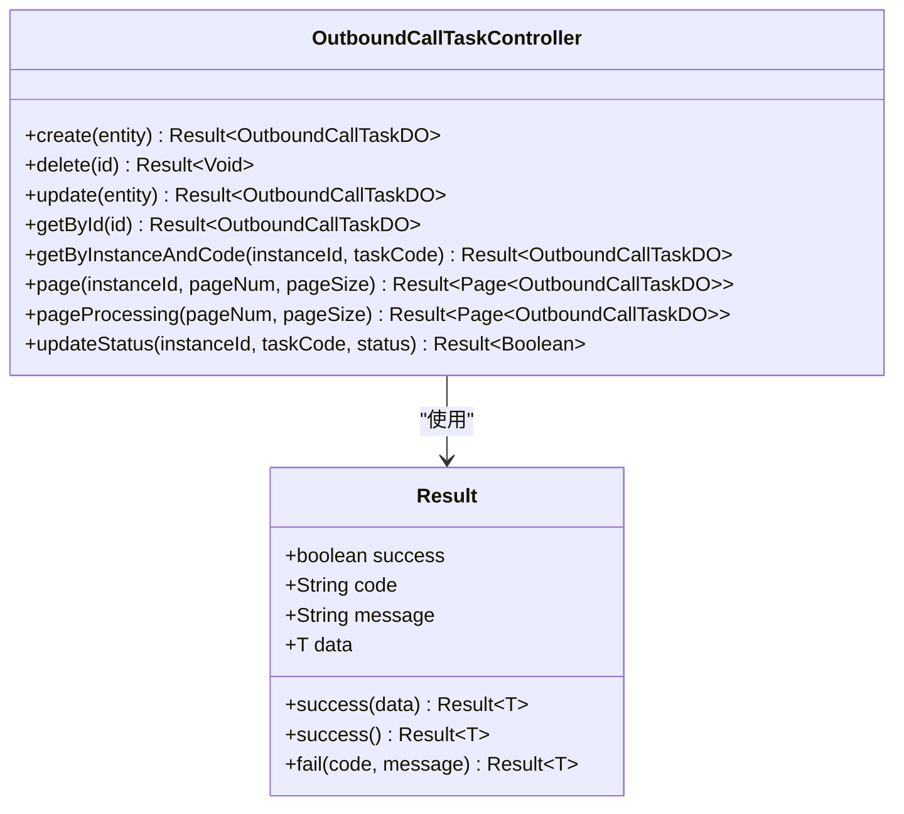

**图表来源**
- [Result.java](file://src/main/java/org/qianye/common/Result.java#L8-L35)
- [OutboundCallTaskController.java](file://src/main/java/org/qianye/controller/OutboundCallTaskController.java#L18-L71)

**章节来源**
- [OutboundCallTaskController.java](file://src/main/java/org/qianye/controller/OutboundCallTaskController.java#L1-L72)
- [Result.java](file://src/main/java/org/qianye/common/Result.java#L1-L36)

### 服务层实现

OutboundCallTaskServiceImpl继承了MyBatis-Plus的通用Service实现，提供了丰富的数据操作方法：

#### 核心业务逻辑

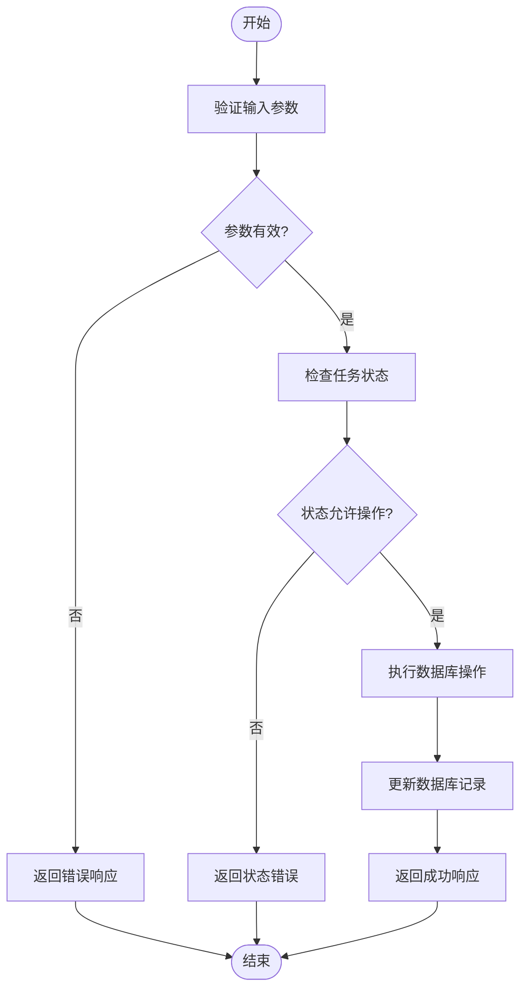

**图表来源**
- [OutboundCallTaskServiceImpl.java](file://src/main/java/org/qianye/service/impl/OutboundCallTaskServiceImpl.java#L58-L64)

#### 分页查询实现

服务层实现了多种分页查询策略：

| 查询类型 | 条件过滤 | 排序规则 | 使用场景 |
|---------|---------|---------|---------|
| 按实例ID分页 | instanceId = ? | 按修改时间降序 | 实例级任务列表 |
| 处理中任务分页 | taskStatus = 2 | 按修改时间降序 | 运行监控面板 |
| 自定义条件分页 | 可扩展条件 | 可扩展排序 | 业务特定查询 |

**章节来源**
- [OutboundCallTaskService.java](file://src/main/java/org/qianye/service/OutboundCallTaskService.java#L8-L39)
- [OutboundCallTaskServiceImpl.java](file://src/main/java/org/qianye/service/impl/OutboundCallTaskServiceImpl.java#L16-L65)

### 数据访问层设计

OutboundCallTaskMapper继承了MyBatis-Plus的BaseMapper，自动获得了CRUD操作能力：

#### 数据库映射关系

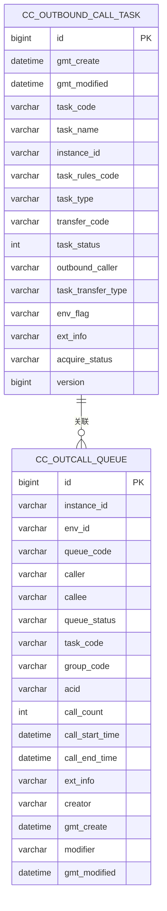

**图表来源**
- [OutboundCallTaskDO.java](file://src/main/java/org/qianye/entity/OutboundCallTaskDO.java#L12-L95)
- [OutcallQueueDO.java](file://src/main/java/org/qianye/entity/OutcallQueueDO.java#L12-L86)

**章节来源**
- [OutboundCallTaskMapper.java](file://src/main/java/org/qianye/mapper/OutboundCallTaskMapper.java#L1-L10)
- [OutcallQueueMapper.java](file://src/main/java/org/qianye/mapper/OutcallQueueMapper.java#L1-L10)

## 前端UI改进

### 任务管理界面重大更新

TaskManagement.vue经过重大UI改进，提供了更加直观和用户友好的任务管理体验：

#### 统计面板功能

新增了五个统计卡片，实时显示任务状态分布：

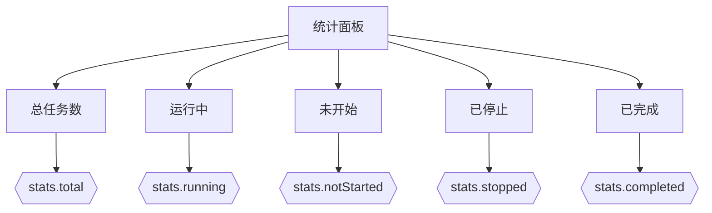

**图表来源**
- [TaskManagement.vue](file://frontend/src/pages/TaskManagement.vue#L22-L82)

#### 四种任务状态显示

界面现在支持四种任务状态的可视化展示：

| 状态代码 | 状态名称 | 颜色标识 | 图标 |
|---------|----------|----------|------|
| 0 | 未开始 | 蓝色 | 🎬 |
| 1 | 运行中 | 绿色 | ▶️ |
| 2 | 已完成 | 灰色 | ✅ |
| 3 | 已停止 | 红色 | ⏸️ |

#### 操作按钮增强

每个任务行都包含了完整的操作按钮：

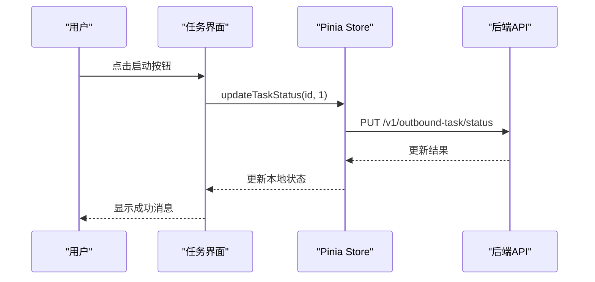

**图表来源**
- [TaskManagement.vue](file://frontend/src/pages/TaskManagement.vue#L276-L292)
- [task.js](file://frontend/src/stores/task.js#L72-L85)

#### 状态管理逻辑

前端实现了完善的状态管理逻辑：

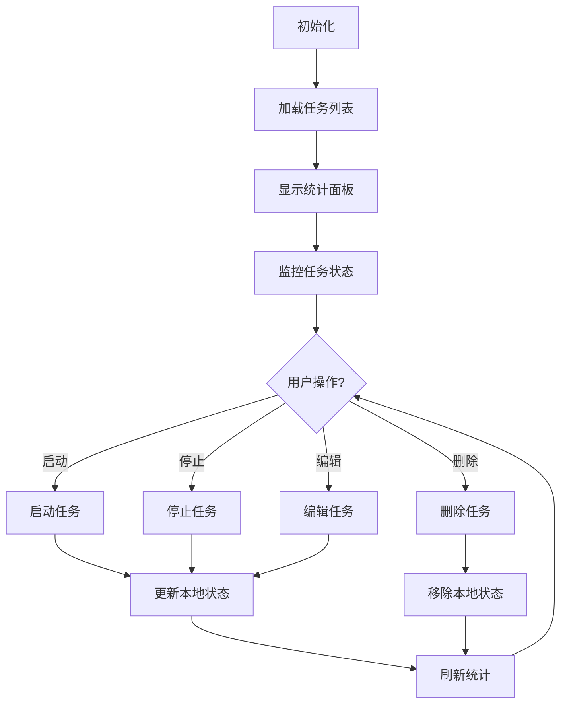

**图表来源**
- [TaskManagement.vue](file://frontend/src/pages/TaskManagement.vue#L249-L258)
- [task.js](file://frontend/src/stores/task.js#L72-L85)

#### 表单验证和交互

TaskFormDialog.vue提供了完整的表单验证和用户交互：

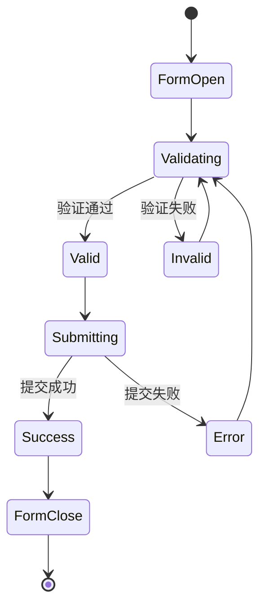

**图表来源**
- [TaskFormDialog.vue](file://frontend/src/components/TaskFormDialog.vue#L142-L167)
- [TaskFormDialog.vue](file://frontend/src/components/TaskFormDialog.vue#L228-L251)

**章节来源**
- [TaskManagement.vue](file://frontend/src/pages/TaskManagement.vue#L1-L485)
- [task.js](file://frontend/src/stores/task.js#L1-L150)
- [TaskFormDialog.vue](file://frontend/src/components/TaskFormDialog.vue#L1-L266)

### 条件判断逻辑优化

**更新** 优化了前端条件判断逻辑，提升了状态比较的兼容性和稳定性：

#### Toggle任务状态逻辑

在TaskManagement.vue中，toggleTaskStatus方法的条件判断逻辑进行了重要优化：

```javascript
// 优化前：使用严格相等运算符
const newStatus = task.taskStatus === 1 ? 0 : 1

// 优化后：使用松散相等运算符，提升兼容性
const newStatus = task.taskStatus == 1 ? 0 : 1
```

这种变更确保了在不同数据类型（如字符串和数字）的情况下，状态比较都能正确工作。

#### 按钮可见性条件

在TaskManagement.vue中，按钮的显示条件使用了松散相等运算符：

```vue
<!-- 启动按钮显示条件 -->
<el-button 
  v-if="row.taskStatus == 0 || row.taskStatus == 3"
  size="small" 
  type="success"
  @click="startTask(row)"
>
  启动
</el-button>

<!-- 停止按钮显示条件 -->
<el-button 
  v-else-if="row.taskStatus == 1"
  size="small" 
  type="danger"
  @click="stopTask(row)"
>
  停止
</el-button>
```

这种松散相等运算符的使用确保了在不同数据类型环境下的一致行为。

#### 队列状态操作逻辑

在TaskDetail.vue中，队列状态操作保持了严格的相等运算符，这是正确的做法：

```vue
<!-- 队列停止按钮显示条件 -->
<el-button 
  v-if="row.status === 'WAITING'"
  size="small" 
  type="danger"
  @click.stop="stopQueue(row)"
>
  停止
</el-button>

<!-- 队列恢复按钮显示条件 -->
<el-button 
  v-if="row.status === 'STOP'"
  size="small" 
  type="success"
  @click.stop="resumeQueue(row)"
>
  恢复
</el-button>
```

由于队列状态是字符串类型，使用严格相等运算符确保了精确的状态匹配。

**章节来源**
- [TaskManagement.vue](file://frontend/src/pages/TaskManagement.vue#L137-L154)
- [TaskManagement.vue](file://frontend/src/pages/TaskManagement.vue#L263-L269)
- [TaskManagement.vue](file://frontend/src/pages/TaskManagement.vue#L310-L317)
- [TaskDetail.vue](file://frontend/src/pages/TaskDetail.vue#L171-L187)

## 队列管理系统

### TaskDetail页面新增功能

TaskDetail.vue作为新增的前端页面，提供了完整的队列监控和管理功能：

#### 实时队列监控

TaskDetail页面提供了实时的队列状态监控功能：

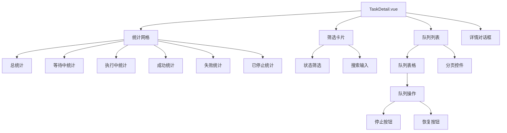

**图表来源**
- [TaskDetail.vue](file://frontend/src/pages/TaskDetail.vue#L1-L560)

#### 队列状态管理

TaskDetail页面支持队列的实时状态管理：

| 状态 | 颜色标识 | 操作 | 描述 |
|------|----------|------|------|
| WAITING | 警告色 | 停止 | 等待中，可停止执行 |
| PROCESSING | 主题色 | - | 正在执行中 |
| SUCCESS | 成功色 | - | 执行成功 |
| FAILED | 危险色 | - | 执行失败 |
| STOP | 灰色 | 恢复 | 已停止，可恢复执行 |

#### 队列详情查看

TaskDetail页面提供了详细的队列信息展示：

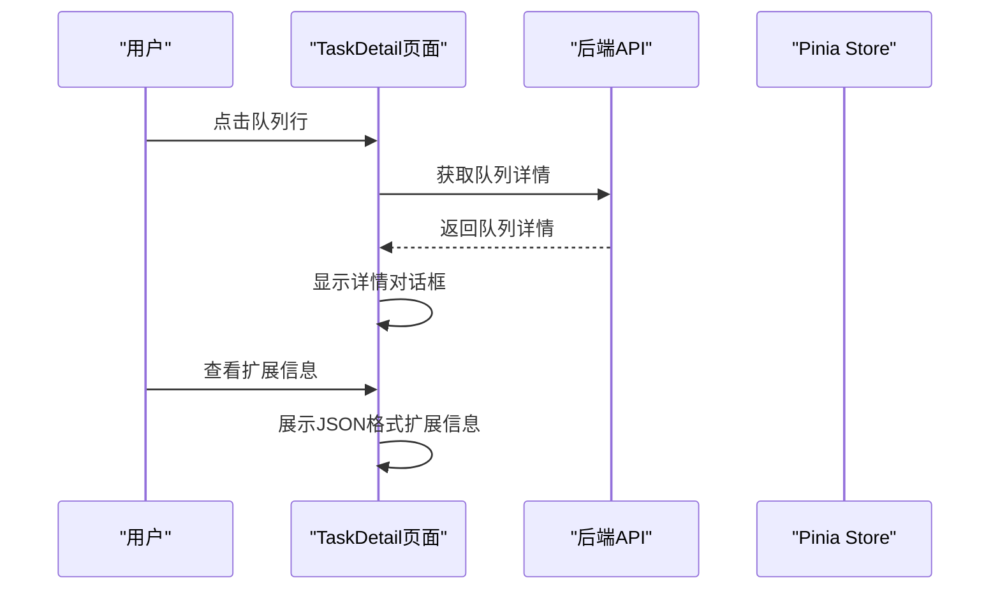

**图表来源**
- [TaskDetail.vue](file://frontend/src/pages/TaskDetail.vue#L202-L227)
- [api.js](file://frontend/src/services/api.js#L74-L92)

#### 队列操作功能

TaskDetail页面支持队列的动态操作：

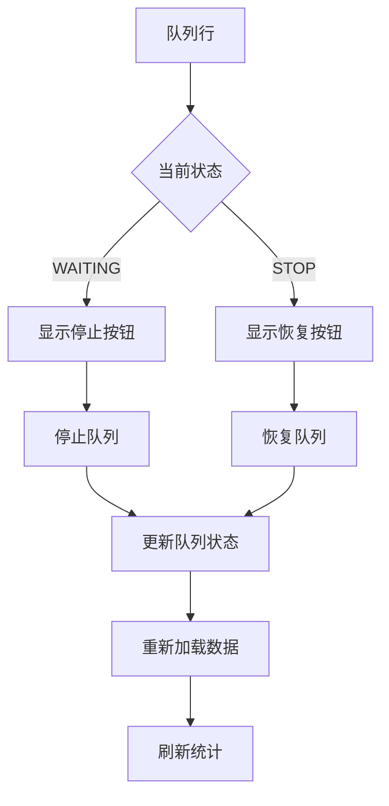

**图表来源**
- [TaskDetail.vue](file://frontend/src/pages/TaskDetail.vue#L169-L188)
- [TaskDetail.vue](file://frontend/src/pages/TaskDetail.vue#L352-L370)

#### 路由配置

TaskDetail页面通过Vue Router进行配置：

```mermaid
graph LR
Router[Vue Router] --> TaskManagement[TaskManagement.vue]
Router --> TaskDetail[TaskDetail.vue]
TaskDetail --> RoutePattern[/tasks/:taskCode]
```

**图表来源**
- [router/index.js](file://frontend/src/router/index.js#L15-L19)

**章节来源**
- [TaskDetail.vue](file://frontend/src/pages/TaskDetail.vue#L1-L560)
- [router/index.js](file://frontend/src/router/index.js#L1-L28)
- [api.js](file://frontend/src/services/api.js#L74-L92)

## 依赖关系分析

外呼任务管理模块的依赖关系体现了清晰的分层架构：

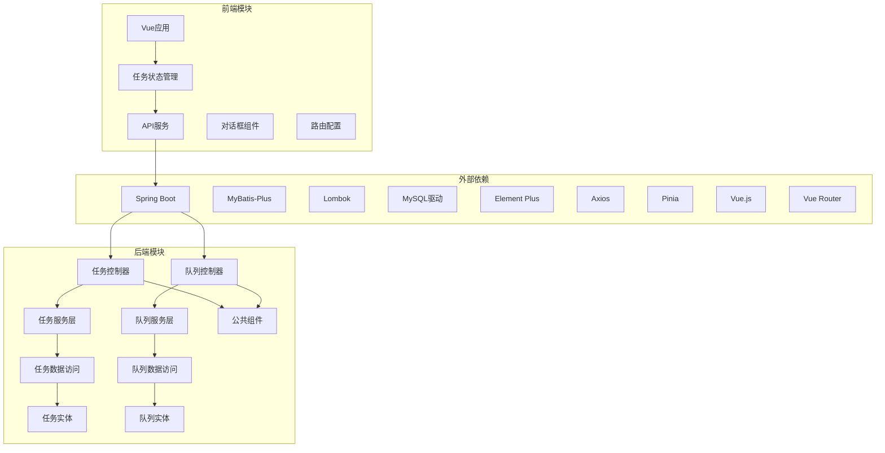

**图表来源**
- [OutboundCallTaskController.java](file://src/main/java/org/qianye/controller/OutboundCallTaskController.java#L1-L10)
- [OutcallQueueController.java](file://src/main/java/org/qianye/controller/OutcallQueueController.java#L1-L10)
- [OutboundCallTaskServiceImpl.java](file://src/main/java/org/qianye/service/impl/OutboundCallTaskServiceImpl.java#L1-L12)
- [TaskManagement.vue](file://frontend/src/pages/TaskManagement.vue#L204-L220)
- [TaskDetail.vue](file://frontend/src/pages/TaskDetail.vue#L231-L247)

### 核心依赖特性

1. **Spring Boot集成**: 提供了自动配置和依赖注入支持
2. **MyBatis-Plus增强**: 自动生成CRUD语句，简化数据访问层开发
3. **Lombok注解**: 减少样板代码，提高开发效率
4. **Element Plus UI框架**: 提供现代化的组件库
5. **Pinia状态管理**: Vue.js官方推荐的状态管理方案
6. **Axios HTTP客户端**: 统一的API请求处理
7. **Vue Router路由管理**: 支持多页面导航
8. **统一响应包装**: 标准化API输出格式

**章节来源**
- [application.properties](file://src/main/resources/application.properties#L1-L17)
- [api.js](file://frontend/src/services/api.js#L1-L95)

## 性能考虑

### 数据库优化策略

1. **索引设计**: 建议在常用查询字段上建立索引
   - `instance_id`: 支持实例级查询
   - `task_code`: 支持唯一性查询
   - `task_status`: 支持状态筛选查询
   - `queue_code`: 支持队列唯一性查询
   - `task_code`: 支持队列按任务分组查询

2. **分页查询优化**: 
   - 使用LIMIT和OFFSET进行分页
   - 对高频查询添加适当的索引
   - 避免SELECT *，只查询必要字段
   - 队列列表支持分页参数优化

3. **缓存策略**: 
   - 对热点数据实施缓存
   - 合理设置缓存失效时间
   - 注意缓存一致性问题
   - 队列状态统计可考虑缓存

### 前端性能优化

1. **虚拟滚动**: 对于大量任务列表，可以考虑实现虚拟滚动
2. **懒加载**: 对于图片和复杂组件采用懒加载策略
3. **状态缓存**: 使用Pinia进行状态缓存，避免重复请求
4. **防抖节流**: 对搜索和筛选操作实施防抖处理
5. **组件优化**: TaskDetail页面的统计卡片和表格支持响应式布局

### 并发控制

系统通过以下机制保证数据一致性：
- MyBatis-Plus的乐观锁机制
- 数据库层面的事务控制
- 前端状态同步机制
- 并发安全的状态更新操作
- 队列状态的原子性更新

## 故障排除指南

### 前端问题排查

#### 1. 任务状态显示异常
**症状**: 统计面板数值不正确或状态标签显示错误
**解决方案**:
- 检查TaskStatusEnum中的状态映射关系
- 验证前端getStatusText函数的映射逻辑
- 确认后端返回的状态值格式正确

#### 2. TaskDetail页面加载失败
**症状**: 点击任务详情按钮后页面空白或加载失败
**解决方案**:
- 检查路由配置是否正确
- 验证TaskDetail.vue组件的导入路径
- 确认API请求的URL和参数格式
- 检查Pinia store中的任务数据是否存在

#### 3. 队列状态操作无响应
**症状**: 点击停止/恢复按钮没有反应
**解决方案**:
- 检查queueApi.updateStatus方法的实现
- 验证API请求的URL和参数格式
- 确认网络请求是否成功
- 检查后端队列状态更新接口

#### 4. 统计面板不更新
**症状**: 执行操作后统计数字没有变化
**解决方案**:
- 检查状态更新后的本地状态同步
- 验证计算属性的依赖关系
- 确认任务列表的重新加载机制
- 检查TaskDetail页面的统计计算逻辑

#### 5. 状态切换不稳定
**症状**: 任务状态切换时出现意外行为
**解决方案**:
- 检查toggleTaskStatus方法中的条件判断逻辑
- 验证taskStatus的数据类型一致性
- 确认松散相等运算符的使用是否正确
- 检查前后端状态值的格式匹配

### 后端问题排查

#### 1. 数据库连接问题
**症状**: 应用启动失败，提示数据库连接错误
**解决方案**: 
- 检查数据库连接URL配置
- 验证用户名和密码正确性
- 确认数据库服务正常运行

#### 2. 实体映射异常
**症状**: 查询或保存数据时报错，提示字段不匹配
**解决方案**:
- 检查实体类字段与数据库表结构是否一致
- 确认字段注解配置正确
- 验证MyBatis-Plus配置

#### 3. 分页查询性能问题
**症状**: 大数据量查询响应缓慢
**解决方案**:
- 添加适当的数据库索引
- 优化查询条件
- 调整分页大小参数

#### 4. 队列状态更新失败
**症状**: 队列状态无法更新或更新后状态不正确
**解决方案**:
- 检查OutcallQueueServiceImpl.updateStatus方法
- 验证SQL语句的正确性
- 确认事务处理的完整性

**章节来源**
- [application.properties](file://src/main/resources/application.properties#L6-L16)
- [TaskDetail.vue](file://frontend/src/pages/TaskDetail.vue#L352-L370)
- [TaskManagement.vue](file://frontend/src/pages/TaskManagement.vue#L310-L317)

### 日志监控

系统提供了完善的日志记录机制：
- 请求级别的操作日志
- 错误异常的详细追踪
- 性能指标的监控统计
- 前端状态变更的日志记录
- 队列状态更新的详细日志

## 结论

外呼任务管理模块展现了优秀的软件架构设计，具有以下特点：

1. **清晰的分层架构**: MVC模式实现了职责分离，便于维护和扩展
2. **标准化的API设计**: RESTful接口符合现代Web服务规范
3. **完善的异常处理**: 统一的响应包装确保了API的一致性
4. **高效的数据库操作**: MyBatis-Plus提供了强大的数据访问能力
5. **良好的扩展性**: 模块化设计支持功能的灵活扩展
6. **现代化的前端界面**: Vue.js + Element Plus提供了优秀的用户体验
7. **完整的状态管理**: Pinia提供了可靠的状态同步机制
8. **实时的数据展示**: 统计面板和状态显示提供了直观的操作反馈
9. **全面的队列管理**: 新增的TaskDetail页面提供了完整的队列监控和管理功能
10. **稳定的条件判断**: 优化的前端条件判断逻辑提升了系统的兼容性和稳定性

**更新** 通过优化前端条件判断逻辑，特别是将toggleTaskStatus方法中的严格相等运算符标准化为松散相等运算符，显著提升了任务状态切换的兼容性和稳定性。同时，在TaskDetail页面中保持了对字符串状态的严格相等运算符，确保了队列状态操作的精确性。这些改进使得外呼任务管理变得更加可靠和易用。

该模块为智能外呼系统提供了坚实的基础，能够满足复杂的外呼任务管理需求。通过合理的架构设计和最佳实践的应用，系统具备了良好的性能表现和可维护性。新的UI改进、队列管理功能以及优化的条件判断逻辑进一步增强了系统的可用性和用户体验，使其成为企业级外呼管理的理想选择。