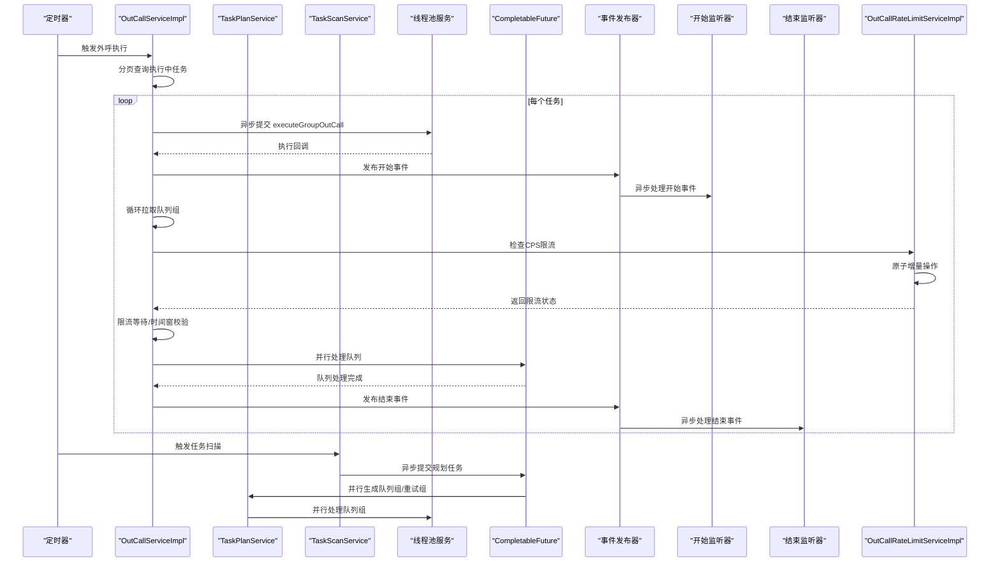
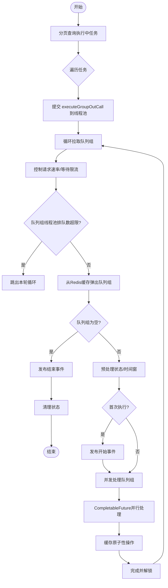
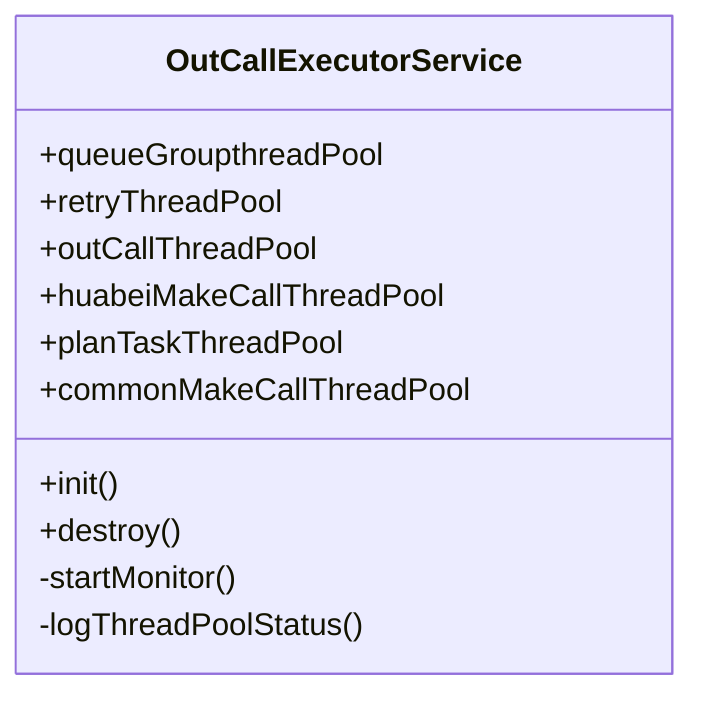
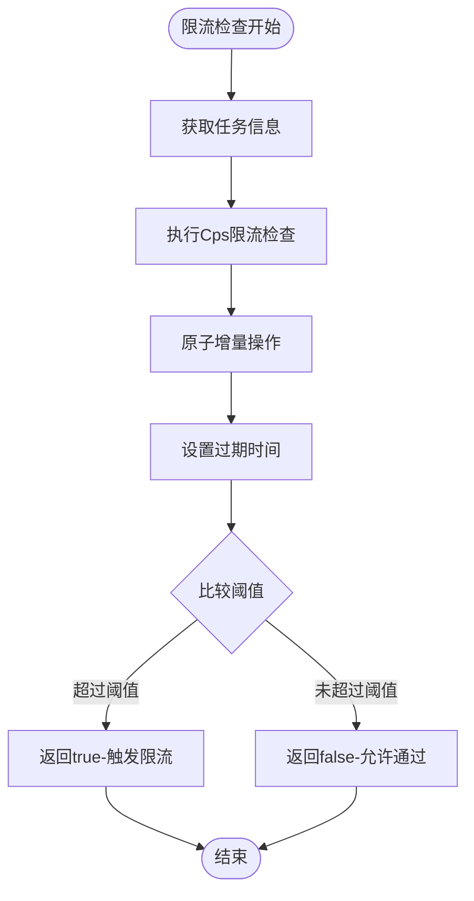
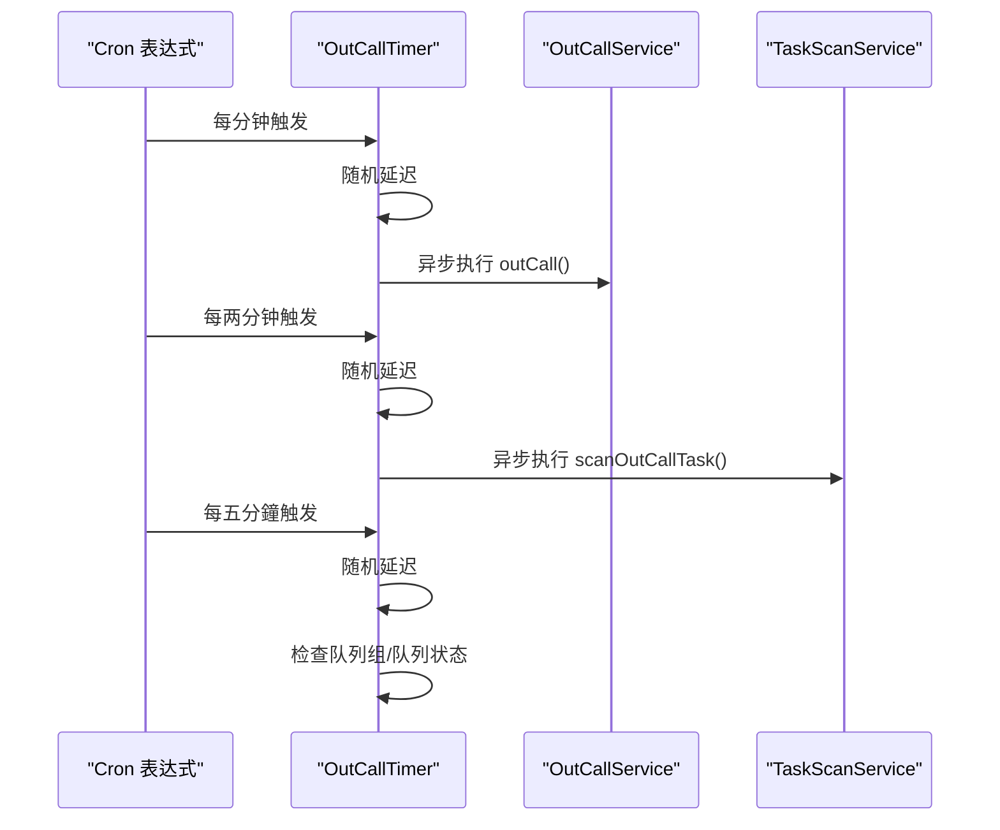
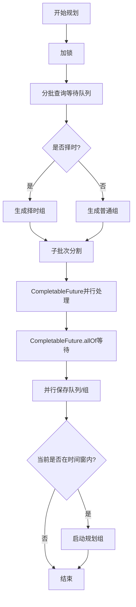
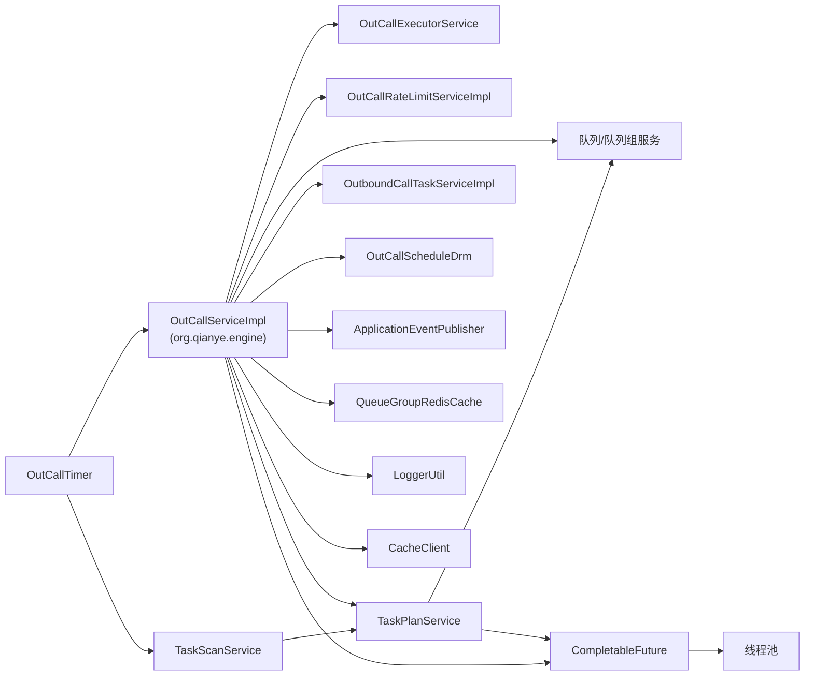

# 外呼执行引擎

<cite>
**本文档引用的文件**
- [OutCallService.java](file://src/main/java/org/qianye/engine/OutCallService.java)
- [OutCallServiceImpl.java](file://src/main/java/org/qianye/engine/OutCallServiceImpl.java)
- [OutCallExecutorService.java](file://src/main/java/org/qianye/engine/OutCallExecutorService.java)
- [OutCallRateLimitServiceImpl.java](file://src/main/java/org/qianye/engine/OutCallRateLimitServiceImpl.java)
- [CacheClient.java](file://src/main/java/org/qianye/cache/CacheClient.java)
- [OutCallTimer.java](file://src/main/java/org/qianye/DTO/OutCallTimer.java)
- [OutCallScheduleDrm.java](file://src/main/java/org/qianye/common/OutCallScheduleDrm.java)
- [OutCallResult.java](file://src/main/java/org/qianye/common/OutCallResult.java)
- [OutCallStartEvent.java](file://src/main/java/org/qianye/listener/OutCallStartEvent.java)
- [OutCallEndEvent.java](file://src/main/java/org/qianye/listener/OutCallEndEvent.java)
- [OutCallStartEventListener.java](file://src/main/java/org/qianye/listener/OutCallStartEventListener.java)
- [OutCallEndEventListener.java](file://src/main/java/org/qianye/listener/OutCallEndEventListener.java)
- [HangupListener.java](file://src/main/java/org/qianye/listener/HangupListener.java)
- [TaskPlanService.java](file://src/main/java/org/qianye/service/impl/TaskPlanService.java)
- [TaskScanService.java](file://src/main/java/org/qianye/service/impl/TaskScanService.java)
- [OutboundCallTaskServiceImpl.java](file://src/main/java/org/qianye/service/impl/OutboundCallTaskServiceImpl.java)
- [OutboundCallTaskDO.java](file://src/main/java/org/qianye/entity/OutboundCallTaskDO.java)
- [QueueDetailDTO.java](file://src/main/java/org/qianye/DTO/QueueDetailDTO.java)
- [QueueGroupDTO.java](file://src/main/java/org/qianye/DTO/QueueGroupDTO.java)
- [CallTimeRange.java](file://src/main/java/org/qianye/DTO/CallTimeRange.java)
- [CommonUtil.java](file://src/main/java/org/qianye/util/CommonUtil.java)
- [QueueGroupRedisCache.java](file://src/main/java/org/qianye/cache/QueueGroupRedisCache.java)
- [LoggerUtil.java](file://src/main/java/org/qianye/util/LoggerUtil.java)
- [RemoteFsApi.java](file://src/main/java/org/qianye/service/impl/RemoteFsApi.java)
- [OutcallQueueGroupServiceImpl.java](file://src/main/java/org/qianye/service/impl/OutcallQueueGroupServiceImpl.java)
- [OutcallQueueServiceImpl.java](file://src/main/java/org/qianye/service/impl/OutcallQueueServiceImpl.java)
- [application.properties](file://src/main/resources/application.properties)
</cite>

## 更新摘要
**所做更改**
- 将 OutCallRateLimitService 替换为完整的 OutCallRateLimitServiceImpl 实现，实现了基于分布式缓存的 Cps 限流功能
- 新增 CacheClient 的原子增量操作支持，包括 incrBy 方法和过期时间设置
- 更新限流策略部分，从占位实现更新为完整的分布式缓存限流实现
- 新增应用配置文件 application.properties，支持缓存类型切换
- 增强了限流等待机制，支持超时控制和动态任务刷新

## 目录
1. [引言](#引言)
2. [项目结构](#项目结构)
3. [核心组件](#核心组件)
4. [架构总览](#架构总览)
5. [详细组件分析](#详细组件分析)
6. [依赖分析](#依赖分析)
7. [性能考虑](#性能考虑)
8. [故障排查指南](#故障排查指南)
9. [结论](#结论)
10. [附录](#附录)

## 引言
本技术文档围绕外呼执行引擎展开，重点解析 OutCallServiceImpl 的核心调度算法与执行逻辑，覆盖智能外呼调度、并发控制、限流管理、定时调度、重试与恢复机制等关键能力。文档同时阐述执行引擎与队列管理、队列组管理、任务规划与扫描、以及外部电话网关的协作关系，并提供性能优化建议与故障排查指引。

**更新** 本次更新反映了外呼执行引擎的重大架构变更：OutCallServiceImpl 和 OutCallService 从 org.qianye 包迁移到 org.qianye.engine 包，同时引入了新的事件监听器架构替代原有的直接事件发布模式。**新增** 完整的限流服务实现 OutCallRateLimitServiceImpl，基于分布式缓存提供 Cps 限流功能，支持原子增量操作和过期时间管理。**新增** CacheClient 的增强功能，支持本地缓存和 Redis 缓存两种模式的无缝切换。

## 项目结构
该工程采用基于包的分层组织方式，核心执行逻辑集中在 service 层，定时调度由 Spring 定时任务驱动，线程池与监控由独立服务管理，实体与 DTO 位于 entity 与根包下，便于清晰分离关注点。

```mermaid
graph TB
subgraph "定时调度"
T["OutCallTimer<br/>定时任务入口"]
end
subgraph "执行引擎"
S["OutCallServiceImpl<br/>外呼调度与执行"]
E["OutCallExecutorService<br/>线程池与监控"]
R["OutCallRateLimitServiceImpl<br/>CPS限流实现"]
D["OutCallScheduleDrm<br/>调度参数配置"]
end
subgraph "事件监听器"
StartEvent["OutCallStartEvent<br/>开始事件"]
EndEvent["OutCallEndEvent<br/>结束事件"]
StartListener["OutCallStartEventListener<br/>开始监听器"]
EndListener["OutCallEndEventListener<br/>结束监听器"]
HangupListener["HangupListener<br/>挂断监听器"]
end
subgraph "任务与规划"
P["TaskPlanService<br/>任务规划与重试组生成"]
Scan["TaskScanService<br/>任务扫描与提交规划"]
TaskSvc["OutboundCallTaskServiceImpl<br/>任务分页查询"]
end
subgraph "数据模型"
TaskDO["OutboundCallTaskDO"]
QDetail["QueueDetailDTO"]
QGroup["QueueGroupDTO"]
TimeRange["CallTimeRange"]
Result["OutCallResult"]
Common["CommonUtil"]
end
subgraph "缓存管理"
Cache["QueueGroupRedisCache<br/>队列组Redis缓存"]
Logger["LoggerUtil<br/>统一日志工具"]
Client["CacheClient<br/>分布式缓存客户端"]
end
subgraph "异步处理"
CF["CompletableFuture<br/>并行任务处理"]
RF["RemoteFsApi<br/>远程API调用"]
end
T --> S
S --> E
S --> R
S --> D
S --> StartEvent
S --> EndEvent
StartEvent --> StartListener
EndEvent --> EndListener
S --> P
Scan --> P
P --> E
S --> TaskDO
S --> QDetail
S --> QGroup
S --> TimeRange
S --> Result
S --> Common
S --> Cache
S --> Logger
S --> Client
P --> CF
Scan --> CF
RF --> CF
```

**图表来源**
- [OutCallTimer.java](file://src/main/java/org/qianye/DTO/OutCallTimer.java#L23-L113)
- [OutCallServiceImpl.java](file://src/main/java/org/qianye/engine/OutCallServiceImpl.java#L1-L764)
- [OutCallExecutorService.java](file://src/main/java/org/qianye/engine/OutCallExecutorService.java#L1-L153)
- [OutCallRateLimitServiceImpl.java](file://src/main/java/org/qianye/engine/OutCallRateLimitServiceImpl.java#L1-L105)
- [OutCallScheduleDrm.java](file://src/main/java/org/qianye/common/OutCallScheduleDrm.java#L1-L112)
- [OutCallStartEvent.java](file://src/main/java/org/qianye/listener/OutCallStartEvent.java#L1-L16)
- [OutCallEndEvent.java](file://src/main/java/org/qianye/listener/OutCallEndEvent.java#L1-L16)
- [OutCallStartEventListener.java](file://src/main/java/org/qianye/listener/OutCallStartEventListener.java#L1-L29)
- [OutCallEndEventListener.java](file://src/main/java/org/qianye/listener/OutCallEndEventListener.java#L1-L45)
- [TaskPlanService.java](file://src/main/java/org/qianye/service/impl/TaskPlanService.java#L30-L1112)
- [TaskScanService.java](file://src/main/java/org/qianye/service/impl/TaskScanService.java#L17-L76)
- [OutboundCallTaskServiceImpl.java](file://src/main/java/org/qianye/service/impl/OutboundCallTaskServiceImpl.java#L16-L66)
- [OutboundCallTaskDO.java](file://src/main/java/org/qianye/entity/OutboundCallTaskDO.java#L13-L96)
- [QueueDetailDTO.java](file://src/main/java/org/qianye/DTO/QueueDetailDTO.java#L10-L62)
- [QueueGroupDTO.java](file://src/main/java/org/qianye/DTO/QueueGroupDTO.java#L17-L43)
- [CallTimeRange.java](file://src/main/java/org/qianye/DTO/CallTimeRange.java#L14-L133)
- [OutCallResult.java](file://src/main/java/org/qianye/common/OutCallResult.java#L1-L48)
- [CommonUtil.java](file://src/main/java/org/qianye/util/CommonUtil.java#L10-L101)
- [QueueGroupRedisCache.java](file://src/main/java/org/qianye/cache/QueueGroupRedisCache.java#L1-L190)
- [LoggerUtil.java](file://src/main/java/org/qianye/util/LoggerUtil.java#L1-L55)
- [RemoteFsApi.java](file://src/main/java/org/qianye/service/impl/RemoteFsApi.java#L1-L33)
- [CacheClient.java](file://src/main/java/org/qianye/cache/CacheClient.java#L1-L237)

**章节来源**
- [OutCallTimer.java](file://src/main/java/org/qianye/DTO/OutCallTimer.java#L23-L113)
- [OutCallServiceImpl.java](file://src/main/java/org/qianye/engine/OutCallServiceImpl.java#L1-L764)
- [OutCallExecutorService.java](file://src/main/java/org/qianye/engine/OutCallExecutorService.java#L1-L153)
- [OutCallRateLimitServiceImpl.java](file://src/main/java/org/qianye/engine/OutCallRateLimitServiceImpl.java#L1-L105)
- [OutCallScheduleDrm.java](file://src/main/java/org/qianye/common/OutCallScheduleDrm.java#L1-L112)
- [OutCallStartEvent.java](file://src/main/java/org/qianye/listener/OutCallStartEvent.java#L1-L16)
- [OutCallEndEvent.java](file://src/main/java/org/qianye/listener/OutCallEndEvent.java#L1-L16)
- [OutCallStartEventListener.java](file://src/main/java/org/qianye/listener/OutCallStartEventListener.java#L1-L29)
- [OutCallEndEventListener.java](file://src/main/java/org/qianye/listener/OutCallEndEventListener.java#L1-L45)
- [TaskPlanService.java](file://src/main/java/org/qianye/service/impl/TaskPlanService.java#L30-L1112)
- [TaskScanService.java](file://src/main/java/org/qianye/service/impl/TaskScanService.java#L17-L76)
- [OutboundCallTaskServiceImpl.java](file://src/main/java/org/qianye/service/impl/OutboundCallTaskServiceImpl.java#L16-L66)
- [OutboundCallTaskDO.java](file://src/main/java/org/qianye/entity/OutboundCallTaskDO.java#L13-L96)
- [QueueDetailDTO.java](file://src/main/java/org/qianye/DTO/QueueDetailDTO.java#L10-L62)
- [QueueGroupDTO.java](file://src/main/java/org/qianye/DTO/QueueGroupDTO.java#L17-L43)
- [CallTimeRange.java](file://src/main/java/org/qianye/DTO/CallTimeRange.java#L14-L133)
- [OutCallResult.java](file://src/main/java/org/qianye/common/OutCallResult.java#L1-L48)
- [CommonUtil.java](file://src/main/java/org/qianye/util/CommonUtil.java#L10-L101)
- [QueueGroupRedisCache.java](file://src/main/java/org/qianye/cache/QueueGroupRedisCache.java#L1-L190)
- [LoggerUtil.java](file://src/main/java/org/qianye/util/LoggerUtil.java#L1-L55)

## 核心组件
- 外呼执行服务：负责任务扫描、队列组拉取、并发执行、限流等待、状态更新与异常重试。
- 线程池服务：集中管理多类线程池，提供监控与优雅关闭。
- 定时调度器：以固定频率触发外呼与任务扫描，内置随机抖动降低并发峰值。
- **更新** 限流服务：完整的 OutCallRateLimitServiceImpl 实现，基于分布式缓存提供 Cps 限流功能，支持原子增量操作和过期时间管理。
- 事件监听器：新的事件驱动架构，提供任务开始和结束的异步监听机制。
- 任务规划服务：批量生成队列组、重试组，支持择时与状态回溯，**新增** 基于CompletableFuture的并行处理能力。
- 数据模型：任务、队列、队列组、时间窗、通用工具与结果码。
- **新增** 缓存管理：增强的队列组Redis缓存，支持原子性操作和Lua脚本优化。
- **新增** 日志工具：统一的日志记录工具类，提供格式化和异常处理功能。
- **新增** 异步处理：广泛使用CompletableFuture提升并发性能和响应速度。
- **新增** 缓存客户端：支持本地缓存和 Redis 缓存两种模式，通过配置文件切换。

**更新** 所有组件的包路径已更新至 org.qianye.engine，事件监听器架构提供了更清晰的生命周期管理。**新增** 完整的限流服务实现，基于分布式缓存提供 Cps 限流功能。**新增** CacheClient 的增强功能，支持本地缓存和 Redis 缓存两种模式的无缝切换。

**章节来源**
- [OutCallService.java](file://src/main/java/org/qianye/engine/OutCallService.java#L1-L10)
- [OutCallServiceImpl.java](file://src/main/java/org/qianye/engine/OutCallServiceImpl.java#L1-L764)
- [OutCallExecutorService.java](file://src/main/java/org/qianye/engine/OutCallExecutorService.java#L1-L153)
- [OutCallRateLimitServiceImpl.java](file://src/main/java/org/qianye/engine/OutCallRateLimitServiceImpl.java#L1-L105)
- [OutCallTimer.java](file://src/main/java/org/qianye/DTO/OutCallTimer.java#L23-L113)
- [OutCallStartEvent.java](file://src/main/java/org/qianye/listener/OutCallStartEvent.java#L1-L16)
- [OutCallEndEvent.java](file://src/main/java/org/qianye/listener/OutCallEndEvent.java#L1-L16)
- [OutCallStartEventListener.java](file://src/main/java/org/qianye/listener/OutCallStartEventListener.java#L1-L29)
- [OutCallEndEventListener.java](file://src/main/java/org/qianye/listener/OutCallEndEventListener.java#L1-L45)
- [TaskPlanService.java](file://src/main/java/org/qianye/service/impl/TaskPlanService.java#L30-L1112)
- [OutboundCallTaskDO.java](file://src/main/java/org/qianye/entity/OutboundCallTaskDO.java#L13-L96)
- [QueueDetailDTO.java](file://src/main/java/org/qianye/DTO/QueueDetailDTO.java#L10-L62)
- [QueueGroupDTO.java](file://src/main/java/org/qianye/DTO/QueueGroupDTO.java#L17-L43)
- [CallTimeRange.java](file://src/main/java/org/qianye/DTO/CallTimeRange.java#L14-L133)
- [OutCallResult.java](file://src/main/java/org/qianye/common/OutCallResult.java#L1-L48)
- [CommonUtil.java](file://src/main/java/org/qianye/util/CommonUtil.java#L10-L101)
- [QueueGroupRedisCache.java](file://src/main/java/org/qianye/cache/QueueGroupRedisCache.java#L1-L190)
- [LoggerUtil.java](file://src/main/java/org/qianye/util/LoggerUtil.java#L1-L55)
- [CacheClient.java](file://src/main/java/org/qianye/cache/CacheClient.java#L1-L237)

## 架构总览
外呼执行引擎通过定时器周期性触发，扫描"执行中"任务，异步提交至统一线程池执行；执行过程中按组拉取队列，结合限流与时间窗判断，对队列逐个发起外呼请求，实时更新状态并处理异常重试。新的事件监听器架构提供了任务生命周期的异步通知机制，规划与扫描线程池与执行线程池解耦，保证高吞吐与可观察性。**新增** 完整的限流服务实现，基于分布式缓存提供 Cps 限流功能，支持原子增量操作和过期时间管理。**新增** CacheClient 的增强功能，支持本地缓存和 Redis 缓存两种模式的无缝切换。

**图表来源**
- [OutCallTimer.java](file://src/main/java/org/qianye/DTO/OutCallTimer.java#L55-L83)
- [OutCallServiceImpl.java](file://src/main/java/org/qianye/engine/OutCallServiceImpl.java#L71-L102)
- [OutCallRateLimitServiceImpl.java](file://src/main/java/org/qianye/engine/OutCallRateLimitServiceImpl.java#L42-L52)
- [OutCallStartEvent.java](file://src/main/java/org/qianye/listener/OutCallStartEvent.java#L7-L15)
- [OutCallEndEvent.java](file://src/main/java/org/qianye/listener/OutCallEndEvent.java#L7-L15)
- [OutCallStartEventListener.java](file://src/main/java/org/qianye/listener/OutCallStartEventListener.java#L23-L29)
- [OutCallEndEventListener.java](file://src/main/java/org/qianye/listener/OutCallEndEventListener.java#L27-L45)
- [TaskScanService.java](file://src/main/java/org/qianye/service/impl/TaskScanService.java#L29-L73)
- [TaskPlanService.java](file://src/main/java/org/qianye/service/impl/TaskPlanService.java#L411-L691)
- [OutCallExecutorService.java](file://src/main/java/org/qianye/engine/OutCallExecutorService.java#L1-L153)

## 详细组件分析

### 外呼执行服务 OutCallServiceImpl
- 整体流程
  - 分页扫描"执行中"任务，对每个任务提交到统一线程池执行。
  - 单任务循环：控制请求速率、更新线程池配置、检查队列组最大排队阈值、等待限流释放。
  - 拉取队列组，预处理状态与时间窗，按组并发处理队列，逐个发起外呼请求，实时更新队列状态。
  - 异常场景：限流超时、线程池满、时间窗不匹配、任务/组状态非法，均进入重试或停止流程。
  - **新增** 事件发布：首次执行时发布开始事件，完成后发布结束事件。
  - **新增** 缓存管理：优化的队列组缓存访问，支持原子性操作和Lua脚本。
  - **新增** 日志记录：统一的日志工具类，提供格式化和异常处理。
  - **新增** 异步处理：广泛使用CompletableFuture提升并发性能。
  - **更新** 竞态条件修复：移除了`groups > 0`的条件检查，确保即使没有活动组也会发布OutCallEndEvent事件，防止运行标志无法正确清理。
- 关键算法
  - 限流等待：带超时的轮询等待，定期刷新任务状态，避免长时间阻塞。
  - 时间窗判定：基于 CallTimeRange 的当前时间与任务时间窗判断，决定队列组/队列状态。
  - 并发控制：按租户区分线程池，队列组与队列分别使用不同线程池，避免相互影响。
  - 错误重试：异常时构建重试组，提交到规划线程池异步重试，避免阻塞主流程。
  - **新增** 事件驱动：通过 ApplicationEventPublisher 发布任务生命周期事件。
  - **新增** 缓存优化：使用Redis Lua脚本实现原子性操作，提升缓存访问性能。
  - **新增** 会话限制：简化的缓存管理，支持按实例ID的会话限制功能。
  - **新增** 异步调度：使用CompletableFuture.runAsync实现立即调度，提升响应速度。
  - **更新** 竞态条件修复：移除了`groups > 0`的条件检查，确保即使没有活动组也会发布OutCallEndEvent事件，防止运行标志无法正确清理。
- 代码片段路径
  - [外呼主流程](file://src/main/java/org/qianye/engine/OutCallServiceImpl.java#L71-L102)
  - [队列组执行与并发处理](file://src/main/java/org/qianye/engine/OutCallServiceImpl.java#L104-L234)
  - [队列组处理与队列异步执行](file://src/main/java/org/qianye/engine/OutCallServiceImpl.java#L250-L401)
  - [队列异步执行与完成回调](file://src/main/java/org/qianye/engine/OutCallServiceImpl.java#L457-L546)
  - [限流等待与超时处理](file://src/main/java/org/qianye/engine/OutCallServiceImpl.java#L416-L455)
  - [事件发布点](file://src/main/java/org/qianye/engine/OutCallServiceImpl.java#L146-L174)
  - [缓存管理优化](file://src/main/java/org/qianye/engine/OutCallServiceImpl.java#L717-L738)

**更新** OutCallServiceImpl 已迁移到 org.qianye.engine 包，事件发布机制已集成到主要执行流程中。缓存管理得到显著增强，日志记录系统更加统一。**新增** 的异步处理能力通过CompletableFuture大幅提升了系统的并发性能。**更新** 竞态条件修复：移除了`groups > 0`的条件检查，确保即使没有活动组也会发布OutCallEndEvent事件，防止运行标志无法正确清理。

**图表来源**
- [OutCallServiceImpl.java](file://src/main/java/org/qianye/engine/OutCallServiceImpl.java#L71-L234)
- [QueueGroupRedisCache.java](file://src/main/java/org/qianye/cache/QueueGroupRedisCache.java#L95-L110)

**章节来源**
- [OutCallServiceImpl.java](file://src/main/java/org/qianye/engine/OutCallServiceImpl.java#L71-L102)
- [OutCallServiceImpl.java](file://src/main/java/org/qianye/engine/OutCallServiceImpl.java#L104-L234)
- [OutCallServiceImpl.java](file://src/main/java/org/qianye/engine/OutCallServiceImpl.java#L250-L401)
- [OutCallServiceImpl.java](file://src/main/java/org/qianye/engine/OutCallServiceImpl.java#L416-L455)
- [OutCallServiceImpl.java](file://src/main/java/org/qianye/engine/OutCallServiceImpl.java#L457-L546)
- [OutCallServiceImpl.java](file://src/main/java/org/qianye/engine/OutCallServiceImpl.java#L717-L738)

### 事件监听器架构
- 事件模型
  - OutCallStartEvent：任务开始事件，携带任务基本信息。
  - OutCallEndEvent：任务结束事件，携带任务基本信息。
- 监听器实现
  - OutCallStartEventListener：异步处理任务开始事件，可用于初始化和预热。
  - OutCallEndEventListener：异步处理任务结束事件，负责状态更新和清理工作。
  - HangupListener：挂断事件监听器（占位实现）。
- 异步处理
  - 使用 @Async 注解实现异步监听，避免阻塞主执行流程。
  - 监听器通过 @EventListener 注册，自动响应相应事件。
- 生命周期管理
  - 开始事件：在首次处理队列组时发布，确保任务生命周期的完整性。
  - 结束事件：在无更多队列组且已处理过至少一个组时发布，避免空任务产生无效事件。
  - **更新** 竞态条件修复：即使没有活动组也会发布结束事件，确保运行标志正确清理。

**新增** 事件监听器架构提供了更清晰的任务生命周期管理，通过异步事件解耦了执行逻辑与通知逻辑。

**章节来源**
- [OutCallStartEvent.java](file://src/main/java/org/qianye/listener/OutCallStartEvent.java#L1-L16)
- [OutCallEndEvent.java](file://src/main/java/org/qianye/listener/OutCallEndEvent.java#L1-L16)
- [OutCallStartEventListener.java](file://src/main/java/org/qianye/listener/OutCallStartEventListener.java#L1-L29)
- [OutCallEndEventListener.java](file://src/main/java/org/qianye/listener/OutCallEndEventListener.java#L1-L45)
- [HangupListener.java](file://src/main/java/org/qianye/listener/HangupListener.java#L1-L5)

### 线程池管理 OutCallExecutorService
- 线程池职责
  - 队列组线程池：处理队列组并发执行。
  - 重试线程池：处理异常重试与规划任务。
  - 外呼线程池：主外呼执行线程池。
  - 华北专用线程池：针对大租户的独立线程池。
  - 规划线程池：**新增** 专门处理任务规划与批量生成队列组的线程池。
  - 公共外呼线程池：常规租户的外呼执行线程池。
- 监控与优雅停机
  - 定时输出各线程池状态指标，便于运维观察。
  - 应用销毁时优雅关闭，避免任务丢失。
- **新增** 线程池配置优化
  - 规划线程池具有更大的核心线程数和队列容量，专门处理高并发的规划任务。
  - 各线程池都配置了适当的拒绝策略，确保系统稳定性。
- 代码片段路径
  - [线程池定义与监控](file://src/main/java/org/qianye/engine/OutCallExecutorService.java#L13-L153)

**图表来源**
- [OutCallExecutorService.java](file://src/main/java/org/qianye/engine/OutCallExecutorService.java#L1-L153)

**章节来源**
- [OutCallExecutorService.java](file://src/main/java/org/qianye/engine/OutCallExecutorService.java#L1-L153)

### 限流策略 OutCallRateLimitServiceImpl
- 实现概述
  - 完整的 Cps 限流实现，基于分布式缓存提供实时限流控制。
  - 支持原子增量操作和过期时间管理，确保限流精度和性能。
  - 通过任务扩展信息获取 Cps 限流阈值，默认值为 100。
- 核心功能
  - isReachedRateLimit：检查队列组是否达到限流阈值。
  - capsProcess：执行 Cps 限流处理，包含原子增量和阈值比较。
  - getCallerRateLimit：从任务扩展信息中获取调用方限流阈值。
  - buildKey：构建分布式缓存键，包含实例ID和任务编码。
- 分布式缓存集成
  - 使用 CacheClient 进行原子增量操作，支持本地缓存和 Redis 缓存。
  - 限流键格式：`outcall:rate:{instanceId}:{taskCode}`，有效期 2 秒。
  - 支持缓存类型动态切换，通过 application.properties 配置。
- 代码片段路径
  - [限流检查实现](file://src/main/java/org/qianye/engine/OutCallRateLimitServiceImpl.java#L42-L52)
  - [Cps 限流处理](file://src/main/java/org/qianye/engine/OutCallRateLimitServiceImpl.java#L60-L71)
  - [限流阈值获取](file://src/main/java/org/qianye/engine/OutCallRateLimitServiceImpl.java#L79-L93)
  - [缓存键构建](file://src/main/java/org/qianye/engine/OutCallRateLimitServiceImpl.java#L101-L103)

**更新** 限流服务已从占位实现更新为完整的 OutCallRateLimitServiceImpl 实现，基于分布式缓存提供 Cps 限流功能。支持原子增量操作、过期时间管理和缓存类型切换。

**图表来源**
- [OutCallRateLimitServiceImpl.java](file://src/main/java/org/qianye/engine/OutCallRateLimitServiceImpl.java#L42-L71)

**章节来源**
- [OutCallRateLimitServiceImpl.java](file://src/main/java/org/qianye/engine/OutCallRateLimitServiceImpl.java#L1-L105)

### CacheClient 增强功能
- 缓存模式支持
  - 本地缓存模式：默认实现，适用于单实例部署。
  - Redis 缓存模式：通过配置启用，支持分布式部署。
  - 模式切换：通过 `app.cache.type` 配置项动态切换。
- 原子操作支持
  - incrBy：原子增量操作，支持本地计数器和 Redis 增量。
  - expire：设置缓存过期时间，支持本地过期时间和 Redis 过期。
  - cleanupExpiredCounters：清理过期的本地计数器，避免内存泄漏。
- 缓存类型配置
  - 本地模式：使用 ConcurrentHashMap 存储缓存数据。
  - Redis 模式：使用 StringRedisTemplate 进行分布式缓存。
  - 默认模式：`app.cache.type=local`，可通过配置文件修改。
- 代码片段路径
  - [原子增量操作](file://src/main/java/org/qianye/cache/CacheClient.java#L40-L53)
  - [过期时间设置](file://src/main/java/org/qianye/cache/CacheClient.java#L60-L75)
  - [本地计数器清理](file://src/main/java/org/qianye/cache/CacheClient.java#L205-L214)
  - [缓存类型配置](file://src/main/resources/application.properties#L8-L9)

**新增** CacheClient 的增强功能提供了完整的分布式缓存支持，包括原子增量操作、过期时间管理和缓存模式切换。

**章节来源**
- [CacheClient.java](file://src/main/java/org/qianye/cache/CacheClient.java#L1-L237)
- [application.properties](file://src/main/resources/application.properties#L8-L9)

### 定时调度 OutCallTimer
- 调度策略
  - 外呼启动：每分钟执行一次，带随机延迟避免并发尖峰。
  - 任务扫描：每两分钟执行一次，触发任务规划。
  - 队列组/队列状态检查：每五分钟执行一次。
- 线程池配置
  - 自定义线程池，核心/最大线程、队列容量、拒绝策略与优雅停机策略均已配置。
- 代码片段路径
  - [定时任务与随机抖动](file://src/main/java/org/qianye/DTO/OutCallTimer.java#L44-L83)
  - [线程池 Bean 定义](file://src/main/java/org/qianye/DTO/OutCallTimer.java#L96-L109)

**更新** OutCallTimer 仍位于 org.qianye/DTO 包中，但已更新导入语句以引用新的 OutCallService 接口。

**图表来源**
- [OutCallTimer.java](file://src/main/java/org/qianye/DTO/OutCallTimer.java#L55-L109)

**章节来源**
- [OutCallTimer.java](file://src/main/java/org/qianye/DTO/OutCallTimer.java#L23-L113)

### 任务规划与重试 TaskPlanService
- 规划流程
  - 加锁后分批查询待处理队列，按"是否择时"分组，生成普通/择时队列组。
  - **新增** 并行处理：使用CompletableFuture.runAsync并行处理多个子批次，大幅提升处理速度。
  - **新增** 并行等待：使用CompletableFuture.allOf等待所有并行任务完成，设置超时避免无限等待。
  - 并行写入队列与队列组，满足当前时间窗则启动规划组。
- 重试机制
  - 异常时根据状态回溯，生成重试组并插入队列组表，由规划线程池异步处理。
- **新增** 异步处理优化
  - 使用TracerRunnable包装异步任务，提供完整的执行追踪。
  - 合理设置超时时间（30分钟），避免长时间阻塞。
  - 异常处理更加健壮，不影响其他并行任务的执行。
- 代码片段路径
  - [任务规划主流程](file://src/main/java/org/qianye/service/impl/TaskPlanService.java#L411-L691)
  - [重试组生成与插入](file://src/main/java/org/qianye/service/impl/TaskPlanService.java#L142-L190)
  - [重试条件与停止判断](file://src/main/java/org/qianye/service/impl/TaskPlanService.java#L319-L366)
  - [CompletableFuture并行处理](file://src/main/java/org/qianye/service/impl/TaskPlanService.java#L311-L356)

**图表来源**
- [TaskPlanService.java](file://src/main/java/org/qianye/service/impl/TaskPlanService.java#L411-L691)
- [TaskPlanService.java](file://src/main/java/org/qianye/service/impl/TaskPlanService.java#L311-L356)

**章节来源**
- [TaskPlanService.java](file://src/main/java/org/qianye/service/impl/TaskPlanService.java#L142-L190)
- [TaskPlanService.java](file://src/main/java/org/qianye/service/impl/TaskPlanService.java#L319-L366)
- [TaskPlanService.java](file://src/main/java/org/qianye/service/impl/TaskPlanService.java#L411-L691)
- [TaskPlanService.java](file://src/main/java/org/qianye/service/impl/TaskPlanService.java#L311-L356)

### 任务扫描与立即调度 TaskScanService
- 扫描策略
  - 分页扫描"执行中"任务，对每个任务提交到规划线程池执行。
  - **新增** 立即调度：使用CompletableFuture.runAsync实现立即调度，无需等待队列。
  - **新增** 队列监控：检查规划线程池队列大小，避免过载。
- 异步处理
  - 使用TracerRunnable包装异步任务，提供完整的执行追踪。
  - 合理的队列监控机制，防止线程池过载。
- 代码片段路径
  - [任务扫描主流程](file://src/main/java/org/qianye/service/impl/TaskScanService.java#L31-L76)
  - [CompletableFuture立即调度](file://src/main/java/org/qianye/service/impl/TaskScanService.java#L53-L61)

**新增** 任务扫描服务通过CompletableFuture实现了真正的立即调度，大幅提升了任务规划的响应速度。

**章节来源**
- [TaskScanService.java](file://src/main/java/org/qianye/service/impl/TaskScanService.java#L31-L76)
- [TaskScanService.java](file://src/main/java/org/qianye/service/impl/TaskScanService.java#L53-L61)

### 数据模型与工具
- 任务模型：包含任务编码、实例ID、状态、环境标识、扩展信息等。
- 队列模型：包含队列编码、被叫、状态、扩展信息、固定时间等。
- 队列组模型：包含组编码、组状态、队列集合、时间窗、扩展信息等。
- 时间窗模型：支持跨天时间区间判断与当前时间窗判定。
- 工具类：提供组重试编码、分区、时间格式化等通用能力。
- **新增** 缓存工具：队列组Redis缓存，支持原子性操作和Lua脚本。
- **新增** 日志工具：统一的日志记录工具类，支持格式化和异常处理。
- **新增** 异步工具：TracerRunnable提供异步任务的完整追踪能力。
- 代码片段路径
  - [任务模型](file://src/main/java/org/qianye/entity/OutboundCallTaskDO.java#L13-L96)
  - [队列模型](file://src/main/java/org/qianye/DTO/QueueDetailDTO.java#L10-L62)
  - [队列组模型](file://src/main/java/org/qianye/DTO/QueueGroupDTO.java#L17-L43)
  - [时间窗模型](file://src/main/java/org/qianye/DTO/CallTimeRange.java#L14-L133)
  - [通用工具](file://src/main/java/org/qianye/util/CommonUtil.java#L10-L101)
  - [缓存工具](file://src/main/java/org/qianye/cache/QueueGroupRedisCache.java#L1-L190)
  - [日志工具](file://src/main/java/org/qianye/util/LoggerUtil.java#L1-L55)

**章节来源**
- [OutboundCallTaskDO.java](file://src/main/java/org/qianye/entity/OutboundCallTaskDO.java#L13-L96)
- [QueueDetailDTO.java](file://src/main/java/org/qianye/DTO/QueueDetailDTO.java#L10-L62)
- [QueueGroupDTO.java](file://src/main/java/org/qianye/DTO/QueueGroupDTO.java#L17-L43)
- [CallTimeRange.java](file://src/main/java/org/qianye/DTO/CallTimeRange.java#L14-L133)
- [CommonUtil.java](file://src/main/java/org/qianye/util/CommonUtil.java#L10-L101)
- [QueueGroupRedisCache.java](file://src/main/java/org/qianye/cache/QueueGroupRedisCache.java#L1-L190)
- [LoggerUtil.java](file://src/main/java/org/qianye/util/LoggerUtil.java#L1-L55)

### 缓存管理增强
- 队列组Redis缓存
  - 原子性操作：使用Lua脚本保证队列组操作的原子性。
  - 双重缓存：支持私有组和公共组两种缓存类型。
  - 性能优化：通过Redis连接工厂和序列化器优化缓存性能。
  - 脚本管理：预编译Lua脚本，避免重复创建开销。
- 缓存策略
  - 默认过期时间：24小时，支持动态配置。
  - 批量操作：支持批量添加和批量弹出队列组。
  - 状态监控：提供缓存大小查询和元素列表功能。
- 代码片段路径
  - [缓存初始化](file://src/main/java/org/qianye/cache/QueueGroupRedisCache.java#L47-L56)
  - [原子性操作](file://src/main/java/org/qianye/cache/QueueGroupRedisCache.java#L61-L85)
  - [批量弹出](file://src/main/java/org/qianye/cache/QueueGroupRedisCache.java#L95-L110)
  - [缓存大小查询](file://src/main/java/org/qianye/cache/QueueGroupRedisCache.java#L115-L125)

**新增** 缓存管理模块提供了高性能的队列组存储解决方案，通过Lua脚本和Redis优化提升了系统的整体性能。

**章节来源**
- [QueueGroupRedisCache.java](file://src/main/java/org/qianye/cache/QueueGroupRedisCache.java#L1-L190)

### 日志记录增强
- 统一日志工具
  - 格式化支持：支持SLF4j的{}占位符格式化。
  - 异常处理：提供多种重载方法处理异常信息。
  - 性能优化：仅在日志级别启用时才进行格式化，避免不必要的性能开销。
- 日志级别控制
  - 条件输出：根据日志级别动态决定是否输出，提升性能。
  - 统一接口：提供info、error、warn等常用日志方法。
- 代码片段路径
  - [信息日志](file://src/main/java/org/qianye/util/LoggerUtil.java#L9-L13)
  - [错误日志](file://src/main/java/org/qianye/util/LoggerUtil.java#L15-L35)
  - [警告日志](file://src/main/java/org/qianye/util/LoggerUtil.java#L43-L53)

**新增** 日志工具类提供了统一的日志记录接口，简化了日志使用的复杂性，提升了代码的可读性和维护性。

**章节来源**
- [LoggerUtil.java](file://src/main/java/org/qianye/util/LoggerUtil.java#L1-L55)

### 异步处理架构
- CompletableFuture应用
  - **新增** 并行任务处理：TaskPlanService使用CompletableFuture.runAsync并行处理多个子批次。
  - **新增** 并行等待：使用CompletableFuture.allOf等待所有并行任务完成。
  - **新增** 立即调度：TaskScanService使用CompletableFuture.runAsync实现立即调度。
  - **新增** 异常处理：合理设置超时时间，避免长时间阻塞。
- 线程池集成
  - **新增** 规划线程池：专门处理高并发的规划任务。
  - **新增** 线程池监控：实时监控各线程池的运行状态。
  - **新增** 拒绝策略：合理的拒绝策略确保系统稳定性。
- 代码片段路径
  - [CompletableFuture并行处理](file://src/main/java/org/qianye/service/impl/TaskPlanService.java#L311-L356)
  - [CompletableFuture立即调度](file://src/main/java/org/qianye/service/impl/TaskScanService.java#L53-L61)
  - [线程池配置](file://src/main/java/org/qianye/engine/OutCallExecutorService.java#L29-L32)

**新增** 异步处理架构通过CompletableFuture大幅提升了系统的并发性能和响应速度，是本次更新的核心改进之一。

**章节来源**
- [TaskPlanService.java](file://src/main/java/org/qianye/service/impl/TaskPlanService.java#L311-L356)
- [TaskScanService.java](file://src/main/java/org/qianye/service/impl/TaskScanService.java#L53-L61)
- [OutCallExecutorService.java](file://src/main/java/org/qianye/engine/OutCallExecutorService.java#L29-L32)

## 依赖分析
- 组件耦合
  - OutCallServiceImpl 依赖线程池服务、限流服务、任务服务、队列组/队列服务、调度参数、事件发布器等。
  - **更新** OutCallServiceImpl 现位于 org.qianye.engine 包，事件发布器通过 ApplicationEventPublisher 注入。
  - **更新** OutCallServiceImpl 依赖 OutCallRateLimitServiceImpl 进行 Cps 限流检查。
  - TaskPlanService 依赖队列/队列组服务、Redis 锁、事务模板、调度参数等。
  - OutCallTimer 依赖 OutCallService、TaskScanService，并提供自定义线程池。
  - **更新** OutCallTimer 导入语句已更新以引用新的 OutCallService 接口。
  - **新增** 缓存管理：OutCallServiceImpl 依赖 QueueGroupRedisCache 进行队列组缓存操作。
  - **新增** 日志工具：所有组件依赖 LoggerUtil 进行统一的日志记录。
  - **新增** 异步处理：广泛使用CompletableFuture和各种线程池。
  - **新增** CacheClient：限流服务依赖 CacheClient 进行分布式缓存操作。
- 外部依赖
  - Redis 锁：用于任务/组级别的互斥控制。
  - 数据库：MyBatis-Plus 分页查询任务与队列。
  - 电话网关：通过外呼请求封装与结果处理对接（当前实现为占位）。
  - **新增** Spring 事件系统：支持异步事件监听和处理。
  - **新增** Redis Lua脚本：提供高性能的原子性缓存操作。
  - **新增** Java CompletableFuture：提供强大的异步编程能力。
  - **新增** 线程池框架：提供完善的线程池管理和监控能力。
  - **新增** 分布式缓存：支持本地缓存和 Redis 缓存两种模式。

**更新** 依赖关系已更新以反映新的包结构和事件监听器架构，以及新增的缓存管理和日志工具。**新增** 完整的限流服务实现和 CacheClient 的增强功能。**新增** 的异步处理能力通过CompletableFuture和线程池框架大幅提升了系统的并发性能。

**图表来源**
- [OutCallServiceImpl.java](file://src/main/java/org/qianye/engine/OutCallServiceImpl.java#L1-L764)
- [OutCallExecutorService.java](file://src/main/java/org/qianye/engine/OutCallExecutorService.java#L1-L153)
- [OutCallRateLimitServiceImpl.java](file://src/main/java/org/qianye/engine/OutCallRateLimitServiceImpl.java#L1-L105)
- [TaskPlanService.java](file://src/main/java/org/qianye/service/impl/TaskPlanService.java#L30-L1112)
- [TaskScanService.java](file://src/main/java/org/qianye/service/impl/TaskScanService.java#L17-L76)
- [OutboundCallTaskServiceImpl.java](file://src/main/java/org/qianye/service/impl/OutboundCallTaskServiceImpl.java#L16-L66)
- [OutCallTimer.java](file://src/main/java/org/qianye/DTO/OutCallTimer.java#L23-L113)
- [QueueGroupRedisCache.java](file://src/main/java/org/qianye/cache/QueueGroupRedisCache.java#L1-L190)
- [LoggerUtil.java](file://src/main/java/org/qianye/util/LoggerUtil.java#L1-L55)
- [CacheClient.java](file://src/main/java/org/qianye/cache/CacheClient.java#L1-L237)

**章节来源**
- [OutCallServiceImpl.java](file://src/main/java/org/qianye/engine/OutCallServiceImpl.java#L1-L764)
- [TaskPlanService.java](file://src/main/java/org/qianye/service/impl/TaskPlanService.java#L30-L1112)
- [TaskScanService.java](file://src/main/java/org/qianye/service/impl/TaskScanService.java#L17-L76)
- [OutCallTimer.java](file://src/main/java/org/qianye/DTO/OutCallTimer.java#L23-L113)
- [QueueGroupRedisCache.java](file://src/main/java/org/qianye/cache/QueueGroupRedisCache.java#L1-L190)
- [LoggerUtil.java](file://src/main/java/org/qianye/util/LoggerUtil.java#L1-L55)
- [CacheClient.java](file://src/main/java/org/qianye/cache/CacheClient.java#L1-L237)

## 性能考虑
- 线程池配置
  - 针对大租户提供独立线程池，避免资源争抢。
  - 合理设置队列容量与拒绝策略，避免内存膨胀与任务丢失。
  - **新增** 规划线程池专门处理高并发任务，提升整体性能。
- 并发控制
  - 通过队列组线程池与队列线程池分离，提升吞吐与隔离性。
  - 基于队列组锁与线程池排队阈值，防止过载。
  - **新增** CompletableFuture并行处理大幅提升并发性能。
- 限流与退避
  - 结合限流等待与随机抖动，平滑流量峰值。
  - **更新** 完整的 Cps 限流实现，基于分布式缓存提供精确的限流控制。
  - 支持动态阈值与熔断降级，通过任务扩展信息灵活配置。
- IO 与数据库
  - 分页扫描与批量处理，减少单次压力。
  - 事务模板控制批量写入，必要时拆分批次。
- 监控与可观测性
  - 定时输出线程池状态，便于及时发现瓶颈。
  - 对关键路径增加日志埋点与指标采集。
  - **新增** CompletableFuture异步任务的完整追踪。
  - **新增** CacheClient 的缓存命中率和性能监控。
- **新增** 事件监听器性能
  - 异步事件处理避免阻塞主执行流程。
  - 监听器内部的数据库操作应谨慎处理，避免成为性能瓶颈。
- **新增** 缓存性能优化
  - Redis Lua脚本提供原子性操作，减少网络往返。
  - 连接池和序列化器优化提升缓存访问性能。
  - 批量操作减少Redis命令开销。
  - **新增** 本地缓存模式下的高性能原子增量操作。
- **新增** 日志性能优化
  - 条件日志输出避免不必要的格式化开销。
  - 统一的日志工具类提供高效的日志记录接口。
- **新增** 异步处理性能优化
  - CompletableFuture并行处理大幅提升任务执行效率。
  - 合理的超时设置避免长时间阻塞。
  - 线程池监控确保异步任务的稳定执行。
- **更新** 竞态条件优化
  - 移除`groups > 0`条件检查，确保任务结束事件的可靠发布。
  - 防止运行标志无法正确清理，提升系统稳定性。

**更新** 新增了事件监听器架构、缓存管理和日志工具的性能考虑，以及**新增** 的异步处理架构的性能优化建议。**新增** 完整的限流服务实现提供了高性能的分布式缓存限流功能。**更新** 竞态条件优化：移除`groups > 0`条件检查，确保任务结束事件的可靠发布。

## 故障排查指南
- 常见问题定位
  - 任务未执行：确认任务状态为"执行中"，检查定时器是否触发与线程池是否饱和。
  - 队列组长时间不处理：检查限流等待是否超时、线程池排队是否过高、时间窗是否不匹配。
  - 队列状态异常：查看异常重试组是否正确生成与插入，确认重试次数上限与停止原因。
  - **新增** 限流问题：检查 Cps 限流阈值配置，验证 CacheClient 的缓存操作是否正常。
  - **新增** 缓存访问问题：检查 Redis 连接状态，验证分布式缓存的原子性操作结果。
  - **新增** 事件监听器问题：检查事件是否正确发布和处理，监听器是否正常注册。
  - **新增** 日志记录问题：确认日志级别配置，检查日志格式化是否正确。
  - **新增** 异步处理问题：检查CompletableFuture是否正确创建和等待，线程池是否过载。
  - **更新** 竞态条件问题：检查OutCallEndEvent事件是否正确发布，运行标志是否正确清理。
- 关键日志与事件
  - 开始/结束事件：任务开始与结束事件用于追踪生命周期。
  - 状态变更：队列组/队列状态更新日志，定位异常节点。
  - 线程池监控：输出各线程池活跃数、队列长度、完成任务数，识别瓶颈。
  - **新增** 限流日志：Cps 限流检查日志，包括阈值配置和计数统计。
  - **新增** 缓存操作：记录分布式缓存的原子性操作结果，定位缓存问题。
  - **新增** 事件处理：检查事件监听器的日志输出，确认异步处理是否正常。
  - **新增** 日志输出：统一的日志格式，便于问题定位和分析。
  - **新增** 异步任务：记录CompletableFuture的执行状态和异常信息。
  - **更新** 事件发布：检查OutCallEndEvent事件的发布逻辑，确保竞态条件修复有效。
- 代码片段路径
  - [任务状态与时间窗校验](file://src/main/java/org/qianye/engine/OutCallServiceImpl.java#L324-L337)
  - [队列组状态更新与异常处理](file://src/main/java/org/qianye/engine/OutCallServiceImpl.java#L250-L401)
  - [重试组生成与插入](file://src/main/java/org/qianye/service/impl/TaskPlanService.java#L142-L190)
  - [线程池状态监控](file://src/main/java/org/qianye/engine/OutCallExecutorService.java#L51-L110)
  - **新增** [限流检查实现](file://src/main/java/org/qianye/engine/OutCallRateLimitServiceImpl.java#L42-L52)
  - **新增** [缓存原子性操作](file://src/main/java/org/qianye/cache/CacheClient.java#L40-L53)
  - **新增** [事件发布与处理](file://src/main/java/org/qianye/engine/OutCallServiceImpl.java#L146-L174)
  - **新增** [缓存操作日志](file://src/main/java/org/qianye/engine/OutCallServiceImpl.java#L717-L738)
  - **新增** [日志工具使用](file://src/main/java/org/qianye/util/LoggerUtil.java#L9-L35)
  - **新增** [异步任务监控](file://src/main/java/org/qianye/service/impl/TaskPlanService.java#L336-L344)
  - **更新** [竞态条件修复](file://src/main/java/org/qianye/engine/OutCallServiceImpl.java#L150-L153)

**更新** 故障排查指南已更新以包含事件监听器、缓存管理和日志工具相关的问题定位，以及**新增** 的异步处理架构的故障排查方法。**新增** 完整的限流服务实现提供了详细的故障排查指导。**更新** 竞态条件问题排查：检查OutCallEndEvent事件的发布逻辑，确保移除`groups > 0`条件检查后的正确行为。

**章节来源**
- [OutCallServiceImpl.java](file://src/main/java/org/qianye/engine/OutCallServiceImpl.java#L324-L337)
- [OutCallServiceImpl.java](file://src/main/java/org/qianye/engine/OutCallServiceImpl.java#L250-L401)
- [TaskPlanService.java](file://src/main/java/org/qianye/service/impl/TaskPlanService.java#L142-L190)
- [OutCallExecutorService.java](file://src/main/java/org/qianye/engine/OutCallExecutorService.java#L51-L110)
- [OutCallRateLimitServiceImpl.java](file://src/main/java/org/qianye/engine/OutCallRateLimitServiceImpl.java#L42-L52)
- [CacheClient.java](file://src/main/java/org/qianye/cache/CacheClient.java#L40-L53)
- [QueueGroupRedisCache.java](file://src/main/java/org/qianye/cache/QueueGroupRedisCache.java#L61-L85)
- [LoggerUtil.java](file://src/main/java/org/qianye/util/LoggerUtil.java#L9-L35)

## 结论
外呼执行引擎通过"定时调度 + 任务扫描 + 并发执行 + 限流与时间窗控制 + 异常重试 + 事件监听"的闭环设计，实现了高吞吐、可扩展、可观测的智能外呼能力。**更新** 最新架构变更将核心组件迁移至 org.qianye.engine 包，并引入了事件监听器架构，提供了更清晰的任务生命周期管理和异步通知机制。**新增** 完整的限流服务实现 OutCallRateLimitServiceImpl，基于分布式缓存提供 Cps 限流功能，支持原子增量操作和过期时间管理。同时完善对外部电话网关的请求封装与结果处理，以支撑更复杂的业务场景。

**新增** 缓存管理的增强和日志记录的统一进一步提升了系统的性能和可观测性。会话限制功能的简化使得系统更加轻量化，同时保持了必要的功能完整性。**新增** 的CompletableFuture异步处理架构大幅提升了系统的并发性能和响应速度，是本次更新的核心成果。**新增** CacheClient 的增强功能支持本地缓存和 Redis 缓存两种模式的无缝切换，为系统提供了灵活的部署选项。

**更新** 竞态条件修复：移除了`groups > 0`的条件检查，确保即使没有活动组也会发布OutCallEndEvent事件，防止运行标志无法正确清理，提升了系统的稳定性和可靠性。

## 附录
- 关键接口与职责
  - [OutCallService 接口](file://src/main/java/org/qianye/engine/OutCallService.java#L1-L10)
  - [OutboundCallTaskService 任务服务](file://src/main/java/org/qianye/service/impl/OutboundCallTaskServiceImpl.java#L16-L66)
  - [OutCallRateLimitService 接口](file://src/main/java/org/qianye/engine/OutCallRateLimitService.java#L1-L16)
- 结果码与状态
  - [OutCallResult 结果码](file://src/main/java/org/qianye/common/OutCallResult.java#L1-L48)
  - [任务状态枚举与队列状态](file://src/main/java/org/qianye/entity/OutboundCallTaskDO.java#L62-L63)
- **新增** 事件监听器
  - [OutCallStartEvent 开始事件](file://src/main/java/org/qianye/listener/OutCallStartEvent.java#L1-L16)
  - [OutCallEndEvent 结束事件](file://src/main/java/org/qianye/listener/OutCallEndEvent.java#L1-L16)
  - [OutCallStartEventListener 开始监听器](file://src/main/java/org/qianye/listener/OutCallStartEventListener.java#L1-L29)
  - [OutCallEndEventListener 结束监听器](file://src/main/java/org/qianye/listener/OutCallEndEventListener.java#L1-L45)
- **新增** 缓存管理
  - [QueueGroupRedisCache 队列组缓存](file://src/main/java/org/qianye/cache/QueueGroupRedisCache.java#L1-L190)
  - [CacheClient 分布式缓存客户端](file://src/main/java/org/qianye/cache/CacheClient.java#L1-L237)
- **新增** 日志工具
  - [LoggerUtil 统一日志工具](file://src/main/java/org/qianye/util/LoggerUtil.java#L1-L55)
- **新增** 异步处理
  - [CompletableFuture 并行处理](file://src/main/java/org/qianye/service/impl/TaskPlanService.java#L311-L356)
  - [TracerRunnable 异步追踪](file://src/main/java/org/qianye/service/impl/TaskScanService.java#L53-L61)
  - [OutCallExecutorService 线程池配置](file://src/main/java/org/qianye/engine/OutCallExecutorService.java#L29-L32)
- **新增** 应用配置
  - [application.properties 缓存配置](file://src/main/resources/application.properties#L8-L9)