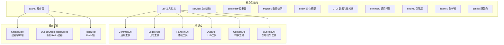
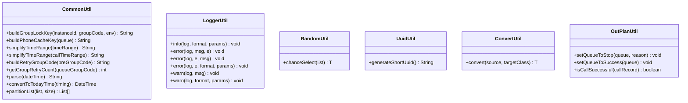
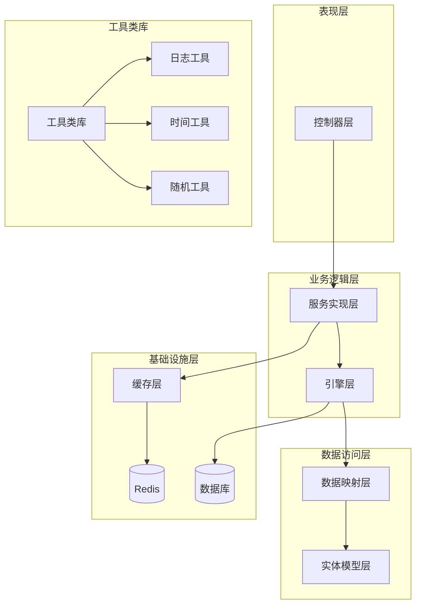
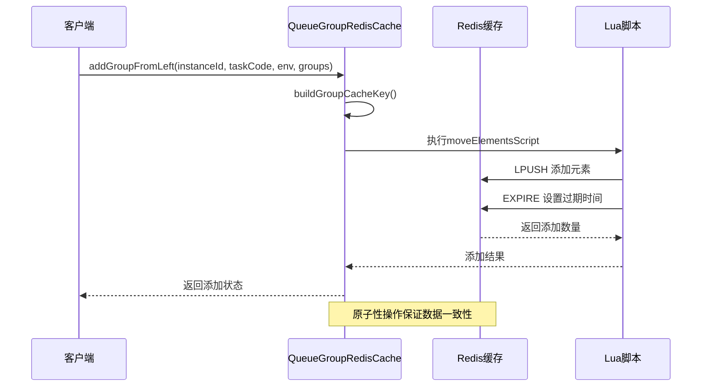
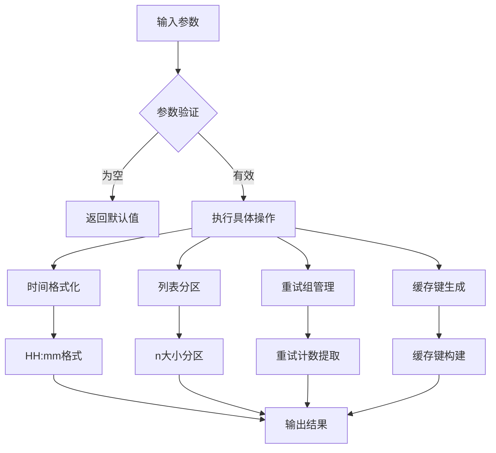
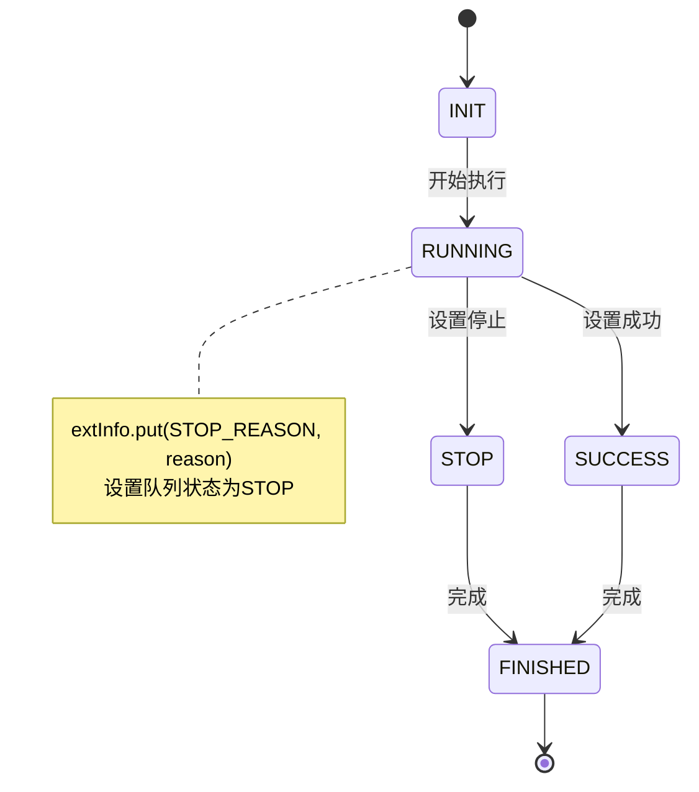
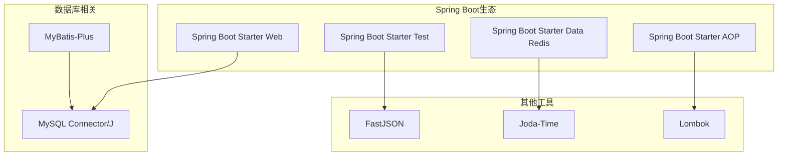

# 工具类库

<cite>
**本文档引用的文件**
- [CommonUtil.java](file://src/main/java/org/qianye/util/CommonUtil.java)
- [ConvertUtil.java](file://src/main/java/org/qianye/util/ConvertUtil.java)
- [LoggerUtil.java](file://src/main/java/org/qianye/util/LoggerUtil.java)
- [OutPlanUtil.java](file://src/main/java/org/qianye/util/OutPlanUtil.java)
- [RandomUtil.java](file://src/main/java/org/qianye/util/RandomUtil.java)
- [UuidUtil.java](file://src/main/java/org/qianye/util/UuidUtil.java)
- [CacheClient.java](file://src/main/java/org/qianye/cache/CacheClient.java)
- [QueueGroupRedisCache.java](file://src/main/java/org/qianye/cache/QueueGroupRedisCache.java)
- [OutCallApplication.java](file://src/main/java/org/qianye/OutCallApplication.java)
- [pom.xml](file://pom.xml)
- [application.properties](file://src/main/resources/application.properties)
- [CommonConstants.java](file://src/main/java/org/qianye/common/CommonConstants.java)
</cite>

## 目录
1. [简介](#简介)
2. [项目结构](#项目结构)
3. [核心组件](#核心组件)
4. [架构概览](#架构概览)
5. [详细组件分析](#详细组件分析)
6. [依赖关系分析](#依赖关系分析)
7. [性能考虑](#性能考虑)
8. [故障排除指南](#故障排除指南)
9. [结论](#结论)

## 简介

这是一个基于Spring Boot构建的外呼调度系统工具类库。该项目提供了完整的外呼任务管理、队列调度、Redis缓存管理和日志处理等功能。工具类库包含多个专门的工具类，涵盖了数据处理、缓存操作、日志记录、随机选择和UUID生成等核心功能。

该系统采用分层架构设计，包括表现层、业务逻辑层、数据访问层和缓存层，通过Redis实现高性能的队列管理和任务调度。

## 项目结构

项目采用标准的Maven多模块结构，主要包含以下核心包：



**图表来源**
- [CommonUtil.java](file://src/main/java/org/qianye/util/CommonUtil.java#L1-L102)
- [LoggerUtil.java](file://src/main/java/org/qianye/util/LoggerUtil.java#L1-L55)
- [QueueGroupRedisCache.java](file://src/main/java/org/qianye/cache/QueueGroupRedisCache.java#L1-L190)

**章节来源**
- [pom.xml](file://pom.xml#L1-L91)
- [application.properties](file://src/main/resources/application.properties#L1-L14)

## 核心组件

### 工具类库概述

工具类库是整个系统的基础支撑组件，提供了各种实用的功能模块：

1. **数据处理工具** - 处理时间格式、列表分区、重试组管理等
2. **缓存操作工具** - Redis缓存管理、队列操作、锁机制
3. **日志处理工具** - SLF4J封装、格式化输出、异常处理
4. **随机选择工具** - 基于ThreadLocalRandom的随机选择
5. **标识符生成工具** - UUID生成、短UUID生成
6. **转换工具** - 对象类型转换、数据格式转换

### 核心工具类功能



**图表来源**
- [CommonUtil.java](file://src/main/java/org/qianye/util/CommonUtil.java#L12-L101)
- [LoggerUtil.java](file://src/main/java/org/qianye/util/LoggerUtil.java#L8-L54)
- [RandomUtil.java](file://src/main/java/org/qianye/util/RandomUtil.java#L6-L13)
- [UuidUtil.java](file://src/main/java/org/qianye/util/UuidUtil.java#L5-L9)
- [ConvertUtil.java](file://src/main/java/org/qianye/util/ConvertUtil.java#L3-L12)
- [OutPlanUtil.java](file://src/main/java/org/qianye/util/OutPlanUtil.java#L15-L42)

**章节来源**
- [CommonUtil.java](file://src/main/java/org/qianye/util/CommonUtil.java#L1-L102)
- [LoggerUtil.java](file://src/main/java/org/qianye/util/LoggerUtil.java#L1-L55)
- [RandomUtil.java](file://src/main/java/org/qianye/util/RandomUtil.java#L1-L14)
- [UuidUtil.java](file://src/main/java/org/qianye/util/UuidUtil.java#L1-L10)
- [ConvertUtil.java](file://src/main/java/org/qianye/util/ConvertUtil.java#L1-L13)
- [OutPlanUtil.java](file://src/main/java/org/qianye/util/OutPlanUtil.java#L1-L43)

## 架构概览

系统采用分层架构设计，通过工具类库提供核心功能支撑：



**图表来源**
- [OutCallApplication.java](file://src/main/java/org/qianye/OutCallApplication.java#L6-L11)
- [QueueGroupRedisCache.java](file://src/main/java/org/qianye/cache/QueueGroupRedisCache.java#L25-L56)

## 详细组件分析

### 缓存组件分析

#### QueueGroupRedisCache 缓存管理

QueueGroupRedisCache是系统的核心缓存组件，负责外呼队列组的Redis存储和管理：



**图表来源**
- [QueueGroupRedisCache.java](file://src/main/java/org/qianye/cache/QueueGroupRedisCache.java#L61-L85)
- [QueueGroupRedisCache.java](file://src/main/java/org/qianye/cache/QueueGroupRedisCache.java#L167-L181)

#### CacheClient 缓存客户端

CacheClient提供基础的缓存操作接口，目前为占位实现：

| 方法 | 参数 | 功能描述 |
|------|------|----------|
| putNotExist | key, value, expireSeconds | 仅在不存在时设置键值 |
| delete | key | 删除指定键 |
| exists | lockKey | 检查键是否存在 |

**章节来源**
- [QueueGroupRedisCache.java](file://src/main/java/org/qianye/cache/QueueGroupRedisCache.java#L1-L190)
- [CacheClient.java](file://src/main/java/org/qianye/cache/CacheClient.java#L1-L24)

### 工具类详细分析

#### CommonUtil 通用工具类

CommonUtil提供多种实用的工具方法：



**图表来源**
- [CommonUtil.java](file://src/main/java/org/qianye/util/CommonUtil.java#L23-L100)

##### 时间处理功能

CommonUtil的时间处理功能包括：
- `parse(DateTime dateTime)` - 将DateTime转换为"HH:mm"格式字符串
- `convertToTodayTime(String timing)` - 将时间字符串转换为今天的DateTime对象
- `simplifyTimeRange()` - 简化时间范围表示

##### 列表处理功能

- `partitionList(List<T> list, int size)` - 将列表按指定大小进行分区
- 支持泛型类型，保持原始列表元素类型

##### 重试组管理

- `buildRetryGroupCode(String preGroupCode)` - 构建重试组编码
- `getGroupRetryCount(String queueGroupCode)` - 获取组的重试次数

**章节来源**
- [CommonUtil.java](file://src/main/java/org/qianye/util/CommonUtil.java#L1-L102)

#### LoggerUtil 日志工具类

LoggerUtil封装了SLF4J Logger，提供统一的日志处理接口：

| 方法 | 功能 | 特点 |
|------|------|------|
| info | 信息级别日志 | 支持占位符格式化 |
| error | 错误级别日志 | 自动识别Throwable参数 |
| warn | 警告级别日志 | 支持格式化输出 |

LoggerUtil的主要优势：
- 统一的日志格式化处理
- 自动的级别检查，避免不必要的日志开销
- 支持可变参数的格式化输出
- 自动处理异常堆栈的附加输出

**章节来源**
- [LoggerUtil.java](file://src/main/java/org/qianye/util/LoggerUtil.java#L1-L55)

#### RandomUtil 随机工具类

RandomUtil基于ThreadLocalRandom实现高效的随机选择：

```mermaid
flowchart TD
A[输入列表] --> B{列表验证}
B --> |为空| C[返回null]
B --> |非空| D[计算随机索引]
D --> E[ThreadLocalRandom.current().nextInt(size)]
E --> F[返回随机元素]
C --> G[结束]
F --> G
```

**图表来源**
- [RandomUtil.java](file://src/main/java/org/qianye/util/RandomUtil.java#L7-L12)

**章节来源**
- [RandomUtil.java](file://src/main/java/org/qianye/util/RandomUtil.java#L1-L14)

#### UuidUtil UUID工具类

UuidUtil提供短UUID生成功能：
- `generateShortUuid()` - 生成16字符的短UUID
- 基于UUID.randomUUID()并去除连字符
- 适用于缓存键和临时标识符生成

**章节来源**
- [UuidUtil.java](file://src/main/java/org/qianye/util/UuidUtil.java#L1-L10)

#### ConvertUtil 类型转换工具

ConvertUtil提供简单的对象类型转换功能：
- 泛型转换方法
- 反射机制创建新实例
- 异常处理和错误提示

**章节来源**
- [ConvertUtil.java](file://src/main/java/org/qianye/util/ConvertUtil.java#L1-L13)

#### OutPlanUtil 外呼计划工具

OutPlanUtil提供外呼计划的状态管理和判断逻辑：



**图表来源**
- [OutPlanUtil.java](file://src/main/java/org/qianye/util/OutPlanUtil.java#L20-L33)

**章节来源**
- [OutPlanUtil.java](file://src/main/java/org/qianye/util/OutPlanUtil.java#L1-L43)

## 依赖关系分析

### Maven依赖配置

项目使用Maven管理依赖，核心依赖包括：



**图表来源**
- [pom.xml](file://pom.xml#L24-L81)

### 核心依赖说明

| 依赖项 | 版本 | 用途 |
|--------|------|------|
| Spring Boot | 2.7.18 | 应用框架基础 |
| MyBatis-Plus | 3.5.5 | 数据库ORM框架 |
| MySQL Connector/J | 8.0.33 | MySQL数据库驱动 |
| FastJSON | 2.0.60 | JSON序列化/反序列化 |
| Joda-Time | 2.14.0 | Java日期时间处理 |
| Lombok | 1.18.36 | 代码简化注解 |

**章节来源**
- [pom.xml](file://pom.xml#L1-L91)

## 性能考虑

### 缓存优化策略

1. **Redis Lua脚本** - 使用Lua脚本保证操作的原子性
2. **连接池管理** - RedisTemplate配置优化连接复用
3. **过期时间控制** - 默认24小时过期时间平衡内存使用
4. **批量操作** - 支持批量添加和移除队列组

### 工具类性能特性

1. **ThreadLocalRandom** - RandomUtil使用线程本地随机数生成器
2. **延迟初始化** - LoggerUtil按需检查日志级别
3. **泛型优化** - CommonUtil的partitionList使用泛型避免装箱拆箱
4. **字符串常量池** - 常用字符串使用静态常量

## 故障排除指南

### 常见问题及解决方案

#### Redis连接问题
- **症状**：缓存操作失败，日志显示连接异常
- **原因**：Redis服务器不可达或配置错误
- **解决**：检查Redis连接配置和网络连通性

#### 缓存键冲突
- **症状**：队列组数据混乱或覆盖
- **原因**：缓存键生成规则不正确
- **解决**：检查buildGroupCacheKey方法的参数组合

#### 日志格式问题
- **症状**：日志输出格式异常或参数不匹配
- **原因**：LoggerUtil使用不当或参数数量不匹配
- **解决**：确保格式字符串与参数数量一致

#### 内存溢出
- **症状**：应用内存使用过高
- **原因**：大量队列组数据未及时清理
- **解决**：检查过期时间设置和清理策略

**章节来源**
- [QueueGroupRedisCache.java](file://src/main/java/org/qianye/cache/QueueGroupRedisCache.java#L81-L84)
- [LoggerUtil.java](file://src/main/java/org/qianye/util/LoggerUtil.java#L37-L41)

## 结论

该工具类库为外呼调度系统提供了完整的基础支撑，具有以下特点：

1. **模块化设计** - 各个工具类职责明确，便于维护和扩展
2. **性能优化** - 采用Redis缓存和高效的数据结构
3. **错误处理** - 完善的异常处理和日志记录机制
4. **可扩展性** - 清晰的接口设计支持功能扩展

推荐的后续改进方向：
- 完善CacheClient的Redis实现
- 增加更多的单元测试覆盖
- 优化缓存策略和过期时间配置
- 添加监控和指标收集功能