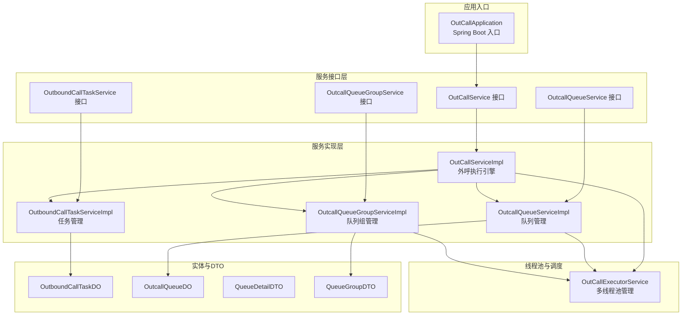
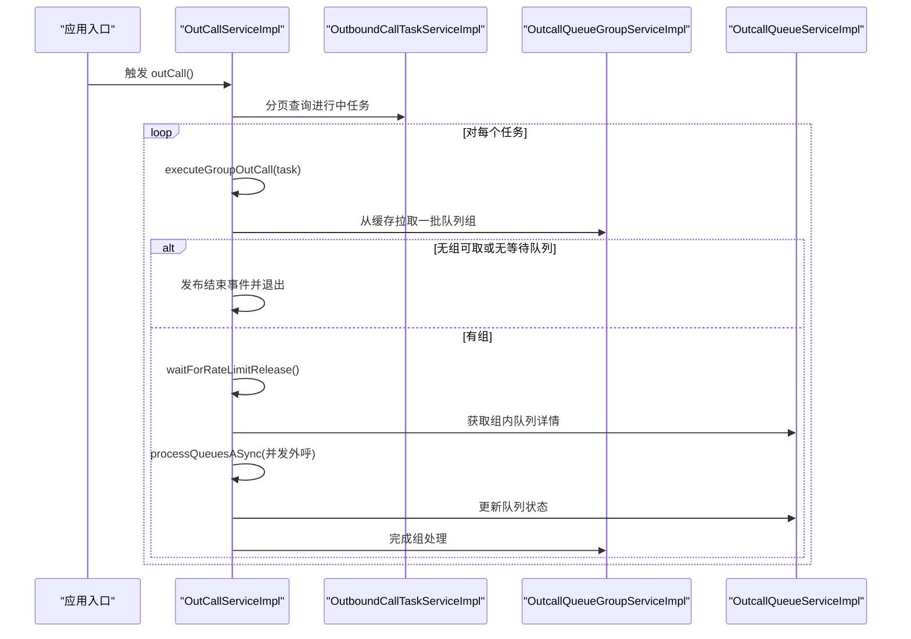
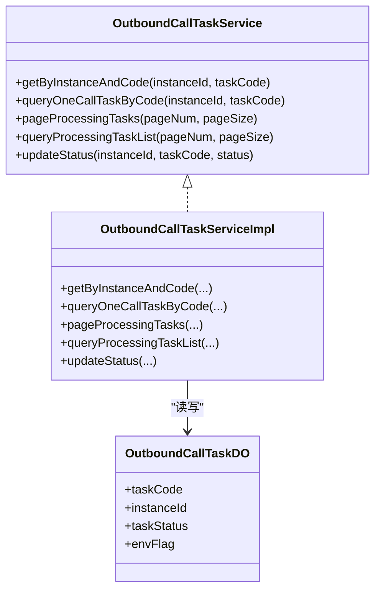
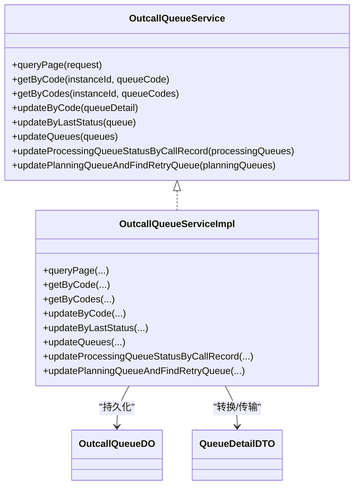
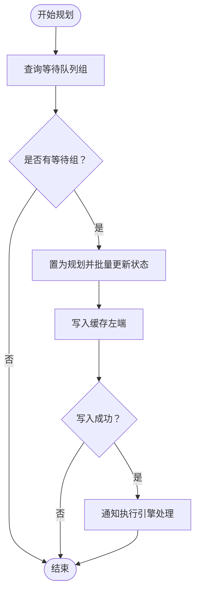
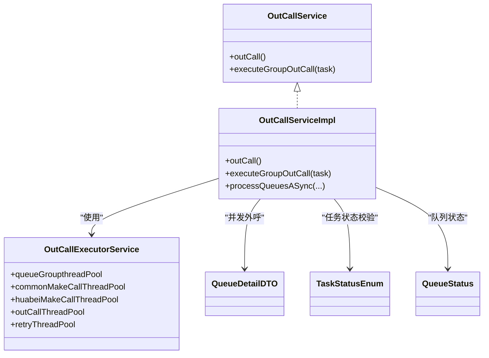
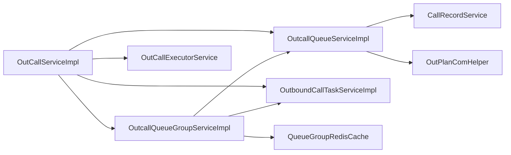

# 核心功能模块

<cite>
**本文引用的文件**
- [OutCallApplication.java](file://src/main/java/org/qianye/OutCallApplication.java)
- [OutCallService.java](file://src/main/java/org/qianye/OutCallService.java)
- [OutCallServiceImpl.java](file://src/main/java/org/qianye/OutCallServiceImpl.java)
- [OutCallExecutorService.java](file://src/main/java/org/qianye/OutCallExecutorService.java)
- [OutcallQueueService.java](file://src/main/java/org/qianye/OutcallQueueService.java)
- [OutcallQueueServiceImpl.java](file://src/main/java/org/qianye/service/impl/OutcallQueueServiceImpl.java)
- [OutcallQueueGroupService.java](file://src/main/java/org/qianye/OutcallQueueGroupService.java)
- [OutcallQueueGroupServiceImpl.java](file://src/main/java/org/qianye/service/impl/OutcallQueueGroupServiceImpl.java)
- [OutboundCallTaskService.java](file://src/main/java/org/qianye/service/OutboundCallTaskService.java)
- [OutboundCallTaskServiceImpl.java](file://src/main/java/org/qianye/service/impl/OutboundCallTaskServiceImpl.java)
- [OutboundCallTaskDO.java](file://src/main/java/org/qianye/entity/OutboundCallTaskDO.java)
- [OutcallQueueDO.java](file://src/main/java/org/qianye/entity/OutcallQueueDO.java)
- [QueueDetailDTO.java](file://src/main/java/org/qianye/QueueDetailDTO.java)
- [QueueGroupDTO.java](file://src/main/java/org/qianye/QueueGroupDTO.java)
- [TaskStatusEnum.java](file://src/main/java/org/qianye/TaskStatusEnum.java)
- [QueueStatus.java](file://src/main/java/org/qianye/QueueStatus.java)
</cite>

## 目录
1. [简介](#简介)
2. [项目结构](#项目结构)
3. [核心组件](#核心组件)
4. [架构总览](#架构总览)
5. [详细组件分析](#详细组件分析)
6. [依赖分析](#依赖分析)
7. [性能考虑](#性能考虑)
8. [故障排查指南](#故障排查指南)
9. [结论](#结论)
10. [附录](#附录)

## 简介
本文件面向 Outcall 系统的核心功能模块，围绕四大模块进行系统化说明：外呼任务管理、队列管理、队列组管理、外呼执行引擎。文档从职责边界、业务逻辑与实现细节入手，解释模块间协作关系与数据传递机制，并给出配置项、参数与返回值说明、使用模式、常见问题与解决方案，兼顾初学者易读性与资深开发者所需的技术深度。

## 项目结构
Outcall 采用基于 Spring Boot 的分层架构，核心模块位于 service 层与 controller 层之间，通过服务接口与实现类解耦，配合实体与 DTO 完成数据传输与持久化。

图表来源
- [OutCallApplication.java](file://src/main/java/org/qianye/OutCallApplication.java#L1-L13)
- [OutCallService.java](file://src/main/java/org/qianye/OutCallService.java#L1-L10)
- [OutCallServiceImpl.java](file://src/main/java/org/qianye/OutCallServiceImpl.java#L1-L120)
- [OutcallQueueService.java](file://src/main/java/org/qianye/OutcallQueueService.java#L1-L61)
- [OutcallQueueServiceImpl.java](file://src/main/java/org/qianye/service/impl/OutcallQueueServiceImpl.java#L1-L120)
- [OutcallQueueGroupService.java](file://src/main/java/org/qianye/OutcallQueueGroupService.java)
- [OutcallQueueGroupServiceImpl.java](file://src/main/java/org/qianye/service/impl/OutcallQueueGroupServiceImpl.java#L1-L120)
- [OutboundCallTaskService.java](file://src/main/java/org/qianye/service/OutboundCallTaskService.java)
- [OutboundCallTaskServiceImpl.java](file://src/main/java/org/qianye/service/impl/OutboundCallTaskServiceImpl.java#L1-L66)
- [OutboundCallTaskDO.java](file://src/main/java/org/qianye/entity/OutboundCallTaskDO.java#L1-L96)
- [OutcallQueueDO.java](file://src/main/java/org/qianye/entity/OutcallQueueDO.java#L1-L105)
- [QueueDetailDTO.java](file://src/main/java/org/qianye/QueueDetailDTO.java#L1-L62)
- [QueueGroupDTO.java](file://src/main/java/org/qianye/QueueGroupDTO.java#L1-L43)
- [OutCallExecutorService.java](file://src/main/java/org/qianye/OutCallExecutorService.java#L1-L211)

章节来源
- [OutCallApplication.java](file://src/main/java/org/qianye/OutCallApplication.java#L1-L13)

## 核心组件
- 外呼任务管理：负责任务状态查询、分页查询、状态变更等，支撑执行引擎按任务维度调度。
- 队列管理：负责队列详情的查询、分页、状态更新、按实例/队列码检索、通话记录联动校验等。
- 队列组管理：负责队列组的规划（普通/择时）、状态流转、缓存入队、处理中存活检测与重试生成等。
- 外呼执行引擎：负责扫描进行中的任务、按组拉取队列、限流控制、异步并发外呼、状态回写与事件发布。

章节来源
- [OutboundCallTaskServiceImpl.java](file://src/main/java/org/qianye/service/impl/OutboundCallTaskServiceImpl.java#L1-L66)
- [OutcallQueueServiceImpl.java](file://src/main/java/org/qianye/service/impl/OutcallQueueServiceImpl.java#L1-L120)
- [OutcallQueueGroupServiceImpl.java](file://src/main/java/org/qianye/service/impl/OutcallQueueGroupServiceImpl.java#L1-L120)
- [OutCallServiceImpl.java](file://src/main/java/org/qianye/OutCallServiceImpl.java#L1-L120)

## 架构总览
外呼执行引擎作为中枢，串联任务、队列与队列组三者。任务驱动队列组进入“规划”并写入缓存；引擎从缓存批量取出队列组，再对组内队列并发外呼，完成后回写状态并触发事件。

图表来源
- [OutCallServiceImpl.java](file://src/main/java/org/qianye/OutCallServiceImpl.java#L78-L255)
- [OutcallQueueGroupServiceImpl.java](file://src/main/java/org/qianye/service/impl/OutcallQueueGroupServiceImpl.java#L171-L271)
- [OutcallQueueServiceImpl.java](file://src/main/java/org/qianye/service/impl/OutcallQueueServiceImpl.java#L375-L471)
- [OutboundCallTaskServiceImpl.java](file://src/main/java/org/qianye/service/impl/OutboundCallTaskServiceImpl.java#L40-L56)

## 详细组件分析

### 外呼任务管理
- 职责边界
  - 任务查询：按实例与任务编码查询、分页查询进行中任务、查询任务列表。
  - 状态变更：提供任务状态更新能力。
- 业务逻辑
  - 分页扫描进行中任务，作为外呼执行引擎的输入。
  - 任务状态需满足允许外呼条件，否则跳过。
- 数据模型
  - OutboundCallTaskDO：任务主表，包含任务编码、实例ID、任务状态、环境标识等。
- 关键接口与实现
  - 接口：OutboundCallTaskService
  - 实现：OutboundCallTaskServiceImpl
- 使用模式
  - 执行引擎以分页方式遍历任务，逐个调用执行流程。
- 参数与返回
  - 分页查询返回 PageDTO<OutboundCallTaskDO>，包含记录、总数、页码与大小。
  - 状态更新返回布尔值表示是否成功。

图表来源
- [OutboundCallTaskService.java](file://src/main/java/org/qianye/service/OutboundCallTaskService.java)
- [OutboundCallTaskServiceImpl.java](file://src/main/java/org/qianye/service/impl/OutboundCallTaskServiceImpl.java#L1-L66)
- [OutboundCallTaskDO.java](file://src/main/java/org/qianye/entity/OutboundCallTaskDO.java#L1-L96)

章节来源
- [OutboundCallTaskServiceImpl.java](file://src/main/java/org/qianye/service/impl/OutboundCallTaskServiceImpl.java#L1-L66)
- [OutboundCallTaskDO.java](file://src/main/java/org/qianye/entity/OutboundCallTaskDO.java#L1-L96)

### 队列管理
- 职责边界
  - 队列详情查询：按实例+任务+时间范围查询、按队列码/队列码集合查询。
  - 状态更新：按队列码更新、按最后状态更新、批量更新。
  - 通话记录联动：根据通话记录判断处理中/规划中队列的成功与否，必要时转为停止或重试。
  - 定时巡检：定期扫描处理中队列，依据通话记录回写最终状态。
- 业务逻辑
  - 规划中队列通过通话记录匹配后更新状态；若无记录则标记为需要重试。
  - 处理中队列在指定时间窗口内未见通话记录则判定失败并停止。
- 数据模型
  - OutcallQueueDO：队列表，包含队列码、主被叫、状态、ACID、计数与时间戳等。
  - QueueDetailDTO：对外传输的队列详情对象，含扩展信息与时间字段。
- 关键接口与实现
  - 接口：OutcallQueueService
  - 实现：OutcallQueueServiceImpl
- 使用模式
  - 执行引擎在组内并发外呼后，立即更新队列状态；定时任务兜底校验处理中队列。
- 参数与返回
  - 分页查询返回 PageData<List<QueueDetailDTO>>，包含列表与分页元信息。
  - 状态更新返回布尔值。

图表来源
- [OutcallQueueService.java](file://src/main/java/org/qianye/OutcallQueueService.java#L1-L61)
- [OutcallQueueServiceImpl.java](file://src/main/java/org/qianye/service/impl/OutcallQueueServiceImpl.java#L1-L120)
- [OutcallQueueDO.java](file://src/main/java/org/qianye/entity/OutcallQueueDO.java#L1-L105)
- [QueueDetailDTO.java](file://src/main/java/org/qianye/QueueDetailDTO.java#L1-L62)

章节来源
- [OutcallQueueServiceImpl.java](file://src/main/java/org/qianye/service/impl/OutcallQueueServiceImpl.java#L67-L213)
- [OutcallQueueServiceImpl.java](file://src/main/java/org/qianye/service/impl/OutcallQueueServiceImpl.java#L214-L325)
- [OutcallQueueServiceImpl.java](file://src/main/java/org/qianye/service/impl/OutcallQueueServiceImpl.java#L375-L471)
- [OutcallQueueDO.java](file://src/main/java/org/qianye/entity/OutcallQueueDO.java#L1-L105)
- [QueueDetailDTO.java](file://src/main/java/org/qianye/QueueDetailDTO.java#L1-L62)

### 队列组管理
- 职责边界
  - 规划阶段：将“等待”队列组置为“规划”，写入缓存，供执行引擎消费。
  - 处理阶段：对“处理中”队列组进行存活检测，非存活则生成重试组并停止原组。
  - 查询与更新：支持按条件分页查询、按组码查询、批量状态更新。
- 业务逻辑
  - 普通组与择时组分别规划，择时组按小时粒度筛选。
  - 缓存满载时阻塞等待，避免内存压力。
  - 处理中队列超过阈值未见通话记录则判定失败并停止。
- 数据模型
  - QueueGroupDTO：队列组对象，包含组码、队列码列表、组类型、时间范围、扩展信息等。
- 关键接口与实现
  - 接口：OutcallQueueGroupService（接口名与实现类一致）
  - 实现：OutcallQueueGroupServiceImpl
- 使用模式
  - 执行引擎从缓存批量拉取队列组，再并发处理组内队列。
- 参数与返回
  - 分页查询返回 PageData<List<QueueGroupDTO>>。
  - 状态批量更新按批处理，避免大事务。

图表来源
- [OutcallQueueGroupServiceImpl.java](file://src/main/java/org/qianye/service/impl/OutcallQueueGroupServiceImpl.java#L171-L271)
- [OutcallQueueGroupServiceImpl.java](file://src/main/java/org/qianye/service/impl/OutcallQueueGroupServiceImpl.java#L462-L515)

章节来源
- [OutcallQueueGroupServiceImpl.java](file://src/main/java/org/qianye/service/impl/OutcallQueueGroupServiceImpl.java#L70-L162)
- [OutcallQueueGroupServiceImpl.java](file://src/main/java/org/qianye/service/impl/OutcallQueueGroupServiceImpl.java#L171-L271)
- [OutcallQueueGroupServiceImpl.java](file://src/main/java/org/qianye/service/impl/OutcallQueueGroupServiceImpl.java#L343-L450)
- [OutcallQueueGroupServiceImpl.java](file://src/main/java/org/qianye/service/impl/OutcallQueueGroupServiceImpl.java#L462-L515)
- [QueueGroupDTO.java](file://src/main/java/org/qianye/QueueGroupDTO.java#L1-L43)

### 外呼执行引擎
- 职责边界
  - 任务扫描：分页扫描进行中任务，逐个进入执行流程。
  - 组级调度：从缓存拉取队列组，校验状态与时间窗，批量并发外呼。
  - 限流与节流：基于限流策略与线程池队列长度控制并发。
  - 状态回写与事件：外呼完成后更新队列状态，发布开始/结束事件。
- 业务逻辑
  - 任务与时间窗校验：仅在允许外呼的时间段内执行。
  - 组状态校验：仅处理处于“规划”状态的组。
  - 并发外呼：按租户区分线程池，避免热点影响。
  - 异常兜底：外呼异常时生成重试计划并解锁。
- 数据模型
  - QueueDetailDTO：并发外呼的最小单元。
  - QueueStatus：队列状态枚举（WAITING/PLANNING/PROCESSING/FAILED/STOP）。
  - TaskStatusEnum：任务状态枚举与允许外呼判断。
- 关键接口与实现
  - 接口：OutCallService
  - 实现：OutCallServiceImpl
  - 线程池：OutCallExecutorService
- 使用模式
  - 外部触发 outCall() 或由定时器调度；内部以任务为单位并发执行。
- 参数与返回
  - 无显式返回值，通过事件与数据库状态反馈结果。
- 性能要点
  - 多线程池隔离不同场景（组处理、通用外呼、华北专属）。
  - 线程池监控与健康日志，便于运维观察。

图表来源
- [OutCallService.java](file://src/main/java/org/qianye/OutCallService.java#L1-L10)
- [OutCallServiceImpl.java](file://src/main/java/org/qianye/OutCallServiceImpl.java#L1-L120)
- [OutCallExecutorService.java](file://src/main/java/org/qianye/OutCallExecutorService.java#L1-L211)
- [QueueDetailDTO.java](file://src/main/java/org/qianye/QueueDetailDTO.java#L1-L62)
- [TaskStatusEnum.java](file://src/main/java/org/qianye/TaskStatusEnum.java#L1-L21)
- [QueueStatus.java](file://src/main/java/org/qianye/QueueStatus.java#L1-L10)

章节来源
- [OutCallServiceImpl.java](file://src/main/java/org/qianye/OutCallServiceImpl.java#L78-L255)
- [OutCallServiceImpl.java](file://src/main/java/org/qianye/OutCallServiceImpl.java#L285-L415)
- [OutCallServiceImpl.java](file://src/main/java/org/qianye/OutCallServiceImpl.java#L455-L578)
- [OutCallServiceImpl.java](file://src/main/java/org/qianye/OutCallServiceImpl.java#L680-L783)
- [OutCallExecutorService.java](file://src/main/java/org/qianye/OutCallExecutorService.java#L1-L211)
- [TaskStatusEnum.java](file://src/main/java/org/qianye/TaskStatusEnum.java#L1-L21)
- [QueueStatus.java](file://src/main/java/org/qianye/QueueStatus.java#L1-L10)

## 依赖分析
- 组件耦合
  - OutCallServiceImpl 依赖 OutcallQueueGroupService、OutcallQueueService、OutboundCallTaskService、OutCallExecutorService 等，形成“执行引擎”中心。
  - OutcallQueueGroupServiceImpl 依赖 OutcallQueueService、OutCallScheduleDrm、QueueGroupRedisCache、TaskPlanService 等，承担“规划与存活检测”职责。
  - OutcallQueueServiceImpl 依赖 CallRecordService、OutPlanComHelper 等，承担“队列状态回写与巡检”职责。
- 外部依赖
  - 线程池与监控：OutCallExecutorService 提供统一线程池与周期日志。
  - 缓存与锁：RedisLock 与 QueueGroupRedisCache 用于缓存与分布式锁。
- 循环依赖
  - 未发现直接循环依赖；服务间通过接口解耦，避免耦合闭环。

图表来源
- [OutCallServiceImpl.java](file://src/main/java/org/qianye/OutCallServiceImpl.java#L34-L53)
- [OutcallQueueGroupServiceImpl.java](file://src/main/java/org/qianye/service/impl/OutcallQueueGroupServiceImpl.java#L37-L68)
- [OutcallQueueServiceImpl.java](file://src/main/java/org/qianye/service/impl/OutcallQueueServiceImpl.java#L33-L42)
- [OutCallExecutorService.java](file://src/main/java/org/qianye/OutCallExecutorService.java#L1-L211)

章节来源
- [OutCallServiceImpl.java](file://src/main/java/org/qianye/OutCallServiceImpl.java#L34-L70)
- [OutcallQueueGroupServiceImpl.java](file://src/main/java/org/qianye/service/impl/OutcallQueueGroupServiceImpl.java#L37-L68)
- [OutcallQueueServiceImpl.java](file://src/main/java/org/qianye/service/impl/OutcallQueueServiceImpl.java#L33-L42)

## 性能考虑
- 线程池隔离
  - 组处理线程池、通用外呼线程池、华北专属线程池、重试线程池与计划任务线程池分离，避免相互干扰。
- 并发控制
  - 通过限流等待与线程池队列长度阈值控制背压，防止过载。
- 批量与分页
  - 任务与队列均采用分页扫描，避免一次性加载过多数据。
- 缓存与锁
  - 队列组通过 Redis 缓存与分布式锁保障规划与执行一致性。
- 监控与可观测
  - 定时输出各线程池活跃数、队列长度与完成任务数，便于容量评估与告警。

章节来源
- [OutCallExecutorService.java](file://src/main/java/org/qianye/OutCallExecutorService.java#L55-L137)
- [OutCallServiceImpl.java](file://src/main/java/org/qianye/OutCallServiceImpl.java#L140-L160)
- [OutcallQueueServiceImpl.java](file://src/main/java/org/qianye/service/impl/OutcallQueueServiceImpl.java#L67-L96)

## 故障排查指南
- 任务无法外呼
  - 检查任务状态是否为“运行中”，以及是否在允许外呼的时间窗内。
  - 查看任务状态枚举与时间窗校验逻辑。
- 队列状态异常
  - 规划中队列无通话记录：通过定时巡检识别并标记为失败/停止，必要时生成重试。
  - 处理中队列长时间无记录：判定失败并停止。
- 队列组未被消费
  - 检查缓存是否达到上限导致写入失败。
  - 核对组状态是否为“规划”，以及是否正确从缓存拉取。
- 并发过高或线程池积压
  - 查看线程池监控日志，调整队列长度阈值或扩容线程池。
  - 检查限流等待是否超时，必要时延长等待时间或降低并发。
- 解锁与重试
  - 外呼异常时会生成重试计划并解锁，关注重试线程池状态与日志。

章节来源
- [OutCallServiceImpl.java](file://src/main/java/org/qianye/OutCallServiceImpl.java#L422-L448)
- [OutcallQueueServiceImpl.java](file://src/main/java/org/qianye/service/impl/OutcallQueueServiceImpl.java#L154-L213)
- [OutcallQueueGroupServiceImpl.java](file://src/main/java/org/qianye/service/impl/OutcallQueueGroupServiceImpl.java#L206-L223)
- [OutCallExecutorService.java](file://src/main/java/org/qianye/OutCallExecutorService.java#L66-L137)

## 结论
Outcall 系统通过“任务—队列组—队列”的三层协同，结合多线程池与缓存/锁机制，实现了高并发、可扩展且可观测的外呼执行体系。执行引擎作为中枢，既保证了任务与时间窗约束，又通过限流与背压策略确保系统稳定。队列与队列组的规划与巡检机制，进一步提升了系统的自愈能力与可靠性。

## 附录
- 配置项与参数
  - 线程池参数：核心/最大线程数、队列容量、存活时间、拒绝策略等，详见线程池定义与监控日志。
  - 限流与等待：等待超时时间、睡眠间隔、队列长度阈值等，详见限流等待逻辑。
  - 任务与队列查询：分页大小、时间范围、状态过滤等，详见服务实现。
- 返回值格式
  - 分页查询返回 PageData<List<T>>，包含列表、页码、大小与总数。
  - 状态更新返回布尔值。
- 使用模式建议
  - 任务状态与时间窗校验前置，避免无效轮询。
  - 规划阶段严格控制缓存写入，处理阶段及时巡检与重试。
  - 并发外呼按租户选择线程池，避免热点拥塞。