# 通用组件

<cite>
**本文档引用的文件**
- [OutCallApplication.java](file://src/main/java/org/qianye/OutCallApplication.java)
- [CommonConstants.java](file://src/main/java/org/qianye/common/CommonConstants.java)
- [OutCallResult.java](file://src/main/java/org/qianye/common/OutCallResult.java)
- [RPCResult.java](file://src/main/java/org/qianye/common/RPCResult.java)
- [Result.java](file://src/main/java/org/qianye/common/Result.java)
- [TaskStatusEnum.java](file://src/main/java/org/qianye/common/TaskStatusEnum.java)
- [QueueStatus.java](file://src/main/java/org/qianye/common/QueueStatus.java)
- [GroupStatus.java](file://src/main/java/org/qianye/common/GroupStatus.java)
- [QueueGroupType.java](file://src/main/java/org/qianye/common/QueueGroupType.java)
- [PageData.java](file://src/main/java/org/qianye/common/PageData.java)
- [CommonUtil.java](file://src/main/java/org/qianye/util/CommonUtil.java)
- [ConvertUtil.java](file://src/main/java/org/qianye/util/ConvertUtil.java)
- [CacheClient.java](file://src/main/java/org/qianye/cache/CacheClient.java)
- [RedisLock.java](file://src/main/java/org/qianye/cache/RedisLock.java)
- [QueueGroupRedisCache.java](file://src/main/java/org/qianye/cache/QueueGroupRedisCache.java)
</cite>

## 目录
1. [简介](#简介)
2. [项目结构](#项目结构)
3. [核心组件](#核心组件)
4. [架构概览](#架构概览)
5. [详细组件分析](#详细组件分析)
6. [依赖关系分析](#依赖关系分析)
7. [性能考虑](#性能考虑)
8. [故障排除指南](#故障排除指南)
9. [结论](#结论)

## 简介

OutCall是一个基于Spring Boot的企业级外呼系统，专注于提供高并发、可扩展的电话外呼解决方案。该系统通过模块化的架构设计，将通用功能抽象为可复用的组件，为外呼业务提供了完整的基础设施支持。

系统采用分层架构模式，主要包含以下层次：
- 应用启动层：负责应用初始化和配置加载
- 控制器层：处理HTTP请求和响应
- 服务层：实现业务逻辑和协调各个组件
- 数据访问层：管理数据库交互和缓存操作
- 通用组件层：提供跨模块使用的工具类和基础设施

## 项目结构

OutCall项目采用标准的Maven目录结构，按照功能模块进行组织：

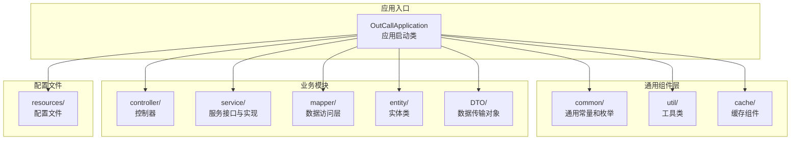

**图表来源**
- [OutCallApplication.java](file://src/main/java/org/qianye/OutCallApplication.java#L1-L12)

**章节来源**
- [OutCallApplication.java](file://src/main/java/org/qianye/OutCallApplication.java#L1-L12)

## 核心组件

### 通用常量组件

通用常量组件提供了系统中广泛使用的常量定义，确保代码的一致性和可维护性。

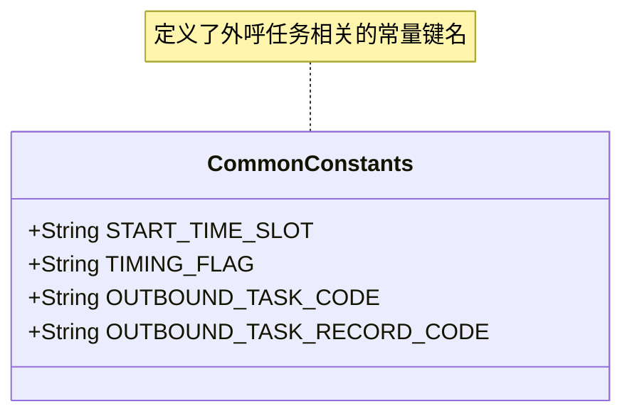

**图表来源**
- [CommonConstants.java](file://src/main/java/org/qianye/common/CommonConstants.java#L1-L15)

### 结果封装组件

结果封装组件提供了统一的响应格式，简化了API接口的开发和调用。

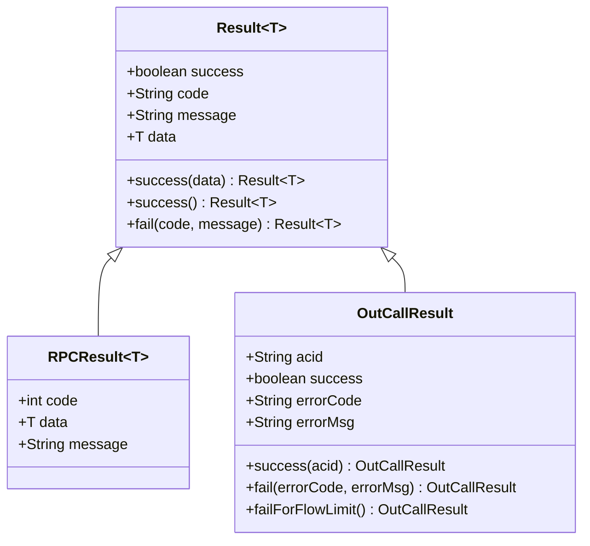

**图表来源**
- [Result.java](file://src/main/java/org/qianye/common/Result.java#L1-L35)
- [RPCResult.java](file://src/main/java/org/qianye/common/RPCResult.java#L1-L11)
- [OutCallResult.java](file://src/main/java/org/qianye/common/OutCallResult.java#L1-L48)

**章节来源**
- [Result.java](file://src/main/java/org/qianye/common/Result.java#L1-L35)
- [RPCResult.java](file://src/main/java/org/qianye/common/RPCResult.java#L1-L11)
- [OutCallResult.java](file://src/main/java/org/qianye/common/OutCallResult.java#L1-L48)

### 状态枚举组件

状态枚举组件定义了系统中各种资源的状态模型，为状态管理和流程控制提供基础。

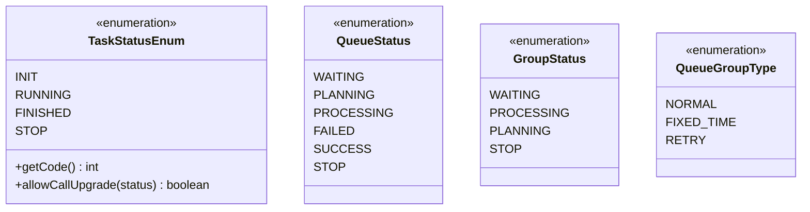

**图表来源**
- [TaskStatusEnum.java](file://src/main/java/org/qianye/common/TaskStatusEnum.java#L1-L22)
- [QueueStatus.java](file://src/main/java/org/qianye/common/QueueStatus.java#L1-L11)
- [GroupStatus.java](file://src/main/java/org/qianye/common/GroupStatus.java#L1-L9)
- [QueueGroupType.java](file://src/main/java/org/qianye/common/QueueGroupType.java#L1-L11)

**章节来源**
- [TaskStatusEnum.java](file://src/main/java/org/qianye/common/TaskStatusEnum.java#L1-L22)
- [QueueStatus.java](file://src/main/java/org/qianye/common/QueueStatus.java#L1-L11)
- [GroupStatus.java](file://src/main/java/org/qianye/common/GroupStatus.java#L1-L9)
- [QueueGroupType.java](file://src/main/java/org/qianye/common/QueueGroupType.java#L1-L11)

### 分页数据组件

分页数据组件提供了标准化的分页查询结果封装，支持各种数据类型的分页展示。

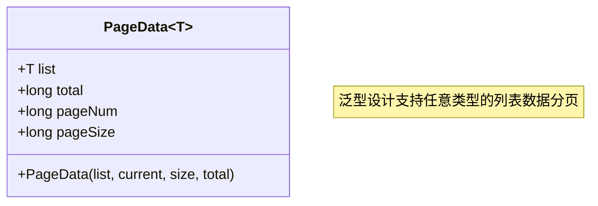

**图表来源**
- [PageData.java](file://src/main/java/org/qianye/common/PageData.java#L1-L24)

**章节来源**
- [PageData.java](file://src/main/java/org/qianye/common/PageData.java#L1-L24)

## 架构概览

OutCall系统的整体架构采用了分层设计和模块化组织，各组件之间通过清晰的接口进行交互。

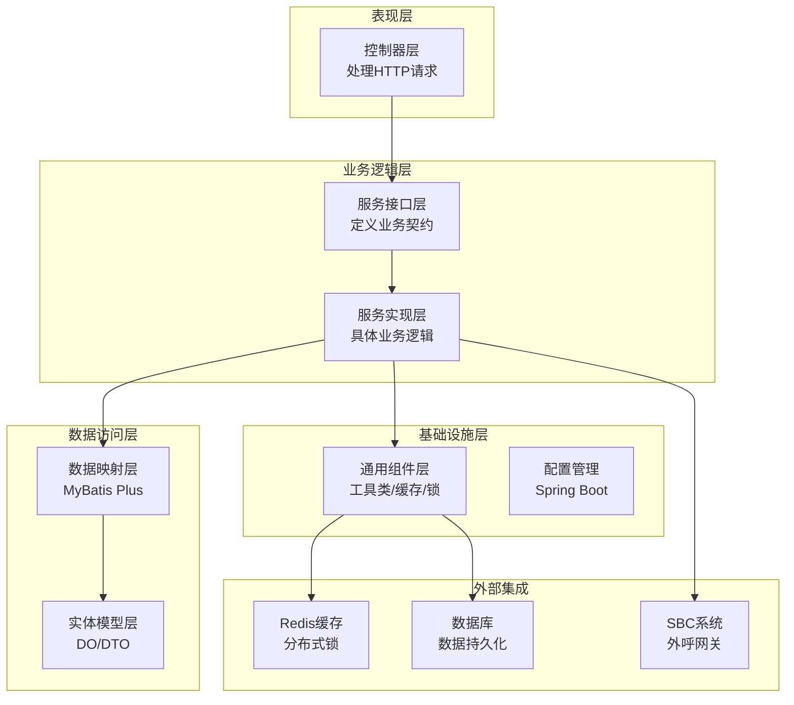

**图表来源**
- [OutCallApplication.java](file://src/main/java/org/qianye/OutCallApplication.java#L1-L12)

## 详细组件分析

### 工具类组件

工具类组件提供了系统运行所需的各种辅助功能，包括数据转换、时间处理、缓存键生成等。

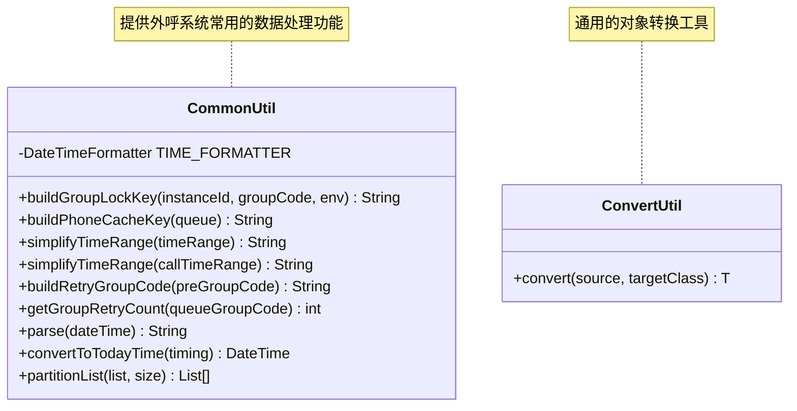

**图表来源**
- [CommonUtil.java](file://src/main/java/org/qianye/util/CommonUtil.java#L1-L102)
- [ConvertUtil.java](file://src/main/java/org/qianye/util/ConvertUtil.java#L1-L13)

#### 缓存客户端组件

缓存客户端组件为系统提供了统一的缓存访问接口，目前处于待完善状态。

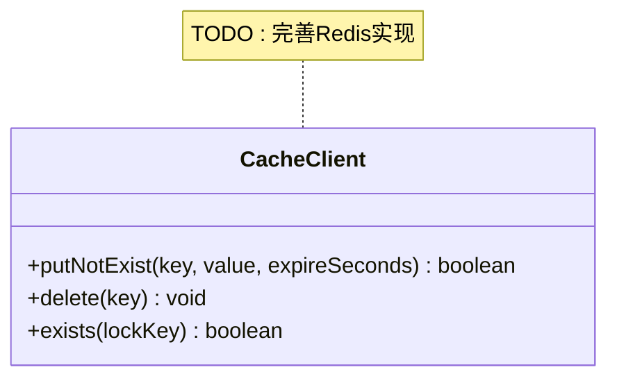

**图表来源**
- [CacheClient.java](file://src/main/java/org/qianye/cache/CacheClient.java#L1-L24)

**章节来源**
- [CommonUtil.java](file://src/main/java/org/qianye/util/CommonUtil.java#L1-L102)
- [ConvertUtil.java](file://src/main/java/org/qianye/util/ConvertUtil.java#L1-L13)
- [CacheClient.java](file://src/main/java/org/qianye/cache/CacheClient.java#L1-L24)

### 分布式锁组件

分布式锁组件基于Redis实现了高性能的分布式锁机制，支持自动续期和异常处理。

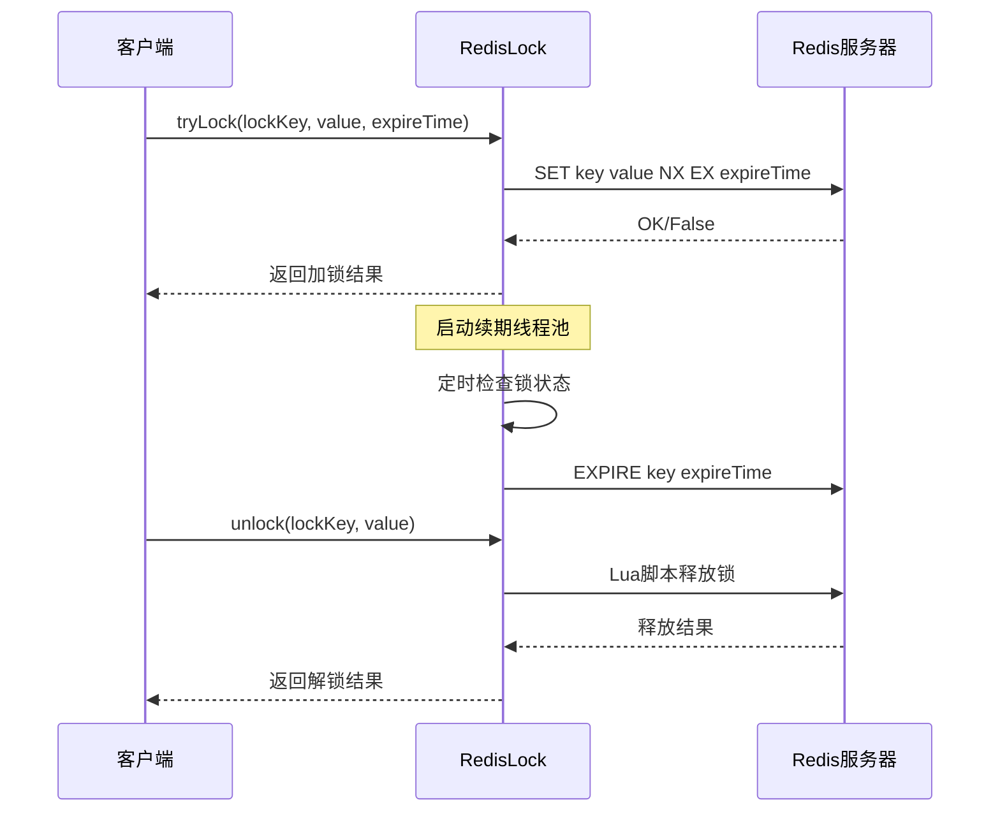

**图表来源**
- [RedisLock.java](file://src/main/java/org/qianye/cache/RedisLock.java#L1-L305)

#### 队列组Redis缓存组件

队列组Redis缓存组件提供了高性能的队列组存储和访问能力，支持原子操作和Lua脚本优化。

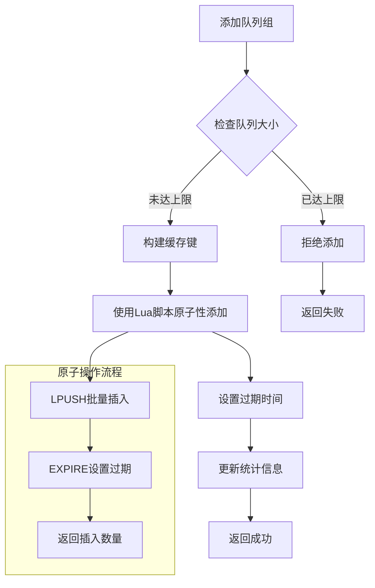

**图表来源**
- [QueueGroupRedisCache.java](file://src/main/java/org/qianye/cache/QueueGroupRedisCache.java#L1-L190)

**章节来源**
- [RedisLock.java](file://src/main/java/org/qianye/cache/RedisLock.java#L1-L305)
- [QueueGroupRedisCache.java](file://src/main/java/org/qianye/cache/QueueGroupRedisCache.java#L1-L190)

## 依赖关系分析

系统中的组件依赖关系体现了清晰的分层架构和模块化设计。

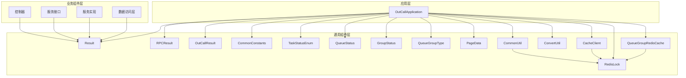

**图表来源**
- [OutCallApplication.java](file://src/main/java/org/qianye/OutCallApplication.java#L1-L12)
- [Result.java](file://src/main/java/org/qianye/common/Result.java#L1-L35)

**章节来源**
- [OutCallApplication.java](file://src/main/java/org/qianye/OutCallApplication.java#L1-L12)
- [Result.java](file://src/main/java/org/qianye/common/Result.java#L1-L35)

## 性能考虑

### 缓存策略优化

系统通过Redis实现多层缓存策略，包括：
- 队列组缓存：使用Redis列表实现高效的队列操作
- 分布式锁：避免锁竞争和死锁问题
- 本地缓存：减少频繁的网络请求

### 并发控制机制

系统采用多种并发控制机制：
- Redis分布式锁：确保同一时间只有一个实例处理特定任务
- 线程池管理：合理配置线程池大小，避免资源耗尽
- 异步处理：通过异步方式提高系统吞吐量

### 内存管理

工具类组件提供了内存友好的设计：
- 对象池化：减少频繁的对象创建和销毁
- 流式处理：支持大数据集的分批处理
- 及时清理：定期清理过期的缓存数据

## 故障排除指南

### 常见问题诊断

1. **缓存失效问题**
   - 检查Redis连接配置
   - 验证缓存键的正确性
   - 确认过期时间设置

2. **分布式锁问题**
   - 检查锁的超时设置
   - 验证解锁逻辑的正确性
   - 监控锁的持有时间

3. **性能问题**
   - 分析慢查询日志
   - 监控Redis性能指标
   - 优化批量操作

### 调试建议

- 启用详细的日志记录
- 使用监控工具跟踪系统状态
- 定期进行压力测试
- 建立完善的告警机制

## 结论

OutCall项目的通用组件设计体现了良好的软件工程实践，通过模块化和分层架构实现了高度的可复用性和可维护性。这些通用组件不仅为当前的外呼业务提供了坚实的基础，也为未来的功能扩展和技术演进奠定了良好的技术基础。

系统的主要优势包括：
- 清晰的架构层次和职责分离
- 完善的错误处理和异常管理
- 高效的缓存和并发控制机制
- 标准化的数据封装和接口设计

通过持续的优化和完善，这些通用组件将继续为OutCall系统的发展提供强有力的技术支撑。