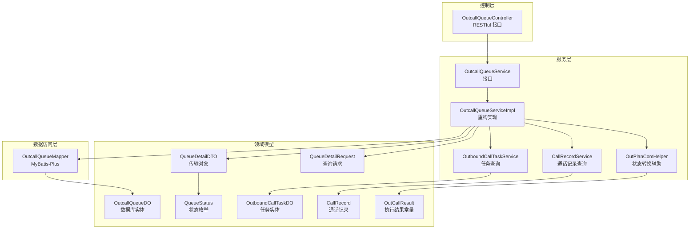
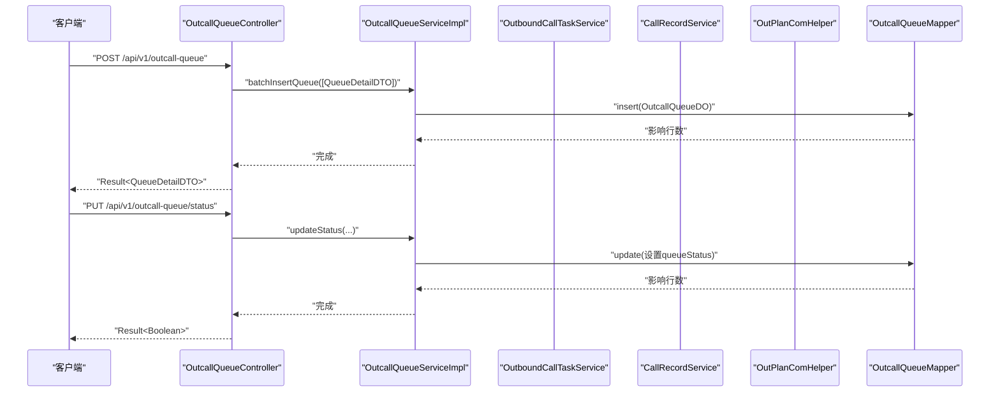
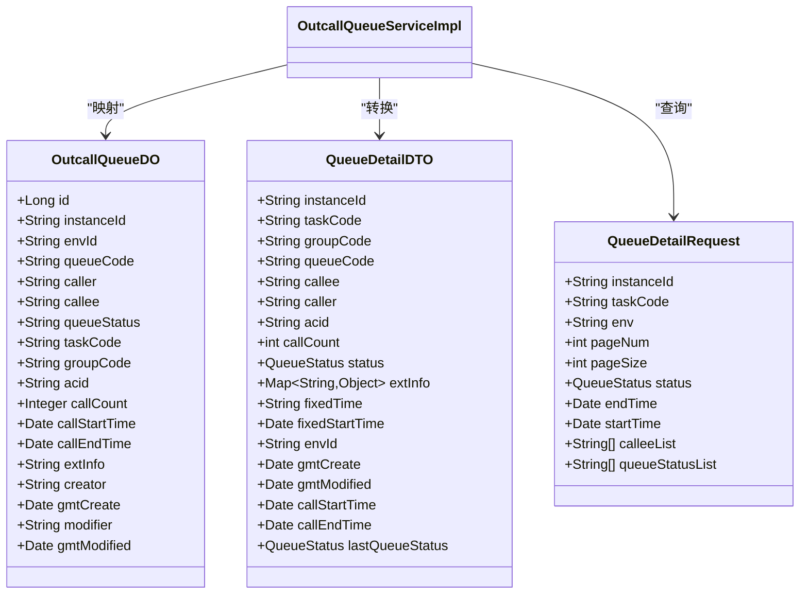
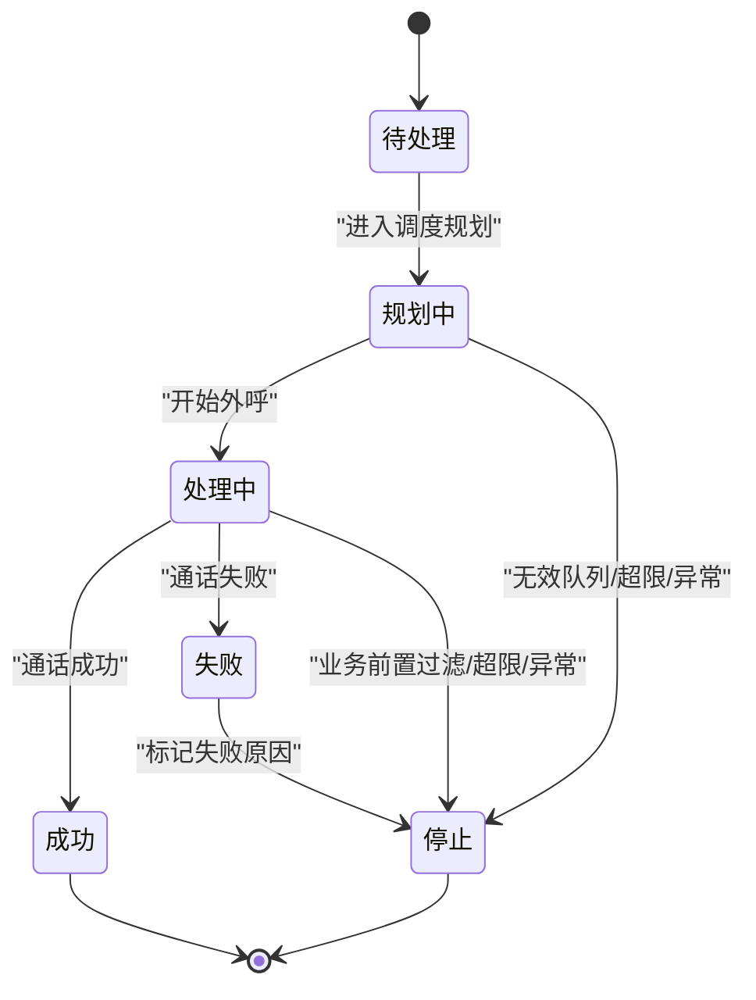
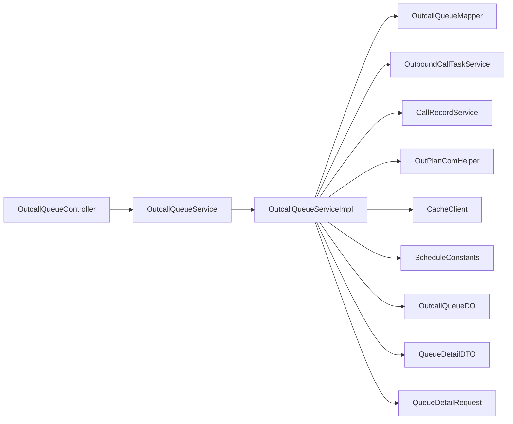
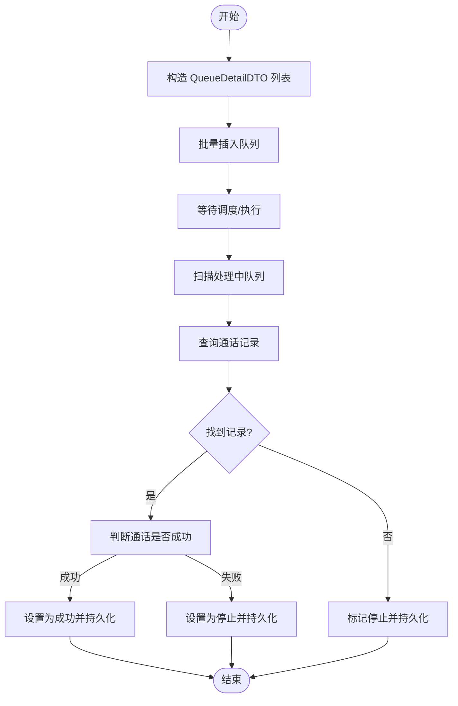

# 队列管理

<cite>
**本文引用的文件**
- [OutcallQueueController.java](file://src/main/java/org/qianye/controller/OutcallQueueController.java)
- [OutcallQueueService.java](file://src/main/java/org/qianye/OutcallQueueService.java)
- [OutcallQueueServiceImpl.java](file://src/main/java/org/qianye/service/impl/OutcallQueueServiceImpl.java)
- [OutcallQueueMapper.java](file://src/main/java/org/qianye/mapper/OutcallQueueMapper.java)
- [OutcallQueueDO.java](file://src/main/java/org/qianye/entity/OutcallQueueDO.java)
- [QueueDetailDTO.java](file://src/main/java/org/qianye/QueueDetailDTO.java)
- [QueueDetailRequest.java](file://src/main/java/org/qianye/QueueDetailRequest.java)
- [QueueStatus.java](file://src/main/java/org/qianye/QueueStatus.java)
- [OutPlanComHelper.java](file://src/main/java/org/qianye/OutPlanComHelper.java)
- [OutCallResult.java](file://src/main/java/org/qianye/OutCallResult.java)
- [OutboundCallTaskService.java](file://src/main/java/org/qianye/service/OutboundCallTaskService.java)
- [OutboundCallTaskDO.java](file://src/main/java/org/qianye/entity/OutboundCallTaskDO.java)
- [CallRecordService.java](file://src/main/java/org/qianye/CallRecordService.java)
- [CallRecord.java](file://src/main/java/org/qianye/CallRecord.java)
- [CacheClient.java](file://src/main/java/org/qianye/CacheClient.java)
- [ScheduleConstants.java](file://src/main/java/org/qianye/ScheduleConstants.java)
</cite>

## 更新摘要
**变更内容**
- 更新 OutcallQueueServiceImpl 的重构实现，移除 QueueGroupRuntimeProvider 依赖
- 简化队列管理逻辑，优化状态校正和批量处理流程
- 更新服务层架构图，反映新的实现模式
- 修订性能考量和故障排查指南

## 目录
1. [简介](#简介)
2. [项目结构](#项目结构)
3. [核心组件](#核心组件)
4. [架构总览](#架构总览)
5. [详细组件分析](#详细组件分析)
6. [依赖关系分析](#依赖关系分析)
7. [性能考量](#性能考量)
8. [故障排查指南](#故障排查指南)
9. [结论](#结论)
10. [附录](#附录)

## 简介
本文件系统性梳理"队列管理"模块，围绕外呼队列的创建、添加、删除、状态更新与查询能力展开，重点覆盖：
- RESTful 控制器接口与请求参数
- 队列实体设计与关键字段语义
- 队列状态管理机制与状态转换
- 队列与外呼任务的关联关系及调度作用
- 实际操作示例（以路径引用代替具体代码）
- 与其他模块的集成与数据一致性保障

**更新** 本版本反映了 OutcallQueueServiceImpl 的重大重构，移除了复杂的 QueueGroupRuntimeProvider 依赖，简化了队列管理逻辑，提升了系统的可维护性和性能。

## 项目结构
队列管理模块采用典型的分层架构：
- 控制层：对外暴露 RESTful 接口
- 服务层：定义业务契约与实现复杂流程
- 数据访问层：MyBatis-Plus Mapper 映射数据库表
- 实体与 DTO：承载数据模型与传输对象
- 辅助组件：状态转换、结果封装、常量配置等

**图表来源**
- [OutcallQueueController.java](file://src/main/java/org/qianye/controller/OutcallQueueController.java#L1-L69)
- [OutcallQueueService.java](file://src/main/java/org/qianye/OutcallQueueService.java#L1-L54)
- [OutcallQueueServiceImpl.java](file://src/main/java/org/qianye/service/impl/OutcallQueueServiceImpl.java#L1-L503)
- [OutcallQueueMapper.java](file://src/main/java/org/qianye/mapper/OutcallQueueMapper.java)
- [OutcallQueueDO.java](file://src/main/java/org/qianye/entity/OutcallQueueDO.java#L1-L87)
- [QueueDetailDTO.java](file://src/main/java/org/qianye/QueueDetailDTO.java#L1-L54)
- [QueueDetailRequest.java](file://src/main/java/org/qianye/QueueDetailRequest.java#L1-L27)
- [QueueStatus.java](file://src/main/java/org/qianye/QueueStatus.java#L1-L10)
- [OutboundCallTaskService.java](file://src/main/java/org/qianye/service/OutboundCallTaskService.java)
- [OutboundCallTaskDO.java](file://src/main/java/org/qianye/entity/OutboundCallTaskDO.java)
- [CallRecordService.java](file://src/main/java/org/qianye/CallRecordService.java)
- [CallRecord.java](file://src/main/java/org/qianye/CallRecord.java)
- [OutPlanComHelper.java](file://src/main/java/org/qianye/OutPlanComHelper.java#L1-L45)
- [OutCallResult.java](file://src/main/java/org/qianye/OutCallResult.java)

**章节来源**
- [OutcallQueueController.java](file://src/main/java/org/qianye/controller/OutcallQueueController.java#L1-L69)
- [OutcallQueueService.java](file://src/main/java/org/qianye/OutcallQueueService.java#L1-L54)
- [OutcallQueueServiceImpl.java](file://src/main/java/org/qianye/service/impl/OutcallQueueServiceImpl.java#L1-L503)

## 核心组件
- 控制器：提供队列的创建、删除、更新、按条件查询、分页查询、状态更新等接口
- 服务接口与实现：封装批量插入、按条件查询、分页查询、状态更新、基于通话记录的状态校正、按最后状态更新等
- 数据访问：基于 MyBatis-Plus 的 Mapper，提供基础增删改查
- 实体与 DTO：OutcallQueueDO 对应数据库表，QueueDetailDTO 作为传输对象，包含扩展信息、状态、时间戳等
- 状态与结果：QueueStatus 定义队列状态，OutCallResult 提供执行结果常量
- 协作组件：OutboundCallTaskService 提供任务查询，CallRecordService 提供通话记录查询，OutPlanComHelper 提供状态转换辅助

**更新** 重构后的 OutcallQueueServiceImpl 移除了复杂的分组运行时提供者依赖，简化了状态管理和批量处理逻辑，提升了代码的可读性和维护性。

**章节来源**
- [OutcallQueueController.java](file://src/main/java/org/qianye/controller/OutcallQueueController.java#L1-L69)
- [OutcallQueueService.java](file://src/main/java/org/qianye/OutcallQueueService.java#L1-L54)
- [OutcallQueueServiceImpl.java](file://src/main/java/org/qianye/service/impl/OutcallQueueServiceImpl.java#L1-L503)
- [OutcallQueueMapper.java](file://src/main/java/org/qianye/mapper/OutcallQueueMapper.java)
- [OutcallQueueDO.java](file://src/main/java/org/qianye/entity/OutcallQueueDO.java#L1-L87)
- [QueueDetailDTO.java](file://src/main/java/org/qianye/QueueDetailDTO.java#L1-L54)
- [QueueDetailRequest.java](file://src/main/java/org/qianye/QueueDetailRequest.java#L1-L27)
- [QueueStatus.java](file://src/main/java/org/qianye/QueueStatus.java#L1-L10)
- [OutCallResult.java](file://src/main/java/org/qianye/OutCallResult.java)

## 架构总览
队列管理模块通过控制器接收外部请求，调用服务层完成业务处理；服务层与任务服务、通话记录服务协作，依据状态转换规则更新队列状态；最终通过 Mapper 写入数据库。

**更新** 新的实现模式更加简洁，移除了中间层的复杂依赖，直接通过 OutPlanComHelper 进行状态转换，提高了执行效率。

**图表来源**
- [OutcallQueueController.java](file://src/main/java/org/qianye/controller/OutcallQueueController.java#L25-L67)
- [OutcallQueueServiceImpl.java](file://src/main/java/org/qianye/service/impl/OutcallQueueServiceImpl.java#L50-L57)
- [OutcallQueueMapper.java](file://src/main/java/org/qianye/mapper/OutcallQueueMapper.java)

## 详细组件分析

### RESTful API 接口（OutcallQueueController）
- 创建队列
  - 方法：POST /api/v1/outcall-queue
  - 请求体：QueueDetailDTO
  - 行为：调用服务层批量插入单条队列
  - 返回：Result<QueueDetailDTO>
  - 参考路径：[创建接口](file://src/main/java/org/qianye/controller/OutcallQueueController.java#L25-L29)

- 删除队列
  - 方法：DELETE /api/v1/outcall-queue/{id}
  - 路径参数：id（Long）
  - 行为：按主键删除
  - 返回：Result<Void>
  - 参考路径：[删除接口](file://src/main/java/org/qianye/controller/OutcallQueueController.java#L31-L35)

- 更新队列
  - 方法：PUT /api/v1/outcall-queue
  - 请求体：QueueDetailDTO
  - 行为：按实例、任务、队列编码与环境更新
  - 返回：Result<QueueDetailDTO>
  - 参考路径：[更新接口](file://src/main/java/org/qianye/controller/OutcallQueueController.java#L37-L41)

- 查询队列详情
  - 方法：GET /api/v1/outcall-queue/query
  - 参数：instanceId、queueCode、envId
  - 行为：按实例+队列+环境查询
  - 返回：Result<QueueDetailDTO>
  - 参考路径：[查询详情接口](file://src/main/java/org/qianye/controller/OutcallQueueController.java#L43-L48)

- 分页查询队列
  - 方法：GET /api/v1/outcall-queue/page
  - 参数：instanceId、pageNum（默认1）、pageSize（默认20）
  - 行为：构造 QueueDetailRequest 并分页查询
  - 返回：Result<PageData<List<QueueDetailDTO>>>
  - 参考路径：[分页查询接口](file://src/main/java/org/qianye/controller/OutcallQueueController.java#L50-L59)

- 更新队列状态
  - 方法：PUT /api/v1/outcall-queue/status
  - 参数：instanceId、queueCode、envId、status
  - 行为：按实例+队列+环境更新状态
  - 返回：Result<Boolean>
  - 参考路径：[更新状态接口](file://src/main/java/org/qianye/controller/OutcallQueueController.java#L61-L67)

**章节来源**
- [OutcallQueueController.java](file://src/main/java/org/qianye/controller/OutcallQueueController.java#L1-L69)

### 服务接口与实现（OutcallQueueService/OutcallQueueServiceImpl）
**更新** 重构后的 OutcallQueueServiceImpl 移除了 QueueGroupRuntimeProvider 依赖，简化了实现逻辑：

- 批量插入队列
  - 入参：List<QueueDetailDTO>
  - 行为：逐条转换为 OutcallQueueDO 并插入
  - 参考路径：[批量插入实现](file://src/main/java/org/qianye/service/impl/OutcallQueueServiceImpl.java#L474-L501)

- 按实例+队列+环境查询
  - 入参：instanceId、queueCode、envId
  - 行为：构建查询条件并返回 DTO
  - 参考路径：[按条件查询实现](file://src/main/java/org/qianye/service/impl/OutcallQueueServiceImpl.java#L42-L48)

- 更新状态
  - 入参：instanceId、queueCode、envId、status
  - 行为：按条件更新队列状态
  - 参考路径：[更新状态实现](file://src/main/java/org/qianye/service/impl/OutcallQueueServiceImpl.java#L50-L57)

- 分页查询
  - 入参：QueueDetailRequest（包含实例、任务、环境、时间范围、状态或状态列表）
  - 行为：构造查询条件并分页返回
  - 参考路径：[分页查询实现](file://src/main/java/org/qianye/service/impl/OutcallQueueServiceImpl.java#L236-L291)

- 基于通话记录的状态校正（处理中队列）
  - 入参：List<QueueDetailDTO>（处理中）
  - 行为：查询通话记录，判断成功/失败，设置 STOP 或 SUCCESS，并持久化
  - 参考路径：
    - [处理中队列状态校正入口](file://src/main/java/org/qianye/service/impl/OutcallQueueServiceImpl.java#L115-L145)
    - [状态转换辅助](file://src/main/java/org/qianye/OutPlanComHelper.java#L22-L35)
    - [通话记录查询](file://src/main/java/org/qianye/CallRecordService.java)

- 规划中队列状态更新与重试队列识别
  - 入参：List<QueueDetailDTO>（规划中）
  - 行为：匹配通话记录，更新队列信息与状态，返回需重试队列集合
  - 参考路径：[规划中队列处理](file://src/main/java/org/qianye/service/impl/OutcallQueueServiceImpl.java#L148-L207)

- 按最后状态更新队列
  - 入参：QueueDetailDTO（含 lastQueueStatus）
  - 行为：仅在满足"最后状态"条件下更新
  - 参考路径：[按最后状态更新](file://src/main/java/org/qianye/service/impl/OutcallQueueServiceImpl.java#L328-L341)

- 按编码更新队列
  - 入参：QueueDetailDTO
  - 行为：按实例+任务+队列+环境更新
  - 参考路径：[按编码更新](file://src/main/java/org/qianye/service/impl/OutcallQueueServiceImpl.java#L344-L357)

- 按队列编码列表查询
  - 入参：instanceId、queueCodes
  - 行为：分批查询（受批次上限限制），避免 SQL IN 过大
  - 参考路径：[按编码列表查询](file://src/main/java/org/qianye/service/impl/OutcallQueueServiceImpl.java#L395-L419)

- 队列状态检查与自动校正（定时任务）
  - 行为：分布式锁保护，遍历进行中的任务，分页拉取处理中队列，基于通话记录校正状态
  - 参考路径：
    - [状态检查入口](file://src/main/java/org/qianye/service/impl/OutcallQueueServiceImpl.java#L65-L88)
    - [处理中队列循环校正](file://src/main/java/org/qianye/service/impl/OutcallQueueServiceImpl.java#L90-L112)
    - [分布式锁](file://src/main/java/org/qianye/CacheClient.java)

**章节来源**
- [OutcallQueueService.java](file://src/main/java/org/qianye/OutcallQueueService.java#L1-L54)
- [OutcallQueueServiceImpl.java](file://src/main/java/org/qianye/service/impl/OutcallQueueServiceImpl.java#L1-L503)
- [OutPlanComHelper.java](file://src/main/java/org/qianye/OutPlanComHelper.java#L1-L45)
- [CallRecordService.java](file://src/main/java/org/qianye/CallRecordService.java)
- [CacheClient.java](file://src/main/java/org/qianye/CacheClient.java)
- [ScheduleConstants.java](file://src/main/java/org/qianye/ScheduleConstants.java#L1-L14)

### 实体与数据模型（OutcallQueueDO、QueueDetailDTO、QueueDetailRequest）
- OutcallQueueDO（数据库实体）
  - 关键字段：实例标识、环境标识、队列编码、主被叫、队列状态、任务编码、分组编码、通话标识、呼叫次数、时间戳、扩展信息、创建/修改信息
  - 参考路径：[实体定义](file://src/main/java/org/qianye/entity/OutcallQueueDO.java#L1-L87)

- QueueDetailDTO（传输对象）
  - 关键字段：实例、任务、分组、队列编码、主被叫、通话标识、呼叫次数、状态、扩展信息、时间戳、固定时间、上一次状态
  - 参考路径：[DTO 定义](file://src/main/java/org/qianye/QueueDetailDTO.java#L1-L54)

- QueueDetailRequest（查询请求）
  - 关键字段：实例、任务、环境、分页、状态、时间范围、被叫列表、状态列表
  - 参考路径：[查询请求定义](file://src/main/java/org/qianye/QueueDetailRequest.java#L1-L27)

**图表来源**
- [OutcallQueueDO.java](file://src/main/java/org/qianye/entity/OutcallQueueDO.java#L1-L87)
- [QueueDetailDTO.java](file://src/main/java/org/qianye/QueueDetailDTO.java#L1-L54)
- [QueueDetailRequest.java](file://src/main/java/org/qianye/QueueDetailRequest.java#L1-L27)
- [OutcallQueueServiceImpl.java](file://src/main/java/org/qianye/service/impl/OutcallQueueServiceImpl.java#L424-L471)

**章节来源**
- [OutcallQueueDO.java](file://src/main/java/org/qianye/entity/OutcallQueueDO.java#L1-L87)
- [QueueDetailDTO.java](file://src/main/java/org/qianye/QueueDetailDTO.java#L1-L54)
- [QueueDetailRequest.java](file://src/main/java/org/qianye/QueueDetailRequest.java#L1-L27)
- [OutcallQueueServiceImpl.java](file://src/main/java/org/qianye/service/impl/OutcallQueueServiceImpl.java#L424-L471)

### 队列状态管理机制
- 状态枚举：WAITING（待处理）、PLANNING（规划中）、PROCESSING（处理中）、FAILED（失败）、STOP（停止）
- 状态转换来源：
  - 通话记录驱动：根据通话记录判断成功/失败，设置 STOP 或 SUCCESS
  - 业务前置过滤：无效队列直接置 STOP
  - 定时校正：扫描处理中队列，基于通话记录自动修正
- 状态转换辅助：OutPlanComHelper 提供 setQueueToStop、setQueueToSuccess、isCallSuccessful 等方法
- 结果常量：OutCallResult 提供执行结果键值（如执行完成、通话未找到、通话失败等）

**更新** 状态转换逻辑得到简化，移除了复杂的分组运行时处理，直接通过 OutPlanComHelper 进行状态转换，提高了执行效率和代码可读性。

**图表来源**
- [QueueStatus.java](file://src/main/java/org/qianye/QueueStatus.java#L1-L10)
- [OutPlanComHelper.java](file://src/main/java/org/qianye/OutPlanComHelper.java#L22-L35)
- [OutCallResult.java](file://src/main/java/org/qianye/OutCallResult.java)
- [OutcallQueueServiceImpl.java](file://src/main/java/org/qianye/service/impl/OutcallQueueServiceImpl.java#L115-L145)

**章节来源**
- [QueueStatus.java](file://src/main/java/org/qianye/QueueStatus.java#L1-L10)
- [OutPlanComHelper.java](file://src/main/java/org/qianye/OutPlanComHelper.java#L1-L45)
- [OutCallResult.java](file://src/main/java/org/qianye/OutCallResult.java)
- [OutcallQueueServiceImpl.java](file://src/main/java/org/qianye/service/impl/OutcallQueueServiceImpl.java#L115-L145)

### 队列与外呼任务的关联关系
- 关联字段：队列包含 taskCode、groupCode；任务包含任务标识与时间窗等
- 关联作用：
  - 调度：任务驱动队列进入"规划中/处理中"
  - 校验：通过通话记录回溯匹配队列，确保状态与实际执行一致
  - 分页扫描：按任务分页扫描处理中队列，批量校正状态
- 参考路径：
  - [任务实体](file://src/main/java/org/qianye/entity/OutboundCallTaskDO.java)
  - [任务服务](file://src/main/java/org/qianye/service/OutboundCallTaskService.java)
  - [处理中队列扫描](file://src/main/java/org/qianye/service/impl/OutcallQueueServiceImpl.java#L90-L112)

**更新** 重构后的实现更加直接，移除了中间层的复杂处理，直接通过 OutboundCallTaskService 获取进行中的任务，简化了队列与任务的关联逻辑。

**章节来源**
- [OutcallQueueServiceImpl.java](file://src/main/java/org/qianye/service/impl/OutcallQueueServiceImpl.java#L90-L112)
- [OutboundCallTaskDO.java](file://src/main/java/org/qianye/entity/OutboundCallTaskDO.java)
- [OutboundCallTaskService.java](file://src/main/java/org/qianye/service/OutboundCallTaskService.java)

### 实际操作示例（以路径引用代替代码）
- 添加联系人到队列
  - 步骤：构造 QueueDetailDTO，调用批量插入
  - 参考路径：[批量插入调用](file://src/main/java/org/qianye/controller/OutcallQueueController.java#L25-L29)，[批量插入实现](file://src/main/java/org/qianye/service/impl/OutcallQueueServiceImpl.java#L474-L501)

- 批量更新队列状态
  - 步骤：构造 QueueDetailDTO 列表，调用批量更新或按编码更新
  - 参考路径：[批量更新实现](file://src/main/java/org/qianye/service/impl/OutcallQueueServiceImpl.java#L294-L298)，[按编码更新实现](file://src/main/java/org/qianye/service/impl/OutcallQueueServiceImpl.java#L344-L357)

- 查询队列详情
  - 步骤：传入 instanceId、queueCode、envId
  - 参考路径：[查询详情接口](file://src/main/java/org/qianye/controller/OutcallQueueController.java#L43-L48)，[查询实现](file://src/main/java/org/qianye/service/impl/OutcallQueueServiceImpl.java#L42-L48)

- 分页查询队列
  - 步骤：传入 instanceId、pageNum、pageSize，或带状态/时间范围
  - 参考路径：[分页接口](file://src/main/java/org/qianye/controller/OutcallQueueController.java#L50-L59)，[分页实现](file://src/main/java/org/qianye/service/impl/OutcallQueueServiceImpl.java#L236-L291)

- 基于通话记录校正处理中队列
  - 步骤：服务层扫描处理中队列，查询通话记录，调用 OutPlanComHelper 设置状态
  - 参考路径：[处理中校正入口](file://src/main/java/org/qianye/service/impl/OutcallQueueServiceImpl.java#L115-L145)，[状态转换辅助](file://src/main/java/org/qianye/OutPlanComHelper.java#L22-L35)

**更新** 示例保持不变，因为 API 接口没有改变，只是内部实现得到了简化。

**章节来源**
- [OutcallQueueController.java](file://src/main/java/org/qianye/controller/OutcallQueueController.java#L25-L59)
- [OutcallQueueServiceImpl.java](file://src/main/java/org/qianye/service/impl/OutcallQueueServiceImpl.java#L115-L145)
- [OutPlanComHelper.java](file://src/main/java/org/qianye/OutPlanComHelper.java#L22-L35)

## 依赖关系分析
**更新** 重构后的依赖关系更加简洁：

- 控制器依赖服务接口
- 服务实现依赖 Mapper、任务服务、通话记录服务、状态转换辅助、缓存锁
- 实体与 DTO 之间存在双向转换逻辑
- 查询请求支持多维过滤，分页查询与 IN 子句分批处理

**图表来源**
- [OutcallQueueController.java](file://src/main/java/org/qianye/controller/OutcallQueueController.java#L1-L69)
- [OutcallQueueService.java](file://src/main/java/org/qianye/OutcallQueueService.java#L1-L54)
- [OutcallQueueServiceImpl.java](file://src/main/java/org/qianye/service/impl/OutcallQueueServiceImpl.java#L1-L503)
- [OutcallQueueMapper.java](file://src/main/java/org/qianye/mapper/OutcallQueueMapper.java)
- [OutcallQueueDO.java](file://src/main/java/org/qianye/entity/OutcallQueueDO.java#L1-L87)
- [QueueDetailDTO.java](file://src/main/java/org/qianye/QueueDetailDTO.java#L1-L54)
- [QueueDetailRequest.java](file://src/main/java/org/qianye/QueueDetailRequest.java#L1-L27)
- [OutboundCallTaskService.java](file://src/main/java/org/qianye/service/OutboundCallTaskService.java)
- [CallRecordService.java](file://src/main/java/org/qianye/CallRecordService.java)
- [OutPlanComHelper.java](file://src/main/java/org/qianye/OutPlanComHelper.java#L1-L45)
- [CacheClient.java](file://src/main/java/org/qianye/CacheClient.java)
- [ScheduleConstants.java](file://src/main/java/org/qianye/ScheduleConstants.java#L1-L14)

**章节来源**
- [OutcallQueueServiceImpl.java](file://src/main/java/org/qianye/service/impl/OutcallQueueServiceImpl.java#L1-L503)

## 性能考量
**更新** 重构后的性能优化：

- 批量查询限制：按批次（默认 500）处理 IN 子句，避免 SQL 过大
- 分页扫描：对进行中的任务进行分页扫描，避免一次性加载过多数据
- 异步处理：对处理中的队列校正使用异步线程池，提升吞吐
- 缓存锁：定时任务使用分布式锁，避免重复执行
- 字段填充：MyBatis-Plus 自动填充创建/修改时间，减少手动赋值
- 对象映射优化：使用高效的 DO 到 DTO 转换方法，避免 JSON 序列化开销
- 批量更新：直接使用 updateById 进行批量更新，提升性能

**章节来源**
- [ScheduleConstants.java](file://src/main/java/org/qianye/ScheduleConstants.java#L1-L14)
- [OutcallQueueServiceImpl.java](file://src/main/java/org/qianye/service/impl/OutcallQueueServiceImpl.java#L65-L88)
- [OutcallQueueServiceImpl.java](file://src/main/java/org/qianye/service/impl/OutcallQueueServiceImpl.java#L395-L419)
- [OutcallQueueServiceImpl.java](file://src/main/java/org/qianye/service/impl/OutcallQueueServiceImpl.java#L424-L471)

## 故障排查指南
**更新** 基于重构后的实现：

- 状态未按预期更新
  - 检查是否命中"最后状态"条件更新
  - 参考路径：[按最后状态更新](file://src/main/java/org/qianye/service/impl/OutcallQueueServiceImpl.java#L328-L341)

- 处理中队列长时间未完成
  - 检查定时校正任务是否正常运行，确认缓存锁是否生效
  - 参考路径：[状态检查入口](file://src/main/java/org/qianye/service/impl/OutcallQueueServiceImpl.java#L65-L88)，[处理中校正](file://src/main/java/org/qianye/service/impl/OutcallQueueServiceImpl.java#L115-L145)

- 通话记录无法匹配
  - 检查查询条件（acid/callee）与通话记录字段是否一致
  - 参考路径：[通话记录查询](file://src/main/java/org/qianye/CallRecordService.java)

- 批量查询异常或超时
  - 确认批次大小与被叫列表长度限制
  - 参考路径：[按编码列表查询](file://src/main/java/org/qianye/service/impl/OutcallQueueServiceImpl.java#L395-L419)，[批次常量](file://src/main/java/org/qianye/ScheduleConstants.java#L12-L14)

- 对象映射错误
  - 检查 DO 到 DTO 转换过程中的字段映射
  - 参考路径：[对象映射优化](file://src/main/java/org/qianye/service/impl/OutcallQueueServiceImpl.java#L424-L471)

**章节来源**
- [OutcallQueueServiceImpl.java](file://src/main/java/org/qianye/service/impl/OutcallQueueServiceImpl.java#L328-L341)
- [OutcallQueueServiceImpl.java](file://src/main/java/org/qianye/service/impl/OutcallQueueServiceImpl.java#L65-L88)
- [OutcallQueueServiceImpl.java](file://src/main/java/org/qianye/service/impl/OutcallQueueServiceImpl.java#L115-L145)
- [OutcallQueueServiceImpl.java](file://src/main/java/org/qianye/service/impl/OutcallQueueServiceImpl.java#L395-L419)
- [OutcallQueueServiceImpl.java](file://src/main/java/org/qianye/service/impl/OutcallQueueServiceImpl.java#L424-L471)
- [ScheduleConstants.java](file://src/main/java/org/qianye/ScheduleConstants.java#L12-L14)

## 结论
**更新** 队列管理模块通过重大重构，移除了复杂的 QueueGroupRuntimeProvider 依赖，简化了队列管理逻辑，实现了从创建、查询、更新到状态校正的全链路能力。新的实现更加简洁高效，结合任务服务与通话记录服务，系统能够自动校正处理中队列状态，保障数据一致性。通过批次限制、分页扫描与异步处理，系统具备良好的可扩展性与性能表现。

## 附录
- 关键流程图（批量插入与状态校正）

**图表来源**
- [OutcallQueueServiceImpl.java](file://src/main/java/org/qianye/service/impl/OutcallQueueServiceImpl.java#L474-L501)
- [OutcallQueueServiceImpl.java](file://src/main/java/org/qianye/service/impl/OutcallQueueServiceImpl.java#L115-L145)
- [OutPlanComHelper.java](file://src/main/java/org/qianye/OutPlanComHelper.java#L22-L35)