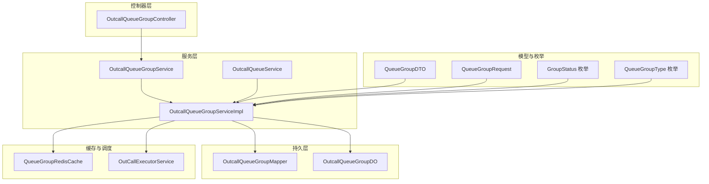
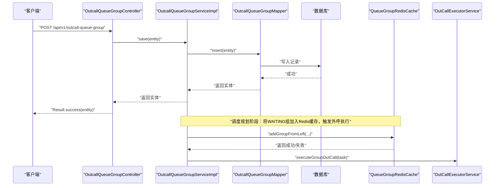
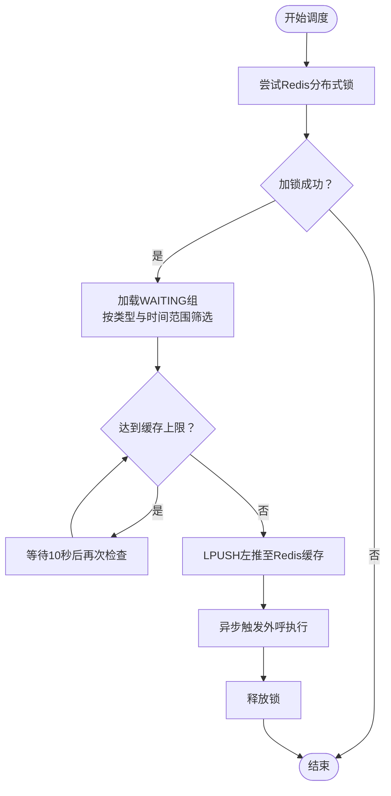
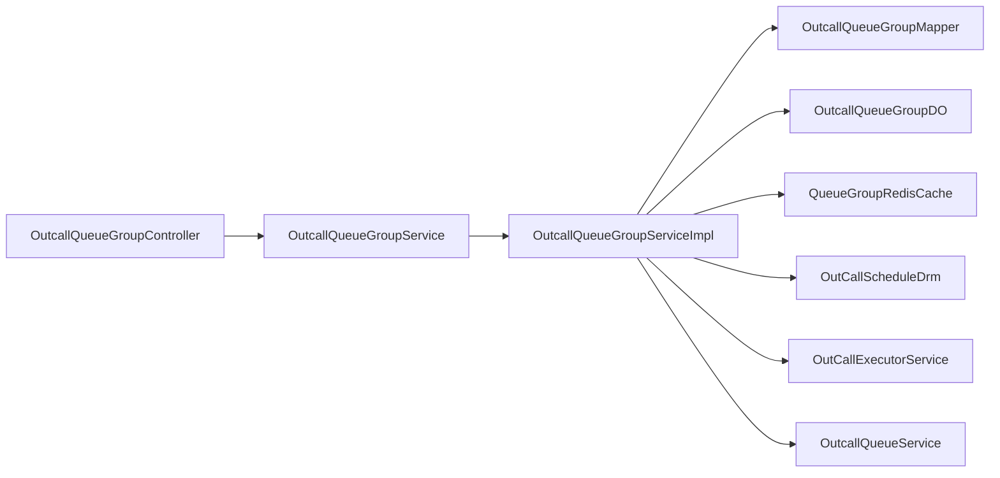

# 队列组管理

<cite>
**本文引用的文件**
- [OutcallQueueGroupController.java](file://src/main/java/org/qianye/controller/OutcallQueueGroupController.java)
- [OutcallQueueGroupService.java](file://src/main/java/org/qianye/service/OutcallQueueGroupService.java)
- [OutcallQueueGroupServiceImpl.java](file://src/main/java/org/qianye/service/impl/OutcallQueueGroupServiceImpl.java)
- [OutcallQueueGroupMapper.java](file://src/main/java/org/qianye/mapper/OutcallQueueGroupMapper.java)
- [OutcallQueueGroupDO.java](file://src/main/java/org/qianye/entity/OutcallQueueGroupDO.java)
- [QueueGroupDTO.java](file://src/main/java/org/qianye/DTO/QueueGroupDTO.java)
- [QueueGroupRequest.java](file://src/main/java/org/qianye/DTO/QueueGroupRequest.java)
- [GroupStatus.java](file://src/main/java/org/qianye/common/GroupStatus.java)
- [QueueGroupType.java](file://src/main/java/org/qianye/common/QueueGroupType.java)
- [OutCallScheduleDrm.java](file://src/main/java/org/qianye/common/OutCallScheduleDrm.java)
- [ScheduleConstants.java](file://src/main/java/org/qianye/DTO/ScheduleConstants.java)
- [QueueGroupRedisCache.java](file://src/main/java/org/qianye/cache/QueueGroupRedisCache.java)
- [OutCallExecutorService.java](file://src/main/java/org/qianye/engine/OutCallExecutorService.java)
- [OutCallService.java](file://src/main/java/org/qianye/engine/OutCallService.java)
- [OutcallQueueService.java](file://src/main/java/org/qianye/service/OutcallQueueService.java)
- [OutcallQueueServiceImpl.java](file://src/main/java/org/qianye/service/impl/OutcallQueueServiceImpl.java)
</cite>

## 更新摘要
**变更内容**
- 更新了状态更新机制的实现细节，从手动批处理改为使用MyBatis-Plus LambdaUpdateWrapper的直接更新方式
- 修正了批量更新性能相关的描述，反映了新的实现方式的优势
- 更新了服务实现要点中的状态更新部分，反映重构后的代码结构

## 目录
1. [引言](#引言)
2. [项目结构](#项目结构)
3. [核心组件](#核心组件)
4. [架构总览](#架构总览)
5. [详细组件分析](#详细组件分析)
6. [依赖分析](#依赖分析)
7. [性能考虑](#性能考虑)
8. [故障排查指南](#故障排查指南)
9. [结论](#结论)
10. [附录](#附录)

## 引言
本文件围绕"队列组管理"模块，系统化阐述队列组的概念、设计与实现，覆盖以下主题：
- 队列组的定义、作用与与单个队列的关系
- 队列组的创建、配置、状态管理与分组调度策略
- OutcallQueueGroupController 的 RESTful API 设计与使用
- OutcallQueueGroupDO 实体的关键字段与含义
- 调度算法与运行机制（优先级、负载均衡、轮询策略等）
- 在复杂外呼场景中的应用与最佳实践
- 与其他模块的协作关系与集成点

## 项目结构
队列组管理模块位于 org.qianye 包下，采用典型的分层架构：控制器层负责对外接口，服务层封装业务逻辑，持久层对接数据库，缓存层通过 Redis 提供高性能的队列组调度缓存。

**图表来源**
- [OutcallQueueGroupController.java](file://src/main/java/org/qianye/controller/OutcallQueueGroupController.java#L1-L70)
- [OutcallQueueGroupService.java](file://src/main/java/org/qianye/service/OutcallQueueGroupService.java#L1-L78)
- [OutcallQueueGroupServiceImpl.java](file://src/main/java/org/qianye/service/impl/OutcallQueueGroupServiceImpl.java#L1-L621)
- [OutcallQueueGroupMapper.java](file://src/main/java/org/qianye/mapper/OutcallQueueGroupMapper.java#L1-L10)
- [OutcallQueueGroupDO.java](file://src/main/java/org/qianye/entity/OutcallQueueGroupDO.java#L1-L95)
- [QueueGroupDTO.java](file://src/main/java/org/qianye/DTO/QueueGroupDTO.java#L1-L43)
- [QueueGroupRequest.java](file://src/main/java/org/qianye/DTO/QueueGroupRequest.java#L1-L25)
- [GroupStatus.java](file://src/main/java/org/qianye/common/GroupStatus.java#L1-L9)
- [QueueGroupType.java](file://src/main/java/org/qianye/common/QueueGroupType.java#L1-L11)
- [QueueGroupRedisCache.java](file://src/main/java/org/qianye/cache/QueueGroupRedisCache.java#L1-L279)
- [OutCallExecutorService.java](file://src/main/java/org/qianye/engine/OutCallExecutorService.java#L39-L87)
- [OutcallQueueService.java](file://src/main/java/org/qianye/service/OutcallQueueService.java#L1-L60)

**章节来源**
- [OutcallQueueGroupController.java](file://src/main/java/org/qianye/controller/OutcallQueueGroupController.java#L1-L70)
- [OutcallQueueGroupService.java](file://src/main/java/org/qianye/service/OutcallQueueGroupService.java#L1-L78)
- [OutcallQueueGroupServiceImpl.java](file://src/main/java/org/qianye/service/impl/OutcallQueueGroupServiceImpl.java#L1-L621)

## 核心组件
- 控制器：提供 RESTful API，支持队列组的增删改查与状态更新
- 服务接口与实现：封装队列组的查询、分页、状态变更、调度规划、缓存交互等
- 实体与模型：OutcallQueueGroupDO 表示数据库实体；QueueGroupDTO/QueueGroupRequest 用于服务层与外部交互
- 缓存与调度：QueueGroupRedisCache 提供 Redis 列表缓存；OutCallExecutorService 提供线程池
- 依赖服务：OutcallQueueService 提供队列详情能力，用于失败重试与状态同步

**章节来源**
- [OutcallQueueGroupController.java](file://src/main/java/org/qianye/controller/OutcallQueueGroupController.java#L12-L70)
- [OutcallQueueGroupService.java](file://src/main/java/org/qianye/service/OutcallQueueGroupService.java#L12-L78)
- [OutcallQueueGroupServiceImpl.java](file://src/main/java/org/qianye/service/impl/OutcallQueueGroupServiceImpl.java#L32-L621)
- [OutcallQueueGroupDO.java](file://src/main/java/org/qianye/entity/OutcallQueueGroupDO.java#L8-L95)
- [QueueGroupDTO.java](file://src/main/java/org/qianye/DTO/QueueGroupDTO.java#L13-L43)
- [QueueGroupRequest.java](file://src/main/java/org/qianye/DTO/QueueGroupRequest.java#L8-L25)
- [QueueGroupRedisCache.java](file://src/main/java/org/qianye/cache/QueueGroupRedisCache.java#L20-L279)
- [OutCallExecutorService.java](file://src/main/java/org/qianye/engine/OutCallExecutorService.java#L39-L87)
- [OutcallQueueService.java](file://src/main/java/org/qianye/service/OutcallQueueService.java#L1-L60)

## 架构总览
队列组管理模块以"控制器-服务-持久层-缓存"的分层方式组织，结合 Redis 列表实现队列组的高效调度与并发控制，并通过线程池异步执行调度计划与外呼执行。

**图表来源**
- [OutcallQueueGroupController.java](file://src/main/java/org/qianye/controller/OutcallQueueGroupController.java#L23-L27)
- [OutcallQueueGroupServiceImpl.java](file://src/main/java/org/qianye/service/impl/OutcallQueueGroupServiceImpl.java#L194-L200)
- [QueueGroupRedisCache.java](file://src/main/java/org/qianye/cache/QueueGroupRedisCache.java#L86-L114)
- [OutCallExecutorService.java](file://src/main/java/org/qianye/engine/OutCallExecutorService.java#L39-L87)

## 详细组件分析

### RESTful API 接口说明（OutcallQueueGroupController）
- POST /api/v1/outcall-queue-group
  - 功能：创建队列组
  - 输入：OutcallQueueGroupDO 实体
  - 输出：Result<OutcallQueueGroupDO>
- DELETE /api/v1/outcall-queue-group/{id}
  - 功能：按 ID 删除队列组
  - 输出：Result<Void>
- PUT /api/v1/outcall-queue-group
  - 功能：更新队列组（全量字段）
  - 输入：OutcallQueueGroupDO 实体
  - 输出：Result<OutcallQueueGroupDO>
- GET /api/v1/outcall-queue-group/{id}
  - 功能：按 ID 查询队列组
  - 输出：Result<OutcallQueueGroupDO>
- GET /api/v1/outcall-queue-group/query
  - 功能：按实例+环境+组编码查询队列组
  - 参数：instanceId, envId, groupCode
  - 输出：Result<OutcallQueueGroupDO>
- GET /api/v1/outcall-queue-group/page
  - 功能：按任务分页查询队列组
  - 参数：instanceId, taskCode, envId, pageNum, pageSize
  - 输出：Result<Page<OutcallQueueGroupDO>>
- PUT /api/v1/outcall-queue-group/status
  - 功能：按实例+环境+组编码更新状态
  - 参数：instanceId, envId, groupCode, status
  - 输出：Result<Boolean>

**章节来源**
- [OutcallQueueGroupController.java](file://src/main/java/org/qianye/controller/OutcallQueueGroupController.java#L23-L68)

### 实体设计（OutcallQueueGroupDO）
- 关键字段与语义
  - id：自增主键
  - instanceId：实例标识
  - envId：环境标识（如 pre/prod）
  - groupCode：组编码（唯一标识）
  - queueCodes：组内队列编码集合（逗号分隔）
  - taskCode：任务编码
  - groupStatus：组状态（WAITING/PROCESSING/PLANNING/STOP）
  - groupStartTime/groupEndTime：组开始/结束时间（用于择时组）
  - priority：优先级（数值越大优先级越高）
  - groupType：组类型（NORMAL/FIXED_TIME/RETRY）
  - extInfo：扩展信息（JSON）
  - creator/modifier/gmtCreate/gmtModified：创建与修改元信息

**章节来源**
- [OutcallQueueGroupDO.java](file://src/main/java/org/qianye/entity/OutcallQueueGroupDO.java#L18-L93)

### 数据模型类（QueueGroupDTO 与 QueueGroupRequest）
- QueueGroupDTO：服务层与外部交互的数据传输对象，包含组编码、状态、队列编码列表、扩展信息、组类型、时间范围等
- QueueGroupRequest：查询请求对象，支持按实例、任务、状态、类型、时间范围、分页等条件过滤

**章节来源**
- [QueueGroupDTO.java](file://src/main/java/org/qianye/DTO/QueueGroupDTO.java#L17-L42)
- [QueueGroupRequest.java](file://src/main/java/org/qianye/DTO/QueueGroupRequest.java#L12-L24)

### 状态与类型枚举
- GroupStatus：WAITING、PROCESSING、PLANNING、STOP
- QueueGroupType：NORMAL、FIXED_TIME、RETRY

**章节来源**
- [GroupStatus.java](file://src/main/java/org/qianye/common/GroupStatus.java#L3-L8)
- [QueueGroupType.java](file://src/main/java/org/qianye/common/QueueGroupType.java#L6-L10)

### 调度与缓存机制
- Redis 列表缓存
  - 使用 LPUSH 左推、RPOP 右弹，实现队列组的入队与出队
  - Lua 脚本保证原子性与性能
  - 支持私有（择时）与公共（普通/重试）两套缓存键空间
- 调度参数
  - 通过 OutCallScheduleDrm 提供批次大小、线程池大小、缓存上限、超时时间等配置
- 线程池
  - OutCallExecutorService 提供队列组规划与外呼执行的线程池，具备监控日志

**图表来源**
- [OutcallQueueGroupServiceImpl.java](file://src/main/java/org/qianye/service/impl/OutcallQueueGroupServiceImpl.java#L149-L213)
- [QueueGroupRedisCache.java](file://src/main/java/org/qianye/cache/QueueGroupRedisCache.java#L86-L123)
- [OutCallExecutorService.java](file://src/main/java/org/qianye/engine/OutCallExecutorService.java#L39-L87)

**章节来源**
- [QueueGroupRedisCache.java](file://src/main/java/org/qianye/cache/QueueGroupRedisCache.java#L82-L123)
- [OutCallScheduleDrm.java](file://src/main/java/org/qianye/common/OutCallScheduleDrm.java#L92-L111)
- [OutcallQueueGroupServiceImpl.java](file://src/main/java/org/qianye/service/impl/OutcallQueueGroupServiceImpl.java#L149-L213)

### 服务实现要点（OutcallQueueGroupServiceImpl）
- 规划与执行
  - startPlanningGroup：按类型（普通/择时）加载 WAITING 组，置为 PLANNING 并写入缓存，随后触发外呼执行
  - handleProcessingGroup：检测 PROCESSING 组是否存活，不存活则置 STOP 并生成重试组
- 查询与分页
  - pageQueueGroup：基于 LambdaQueryWrapper 构建多条件查询，支持按状态、类型、时间范围、分页排序
  - queryQueueGroupByCode/ByCodes：按组编码或编码列表查询
- 状态更新
  - updateQueueGroupStatus：**已重构**，使用 MyBatis-Plus LambdaUpdateWrapper 直接更新，支持批量更新状态与扩展信息，无需手动分批处理
  - updateQueueByGroupCode：按组编码全量更新（含扩展信息、类型、状态、队列编码）

**更新** 状态更新方法已从手动批处理（500条记录限制）和逐条更新改为使用 MyBatis-Plus LambdaUpdateWrapper 的直接更新方式，提高了代码效率和可维护性

**章节来源**
- [OutcallQueueGroupServiceImpl.java](file://src/main/java/org/qianye/service/impl/OutcallQueueGroupServiceImpl.java#L149-L312)
- [OutcallQueueGroupServiceImpl.java](file://src/main/java/org/qianye/service/impl/OutcallQueueGroupServiceImpl.java#L496-L540)
- [OutcallQueueGroupServiceImpl.java](file://src/main/java/org/qianye/service/impl/OutcallQueueGroupServiceImpl.java#L470-L489)

### 与单个队列的关系与区别
- 单个队列（OutcallQueue）：承载具体的待呼号码与状态
- 队列组（OutcallQueueGroup）：对多个队列的逻辑聚合，便于统一调度、限流与状态管理
- 关系
  - 队列组通过 queueCodes 关联多个队列
  - 队列组状态变化会驱动队列状态流转与重试
  - 择时组（FIXED_TIME）按 groupStartTime 精准调度

**章节来源**
- [OutcallQueueGroupDO.java](file://src/main/java/org/qianye/entity/OutcallQueueGroupDO.java#L33-L41)
- [OutcallQueueService.java](file://src/main/java/org/qianye/service/OutcallQueueService.java#L1-L60)
- [OutcallQueueServiceImpl.java](file://src/main/java/org/qianye/service/impl/OutcallQueueServiceImpl.java#L1-L641)

### 复杂场景下的应用
- 多任务并行：通过 instanceId 与 taskCode 进行隔离
- 时间窗控制：普通组按日维度与更新时间窗口筛选，择时组按小时粒度与 groupStartTime 精确匹配
- 超时与重试：PROCESSING 组超时未存活则置 STOP 并生成重试组
- 性能优化：Redis 原子操作、**重构后的直接更新方式**、线程池并发、缓存上限与批次大小

**更新** 性能优化中提到的状态更新已从手动批处理改为直接更新方式，消除了500条记录限制的问题

**章节来源**
- [OutcallQueueGroupServiceImpl.java](file://src/main/java/org/qianye/service/impl/OutcallQueueGroupServiceImpl.java#L215-L271)
- [OutcallQueueGroupServiceImpl.java](file://src/main/java/org/qianye/service/impl/OutcallQueueGroupServiceImpl.java#L273-L312)
- [OutCallScheduleDrm.java](file://src/main/java/org/qianye/common/OutCallScheduleDrm.java#L92-L111)

## 依赖分析
- 控制器依赖服务接口
- 服务实现依赖 Mapper、实体、缓存、调度参数、线程池、任务计划与队列服务
- 缓存依赖 RedisTemplate 与 Lua 脚本
- 调度参数集中于 OutCallScheduleDrm，统一影响批次大小、线程池规模与缓存上限

**图表来源**
- [OutcallQueueGroupController.java](file://src/main/java/org/qianye/controller/OutcallQueueGroupController.java#L1-L70)
- [OutcallQueueGroupService.java](file://src/main/java/org/qianye/service/OutcallQueueGroupService.java#L1-L78)
- [OutcallQueueGroupServiceImpl.java](file://src/main/java/org/qianye/service/impl/OutcallQueueGroupServiceImpl.java#L32-L621)
- [OutcallQueueGroupMapper.java](file://src/main/java/org/qianye/mapper/OutcallQueueGroupMapper.java#L1-L10)
- [OutcallQueueGroupDO.java](file://src/main/java/org/qianye/entity/OutcallQueueGroupDO.java#L1-L95)
- [QueueGroupRedisCache.java](file://src/main/java/org/qianye/cache/QueueGroupRedisCache.java#L1-L279)
- [OutCallScheduleDrm.java](file://src/main/java/org/qianye/common/OutCallScheduleDrm.java#L1-L113)
- [OutCallExecutorService.java](file://src/main/java/org/qianye/engine/OutCallExecutorService.java#L39-L87)
- [OutcallQueueService.java](file://src/main/java/org/qianye/service/OutcallQueueService.java#L1-L60)

## 性能考虑
- **已重构**：状态更新采用 MyBatis-Plus LambdaUpdateWrapper 直接更新，消除了手动批处理（500条记录限制）的需求，提高了代码效率和可维护性
- Redis 原子操作：LPUSH/RPOP 使用 Lua 脚本，保证高并发下的数据一致性
- 线程池并发：队列组规划与外呼执行分别由独立线程池处理，支持可配置的核心与最大线程数
- 缓存上限：当缓存组数量达到阈值时阻塞新增，避免内存膨胀
- 查询优化：按状态、类型、时间范围与分页排序，减少无效扫描

**更新** 性能考虑中强调了状态更新机制的重构优势，消除了之前的500条记录限制问题

**章节来源**
- [ScheduleConstants.java](file://src/main/java/org/qianye/DTO/ScheduleConstants.java#L11-L14)
- [OutCallScheduleDrm.java](file://src/main/java/org/qianye/common/OutCallScheduleDrm.java#L31-L41)
- [OutCallScheduleDrm.java](file://src/main/java/org/qianye/common/OutCallScheduleDrm.java#L92-L111)
- [OutcallQueueGroupServiceImpl.java](file://src/main/java/org/qianye/service/impl/OutcallQueueGroupServiceImpl.java#L496-L540)

## 故障排查指南
- 规划失败
  - 现象：日志提示"GroupPlan fail"
  - 排查：检查 Redis 写入是否成功、缓存上限是否触发、锁是否被其他节点持有
- 超时未存活
  - 现象：PROCESSING 组被置 STOP 并生成重试组
  - 排查：确认机器存活状态、锁是否存在、失败原因是否记录在 extInfo 中
- 分布式锁竞争
  - 现象：日志提示"get lock fail"
  - 排查：检查锁键构建规则、TTL 设置、并发度是否过高
- **已重构**：状态更新异常
  - 现象：批量更新未生效
  - 排查：确认目标记录是否存在、LambdaUpdateWrapper 条件是否正确、事务边界是否正确

**更新** 新增了重构后状态更新异常的排查指南，强调了 LambdaUpdateWrapper 的使用

**章节来源**
- [OutcallQueueGroupServiceImpl.java](file://src/main/java/org/qianye/service/impl/OutcallQueueGroupServiceImpl.java#L149-L213)
- [OutcallQueueGroupServiceImpl.java](file://src/main/java/org/qianye/service/impl/OutcallQueueGroupServiceImpl.java#L273-L312)
- [OutcallQueueGroupServiceImpl.java](file://src/main/java/org/qianye/service/impl/OutcallQueueGroupServiceImpl.java#L496-L540)

## 结论
队列组管理模块通过清晰的分层设计与高效的 Redis 缓存机制，实现了对多队列的统一调度与状态治理。RESTful API 提供了完整的 CRUD 与状态更新能力，配合调度参数与线程池配置，可在复杂外呼场景中实现高吞吐、低延迟与强一致的调度效果。**最新的重构将状态更新机制升级为 MyBatis-Plus LambdaUpdateWrapper 的直接更新方式，消除了手动批处理的限制，提高了代码效率和可维护性。**

## 附录

### API 定义与使用示例（路径参考）
- 创建队列组
  - 请求：POST /api/v1/outcall-queue-group
  - 示例路径：[创建接口](file://src/main/java/org/qianye/controller/OutcallQueueGroupController.java#L23-L27)
- 删除队列组
  - 请求：DELETE /api/v1/outcall-queue-group/{id}
  - 示例路径：[删除接口](file://src/main/java/org/qianye/controller/OutcallQueueGroupController.java#L29-L33)
- 更新队列组
  - 请求：PUT /api/v1/outcall-queue-group
  - 示例路径：[更新接口](file://src/main/java/org/qianye/controller/OutcallQueueGroupController.java#L35-L39)
- 查询队列组
  - 按 ID：GET /api/v1/outcall-queue-group/{id}
  - 按实例+环境+组编码：GET /api/v1/outcall-queue-group/query
  - 分页查询：GET /api/v1/outcall-queue-group/page
  - 示例路径：[查询接口](file://src/main/java/org/qianye/controller/OutcallQueueGroupController.java#L41-L60)
- 更新状态
  - 请求：PUT /api/v1/outcall-queue-group/status
  - 示例路径：[状态更新接口](file://src/main/java/org/qianye/controller/OutcallQueueGroupController.java#L62-L68)

### 配置与调度参数（路径参考）
- 调度参数（OutCallScheduleDrm）
  - 批次大小、线程池大小、缓存上限、超时时间等
  - 示例路径：[调度参数](file://src/main/java/org/qianye/common/OutCallScheduleDrm.java#L1-L113)
- 批量限制常量（ScheduleConstants）
  - 示例路径：[批量限制](file://src/main/java/org/qianye/DTO/ScheduleConstants.java#L1-L14)

### 实体与模型（路径参考）
- 实体：OutcallQueueGroupDO
  - 示例路径：[实体定义](file://src/main/java/org/qianye/entity/OutcallQueueGroupDO.java#L1-L95)
- 数据传输对象：QueueGroupDTO
  - 示例路径：[DTO 定义](file://src/main/java/org/qianye/DTO/QueueGroupDTO.java#L1-L43)
- 查询请求：QueueGroupRequest
  - 示例路径：[请求定义](file://src/main/java/org/qianye/DTO/QueueGroupRequest.java#L1-L25)
- 枚举：GroupStatus、QueueGroupType
  - 示例路径：[状态枚举](file://src/main/java/org/qianye/common/GroupStatus.java#L1-L9)
  - 示例路径：[类型枚举](file://src/main/java/org/qianye/common/QueueGroupType.java#L1-L11)

### 缓存与运行时（路径参考）
- Redis 缓存：QueueGroupRedisCache
  - 示例路径：[缓存实现](file://src/main/java/org/qianye/cache/QueueGroupRedisCache.java#L1-L279)
- 线程池：OutCallExecutorService
  - 示例路径：[线程池配置](file://src/main/java/org/qianye/engine/OutCallExecutorService.java#L39-L87)
- 外呼服务：OutCallService
  - 示例路径：[外呼服务接口](file://src/main/java/org/qianye/engine/OutCallService.java#L1-L9)