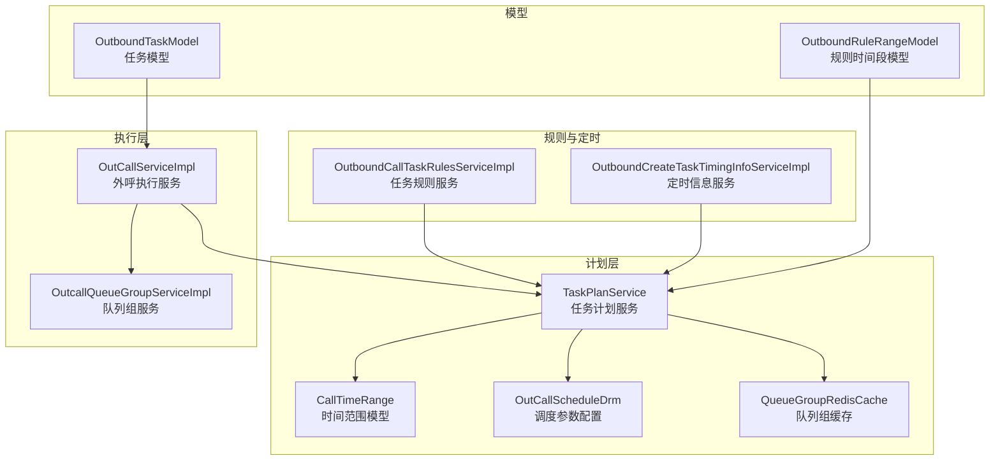
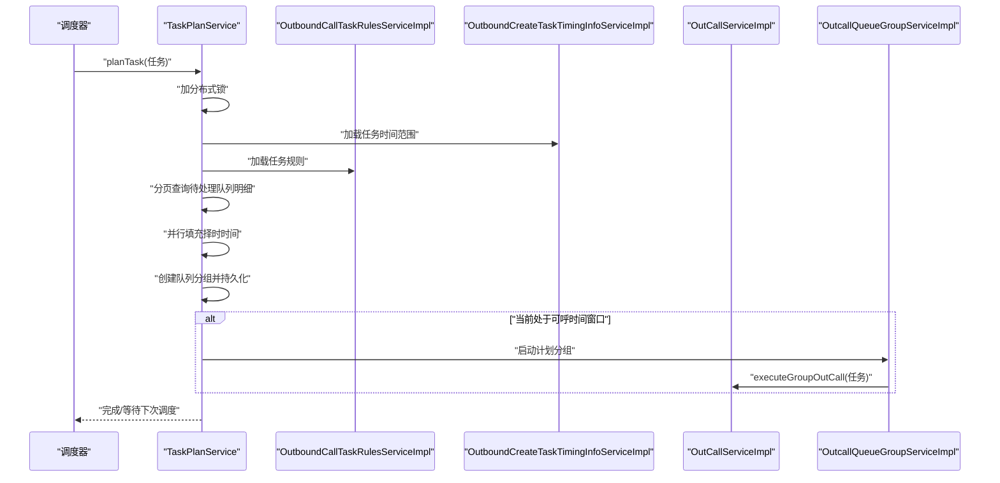
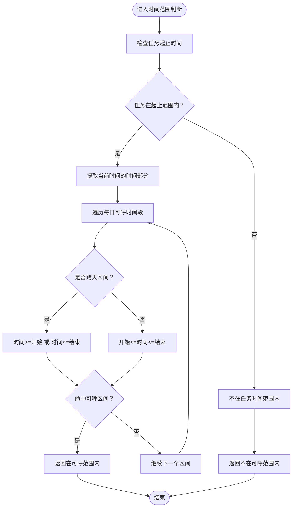
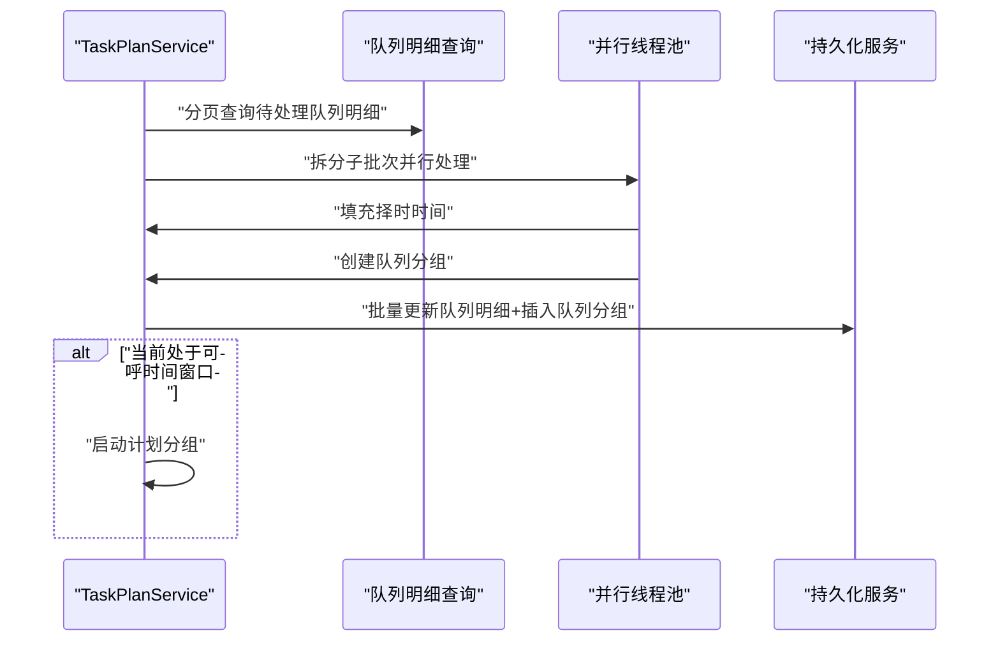
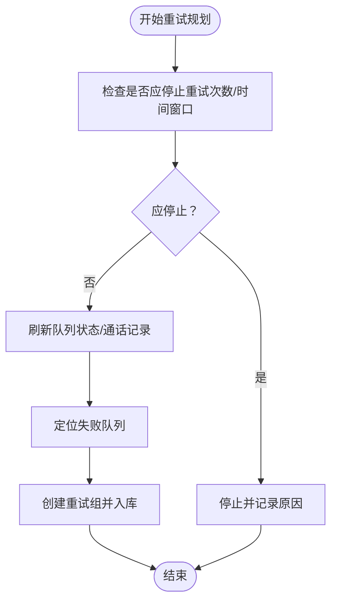
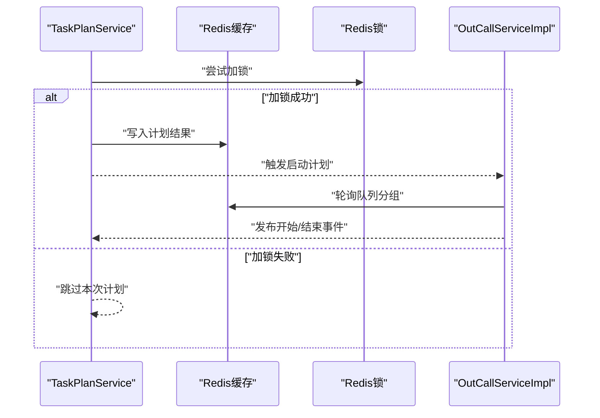
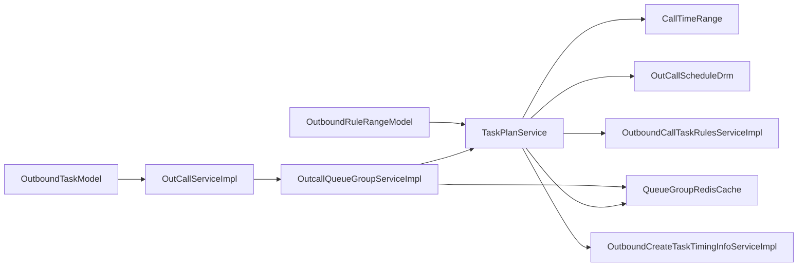

# 任务计划算法

<cite>
**本文引用的文件**
- [TaskPlanService.java](file://src/main/java/org/qianye/service/impl/TaskPlanService.java)
- [CallTimeRange.java](file://src/main/java/org/qianye/DTO/CallTimeRange.java)
- [OutCallScheduleDrm.java](file://src/main/java/org/qianye/common/OutCallScheduleDrm.java)
- [OutCallServiceImpl.java](file://src/main/java/org/qianye/engine/OutCallServiceImpl.java)
- [OutcallQueueGroupServiceImpl.java](file://src/main/java/org/qianye/service/impl/OutcallQueueGroupServiceImpl.java)
- [QueueGroupRedisCache.java](file://src/main/java/org/qianye/cache/QueueGroupRedisCache.java)
- [OutboundCallTaskServiceImpl.java](file://src/main/java/org/qianye/service/impl/OutboundCallTaskServiceImpl.java)
- [OutboundCallTaskRulesServiceImpl.java](file://src/main/java/org/qianye/service/impl/OutboundCallTaskRulesServiceImpl.java)
- [OutboundCreateTaskTimingInfoServiceImpl.java](file://src/main/java/org/qianye/service/impl/OutboundCreateTaskTimingInfoServiceImpl.java)
- [OutboundTaskModel.java](file://src/main/java/org/qianye/DTO/OutboundTaskModel.java)
- [OutboundRuleRangeModel.java](file://src/main/java/org/qianye/DTO/OutboundRuleRangeModel.java)
</cite>

## 更新摘要
**变更内容**
- TaskPlanService从`org.qianye.service`迁移到`org.qianye.service.impl`包
- 增加了超过500行的增强功能，包括复杂的任务规划算法、并行处理能力和全面的重试机制
- 新增了任务时间范围缓存和序列化功能
- 实现了`replanExceptionTask`和`generateRetryGroup`异常重试机制
- 增强了并行处理能力，使用`CompletableFuture`实现异步并行处理
- 改进了重试次数管理和停止条件检查

## 目录
1. [引言](#引言)
2. [项目结构](#项目结构)
3. [核心组件](#核心组件)
4. [架构总览](#架构总览)
5. [详细组件分析](#详细组件分析)
6. [依赖分析](#依赖分析)
7. [性能考虑](#性能考虑)
8. [故障排查指南](#故障排查指南)
9. [结论](#结论)
10. [附录](#附录)

## 引言
本文件围绕 Outcall 系统的任务计划算法展开，系统性阐述任务时间窗口计算、计划生成与动态调整的实现机制。经过重大重构后，系统采用了更简洁的架构设计，重点覆盖以下方面：
- 时间范围计算：工作日识别、节假日处理、自定义时间段配置
- 计划生成：按批次分页、并行分组、择时时间填充与分组策略
- 动态调整：异常重试、重试次数上限、时间窗口切换与停止策略
- 与调度系统的集成：实时更新、锁与缓存协同、事件发布
- 灵活性与可扩展性：配置中心接入、参数化阈值、多场景适配

## 项目结构
Outcall 的任务计划相关代码主要集中在以下模块：
- 任务计划服务：负责任务计划的入口、锁控制、分批处理、并行分组与持久化
- 时间范围模型：封装任务起止时间与每日可呼时间段，并提供"当前是否在可呼范围内"的判断
- 调度参数配置：集中管理队列查询批次、分组大小、最大重试次数等关键参数
- 调度执行服务：与计划服务配合，从缓存中拉取分组并执行外呼
- 规则与定时信息服务：提供任务规则与定时信息的读取与构建
- 任务模型与规则模型：承载任务与时间段配置的载体

**图表来源**
- [TaskPlanService.java](file://src/main/java/org/qianye/service/impl/TaskPlanService.java#L1-L598)
- [CallTimeRange.java](file://src/main/java/org/qianye/DTO/CallTimeRange.java#L1-L83)
- [OutCallScheduleDrm.java](file://src/main/java/org/qianye/common/OutCallScheduleDrm.java#L1-L112)
- [QueueGroupRedisCache.java](file://src/main/java/org/qianye/cache/QueueGroupRedisCache.java#L1-L190)
- [OutCallServiceImpl.java](file://src/main/java/org/qianye/engine/OutCallServiceImpl.java#L1-L766)
- [OutcallQueueGroupServiceImpl.java](file://src/main/java/org/qianye/service/impl/OutcallQueueGroupServiceImpl.java#L1-L633)

**章节来源**
- [TaskPlanService.java](file://src/main/java/org/qianye/service/impl/TaskPlanService.java#L1-L598)
- [CallTimeRange.java](file://src/main/java/org/qianye/DTO/CallTimeRange.java#L1-L83)
- [OutCallScheduleDrm.java](file://src/main/java/org/qianye/common/OutCallScheduleDrm.java#L1-L112)
- [QueueGroupRedisCache.java](file://src/main/java/org/qianye/cache/QueueGroupRedisCache.java#L1-L190)
- [OutCallServiceImpl.java](file://src/main/java/org/qianye/engine/OutCallServiceImpl.java#L1-L766)

## 核心组件
- **任务计划服务（TaskPlanService）**：提供计划入口、锁控制、分批查询、并行分组、持久化与异常重试；负责将待呼队列明细按规则分组并写入队列分组表，同时在可呼时间内触发启动计划
- **时间范围模型（CallTimeRange）**：封装任务起止时间与每日可呼时间段，支持跨天区间判断、当前时间是否在可呼范围内判断
- **调度参数配置（OutCallScheduleDrm）**：集中管理队列查询批次、分组大小、最大重试次数、线程池大小、缓存上限等参数
- **外呼执行服务（OutCallServiceImpl）**：从缓存中轮询队列分组并执行外呼，结合速率限制与事件发布实现闭环
- **队列组服务（OutcallQueueGroupServiceImpl）**：负责队列组的状态检查、规划启动和执行，与TaskPlanService协作实现完整的调度流程
- **队列组缓存（QueueGroupRedisCache）**：提供高性能的队列组缓存操作，支持原子性添加和弹出操作
- **规则与定时信息服务**：提供任务规则与定时信息的读取与构建，作为计划服务的输入之一
- **任务与规则模型**：承载任务与时间段配置的载体，便于在服务间传递

**章节来源**
- [TaskPlanService.java](file://src/main/java/org/qianye/service/impl/TaskPlanService.java#L1-L598)
- [CallTimeRange.java](file://src/main/java/org/qianye/DTO/CallTimeRange.java#L1-L83)
- [OutCallScheduleDrm.java](file://src/main/java/org/qianye/common/OutCallScheduleDrm.java#L1-L112)
- [OutcallQueueGroupServiceImpl.java](file://src/main/java/org/qianye/service/impl/OutcallQueueGroupServiceImpl.java#L1-L633)
- [QueueGroupRedisCache.java](file://src/main/java/org/qianye/cache/QueueGroupRedisCache.java#L1-L190)

## 架构总览
任务计划算法经过重构后，采用"计划生成—状态检查—执行调度"的三层架构，通过缓存和锁机制保证并发安全，通过参数化配置实现灵活扩展。

**图表来源**
- [TaskPlanService.java](file://src/main/java/org/qianye/service/impl/TaskPlanService.java#L240-L372)
- [OutcallQueueGroupServiceImpl.java](file://src/main/java/org/qianye/service/impl/OutcallQueueGroupServiceImpl.java#L129-L219)
- [OutCallServiceImpl.java](file://src/main/java/org/qianye/engine/OutCallServiceImpl.java#L111-L240)

## 详细组件分析

### 时间范围计算与业务规则
- **任务时间范围**：由任务起止时间与每日可呼时间段构成，支持跨天区间（如 23:00-02:00），通过"仅比较时间部分"的方式判断当前时间是否在可呼范围内
- **工作日识别与节假日处理**：通过每日可呼时间段集合与任务起止时间共同决定任务是否处于"可呼时间范围"，节假日可通过时间段配置进行屏蔽或特殊设置
- **自定义时间段配置**：支持按任务维度配置每日可呼起止时间，满足不同业务场景的合规与效率需求

**图表来源**
- [CallTimeRange.java](file://src/main/java/org/qianye/DTO/CallTimeRange.java#L21-L70)

**章节来源**
- [CallTimeRange.java](file://src/main/java/org/qianye/DTO/CallTimeRange.java#L1-L83)

### 计划生成与并行分组
- **入口与锁控制**：以任务实例与任务编码为维度加分布式锁，避免重复计划
- **分页查询**：限定时间窗口（如近两天）内的待处理队列明细，按批次查询，降低数据库压力
- **并行处理**：将批次数据切分为更小的子批次，使用异步线程池并行处理，提升吞吐
- **择时时间填充**：基于号码对应的择时时间与任务可呼范围进行匹配，仅对有效且未过期的择时时间进行设置
- **分组策略**：按是否存在择时时间分为两类明细，分别创建普通分组与择时分组，并持久化到队列分组表
- **实时启动**：若当前处于可呼时间窗口，则异步触发启动计划分组

**图表来源**
- [TaskPlanService.java](file://src/main/java/org/qianye/service/impl/TaskPlanService.java#L265-L372)
- [OutCallScheduleDrm.java](file://src/main/java/org/qianye/common/OutCallScheduleDrm.java#L65-L95)

**章节来源**
- [TaskPlanService.java](file://src/main/java/org/qianye/service/impl/TaskPlanService.java#L240-L372)
- [OutCallScheduleDrm.java](file://src/main/java/org/qianye/common/OutCallScheduleDrm.java#L1-L112)

### 动态调整与异常重试
- **异常重试**：当出现异常或队列状态异常时，定位失败队列并重新规划为新的重试组，支持延迟等待与状态刷新
- **停止条件**：当重试次数达到上限或已超出任务时间范围时，停止当前组并记录原因
- **时间窗口切换**：在计划过程中持续检查当前是否仍处于可呼时间窗口，若不再可呼则停止后续处理
- **重试组管理**：实现了`generateRetryGroup`方法，支持根据现有组和队列详情重新规划任务

**图表来源**
- [TaskPlanService.java](file://src/main/java/org/qianye/service/impl/TaskPlanService.java#L96-L184)

**章节来源**
- [TaskPlanService.java](file://src/main/java/org/qianye/service/impl/TaskPlanService.java#L96-L184)

### 与调度系统的集成与实时更新
- **缓存与锁**：通过 Redis 锁与缓存协同，保证计划过程的幂等与一致性
- **事件发布**：在执行阶段发布开始/结束事件，驱动上层监控与告警
- **参数化配置**：通过调度参数配置类集中管理线程池大小、队列长度、批次大小等，便于在不同租户/场景下快速调优
- **任务时间范围缓存**：实现了任务时间范围的缓存和序列化功能，提升性能

**图表来源**
- [TaskPlanService.java](file://src/main/java/org/qianye/service/impl/TaskPlanService.java#L240-L263)
- [OutCallServiceImpl.java](file://src/main/java/org/qianye/engine/OutCallServiceImpl.java#L111-L240)

**章节来源**
- [TaskPlanService.java](file://src/main/java/org/qianye/service/impl/TaskPlanService.java#L240-L263)
- [OutCallServiceImpl.java](file://src/main/java/org/qianye/engine/OutCallServiceImpl.java#L111-L240)

## 依赖分析
- **TaskPlanService** 依赖 CallTimeRange 进行时间范围判断，依赖 OutCallScheduleDrm 获取参数化配置，依赖规则与定时信息服务加载任务规则与时间范围
- **OutcallQueueGroupServiceImpl** 依赖 TaskPlanService 的计划结果，通过缓存与事件实现闭环
- **QueueGroupRedisCache** 提供高性能的队列组缓存操作，支持原子性添加和弹出操作
- **OutboundTaskModel** 与 **OutboundRuleRangeModel** 作为任务与时间段配置的载体，贯穿计划与执行链路

**图表来源**
- [TaskPlanService.java](file://src/main/java/org/qianye/service/impl/TaskPlanService.java#L1-L598)
- [OutcallQueueGroupServiceImpl.java](file://src/main/java/org/qianye/service/impl/OutcallQueueGroupServiceImpl.java#L1-L633)
- [QueueGroupRedisCache.java](file://src/main/java/org/qianye/cache/QueueGroupRedisCache.java#L1-L190)
- [OutCallServiceImpl.java](file://src/main/java/org/qianye/engine/OutCallServiceImpl.java#L1-L766)

**章节来源**
- [TaskPlanService.java](file://src/main/java/org/qianye/service/impl/TaskPlanService.java#L1-L598)
- [OutcallQueueGroupServiceImpl.java](file://src/main/java/org/qianye/service/impl/OutcallQueueGroupServiceImpl.java#L1-L633)

## 性能考虑
- **批次与并行**：通过队列查询批次与分组大小参数化，结合子批次并行处理，显著提升大体量数据的处理能力
- **线程池与队列**：合理设置线程池大小与队列长度，避免过载导致的延迟与堆积
- **缓存与锁**：利用 Redis 缓存与锁减少重复计算与竞争，提高吞吐
- **压力控制**：定期休眠与进度报告有助于缓解数据库与内存压力
- **异步处理**：使用 CompletableFuture 实现异步并行处理，提升整体性能

**章节来源**
- [OutCallScheduleDrm.java](file://src/main/java/org/qianye/common/OutCallScheduleDrm.java#L65-L95)
- [TaskPlanService.java](file://src/main/java/org/qianye/service/impl/TaskPlanService.java#L296-L340)

## 故障排查指南
- **计划未执行**：检查任务状态与时间窗口，确认是否在可呼范围内；查看锁是否被占用
- **大数据量卡顿**：关注批次大小与并行度配置，检查线程池队列长度与休眠间隔
- **异常重试**：核对重试次数上限与停止原因，确认失败队列是否正确重试
- **时间范围异常**：核对任务起止时间与每日可呼时间段配置，特别是跨天区间的边界处理
- **缓存问题**：检查任务时间范围缓存是否正确序列化和反序列化
- **并行处理异常**：查看 CompletableFuture 的异常处理和超时设置

**章节来源**
- [TaskPlanService.java](file://src/main/java/org/qianye/service/impl/TaskPlanService.java#L96-L184)
- [CallTimeRange.java](file://src/main/java/org/qianye/DTO/CallTimeRange.java#L21-L70)
- [OutCallScheduleDrm.java](file://src/main/java/org/qianye/common/OutCallScheduleDrm.java#L26-L28)

## 结论
经过重构后的任务计划算法以"时间范围模型 + 参数化配置 + 并行分组 + 缓存锁协同"为核心，实现了高吞吐、可扩展、可动态调整的外呼计划体系。通过明确的业务规则与简化的异常处理机制，能够在复杂场景下稳定运行，并与调度系统形成高效闭环。

## 附录
- **任务模型与规则模型字段说明**
  - 任务模型：包含任务编码、任务类型、转移类型、录音编码、转移编码等
  - 规则时间段模型：包含每日可呼起始时间与结束时间（整数小时）

**章节来源**
- [OutboundTaskModel.java](file://src/main/java/org/qianye/DTO/OutboundTaskModel.java#L1-L13)
- [OutboundRuleRangeModel.java](file://src/main/java/org/qianye/DTO/OutboundRuleRangeModel.java#L1-L13)