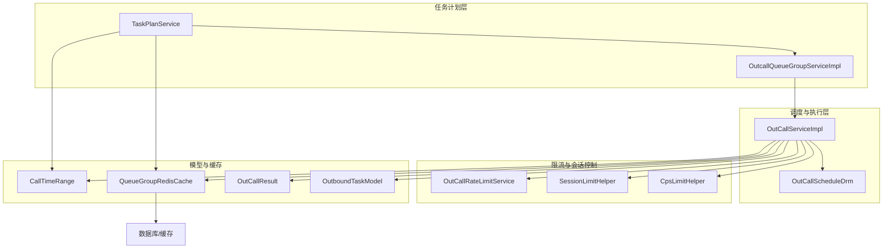
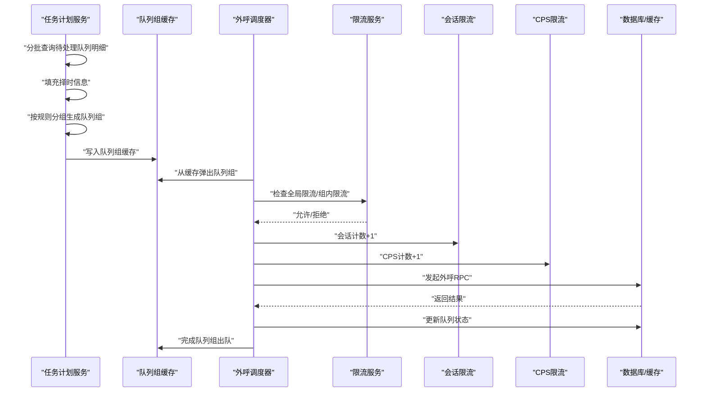
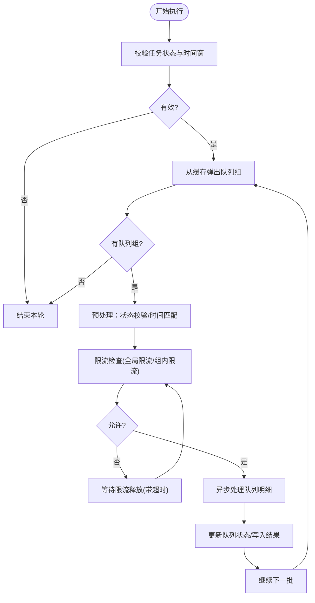
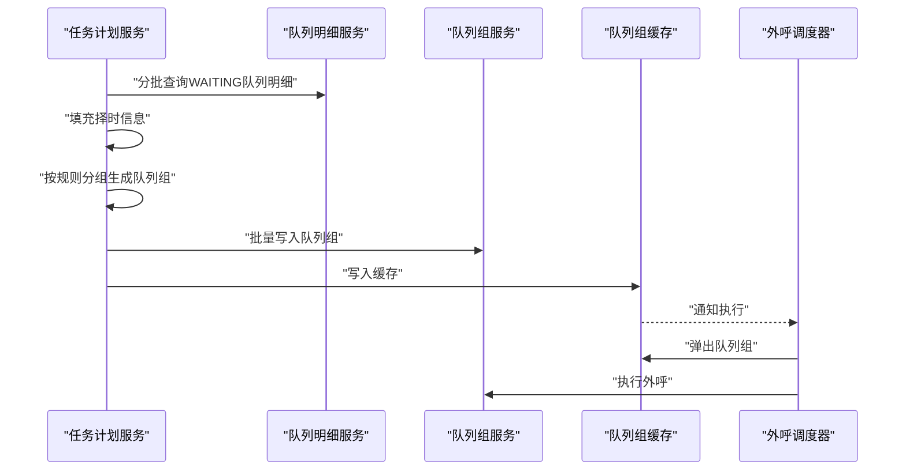
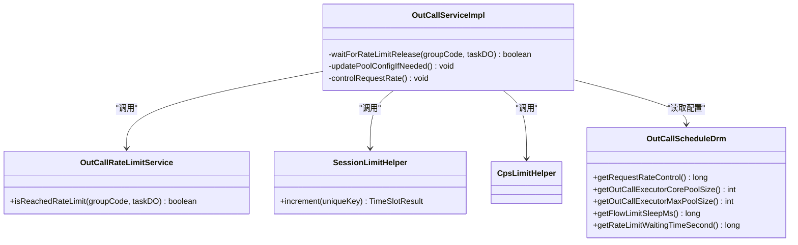
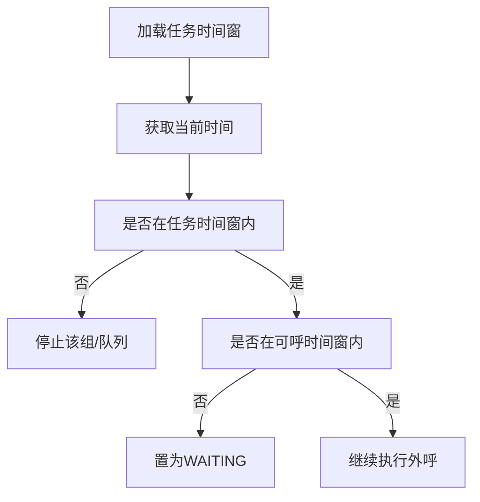
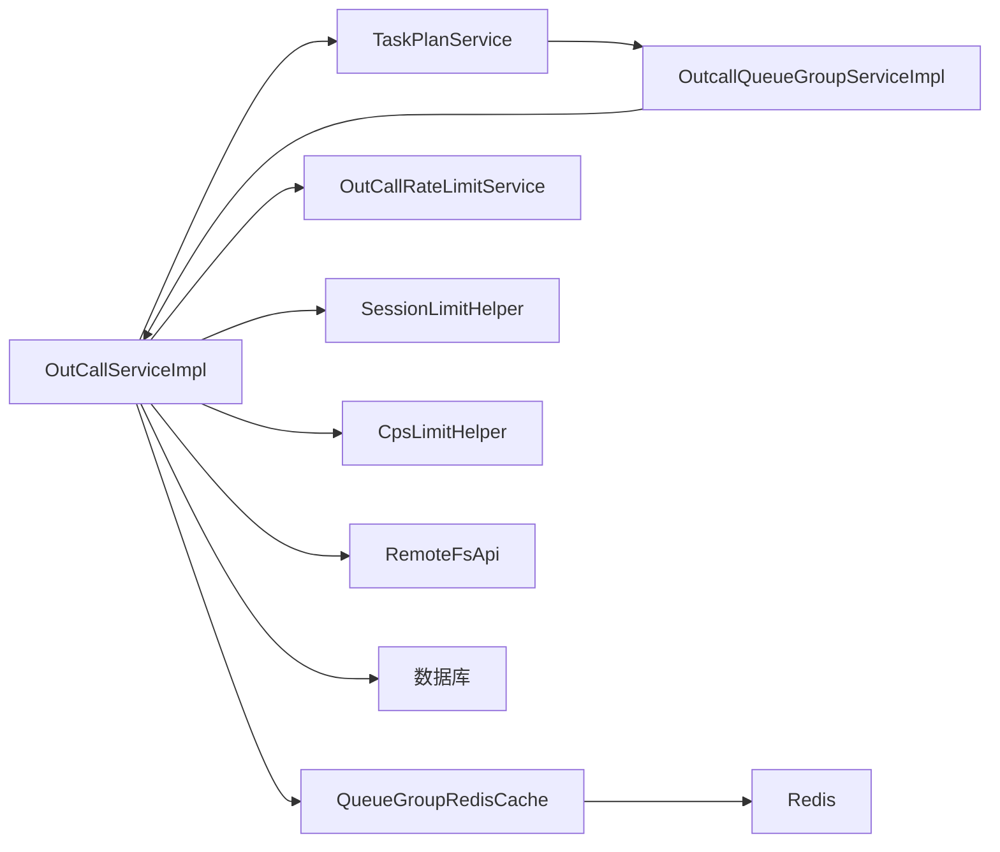

# 核心算法实现

<cite>
**本文档引用的文件**
- [OutCallServiceImpl.java](file://src/main/java/org/qianye/OutCallServiceImpl.java)
- [OutCallRateLimitService.java](file://src/main/java/org/qianye/OutCallRateLimitService.java)
- [TaskPlanService.java](file://src/main/java/org/qianye/TaskPlanService.java)
- [OutCallScheduleDrm.java](file://src/main/java/org/qianye/OutCallScheduleDrm.java)
- [CpsLimitHelper.java](file://src/main/java/org/qianye/CpsLimitHelper.java)
- [SessionLimitHelper.java](file://src/main/java/org/qianye/SessionLimitHelper.java)
- [CallTimeRange.java](file://src/main/java/org/qianye/CallTimeRange.java)
- [OutCallResult.java](file://src/main/java/org/qianye/OutCallResult.java)
- [OutboundTaskModel.java](file://src/main/java/org/qianye/OutboundTaskModel.java)
- [QueueGroupRedisCache.java](file://src/main/java/org/qianye/QueueGroupRedisCache.java)
- [OutcallQueueGroupServiceImpl.java](file://src/main/java/org/qianye/service/impl/OutcallQueueGroupServiceImpl.java)
- [outcall.sql](file://src/main/resources/outcall.sql)
</cite>

## 目录
1. [简介](#简介)
2. [项目结构](#项目结构)
3. [核心组件](#核心组件)
4. [架构总览](#架构总览)
5. [详细组件分析](#详细组件分析)
6. [依赖关系分析](#依赖关系分析)
7. [性能考虑](#性能考虑)
8. [故障排查指南](#故障排查指南)
9. [结论](#结论)
10. [附录](#附录)

## 简介
本文件面向 Outcall 系统的核心算法实现，重点阐述以下内容：
- 智能外呼调度算法：时间窗口计算、优先级排序与负载均衡策略
- 限流算法设计与实现：全局限流、组内限流与动态限流调整机制
- 任务计划服务工作原理与调度策略
- 算法复杂度分析与参数配置调优
- 性能测试与优化建议
- 算法扩展性与定制化能力

## 项目结构
Outcall 系统采用分层架构，核心算法分布在以下模块：
- 调度与执行层：OutCallServiceImpl、OutCallScheduleDrm
- 任务计划层：TaskPlanService、OutcallQueueGroupServiceImpl
- 限流与会话控制：OutCallRateLimitService、SessionLimitHelper、CpsLimitHelper
- 时间窗口模型：CallTimeRange
- 结果与模型：OutCallResult、OutboundTaskModel
- 缓存与队列：QueueGroupRedisCache
- 数据表结构：outcall.sql

图表来源
- [OutCallServiceImpl.java](file://src/main/java/org/qianye/OutCallServiceImpl.java#L1-L1191)
- [OutCallScheduleDrm.java](file://src/main/java/org/qianye/OutCallScheduleDrm.java#L1-L113)
- [TaskPlanService.java](file://src/main/java/org/qianye/TaskPlanService.java#L1-L1112)
- [OutcallQueueGroupServiceImpl.java](file://src/main/java/org/qianye/service/impl/OutcallQueueGroupServiceImpl.java#L165-L292)
- [OutCallRateLimitService.java](file://src/main/java/org/qianye/OutCallRateLimitService.java#L1-L17)
- [SessionLimitHelper.java](file://src/main/java/org/qianye/SessionLimitHelper.java#L1-L29)
- [CpsLimitHelper.java](file://src/main/java/org/qianye/CpsLimitHelper.java#L1-L11)
- [CallTimeRange.java](file://src/main/java/org/qianye/CallTimeRange.java#L1-L133)
- [QueueGroupRedisCache.java](file://src/main/java/org/qianye/QueueGroupRedisCache.java#L45-L92)
- [OutCallResult.java](file://src/main/java/org/qianye/OutCallResult.java#L1-L50)
- [OutboundTaskModel.java](file://src/main/java/org/qianye/OutboundTaskModel.java#L1-L13)

章节来源
- [OutCallServiceImpl.java](file://src/main/java/org/qianye/OutCallServiceImpl.java#L1-L1191)
- [TaskPlanService.java](file://src/main/java/org/qianye/TaskPlanService.java#L1-L1112)

## 核心组件
- 智能外呼调度器：负责按时间窗口与优先级拉取队列组，执行外呼并进行限流与重试
- 任务计划服务：负责队列明细的批量分组、择时信息填充与队列组生成
- 限流服务：提供全局限流与组内限流接口占位，支持动态限流调整
- 时间窗口模型：封装任务与队列的可呼时间段判断
- 缓存与队列：基于 Redis 的队列组缓存与弹出策略，支撑高并发调度

章节来源
- [OutCallServiceImpl.java](file://src/main/java/org/qianye/OutCallServiceImpl.java#L1-L1191)
- [TaskPlanService.java](file://src/main/java/org/qianye/TaskPlanService.java#L1-L1112)
- [OutCallRateLimitService.java](file://src/main/java/org/qianye/OutCallRateLimitService.java#L1-L17)
- [CallTimeRange.java](file://src/main/java/org/qianye/CallTimeRange.java#L1-L133)
- [QueueGroupRedisCache.java](file://src/main/java/org/qianye/QueueGroupRedisCache.java#L45-L92)

## 架构总览
Outcall 的核心流程分为“任务计划”和“外呼执行”两大阶段：
- 任务计划阶段：TaskPlanService 从待处理队列中分批提取明细，填充择时信息，按规则分组生成队列组，并写入缓存
- 外呼执行阶段：OutCallServiceImpl 从缓存中拉取队列组，按时间窗口与限流策略逐个执行外呼，失败时进行重试或降级

图表来源
- [TaskPlanService.java](file://src/main/java/org/qianye/TaskPlanService.java#L411-L691)
- [OutcallQueueGroupServiceImpl.java](file://src/main/java/org/qianye/service/impl/OutcallQueueGroupServiceImpl.java#L165-L292)
- [OutCallServiceImpl.java](file://src/main/java/org/qianye/OutCallServiceImpl.java#L112-L255)
- [OutCallRateLimitService.java](file://src/main/java/org/qianye/OutCallRateLimitService.java#L10-L16)
- [SessionLimitHelper.java](file://src/main/java/org/qianye/SessionLimitHelper.java#L11-L14)
- [CpsLimitHelper.java](file://src/main/java/org/qianye/CpsLimitHelper.java#L9-L11)

## 详细组件分析

### 智能外呼调度算法
- 时间窗口计算
  - 使用 CallTimeRange 计算“当前是否在可呼时间窗内”和“是否在任务时间范围内”
  - 对队列明细与队列组分别进行时间匹配，不匹配则进入 WAITING 或 STOP 状态
- 优先级排序与负载均衡
  - 队列组在缓存中以双端队列形式存储，按组码顺序弹出
  - 支持按租户区分不同线程池，实现租户级负载隔离
  - 通过线程池队列长度阈值与限流等待机制实现自适应背压
- 限流与重试
  - 全局限流：waitForRateLimitRelease 带超时轮询限流状态
  - 组内限流：按组码维度检查限流
  - 动态限流调整：OutCallScheduleDrm 提供可调参数，运行时动态更新线程池配置

图表来源
- [OutCallServiceImpl.java](file://src/main/java/org/qianye/OutCallServiceImpl.java#L112-L255)
- [OutCallServiceImpl.java](file://src/main/java/org/qianye/OutCallServiceImpl.java#L602-L679)
- [CallTimeRange.java](file://src/main/java/org/qianye/CallTimeRange.java#L30-L55)
- [OutCallScheduleDrm.java](file://src/main/java/org/qianye/OutCallScheduleDrm.java#L11-L45)

章节来源
- [OutCallServiceImpl.java](file://src/main/java/org/qianye/OutCallServiceImpl.java#L112-L255)
- [OutCallServiceImpl.java](file://src/main/java/org/qianye/OutCallServiceImpl.java#L602-L679)
- [CallTimeRange.java](file://src/main/java/org/qianye/CallTimeRange.java#L30-L55)
- [OutCallScheduleDrm.java](file://src/main/java/org/qianye/OutCallScheduleDrm.java#L11-L45)

### 任务计划服务与调度策略
- 批量分组与择时填充
  - TaskPlanService 分批查询 WAITING 队列明细，填充固定时间信息
  - 按是否固定时间进行分组，生成 NORMAL/FIXED_TIME 队列组
- 缓存与启动执行
  - OutcallQueueGroupServiceImpl 将队列组写入缓存，触发 OutCallServiceImpl 执行
  - 支持择时组按小时粒度查询与启动
- 重试与异常恢复
  - replanExceptionTask 根据队列状态与通话记录进行重试组生成
  - shouldStopCurrentGroup 判定是否达到最大重试次数或超出任务时间窗

图表来源
- [TaskPlanService.java](file://src/main/java/org/qianye/TaskPlanService.java#L411-L691)
- [OutcallQueueGroupServiceImpl.java](file://src/main/java/org/qianye/service/impl/OutcallQueueGroupServiceImpl.java#L165-L292)
- [OutcallQueueGroupServiceImpl.java](file://src/main/java/org/qianye/service/impl/OutcallQueueGroupServiceImpl.java#L243-L248)

章节来源
- [TaskPlanService.java](file://src/main/java/org/qianye/TaskPlanService.java#L411-L691)
- [OutcallQueueGroupServiceImpl.java](file://src/main/java/org/qianye/service/impl/OutcallQueueGroupServiceImpl.java#L165-L292)

### 限流算法设计与实现
- 全局限流
  - OutCallRateLimitService 接口占位，当前返回 false；实际应接入 Redis 计数或令牌桶
  - waitForRateLimitRelease 带超时轮询，sleep 间隔由 OutCallScheduleDrm 控制
- 组内限流
  - 按 groupCode 进行限流检查，避免单组过度占用资源
- 会话限流与CPS限流
  - SessionLimitHelper 与 CpsLimitHelper 接口占位，当前未实现
  - OutCallServiceImpl 中使用会话计数器记录每任务/租户的会话数
- 动态限流调整
  - OutCallScheduleDrm 提供请求速率控制、线程池参数等可调项
  - 运行时通过 updatePoolConfigIfNeeded 动态调整线程池大小

图表来源
- [OutCallRateLimitService.java](file://src/main/java/org/qianye/OutCallRateLimitService.java#L10-L16)
- [SessionLimitHelper.java](file://src/main/java/org/qianye/SessionLimitHelper.java#L11-L14)
- [CpsLimitHelper.java](file://src/main/java/org/qianye/CpsLimitHelper.java#L9-L11)
- [OutCallScheduleDrm.java](file://src/main/java/org/qianye/OutCallScheduleDrm.java#L19-L45)
- [OutCallServiceImpl.java](file://src/main/java/org/qianye/OutCallServiceImpl.java#L602-L679)
- [OutCallServiceImpl.java](file://src/main/java/org/qianye/OutCallServiceImpl.java#L841-L883)
- [OutCallServiceImpl.java](file://src/main/java/org/qianye/OutCallServiceImpl.java#L886-L904)

章节来源
- [OutCallServiceImpl.java](file://src/main/java/org/qianye/OutCallServiceImpl.java#L602-L679)
- [OutCallServiceImpl.java](file://src/main/java/org/qianye/OutCallServiceImpl.java#L841-L883)
- [OutCallServiceImpl.java](file://src/main/java/org/qianye/OutCallServiceImpl.java#L886-L904)
- [OutCallRateLimitService.java](file://src/main/java/org/qianye/OutCallRateLimitService.java#L10-L16)
- [SessionLimitHelper.java](file://src/main/java/org/qianye/SessionLimitHelper.java#L11-L14)
- [CpsLimitHelper.java](file://src/main/java/org/qianye/CpsLimitHelper.java#L9-L11)
- [OutCallScheduleDrm.java](file://src/main/java/org/qianye/OutCallScheduleDrm.java#L19-L45)

### 时间窗口与优先级排序
- 时间窗口
  - CallTimeRange 支持跨天时间段判断，结合任务起止时间确定“是否在任务时间窗内”
- 优先级排序
  - 队列组在缓存中以双端队列存储，按组码顺序弹出，未见显式优先级字段
  - 表结构中存在 priority 字段，但当前未在调度逻辑中使用

图表来源
- [CallTimeRange.java](file://src/main/java/org/qianye/CallTimeRange.java#L30-L55)
- [OutCallServiceImpl.java](file://src/main/java/org/qianye/OutCallServiceImpl.java#L329-L397)
- [outcall.sql](file://src/main/resources/outcall.sql#L67-L76)

章节来源
- [CallTimeRange.java](file://src/main/java/org/qianye/CallTimeRange.java#L30-L55)
- [OutCallServiceImpl.java](file://src/main/java/org/qianye/OutCallServiceImpl.java#L329-L397)
- [outcall.sql](file://src/main/resources/outcall.sql#L67-L76)

### 负载均衡策略
- 线程池隔离
  - 按租户 ID 区分普通与大租户线程池，避免大租户影响小租户
- 背压控制
  - 线程池队列长度超过阈值时，直接返回等待
  - 限流等待超时后降级为 WAITING 状态
- 缓存弹出与重补给
  - QueueGroupRedisCache 提供 Lua 脚本支持的弹出与移动操作，保障高并发下的原子性

章节来源
- [OutCallServiceImpl.java](file://src/main/java/org/qianye/OutCallServiceImpl.java#L581-L593)
- [OutCallServiceImpl.java](file://src/main/java/org/qianye/OutCallServiceImpl.java#L144-L149)
- [QueueGroupRedisCache.java](file://src/main/java/org/qianye/QueueGroupRedisCache.java#L82-L92)

## 依赖关系分析
- 组件耦合
  - OutCallServiceImpl 依赖 TaskPlanService、QueueGroupRedisCache、OutCallRateLimitService、SessionLimitHelper、CpsLimitHelper
  - TaskPlanService 依赖队列明细与队列组服务，以及 Redis 锁与缓存
- 外部依赖
  - Redis：队列组缓存、锁与计数
  - RPC：外呼接口调用
  - 数据库：队列明细与队列组状态持久化

图表来源
- [OutCallServiceImpl.java](file://src/main/java/org/qianye/OutCallServiceImpl.java#L1-L1191)
- [TaskPlanService.java](file://src/main/java/org/qianye/TaskPlanService.java#L1-L1112)
- [OutcallQueueGroupServiceImpl.java](file://src/main/java/org/qianye/service/impl/OutcallQueueGroupServiceImpl.java#L165-L292)
- [QueueGroupRedisCache.java](file://src/main/java/org/qianye/QueueGroupRedisCache.java#L45-L92)

章节来源
- [OutCallServiceImpl.java](file://src/main/java/org/qianye/OutCallServiceImpl.java#L1-L1191)
- [TaskPlanService.java](file://src/main/java/org/qianye/TaskPlanService.java#L1-L1112)

## 性能考虑
- 时间复杂度
  - 任务计划：分批处理，时间复杂度近似 O(N)，其中 N 为待处理队列明细总数
  - 外呼执行：按组弹出与异步处理，时间复杂度近似 O(G)，其中 G 为队列组数量
- 空间复杂度
  - 队列组缓存占用与线程池队列长度相关，受 OutCallScheduleDrm 参数约束
- 关键优化点
  - 限流实现：将 OutCallRateLimitService、SessionLimitHelper、CpsLimitHelper 完善为基于 Redis 的计数器或令牌桶
  - 并发控制：合理设置线程池核心/最大大小与队列阈值，避免内存膨胀
  - 背压策略：结合线程池队列长度与限流等待超时，动态调节请求速率

[本节为通用性能讨论，无需特定文件来源]

## 故障排查指南
- 限流相关
  - waitForRateLimitRelease 返回 false：检查限流服务实现与超时配置
  - 线程池队列过长：增大队列阈值或降低请求速率
- 时间窗问题
  - 队列组被置为 WAITING/STOP：确认 CallTimeRange 配置与任务时间窗
- 重试与异常
  - replanExceptionTask：查看失败队列与通话记录，确认是否达到最大重试次数
- 缓存与锁
  - 队列组无法弹出：检查 Redis 缓存与 Lua 脚本执行情况

章节来源
- [OutCallServiceImpl.java](file://src/main/java/org/qianye/OutCallServiceImpl.java#L602-L679)
- [TaskPlanService.java](file://src/main/java/org/qianye/TaskPlanService.java#L142-L190)
- [CallTimeRange.java](file://src/main/java/org/qianye/CallTimeRange.java#L30-L55)
- [QueueGroupRedisCache.java](file://src/main/java/org/qianye/QueueGroupRedisCache.java#L82-L92)

## 结论
Outcall 的核心算法围绕“任务计划—队列组缓存—外呼执行”的流水线展开，具备良好的可扩展性与可配置性。当前限流与会话/CPS限流组件仍处于占位状态，建议尽快完善为基于 Redis 的高效实现，以满足生产环境的稳定性与性能要求。

[本节为总结性内容，无需特定文件来源]

## 附录

### 参数配置与调优
- 请求速率控制：OutCallScheduleDrm.getRequestRateControl
- 线程池参数：核心/最大大小、队列阈值
- 限流等待：超时时间与轮询间隔
- 分组与查询：分组大小、批次大小、缓存上限

章节来源
- [OutCallScheduleDrm.java](file://src/main/java/org/qianye/OutCallScheduleDrm.java#L19-L45)
- [OutCallScheduleDrm.java](file://src/main/java/org/qianye/OutCallScheduleDrm.java#L66-L96)
- [OutCallScheduleDrm.java](file://src/main/java/org/qianye/OutCallScheduleDrm.java#L109-L111)

### 算法复杂度汇总
- 任务计划：O(N)；空间：与批次大小与分组数量相关
- 外呼执行：O(G)；空间：与线程池队列长度与缓存大小相关
- 限流：O(1) 计数/查询；建议使用 Redis 原子操作

[本节为通用复杂度分析，无需特定文件来源]

### 扩展性与定制化
- 限流策略：支持多维限流（租户、组、会话、CPS），可通过 OutCallRateLimitService 扩展
- 时间窗：支持跨天时间段与任务时间窗组合
- 调度策略：可替换队列组弹出策略（如优先级队列）与重试策略

[本节为概念性扩展说明，无需特定文件来源]