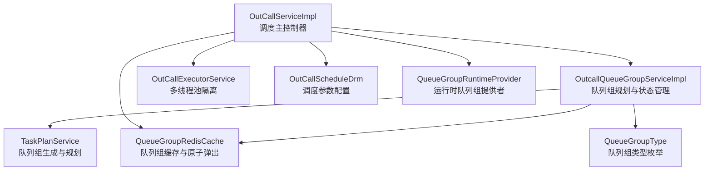
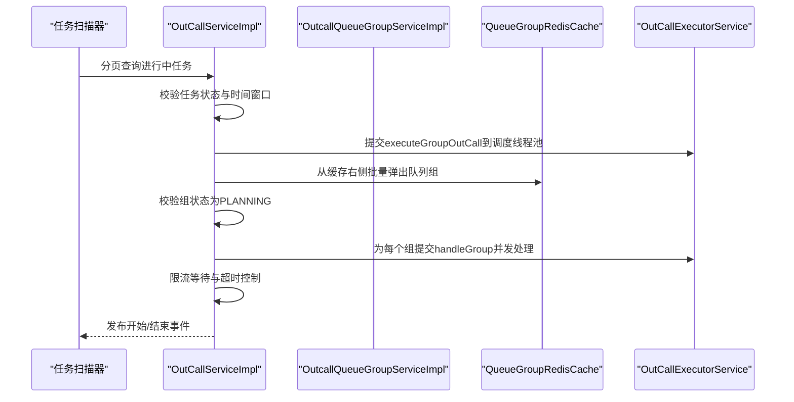
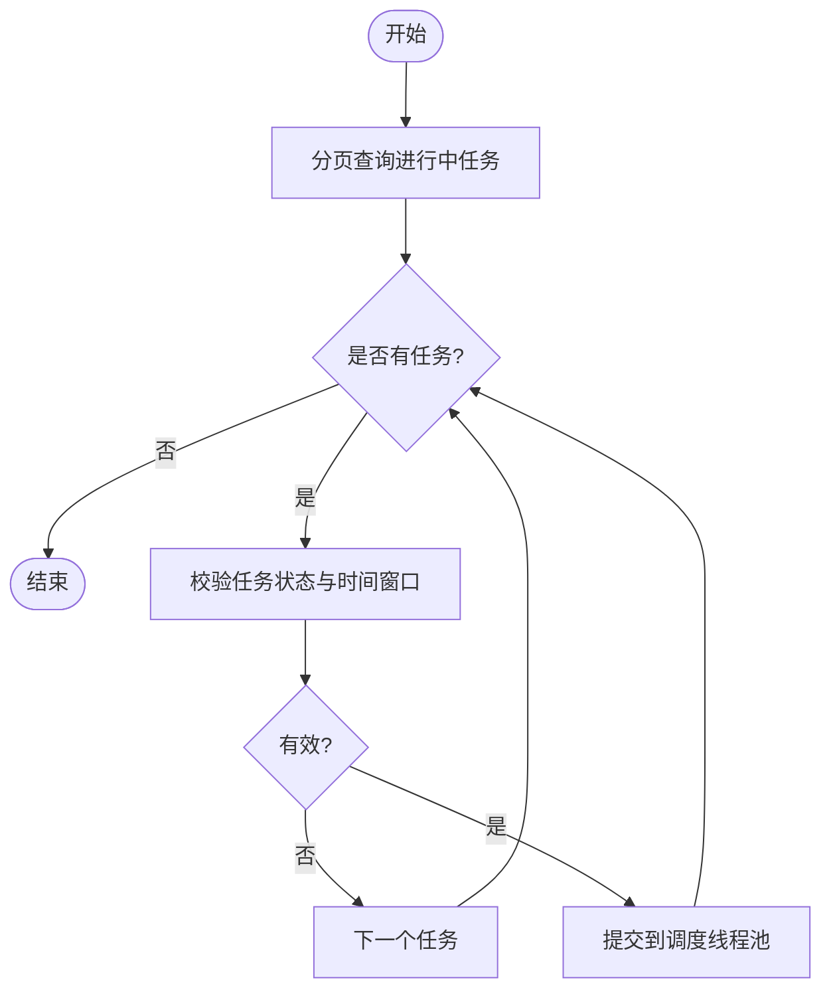
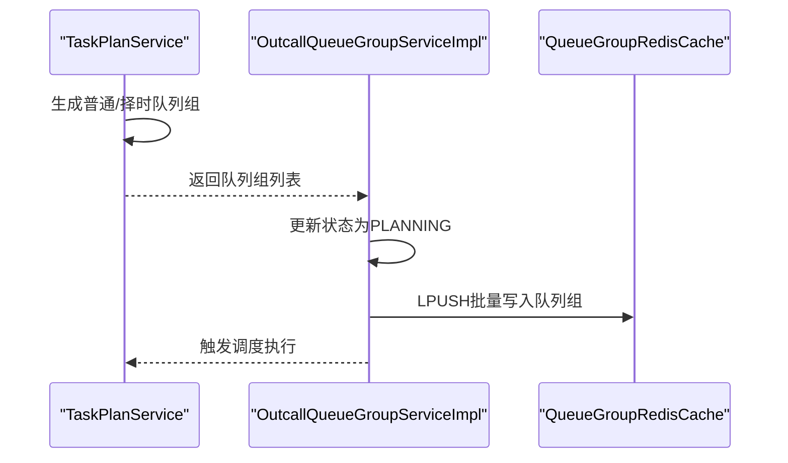
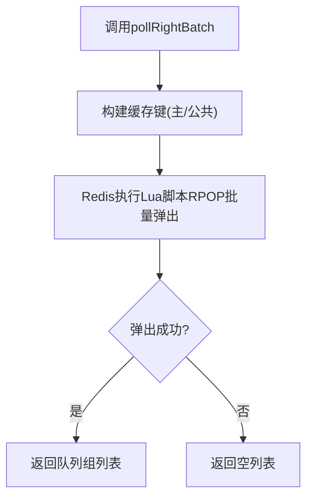
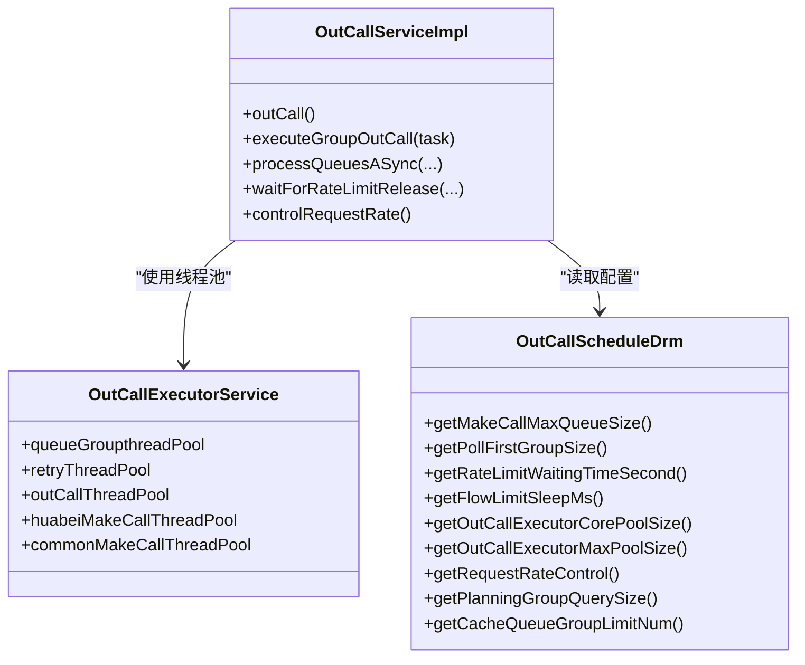
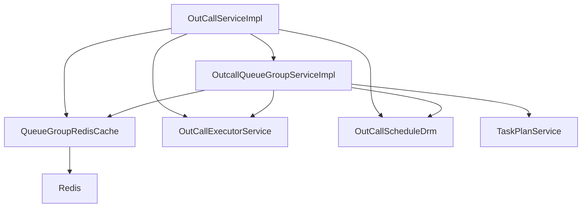

# 调度算法

<cite>
**本文引用的文件**
- [OutCallServiceImpl.java](file://src/main/java/org/qianye/OutCallServiceImpl.java)
- [OutcallQueueGroupServiceImpl.java](file://src/main/java/org/qianye/service/impl/OutcallQueueGroupServiceImpl.java)
- [OutCallScheduleDrm.java](file://src/main/java/org/qianye/OutCallScheduleDrm.java)
- [QueueGroupRedisCache.java](file://src/main/java/org/qianye/QueueGroupRedisCache.java)
- [OutCallExecutorService.java](file://src/main/java/org/qianye/OutCallExecutorService.java)
- [TaskPlanService.java](file://src/main/java/org/qianye/TaskPlanService.java)
- [QueueGroupRuntimeProvider.java](file://src/main/java/org/qianye/QueueGroupRuntimeProvider.java)
- [QueueGroupType.java](file://src/main/java/org/qianye/QueueGroupType.java)
</cite>

## 目录
1. [简介](#简介)
2. [项目结构](#项目结构)
3. [核心组件](#核心组件)
4. [架构总览](#架构总览)
5. [详细组件分析](#详细组件分析)
6. [依赖分析](#依赖分析)
7. [性能考虑](#性能考虑)
8. [故障排查指南](#故障排查指南)
9. [结论](#结论)

## 简介
本文面向 Outcall 系统的智能外呼调度算法，系统性阐述调度器如何通过“任务分页处理、队列组轮询、优先级与时间窗口控制、负载均衡与限流”等机制，实现高效稳定的外呼调度。重点覆盖以下方面：
- 任务分页与并发调度：基于任务状态与时间窗口，分页扫描任务并异步并发执行。
- 队列组轮询与缓存：使用 Redis 列表实现队列组的原子弹出与轮询，支持普通组与择时组。
- 优先级与时间窗口：按任务与队列组的当前/任务时间窗口决定是否执行或等待。
- 负载均衡与限流：多线程池隔离、队列长度阈值、限流等待与重试策略。
- 参数配置：线程池大小、队列长度、调度批次与轮询批量等。

## 项目结构
Outcall 调度相关的核心模块与职责如下：
- OutCallServiceImpl：外呼调度主控制器，负责任务分页、并发调度、队列组轮询、限流与执行。
- OutcallQueueGroupServiceImpl：队列组规划与状态管理，负责将 WAITING 组写入缓存并触发调度。
- TaskPlanService：任务规划与队列组生成，按普通/择时规则拆分与分批生成队列组。
- QueueGroupRedisCache：队列组缓存与原子操作，提供 LPUSH/RPOP 原子弹出与容量上限判断。
- OutCallExecutorService：多线程池管理与监控，隔离不同阶段的并发处理。
- OutCallScheduleDrm：调度参数配置中心，统一提供调度阈值与批大小。
- QueueGroupRuntimeProvider：队列组运行时提供者（占位），当前从缓存批量拉取。
- QueueGroupType：队列组类型枚举（普通、择时、重试）。

图表来源
- [OutCallServiceImpl.java](file://src/main/java/org/qianye/OutCallServiceImpl.java#L78-L110)
- [OutcallQueueGroupServiceImpl.java](file://src/main/java/org/qianye/service/impl/OutcallQueueGroupServiceImpl.java#L171-L271)
- [QueueGroupRedisCache.java](file://src/main/java/org/qianye/QueueGroupRedisCache.java#L85-L114)
- [OutCallExecutorService.java](file://src/main/java/org/qianye/OutCallExecutorService.java#L14-L51)
- [OutCallScheduleDrm.java](file://src/main/java/org/qianye/OutCallScheduleDrm.java#L11-L112)
- [TaskPlanService.java](file://src/main/java/org/qianye/TaskPlanService.java#L840-L882)
- [QueueGroupRuntimeProvider.java](file://src/main/java/org/qianye/QueueGroupRuntimeProvider.java#L14-L17)
- [QueueGroupType.java](file://src/main/java/org/qianye/QueueGroupType.java#L6-L10)

章节来源
- [OutCallServiceImpl.java](file://src/main/java/org/qianye/OutCallServiceImpl.java#L78-L110)
- [OutcallQueueGroupServiceImpl.java](file://src/main/java/org/qianye/service/impl/OutcallQueueGroupServiceImpl.java#L171-L271)
- [QueueGroupRedisCache.java](file://src/main/java/org/qianye/QueueGroupRedisCache.java#L85-L114)
- [OutCallExecutorService.java](file://src/main/java/org/qianye/OutCallExecutorService.java#L14-L51)
- [OutCallScheduleDrm.java](file://src/main/java/org/qianye/OutCallScheduleDrm.java#L11-L112)
- [TaskPlanService.java](file://src/main/java/org/qianye/TaskPlanService.java#L840-L882)
- [QueueGroupRuntimeProvider.java](file://src/main/java/org/qianye/QueueGroupRuntimeProvider.java#L14-L17)
- [QueueGroupType.java](file://src/main/java/org/qianye/QueueGroupType.java#L6-L10)

## 核心组件
- 任务分页与并发调度
  - 分页扫描进行中的任务，对每个有效任务提交到调度线程池并发执行。
  - 执行入口会进行任务状态与时间窗口校验，确保仅在允许的时间段内调度。
- 队列组轮询与缓存
  - 从 Redis 列表右侧批量弹出队列组代码，支持私有/公共两套键空间。
  - 支持缓存上限检测，防止缓存堆积导致内存压力。
- 优先级与时间窗口
  - 任务与队列组均需满足“当前可呼时间段”，否则进入 WAITING 或 STOP 状态。
  - 对于不在任务时间窗口内的组，直接置为 STOP 并触发重规划。
- 负载均衡与限流
  - 多线程池隔离：队列组处理、重试、外呼、规划等独立线程池。
  - 线程池队列长度阈值控制，超过阈值则提前退出，避免积压。
  - 限流等待与超时控制，支持带超时的限流解除检测。
- 参数配置
  - 线程池核心/最大大小、队列长度、轮询批量、规划查询大小、缓存上限、限流等待时间等。

章节来源
- [OutCallServiceImpl.java](file://src/main/java/org/qianye/OutCallServiceImpl.java#L78-L110)
- [OutcallQueueGroupServiceImpl.java](file://src/main/java/org/qianye/service/impl/OutcallQueueGroupServiceImpl.java#L171-L271)
- [QueueGroupRedisCache.java](file://src/main/java/org/qianye/QueueGroupRedisCache.java#L130-L160)
- [OutCallExecutorService.java](file://src/main/java/org/qianye/OutCallExecutorService.java#L14-L51)
- [OutCallScheduleDrm.java](file://src/main/java/org/qianye/OutCallScheduleDrm.java#L11-L112)

## 架构总览
调度算法整体流程：任务分页 → 校验时间窗口 → 触发队列组规划 → 写入缓存 → 轮询消费 → 限流与并发执行 → 结束事件发布。

图表来源
- [OutCallServiceImpl.java](file://src/main/java/org/qianye/OutCallServiceImpl.java#L78-L110)
- [OutcallQueueGroupServiceImpl.java](file://src/main/java/org/qianye/service/impl/OutcallQueueGroupServiceImpl.java#L171-L271)
- [QueueGroupRedisCache.java](file://src/main/java/org/qianye/QueueGroupRedisCache.java#L130-L160)
- [OutCallExecutorService.java](file://src/main/java/org/qianye/OutCallExecutorService.java#L14-L51)

## 详细组件分析

### 组件A：任务分页与并发调度（OutCallServiceImpl）
- 任务分页
  - 分页扫描进行中的任务，每页默认200条，逐条校验任务状态与时间窗口后并发执行。
- 并发执行
  - 使用调度线程池提交每个任务的执行入口，避免串行阻塞。
- 循环与退出条件
  - 主循环中持续弹出队列组、限流等待、并发处理；当缓存为空且已处理若干组时，发布结束事件并退出。
- 请求速率控制
  - 可配置请求速率控制间隔，避免瞬时高并发。
- 线程池配置动态更新
  - 根据配置中心参数动态调整核心/最大线程池大小。

图表来源
- [OutCallServiceImpl.java](file://src/main/java/org/qianye/OutCallServiceImpl.java#L78-L110)

章节来源
- [OutCallServiceImpl.java](file://src/main/java/org/qianye/OutCallServiceImpl.java#L78-L110)
- [OutCallServiceImpl.java](file://src/main/java/org/qianye/OutCallServiceImpl.java#L113-L255)
- [OutCallServiceImpl.java](file://src/main/java/org/qianye/OutCallServiceImpl.java#L841-L883)

### 组件B：队列组规划与缓存（OutcallQueueGroupServiceImpl + TaskPlanService + QueueGroupRedisCache）
- 规划入口
  - 按普通组与择时组分别查询 WAITING 组，批量更新为 PLANNING，写入 Redis 缓存。
- 缓存上限与轮询
  - 写入前检查缓存上限，达到上限则等待或终止；轮询时从主/公共键空间原子弹出。
- 运行时提供者
  - 当前实现为占位，后续可替换为从缓存批量拉取队列组。
- 类型与分组
  - 普通组与择时组分别处理，择时组按小时粒度分桶生成。

图表来源
- [TaskPlanService.java](file://src/main/java/org/qianye/TaskPlanService.java#L840-L882)
- [OutcallQueueGroupServiceImpl.java](file://src/main/java/org/qianye/service/impl/OutcallQueueGroupServiceImpl.java#L171-L271)
- [QueueGroupRedisCache.java](file://src/main/java/org/qianye/QueueGroupRedisCache.java#L85-L114)

章节来源
- [TaskPlanService.java](file://src/main/java/org/qianye/TaskPlanService.java#L840-L882)
- [OutcallQueueGroupServiceImpl.java](file://src/main/java/org/qianye/service/impl/OutcallQueueGroupServiceImpl.java#L171-L271)
- [QueueGroupRedisCache.java](file://src/main/java/org/qianye/QueueGroupRedisCache.java#L85-L114)
- [QueueGroupType.java](file://src/main/java/org/qianye/QueueGroupType.java#L6-L10)

### 组件C：队列组轮询与运行时提供者（QueueGroupRuntimeProvider + QueueGroupRedisCache）
- 原子弹出
  - 使用 Lua 脚本从主/公共键空间 RPOP 批量弹出队列组，保证原子性。
- 批量轮询
  - 每次轮询批量弹出指定数量（由配置决定），减少多次往返。
- 运行时提供者
  - 当前实现为占位，未来可替换为从缓存批量拉取。

图表来源
- [QueueGroupRedisCache.java](file://src/main/java/org/qianye/QueueGroupRedisCache.java#L130-L160)
- [QueueGroupRuntimeProvider.java](file://src/main/java/org/qianye/QueueGroupRuntimeProvider.java#L14-L17)

章节来源
- [QueueGroupRedisCache.java](file://src/main/java/org/qianye/QueueGroupRedisCache.java#L130-L160)
- [QueueGroupRuntimeProvider.java](file://src/main/java/org/qianye/QueueGroupRuntimeProvider.java#L14-L17)

### 组件D：并发处理与限流（OutCallServiceImpl + OutCallExecutorService + OutCallScheduleDrm）
- 并发处理
  - 每个队列组在一个独立线程池中并发处理，使用 CountDownLatch 等待组内任务完成。
- 线程池隔离
  - 队列组处理、重试、外呼、规划等使用不同线程池，避免相互影响。
- 限流与超时
  - 带超时的限流等待，超时后回退到 WAITING 或 STOP 状态。
- 队列长度阈值
  - 外呼线程池队列长度超过阈值时，提前退出，避免积压。

图表来源
- [OutCallServiceImpl.java](file://src/main/java/org/qianye/OutCallServiceImpl.java#L113-L255)
- [OutCallExecutorService.java](file://src/main/java/org/qianye/OutCallExecutorService.java#L14-L51)
- [OutCallScheduleDrm.java](file://src/main/java/org/qianye/OutCallScheduleDrm.java#L11-L112)

章节来源
- [OutCallServiceImpl.java](file://src/main/java/org/qianye/OutCallServiceImpl.java#L113-L255)
- [OutCallExecutorService.java](file://src/main/java/org/qianye/OutCallExecutorService.java#L14-L51)
- [OutCallScheduleDrm.java](file://src/main/java/org/qianye/OutCallScheduleDrm.java#L11-L112)

## 依赖分析
- OutCallServiceImpl 依赖 OutcallQueueGroupService、QueueGroupRedisCache、OutCallExecutorService、OutCallScheduleDrm、TaskPlanService 等。
- OutcallQueueGroupServiceImpl 依赖 TaskPlanService、QueueGroupRedisCache、OutCallExecutorService、OutCallScheduleDrm。
- QueueGroupRedisCache 依赖 RedisTemplate 与 Lua 脚本，提供原子操作。
- OutCallExecutorService 提供多线程池，隔离不同阶段的并发。
- OutCallScheduleDrm 提供统一的调度参数配置。

图表来源
- [OutCallServiceImpl.java](file://src/main/java/org/qianye/OutCallServiceImpl.java#L34-L70)
- [OutcallQueueGroupServiceImpl.java](file://src/main/java/org/qianye/service/impl/OutcallQueueGroupServiceImpl.java#L37-L68)
- [QueueGroupRedisCache.java](file://src/main/java/org/qianye/QueueGroupRedisCache.java#L45-L79)

章节来源
- [OutCallServiceImpl.java](file://src/main/java/org/qianye/OutCallServiceImpl.java#L34-L70)
- [OutcallQueueGroupServiceImpl.java](file://src/main/java/org/qianye/service/impl/OutcallQueueGroupServiceImpl.java#L37-L68)
- [QueueGroupRedisCache.java](file://src/main/java/org/qianye/QueueGroupRedisCache.java#L45-L79)

## 性能考虑
- 时间复杂度
  - 任务分页扫描：O(N)，N 为进行中任务数。
  - 队列组轮询：每次 RPOP 批量弹出，单次 O(k)，k 为弹出数量。
  - 并发处理：每个队列组内部并发处理队列，整体吞吐取决于线程池大小与队列长度阈值。
- 资源控制
  - 线程池队列长度阈值与限流等待时间共同决定背压能力。
  - 缓存上限防止缓存膨胀，避免 OOM。
- 优化建议
  - 动态调整线程池大小与队列长度阈值以适配流量峰值。
  - 合理设置轮询批量与规划查询大小，平衡延迟与吞吐。
  - 对热点任务采用本地缓存与限速策略，降低数据库与 Redis 压力。

[本节为通用性能讨论，无需列出具体文件来源]

## 故障排查指南
- 任务未被调度
  - 检查任务状态与时间窗口是否有效；查看日志中“任务状态无效/时间范围无效”的提示。
- 队列组无法弹出
  - 检查缓存上限是否达到；确认主/公共键空间是否存在；查看 Redis 脚本执行日志。
- 并发积压
  - 查看外呼线程池队列长度是否超过阈值；适当增大线程池或缩短处理耗时。
- 限流超时
  - 检查限流等待时间与睡眠间隔配置；确认限流服务状态。
- 重试与恢复
  - 对异常组触发重规划与重试线程池；关注重试日志与告警。

章节来源
- [OutCallServiceImpl.java](file://src/main/java/org/qianye/OutCallServiceImpl.java#L144-L149)
- [OutcallQueueGroupServiceImpl.java](file://src/main/java/org/qianye/service/impl/OutcallQueueGroupServiceImpl.java#L206-L223)
- [QueueGroupRedisCache.java](file://src/main/java/org/qianye/QueueGroupRedisCache.java#L130-L160)

## 结论
Outcall 调度算法通过“任务分页 + 队列组轮询 + 时间窗口控制 + 多线程池隔离 + 限流与背压”形成闭环，既保证了高吞吐，又具备良好的稳定性与可观测性。结合参数配置与监控，可在不同业务场景下灵活调优，满足大规模外呼调度需求。