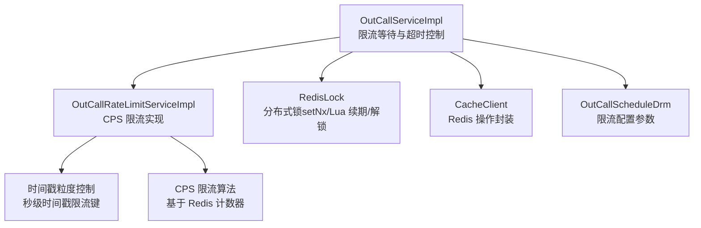
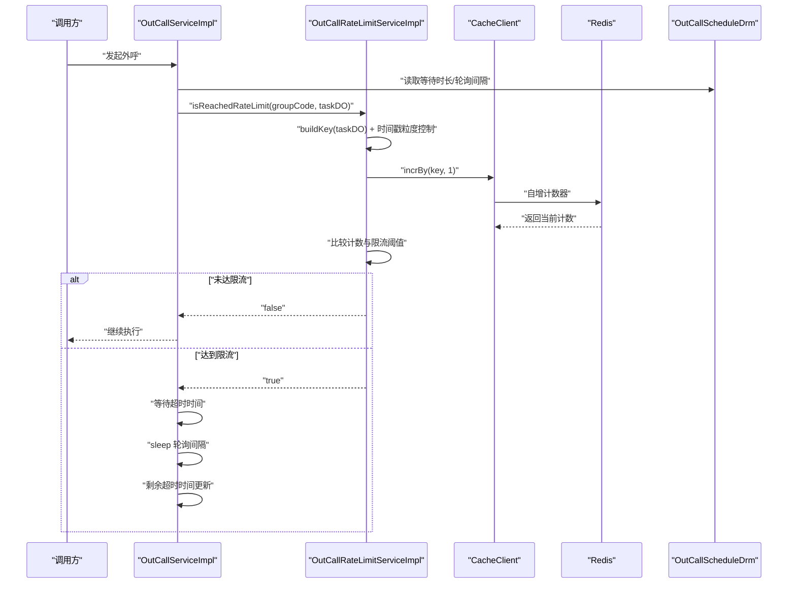
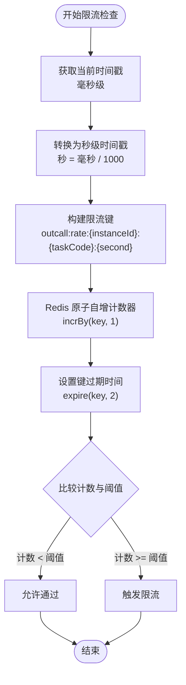
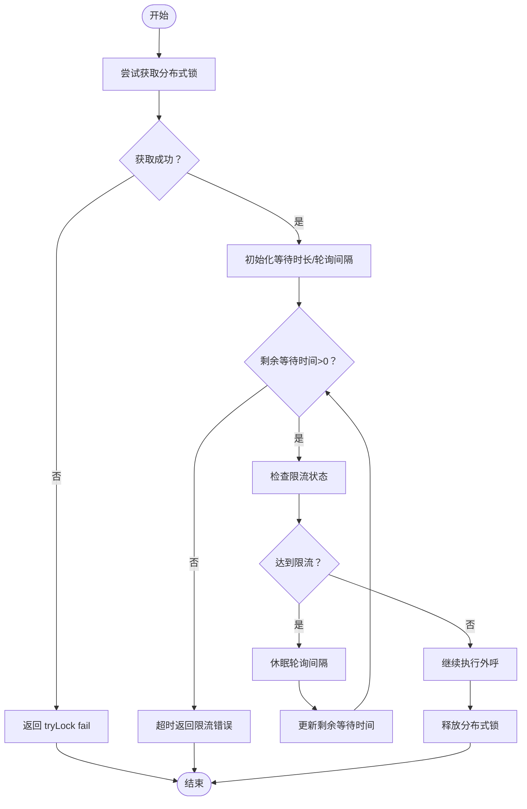
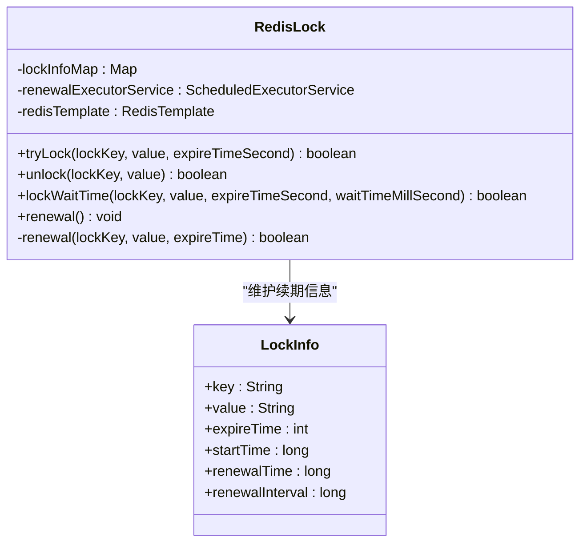
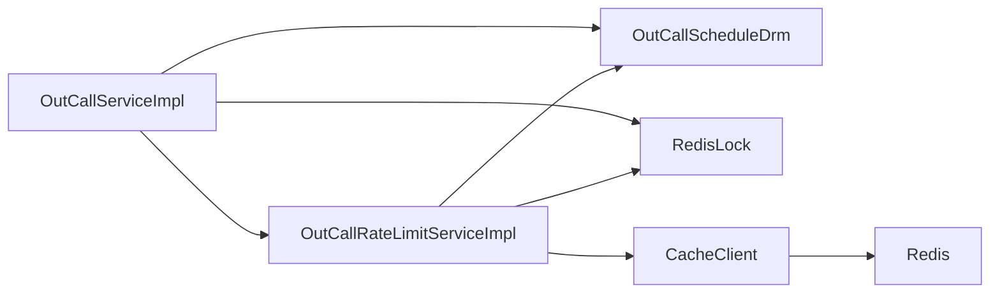

# 限流算法

<cite>
**本文引用的文件**   
- [OutCallServiceImpl.java](file://src/main/java/org/qianye/engine/OutCallServiceImpl.java)
- [OutCallRateLimitServiceImpl.java](file://src/main/java/org/qianye/engine/OutCallRateLimitServiceImpl.java)
- [RedisLock.java](file://src/main/java/org/qianye/cache/RedisLock.java)
- [CacheClient.java](file://src/main/java/org/qianye/cache/CacheClient.java)
- [OutCallScheduleDrm.java](file://src/main/java/org/qianye/common/OutCallScheduleDrm.java)
- [application.properties](file://src/main/resources/application.properties)
</cite>

## 更新摘要
**变更内容**   
- 新增时间戳粒度控制机制，通过秒级时间戳实现更精确的限流精度
- 优化限流键生成策略，增加时间戳维度提升限流效果
- 增强限流算法的实时性和准确性
- 完善分布式锁的时间管理和续期机制

## 目录
1. [引言](#引言)
2. [项目结构](#项目结构)
3. [核心组件](#核心组件)
4. [架构总览](#架构总览)
5. [详细组件分析](#详细组件分析)
6. [依赖关系分析](#依赖关系分析)
7. [性能考量](#性能考量)
8. [故障排查指南](#故障排查指南)
9. [结论](#结论)
10. [附录](#附录)

## 引言
本文件围绕 Outcall 系统的限流算法展开，系统性阐述全局限流、组内限流与会话级限流的实现思路与算法原理，并结合现有代码中的分布式锁、轮询等待与超时控制等机制，给出可操作的配置方法、调用流程图与性能优化建议。本次更新重点介绍了时间戳粒度控制的优化，通过秒级时间戳实现更精确的流量控制，显著提升了限流算法的精度和效果。

## 项目结构
Outcall 的限流相关代码主要分布在以下模块：
- 限流检查与等待：OutCallServiceImpl 中的限流等待与超时控制
- 限流服务实现：OutCallRateLimitServiceImpl（基于 CPS 限流的完整实现）
- 分布式锁：RedisLock（基于 Redis 的 setNx + Lua 解锁 + 续期）
- 缓存客户端：CacheClient（封装 Redis 操作，如 incrBy）
- 配置中心：OutCallScheduleDrm（限流等待时长、轮询间隔、请求速率控制等）

**图表来源**
- [OutCallServiceImpl.java](file://src/main/java/org/qianye/engine/OutCallServiceImpl.java#L415-L459)
- [OutCallRateLimitServiceImpl.java](file://src/main/java/org/qianye/engine/OutCallRateLimitServiceImpl.java#L1-L107)
- [RedisLock.java](file://src/main/java/org/qianye/cache/RedisLock.java#L1-L465)
- [CacheClient.java](file://src/main/java/org/qianye/cache/CacheClient.java#L1-L237)
- [OutCallScheduleDrm.java](file://src/main/java/org/qianye/common/OutCallScheduleDrm.java#L1-L112)

**章节来源**
- [OutCallServiceImpl.java](file://src/main/java/org/qianye/engine/OutCallServiceImpl.java#L415-L459)
- [OutCallRateLimitServiceImpl.java](file://src/main/java/org/qianye/engine/OutCallRateLimitServiceImpl.java#L1-L107)
- [RedisLock.java](file://src/main/java/org/qianye/cache/RedisLock.java#L1-L465)
- [CacheClient.java](file://src/main/java/org/qianye/cache/CacheClient.java#L1-L237)
- [OutCallScheduleDrm.java](file://src/main/java/org/qianye/common/OutCallScheduleDrm.java#L1-L112)

## 核心组件
- **时间戳粒度控制**：通过将毫秒时间戳转换为秒级时间戳，实现更精确的限流控制，每个秒级窗口独立计数
- **CPS 限流实现**：基于 Redis 计数器的每秒请求数限制，支持动态配置和实时调整
- **分布式锁**：使用 Redis 的 setNx 作为互斥锁，Lua 脚本安全释放，配合定时续期避免锁过期导致的竞态
- **缓存客户端**：封装 Redis 操作，提供 incrBy、expire 等能力，支撑分布式锁与限流计数
- **限流配置中心**：集中管理限流等待时长、轮询间隔、请求速率控制等参数

**章节来源**
- [OutCallRateLimitServiceImpl.java](file://src/main/java/org/qianye/engine/OutCallRateLimitServiceImpl.java#L101-L105)
- [OutCallRateLimitServiceImpl.java](file://src/main/java/org/qianye/engine/OutCallRateLimitServiceImpl.java#L60-L71)
- [RedisLock.java](file://src/main/java/org/qianye/cache/RedisLock.java#L293-L319)
- [CacheClient.java](file://src/main/java/org/qianye/cache/CacheClient.java#L40-L75)
- [OutCallScheduleDrm.java](file://src/main/java/org/qianye/common/OutCallScheduleDrm.java#L18-L24)

## 架构总览
下图展示了外呼流程中的限流检查与等待机制，以及与分布式锁、配置中心的交互：

**图表来源**
- [OutCallServiceImpl.java](file://src/main/java/org/qianye/engine/OutCallServiceImpl.java#L420-L459)
- [OutCallRateLimitServiceImpl.java](file://src/main/java/org/qianye/engine/OutCallRateLimitServiceImpl.java#L42-L52)
- [OutCallRateLimitServiceImpl.java](file://src/main/java/org/qianye/engine/OutCallRateLimitServiceImpl.java#L101-L105)
- [OutCallScheduleDrm.java](file://src/main/java/org/qianye/common/OutCallScheduleDrm.java#L18-L24)

## 详细组件分析

### 时间戳粒度控制优化（OutCallRateLimitServiceImpl）
**更新** 新增时间戳粒度控制机制，通过秒级时间戳实现更精确的限流控制

- **时间戳转换**：将毫秒时间戳 `(int) (currentTimeMillis / 1000)` 转换为秒级时间戳
- **限流键生成**：在原有键基础上增加时间戳维度 `+":"+timeSecond`，实现秒级窗口隔离
- **限流精度提升**：每个秒级窗口独立计数，避免跨秒窗口的计数干扰
- **Redis 计数器**：使用 `cacheClient.incrBy(key, 1)` 实现原子性自增，`expire(key, 2)` 设置 2 秒过期

**图表来源**
- [OutCallRateLimitServiceImpl.java](file://src/main/java/org/qianye/engine/OutCallRateLimitServiceImpl.java#L101-L105)
- [OutCallRateLimitServiceImpl.java](file://src/main/java/org/qianye/engine/OutCallRateLimitServiceImpl.java#L60-L71)

**章节来源**
- [OutCallRateLimitServiceImpl.java](file://src/main/java/org/qianye/engine/OutCallRateLimitServiceImpl.java#L101-L105)
- [OutCallRateLimitServiceImpl.java](file://src/main/java/org/qianye/engine/OutCallRateLimitServiceImpl.java#L60-L71)

### 限流等待与超时控制（OutCallServiceImpl）
- **等待机制**：基于配置的等待时长与轮询间隔，持续检查限流状态；每 10 次轮询后刷新一次任务上下文，降低过期数据带来的误判
- **超时处理**：超过等待时长仍未解除限流则判定超时，返回限流错误
- **与分布式锁协作**：在进入限流等待前先尝试获取分布式锁，避免并发冲突；执行完成后释放锁

**图表来源**
- [OutCallServiceImpl.java](file://src/main/java/org/qianye/engine/OutCallServiceImpl.java#L420-L459)

**章节来源**
- [OutCallServiceImpl.java](file://src/main/java/org/qianye/engine/OutCallServiceImpl.java#L420-L459)

### 分布式锁（RedisLock）
- **加锁**：使用 RedisTemplate 的 setIfAbsent 实现，支持设置过期时间
- **解锁**：使用 Lua 脚本，仅当键值匹配时删除，确保安全性
- **续期机制**：对长时间持有锁的任务进行定时续期，避免过期导致的竞态
- **线程池**：内置定时任务线程池，周期性扫描并续期锁

**图表来源**
- [RedisLock.java](file://src/main/java/org/qianye/cache/RedisLock.java#L396-L465)
- [RedisLock.java](file://src/main/java/org/qianye/cache/RedisLock.java#L293-L319)

**章节来源**
- [RedisLock.java](file://src/main/java/org/qianye/cache/RedisLock.java#L293-L319)
- [RedisLock.java](file://src/main/java/org/qianye/cache/RedisLock.java#L359-L394)

### 缓存客户端（CacheClient）
- **封装 Redis 操作**：提供 incrBy、expire、exists、delete 等基础 Redis 操作
- **双模式支持**：支持本地缓存和 Redis 缓存两种模式，通过配置切换
- **计数器管理**：维护本地计数器缓存，支持过期清理和原子性操作

**章节来源**
- [CacheClient.java](file://src/main/java/org/qianye/cache/CacheClient.java#L40-L75)

## 依赖关系分析
- OutCallServiceImpl 依赖 OutCallRateLimitServiceImpl 进行限流检查，依赖 OutCallScheduleDrm 获取等待时长与轮询间隔，依赖 RedisLock 提供分布式锁能力
- OutCallRateLimitServiceImpl 依赖 CacheClient 进行 Redis 操作，依赖 OutCallScheduleDrm 获取限流阈值配置
- RedisLock 作为基础设施组件，为整个限流系统提供可靠的分布式锁支持

**图表来源**
- [OutCallServiceImpl.java](file://src/main/java/org/qianye/engine/OutCallServiceImpl.java#L415-L459)
- [OutCallRateLimitServiceImpl.java](file://src/main/java/org/qianye/engine/OutCallRateLimitServiceImpl.java#L26-L33)
- [RedisLock.java](file://src/main/java/org/qianye/cache/RedisLock.java#L1-L465)
- [CacheClient.java](file://src/main/java/org/qianye/cache/CacheClient.java#L1-L237)

**章节来源**
- [OutCallServiceImpl.java](file://src/main/java/org/qianye/engine/OutCallServiceImpl.java#L415-L459)
- [OutCallRateLimitServiceImpl.java](file://src/main/java/org/qianye/engine/OutCallRateLimitServiceImpl.java#L26-L33)

## 性能考量
- **时间戳粒度优化**：秒级时间戳控制显著提升限流精度，减少跨秒窗口的计数干扰，但可能增加 Redis 键的数量
- **等待轮询开销**：轮询间隔与等待时长直接影响 CPU 占用与响应延迟。建议根据业务峰值与 Redis 延迟动态调整轮询间隔与等待上限
- **锁续期与线程池**：RedisLock 的续期线程池规模与扫描频率需与集群规模匹配，避免续期风暴
- **Redis 键管理**：时间戳粒度控制会产生大量短期键，建议合理设置过期时间和监控键空间增长

**更新** 新增时间戳粒度控制的性能影响分析

## 故障排查指南
- **限流等待超时**：检查等待时长与轮询间隔配置，确认任务上下文刷新是否生效
- **时间戳限流异常**：验证时间戳转换逻辑，检查秒级窗口的计数是否正确
- **Redis 计数器问题**：确认 Redis 连接状态，检查 incrBy 和 expire 操作的执行结果
- **分布式锁失败**：确认 Redis 可用性与序列化配置，查看解锁 Lua 脚本执行情况
- **配置中心接入**：确认 OutCallScheduleDrm 的参数是否正确注入与生效

**更新** 新增时间戳粒度控制相关的故障排查项

**章节来源**
- [OutCallServiceImpl.java](file://src/main/java/org/qianye/engine/OutCallServiceImpl.java#L420-L459)
- [OutCallRateLimitServiceImpl.java](file://src/main/java/org/qianye/engine/OutCallRateLimitServiceImpl.java#L101-L105)
- [RedisLock.java](file://src/main/java/org/qianye/cache/RedisLock.java#L293-L319)
- [OutCallScheduleDrm.java](file://src/main/java/org/qianye/common/OutCallScheduleDrm.java#L18-L24)

## 结论
Outcall 的限流体系通过"时间戳粒度控制 + CPS 限流 + 分布式锁"的组合实现了高精度的流量控制。新增的时间戳粒度控制机制显著提升了限流算法的精度和效果，通过秒级时间戳实现更精细的流量限制。当前系统已具备完整的限流实现，建议根据业务场景调整限流阈值和等待参数，结合监控指标持续优化限流策略。

**更新** 强调时间戳粒度控制对限流精度的提升作用

## 附录

### 限流参数配置清单
- **等待时长（秒）**：RateLimitWaitingTimeSecond（默认 10 秒）
- **轮询间隔（毫秒）**：FlowLimitSleepMs（默认 1000 毫秒）
- **请求速率控制（毫秒）**：RequestRateControl（默认 0 毫秒）
- **最大队列长度**：MakeCallMaxQueueSize（默认 1000）
- **最大重试次数**：MaxCallFlowRetries（默认 3）

**章节来源**
- [OutCallScheduleDrm.java](file://src/main/java/org/qianye/common/OutCallScheduleDrm.java#L18-L28)

### 限流键生成规则
- **基础键前缀**：outcall:rate:
- **完整键格式**：`outcall:rate:{instanceId}:{taskCode}:{second}`
- **时间戳粒度**：秒级时间戳，确保每个秒级窗口独立计数
- **过期时间**：2 秒，避免键空间无限增长

**更新** 新增时间戳粒度控制的键生成规则

**章节来源**
- [OutCallRateLimitServiceImpl.java](file://src/main/java/org/qianye/engine/OutCallRateLimitServiceImpl.java#L101-L105)

### Redis 配置参考
- **缓存类型**：app.cache.type=local（默认本地缓存）
- **锁类型**：app.lock.type=local（默认本地锁）
- **序列化器**：FastJsonRedisSerializer
- **连接工厂**：RedisConnectionFactory

**章节来源**
- [application.properties](file://src/main/resources/application.properties#L8-L12)
- [RedisLock.java](file://src/main/java/org/qianye/cache/RedisLock.java#L72-L77)

### 限流算法实现要点
- **CPS 限流**：基于 Redis 计数器的每秒请求数限制
- **时间戳控制**：秒级时间戳确保限流窗口的精确性
- **原子操作**：使用 incrBy 实现线程安全的计数
- **过期管理**：自动过期机制避免内存泄漏

**更新** 新增限流算法实现的关键技术要点