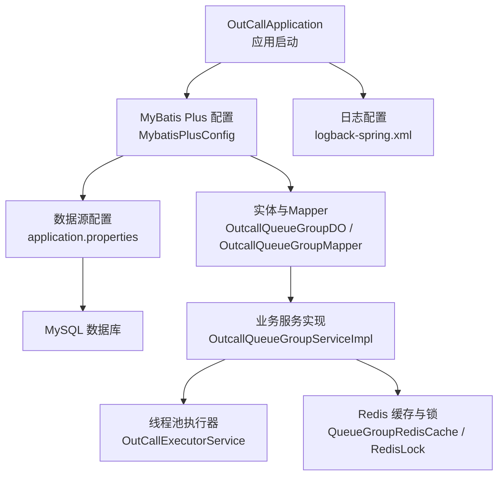
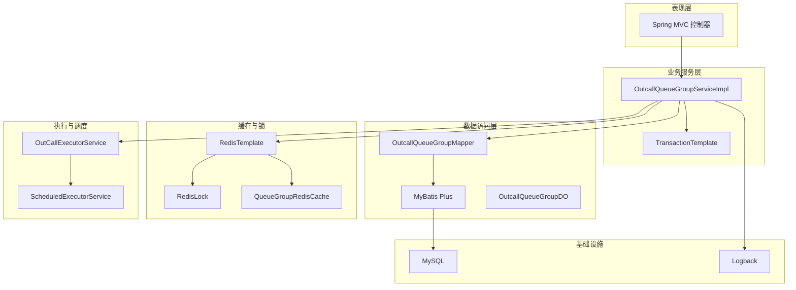
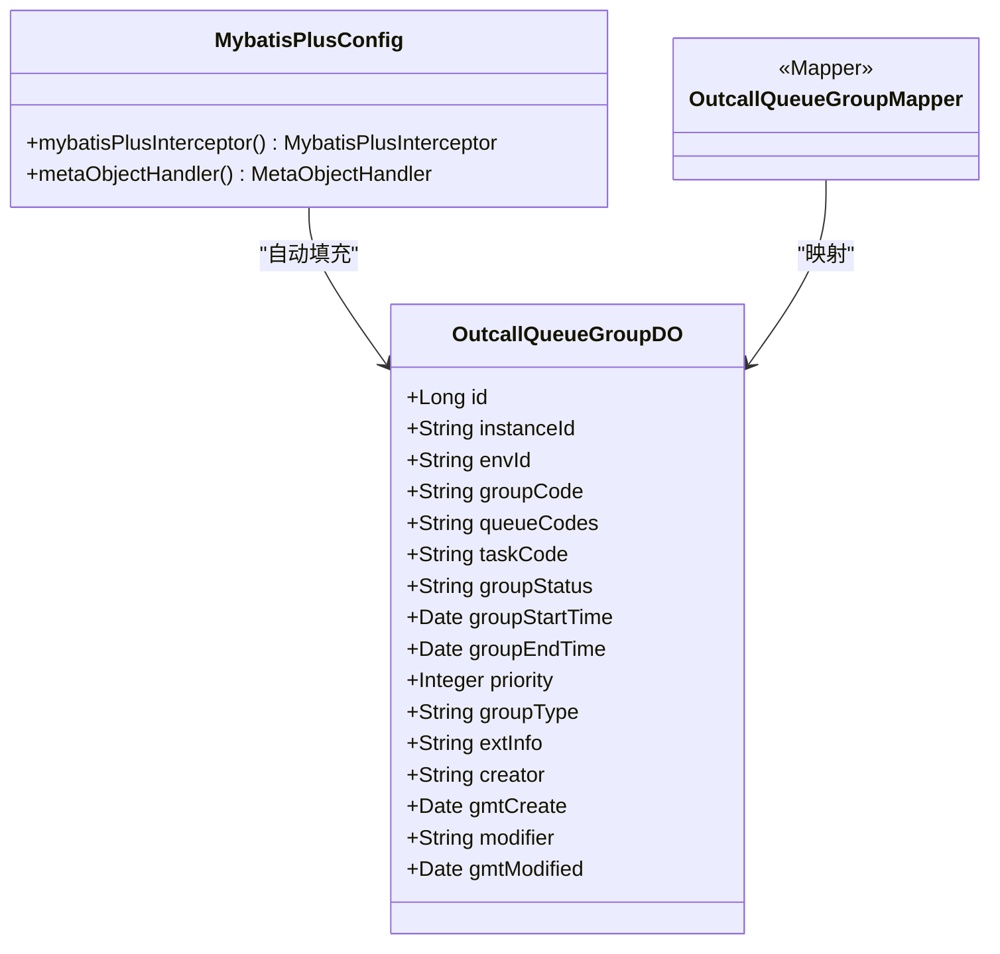
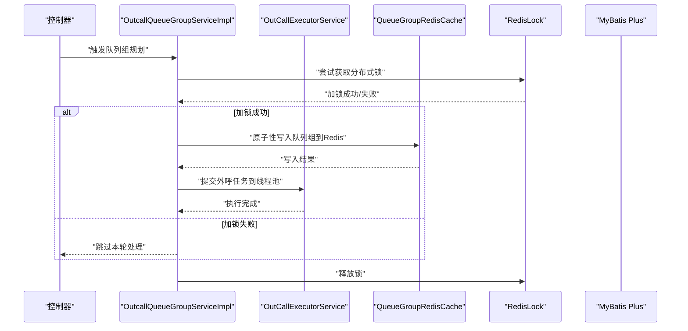
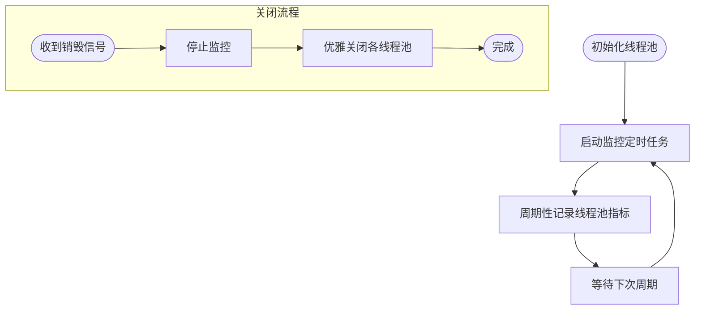
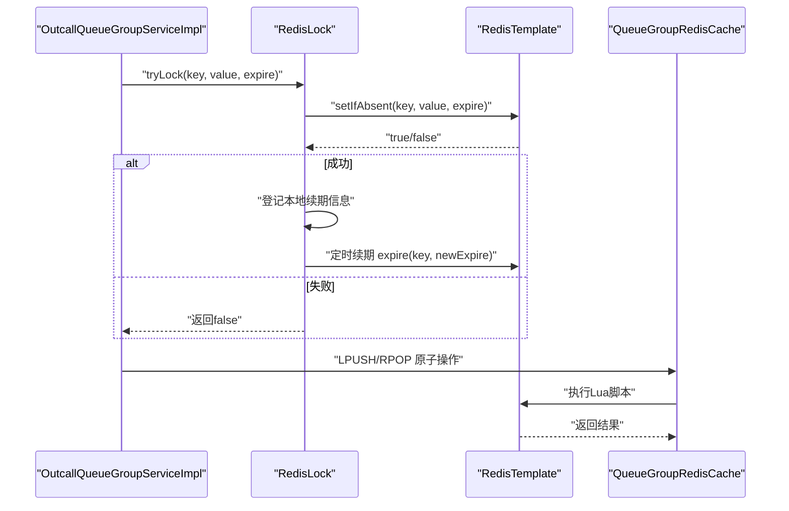
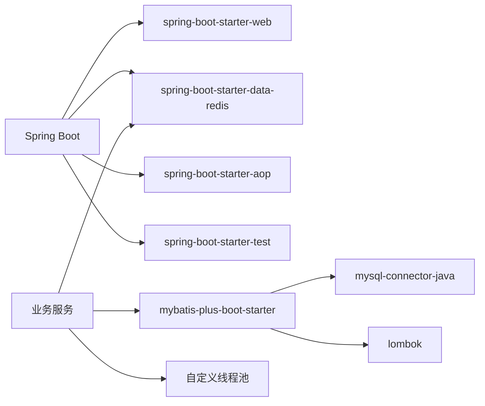

# 技术栈详解

<cite>
**本文引用的文件**
- [pom.xml](file://pom.xml)
- [application.properties](file://src/main/resources/application.properties)
- [OutCallApplication.java](file://src/main/java/org/qianye/OutCallApplication.java)
- [MybatisPlusConfig.java](file://src/main/java/org/qianye/config/MybatisPlusConfig.java)
- [OutcallQueueGroupDO.java](file://src/main/java/org/qianye/entity/OutcallQueueGroupDO.java)
- [OutcallQueueGroupMapper.java](file://src/main/java/org/qianye/mapper/OutcallQueueGroupMapper.java)
- [OutcallQueueGroupServiceImpl.java](file://src/main/java/org/qianye/service/impl/OutcallQueueGroupServiceImpl.java)
- [OutCallExecutorService.java](file://src/main/java/org/qianye/OutCallExecutorService.java)
- [RedisLock.java](file://src/main/java/org/qianye/RedisLock.java)
- [QueueGroupRedisCache.java](file://src/main/java/org/qianye/QueueGroupRedisCache.java)
- [CacheClient.java](file://src/main/java/org/qianye/CacheClient.java)
- [logback-spring.xml](file://src/main/resources/logback-spring.xml)
- [CommonConstants.java](file://src/main/java/org/qianye/CommonConstants.java)
- [ScheduleConstants.java](file://src/main/java/org/qianye/ScheduleConstants.java)
</cite>

## 目录
1. [引言](#引言)
2. [项目结构](#项目结构)
3. [核心组件](#核心组件)
4. [架构总览](#架构总览)
5. [详细组件分析](#详细组件分析)
6. [依赖关系分析](#依赖关系分析)
7. [性能考量](#性能考量)
8. [故障排查指南](#故障排查指南)
9. [结论](#结论)
10. [附录](#附录)

## 引言
本文件面向 Outcall 系统的技术栈详解，围绕 Spring Boot 2.7.18、MyBatis Plus、MySQL、Redis 等核心技术展开，系统阐述其选择原因、配置方式、集成策略与运行机制，并结合代码实现给出性能、可维护性与扩展性的权衡建议。读者无需深入源码即可理解系统如何通过这些技术协同工作，支撑外呼任务调度、队列分组管理与高并发执行。

## 项目结构
Outcall 采用标准 Spring Boot 工程目录组织，核心模块划分如下：
- 启动入口：应用启动类负责引导 Spring 上下文
- 配置层：数据库连接与 MyBatis Plus 参数配置
- 数据模型与映射：实体类与 Mapper 接口
- 业务服务：基于 MyBatis Plus 的 Service 实现
- 并发执行：自定义线程池与监控
- 缓存与分布式锁：Redis 模板封装与 Lua 脚本
- 日志：Logback 控制台输出

图表来源
- [OutCallApplication.java](file://src/main/java/org/qianye/OutCallApplication.java#L1-L13)
- [MybatisPlusConfig.java](file://src/main/java/org/qianye/config/MybatisPlusConfig.java#L1-L49)
- [application.properties](file://src/main/resources/application.properties#L1-L17)
- [OutcallQueueGroupDO.java](file://src/main/java/org/qianye/entity/OutcallQueueGroupDO.java#L1-L95)
- [OutcallQueueGroupMapper.java](file://src/main/java/org/qianye/mapper/OutcallQueueGroupMapper.java#L1-L10)
- [OutcallQueueGroupServiceImpl.java](file://src/main/java/org/qianye/service/impl/OutcallQueueGroupServiceImpl.java#L1-L120)
- [OutCallExecutorService.java](file://src/main/java/org/qianye/OutCallExecutorService.java#L1-L60)
- [QueueGroupRedisCache.java](file://src/main/java/org/qianye/QueueGroupRedisCache.java#L1-L80)
- [RedisLock.java](file://src/main/java/org/qianye/RedisLock.java#L1-L120)
- [logback-spring.xml](file://src/main/resources/logback-spring.xml#L1-L32)

章节来源
- [OutCallApplication.java](file://src/main/java/org/qianye/OutCallApplication.java#L1-L13)
- [application.properties](file://src/main/resources/application.properties#L1-L17)

## 核心组件
- Spring Boot 2.7.18：统一依赖管理与自动装配，提供 Web、Redis、AOP、测试等 Starter 支持
- MyBatis Plus 3.5.5：在 MyBatis 基础上增强，提供通用 CRUD、自动填充、乐观锁与分页插件
- MySQL 8.0.33：关系型数据库，驱动与连接参数在配置中集中管理
- Redis：分布式锁、键值缓存与 Lua 原子操作，支撑队列组缓存与续期
- 自定义线程池：多类线程池满足不同并发场景，带监控与优雅关闭

章节来源
- [pom.xml](file://pom.xml#L12-L81)
- [MybatisPlusConfig.java](file://src/main/java/org/qianye/config/MybatisPlusConfig.java#L1-L49)
- [application.properties](file://src/main/resources/application.properties#L6-L17)
- [OutCallExecutorService.java](file://src/main/java/org/qianye/OutCallExecutorService.java#L1-L60)

## 架构总览
Outcall 的技术架构以“数据持久层 + 业务服务层 + 并发执行层 + 缓存与锁层”为主线，配合 Spring Boot 的自动装配与配置中心，形成清晰的分层与职责边界。

图表来源
- [OutcallQueueGroupServiceImpl.java](file://src/main/java/org/qianye/service/impl/OutcallQueueGroupServiceImpl.java#L32-L120)
- [OutcallQueueGroupMapper.java](file://src/main/java/org/qianye/mapper/OutcallQueueGroupMapper.java#L1-L10)
- [OutcallQueueGroupDO.java](file://src/main/java/org/qianye/entity/OutcallQueueGroupDO.java#L1-L95)
- [RedisLock.java](file://src/main/java/org/qianye/RedisLock.java#L59-L120)
- [QueueGroupRedisCache.java](file://src/main/java/org/qianye/QueueGroupRedisCache.java#L23-L80)
- [OutCallExecutorService.java](file://src/main/java/org/qianye/OutCallExecutorService.java#L11-L60)
- [logback-spring.xml](file://src/main/resources/logback-spring.xml#L1-L32)

## 详细组件分析

### Spring Boot 与依赖管理
- 依赖管理：父工程提供 Spring Boot 版本与默认依赖约束，确保版本一致性
- 核心依赖：Web、Redis、AOP、MyBatis Plus、MySQL 驱动、JSON 工具、Joda-Time、Lombok 等
- 构建插件：Spring Boot Maven 插件用于打包与运行

章节来源
- [pom.xml](file://pom.xml#L12-L81)

### MyBatis Plus 配置与使用
- 插件配置：启用乐观锁拦截器；分页插件暂未启用，避免 jsqlparser 版本冲突
- 自动填充：插入与更新时自动填充创建/修改时间字段
- 映射规范：实体类标注表名与字段填充策略；Mapper 继承 BaseMapper 即获得通用 CRUD

图表来源
- [MybatisPlusConfig.java](file://src/main/java/org/qianye/config/MybatisPlusConfig.java#L14-L48)
- [OutcallQueueGroupDO.java](file://src/main/java/org/qianye/entity/OutcallQueueGroupDO.java#L12-L94)
- [OutcallQueueGroupMapper.java](file://src/main/java/org/qianye/mapper/OutcallQueueGroupMapper.java#L1-L10)

章节来源
- [MybatisPlusConfig.java](file://src/main/java/org/qianye/config/MybatisPlusConfig.java#L1-L49)
- [OutcallQueueGroupDO.java](file://src/main/java/org/qianye/entity/OutcallQueueGroupDO.java#L1-L95)
- [OutcallQueueGroupMapper.java](file://src/main/java/org/qianye/mapper/OutcallQueueGroupMapper.java#L1-L10)

### 数据库配置与连接
- 数据源：MySQL 驱动、URL、用户名、密码集中配置
- MyBatis Plus：Mapper XML 位置、驼峰映射、日志实现、全局 ID 类型策略

章节来源
- [application.properties](file://src/main/resources/application.properties#L6-L17)

### 业务服务与事务
- 服务实现：基于 ServiceImpl<Mapper, DO>，继承通用能力并扩展业务逻辑
- 事务：使用 TransactionTemplate 进行编程式事务控制
- 并发：通过自定义线程池提交任务，支持监控与优雅关闭

图表来源
- [OutcallQueueGroupServiceImpl.java](file://src/main/java/org/qianye/service/impl/OutcallQueueGroupServiceImpl.java#L170-L271)
- [RedisLock.java](file://src/main/java/org/qianye/RedisLock.java#L253-L313)
- [QueueGroupRedisCache.java](file://src/main/java/org/qianye/QueueGroupRedisCache.java#L86-L114)
- [OutCallExecutorService.java](file://src/main/java/org/qianye/OutCallExecutorService.java#L14-L52)

章节来源
- [OutcallQueueGroupServiceImpl.java](file://src/main/java/org/qianye/service/impl/OutcallQueueGroupServiceImpl.java#L32-L162)

### 线程池配置与监控
- 多类线程池：队列组处理、重试、外呼、计划任务、通用外呼等
- 队列与拒绝策略：不同场景采用丢弃或调用者线程执行策略
- 监控：定时打印各线程池状态，便于观察负载与积压
- 优雅关闭：销毁阶段逐个关闭并等待终止，避免资源泄漏

图表来源
- [OutCallExecutorService.java](file://src/main/java/org/qianye/OutCallExecutorService.java#L55-L137)
- [OutCallExecutorService.java](file://src/main/java/org/qianye/OutCallExecutorService.java#L141-L211)

章节来源
- [OutCallExecutorService.java](file://src/main/java/org/qianye/OutCallExecutorService.java#L1-L211)

### Redis 缓存与分布式锁
- 缓存客户端：提供基础的缓存操作占位实现，后续可接入 RedisTemplate
- RedisTemplate：自定义序列化器，支持字符串键与 JSON 值
- Lua 脚本：保证原子性，如批量 LPUSH、RPOP、EXPIRE 等
- 分布式锁：基于 SETNX（setIfAbsent）+ Lua 解锁，支持续期与超时保护
- 续期机制：定时扫描持有锁的键，按阈值进行过期时间续期

图表来源
- [RedisLock.java](file://src/main/java/org/qianye/RedisLock.java#L253-L313)
- [RedisLock.java](file://src/main/java/org/qianye/RedisLock.java#L413-L487)
- [QueueGroupRedisCache.java](file://src/main/java/org/qianye/QueueGroupRedisCache.java#L237-L269)

章节来源
- [CacheClient.java](file://src/main/java/org/qianye/CacheClient.java#L1-L25)
- [QueueGroupRedisCache.java](file://src/main/java/org/qianye/QueueGroupRedisCache.java#L1-L279)
- [RedisLock.java](file://src/main/java/org/qianye/RedisLock.java#L1-L645)

### 日志与常量
- 日志：控制台输出，便于开发调试与问题定位
- 常量：任务编码、时间槽等关键常量集中管理，提升可读性与一致性

章节来源
- [logback-spring.xml](file://src/main/resources/logback-spring.xml#L1-L32)
- [CommonConstants.java](file://src/main/java/org/qianye/CommonConstants.java#L1-L17)
- [ScheduleConstants.java](file://src/main/java/org/qianye/ScheduleConstants.java#L1-L16)

## 依赖关系分析
- Spring Boot 管理版本与自动装配，MyBatis Plus 提供 ORM 能力，Redis 提供缓存与锁，MySQL 提供持久化
- 业务服务通过 Mapper 访问数据库，同时与 Redis、线程池协作完成高并发任务编排
- 依赖冲突规避：分页插件暂不启用，避免 jsqlparser 版本问题

图表来源
- [pom.xml](file://pom.xml#L24-L81)
- [OutcallQueueGroupServiceImpl.java](file://src/main/java/org/qianye/service/impl/OutcallQueueGroupServiceImpl.java#L32-L68)

章节来源
- [pom.xml](file://pom.xml#L12-L81)

## 性能考量
- 数据库层面
  - 使用自动填充减少空值与重复逻辑
  - 乐观锁避免并发写覆盖
  - 分页插件暂禁用，降低依赖复杂度；如需分页，建议在稳定版本后启用
- 缓存与锁
  - Redis 原子脚本保证队列组写入与弹出的一致性
  - 分布式锁续期降低长时间任务导致的锁过期风险
- 并发执行
  - 多线程池隔离不同任务类型，避免相互影响
  - 监控线程池队列长度与活跃线程数，及时发现积压
- 序列化与网络
  - RedisTemplate 采用合适的序列化器，兼顾可读性与性能

## 故障排查指南
- 线程池异常
  - 观察监控日志中各线程池的队列长度与完成任务数，判断是否存在积压或拒绝
  - 发生拒绝策略触发时，评估线程池容量与任务耗时，必要时扩容或优化任务
- Redis 相关
  - 分布式锁解锁失败时，检查 Lua 脚本与 key/value 匹配
  - 续期失败时，确认 Redis 连接与命令返回值
- 数据库
  - 乐观锁冲突时，检查并发更新策略与重试逻辑
  - SQL 日志开启后可定位慢查询与异常语句

章节来源
- [OutCallExecutorService.java](file://src/main/java/org/qianye/OutCallExecutorService.java#L66-L137)
- [RedisLock.java](file://src/main/java/org/qianye/RedisLock.java#L291-L313)
- [application.properties](file://src/main/resources/application.properties#L12-L16)

## 结论
Outcall 通过 Spring Boot 与 MyBatis Plus 构建稳定的后端骨架，结合 Redis 的缓存与分布式锁能力，以及多线程池的并发调度，实现了高可用的任务编排与执行。配置层面强调可维护性与可扩展性，运行层面注重可观测与稳定性。建议在后续演进中逐步启用分页插件、完善缓存客户端实现，并持续优化线程池参数与 Redis 脚本，以应对更高的并发与更复杂的业务场景。

## 附录
- 版本兼容性提示
  - Spring Boot 2.7.18 与 MyBatis Plus 3.5.5 在当前依赖树下保持兼容
  - MySQL 驱动版本与数据库版本匹配良好
  - 如启用分页插件，请确保 jsqlparser 版本与 MyBatis Plus 兼容
- 最佳实践
  - 为关键业务接口增加幂等与重试策略
  - 对热点数据与队列组操作使用 Redis 原子脚本
  - 定期审查线程池配置与监控告警阈值
  - 使用统一的日志与链路追踪，便于问题定位