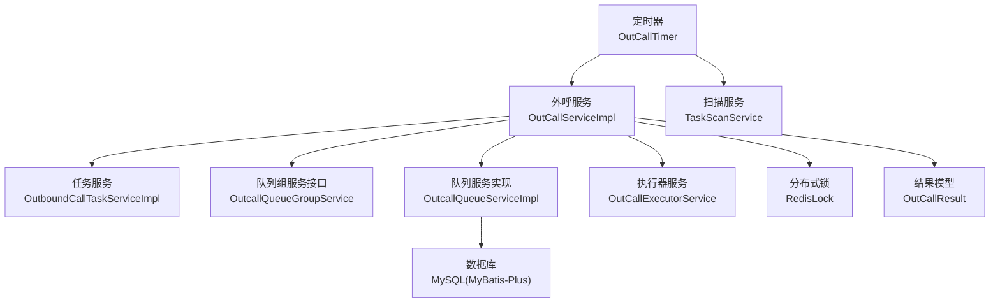
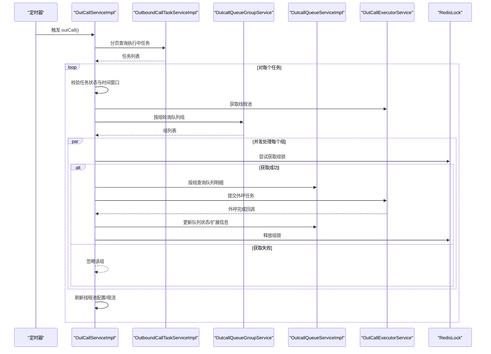
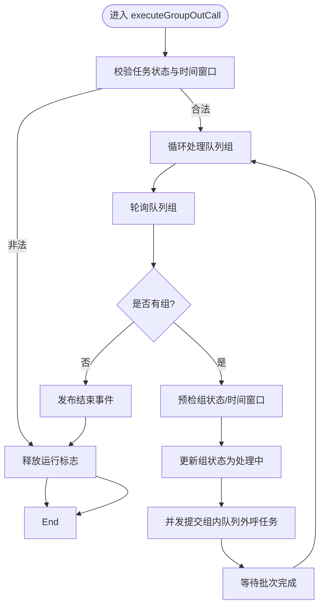
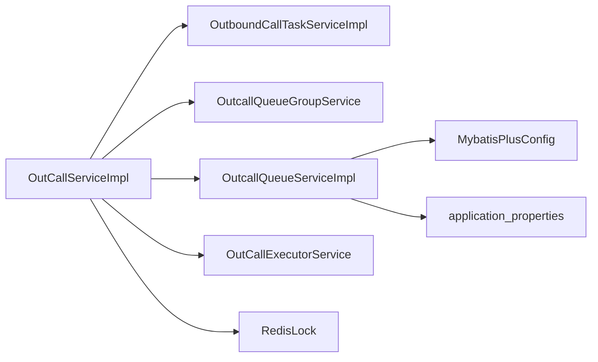
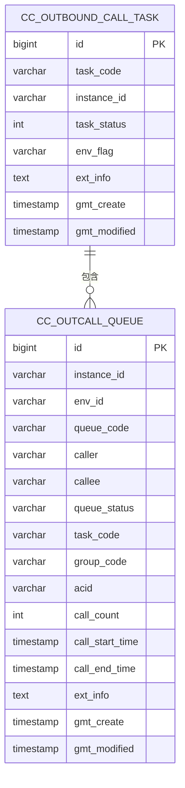
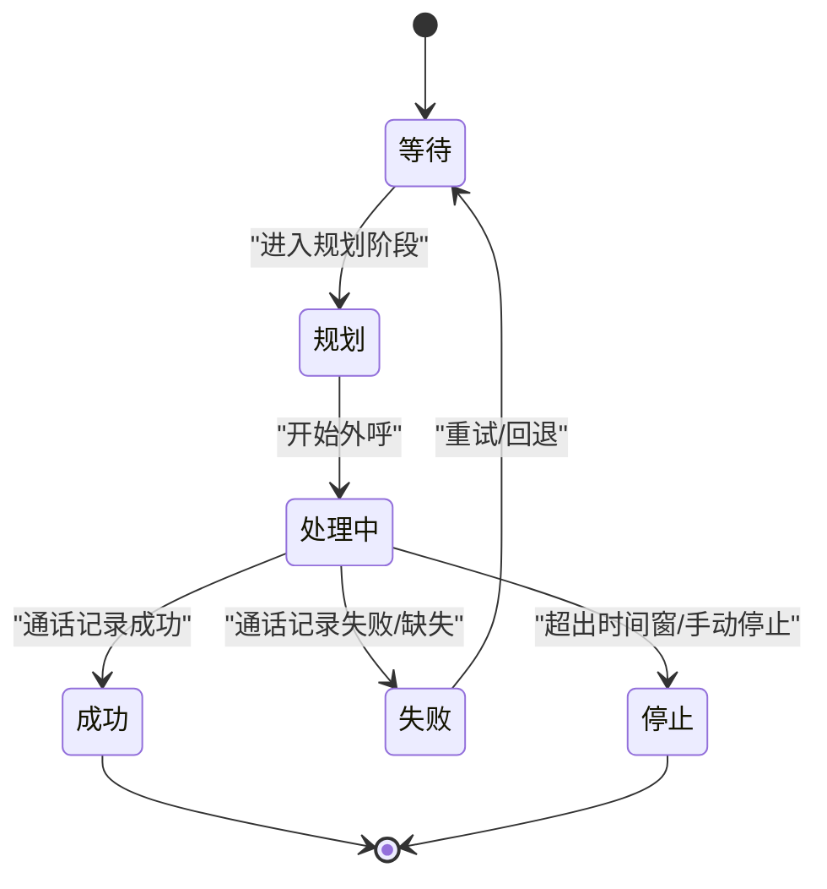

# 数据流分析

<cite>
**本文引用的文件**
- [OutCallServiceImpl.java](file://src/main/java/org/qianye/OutCallServiceImpl.java)
- [OutCallService.java](file://src/main/java/org/qianye/OutCallService.java)
- [OutboundCallTaskDO.java](file://src/main/java/org/qianye/entity/OutboundCallTaskDO.java)
- [OutcallQueueDO.java](file://src/main/java/org/qianye/entity/OutcallQueueDO.java)
- [OutcallQueueServiceImpl.java](file://src/main/java/org/qianye/service/impl/OutcallQueueServiceImpl.java)
- [OutboundCallTaskServiceImpl.java](file://src/main/java/org/qianye/service/impl/OutboundCallTaskServiceImpl.java)
- [OutcallQueueGroupService.java](file://src/main/java/org/qianye/service/OutcallQueueGroupService.java)
- [OutCallExecutorService.java](file://src/main/java/org/qianye/OutCallExecutorService.java)
- [RedisLock.java](file://src/main/java/org/qianye/RedisLock.java)
- [OutCallResult.java](file://src/main/java/org/qianye/OutCallResult.java)
- [OutCallTimer.java](file://src/main/java/org/qianye/OutCallTimer.java)
- [application.properties](file://src/main/resources/application.properties)
- [MybatisPlusConfig.java](file://src/main/java/org/qianye/config/MybatisPlusConfig.java)
- [TaskStatusEnum.java](file://src/main/java/org/qianye/TaskStatusEnum.java)
- [QueueStatus.java](file://src/main/java/org/qianye/QueueStatus.java)
- [QueueGroupRedisCache.java](file://src/main/java/org/qianye/QueueGroupRedisCache.java)
</cite>

## 目录
1. [简介](#简介)
2. [项目结构](#项目结构)
3. [核心组件](#核心组件)
4. [架构总览](#架构总览)
5. [详细组件分析](#详细组件分析)
6. [依赖关系分析](#依赖关系分析)
7. [性能考量](#性能考量)
8. [故障排查指南](#故障排查指南)
9. [结论](#结论)
10. [附录](#附录)

## 简介
本文件面向 Outcall 系统，聚焦“外呼任务从创建到完成”的完整数据流，覆盖以下关键主题：
- 任务状态变更与时间窗口控制
- 队列数据更新与回传机制
- 外呼执行链路与并发调度
- 分布式锁、限流与线程池策略
- 缓存与数据库一致性保障
- 数据流图与状态转换图，帮助开发者快速理解复杂流程

## 项目结构
Outcall 采用典型的分层架构：定时调度触发任务 → 任务服务解析任务 → 队列组与队列服务组织数据 → 执行器并发外呼 → 结果回写与状态更新。

图表来源
- [OutCallTimer.java](file://src/main/java/org/qianye/OutCallTimer.java#L64-L69)
- [OutCallServiceImpl.java](file://src/main/java/org/qianye/OutCallServiceImpl.java#L78-L110)
- [OutboundCallTaskServiceImpl.java](file://src/main/java/org/qianye/service/impl/OutboundCallTaskServiceImpl.java#L40-L56)
- [OutcallQueueServiceImpl.java](file://src/main/java/org/qianye/service/impl/OutcallQueueServiceImpl.java#L377-L471)
- [OutCallExecutorService.java](file://src/main/java/org/qianye/OutCallExecutorService.java#L14-L52)
- [RedisLock.java](file://src/main/java/org/qianye/RedisLock.java#L253-L273)
- [OutCallResult.java](file://src/main/java/org/qianye/OutCallResult.java#L1-L50)

章节来源
- [OutCallTimer.java](file://src/main/java/org/qianye/OutCallTimer.java#L27-L117)
- [application.properties](file://src/main/resources/application.properties#L1-L17)

## 核心组件
- 外呼服务实现：负责分页拉取“执行中”任务、按组并发外呼、限流与速率控制、状态回写与事件发布。
- 任务服务实现：提供任务分页查询、状态更新、按实例+任务码查询。
- 队列服务实现：提供队列分页查询、批量更新、按条件检索、基于通话记录的状态回填。
- 队列组服务接口：抽象队列组状态管理、规划与停止、批量操作。
- 执行器服务：集中管理多类线程池，含队列组线程池、重试线程池、通用外呼线程池等。
- 分布式锁：基于 Redis 的 Lua 脚本释放，支持续期与超时保护。
- 结果模型：统一外呼结果与失败/重试原因键值。
- 定时器：调度外呼主流程、任务扫描、队列组与队列状态检查。

章节来源
- [OutCallServiceImpl.java](file://src/main/java/org/qianye/OutCallServiceImpl.java#L31-L70)
- [OutboundCallTaskServiceImpl.java](file://src/main/java/org/qianye/service/impl/OutboundCallTaskServiceImpl.java#L16-L66)
- [OutcallQueueServiceImpl.java](file://src/main/java/org/qianye/service/impl/OutcallQueueServiceImpl.java#L28-L80)
- [OutcallQueueGroupService.java](file://src/main/java/org/qianye/service/OutcallQueueGroupService.java#L12-L78)
- [OutCallExecutorService.java](file://src/main/java/org/qianye/OutCallExecutorService.java#L13-L211)
- [RedisLock.java](file://src/main/java/org/qianye/RedisLock.java#L63-L313)
- [OutCallResult.java](file://src/main/java/org/qianye/OutCallResult.java#L6-L50)

## 架构总览
外呼主流程由定时器驱动，每分钟触发一次外呼扫描；服务层逐页拉取“执行中”任务，按组并发处理，每个队列组通过 Redis 分布式锁确保互斥执行，线程池并发发起外呼请求，并在完成后更新队列状态与扩展信息。

图表来源
- [OutCallTimer.java](file://src/main/java/org/qianye/OutCallTimer.java#L64-L69)
- [OutCallServiceImpl.java](file://src/main/java/org/qianye/OutCallServiceImpl.java#L78-L110)
- [OutcallQueueGroupService.java](file://src/main/java/org/qianye/service/OutcallQueueGroupService.java#L34-L46)
- [OutcallQueueServiceImpl.java](file://src/main/java/org/qianye/service/impl/OutcallQueueServiceImpl.java#L377-L471)
- [OutCallExecutorService.java](file://src/main/java/org/qianye/OutCallExecutorService.java#L14-L52)
- [RedisLock.java](file://src/main/java/org/qianye/RedisLock.java#L253-L273)

## 详细组件分析

### 外呼服务实现（OutCallServiceImpl）
- 分页扫描“执行中”任务，逐个任务并发执行组外呼。
- 任务合法性校验：状态允许外呼、在当日可呼时间段内。
- 速率与队列长度控制：根据调度配置限制线程池排队长度，避免积压。
- 组级并发：每个队列组独立线程池，组内并发提交外呼任务。
- 分布式锁：组锁确保同一组在任意时刻仅有一个执行实例，避免重复外呼。
- 限流等待：带超时的限流等待，超时则将组置为等待或失败。
- 事件发布：开始/结束阶段发布事件，便于外部监听。
- 异常处理：捕获异常后更新组状态为失败并触发重规划。

图表来源
- [OutCallServiceImpl.java](file://src/main/java/org/qianye/OutCallServiceImpl.java#L113-L255)
- [OutCallServiceImpl.java](file://src/main/java/org/qianye/OutCallServiceImpl.java#L285-L415)
- [OutCallServiceImpl.java](file://src/main/java/org/qianye/OutCallServiceImpl.java#L455-L578)

章节来源
- [OutCallServiceImpl.java](file://src/main/java/org/qianye/OutCallServiceImpl.java#L78-L255)
- [OutCallServiceImpl.java](file://src/main/java/org/qianye/OutCallServiceImpl.java#L285-L578)

### 任务服务实现（OutboundCallTaskServiceImpl）
- 提供分页查询“执行中”任务，便于外呼服务批量处理。
- 支持按实例+任务码查询与状态更新，用于状态一致性维护。

章节来源
- [OutboundCallTaskServiceImpl.java](file://src/main/java/org/qianye/service/impl/OutboundCallTaskServiceImpl.java#L40-L66)

### 队列服务实现（OutcallQueueServiceImpl）
- 提供队列分页查询、按编码/编码集合查询、按条件查询。
- 基于通话记录回填队列状态：若通话记录存在且成功则置为成功，否则置为停止。
- 批量更新队列状态，支持按最后状态精确更新，降低并发冲突概率。

章节来源
- [OutcallQueueServiceImpl.java](file://src/main/java/org/qianye/service/impl/OutcallQueueServiceImpl.java#L377-L471)
- [OutcallQueueServiceImpl.java](file://src/main/java/org/qianye/service/impl/OutcallQueueServiceImpl.java#L155-L213)
- [OutcallQueueServiceImpl.java](file://src/main/java/org/qianye/service/impl/OutcallQueueServiceImpl.java#L534-L556)

### 队列组服务接口（OutcallQueueGroupService）
- 抽象队列组状态管理：查询、更新、批量更新、停止组及关联队列。
- 支持按组码列表查询与分页查询，配合运行时提供者轮询。

章节来源
- [OutcallQueueGroupService.java](file://src/main/java/org/qianye/service/OutcallQueueGroupService.java#L12-L78)

### 执行器服务（OutCallExecutorService）
- 集中管理多类线程池：队列组线程池、重试线程池、通用外呼线程池、华北专线线程池、计划任务线程池。
- 定时监控线程池状态，便于运维观察与问题定位。

章节来源
- [OutCallExecutorService.java](file://src/main/java/org/qianye/OutCallExecutorService.java#L13-L211)

### 分布式锁（RedisLock）
- 基于 Redis 的 setIfAbsent 获取锁，Lua 脚本释放锁，保证原子性。
- 自动续期：超过阈值时定期续期，避免长时间持有导致的死锁风险。
- 提供等待式获取与存在性检查，便于上层做幂等与容错。

章节来源
- [RedisLock.java](file://src/main/java/org/qianye/RedisLock.java#L253-L313)
- [RedisLock.java](file://src/main/java/org/qianye/RedisLock.java#L413-L487)

### 结果模型（OutCallResult）
- 统一外呼结果结构与失败/重试原因键名，便于下游消费与统计。

章节来源
- [OutCallResult.java](file://src/main/java/org/qianye/OutCallResult.java#L6-L50)

### 定时器（OutCallTimer）
- 每分钟触发外呼扫描，每两分钟扫描任务，每五分检查队列组与队列状态。
- 异步执行，避免阻塞主线程。

章节来源
- [OutCallTimer.java](file://src/main/java/org/qianye/OutCallTimer.java#L64-L101)

## 依赖关系分析
- 外呼服务依赖任务服务、队列组服务、队列服务、执行器服务、分布式锁、结果模型与事件发布。
- 队列服务依赖数据库访问层（MyBatis-Plus）与通话记录服务，实现状态回填。
- 定时器依赖外呼服务与扫描服务，形成闭环调度。

图表来源
- [OutCallServiceImpl.java](file://src/main/java/org/qianye/OutCallServiceImpl.java#L34-L68)
- [OutcallQueueServiceImpl.java](file://src/main/java/org/qianye/service/impl/OutcallQueueServiceImpl.java#L28-L42)
- [MybatisPlusConfig.java](file://src/main/java/org/qianye/config/MybatisPlusConfig.java#L30-L48)
- [application.properties](file://src/main/resources/application.properties#L6-L16)

章节来源
- [OutCallServiceImpl.java](file://src/main/java/org/qianye/OutCallServiceImpl.java#L34-L68)
- [OutcallQueueServiceImpl.java](file://src/main/java/org/qianye/service/impl/OutcallQueueServiceImpl.java#L28-L42)
- [MybatisPlusConfig.java](file://src/main/java/org/qianye/config/MybatisPlusConfig.java#L30-L48)

## 性能考量
- 线程池隔离：队列组线程池与通用外呼线程池分离，避免互相影响。
- 限流与背压：通过等待限流释放与线程池排队上限控制流量，防止系统过载。
- 批量查询与更新：队列按编码批量查询，减少 SQL 调用次数；批量更新降低数据库压力。
- 缓存与锁：队列组运行时缓存与组锁结合，提升吞吐同时保证一致性。
- 监控与可观测：线程池状态定时输出，便于及时发现异常。

## 故障排查指南
- 任务状态异常
  - 现象：任务不在允许外呼状态或不在当日可呼时间窗内。
  - 排查：确认任务状态枚举与时间窗口计算逻辑。
  - 参考
    - [OutCallServiceImpl.java](file://src/main/java/org/qianye/OutCallServiceImpl.java#L422-L448)
    - [TaskStatusEnum.java](file://src/main/java/org/qianye/TaskStatusEnum.java#L17-L20)
- 组锁失败
  - 现象：组锁获取失败，组被忽略。
  - 排查：检查 Redis 连通性、锁键构造、续期线程是否正常。
  - 参考
    - [OutCallServiceImpl.java](file://src/main/java/org/qianye/OutCallServiceImpl.java#L690-L695)
    - [RedisLock.java](file://src/main/java/org/qianye/RedisLock.java#L253-L273)
- 线程池满/队列积压
  - 现象：外呼队列长度超过阈值，队列置为等待。
  - 排查：调整线程池大小与队列容量，或降低并发度。
  - 参考
    - [OutCallServiceImpl.java](file://src/main/java/org/qianye/OutCallServiceImpl.java#L703-L716)
- 通话记录缺失
  - 现象：队列状态无法回填，可能被置为停止。
  - 排查：核对通话记录查询条件与字段映射。
  - 参考
    - [OutcallQueueServiceImpl.java](file://src/main/java/org/qianye/service/impl/OutcallQueueServiceImpl.java#L156-L213)

章节来源
- [OutCallServiceImpl.java](file://src/main/java/org/qianye/OutCallServiceImpl.java#L690-L716)
- [OutcallQueueServiceImpl.java](file://src/main/java/org/qianye/service/impl/OutcallQueueServiceImpl.java#L156-L213)
- [RedisLock.java](file://src/main/java/org/qianye/RedisLock.java#L253-L273)

## 结论
Outcall 系统通过“定时调度 + 任务分页扫描 + 组级并发 + 分布式锁 + 限流与背压 + 通话记录回填”的组合，实现了高吞吐、低冲突、可扩展的外呼执行链路。建议在生产环境中持续关注线程池与限流配置、Redis 锁续期与超时策略、以及数据库写入热点问题，以进一步提升稳定性与性能。

## 附录

### 数据模型与状态转换
- 任务实体包含任务编码、实例 ID、任务状态、环境标志、扩展信息等字段，支持 MyBatis-Plus 自动填充。
- 队列实体包含队列编码、主被叫、状态、任务编码、组编码、通话 ID、呼叫次数、时间戳与扩展信息等字段。
- 队列状态枚举：WAITING、PLANNING、PROCESSING、FAILED、STOP。

图表来源
- [OutboundCallTaskDO.java](file://src/main/java/org/qianye/entity/OutboundCallTaskDO.java#L13-L95)
- [OutcallQueueDO.java](file://src/main/java/org/qianye/entity/OutcallQueueDO.java#L13-L104)

### 状态转换图（队列）

图表来源
- [QueueStatus.java](file://src/main/java/org/qianye/QueueStatus.java#L3-L9)
- [OutcallQueueServiceImpl.java](file://src/main/java/org/qianye/service/impl/OutcallQueueServiceImpl.java#L156-L213)