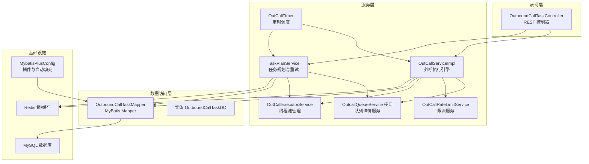
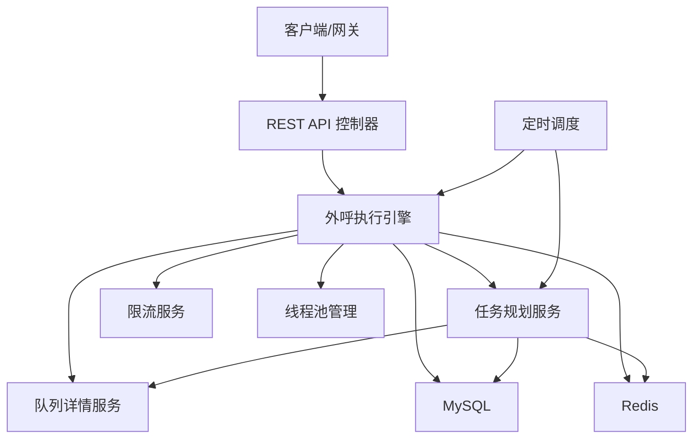
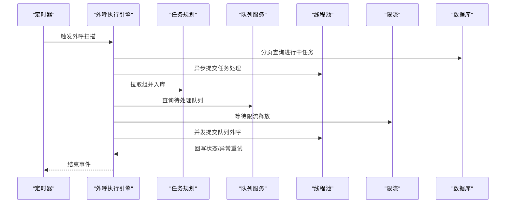
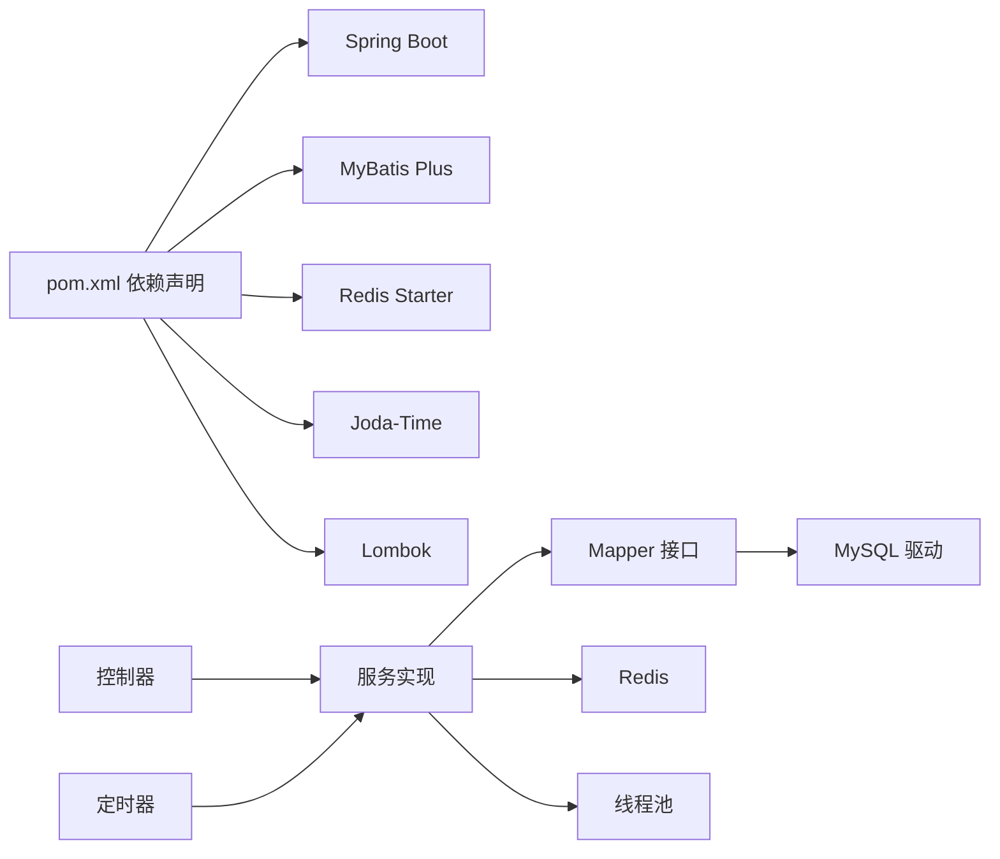

# 架构总览

<cite>
**本文引用的文件**
- [OutCallApplication.java](file://src/main/java/org/qianye/OutCallApplication.java)
- [pom.xml](file://pom.xml)
- [application.properties](file://src/main/resources/application.properties)
- [MybatisPlusConfig.java](file://src/main/java/org/qianye/config/MybatisPlusConfig.java)
- [OutCallServiceImpl.java](file://src/main/java/org/qianye/OutCallServiceImpl.java)
- [OutCallExecutorService.java](file://src/main/java/org/qianye/OutCallExecutorService.java)
- [OutCallRateLimitService.java](file://src/main/java/org/qianye/OutCallRateLimitService.java)
- [OutcallQueueService.java](file://src/main/java/org/qianye/OutcallQueueService.java)
- [TaskPlanService.java](file://src/main/java/org/qianye/TaskPlanService.java)
- [OutCallScheduleDrm.java](file://src/main/java/org/qianye/OutCallScheduleDrm.java)
- [OutCallTimer.java](file://src/main/java/org/qianye/OutCallTimer.java)
- [OutboundCallTaskController.java](file://src/main/java/org/qianye/controller/OutboundCallTaskController.java)
- [OutboundCallTaskDO.java](file://src/main/java/org/qianye/entity/OutboundCallTaskDO.java)
- [OutboundCallTaskMapper.java](file://src/main/java/org/qianye/mapper/OutboundCallTaskMapper.java)
</cite>

## 目录
1. [引言](#引言)
2. [项目结构](#项目结构)
3. [核心组件](#核心组件)
4. [架构总览](#架构总览)
5. [详细组件分析](#详细组件分析)
6. [依赖分析](#依赖分析)
7. [性能考虑](#性能考虑)
8. [故障排查指南](#故障排查指南)
9. [结论](#结论)

## 引言
本文件面向 Outcall 系统，提供系统架构总览与关键模块解析，重点阐述以下内容：
- 分层架构设计（Controller-Service-DAO）与职责边界
- 微服务化思想在单体应用中的落地方式（通过服务拆分与线程池隔离）
- 外呼执行引擎、队列管理、任务调度、限流控制等核心模块的协作机制
- 架构决策与优势（Spring Boot + MyBatis Plus 组合、多线程池并发调度、Redis 锁与缓存）
- 高并发外呼调度的实现思路与可扩展点

## 项目结构
Outcall 采用标准 Spring Boot 工程结构，按关注点分层组织代码：
- controller 层：对外提供 REST API，负责请求接入与响应封装
- service 层：业务编排与流程控制，包含执行引擎、任务规划、队列管理等
- mapper 层：基于 MyBatis Plus 的数据访问接口
- config 层：框架与第三方集成配置（MyBatis Plus 插件、Redis、AOP 等）
- entity 层：持久化实体与 DTO
- resources：配置文件、SQL 初始化脚本、日志配置



图表来源
- [OutboundCallTaskController.java](file://src/main/java/org/qianye/controller/OutboundCallTaskController.java#L1-L72)
- [OutCallServiceImpl.java](file://src/main/java/org/qianye/OutCallServiceImpl.java#L1-L120)
- [TaskPlanService.java](file://src/main/java/org/qianye/TaskPlanService.java#L1-L120)
- [OutcallQueueService.java](file://src/main/java/org/qianye/OutcallQueueService.java#L1-L61)
- [OutCallRateLimitService.java](file://src/main/java/org/qianye/OutCallRateLimitService.java#L1-L17)
- [OutCallExecutorService.java](file://src/main/java/org/qianye/OutCallExecutorService.java#L1-L60)
- [OutCallTimer.java](file://src/main/java/org/qianye/OutCallTimer.java#L1-L118)
- [OutboundCallTaskMapper.java](file://src/main/java/org/qianye/mapper/OutboundCallTaskMapper.java#L1-L10)
- [OutboundCallTaskDO.java](file://src/main/java/org/qianye/entity/OutboundCallTaskDO.java#L1-L96)
- [MybatisPlusConfig.java](file://src/main/java/org/qianye/config/MybatisPlusConfig.java#L1-L49)

章节来源
- [OutCallApplication.java](file://src/main/java/org/qianye/OutCallApplication.java#L1-L13)
- [pom.xml](file://pom.xml#L1-L91)
- [application.properties](file://src/main/resources/application.properties#L1-L17)

## 核心组件
- 外呼执行引擎（OutCallServiceImpl）
  - 负责扫描“进行中”任务、按组拉取队列、并发外呼、状态回写、异常重试与结束事件发布
  - 通过多种线程池隔离不同阶段的并发负载
- 任务规划服务（TaskPlanService）
  - 从“待处理队列”中批量分组，生成队列组并入库；支持重试组生成与时间窗口判断
- 队列详情服务（OutcallQueueService 接口）
  - 提供队列详情的查询、更新、状态转换与批量插入能力
- 限流服务（OutCallRateLimitService）
  - 当前为占位实现，预留限流策略扩展点
- 线程池管理（OutCallExecutorService）
  - 统一管理队列组线程池、重试线程池、外呼线程池、通用外呼线程池、计划任务线程池，并提供监控与优雅关闭
- 定时调度（OutCallTimer）
  - 周期性触发外呼扫描、任务扫描、队列与组状态检查
- 配置与数据源（MybatisPlusConfig、application.properties）
  - MyBatis Plus 插件（乐观锁、分页插件占位）、自动填充字段；数据库连接与 MyBatis 配置

章节来源
- [OutCallServiceImpl.java](file://src/main/java/org/qianye/OutCallServiceImpl.java#L1-L120)
- [TaskPlanService.java](file://src/main/java/org/qianye/TaskPlanService.java#L1-L120)
- [OutcallQueueService.java](file://src/main/java/org/qianye/OutcallQueueService.java#L1-L61)
- [OutCallRateLimitService.java](file://src/main/java/org/qianye/OutCallRateLimitService.java#L1-L17)
- [OutCallExecutorService.java](file://src/main/java/org/qianye/OutCallExecutorService.java#L1-L60)
- [OutCallTimer.java](file://src/main/java/org/qianye/OutCallTimer.java#L1-L118)
- [MybatisPlusConfig.java](file://src/main/java/org/qianye/config/MybatisPlusConfig.java#L1-L49)
- [application.properties](file://src/main/resources/application.properties#L1-L17)

## 架构总览
Outcall 采用“分层 + 多线程池隔离”的混合架构：
- 表现层：REST 控制器接收外部请求，调用服务层编排业务
- 服务层：以“执行引擎 + 规划 + 队列 + 限流 + 线程池 + 定时”为核心，形成高并发外呼调度闭环
- 数据访问层：MyBatis Plus Mapper + 实体，结合自动填充与乐观锁
- 基础设施：Redis 用于分布式锁与缓存，MySQL 存储任务与队列元数据



图表来源
- [OutboundCallTaskController.java](file://src/main/java/org/qianye/controller/OutboundCallTaskController.java#L1-L72)
- [OutCallServiceImpl.java](file://src/main/java/org/qianye/OutCallServiceImpl.java#L1-L120)
- [TaskPlanService.java](file://src/main/java/org/qianye/TaskPlanService.java#L1-L120)
- [OutcallQueueService.java](file://src/main/java/org/qianye/OutcallQueueService.java#L1-L61)
- [OutCallRateLimitService.java](file://src/main/java/org/qianye/OutCallRateLimitService.java#L1-L17)
- [OutCallExecutorService.java](file://src/main/java/org/qianye/OutCallExecutorService.java#L1-L60)
- [OutCallTimer.java](file://src/main/java/org/qianye/OutCallTimer.java#L1-L118)

## 详细组件分析

### 外呼执行引擎（OutCallServiceImpl）
- 职责
  - 扫描“进行中”任务，分页并发处理
  - 按组拉取队列，执行限流与时间窗口校验
  - 并发外呼、状态回写、异常重试与结束事件发布
  - 通过线程池隔离不同阶段（任务级、组级、队列级），避免互相阻塞
- 关键流程
  - 任务级别：分页查询进行中任务，异步提交到外呼线程池
  - 组级别：获取组集合，逐个更新状态为“处理中”，并发处理组内队列
  - 队列级别：加 Redis 锁，控制最大排队长度，提交到外呼线程池执行
  - 限流与时间：等待限流释放、校验当前/任务时间窗口，不符合则转为 WAITING/STOP
- 并发模型
  - 任务线程池：处理任务扫描
  - 组线程池：处理组级并发
  - 外呼线程池：执行具体外呼
  - 通用外呼线程池：常规租户并发
  - 华北专用线程池：大租户并发
  - 重试线程池：异常重试
- 事件与监控
  - 开始/结束事件发布，线程池状态定时打印



图表来源
- [OutCallTimer.java](file://src/main/java/org/qianye/OutCallTimer.java#L64-L69)
- [OutCallServiceImpl.java](file://src/main/java/org/qianye/OutCallServiceImpl.java#L78-L110)
- [TaskPlanService.java](file://src/main/java/org/qianye/TaskPlanService.java#L411-L458)
- [OutcallQueueService.java](file://src/main/java/org/qianye/OutcallQueueService.java#L10-L12)
- [OutCallExecutorService.java](file://src/main/java/org/qianye/OutCallExecutorService.java#L15-L51)
- [OutCallRateLimitService.java](file://src/main/java/org/qianye/OutCallRateLimitService.java#L12-L15)

章节来源
- [OutCallServiceImpl.java](file://src/main/java/org/qianye/OutCallServiceImpl.java#L1-L255)
- [OutCallExecutorService.java](file://src/main/java/org/qianye/OutCallExecutorService.java#L1-L211)
- [OutCallRateLimitService.java](file://src/main/java/org/qianye/OutCallRateLimitService.java#L1-L17)
- [OutCallScheduleDrm.java](file://src/main/java/org/qianye/OutCallScheduleDrm.java#L1-L113)

### 任务规划服务（TaskPlanService）
- 职责
  - 从“待处理队列”中批量分组，生成队列组并入库
  - 重试组生成与时间窗口判断，支持择时队列与普通队列
  - 通过 Redis 锁保证规划过程幂等
- 关键流程
  - 批量查询待处理队列，按固定大小切分子批次
  - 并行分组、更新队列状态、批量入库
  - 若在当前时间窗口内，异步启动规划组；否则仅入库等待
- 事务与压力控制
  - 使用事务模板包裹批量入库，避免脏写
  - 定期休眠降低数据库压力

```mermaid
flowchart TD
Start(["开始"]) --> Load["加载任务时间范围"]
Load --> Batch["分页查询待处理队列"]
Batch --> Empty{"是否为空?"}
Empty -- 是 --> End(["结束"])
Empty -- 否 --> Partition["按固定大小切分子批次"]
Partition --> Parallel["并行分组+更新队列状态"]
Parallel --> Save["事务批量入库队列组"]
Save --> InTime{"是否在当前时间窗口?"}
InTime -- 是 --> StartPlan["异步启动规划组"]
InTime -- 否 --> Wait(["等待")]
StartPlan --> Next["下一批"]
Wait --> Next
Next --> Batch
```

图表来源
- [TaskPlanService.java](file://src/main/java/org/qianye/TaskPlanService.java#L461-L691)

章节来源
- [TaskPlanService.java](file://src/main/java/org/qianye/TaskPlanService.java#L1-L312)

### 队列详情服务（OutcallQueueService 接口）
- 职责
  - 提供队列详情的查询、更新、状态转换、批量插入等能力
  - 与执行引擎配合，完成队列状态的实时回写与异常处理
- 设计要点
  - 接口抽象，便于替换实现（内存/缓存/数据库）

章节来源
- [OutcallQueueService.java](file://src/main/java/org/qianye/OutcallQueueService.java#L1-L61)

### 限流服务（OutCallRateLimitService）
- 职责
  - 当前为占位实现，预留限流策略扩展点
- 建议
  - 基于 Redis 或令牌桶算法实现，结合租户维度与组维度进行限流

章节来源
- [OutCallRateLimitService.java](file://src/main/java/org/qianye/OutCallRateLimitService.java#L1-L17)

### 线程池管理（OutCallExecutorService）
- 职责
  - 统一管理多类线程池，提供监控与优雅关闭
- 设计要点
  - 不同场景使用不同线程池，避免相互影响
  - 定时输出线程池状态，便于运维观察

章节来源
- [OutCallExecutorService.java](file://src/main/java/org/qianye/OutCallExecutorService.java#L1-L211)

### 定时调度（OutCallTimer）
- 职责
  - 外呼扫描（每分钟）、任务扫描（每两分钟）、队列与组状态检查（每五分）
  - 使用随机延迟避免同时触发
- 设计要点
  - 异步执行 + 线程池配置，保障调度稳定性

章节来源
- [OutCallTimer.java](file://src/main/java/org/qianye/OutCallTimer.java#L1-L118)

### 控制器（OutboundCallTaskController）
- 职责
  - 对外提供任务的增删改查、分页、状态更新等接口
- 设计要点
  - 与服务层解耦，仅做参数校验与结果封装

章节来源
- [OutboundCallTaskController.java](file://src/main/java/org/qianye/controller/OutboundCallTaskController.java#L1-L72)

### 数据访问层（MyBatis Plus + 实体）
- 职责
  - 基于 MyBatis Plus Mapper 进行 CRUD
  - 实体使用自动填充与乐观锁
- 设计要点
  - 插件启用乐观锁，禁用分页插件避免依赖冲突
  - 自动填充 gmtCreate/gmtModified 字段

章节来源
- [MybatisPlusConfig.java](file://src/main/java/org/qianye/config/MybatisPlusConfig.java#L1-L49)
- [OutboundCallTaskMapper.java](file://src/main/java/org/qianye/mapper/OutboundCallTaskMapper.java#L1-L10)
- [OutboundCallTaskDO.java](file://src/main/java/org/qianye/entity/OutboundCallTaskDO.java#L1-L96)

## 依赖分析
- 技术栈
  - Spring Boot 2.7 + MyBatis Plus 3.5 + MySQL + Redis
  - Lombok、Fastjson、Joda-Time、AOP
- 依赖关系
  - 控制器依赖服务接口
  - 服务实现依赖 Mapper、Redis、线程池、定时器
  - Mapper 依赖 MyBatis Plus 配置与数据库驱动



图表来源
- [pom.xml](file://pom.xml#L24-L81)
- [OutboundCallTaskController.java](file://src/main/java/org/qianye/controller/OutboundCallTaskController.java#L1-L72)
- [OutCallServiceImpl.java](file://src/main/java/org/qianye/OutCallServiceImpl.java#L1-L120)
- [OutboundCallTaskMapper.java](file://src/main/java/org/qianye/mapper/OutboundCallTaskMapper.java#L1-L10)

章节来源
- [pom.xml](file://pom.xml#L1-L91)

## 性能考虑
- 并发隔离
  - 多线程池隔离任务、组、队列、重试等阶段，避免串行瓶颈
- 批处理与分页
  - 任务扫描与队列查询采用分页，降低单次负载
- 压力控制
  - 规划阶段定期休眠，避免数据库抖动
- 缓存与锁
  - Redis 缓存与分布式锁用于状态一致性与幂等控制
- 限流与降载
  - 限流等待与队列长度阈值，避免过载
- 可扩展点
  - 限流策略、线程池参数、分组大小、批处理大小均可通过配置中心动态调整

## 故障排查指南
- 常见问题定位
  - 外呼停滞：查看定时器是否正常、线程池状态、限流等待日志
  - 队列堆积：检查最大队列长度阈值、线程池饱和策略
  - 任务无法启动：确认任务状态与时间窗口、租户线程池配置
- 日志与监控
  - 线程池状态定时输出，便于观察活跃度与队列长度
  - 事件发布（开始/结束）可用于追踪任务生命周期
- 快速恢复
  - 临时调整线程池容量或批处理大小
  - 通过 Redis 锁清理异常占用，重启定时任务

章节来源
- [OutCallTimer.java](file://src/main/java/org/qianye/OutCallTimer.java#L60-L116)
- [OutCallExecutorService.java](file://src/main/java/org/qianye/OutCallExecutorService.java#L66-L137)
- [OutCallServiceImpl.java](file://src/main/java/org/qianye/OutCallServiceImpl.java#L602-L679)

## 结论
Outcall 通过“分层 + 多线程池 + 定时调度 + Redis 锁”的组合，在单体应用形态下实现了高并发外呼调度。其核心优势在于：
- 明确的分层职责与清晰的服务边界
- 多线程池隔离不同阶段的并发，提升吞吐与稳定性
- 任务规划与队列管理的解耦，便于扩展与演进
- 基于 MyBatis Plus 的高效数据访问与自动填充

未来可在以下方面持续优化：
- 完善限流策略与动态配置
- 引入更细粒度的指标与告警
- 将部分服务拆分为独立微服务，进一步提升弹性与可维护性