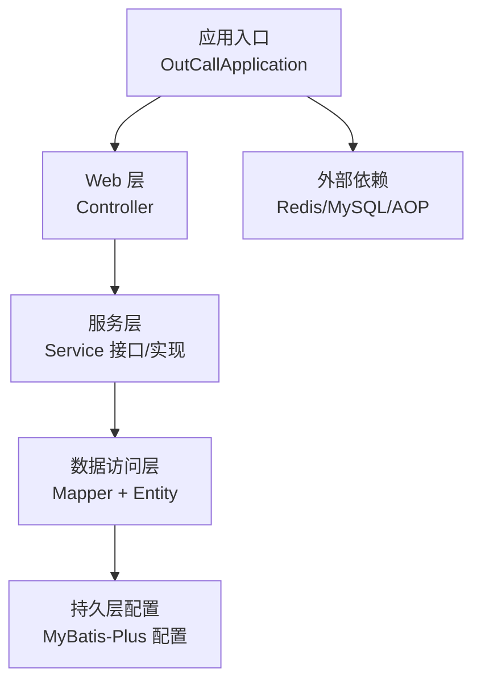
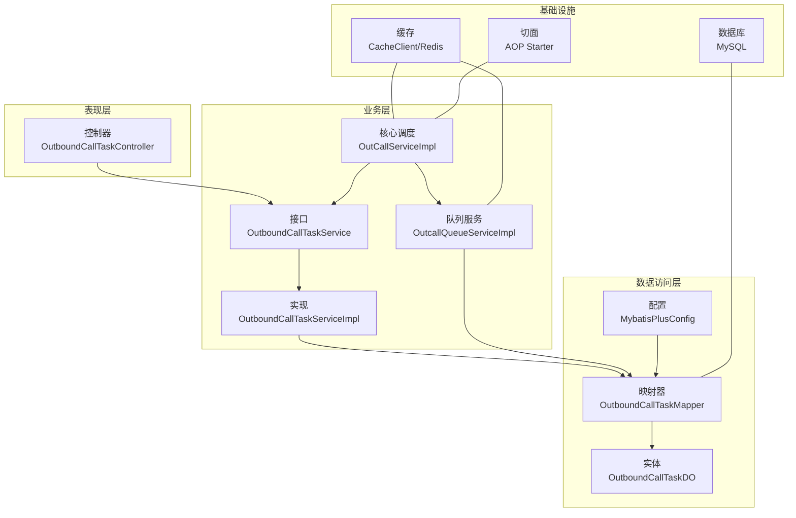
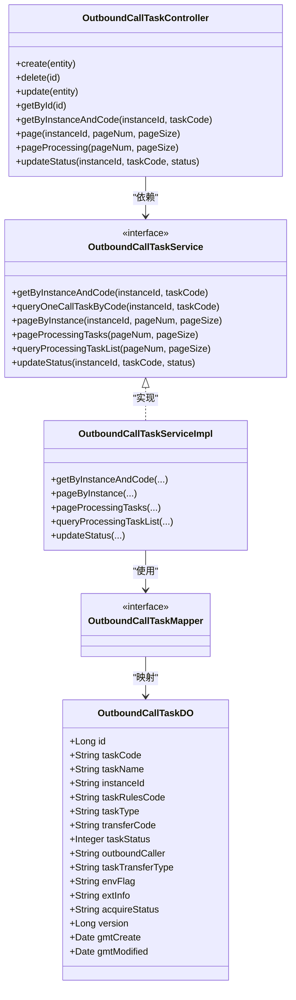
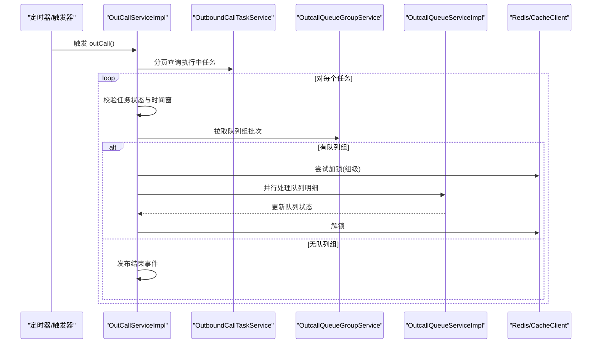
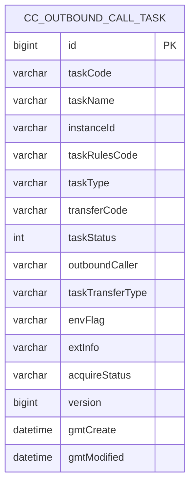
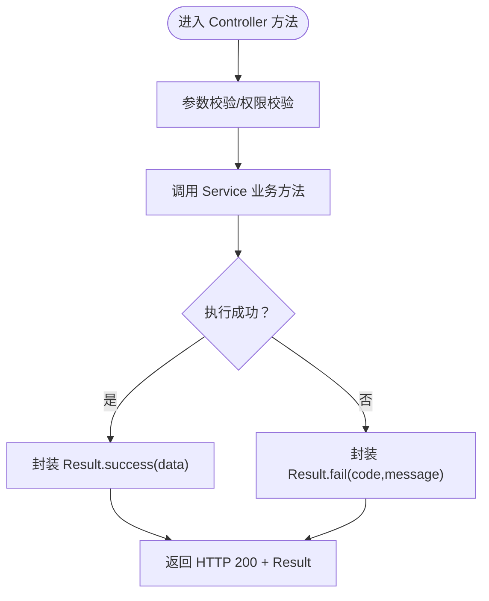
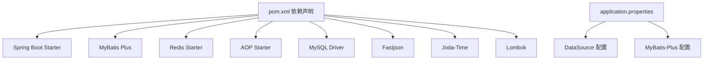
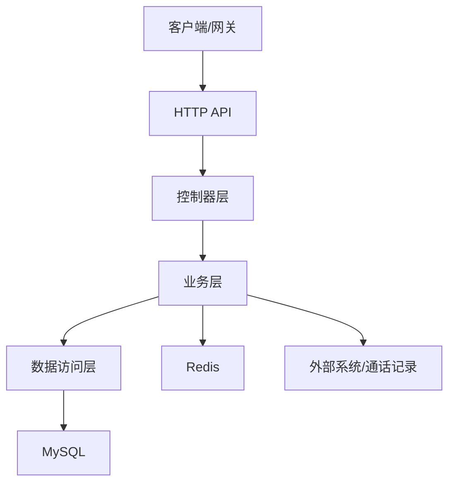
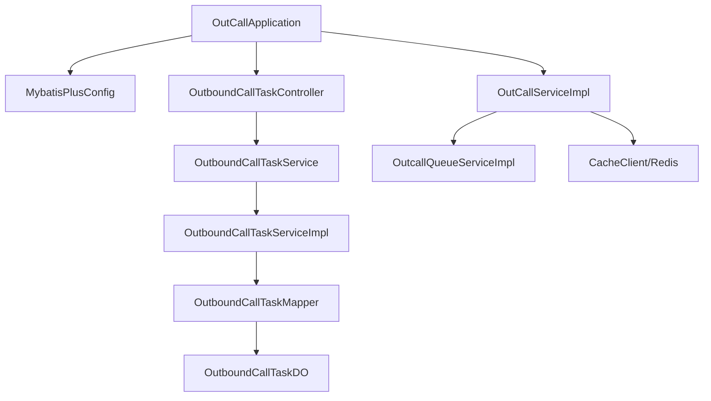

# 系统架构

<cite>
**本文引用的文件**   
- [pom.xml](file://pom.xml)
- [application.properties](file://src/main/resources/application.properties)
- [OutCallApplication.java](file://src/main/java/org/qianye/OutCallApplication.java)
- [MybatisPlusConfig.java](file://src/main/java/org/qianye/config/MybatisPlusConfig.java)
- [Result.java](file://src/main/java/org/qianye/common/Result.java)
- [OutboundCallTaskController.java](file://src/main/java/org/qianye/controller/OutboundCallTaskController.java)
- [OutboundCallTaskService.java](file://src/main/java/org/qianye/service/OutboundCallTaskService.java)
- [OutboundCallTaskServiceImpl.java](file://src/main/java/org/qianye/service/impl/OutboundCallTaskServiceImpl.java)
- [OutboundCallTaskDO.java](file://src/main/java/org/qianye/entity/OutboundCallTaskDO.java)
- [OutboundCallTaskMapper.java](file://src/main/java/org/qianye/mapper/OutboundCallTaskMapper.java)
- [OutCallService.java](file://src/main/java/org/qianye/OutCallService.java)
- [OutCallServiceImpl.java](file://src/main/java/org/qianye/OutCallServiceImpl.java)
- [OutcallQueueServiceImpl.java](file://src/main/java/org/qianye/service/impl/OutcallQueueServiceImpl.java)
- [CacheClient.java](file://src/main/java/org/qianye/CacheClient.java)
</cite>

## 目录
1. [引言](#引言)
2. [项目结构](#项目结构)
3. [核心组件](#核心组件)
4. [架构总览](#架构总览)
5. [组件详细分析](#组件详细分析)
6. [依赖关系分析](#依赖关系分析)
7. [性能与可扩展性](#性能与可扩展性)
8. [故障排查指南](#故障排查指南)
9. [结论](#结论)
10. [附录](#附录)

## 引言
本架构文档面向 Outcall 系统，系统采用 Spring Boot + MyBatis Plus 技术栈，围绕“智能外呼任务调度”场景构建，具备任务管理、队列编排、限流控制、状态同步与重试规划等能力。本文从高层设计、MVC 分层、依赖注入、AOP 切面、横切关注点（安全、监控、灾备）等方面进行系统化阐述，并给出部署拓扑与扩展建议。

## 项目结构
Outcall 项目遵循标准 Maven 结构，采用按层次划分的包组织方式：
- config：配置类（MyBatis-Plus 插件、自动填充）
- controller：REST 控制器层
- service：业务接口与实现
- mapper：MyBatis 映射接口
- entity：实体模型
- common：通用响应封装
- resources：配置文件、SQL 脚本、日志配置
- 根包 org.qianye：应用入口与核心服务

图表来源
- [OutCallApplication.java](file://src/main/java/org/qianye/OutCallApplication.java#L1-L13)
- [MybatisPlusConfig.java](file://src/main/java/org/qianye/config/MybatisPlusConfig.java#L1-L49)
- [OutboundCallTaskController.java](file://src/main/java/org/qianye/controller/OutboundCallTaskController.java#L1-L72)
- [OutboundCallTaskService.java](file://src/main/java/org/qianye/service/OutboundCallTaskService.java#L1-L40)
- [OutboundCallTaskMapper.java](file://src/main/java/org/qianye/mapper/OutboundCallTaskMapper.java#L1-L10)

章节来源
- [pom.xml](file://pom.xml#L1-L91)
- [application.properties](file://src/main/resources/application.properties#L1-L17)

## 核心组件
- 应用入口与启动：Spring Boot 启动类负责应用初始化与组件扫描。
- Web 层：基于注解的 REST 控制器，统一返回包装 Result。
- 业务层：IService 接口与 ServiceImpl 实现，封装分页、条件查询、状态更新等。
- 数据访问层：MyBatis Mapper + 实体 DO，结合 MyBatis-Plus 插件与自动填充。
- 基础设施：Redis 缓存、MySQL 数据源、AOP 切面支持。
- 核心调度：OutCallServiceImpl 负责外呼调度、限流、并发控制、事件发布与重试规划。

章节来源
- [OutCallApplication.java](file://src/main/java/org/qianye/OutCallApplication.java#L1-L13)
- [Result.java](file://src/main/java/org/qianye/common/Result.java#L1-L36)
- [OutboundCallTaskController.java](file://src/main/java/org/qianye/controller/OutboundCallTaskController.java#L1-L72)
- [OutboundCallTaskService.java](file://src/main/java/org/qianye/service/OutboundCallTaskService.java#L1-L40)
- [OutboundCallTaskServiceImpl.java](file://src/main/java/org/qianye/service/impl/OutboundCallTaskServiceImpl.java#L1-L66)
- [OutboundCallTaskDO.java](file://src/main/java/org/qianye/entity/OutboundCallTaskDO.java#L1-L96)
- [OutboundCallTaskMapper.java](file://src/main/java/org/qianye/mapper/OutboundCallTaskMapper.java#L1-L10)
- [MybatisPlusConfig.java](file://src/main/java/org/qianye/config/MybatisPlusConfig.java#L1-L49)
- [OutCallService.java](file://src/main/java/org/qianye/OutCallService.java#L1-L10)
- [OutCallServiceImpl.java](file://src/main/java/org/qianye/OutCallServiceImpl.java#L1-L800)
- [OutcallQueueServiceImpl.java](file://src/main/java/org/qianye/service/impl/OutcallQueueServiceImpl.java#L1-L884)
- [CacheClient.java](file://src/main/java/org/qianye/CacheClient.java#L1-L25)

## 架构总览
系统采用经典的 MVC 分层架构：
- 表现层（Controller）：接收 HTTP 请求，调用服务层，返回 Result 统一响应。
- 业务层（Service）：封装领域逻辑，协调数据访问与外部依赖。
- 数据访问层（Mapper/Entity）：通过 MyBatis Plus 进行数据库操作，启用乐观锁与自动填充。
- 基础设施层（Redis/MySQL/AOP）：提供缓存、限流、事务与日志等横切能力。

图表来源
- [OutboundCallTaskController.java](file://src/main/java/org/qianye/controller/OutboundCallTaskController.java#L1-L72)
- [OutboundCallTaskService.java](file://src/main/java/org/qianye/service/OutboundCallTaskService.java#L1-L40)
- [OutboundCallTaskServiceImpl.java](file://src/main/java/org/qianye/service/impl/OutboundCallTaskServiceImpl.java#L1-L66)
- [OutboundCallTaskMapper.java](file://src/main/java/org/qianye/mapper/OutboundCallTaskMapper.java#L1-L10)
- [OutboundCallTaskDO.java](file://src/main/java/org/qianye/entity/OutboundCallTaskDO.java#L1-L96)
- [MybatisPlusConfig.java](file://src/main/java/org/qianye/config/MybatisPlusConfig.java#L1-L49)
- [OutCallServiceImpl.java](file://src/main/java/org/qianye/OutCallServiceImpl.java#L1-L800)
- [OutcallQueueServiceImpl.java](file://src/main/java/org/qianye/service/impl/OutcallQueueServiceImpl.java#L1-L884)
- [CacheClient.java](file://src/main/java/org/qianye/CacheClient.java#L1-L25)

## 组件详细分析

### MVC 分层与依赖注入
- 控制器层：使用 @RestController 与 @RequestMapping 提供 REST 接口；通过 @Resource 注入服务层。
- 服务层：IService 接口定义通用能力，ServiceImpl 基于 MyBatis Plus 提供分页、条件构造器等便捷方法。
- 数据访问层：Mapper 继承 BaseMapper，Entity 使用注解映射字段与自动填充策略。
- 配置层：MyBatis-Plus 配置启用乐观锁拦截器与元对象自动填充。

图表来源
- [OutboundCallTaskController.java](file://src/main/java/org/qianye/controller/OutboundCallTaskController.java#L1-L72)
- [OutboundCallTaskService.java](file://src/main/java/org/qianye/service/OutboundCallTaskService.java#L1-L40)
- [OutboundCallTaskServiceImpl.java](file://src/main/java/org/qianye/service/impl/OutboundCallTaskServiceImpl.java#L1-L66)
- [OutboundCallTaskMapper.java](file://src/main/java/org/qianye/mapper/OutboundCallTaskMapper.java#L1-L10)
- [OutboundCallTaskDO.java](file://src/main/java/org/qianye/entity/OutboundCallTaskDO.java#L1-L96)

章节来源
- [OutboundCallTaskController.java](file://src/main/java/org/qianye/controller/OutboundCallTaskController.java#L1-L72)
- [OutboundCallTaskService.java](file://src/main/java/org/qianye/service/OutboundCallTaskService.java#L1-L40)
- [OutboundCallTaskServiceImpl.java](file://src/main/java/org/qianye/service/impl/OutboundCallTaskServiceImpl.java#L1-L66)
- [OutboundCallTaskMapper.java](file://src/main/java/org/qianye/mapper/OutboundCallTaskMapper.java#L1-L10)
- [OutboundCallTaskDO.java](file://src/main/java/org/qianye/entity/OutboundCallTaskDO.java#L1-L96)

### 核心调度流程（OutCallServiceImpl）
OutCallServiceImpl 是外呼调度的核心，负责：
- 分页拉取“执行中”的任务
- 并发控制与线程池管理
- 限流等待与超时控制
- 队列组状态流转与事件发布
- 异常重试与解锁

图表来源
- [OutCallServiceImpl.java](file://src/main/java/org/qianye/OutCallServiceImpl.java#L1-L800)
- [OutcallQueueServiceImpl.java](file://src/main/java/org/qianye/service/impl/OutcallQueueServiceImpl.java#L1-L884)
- [OutboundCallTaskService.java](file://src/main/java/org/qianye/service/OutboundCallTaskService.java#L1-L40)
- [CacheClient.java](file://src/main/java/org/qianye/CacheClient.java#L1-L25)

章节来源
- [OutCallServiceImpl.java](file://src/main/java/org/qianye/OutCallServiceImpl.java#L1-L800)
- [OutcallQueueServiceImpl.java](file://src/main/java/org/qianye/service/impl/OutcallQueueServiceImpl.java#L1-L884)

### 数据模型与持久化
实体 OutboundCallTaskDO 映射 cc_outbound_call_task 表，使用注解启用自动填充与乐观锁版本控制。MyBatis-Plus 配置启用乐观锁拦截器，避免并发写丢失。

图表来源
- [OutboundCallTaskDO.java](file://src/main/java/org/qianye/entity/OutboundCallTaskDO.java#L1-L96)
- [MybatisPlusConfig.java](file://src/main/java/org/qianye/config/MybatisPlusConfig.java#L1-L49)

章节来源
- [OutboundCallTaskDO.java](file://src/main/java/org/qianye/entity/OutboundCallTaskDO.java#L1-L96)
- [MybatisPlusConfig.java](file://src/main/java/org/qianye/config/MybatisPlusConfig.java#L1-L49)

### 统一响应与错误处理
Result 提供统一响应结构，Controller 层在成功或失败时返回标准化结果，便于前端与网关层处理。

图表来源
- [Result.java](file://src/main/java/org/qianye/common/Result.java#L1-L36)
- [OutboundCallTaskController.java](file://src/main/java/org/qianye/controller/OutboundCallTaskController.java#L1-L72)

章节来源
- [Result.java](file://src/main/java/org/qianye/common/Result.java#L1-L36)
- [OutboundCallTaskController.java](file://src/main/java/org/qianye/controller/OutboundCallTaskController.java#L1-L72)

## 依赖关系分析
- 技术栈与版本
  - Spring Boot：父工程版本 2.7.18（对应 JDK 8）
  - MyBatis Plus：3.5.5
  - MySQL Connector：8.0.33
  - Redis：spring-boot-starter-data-redis
  - AOP：spring-boot-starter-aop
  - JSON：fastjson 2.0.60
  - 时间：joda-time 2.14.0
  - 工具：lombok 1.18.36
- 配置要点
  - 数据源：MySQL 驱动、URL、账号密码
  - MyBatis-Plus：Mapper XML 位置、驼峰映射、日志输出、ID 类型策略
  - 允许循环依赖：开发阶段开启

图表来源
- [pom.xml](file://pom.xml#L1-L91)
- [application.properties](file://src/main/resources/application.properties#L1-L17)

章节来源
- [pom.xml](file://pom.xml#L1-L91)
- [application.properties](file://src/main/resources/application.properties#L1-L17)

## 性能与可扩展性
- 线程池与并发
  - 多级线程池：任务级、队列组级、通用/大租户专用线程池，避免阻塞与饥饿。
  - 并发控制：基于 Redis 的组级分布式锁，保证同一组同时只有一个调度器在推进。
- 限流与退避
  - 带超时的限流等待机制，避免无限等待；超时后回退至下一轮。
  - 限流解除后批量提交队列处理，提升吞吐。
- 分页与批量
  - 服务层分页查询执行中任务，避免一次性加载全量数据。
  - 队列查询采用分批 IN 子句，降低 SQL 开销。
- 可扩展性
  - 通过配置切换线程池与限流阈值，适配不同租户规模。
  - 事件发布用于解耦状态变更与后续动作（如重试规划）。

章节来源
- [OutCallServiceImpl.java](file://src/main/java/org/qianye/OutCallServiceImpl.java#L1-L800)
- [OutcallQueueServiceImpl.java](file://src/main/java/org/qianye/service/impl/OutcallQueueServiceImpl.java#L1-L884)

## 故障排查指南
- 常见问题定位
  - 任务状态异常：检查任务状态枚举与时间窗判断逻辑。
  - 队列状态不一致：通过通话记录回查并更新状态，必要时强制停止。
  - 限流超时：查看限流等待时间与睡眠间隔配置，确认下游是否释放。
  - 锁竞争：组级锁失败时应重试或回退，避免重复推进。
- 日志与监控
  - 关键路径均输出结构化日志，便于链路追踪与问题复盘。
  - 建议接入统一日志平台与指标埋点，对线程池队列长度、Redis 加锁耗时、数据库写入延迟进行观测。
- 灾难恢复
  - 通过“检查处理中队列”定时任务回查并修复异常状态。
  - 对异常队列进行重规划与重试，保障最终一致性。

章节来源
- [OutcallQueueServiceImpl.java](file://src/main/java/org/qianye/service/impl/OutcallQueueServiceImpl.java#L1-L884)
- [OutCallServiceImpl.java](file://src/main/java/org/qianye/OutCallServiceImpl.java#L1-L800)

## 结论
Outcall 系统以 Spring Boot + MyBatis Plus 为基础，采用清晰的 MVC 分层与依赖注入，结合 AOP 与 Redis 实现高可用的外呼调度能力。通过线程池、限流、锁与事件机制，系统在复杂业务场景下保持稳定与可扩展。建议在生产环境完善安全认证、指标监控与灾备演练，持续优化线程池与限流策略以适配峰值流量。

## 附录

### 系统上下文图

图表来源
- [OutboundCallTaskController.java](file://src/main/java/org/qianye/controller/OutboundCallTaskController.java#L1-L72)
- [OutcallQueueServiceImpl.java](file://src/main/java/org/qianye/service/impl/OutcallQueueServiceImpl.java#L1-L884)
- [application.properties](file://src/main/resources/application.properties#L1-L17)

### 组件分解图（核心）

图表来源
- [OutCallApplication.java](file://src/main/java/org/qianye/OutCallApplication.java#L1-L13)
- [MybatisPlusConfig.java](file://src/main/java/org/qianye/config/MybatisPlusConfig.java#L1-L49)
- [OutboundCallTaskController.java](file://src/main/java/org/qianye/controller/OutboundCallTaskController.java#L1-L72)
- [OutboundCallTaskService.java](file://src/main/java/org/qianye/service/OutboundCallTaskService.java#L1-L40)
- [OutboundCallTaskServiceImpl.java](file://src/main/java/org/qianye/service/impl/OutboundCallTaskServiceImpl.java#L1-L66)
- [OutboundCallTaskMapper.java](file://src/main/java/org/qianye/mapper/OutboundCallTaskMapper.java#L1-L10)
- [OutboundCallTaskDO.java](file://src/main/java/org/qianye/entity/OutboundCallTaskDO.java#L1-L96)
- [OutCallServiceImpl.java](file://src/main/java/org/qianye/OutCallServiceImpl.java#L1-L800)
- [OutcallQueueServiceImpl.java](file://src/main/java/org/qianye/service/impl/OutcallQueueServiceImpl.java#L1-L884)
- [CacheClient.java](file://src/main/java/org/qianye/CacheClient.java#L1-L25)