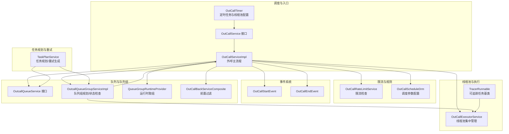
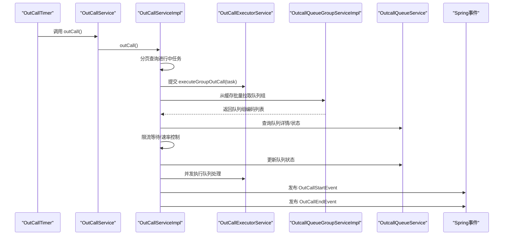
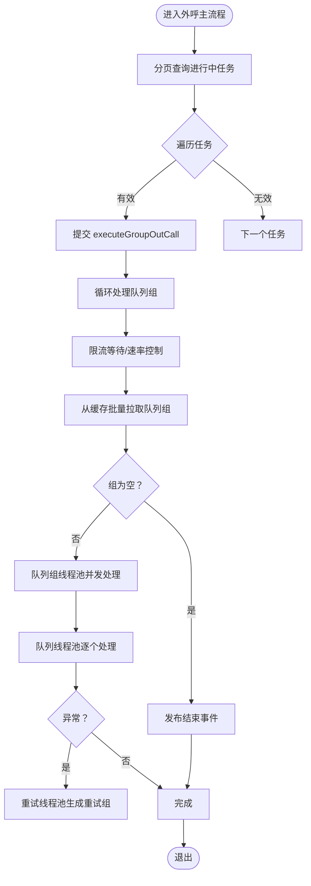
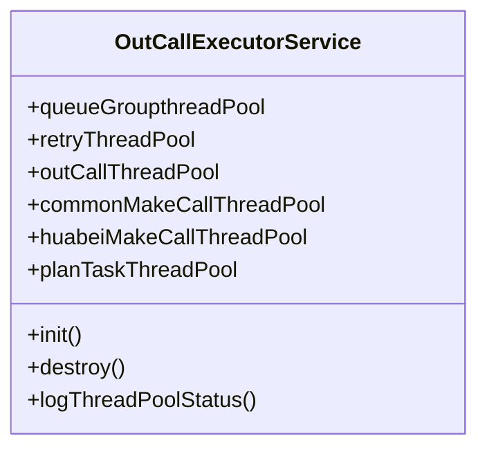
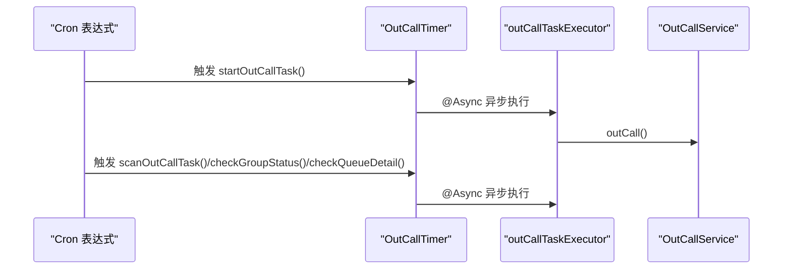
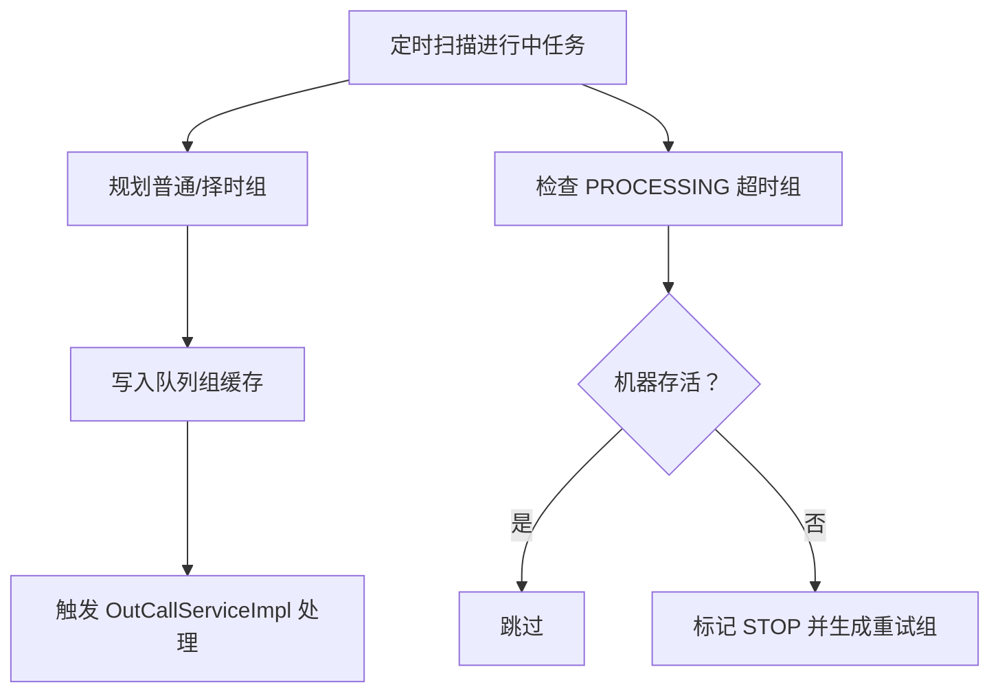
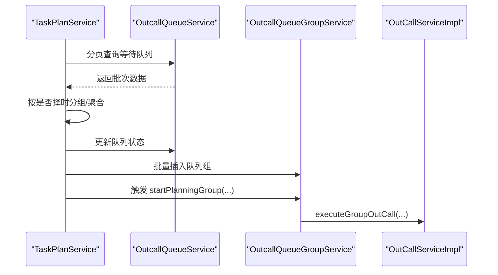
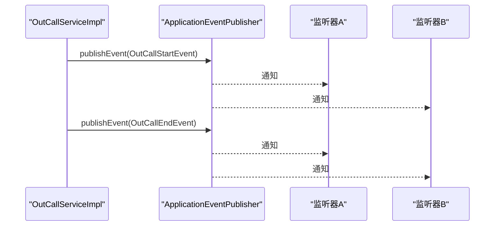
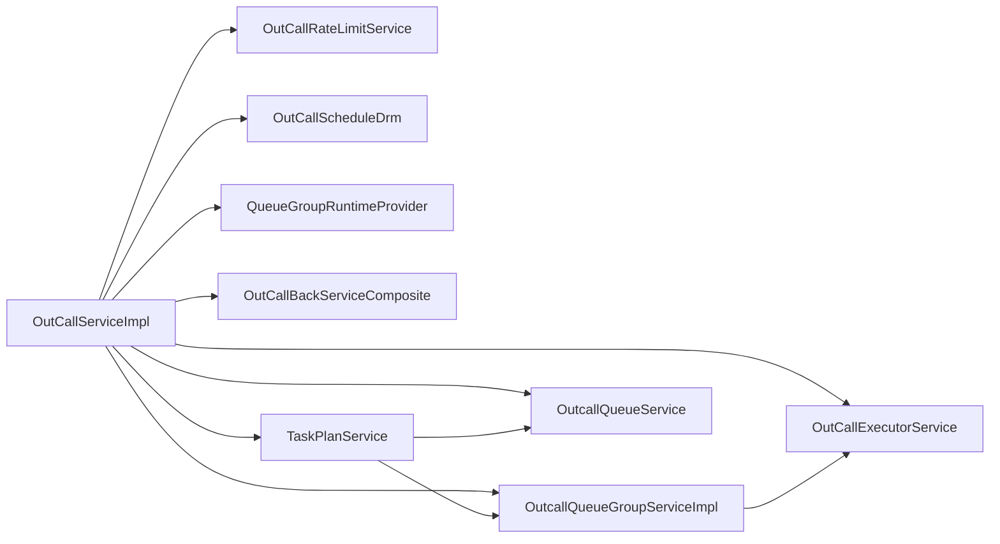

# 组件交互关系

<cite>
**本文引用的文件**   
- [OutCallServiceImpl.java](file://src/main/java/org/qianye/OutCallServiceImpl.java)
- [OutCallService.java](file://src/main/java/org/qianye/OutCallService.java)
- [OutCallExecutorService.java](file://src/main/java/org/qianye/OutCallExecutorService.java)
- [OutCallTimer.java](file://src/main/java/org/qianye/OutCallTimer.java)
- [OutCallRateLimitService.java](file://src/main/java/org/qianye/OutCallRateLimitService.java)
- [OutCallStartEvent.java](file://src/main/java/org/qianye/OutCallStartEvent.java)
- [OutCallEndEvent.java](file://src/main/java/org/qianye/OutCallEndEvent.java)
- [OutcallQueueService.java](file://src/main/java/org/qianye/OutcallQueueService.java)
- [OutcallQueueGroupServiceImpl.java](file://src/main/java/org/qianye/service/impl/OutcallQueueGroupServiceImpl.java)
- [OutCallScheduleDrm.java](file://src/main/java/org/qianye/OutCallScheduleDrm.java)
- [OutCallBackServiceComposite.java](file://src/main/java/org/qianye/OutCallBackServiceComposite.java)
- [QueueGroupRuntimeProvider.java](file://src/main/java/org/qianye/QueueGroupRuntimeProvider.java)
- [TaskPlanService.java](file://src/main/java/org/qianye/TaskPlanService.java)
- [TracerRunnable.java](file://src/main/java/org/qianye/TracerRunnable.java)
</cite>

## 目录
1. [简介](#简介)
2. [项目结构](#项目结构)
3. [核心组件](#核心组件)
4. [架构总览](#架构总览)
5. [详细组件分析](#详细组件分析)
6. [依赖关系分析](#依赖关系分析)
7. [性能考量](#性能考量)
8. [故障排查指南](#故障排查指南)
9. [结论](#结论)

## 简介
本文件聚焦 Outcall 系统的组件交互关系与通信机制，围绕 OutCallServiceImpl 的核心流程，系统性梳理其与线程池、限流、事件发布、队列与队列组服务、任务规划与重试等组件的协作方式。文档同时给出时序图与依赖关系图，帮助开发者快速理解复杂场景下的组件协同逻辑。

## 项目结构
Outcall 采用基于接口与实现的分层设计，核心服务通过 Spring 容器进行依赖注入；定时任务与异步执行由 Spring 的调度与线程池能力驱动；事件发布采用 Spring ApplicationEvent 机制；线程池通过独立服务统一管理与监控。

图表来源
- [OutCallTimer.java](file://src/main/java/org/qianye/OutCallTimer.java#L23-L117)
- [OutCallService.java](file://src/main/java/org/qianye/OutCallService.java#L1-L10)
- [OutCallServiceImpl.java](file://src/main/java/org/qianye/OutCallServiceImpl.java#L29-L70)
- [OutCallExecutorService.java](file://src/main/java/org/qianye/OutCallExecutorService.java#L13-L51)
- [OutCallRateLimitService.java](file://src/main/java/org/qianye/OutCallRateLimitService.java#L1-L17)
- [OutCallScheduleDrm.java](file://src/main/java/org/qianye/OutCallScheduleDrm.java#L1-L113)
- [OutcallQueueService.java](file://src/main/java/org/qianye/OutcallQueueService.java#L1-L61)
- [OutcallQueueGroupServiceImpl.java](file://src/main/java/org/qianye/service/impl/OutcallQueueGroupServiceImpl.java#L32-L68)
- [QueueGroupRuntimeProvider.java](file://src/main/java/org/qianye/QueueGroupRuntimeProvider.java#L1-L19)
- [OutCallBackServiceComposite.java](file://src/main/java/org/qianye/OutCallBackServiceComposite.java#L1-L20)
- [TaskPlanService.java](file://src/main/java/org/qianye/TaskPlanService.java#L28-L76)
- [TracerRunnable.java](file://src/main/java/org/qianye/TracerRunnable.java#L1-L15)

章节来源
- [OutCallTimer.java](file://src/main/java/org/qianye/OutCallTimer.java#L23-L117)
- [OutCallService.java](file://src/main/java/org/qianye/OutCallService.java#L1-L10)
- [OutCallServiceImpl.java](file://src/main/java/org/qianye/OutCallServiceImpl.java#L29-L70)
- [OutCallExecutorService.java](file://src/main/java/org/qianye/OutCallExecutorService.java#L13-L51)
- [OutCallRateLimitService.java](file://src/main/java/org/qianye/OutCallRateLimitService.java#L1-L17)
- [OutCallScheduleDrm.java](file://src/main/java/org/qianye/OutCallScheduleDrm.java#L1-L113)
- [OutcallQueueService.java](file://src/main/java/org/qianye/OutcallQueueService.java#L1-L61)
- [OutcallQueueGroupServiceImpl.java](file://src/main/java/org/qianye/service/impl/OutcallQueueGroupServiceImpl.java#L32-L68)
- [QueueGroupRuntimeProvider.java](file://src/main/java/org/qianye/QueueGroupRuntimeProvider.java#L1-L19)
- [OutCallBackServiceComposite.java](file://src/main/java/org/qianye/OutCallBackServiceComposite.java#L1-L20)
- [TaskPlanService.java](file://src/main/java/org/qianye/TaskPlanService.java#L28-L76)
- [TracerRunnable.java](file://src/main/java/org/qianye/TracerRunnable.java#L1-L15)

## 核心组件
- OutCallService/OutCallServiceImpl：定义并实现外呼主流程，负责任务状态校验、队列组拉取、并发执行、限流等待、事件发布与异常重试。
- OutCallExecutorService：集中管理多类线程池（队列组、重试、外呼、通用外呼、计划任务、华北外呼），提供监控与优雅关闭。
- OutCallTimer：基于 Spring 定时与异步注解，周期性触发外呼、任务扫描、队列组与队列状态检查，并提供专用线程池。
- OutCallRateLimitService：限流检查占位实现，当前返回默认值，后续接入具体限流策略。
- OutCallScheduleDrm：调度参数配置中心，统一管理队列长度、轮询批次、限流等待时间、线程池规模等。
- OutcallQueueService：队列详情服务接口，提供分页查询、状态更新、按编码批量查询等能力。
- OutcallQueueGroupServiceImpl：队列组规划与状态检查的核心实现，负责将“待规划”队列组推进到缓存并触发外呼。
- QueueGroupRuntimeProvider：运行时从缓存中批量拉取队列组编码，作为 OutCallServiceImpl 的输入。
- OutCallBackServiceComposite：业务前置过滤组合器，用于剔除不符合条件的队列。
- TaskPlanService：任务规划与重试生成，负责将等待队列聚合成队列组、生成重试组、处理异常与停止条件。
- TracerRunnable：可追踪任务基类，便于在异步线程中保留调用链信息。

章节来源
- [OutCallService.java](file://src/main/java/org/qianye/OutCallService.java#L1-L10)
- [OutCallServiceImpl.java](file://src/main/java/org/qianye/OutCallServiceImpl.java#L29-L70)
- [OutCallExecutorService.java](file://src/main/java/org/qianye/OutCallExecutorService.java#L13-L51)
- [OutCallTimer.java](file://src/main/java/org/qianye/OutCallTimer.java#L23-L117)
- [OutCallRateLimitService.java](file://src/main/java/org/qianye/OutCallRateLimitService.java#L1-L17)
- [OutCallScheduleDrm.java](file://src/main/java/org/qianye/OutCallScheduleDrm.java#L1-L113)
- [OutcallQueueService.java](file://src/main/java/org/qianye/OutcallQueueService.java#L1-L61)
- [OutcallQueueGroupServiceImpl.java](file://src/main/java/org/qianye/service/impl/OutcallQueueGroupServiceImpl.java#L32-L68)
- [QueueGroupRuntimeProvider.java](file://src/main/java/org/qianye/QueueGroupRuntimeProvider.java#L1-L19)
- [OutCallBackServiceComposite.java](file://src/main/java/org/qianye/OutCallBackServiceComposite.java#L1-L20)
- [TaskPlanService.java](file://src/main/java/org/qianye/TaskPlanService.java#L28-L76)
- [TracerRunnable.java](file://src/main/java/org/qianye/TracerRunnable.java#L1-L15)

## 架构总览
Outcall 采用“定时驱动 + 事件发布 + 多线程池协作”的架构。OutCallTimer 周期性调度 OutCallServiceImpl 执行外呼；OutCallServiceImpl 通过 OutCallExecutorService 的线程池并发处理队列组与队列；通过 OutCallScheduleDrm 统一调度参数；通过 OutCallRateLimitService 进行限流判断；通过 OutCallStartEvent/OutCallEndEvent 发布开始与结束事件；通过 TaskPlanService 与 OutcallQueueGroupServiceImpl 协作完成队列组规划与状态维护。

图表来源
- [OutCallTimer.java](file://src/main/java/org/qianye/OutCallTimer.java#L64-L69)
- [OutCallService.java](file://src/main/java/org/qianye/OutCallService.java#L5-L9)
- [OutCallServiceImpl.java](file://src/main/java/org/qianye/OutCallServiceImpl.java#L78-L110)
- [OutcallQueueGroupServiceImpl.java](file://src/main/java/org/qianye/service/impl/OutcallQueueGroupServiceImpl.java#L171-L271)
- [OutcallQueueService.java](file://src/main/java/org/qianye/OutcallQueueService.java#L10-L31)
- [OutCallExecutorService.java](file://src/main/java/org/qianye/OutCallExecutorService.java#L13-L51)
- [OutCallStartEvent.java](file://src/main/java/org/qianye/OutCallStartEvent.java#L6-L10)
- [OutCallEndEvent.java](file://src/main/java/org/qianye/OutCallEndEvent.java#L6-L10)

## 详细组件分析

### OutCallServiceImpl：外呼主流程与线程池协作
- 任务分页与并发：按页查询进行中任务，使用线程池提交 executeGroupOutCall，避免阻塞。
- 队列组拉取与并发：从运行时提供者批量拉取队列组，使用队列组线程池并发处理每个队列组。
- 限流与速率控制：通过限流等待方法与调度参数控制等待时长与轮询间隔；当线程池队列过长时主动短路。
- 事件发布：首次进入与全部处理完成后分别发布开始与结束事件，便于外部监听。
- 异常与重试：对单个队列处理异常时，提交到重试线程池生成重试组；对组级异常，同样走重试流程。

图表来源
- [OutCallServiceImpl.java](file://src/main/java/org/qianye/OutCallServiceImpl.java#L78-L110)
- [OutCallServiceImpl.java](file://src/main/java/org/qianye/OutCallServiceImpl.java#L112-L255)
- [OutCallServiceImpl.java](file://src/main/java/org/qianye/OutCallServiceImpl.java#L602-L679)
- [OutCallExecutorService.java](file://src/main/java/org/qianye/OutCallExecutorService.java#L13-L51)
- [OutCallScheduleDrm.java](file://src/main/java/org/qianye/OutCallScheduleDrm.java#L11-L25)

章节来源
- [OutCallServiceImpl.java](file://src/main/java/org/qianye/OutCallServiceImpl.java#L78-L110)
- [OutCallServiceImpl.java](file://src/main/java/org/qianye/OutCallServiceImpl.java#L112-L255)
- [OutCallServiceImpl.java](file://src/main/java/org/qianye/OutCallServiceImpl.java#L602-L679)
- [OutCallExecutorService.java](file://src/main/java/org/qianye/OutCallExecutorService.java#L13-L51)
- [OutCallScheduleDrm.java](file://src/main/java/org/qianye/OutCallScheduleDrm.java#L11-L25)

### OutCallExecutorService：线程池集中管理与监控
- 线程池职责分离：队列组线程池、重试线程池、外呼线程池、通用外呼线程池、计划任务线程池、华北外呼线程池。
- 监控与日志：启动定时监控，周期输出各线程池活动数、队列长度等指标。
- 优雅关闭：容器销毁时优雅关闭各线程池，避免任务丢失。

图表来源
- [OutCallExecutorService.java](file://src/main/java/org/qianye/OutCallExecutorService.java#L13-L51)
- [OutCallExecutorService.java](file://src/main/java/org/qianye/OutCallExecutorService.java#L55-L137)
- [OutCallExecutorService.java](file://src/main/java/org/qianye/OutCallExecutorService.java#L141-L207)

章节来源
- [OutCallExecutorService.java](file://src/main/java/org/qianye/OutCallExecutorService.java#L13-L51)
- [OutCallExecutorService.java](file://src/main/java/org/qianye/OutCallExecutorService.java#L55-L137)
- [OutCallExecutorService.java](file://src/main/java/org/qianye/OutCallExecutorService.java#L141-L207)

### OutCallTimer：定时任务与线程池配置
- 定时触发：每分钟执行外呼、每两分钟扫描任务、每五分钟检查队列组与队列状态。
- 异步执行：使用 @Async 与自定义线程池，避免阻塞调度线程。
- 线程池配置：提供专用的 outCallTaskExecutor，设置核心/最大线程、队列容量、拒绝策略与关闭等待时间。

图表来源
- [OutCallTimer.java](file://src/main/java/org/qianye/OutCallTimer.java#L64-L89)
- [OutCallTimer.java](file://src/main/java/org/qianye/OutCallTimer.java#L103-L116)

章节来源
- [OutCallTimer.java](file://src/main/java/org/qianye/OutCallTimer.java#L23-L117)

### OutcallQueueGroupServiceImpl：队列组规划与状态检查
- 规划流程：将 WAITING 队列组置为 PLANNING，写入缓存，再触发 OutCallServiceImpl 执行外呼。
- 状态检查：定期扫描 PROCESSING 超时组，判定机器存活，生成重试组并更新状态。
- 并发控制：使用 Redis 锁避免重复规划与状态检查。

图表来源
- [OutcallQueueGroupServiceImpl.java](file://src/main/java/org/qianye/service/impl/OutcallQueueGroupServiceImpl.java#L70-L162)
- [OutcallQueueGroupServiceImpl.java](file://src/main/java/org/qianye/service/impl/OutcallQueueGroupServiceImpl.java#L171-L271)
- [OutcallQueueGroupServiceImpl.java](file://src/main/java/org/qianye/service/impl/OutcallQueueGroupServiceImpl.java#L343-L450)

章节来源
- [OutcallQueueGroupServiceImpl.java](file://src/main/java/org/qianye/service/impl/OutcallQueueGroupServiceImpl.java#L70-L162)
- [OutcallQueueGroupServiceImpl.java](file://src/main/java/org/qianye/service/impl/OutcallQueueGroupServiceImpl.java#L171-L271)
- [OutcallQueueGroupServiceImpl.java](file://src/main/java/org/qianye/service/impl/OutcallQueueGroupServiceImpl.java#L343-L450)

### TaskPlanService：任务规划与重试生成
- 规划策略：按批次查询等待队列，按是否择时分组，聚合为队列组并入库；在呼叫时段内触发队列组规划。
- 重试机制：根据队列状态与通话记录，生成 RETRY 类型队列组；达到最大重试次数或超出时间范围则停止。
- 并发与事务：使用并行子批次处理与事务模板保证一致性。

图表来源
- [TaskPlanService.java](file://src/main/java/org/qianye/TaskPlanService.java#L411-L458)
- [TaskPlanService.java](file://src/main/java/org/qianye/TaskPlanService.java#L538-L622)
- [TaskPlanService.java](file://src/main/java/org/qianye/TaskPlanService.java#L630-L642)
- [OutcallQueueGroupServiceImpl.java](file://src/main/java/org/qianye/service/impl/OutcallQueueGroupServiceImpl.java#L243-L248)

章节来源
- [TaskPlanService.java](file://src/main/java/org/qianye/TaskPlanService.java#L411-L458)
- [TaskPlanService.java](file://src/main/java/org/qianye/TaskPlanService.java#L538-L622)
- [TaskPlanService.java](file://src/main/java/org/qianye/TaskPlanService.java#L630-L642)
- [OutcallQueueGroupServiceImpl.java](file://src/main/java/org/qianye/service/impl/OutcallQueueGroupServiceImpl.java#L243-L248)

### 事件发布与订阅机制
- 事件类型：OutCallStartEvent（开始）与 OutCallEndEvent（结束），均继承自 Spring ApplicationEvent。
- 发布位置：OutCallServiceImpl 在首次进入与全部处理完成后发布相应事件。
- 订阅建议：可在应用中注册监听器，基于事件进行外部联动（如统计、通知、审计）。

图表来源
- [OutCallServiceImpl.java](file://src/main/java/org/qianye/OutCallServiceImpl.java#L188-L191)
- [OutCallServiceImpl.java](file://src/main/java/org/qianye/OutCallServiceImpl.java#L181-L187)
- [OutCallStartEvent.java](file://src/main/java/org/qianye/OutCallStartEvent.java#L6-L10)
- [OutCallEndEvent.java](file://src/main/java/org/qianye/OutCallEndEvent.java#L6-L10)

章节来源
- [OutCallServiceImpl.java](file://src/main/java/org/qianye/OutCallServiceImpl.java#L188-L191)
- [OutCallServiceImpl.java](file://src/main/java/org/qianye/OutCallServiceImpl.java#L181-L187)
- [OutCallStartEvent.java](file://src/main/java/org/qianye/OutCallStartEvent.java#L6-L10)
- [OutCallEndEvent.java](file://src/main/java/org/qianye/OutCallEndEvent.java#L6-L10)

## 依赖关系分析
- 接口抽象解耦：OutCallService 为接口，OutCallServiceImpl 为其实现，通过 @Resource 注入，降低上层对具体实现的耦合。
- 组件间依赖：
  - OutCallServiceImpl 依赖 OutcallQueueGroupService、OutcallQueueService、OutCallRateLimitService、OutCallScheduleDrm、QueueGroupRuntimeProvider、OutCallBackServiceComposite、TaskPlanService、RedisLock、QueueGroupRedisCache、RemoteFsApi、SessionLimitHelper、CpsLimitHelper、ApplicationEventPublisher 等。
  - OutcallQueueGroupServiceImpl 依赖 OutcallQueueService、OutboundCallTaskService、OutCallService、RedisLock、QueueGroupRuntimeProvider、OutCallScheduleDrm、TaskPlanService、CacheClient、QueueGroupRedisCache。
  - TaskPlanService 依赖 OutcallQueueService、OutcallQueueGroupService、OutboundCallTaskService、RedisLock、RedisTemplate、OutCallScheduleDrm、CallRecordService、TransactionTemplate。
- 线程池协作：OutCallServiceImpl 通过 OutCallExecutorService 获取不同用途的线程池；OutCallTimer 自定义线程池用于定时任务。

图表来源
- [OutCallServiceImpl.java](file://src/main/java/org/qianye/OutCallServiceImpl.java#L34-L69)
- [OutcallQueueGroupServiceImpl.java](file://src/main/java/org/qianye/service/impl/OutcallQueueGroupServiceImpl.java#L37-L68)
- [TaskPlanService.java](file://src/main/java/org/qianye/TaskPlanService.java#L32-L76)
- [OutCallExecutorService.java](file://src/main/java/org/qianye/OutCallExecutorService.java#L13-L51)

章节来源
- [OutCallServiceImpl.java](file://src/main/java/org/qianye/OutCallServiceImpl.java#L34-L69)
- [OutcallQueueGroupServiceImpl.java](file://src/main/java/org/qianye/service/impl/OutcallQueueGroupServiceImpl.java#L37-L68)
- [TaskPlanService.java](file://src/main/java/org/qianye/TaskPlanService.java#L32-L76)
- [OutCallExecutorService.java](file://src/main/java/org/qianye/OutCallExecutorService.java#L13-L51)

## 性能考量
- 线程池隔离：不同用途线程池分离，避免相互影响；监控日志有助于定位瓶颈。
- 限流与背压：通过限流等待与队列长度阈值控制，避免过载；必要时可结合 OutCallRateLimitService 实现具体限流策略。
- 并发粒度：队列组与队列双层并发，合理设置线程池大小与队列容量，平衡吞吐与延迟。
- 重试与降级：异常时提交重试线程池生成重试组，避免主线程阻塞；超过最大重试次数或超出时间范围及时停止。

## 故障排查指南
- 线程池异常：关注 OutCallExecutorService 的监控日志，定位活跃线程数、队列长度与拒绝策略触发情况。
- 限流问题：检查 OutCallRateLimitService 的实现与 OutCallServiceImpl 的限流等待逻辑，确认等待时长与超时策略。
- 事件未触发：确认 OutCallServiceImpl 是否正确发布开始/结束事件，以及监听器是否注册。
- 队列组卡死：检查 OutcallQueueGroupServiceImpl 的状态检查逻辑与 Redis 锁是否正确释放。
- 重试未生效：核对 TaskPlanService 的重试生成逻辑与队列状态更新路径。

章节来源
- [OutCallExecutorService.java](file://src/main/java/org/qianye/OutCallExecutorService.java#L66-L137)
- [OutCallServiceImpl.java](file://src/main/java/org/qianye/OutCallServiceImpl.java#L602-L679)
- [OutcallQueueGroupServiceImpl.java](file://src/main/java/org/qianye/service/impl/OutcallQueueGroupServiceImpl.java#L343-L450)
- [TaskPlanService.java](file://src/main/java/org/qianye/TaskPlanService.java#L142-L190)

## 结论
Outcall 系统通过“定时驱动 + 事件发布 + 多线程池协作”的方式实现了高并发、可扩展的外呼调度。OutCallServiceImpl 作为核心编排者，借助线程池、限流、事件与规划/重试机制，形成闭环。接口抽象与组件解耦使得系统具备良好的可维护性与可扩展性。建议后续完善限流与运行时提供者的实现细节，以进一步提升稳定性与可观测性。