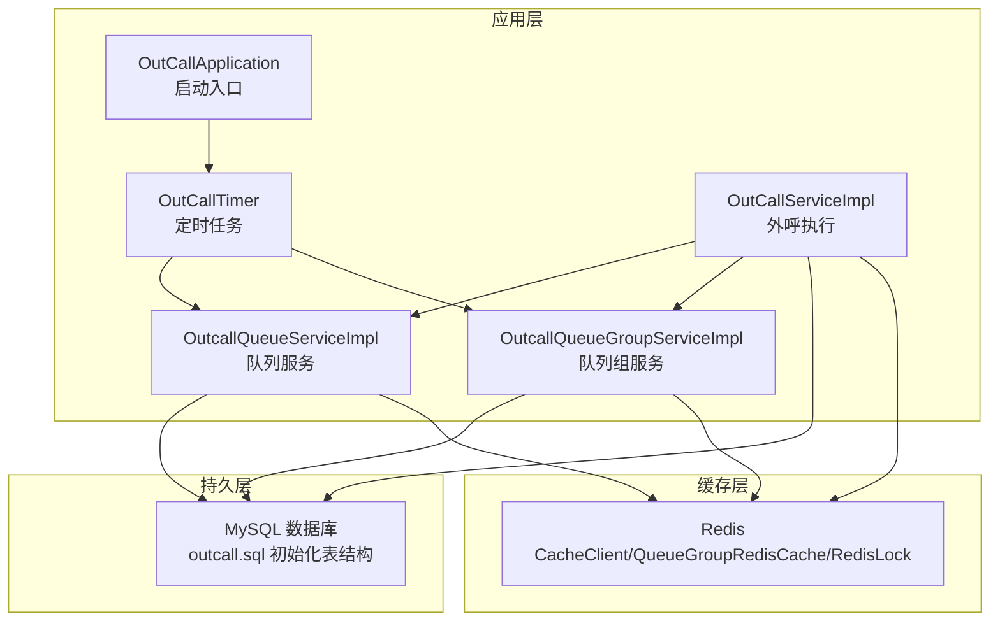
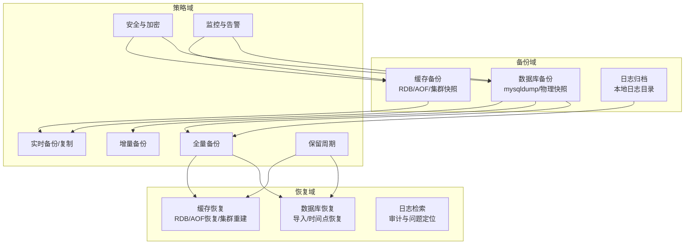
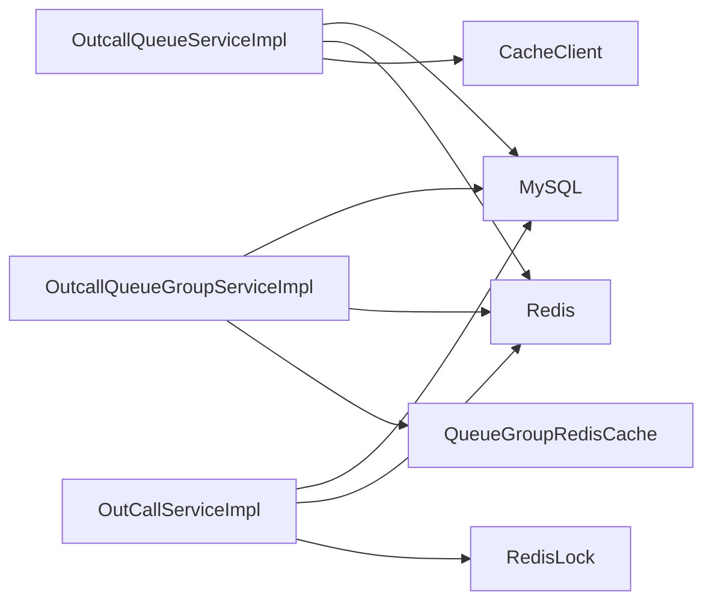

# 备份与恢复

<cite>
**本文引用的文件**
- [application.properties](file://src/main/resources/application.properties)
- [outcall.sql](file://src/main/resources/outcall.sql)
- [OutCallApplication.java](file://src/main/java/org/qianye/OutCallApplication.java)
- [OutCallServiceImpl.java](file://src/main/java/org/qianye/OutCallServiceImpl.java)
- [OutcallQueueServiceImpl.java](file://src/main/java/org/qianye/service/impl/OutcallQueueServiceImpl.java)
- [OutcallQueueGroupServiceImpl.java](file://src/main/java/org/qianye/service/impl/OutcallQueueGroupServiceImpl.java)
- [CacheClient.java](file://src/main/java/org/qianye/CacheClient.java)
- [QueueGroupRedisCache.java](file://src/main/java/org/qianye/QueueGroupRedisCache.java)
- [RedisLock.java](file://src/main/java/org/qianye/RedisLock.java)
- [logback-spring.xml](file://src/main/resources/logback-spring.xml)
- [pom.xml](file://pom.xml)
- [OutCallTimer.java](file://src/main/java/org/qianye/OutCallTimer.java)
- [CommonConstants.java](file://src/main/java/org/qianye/CommonConstants.java)
- [ScheduleConstants.java](file://src/main/java/org/qianye/ScheduleConstants.java)
</cite>

## 目录
1. [简介](#简介)
2. [项目结构](#项目结构)
3. [核心组件](#核心组件)
4. [架构总览](#架构总览)
5. [详细组件分析](#详细组件分析)
6. [依赖分析](#依赖分析)
7. [性能考虑](#性能考虑)
8. [故障排查指南](#故障排查指南)
9. [结论](#结论)
10. [附录](#附录)

## 简介
本文件面向 Outcall 系统，提供一套完整的备份与恢复策略文档，覆盖数据库全量/增量/实时备份方案、备份存储位置与命名规范、保留周期、自动化脚本与调度、灾难恢复计划与演练流程、数据恢复操作步骤与验证方法、备份安全与加密、备份监控与告警、以及跨地域备份与容灾部署实施方案。内容基于仓库现有代码与配置进行分析与落地建议。

## 项目结构
Outcall 为 Spring Boot 应用，核心数据通过 JDBC 访问 MySQL，同时使用 Redis 作为缓存与分布式锁。定时任务驱动核心调度流程，日志输出至本地目录。

图表来源
- [OutCallApplication.java](file://src/main/java/org/qianye/OutCallApplication.java#L1-L13)
- [OutCallTimer.java](file://src/main/java/org/qianye/OutCallTimer.java#L1-L45)
- [OutcallQueueServiceImpl.java](file://src/main/java/org/qianye/service/impl/OutcallQueueServiceImpl.java#L1-L800)
- [OutcallQueueGroupServiceImpl.java](file://src/main/java/org/qianye/service/impl/OutcallQueueGroupServiceImpl.java#L1-L800)
- [OutCallServiceImpl.java](file://src/main/java/org/qianye/OutCallServiceImpl.java#L1-L800)
- [outcall.sql](file://src/main/resources/outcall.sql#L1-L218)
- [CacheClient.java](file://src/main/java/org/qianye/CacheClient.java#L1-L25)
- [QueueGroupRedisCache.java](file://src/main/java/org/qianye/QueueGroupRedisCache.java#L1-L50)
- [RedisLock.java](file://src/main/java/org/qianye/RedisLock.java#L143-L207)

章节来源
- [application.properties](file://src/main/resources/application.properties#L1-L17)
- [pom.xml](file://pom.xml#L1-L91)
- [logback-spring.xml](file://src/main/resources/logback-spring.xml#L1-L32)

## 核心组件
- 数据库层：MySQL，使用 JDBC 连接，表结构由 SQL 初始化脚本定义，包含队列、队列组、任务规则、任务等核心表。
- 缓存层：Redis，用于队列组规划缓存、分布式锁、临时状态存储。
- 业务层：定时任务驱动队列状态检查、队列组状态检查、外呼执行与状态回写。
- 日志与配置：本地日志目录，数据库连接配置，MyBatis-Plus 插件配置。

章节来源
- [application.properties](file://src/main/resources/application.properties#L6-L16)
- [outcall.sql](file://src/main/resources/outcall.sql#L1-L218)
- [CacheClient.java](file://src/main/java/org/qianye/CacheClient.java#L1-L25)
- [QueueGroupRedisCache.java](file://src/main/java/org/qianye/QueueGroupRedisCache.java#L1-L50)
- [RedisLock.java](file://src/main/java/org/qianye/RedisLock.java#L143-L207)
- [logback-spring.xml](file://src/main/resources/logback-spring.xml#L1-L32)

## 架构总览
Outcall 的备份与恢复需围绕“数据库+缓存”两大载体展开，并结合定时任务与日志进行一致性保障与可追溯性。

## 详细组件分析

### 数据库备份策略
- 全量备份
  - 工具：mysqldump 或数据库物理快照（如 Percona XtraBackup）。
  - 触发：夜间低峰时段，结合定时任务统一调度。
  - 存储：本地或对象存储（S3/OSS），按“实例/环境/日期/时间”分层存放。
  - 命名规范：outcall-db-full-{env}-{yyyyMMdd-HHmm}.sql.gz 或 .xbstream。
  - 保留周期：全量备份保留 14 天，配合每周/每月归档。
- 增量备份
  - 工具：binlog 增量或基于 GTID 的增量备份。
  - 触发：每 5-15 分钟采集一次 binlog。
  - 存储：与全量同仓，命名 outcall-db-binlog-{env}-{yyyyMMdd}/{HH}/*.binlog。
  - 保留周期：增量保留 7 天。
- 实时备份/复制
  - 方案：主从复制或集群高可用，确保至少 2 个副本。
  - 监控：复制延迟阈值告警（如 > 5 分钟）。
- 备份验证
  - 定期抽样恢复演练（还原到隔离环境），验证一致性与可用性。
- 备份加密
  - 传输加密：TLS/SSH。
  - 存储加密：对象存储服务端加密或客户端加密后上传。
- 自动化与调度
  - 使用 cron 或运维编排工具（如 Jenkins/Airflow）执行备份脚本。
  - 脚本示例（概念性，非仓库内脚本）：
    - 全量：mysqldump --single-transaction --routines --triggers | gzip > outcall-db-full-${env}-${date}.sql.gz
    - 增量：mysqlbinlog --raw --read-from-remote-server --host=master --port=3306 --user=backup ...
    - 上传：aws s3 cp ... s3://bucket/backups/db/${env}/${date}/
  - 调度配置：crontab 或 systemd timer，结合通知通道（邮件/IM）。

章节来源
- [application.properties](file://src/main/resources/application.properties#L6-L16)
- [outcall.sql](file://src/main/resources/outcall.sql#L1-L218)

### 缓存备份策略
- 全量备份
  - RDB 快照：生产环境建议开启 AOF + 定时快照，快照命名 outcall-redis-rdb-{env}-{yyyyMMdd-HHmm}.rdb。
  - 集群快照：Redis 集群可使用 CLUSTER SAVE 或 bgsave。
- 增量备份
  - AOF：开启 appendonly yes，定期 rewrite。
  - 增量文件命名 outcall-redis-aof-{env}-{yyyyMMdd}/{HH}/*.aof。
- 实时备份
  - 主从复制：至少 2 个副本，监控复制偏移量与延迟。
- 保留与验证
  - 保留周期：RDB 保留 14 天，AOF 保留 7 天；定期恢复演练。
- 加密与安全
  - 网络：启用 TLS；访问控制（ACL/密码）。
  - 存储：对象存储加密或本地磁盘加密。

章节来源
- [CacheClient.java](file://src/main/java/org/qianye/CacheClient.java#L1-L25)
- [QueueGroupRedisCache.java](file://src/main/java/org/qianye/QueueGroupRedisCache.java#L1-L50)
- [RedisLock.java](file://src/main/java/org/qianye/RedisLock.java#L143-L207)

### 日志与审计
- 日志落盘：本地 ./log 目录，便于问题定位与审计。
- 归档：按天归档，保留 30 天；重要事件（备份/恢复）单独标记。
- 安全：对敏感字段脱敏（如电话号码、ACID），日志加密存储。

章节来源
- [logback-spring.xml](file://src/main/resources/logback-spring.xml#L1-L32)

### 定时任务与一致性
- 定时任务负责状态扫描与恢复推进，备份窗口应避开高峰期。
- 建议在备份窗口内暂停或降级部分定时任务，确保一致性。

章节来源
- [OutCallTimer.java](file://src/main/java/org/qianye/OutCallTimer.java#L1-L45)

### 数据模型与索引要点
- 表结构包含大量索引与时间字段，备份时需保持元数据完整。
- 恢复后建议执行 ANALYZE/统计信息更新，确保查询计划稳定。

章节来源
- [outcall.sql](file://src/main/resources/outcall.sql#L1-L218)

## 依赖分析
- 数据依赖
  - OutcallQueueServiceImpl/OutcallQueueGroupServiceImpl/OutCallServiceImpl 依赖 MySQL 与 Redis。
  - CacheClient/QueueGroupRedisCache/RedisLock 提供缓存与锁能力。
- 配置依赖
  - application.properties 指定数据库连接与 MyBatis-Plus 配置。
  - logback-spring.xml 指定日志输出路径。

图表来源
- [OutcallQueueServiceImpl.java](file://src/main/java/org/qianye/service/impl/OutcallQueueServiceImpl.java#L1-L800)
- [OutcallQueueGroupServiceImpl.java](file://src/main/java/org/qianye/service/impl/OutcallQueueGroupServiceImpl.java#L1-L800)
- [OutCallServiceImpl.java](file://src/main/java/org/qianye/OutCallServiceImpl.java#L1-L800)
- [CacheClient.java](file://src/main/java/org/qianye/CacheClient.java#L1-L25)
- [QueueGroupRedisCache.java](file://src/main/java/org/qianye/QueueGroupRedisCache.java#L1-L50)
- [RedisLock.java](file://src/main/java/org/qianye/RedisLock.java#L143-L207)

## 性能考虑
- 备份窗口与业务峰值错峰，避免影响在线服务。
- 使用并行压缩与分片传输提升吞吐。
- 增量备份与实时复制结合，缩短 RTO/RPO。

## 故障排查指南
- 备份失败
  - 检查数据库连接与权限、磁盘空间、网络连通性。
  - 查看日志目录 ./log 中的错误堆栈。
- 恢复异常
  - 校验备份文件完整性与版本兼容性。
  - 恢复后验证关键表数据与索引状态。
- 缓存恢复
  - 确认 RDB/AOF 文件可用，集群节点状态一致。
- 监控告警
  - 设置数据库复制延迟、备份成功率、存储容量阈值告警。

章节来源
- [logback-spring.xml](file://src/main/resources/logback-spring.xml#L1-L32)

## 结论
通过“全量+增量+实时复制”的组合策略，结合严格的命名规范、保留周期、安全与加密、监控告警，Outcall 系统可实现高可靠的数据保护与快速恢复能力。建议将备份与恢复纳入变更管理流程，并定期演练以验证有效性。

## 附录

### 备份与恢复操作步骤（概念性流程）
- 全量备份
  - 步骤：选择备份工具 → 执行全量导出/快照 → 传输与归档 → 校验与告警。
  - 验证：抽样导入到测试环境，核对关键指标。
- 增量备份
  - 步骤：周期性采集 binlog/AOF → 传输与归档 → 清理过期文件。
- 恢复流程
  - 数据库：停止业务 → 导入全量 → 应用增量 → 校验索引与统计 → 启动服务。
  - 缓存：恢复 RDB/AOF → 集群节点加入 → 校验数据一致性。
- 灾难演练
  - 制定演练计划与角色分工 → 选定演练场景（单机/跨机房）→ 执行与记录 → 评估与改进。

### 跨地域备份与容灾
- 多活/双活：主备数据库与缓存集群，跨机房部署。
- 灾备切换：自动化脚本 + 健康检查 + DNS/SLB 切换。
- 测试与演练：定期进行故障演练，验证切换时间与数据一致性。