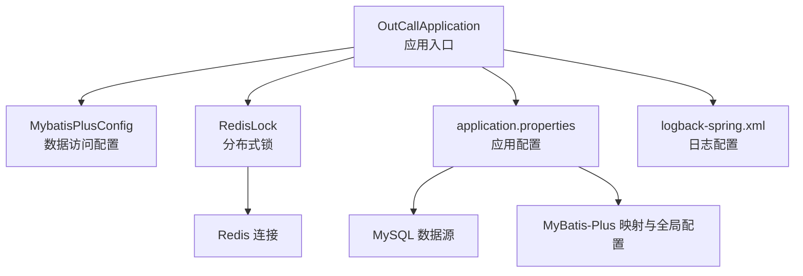
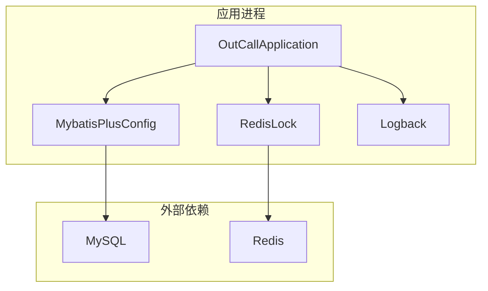
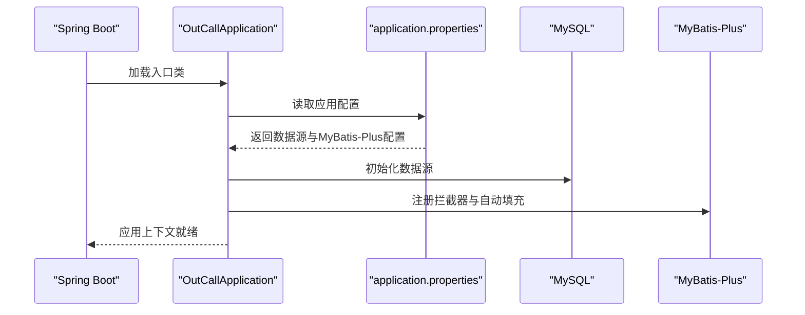
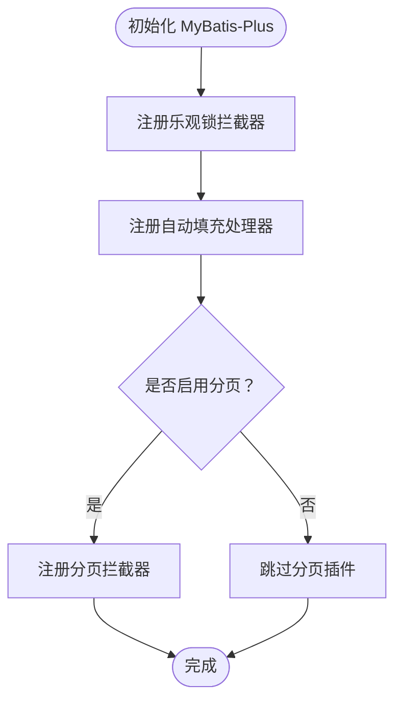
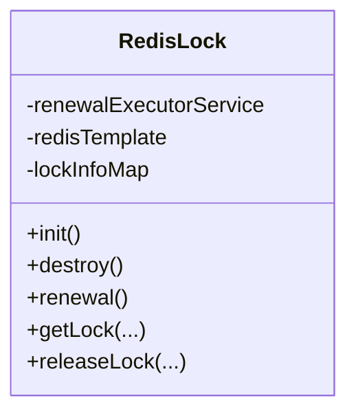
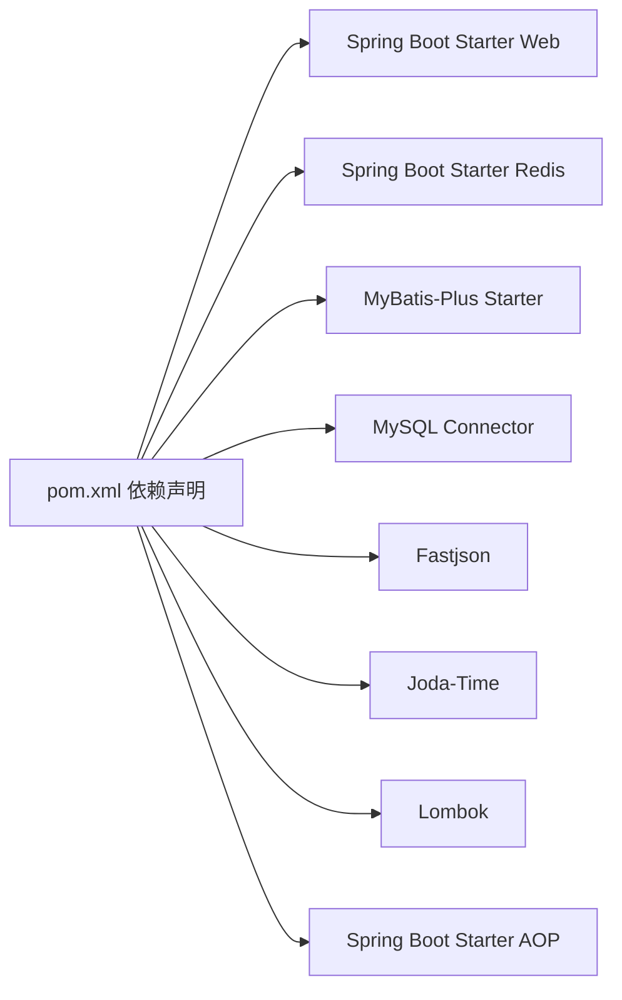

# 应用部署

<cite>
**本文引用的文件**
- [pom.xml](file://pom.xml)
- [application.properties](file://src/main/resources/application.properties)
- [logback-spring.xml](file://src/main/resources/logback-spring.xml)
- [OutCallApplication.java](file://src/main/java/org/qianye/OutCallApplication.java)
- [MybatisPlusConfig.java](file://src/main/java/org/qianye/config/MybatisPlusConfig.java)
- [RedisLock.java](file://src/main/java/org/qianye/RedisLock.java)
- [CommonConstants.java](file://src/main/java/org/qianye/CommonConstants.java)
- [Constants.java](file://src/main/java/org/qianye/Constants.java)
</cite>

## 目录
1. [简介](#简介)
2. [项目结构](#项目结构)
3. [核心组件](#核心组件)
4. [架构总览](#架构总览)
5. [详细组件分析](#详细组件分析)
6. [依赖分析](#依赖分析)
7. [性能考虑](#性能考虑)
8. [故障排查指南](#故障排查指南)
9. [结论](#结论)
10. [附录](#附录)

## 简介
本文件面向 Outcall 系统的运维与开发团队，提供从本地构建到多环境部署的完整指南。内容覆盖 Maven 构建与打包、配置文件优化、数据库与缓存配置、线程池与日志策略、多环境配置与环境变量管理、传统 JAR 包部署、Docker 容器化部署以及 Kubernetes 集群部署方案，并给出健康检查与自动重启建议、部署验证与故障排查清单。

## 项目结构
Outcall 采用 Spring Boot 2.7 技术栈，核心模块包括：
- 启动入口：Spring Boot 应用入口类负责应用启动
- 数据访问：MyBatis-Plus 配置与分页/乐观锁插件
- 缓存与分布式锁：基于 Redis 的分布式锁实现
- 日志系统：Logback 控制台输出
- 配置中心：application.properties 提供数据源、MyBatis-Plus 等基础配置

图表来源
- [OutCallApplication.java](file://src/main/java/org/qianye/OutCallApplication.java#L1-L13)
- [MybatisPlusConfig.java](file://src/main/java/org/qianye/config/MybatisPlusConfig.java#L1-L49)
- [RedisLock.java](file://src/main/java/org/qianye/RedisLock.java#L1-L207)
- [application.properties](file://src/main/resources/application.properties#L1-L17)
- [logback-spring.xml](file://src/main/resources/logback-spring.xml#L1-L32)

章节来源
- [OutCallApplication.java](file://src/main/java/org/qianye/OutCallApplication.java#L1-L13)
- [application.properties](file://src/main/resources/application.properties#L1-L17)
- [logback-spring.xml](file://src/main/resources/logback-spring.xml#L1-L32)

## 核心组件
- 应用入口与启动
  - 应用通过 Spring Boot 入口类启动，支持在不同环境中加载对应配置。
- 数据访问层
  - MyBatis-Plus 拦截器启用乐观锁，插入/更新时自动填充时间字段；分页插件当前禁用以规避依赖冲突。
- 缓存与分布式锁
  - 基于 RedisTemplate 的分布式锁，内置定时续期线程池，守护锁续期任务。
- 日志系统
  - Logback 控制台输出，根日志级别默认 INFO，可按需调整。

章节来源
- [OutCallApplication.java](file://src/main/java/org/qianye/OutCallApplication.java#L1-L13)
- [MybatisPlusConfig.java](file://src/main/java/org/qianye/config/MybatisPlusConfig.java#L1-L49)
- [RedisLock.java](file://src/main/java/org/qianye/RedisLock.java#L1-L207)
- [logback-spring.xml](file://src/main/resources/logback-spring.xml#L1-L32)

## 架构总览
下图展示 Outcall 在运行时的关键交互：应用启动后读取配置，初始化数据访问与缓存组件，对外提供服务。

图表来源
- [OutCallApplication.java](file://src/main/java/org/qianye/OutCallApplication.java#L1-L13)
- [MybatisPlusConfig.java](file://src/main/java/org/qianye/config/MybatisPlusConfig.java#L1-L49)
- [RedisLock.java](file://src/main/java/org/qianye/RedisLock.java#L1-L207)

## 详细组件分析

### 组件一：应用启动与配置加载
- 启动流程
  - 应用入口类负责启动 Spring Boot 应用上下文。
  - 配置文件中通过环境标识区分不同环境，便于后续扩展 profile 或环境变量。
- 配置要点
  - 数据源驱动、URL、用户名、密码均在配置文件中集中管理。
  - MyBatis-Plus Mapper 扫描路径、驼峰映射、日志实现与全局 ID 类型策略已配置。

图表来源
- [OutCallApplication.java](file://src/main/java/org/qianye/OutCallApplication.java#L1-L13)
- [application.properties](file://src/main/resources/application.properties#L1-L17)
- [MybatisPlusConfig.java](file://src/main/java/org/qianye/config/MybatisPlusConfig.java#L1-L49)

章节来源
- [OutCallApplication.java](file://src/main/java/org/qianye/OutCallApplication.java#L1-L13)
- [application.properties](file://src/main/resources/application.properties#L1-L17)
- [MybatisPlusConfig.java](file://src/main/java/org/qianye/config/MybatisPlusConfig.java#L1-L49)

### 组件二：MyBatis-Plus 配置与数据访问
- 功能特性
  - 启用乐观锁拦截器，避免并发写入冲突。
  - 自动填充插入与更新时间字段，减少重复逻辑。
  - 分页插件当前禁用，避免 jsqlparser 版本冲突。
- 性能与稳定性
  - 乐观锁可降低写入失败概率；自动填充确保数据一致性。
  - 若未来启用分页，请同步处理依赖版本以避免冲突。

图表来源
- [MybatisPlusConfig.java](file://src/main/java/org/qianye/config/MybatisPlusConfig.java#L1-L49)

章节来源
- [MybatisPlusConfig.java](file://src/main/java/org/qianye/config/MybatisPlusConfig.java#L1-L49)

### 组件三：Redis 分布式锁与线程池
- 功能特性
  - 基于 RedisTemplate 的分布式锁，支持锁续期与身份校验。
  - 内置定时任务线程池，周期性续期，避免锁过期导致的竞态。
- 线程池参数
  - 默认使用固定大小的守护线程池，线程名称带前缀，便于监控与排障。
- 运维建议
  - 锁续期周期与阈值可根据业务延迟调优。
  - 线程池大小与任务调度间隔应结合实例数量与锁数量评估。

图表来源
- [RedisLock.java](file://src/main/java/org/qianye/RedisLock.java#L1-L207)

章节来源
- [RedisLock.java](file://src/main/java/org/qianye/RedisLock.java#L1-L207)

### 组件四：日志系统与日志级别
- 输出策略
  - Logback 控制台输出，根日志级别默认 INFO。
- 调优建议
  - 生产环境建议将根日志级别提升至 WARN 或 ERROR，减少 IO 压力。
  - 可增加文件输出 appender 并配合滚动策略，满足审计与离线分析需求。

章节来源
- [logback-spring.xml](file://src/main/resources/logback-spring.xml#L1-L32)

## 依赖分析
- 构建工具与框架
  - Maven 构建，Spring Boot 2.7.18，Spring Web、Redis、AOP、MyBatis-Plus、MySQL Connector 等。
- 运行时依赖
  - MySQL 数据库、Redis 缓存为必需依赖；MyBatis-Plus 提供 ORM 与插件能力。
- 依赖关系可视化

图表来源
- [pom.xml](file://pom.xml#L1-L91)

章节来源
- [pom.xml](file://pom.xml#L1-L91)

## 性能考虑
- 数据库层
  - 启用乐观锁可降低写冲突；合理设置索引与 SQL 执行计划，避免热点表争用。
- 缓存层
  - Redis 分布式锁续期周期与阈值需结合业务峰值与网络抖动调优。
- 日志层
  - 生产环境建议降低日志级别与输出频率，必要时落盘并开启异步输出。
- 线程池
  - Redis 锁续期线程池为固定大小守护线程池，建议根据实例规模与锁数量评估扩容。

## 故障排查指南
- 启动失败
  - 检查数据库连通性与凭据；确认 application.properties 中数据源配置正确。
  - 查看日志输出，定位 Spring 上下文初始化异常。
- 数据访问异常
  - 核对 MyBatis-Plus Mapper 扫描路径与实体字段命名规范。
  - 若启用分页，请检查依赖版本与拦截器注册顺序。
- 缓存与锁问题
  - 检查 Redis 连接信息与权限；确认分布式锁续期线程池正常运行。
  - 观察锁超时与续期日志，定位网络或 GC 导致的延迟。
- 日志问题
  - 校验 Logback 配置与根日志级别；生产环境建议落盘并开启滚动策略。

章节来源
- [application.properties](file://src/main/resources/application.properties#L1-L17)
- [logback-spring.xml](file://src/main/resources/logback-spring.xml#L1-L32)
- [RedisLock.java](file://src/main/java/org/qianye/RedisLock.java#L1-L207)

## 结论
本文提供了 Outcall 系统从构建到部署的全链路实践指南。通过规范的配置管理、合理的线程池与日志策略、以及可扩展的容器化与集群化部署方案，可在不同环境下稳定运行该系统。建议在生产环境进一步完善监控、告警与自动化运维流程。

## 附录

### A. 构建与打包（Maven）
- 清理并编译
  - 使用 Maven 清理并编译工程，生成目标产物。
- 打包
  - 使用 Spring Boot Maven 插件生成可执行 JAR 包。
- 产物位置
  - 可执行 JAR 位于构建目录，包含依赖的“fat jar”形式。

章节来源
- [pom.xml](file://pom.xml#L82-L89)

### B. 配置文件修改与优化
- 数据库连接
  - 修改数据源驱动、URL、用户名与密码，确保与目标数据库一致。
- MyBatis-Plus
  - Mapper 扫描路径、驼峰映射与日志实现已预设；如启用分页，需同步处理依赖版本。
- Redis 配置
  - 当前未在配置文件中显式声明 Redis 连接参数，若使用 Spring Boot Redis Starter，请在配置文件中补充连接信息。
- 线程池参数
  - Redis 分布式锁续期线程池为固定大小守护线程池，可通过扩展点调整大小与调度周期。
- 日志级别
  - 根日志级别默认 INFO；生产环境建议提升至 WARN 或 ERROR，并增加文件输出与滚动策略。

章节来源
- [application.properties](file://src/main/resources/application.properties#L1-L17)
- [MybatisPlusConfig.java](file://src/main/java/org/qianye/config/MybatisPlusConfig.java#L1-L49)
- [logback-spring.xml](file://src/main/resources/logback-spring.xml#L1-L32)
- [RedisLock.java](file://src/main/java/org/qianye/RedisLock.java#L1-L207)

### C. 环境差异与环境变量管理
- 环境标识
  - 配置文件中包含环境标识字段，可用于区分测试、预发与生产环境。
- 环境变量
  - 建议通过环境变量注入敏感配置（如数据库密码、Redis 访问密钥），并在容器或平台侧统一管理。
- Profile 切换
  - 可通过 Spring Profile 机制按环境加载不同配置文件，实现零侵入切换。

章节来源
- [application.properties](file://src/main/resources/application.properties#L1-L17)

### D. 部署方式
- 传统 JAR 包部署
  - 将可执行 JAR 放置于目标服务器，通过 Java 命令启动；建议配合进程管理工具（如 systemd）实现开机自启与自动重启。
- Docker 容器化部署
  - 基于官方 JRE 镜像构建镜像，挂载配置文件与日志目录；通过环境变量注入敏感配置。
- Kubernetes 集群部署
  - 使用 Deployment 管理副本数与滚动升级；通过 ConfigMap 管理非敏感配置，Secret 管理敏感配置；通过 Service 暴露服务；通过 HPA 实现水平扩展。

### E. 启动脚本与进程管理
- 启动脚本建议
  - 设置 JAVA_OPTS（如 JVM 参数、GC 日志、堆大小）；设置应用日志输出目录；设置环境变量。
- 进程管理
  - 使用 systemd 或 supervisor 管理进程生命周期，配置健康检查与自动重启策略。

### F. 健康检查与自动重启
- 健康检查
  - 对外暴露健康端点（如 /actuator/health），定期探测以判断存活状态。
- 自动重启
  - 结合进程管理器与容器编排平台的重启策略，确保故障快速恢复。

### G. 部署验证与故障排查
- 部署验证
  - 启动后访问健康端点与关键接口，核对日志输出与数据库连接状态。
- 故障排查
  - 依据日志级别与输出位置定位问题；逐步缩小范围至数据库、缓存或线程池。