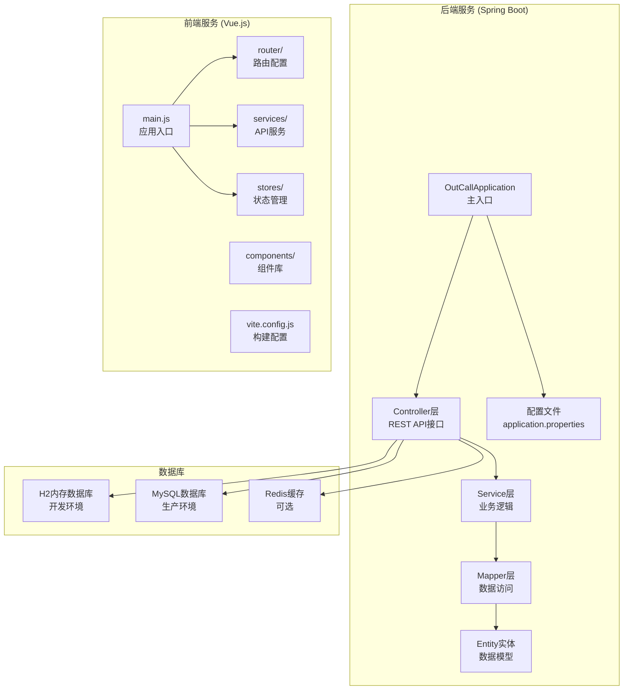
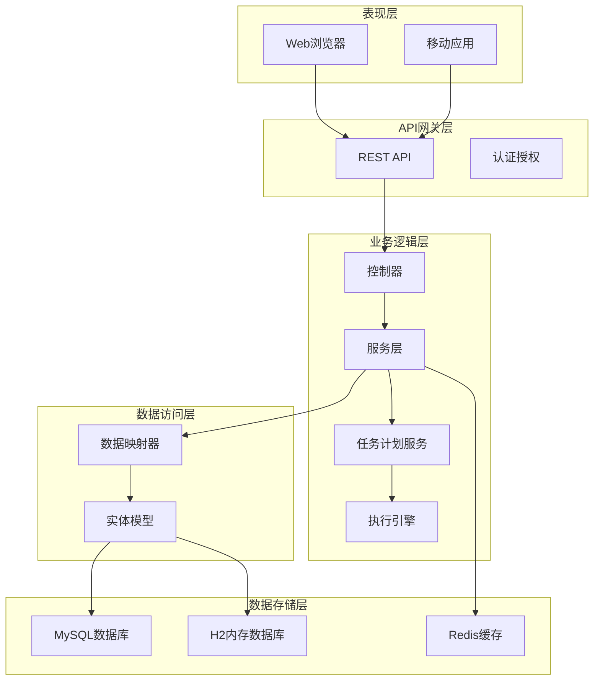
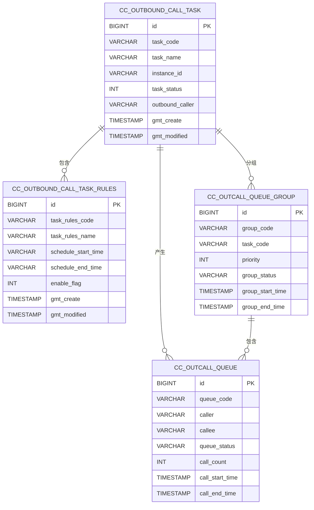
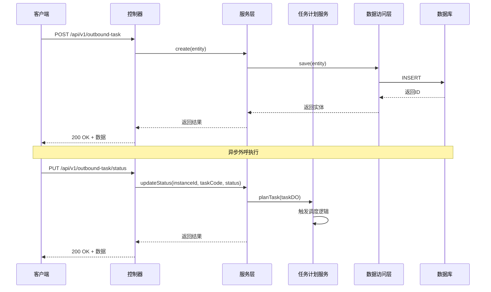
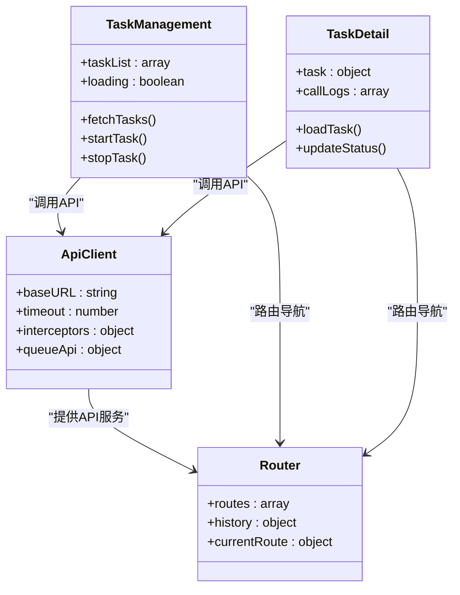
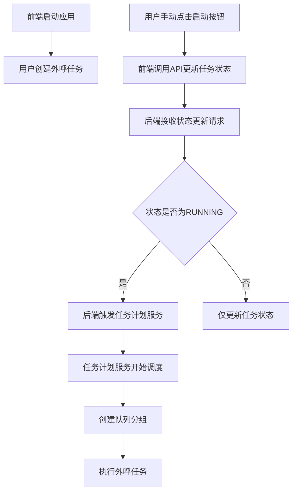

# 快速部署指南

<cite>
**本文档引用的文件**
- [QUICK_START.md](file://QUICK_START.md)
- [DEPLOYMENT.md](file://frontend/DEPLOYMENT.md)
- [pom.xml](file://pom.xml)
- [application.properties](file://src/main/resources/application.properties)
- [OutCallApplication.java](file://src/main/java/org/qianye/OutCallApplication.java)
- [vite.config.js](file://frontend/vite.config.js)
- [schema.sql](file://src/main/resources/schema.sql)
- [OutboundCallTaskController.java](file://src/main/java/org/qianye/controller/OutboundCallTaskController.java)
- [OutboundCallTaskServiceImpl.java](file://src/main/java/org/qianye/service/impl/OutboundCallTaskServiceImpl.java)
- [OutCallService.java](file://src/main/java/org/qianye/engine/OutCallService.java)
- [package.json](file://frontend/package.json)
- [api.js](file://frontend/src/services/api.js)
- [index.js](file://frontend/src/router/index.js)
- [TaskManagement.vue](file://frontend/src/pages/TaskManagement.vue)
- [task.js](file://frontend/src/stores/task.js)
- [TaskPlanService.java](file://src/main/java/org/qianye/service/impl/TaskPlanService.java)
</cite>

## 目录
1. [简介](#简介)
2. [项目结构](#项目结构)
3. [核心组件](#核心组件)
4. [架构概览](#架构概览)
5. [详细组件分析](#详细组件分析)
6. [部署流程详解](#部署流程详解)
7. [性能考虑](#性能考虑)
8. [故障排除指南](#故障排除指南)
9. [结论](#结论)

## 简介

OutCall是一个基于Spring Boot和Vue.js的外呼任务管理系统，提供了完整的前后端分离架构。该系统支持外呼任务管理、队列调度、定时任务等功能，采用现代化的技术栈实现高效的企业级外呼解决方案。

## 项目结构

项目采用典型的前后端分离架构，包含以下主要模块：



**图表来源**
- [OutCallApplication.java](file://src/main/java/org/qianye/OutCallApplication.java#L1-L13)
- [application.properties](file://src/main/resources/application.properties#L1-L39)
- [vite.config.js](file://frontend/vite.config.js#L1-L17)

**章节来源**
- [pom.xml](file://pom.xml#L1-L97)
- [QUICK_START.md](file://QUICK_START.md#L1-L120)

## 核心组件

### 后端核心组件

系统的核心组件包括：

1. **应用启动类**: `OutCallApplication` - Spring Boot应用入口点
2. **控制器层**: 提供RESTful API接口
3. **服务层**: 实现业务逻辑处理
4. **数据访问层**: 基于MyBatis-Plus的数据操作
5. **实体模型**: 完整的数据结构定义

### 前端核心组件

前端采用Vue 3 + Vite技术栈：

1. **应用入口**: `main.js` - 应用初始化
2. **路由系统**: `router/index.js` - 页面导航
3. **API服务**: `services/api.js` - 后端接口调用
4. **组件库**: `components/` - 可复用UI组件
5. **状态管理**: `stores/` - Pinia状态管理

**章节来源**
- [OutboundCallTaskController.java](file://src/main/java/org/qianye/controller/OutboundCallTaskController.java#L1-L71)
- [OutboundCallTaskServiceImpl.java](file://src/main/java/org/qianye/service/impl/OutboundCallTaskServiceImpl.java#L1-L85)
- [OutCallService.java](file://src/main/java/org/qianye/engine/OutCallService.java#L1-L10)

## 架构概览

系统采用分层架构设计，确保职责分离和代码可维护性：



**图表来源**
- [OutboundCallTaskController.java](file://src/main/java/org/qianye/controller/OutboundCallTaskController.java#L15-L18)
- [OutboundCallTaskServiceImpl.java](file://src/main/java/org/qianye/service/impl/OutboundCallTaskServiceImpl.java#L14-L17)
- [application.properties](file://src/main/resources/application.properties#L5-L15)

## 详细组件分析

### 数据库架构

系统支持多种数据库配置，采用灵活的配置机制：



**图表来源**
- [schema.sql](file://src/main/resources/schema.sql#L4-L96)

### API接口设计

系统提供完整的RESTful API接口：



**图表来源**
- [OutboundCallTaskController.java](file://src/main/java/org/qianye/controller/OutboundCallTaskController.java#L22-L48)
- [OutboundCallTaskServiceImpl.java](file://src/main/java/org/qianye/service/impl/OutboundCallTaskServiceImpl.java#L18-L28)

**章节来源**
- [schema.sql](file://src/main/resources/schema.sql#L1-L112)
- [OutboundCallTaskController.java](file://src/main/java/org/qianye/controller/OutboundCallTaskController.java#L1-L71)

### 前端组件架构

前端采用模块化设计，支持组件复用和状态管理：



**图表来源**
- [api.js](file://frontend/src/services/api.js#L1-L95)
- [index.js](file://frontend/src/router/index.js#L1-L28)

**章节来源**
- [api.js](file://frontend/src/services/api.js#L1-L95)
- [index.js](file://frontend/src/router/index.js#L1-L28)

### 调度逻辑与任务状态管理

系统采用任务状态驱动的调度机制，前端需要手动启动任务才能触发后端调度逻辑：



**图表来源**
- [TaskManagement.vue](file://frontend/src/pages/TaskManagement.vue#L291-L298)
- [task.js](file://frontend/src/stores/task.js#L71-L85)
- [OutboundCallTaskServiceImpl.java](file://src/main/java/org/qianye/service/impl/OutboundCallTaskServiceImpl.java#L68-L83)
- [TaskPlanService.java](file://src/main/java/org/qianye/service/impl/TaskPlanService.java#L252-L275)

**章节来源**
- [TaskManagement.vue](file://frontend/src/pages/TaskManagement.vue#L138-L154)
- [task.js](file://frontend/src/stores/task.js#L71-L85)
- [OutboundCallTaskServiceImpl.java](file://src/main/java/org/qianye/service/impl/OutboundCallTaskServiceImpl.java#L73-L83)

## 部署流程详解

### 开发环境快速部署

#### 后端部署

1. **环境准备**
   - 安装JDK 8+
   - 安装Maven 3.6+
   - 确保端口8080可用

2. **启动步骤**
   ```bash
   # 进入项目根目录
   cd outcall
   
   # 启动后端服务（使用H2内存数据库）
   mvn spring-boot:run
   ```

3. **验证服务**
   - 访问后端API: `http://localhost:8080`
   - 访问数据库控制台: `http://localhost:8080/h2-console`

#### 前端部署

1. **环境准备**
   - 安装Node.js 16+
   - 安装npm 8+

2. **启动步骤**
   ```bash
   # 进入前端目录
   cd frontend
   
   # 安装依赖
   npm install
   
   # 启动开发服务器
   npm run dev
   ```

3. **访问应用**
   - 前端界面: `http://localhost:5173`

**重要操作注意事项**：前端启动后，需要在页面点击启动任务按钮，才能触发后端调度逻辑。这是系统的关键工作机制，新用户必须手动执行此操作才能看到外呼任务正常运行。

### 生产环境Docker部署

#### 构建后端镜像

```bash
# 进入项目根目录
cd outcall

# 清理并构建
mvn clean package

# 进入目标目录
cd target

# 查看生成的jar文件
ls outcall*.jar
```

#### 构建前端镜像

```bash
# 进入前端目录
cd ../frontend

# 构建Docker镜像
docker build -t outcall-frontend .
```

#### 运行Docker容器

```bash
# 使用docker-compose启动
docker-compose up -d

# 查看容器状态
docker ps

# 查看日志
docker logs outcall_backend_1
docker logs outcall_frontend_1
```

### 配置文件详解

#### 后端配置

系统支持多种配置环境：

| 配置项 | 开发默认值 | 生产默认值 | 说明 |
|--------|------------|------------|------|
| 数据库类型 | h2 | mysql | 支持内存数据库和关系型数据库 |
| 缓存类型 | local | redis | 本地缓存或Redis缓存 |
| 锁机制 | local | redis | 本地锁或分布式锁 |
| 服务器端口 | 8080 | 8080 | API服务端口 |
| 数据库URL | jdbc:h2:mem:testdb | jdbc:mysql://localhost:3306/outcall | 数据库连接地址 |

#### 前端配置

前端支持多环境配置：

| 环境变量 | 开发默认值 | 生产默认值 | 说明 |
|----------|------------|------------|------|
| VITE_API_BASE_URL | http://localhost:8080/api | https://your-domain.com/api | API基础URL |
| VITE_APP_TITLE | 外呼任务管理系统-开发版 | 外呼任务管理系统 | 应用标题 |
| NODE_ENV | development | production | 环境模式 |

**章节来源**
- [QUICK_START.md](file://QUICK_START.md#L1-L120)
- [application.properties](file://src/main/resources/application.properties#L1-L39)
- [DEPLOYMENT.md](file://frontend/DEPLOYMENT.md#L23-L85)

## 性能考虑

### 后端性能优化

1. **数据库连接池配置**
   - 使用HikariCP连接池
   - 合理设置最大连接数
   - 配置连接超时时间

2. **缓存策略**
   - Redis缓存热点数据
   - 本地缓存减少数据库压力
   - 缓存失效策略

3. **异步处理**
   - 使用@Async注解处理耗时操作
   - 线程池配置优化
   - 异步任务队列

### 前端性能优化

1. **构建优化**
   - 代码分割和懒加载
   - 资源压缩和合并
   - CDN加速静态资源

2. **运行时优化**
   - 组件缓存
   - 虚拟滚动处理大数据集
   - 防抖和节流

3. **网络优化**
   - HTTP缓存策略
   - 请求合并
   - 预加载关键资源

## 故障排除指南

### 常见问题及解决方案

#### 后端启动失败

**问题**: 端口被占用
```bash
# 检查8080端口占用情况
lsof -i :8080

# 杀死占用进程
kill -9 PID

# 重新启动服务
mvn spring-boot:run
```

**问题**: 数据库连接失败
```bash
# 检查MySQL服务状态
systemctl status mysql

# 测试数据库连接
telnet localhost 3306

# 验证连接参数
mysql -h localhost -P 3306 -u root -p
```

#### 前端开发问题

**问题**: 前端白屏
```bash
# 清理node_modules
rm -rf node_modules package-lock.json

# 重新安装依赖
npm install

# 检查代理配置
cat vite.config.js | grep proxy
```

**问题**: API请求失败
```bash
# 检查后端服务状态
curl http://localhost:8080

# 检查CORS配置
curl -I http://localhost:8080/api/v1/outbound-task

# 查看浏览器开发者工具
# Network标签查看请求详情
```

**问题**: 外呼任务不启动
```bash
# 检查任务状态是否为RUNNING
# 在任务列表中确认任务状态
# 确认用户已点击启动按钮

# 查看后端日志
# 检查任务计划服务是否被触发
tail -f backend.log | grep "planTask"
```

#### Docker部署问题

**问题**: 容器启动失败
```bash
# 查看详细错误日志
docker-compose logs

# 检查端口映射
docker-compose ps

# 重建镜像
docker-compose build --no-cache
docker-compose up -d
```

**问题**: 数据持久化问题
```bash
# 检查数据卷挂载
docker volume ls

# 查看数据卷内容
docker volume inspect outcall_mysql_data

# 重启容器
docker-compose restart
```

### 监控和调试

#### 后端监控

1. **健康检查**
   ```bash
   # 健康检查端点
   curl http://localhost:8080/actuator/health
   
   # 应用信息
   curl http://localhost:8080/actuator/info
   ```

2. **性能监控**
   ```bash
   # JVM指标
   curl http://localhost:8080/actuator/metrics
   
   # 线程池状态
   curl http://localhost:8080/actuator/threaddump
   ```

#### 前端调试

1. **Vue DevTools**
   - 安装Chrome扩展
   - 检查组件树
   - 监控状态变化

2. **网络调试**
   - 查看API响应
   - 检查请求头
   - 分析响应时间

**章节来源**
- [QUICK_START.md](file://QUICK_START.md#L94-L120)
- [DEPLOYMENT.md](file://frontend/DEPLOYMENT.md#L305-L355)

## 结论

OutCall项目提供了完整的外呼任务管理解决方案，具有以下优势：

1. **技术先进**: 采用Spring Boot 2.7和Vue.js 3等现代技术栈
2. **架构清晰**: 分层设计确保代码可维护性和可扩展性
3. **部署简便**: 支持一键部署和Docker容器化
4. **功能完善**: 涵盖外呼任务管理的完整生命周期
5. **性能优秀**: 通过缓存、异步处理等技术优化性能

**重要操作注意事项**：系统采用任务状态驱动的调度机制，前端启动后需要用户手动点击启动任务按钮才能触发后端调度逻辑。这是系统的关键工作机制，新用户必须理解并执行此操作才能看到外呼任务正常运行。

建议在生产环境中：
- 使用MySQL替代H2数据库
- 配置Redis缓存和分布式锁
- 设置负载均衡和高可用架构
- 配置完善的监控和告警系统
- 制定详细的备份和恢复策略

通过遵循本指南，您可以快速部署和运行OutCall系统，为您的外呼业务提供稳定可靠的技术支撑。