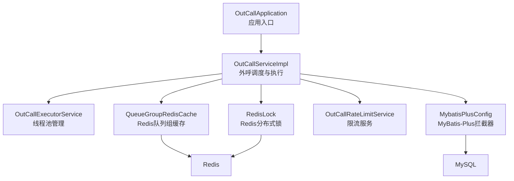
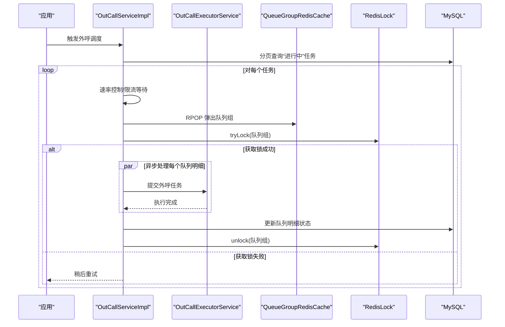
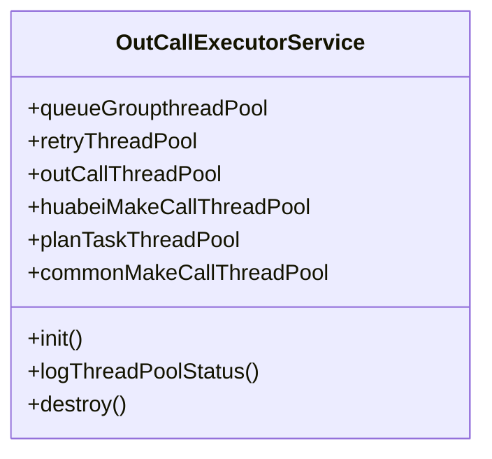
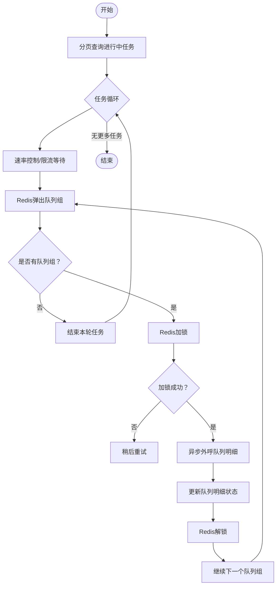
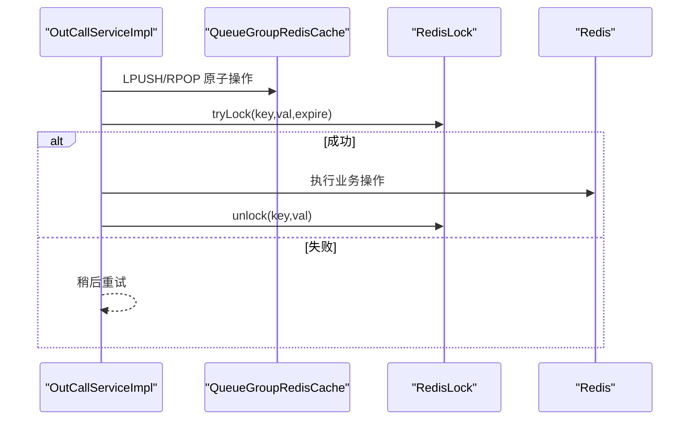
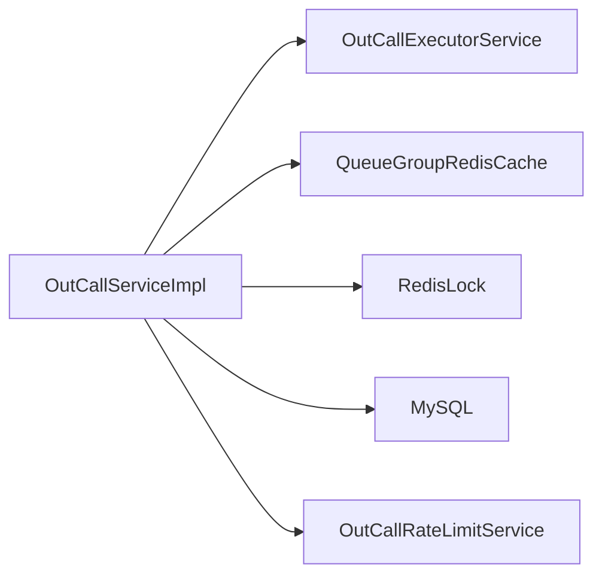

# 性能调优

<cite>
**本文引用的文件**
- [OutCallApplication.java](file://src/main/java/org/qianye/OutCallApplication.java)
- [application.properties](file://src/main/resources/application.properties)
- [pom.xml](file://pom.xml)
- [OutCallExecutorService.java](file://src/main/java/org/qianye/OutCallExecutorService.java)
- [OutCallServiceImpl.java](file://src/main/java/org/qianye/OutCallServiceImpl.java)
- [OutCallScheduleDrm.java](file://src/main/java/org/qianye/OutCallScheduleDrm.java)
- [OutCallRateLimitService.java](file://src/main/java/org/qianye/OutCallRateLimitService.java)
- [RedisLock.java](file://src/main/java/org/qianye/RedisLock.java)
- [QueueGroupRedisCache.java](file://src/main/java/org/qianye/QueueGroupRedisCache.java)
- [MybatisPlusConfig.java](file://src/main/java/org/qianye/config/MybatisPlusConfig.java)
- [LoggerUtil.java](file://src/main/java/org/qianye/LoggerUtil.java)
</cite>

## 目录
1. [引言](#引言)
2. [项目结构](#项目结构)
3. [核心组件](#核心组件)
4. [架构总览](#架构总览)
5. [详细组件分析](#详细组件分析)
6. [依赖分析](#依赖分析)
7. [性能考虑与调优策略](#性能考虑与调优策略)
8. [故障排查指南](#故障排查指南)
9. [结论](#结论)
10. [附录](#附录)

## 引言
本文件面向 Outcall 系统的性能调优，围绕 CPU、内存、磁盘 I/O、网络带宽等维度，结合代码中的线程池、缓存、限流、数据库访问路径，给出可落地的调优方法与实践建议。同时覆盖 JVM 参数与 GC 策略、负载均衡与水平扩展、以及性能测试与压测方法论。

## 项目结构
Outcall 采用 Spring Boot 应用，核心模块包括：
- 应用入口与配置：应用启动类、数据库与 MyBatis-Plus 配置
- 业务执行层：外呼调度与执行逻辑
- 并发与调度：多线程池与定时监控
- 缓存与分布式锁：基于 Redis 的队列组缓存与锁
- 限流与速率控制：基于配置的限流与请求节流

图表来源
- [OutCallApplication.java](file://src/main/java/org/qianye/OutCallApplication.java#L1-L13)
- [OutCallServiceImpl.java](file://src/main/java/org/qianye/OutCallServiceImpl.java#L1-L120)
- [OutCallExecutorService.java](file://src/main/java/org/qianye/OutCallExecutorService.java#L1-L60)
- [QueueGroupRedisCache.java](file://src/main/java/org/qianye/QueueGroupRedisCache.java#L1-L80)
- [RedisLock.java](file://src/main/java/org/qianye/RedisLock.java#L1-L120)
- [OutCallRateLimitService.java](file://src/main/java/org/qianye/OutCallRateLimitService.java#L1-L17)
- [MybatisPlusConfig.java](file://src/main/java/org/qianye/config/MybatisPlusConfig.java#L1-L28)

章节来源
- [OutCallApplication.java](file://src/main/java/org/qianye/OutCallApplication.java#L1-L13)
- [application.properties](file://src/main/resources/application.properties#L1-L17)
- [pom.xml](file://pom.xml#L1-L91)

## 核心组件
- 线程池体系：包含队列组处理、重试、外呼、华北地区专用、计划任务、通用外呼等线程池，具备运行时监控与优雅关闭能力
- 外呼调度与执行：按任务分页拉取、速率控制、限流等待、队列组弹出、Redis 分布式锁保护、队列明细异步处理
- Redis 缓存：队列组列表以 Redis 列表形式存储，提供原子弹出与批量移动，支持固定/公共两套缓存键空间
- 分布式锁：基于 Redis 的 setIfAbsent + Lua 脚本解锁，配合续期线程池保障长任务锁安全
- 限流与速率控制：通过配置项控制等待时长、睡眠间隔、最大队列长度、最大线程池大小等
- 数据库访问：MyBatis-Plus 拦截器启用乐观锁，分页插件暂禁用

章节来源
- [OutCallExecutorService.java](file://src/main/java/org/qianye/OutCallExecutorService.java#L1-L211)
- [OutCallServiceImpl.java](file://src/main/java/org/qianye/OutCallServiceImpl.java#L1-L250)
- [QueueGroupRedisCache.java](file://src/main/java/org/qianye/QueueGroupRedisCache.java#L1-L120)
- [RedisLock.java](file://src/main/java/org/qianye/RedisLock.java#L1-L200)
- [OutCallRateLimitService.java](file://src/main/java/org/qianye/OutCallRateLimitService.java#L1-L17)
- [MybatisPlusConfig.java](file://src/main/java/org/qianye/config/MybatisPlusConfig.java#L1-L28)

## 架构总览
Outcall 的核心执行链路如下：
- 从数据库分页查询“进行中”外呼任务
- 对每个任务，按时间窗口与限流策略决定是否继续
- 从 Redis 队列组缓存弹出一批队列组，加 Redis 锁后逐个队列明细异步发起外呼
- 外呼结果写回数据库，完成后释放锁

图表来源
- [OutCallServiceImpl.java](file://src/main/java/org/qianye/OutCallServiceImpl.java#L70-L250)
- [QueueGroupRedisCache.java](file://src/main/java/org/qianye/QueueGroupRedisCache.java#L120-L170)
- [RedisLock.java](file://src/main/java/org/qianye/RedisLock.java#L250-L320)
- [MybatisPlusConfig.java](file://src/main/java/org/qianye/config/MybatisPlusConfig.java#L15-L28)

## 详细组件分析

### 线程池组件分析
- 线程池类型与用途
  - 队列组处理线程池：用于处理单个队列组内的多个队列明细
  - 重试线程池：异常或限流时的重试任务
  - 外呼线程池：常规外呼任务
  - 华北专用线程池：针对特定租户的高并发场景
  - 计划任务线程池：任务计划相关的后台工作
  - 通用外呼线程池：默认外呼执行线程池
- 运行时监控：每 10 秒打印各线程池的活动线程数、池大小、最大队列长度等
- 优雅关闭：销毁阶段依次关闭监控与各线程池，确保任务有序退出

图表来源
- [OutCallExecutorService.java](file://src/main/java/org/qianye/OutCallExecutorService.java#L1-L211)

章节来源
- [OutCallExecutorService.java](file://src/main/java/org/qianye/OutCallExecutorService.java#L1-L211)

### 外呼调度与执行流程
- 任务分页拉取与速率控制：按固定页大小遍历“进行中”任务，每次循环可插入请求节流
- 限流等待：在指定超时内轮询等待限流解除，期间可刷新任务上下文
- 队列组弹出与状态校验：从 Redis 缓存弹出一批队列组，过滤非规划状态
- 异步外呼：根据租户选择不同线程池，提交外呼任务；若队列积压超过阈值，将队列明细置为等待并更新
- 结束条件：当无更多队列组或租户无剩余队列时发布结束事件并释放运行标志

图表来源
- [OutCallServiceImpl.java](file://src/main/java/org/qianye/OutCallServiceImpl.java#L70-L250)
- [OutCallServiceImpl.java](file://src/main/java/org/qianye/OutCallServiceImpl.java#L668-L763)

章节来源
- [OutCallServiceImpl.java](file://src/main/java/org/qianye/OutCallServiceImpl.java#L70-L250)
- [OutCallServiceImpl.java](file://src/main/java/org/qianye/OutCallServiceImpl.java#L668-L763)

### Redis 缓存与分布式锁
- 队列组缓存：以 Redis 列表存储，提供原子弹出与批量左推，支持固定/公共两套键空间
- 分布式锁：基于 setIfAbsent + Lua 脚本解锁，超过阈值自动续期，续期线程池周期检查并续期
- 锁续期策略：按过期时间的 1/3 间隔续期，避免长时间占用导致死锁

图表来源
- [QueueGroupRedisCache.java](file://src/main/java/org/qianye/QueueGroupRedisCache.java#L80-L120)
- [RedisLock.java](file://src/main/java/org/qianye/RedisLock.java#L250-L320)

章节来源
- [QueueGroupRedisCache.java](file://src/main/java/org/qianye/QueueGroupRedisCache.java#L1-L279)
- [RedisLock.java](file://src/main/java/org/qianye/RedisLock.java#L1-L480)

### 限流与速率控制
- 限流等待：在超时时间内轮询检查是否达到限流阈值，期间可短睡眠并刷新任务上下文
- 请求节流：可通过配置项设置每次循环的休眠时间，平滑吞吐
- 队列长度阈值：当线程池队列长度超过阈值时，将队列明细置为等待并更新

章节来源
- [OutCallServiceImpl.java](file://src/main/java/org/qianye/OutCallServiceImpl.java#L596-L667)
- [OutCallScheduleDrm.java](file://src/main/java/org/qianye/OutCallScheduleDrm.java#L1-L113)

### 数据访问与数据库优化
- MyBatis-Plus：启用乐观锁拦截器，分页插件暂禁用，避免 JSQLParser 版本冲突
- 建议：对高频查询建立合适索引；对批量更新使用批处理；避免 N+1 查询

章节来源
- [MybatisPlusConfig.java](file://src/main/java/org/qianye/config/MybatisPlusConfig.java#L1-L28)

## 依赖分析
- 外呼调度依赖线程池、Redis 缓存、分布式锁、数据库访问与限流服务
- 线程池之间耦合度低，便于独立调优
- Redis 与 MySQL 为外部依赖，需关注网络延迟与连接池配置

图表来源
- [OutCallServiceImpl.java](file://src/main/java/org/qianye/OutCallServiceImpl.java#L1-L120)
- [OutCallExecutorService.java](file://src/main/java/org/qianye/OutCallExecutorService.java#L1-L60)
- [QueueGroupRedisCache.java](file://src/main/java/org/qianye/QueueGroupRedisCache.java#L1-L80)
- [RedisLock.java](file://src/main/java/org/qianye/RedisLock.java#L1-L120)
- [OutCallRateLimitService.java](file://src/main/java/org/qianye/OutCallRateLimitService.java#L1-L17)

## 性能考虑与调优策略

### 监控指标与瓶颈识别
- CPU
  - 关注线程池活跃线程数与队列长度，判断是否存在线程饥饿或过度切换
  - 通过线程池监控日志观察各池的 ActiveCount/PoolSize/QueueSize
- 内存
  - 观察队列组缓存大小与线程池队列长度，避免内存堆积
  - 关注 Redis 列表长度与过期策略，防止缓存膨胀
- 磁盘 I/O
  - 数据库写入频率较高，关注批量更新与事务大小
  - 日志级别与落盘策略，避免频繁刷盘
- 网络带宽
  - 外呼请求与 Redis/MySQL 网络开销，建议就近部署与连接池优化

章节来源
- [OutCallExecutorService.java](file://src/main/java/org/qianye/OutCallExecutorService.java#L60-L137)
- [QueueGroupRedisCache.java](file://src/main/java/org/qianye/QueueGroupRedisCache.java#L160-L186)

### 线程池参数调优
- 核心线程数（CorePoolSize）
  - 默认通用外呼线程池核心线程数较高，适合高并发场景
  - 可根据 CPU 核心数与任务阻塞比例调整，避免 CPU 空闲与线程切换开销过大
- 最大线程数（MaximumPoolSize）
  - 华北专用线程池与通用线程池最大线程数较高，适合突发流量
  - 建议结合队列长度与 SLA，动态调整最大线程数
- 队列长度（LinkedBlockingQueue）
  - 队列长度影响背压与内存占用，建议与限流策略协同
  - 当队列长度接近阈值时，应触发降级或限流，避免内存溢出
- 拒绝策略
  - DiscardPolicy 丢弃新任务，CallerRunsPolicy 在提交线程执行，需评估业务容忍度

章节来源
- [OutCallExecutorService.java](file://src/main/java/org/qianye/OutCallExecutorService.java#L14-L51)
- [OutCallServiceImpl.java](file://src/main/java/org/qianye/OutCallServiceImpl.java#L137-L144)
- [OutCallScheduleDrm.java](file://src/main/java/org/qianye/OutCallScheduleDrm.java#L11-L45)

### 数据库连接池与 SQL 优化
- 连接池
  - 使用 Spring Boot 默认 HikariCP，建议结合数据库规格与 QPS 调整连接数
  - 关注连接池等待时间与超时，避免请求排队
- SQL 优化
  - 对高频查询建立合适索引（如任务状态、时间范围、实例标识）
  - 批量更新与写入，减少往返次数
  - 避免 SELECT * 与 N+1 查询，优先投影必要字段

章节来源
- [application.properties](file://src/main/resources/application.properties#L6-L16)
- [MybatisPlusConfig.java](file://src/main/java/org/qianye/config/MybatisPlusConfig.java#L15-L28)

### 缓存命中率与 Redis 性能优化
- 命中率提升
  - 合理设置队列组缓存上限与过期时间，避免缓存击穿与雪崩
  - 固定/公共两套缓存键空间分离，降低竞争
- Redis 性能
  - 使用 Lua 原子操作减少网络往返
  - 控制列表长度与过期时间，定期清理无效键
  - 分布式锁续期线程池保持稳定，避免锁丢失

章节来源
- [QueueGroupRedisCache.java](file://src/main/java/org/qianye/QueueGroupRedisCache.java#L117-L123)
- [RedisLock.java](file://src/main/java/org/qianye/RedisLock.java#L130-L149)

### JVM 参数与垃圾回收策略
- 建议
  - 根据业务峰值 QPS 与对象分配速率设置堆大小
  - 优先使用 G1GC 或 ZGC（取决于 JDK 版本），缩短 STW 时间
  - 开启逃逸分析与标量替换，减少临时对象
  - 调整新生代比例与晋升阈值，平衡晋升与 Full GC 频率

[本节为通用指导，无需列出具体文件来源]

### 负载均衡与水平扩展
- 负载均衡
  - 多实例部署，使用 Nginx/SLB 均匀分发请求
  - 避免热点任务集中在单一实例
- 水平扩展
  - 通过租户隔离线程池与缓存键空间，支持按租户扩容
  - Redis 缓存与锁需满足跨实例一致性

[本节为通用指导，无需列出具体文件来源]

### 性能测试与压力测试方法论
- 方法论
  - 明确目标：TP99、并发用户数、吞吐量、错误率
  - 分层压测：接口层、服务层、数据库层、缓存层
  - 渐进式加压：从基线到峰值，观察 CPU/内存/队列长度/Redis 延迟
- 指标采集
  - 应用侧：线程池状态、队列长度、限流等待时长
  - 中间件侧：Redis 命中率、延迟、连接数；MySQL QPS、锁等待
- 回归与对比
  - 每次调优后进行回归测试，记录关键指标变化

[本节为通用指导，无需列出具体文件来源]

## 故障排查指南
- 线程池相关
  - 若队列持续增长，检查限流策略与线程池最大线程数
  - 监控拒绝策略触发频率，评估业务降级策略
- Redis 相关
  - 锁续期失败或丢失：检查续期线程池健康与 Redis 延迟
  - 缓存命中率低：检查键空间设计与过期策略
- 数据库相关
  - 写入延迟高：检查批量更新与索引缺失
  - 死锁/锁等待：启用乐观锁并优化事务粒度

章节来源
- [OutCallExecutorService.java](file://src/main/java/org/qianye/OutCallExecutorService.java#L60-L137)
- [RedisLock.java](file://src/main/java/org/qianye/RedisLock.java#L410-L487)
- [OutCallServiceImpl.java](file://src/main/java/org/qianye/OutCallServiceImpl.java#L690-L760)

## 结论
通过线程池精细化配置、Redis 原子化缓存与分布式锁、限流与速率控制、数据库索引与批处理优化，以及完善的监控与压测体系，Outcall 系统可在高并发场景下保持稳定与高性能。建议以监控指标为依据，持续迭代调优，并结合业务特性进行租户隔离与水平扩展。

## 附录
- 快速检查清单
  - 线程池：ActiveCount/PoolSize/QueueSize 是否异常
  - Redis：列表长度、命中率、续期线程池健康
  - 数据库：慢查询、锁等待、索引缺失
  - JVM：GC 次数与停顿、堆使用率

[本节为通用指导，无需列出具体文件来源]