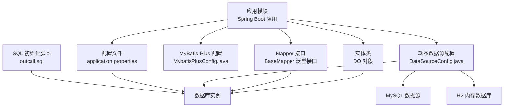
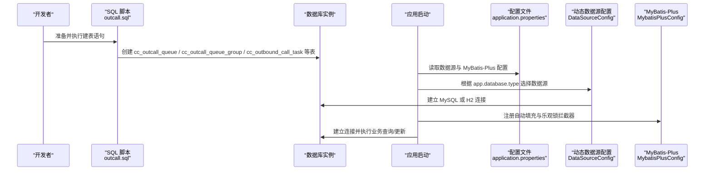
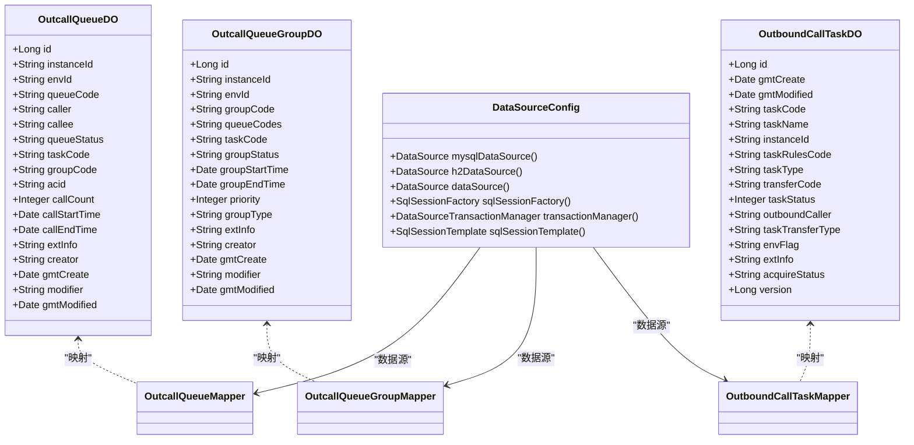
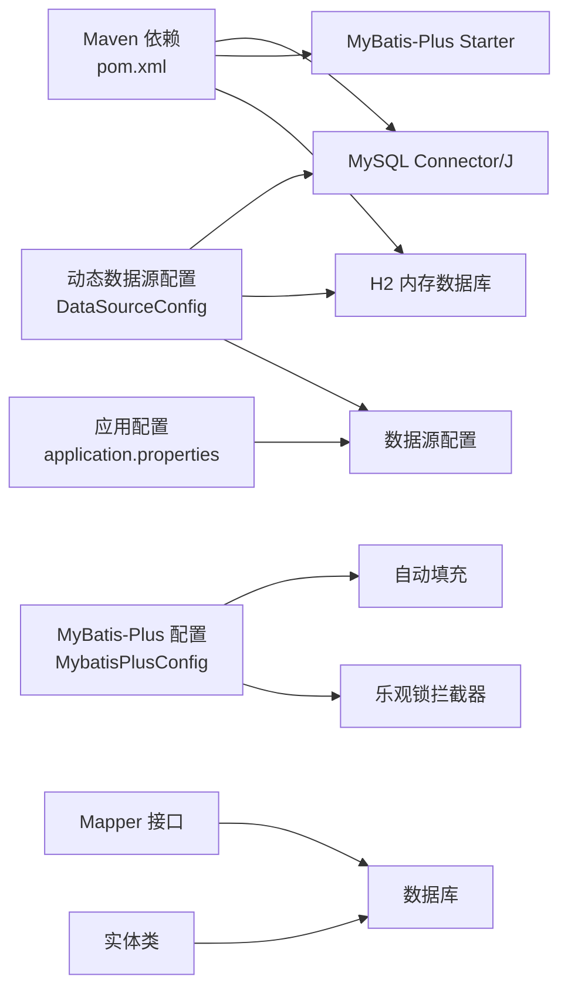

# 数据库初始化

<cite>
**本文引用的文件**
- [DataSourceConfig.java](file://src/main/java/org/qianye/config/DataSourceConfig.java)
- [application.properties](file://src/main/resources/application.properties)
- [outcall.sql](file://src/main/resources/outcall.sql)
- [MybatisPlusConfig.java](file://src/main/java/org/qianye/config/MybatisPlusConfig.java)
- [DataSourceConfigTest.java](file://src/test/java/org/qianye/config/DataSourceConfigTest.java)
- [OutcallQueueDO.java](file://src/main/java/org/qianye/entity/OutcallQueueDO.java)
- [OutcallQueueGroupDO.java](file://src/main/java/org/qianye/entity/OutcallQueueGroupDO.java)
- [OutboundCallTaskDO.java](file://src/main/java/org/qianye/entity/OutboundCallTaskDO.java)
- [OutcallQueueMapper.java](file://src/main/java/org/qianye/mapper/OutcallQueueMapper.java)
- [OutcallQueueGroupMapper.java](file://src/main/java/org/qianye/mapper/OutcallQueueGroupMapper.java)
- [OutboundCallTaskMapper.java](file://src/main/java/org/qianye/mapper/OutboundCallTaskMapper.java)
- [pom.xml](file://pom.xml)
</cite>

## 目录
1. [简介](#简介)
2. [项目结构](#项目结构)
3. [核心组件](#核心组件)
4. [架构总览](#架构总览)
5. [详细组件分析](#详细组件分析)
6. [依赖关系分析](#依赖关系分析)
7. [性能考虑](#性能考虑)
8. [故障排查指南](#故障排查指南)
9. [结论](#结论)
10. [附录](#附录)

## 简介
本文件面向 Outcall 系统的数据库初始化与运维，围绕以下目标展开：
- 完整说明数据库表结构与字段含义，覆盖 cc_outcall_queue、cc_outcall_queue_group、cc_outbound_call_task 及相关表
- 提供数据库创建脚本的执行步骤与注意事项
- 解释数据库连接配置参数与 MyBatis-Plus 的自动填充与乐观锁机制
- 说明动态数据源配置系统，支持 MySQL 和 H2 内存数据库的灵活切换
- 给出索引优化策略与性能调优建议
- 说明初始数据准备与测试数据插入方法
- 提供数据库备份与恢复策略以及迁移与版本升级处理方案

## 项目结构
Outcall 使用 Spring Boot + MyBatis-Plus 进行数据库访问，数据库初始化通过 SQL 脚本完成，应用通过配置文件指定数据源与 MyBatis-Plus 参数。新增的动态数据源配置系统允许在运行时根据配置自动选择 MySQL 或 H2 内存数据库。



**更新** 新增了动态数据源配置系统，支持 MySQL 和 H2 内存数据库的自动切换

图表来源
- [application.properties](file://src/main/resources/application.properties#L1-L36)
- [DataSourceConfig.java](file://src/main/java/org/qianye/config/DataSourceConfig.java#L1-L105)
- [MybatisPlusConfig.java](file://src/main/java/org/qianye/config/MybatisPlusConfig.java#L1-L49)
- [OutcallQueueMapper.java](file://src/main/java/org/qianye/mapper/OutcallQueueMapper.java#L1-L10)
- [OutcallQueueGroupMapper.java](file://src/main/java/org/qianye/mapper/OutcallQueueGroupMapper.java#L1-L10)
- [OutboundCallTaskMapper.java](file://src/main/java/org/qianye/mapper/OutboundCallTaskMapper.java#L1-L10)
- [outcall.sql](file://src/main/resources/outcall.sql#L1-L218)

章节来源
- [application.properties](file://src/main/resources/application.properties#L1-L36)
- [outcall.sql](file://src/main/resources/outcall.sql#L1-L218)
- [MybatisPlusConfig.java](file://src/main/java/org/qianye/config/MybatisPlusConfig.java#L1-L49)
- [DataSourceConfig.java](file://src/main/java/org/qianye/config/DataSourceConfig.java#L1-L105)

## 核心组件
- 动态数据源配置：支持 MySQL 和 H2 内存数据库的自动切换，通过 `app.database.type` 属性控制
- 数据库连接配置：驱动、URL、用户名、密码、MyBatis-Plus 映射路径、驼峰转换、日志输出、全局 ID 类型等
- 实体类与表结构映射：通过注解将 Java 字段映射到数据库列
- Mapper 接口：基于 MyBatis-Plus BaseMapper，提供通用 CRUD 能力
- MyBatis-Plus 配置：自动填充（创建/更新时间）、乐观锁拦截器

**更新** 新增了动态数据源配置系统，支持 MySQL 和 H2 内存数据库的灵活切换

章节来源
- [DataSourceConfig.java](file://src/main/java/org/qianye/config/DataSourceConfig.java#L31-L73)
- [application.properties](file://src/main/resources/application.properties#L5-L36)
- [OutcallQueueDO.java](file://src/main/java/org/qianye/entity/OutcallQueueDO.java#L1-L87)
- [OutcallQueueGroupDO.java](file://src/main/java/org/qianye/entity/OutcallQueueGroupDO.java#L1-L79)
- [OutboundCallTaskDO.java](file://src/main/java/org/qianye/entity/OutboundCallTaskDO.java#L1-L80)
- [MybatisPlusConfig.java](file://src/main/java/org/qianye/config/MybatisPlusConfig.java#L14-L48)

## 架构总览
数据库初始化与运行时交互的关键流程如下：



**更新** 新增了动态数据源配置的决策流程

图表来源
- [outcall.sql](file://src/main/resources/outcall.sql#L1-L218)
- [application.properties](file://src/main/resources/application.properties#L5-L6)
- [DataSourceConfig.java](file://src/main/java/org/qianye/config/DataSourceConfig.java#L60-L73)
- [MybatisPlusConfig.java](file://src/main/java/org/qianye/config/MybatisPlusConfig.java#L14-L48)

## 详细组件分析

### 动态数据源配置系统
- 用途：根据配置动态选择 MySQL 或 H2 内存数据库，支持开发、测试、生产环境的不同需求
- 核心配置
  - `app.database.type`：控制数据库类型，`mysql` 或 `h2`
  - MySQL 配置：通过 `spring.datasource.mysql.*` 属性配置
  - H2 配置：通过 `spring.datasource.h2.*` 属性配置
- 数据源选择逻辑
  - 默认使用 MySQL 数据源
  - 当 `app.database.type` 设置为 `h2` 时，自动切换到 H2 内存数据库
  - H2 数据库配置支持内存模式，适合单元测试和快速开发

**更新** 新增了完整的动态数据源配置系统说明

章节来源
- [DataSourceConfig.java](file://src/main/java/org/qianye/config/DataSourceConfig.java#L31-L73)
- [application.properties](file://src/main/resources/application.properties#L5-L28)

### 表：cc_outcall_queue（呼叫名单表）
- 用途：存储待外呼或正在外呼的记录，包含实例、环境、队列与任务关联信息，以及状态、主被叫、通话时间、扩展信息等
- 关键字段与含义（节选）
  - instance_id：实例标识
  - env_id：环境标识
  - queue_code：队列编码
  - caller/callee：主被叫号码
  - queue_status：状态（waiting/running/success/fail/stop）
  - task_code/group_code：关联任务与分组
  - acid：通话标识
  - call_count/call_start_time/call_end_time：重试次数与起止时间
  - ext_info：扩展信息
  - gmt_create/gmt_modified：创建与更新时间
- 索引与特性
  - 主键：id
  - 唯一索引：instance_id + queue_code + env_id
  - 复合索引：按 instance_id + task_code + gmt_modified、task_code + instance_id + env_id + gmt_modified（含覆盖列）、按 instance_id + task_code + env_id + queue_status + gmt_create、按 instance_id + task_code + env_id + callee + gmt_create 等
  - 表组织与存储参数：组织索引、压缩、副本数、块大小等

章节来源
- [outcall.sql](file://src/main/resources/outcall.sql#L1-L51)
- [OutcallQueueDO.java](file://src/main/java/org/qianye/entity/OutcallQueueDO.java#L11-L86)

### 表：cc_outcall_queue_group（待呼叫名单队列表）
- 用途：描述一组队列集合及其执行状态、优先级、类型（常规/择时）等
- 关键字段与含义（节选）
  - instance_id/env_id/group_code：实例、环境、组编码
  - queue_codes：该组包含的队列编码集合
  - task_code：关联任务编码
  - group_status：状态（waiting/processing/success/fail/stop）
  - group_start_time/group_end_time：开始/结束时间
  - priority：数值越大优先级越高
  - group_type：normal/fixedTime
  - ext_info：扩展信息
  - gmt_create/gmt_modified：创建与更新时间
- 索引与特性
  - 主键：id
  - 唯一索引：instance_id + env_id + group_code
  - 复合索引：按 instance_id + task_code + group_status + env_id + gmt_modified

章节来源
- [outcall.sql](file://src/main/resources/outcall.sql#L53-L93)
- [OutcallQueueGroupDO.java](file://src/main/java/org/qianye/entity/OutcallQueueGroupDO.java#L11-L78)

### 表：cc_outbound_call_task（智能外呼任务表）
- 用途：描述一次外呼任务的基本信息、规则、状态、转接对象、环境标志与版本控制等
- 关键字段与含义（节选）
  - task_code/task_name：任务编码与名称
  - instance_id：实例标识
  - task_rules_code：任务规则编码
  - task_type：任务类型（如 AUTO_CALL/OUTBOUND_CALL/IVR_CALL）
  - transfer_code：实际执行对象（坐席/技能组/IVR）
  - task_status：任务状态（0 启用/1 暂停/2 执行中/4 终止）
  - outbound_caller：主叫号码
  - task_transfer_type：转接类型
  - env_flag：环境标志（pre/prod/sit）
  - ext_info：扩展参数
  - acquire_status：收单状态（NOT_NEED/PENDING/COMPLETED）
  - version：版本号（用于乐观锁）
  - gmt_create/gmt_modified：创建与更新时间
- 索引与特性
  - 主键：id
  - 复合索引：按 instance_id + task_type、instance_id + task_rules_code、instance_id + task_code、instance_id、env_flag、gmt_modified

章节来源
- [outcall.sql](file://src/main/resources/outcall.sql#L169-L217)
- [OutboundCallTaskDO.java](file://src/main/java/org/qianye/entity/OutboundCallTaskDO.java#L11-L79)

### 表：cc_outbound_call_task_rules（任务规则表）
- 用途：存储任务规则的启用/生效/失效时间、规则详情与环境标志等
- 关键字段与含义（节选）
  - task_rules_code/task_rules_name：规则编码与名称
  - schedule_start_time/schedule_end_time：调度时间区间
  - task_rules_detail：规则内容
  - enable_flag：启用标志
  - take_effect_time/invalid_time：生效/失效时间
  - env_flag：环境标志
  - gmt_create/gmt_modified：创建与更新时间
- 索引与特性
  - 主键：id
  - 复合索引：按 instance_id + task_rules_code、instance_id + take_effect_time + invalid_time、instance_id、env_flag、gmt_modified

章节来源
- [outcall.sql](file://src/main/resources/outcall.sql#L123-L165)

### 表：cc_outbound_timing_info（外呼择时信息）
- 用途：记录手机号在特定时间段内的可外呼信息，支持来源、标签、扩展参数等
- 关键字段与含义（节选）
  - phone：手机号
  - timing：时间段
  - instance_id：实例标识
  - biz_id/source/tag/ext_info：来源、业务ID、标签、扩展参数
  - gmt_create/gmt_modified：创建与更新时间
- 索引与特性
  - 主键：id
  - 唯一索引：phone

章节来源
- [outcall.sql](file://src/main/resources/outcall.sql#L95-L121)

### 数据库连接与 MyBatis-Plus 配置
- 连接参数
  - 驱动类名、JDBC URL、用户名、密码
  - MyBatis-Plus：Mapper XML 路径、下划线转驼峰、日志实现、全局 ID 类型
- 自动填充
  - 插入时填充创建时间与更新时间
  - 更新时仅填充更新时间
- 乐观锁
  - 通过拦截器启用，配合实体中的版本字段进行并发写入保护

**更新** 新增了动态数据源配置对连接参数的影响说明

章节来源
- [application.properties](file://src/main/resources/application.properties#L14-L36)
- [MybatisPlusConfig.java](file://src/main/java/org/qianye/config/MybatisPlusConfig.java#L14-L48)
- [DataSourceConfig.java](file://src/main/java/org/qianye/config/DataSourceConfig.java#L34-L55)

### 类与表的映射关系


**更新** 新增了 DataSourceConfig 类的关系图

图表来源
- [OutcallQueueDO.java](file://src/main/java/org/qianye/entity/OutcallQueueDO.java#L11-L86)
- [OutcallQueueGroupDO.java](file://src/main/java/org/qianye/entity/OutcallQueueGroupDO.java#L11-L78)
- [OutboundCallTaskDO.java](file://src/main/java/org/qianye/entity/OutboundCallTaskDO.java#L11-L79)
- [DataSourceConfig.java](file://src/main/java/org/qianye/config/DataSourceConfig.java#L26-L103)
- [OutcallQueueMapper.java](file://src/main/java/org/qianye/mapper/OutcallQueueMapper.java#L1-L10)
- [OutcallQueueGroupMapper.java](file://src/main/java/org/qianye/mapper/OutcallQueueGroupMapper.java#L1-L10)
- [OutboundCallTaskMapper.java](file://src/main/java/org/qianye/mapper/OutboundCallTaskMapper.java#L1-L10)

## 依赖关系分析
- 应用层依赖于配置文件提供的数据源信息与 MyBatis-Plus 的拦截器配置
- 实体类通过注解与数据库表建立映射关系
- Mapper 接口继承 BaseMapper，获得通用 CRUD 能力
- 项目使用 MySQL Connector/J 与 MyBatis-Plus Starter
- 新增的动态数据源配置支持 H2 内存数据库作为替代数据源

**更新** 新增了动态数据源配置对依赖关系的影响



图表来源
- [pom.xml](file://pom.xml#L60-L86)
- [application.properties](file://src/main/resources/application.properties#L14-L36)
- [DataSourceConfig.java](file://src/main/java/org/qianye/config/DataSourceConfig.java#L34-L55)
- [MybatisPlusConfig.java](file://src/main/java/org/qianye/config/MybatisPlusConfig.java#L14-L48)
- [OutcallQueueMapper.java](file://src/main/java/org/qianye/mapper/OutcallQueueMapper.java#L1-L10)
- [OutcallQueueGroupMapper.java](file://src/main/java/org/qianye/mapper/OutcallQueueGroupMapper.java#L1-L10)
- [OutboundCallTaskMapper.java](file://src/main/java/org/qianye/mapper/OutboundCallTaskMapper.java#L1-L10)

章节来源
- [pom.xml](file://pom.xml#L60-L86)
- [application.properties](file://src/main/resources/application.properties#L14-L36)
- [MybatisPlusConfig.java](file://src/main/java/org/qianye/config/MybatisPlusConfig.java#L14-L48)
- [DataSourceConfig.java](file://src/main/java/org/qianye/config/DataSourceConfig.java#L34-L55)

## 性能考虑
- 索引策略
  - 唯一索引：确保 instance_id + queue_code + env_id 或 instance_id + env_id + group_code 的唯一性，避免重复与并发冲突
  - 复合索引：围绕高频查询条件构建，如 instance_id + task_code + gmt_modified、task_code + instance_id + env_id + gmt_modified（含覆盖列）、按 queue_status/gmt_create/gmt_modified 的组合，以减少回表与排序成本
  - 存储参数：根据业务量选择合适的副本数、块大小与压缩算法，平衡写入吞吐与查询性能
- 写入优化
  - 使用自动填充统一维护创建/更新时间，减少业务侧冗余逻辑
  - 乐观锁版本字段用于高并发场景下的写冲突保护
- 查询优化
  - 将常用过滤条件前置到复合索引前缀，提升匹配效率
  - 对时间范围查询尽量结合 gmt_modified 或 gmt_create 等时间列
- 连接与池化
  - 在生产环境中建议通过连接池参数（最大连接数、空闲超时、获取超时等）进行调优，避免连接泄漏与抖动
- 分页与扫描
  - 当前配置禁用了分页插件，避免解析冲突；若后续启用，请确保 SQL 兼容性与索引覆盖
- 动态数据源性能
  - H2 内存数据库适合开发和测试环境，性能优于 MySQL 但数据持久性有限
  - MySQL 适合生产环境，支持完整的事务和数据持久化

**更新** 新增了动态数据源的性能考虑

章节来源
- [outcall.sql](file://src/main/resources/outcall.sql#L41-L49)
- [outcall.sql](file://src/main/resources/outcall.sql#L89-L91)
- [outcall.sql](file://src/main/resources/outcall.sql#L155-L163)
- [outcall.sql](file://src/main/resources/outcall.sql#L205-L215)
- [MybatisPlusConfig.java](file://src/main/java/org/qianye/config/MybatisPlusConfig.java#L20-L28)
- [application.properties](file://src/main/resources/application.properties#L5-L6)
- [DataSourceConfig.java](file://src/main/java/org/qianye/config/DataSourceConfig.java#L60-L73)

## 故障排查指南
- 连接失败
  - 检查 JDBC URL、用户名、密码是否正确
  - 确认数据库服务可用且网络可达
  - 验证 `app.database.type` 配置是否正确
- 启动报错（MyBatis-Plus）
  - 确认 Mapper XML 路径配置正确
  - 检查实体类字段与表结构一致，避免下划线/驼峰映射问题
- 并发写入冲突
  - 若出现乐观锁异常，检查版本字段与更新逻辑是否一致
- 索引未命中
  - 核对查询条件是否与索引前缀匹配，必要时调整索引或 SQL
- 日志定位
  - 启用 MyBatis-Plus 日志输出，便于观察 SQL 生成与执行计划
- 动态数据源问题
  - 检查 `app.database.type` 是否设置为 `mysql` 或 `h2`
  - 验证对应的数据库配置属性是否正确
  - 查看控制台输出确认当前使用的数据库类型

**更新** 新增了动态数据源相关的故障排查指南

章节来源
- [application.properties](file://src/main/resources/application.properties#L5-L6)
- [MybatisPlusConfig.java](file://src/main/java/org/qianye/config/MybatisPlusConfig.java#L33-L47)
- [DataSourceConfig.java](file://src/main/java/org/qianye/config/DataSourceConfig.java#L60-L73)
- [DataSourceConfigTest.java](file://src/test/java/org/qianye/config/DataSourceConfigTest.java#L24-L44)

## 结论
通过标准化的建表脚本与清晰的实体/映射关系，Outcall 系统实现了稳定的数据库初始化与运行时访问。新增的动态数据源配置系统提供了灵活的环境配置能力，支持 MySQL 和 H2 内存数据库的自动切换，满足不同开发阶段的需求。结合合理的索引策略、自动填充与乐观锁机制，可在高并发场景下保证一致性与性能。建议在生产环境进一步完善连接池参数与监控告警，并持续评估索引与查询模式以适配业务增长。

**更新** 新增了动态数据源配置系统的优势总结

## 附录

### 数据库初始化步骤
- 准备数据库实例与账号权限
- 执行初始化脚本，创建所有表与索引
- 验证表结构与索引是否符合预期
- 启动应用，确认连接与基本查询正常
- 根据需要配置 `app.database.type` 选择数据库类型

**更新** 新增了数据库类型配置步骤

章节来源
- [outcall.sql](file://src/main/resources/outcall.sql#L1-L218)
- [application.properties](file://src/main/resources/application.properties#L5-L6)

### 初始数据与测试数据准备
- 建议先插入一条任务规则记录，再创建任务与队列/分组
- 为任务与队列/分组设置合理的 instance_id、env_id、task_code、queue_code/group_code
- 使用批量插入工具或脚本导入测试号码，确保满足索引与唯一约束
- 验证状态流转与时间字段的自动填充效果
- 在 H2 环境下进行单元测试验证数据源切换功能

**更新** 新增了 H2 环境下的测试数据准备建议

章节来源
- [outcall.sql](file://src/main/resources/outcall.sql#L123-L165)
- [outcall.sql](file://src/main/resources/outcall.sql#L169-L217)
- [MybatisPlusConfig.java](file://src/main/java/org/qianye/config/MybatisPlusConfig.java#L33-L47)
- [DataSourceConfigTest.java](file://src/test/java/org/qianye/config/DataSourceConfigTest.java#L24-L44)

### 备份与恢复策略
- 备份
  - 使用逻辑备份工具导出结构与数据，定期校验备份完整性
  - 对关键表（任务、队列、分组）增加增量备份策略
- 恢复
  - 在隔离环境验证备份恢复流程
  - 恢复后核对版本号、索引与数据一致性
- 动态数据源考虑
  - H2 内存数据库的数据在进程结束后会丢失，不适合生产环境备份
  - MySQL 数据库支持完整的备份恢复流程

**更新** 新增了动态数据源对备份策略的影响

（本节为通用实践建议，不直接对应具体源码）

### 数据库迁移与版本升级
- 迁移策略
  - 新增列：使用默认值与非空约束谨慎设计，避免全表重写
  - 删除列：先灰度下线相关功能，再执行删除
  - 索引变更：评估对写入与查询的影响，分批执行
- 版本管理
  - 通过版本号字段（如任务表的 version）配合乐观锁，保障并发安全
  - 记录每次变更的 SQL 与影响范围，形成变更清单
- 动态数据源迁移
  - 从 H2 切换到 MySQL 时，确保初始化脚本在新环境中重新执行
  - 验证数据源切换配置在新环境中的正确性

**更新** 新增了动态数据源迁移的相关考虑

章节来源
- [OutboundCallTaskDO.java](file://src/main/java/org/qianye/entity/OutboundCallTaskDO.java#L77-L78)
- [outcall.sql](file://src/main/resources/outcall.sql#L169-L217)
- [DataSourceConfig.java](file://src/main/java/org/qianye/config/DataSourceConfig.java#L60-L73)

### 动态数据源配置示例
- 开发环境（H2 内存数据库）
  ```
  app.database.type=h2
  spring.datasource.h2.url=jdbc:h2:mem:testdb;DB_CLOSE_DELAY=-1;DB_CLOSE_ON_EXIT=FALSE;MODE=MySQL
  spring.h2.console.enabled=true
  ```
- 生产环境（MySQL）
  ```
  app.database.type=mysql
  spring.datasource.mysql.url=jdbc:mysql://localhost:3306/outcall?useUnicode=true&characterEncoding=utf-8&useSSL=false&serverTimezone=Asia/Shanghai
  ```

**更新** 新增了动态数据源配置示例

章节来源
- [application.properties](file://src/main/resources/application.properties#L5-L28)
- [DataSourceConfig.java](file://src/main/java/org/qianye/config/DataSourceConfig.java#L60-L73)