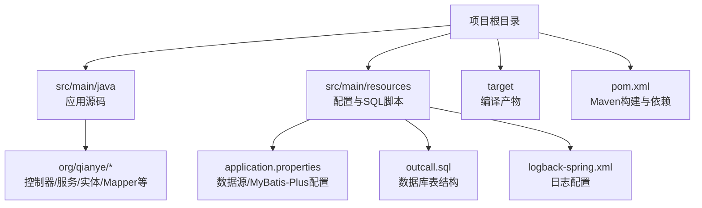
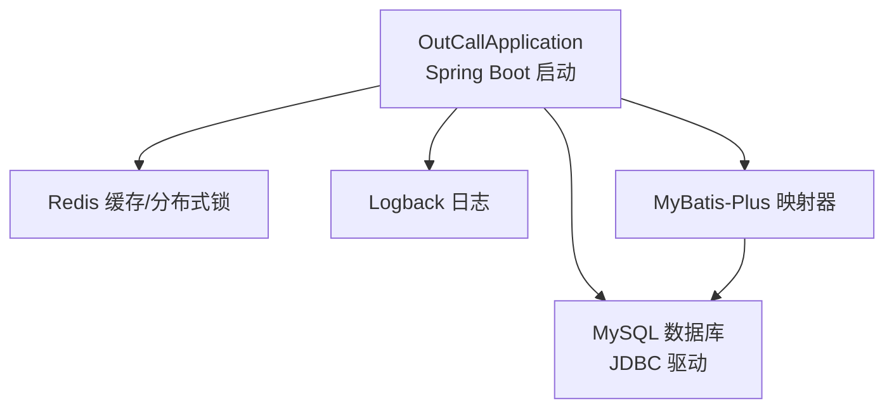
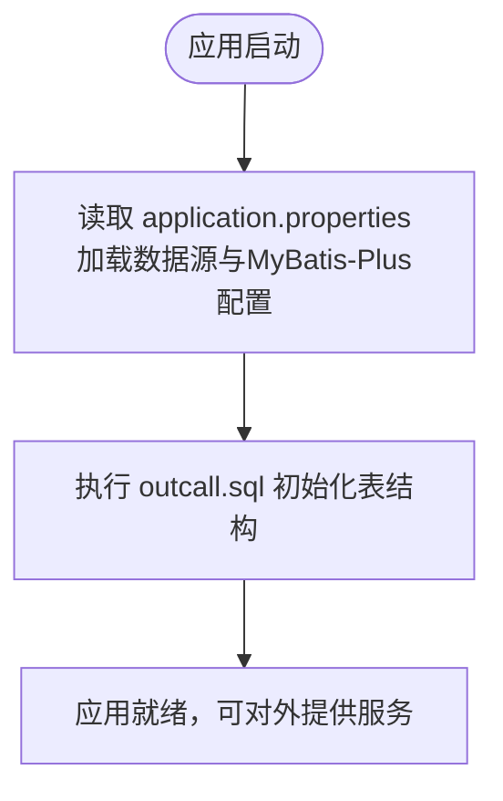
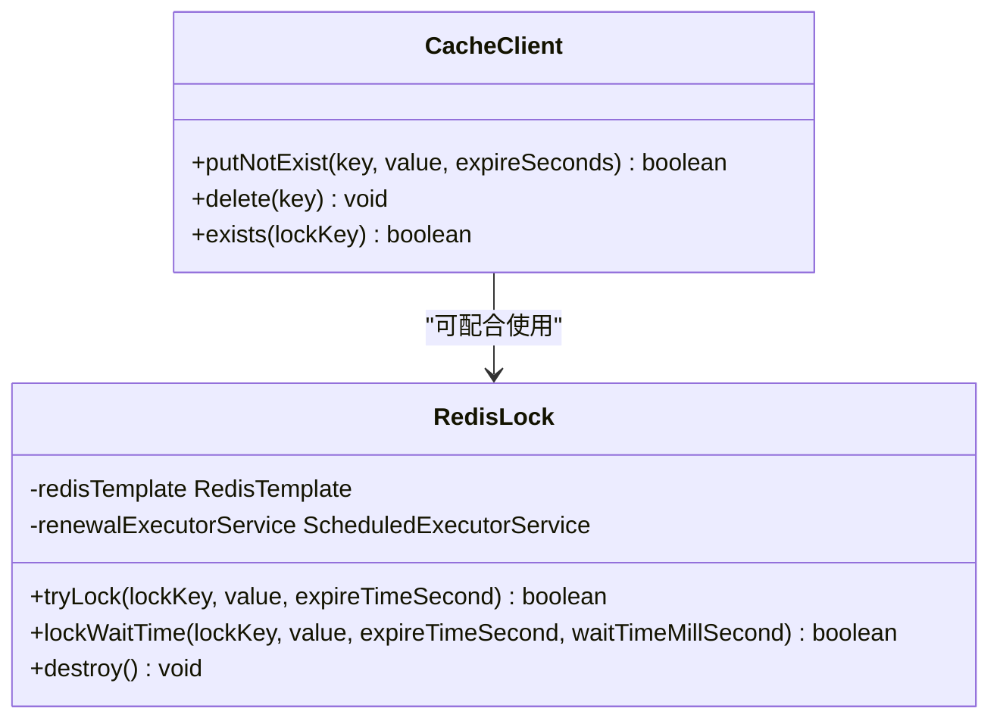
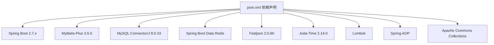

# 环境准备

<cite>
**本文引用的文件**
- [pom.xml](file://pom.xml)
- [application.properties](file://src/main/resources/application.properties)
- [OutCallApplication.java](file://src/main/java/org/qianye/OutCallApplication.java)
- [outcall.sql](file://src/main/resources/outcall.sql)
- [CacheClient.java](file://src/main/java/org/qianye/CacheClient.java)
- [RedisLock.java](file://src/main/java/org/qianye/RedisLock.java)
- [logback-spring.xml](file://src/main/resources/logback-spring.xml)
- [.gitignore](file://.gitignore)
</cite>

## 目录
1. [简介](#简介)
2. [项目结构](#项目结构)
3. [核心组件](#核心组件)
4. [架构总览](#架构总览)
5. [详细组件分析](#详细组件分析)
6. [依赖分析](#依赖分析)
7. [性能考虑](#性能考虑)
8. [故障排查指南](#故障排查指南)
9. [结论](#结论)
10. [附录](#附录)

## 简介
本文件面向 Outcall 系统的环境准备与部署，覆盖硬件与软件要求、JDK 版本、MySQL 与 Redis 的安装与配置、Maven 构建环境、网络与防火墙要求、开发与生产环境差异、环境验证清单以及常见问题排查方法。内容基于仓库中的构建脚本、配置文件与核心代码进行整理，确保读者能够按步骤完成从零到一的环境搭建与验证。

## 项目结构
Outcall 是一个基于 Spring Boot 的 Java 应用，采用 Maven 进行依赖与构建管理。核心目录与文件如下：
- 构建与依赖：pom.xml
- 应用入口：OutCallApplication.java
- 运行配置：application.properties
- 数据库初始化脚本：outcall.sql
- 日志配置：logback-spring.xml
- 忽略文件：.gitignore

图表来源
- [pom.xml](file://pom.xml#L1-L91)
- [application.properties](file://src/main/resources/application.properties#L1-L17)
- [OutCallApplication.java](file://src/main/java/org/qianye/OutCallApplication.java#L1-L13)

章节来源
- [pom.xml](file://pom.xml#L1-L91)
- [application.properties](file://src/main/resources/application.properties#L1-L17)
- [OutCallApplication.java](file://src/main/java/org/qianye/OutCallApplication.java#L1-L13)

## 核心组件
- 应用入口与启动：Spring Boot 启动类负责加载配置并启动 Web 服务。
- 数据访问层：MyBatis-Plus 配置与 Mapper XML 文件位置约定。
- 缓存与分布式锁：Redis 客户端封装与基于 Redis 的分布式锁实现。
- 日志系统：Logback 配置，控制台输出与日志路径。

章节来源
- [OutCallApplication.java](file://src/main/java/org/qianye/OutCallApplication.java#L1-L13)
- [application.properties](file://src/main/resources/application.properties#L12-L16)
- [CacheClient.java](file://src/main/java/org/qianye/CacheClient.java#L1-L25)
- [RedisLock.java](file://src/main/java/org/qianye/RedisLock.java#L1-L259)
- [logback-spring.xml](file://src/main/resources/logback-spring.xml#L1-L32)

## 架构总览
Outcall 的运行时依赖关系如下：
- 应用通过 Spring Boot 启动
- 数据访问依赖 MySQL（JDBC 驱动）
- 缓存与分布式锁依赖 Redis
- 日志由 Logback 输出

图表来源
- [OutCallApplication.java](file://src/main/java/org/qianye/OutCallApplication.java#L1-L13)
- [application.properties](file://src/main/resources/application.properties#L6-L16)
- [pom.xml](file://pom.xml#L24-L81)
- [logback-spring.xml](file://src/main/resources/logback-spring.xml#L1-L32)

## 详细组件分析

### 数据库连接与初始化
- 数据源配置：驱动类、URL、用户名、密码均在 application.properties 中声明。
- MyBatis-Plus：映射 XML 位于 classpath 下的 mapper 目录，驼峰映射开启，日志输出启用。
- 初始化脚本：outcall.sql 提供了外呼队列、队列组、择时信息与任务规则等核心表结构。

图表来源
- [application.properties](file://src/main/resources/application.properties#L6-L16)
- [outcall.sql](file://src/main/resources/outcall.sql#L1-L218)

章节来源
- [application.properties](file://src/main/resources/application.properties#L6-L16)
- [outcall.sql](file://src/main/resources/outcall.sql#L1-L218)

### 缓存与分布式锁
- 缓存客户端：CacheClient 当前为占位实现，后续需完善 Redis 操作。
- 分布式锁：RedisLock 基于 RedisTemplate 实现，支持锁续期、等待获取与身份校验，使用 FastJson 序列化。

图表来源
- [CacheClient.java](file://src/main/java/org/qianye/CacheClient.java#L1-L25)
- [RedisLock.java](file://src/main/java/org/qianye/RedisLock.java#L1-L259)

章节来源
- [CacheClient.java](file://src/main/java/org/qianye/CacheClient.java#L1-L25)
- [RedisLock.java](file://src/main/java/org/qianye/RedisLock.java#L1-L259)

### 日志系统
- 日志输出：控制台输出，日志目录 ./log。
- 日志级别：根级别 INFO。

章节来源
- [logback-spring.xml](file://src/main/resources/logback-spring.xml#L1-L32)

## 依赖分析
- 构建工具：Maven（JDK 8+）
- 运行框架：Spring Boot 2.7.x
- 数据访问：MyBatis-Plus 3.5.5
- 数据库驱动：MySQL Connector/J 8.0.33
- 缓存与分布式能力：Spring Boot Starter Data Redis
- JSON 工具：Fastjson 2.0.60
- 时间工具：Joda-Time 2.14.0
- 其他：Lombok、AOP、Apache Commons Collections

图表来源
- [pom.xml](file://pom.xml#L24-L81)

章节来源
- [pom.xml](file://pom.xml#L18-L81)

## 性能考虑
- Redis 续期线程池：RedisLock 内部维护固定大小的调度线程池，定期续期长锁，避免过期导致的并发问题。
- 序列化策略：RedisTemplate 使用 FastJson 序列化，提升序列化性能与兼容性。
- 日志输出：控制台输出便于开发调试，生产建议调整为文件输出与异步落盘。

章节来源
- [RedisLock.java](file://src/main/java/org/qianye/RedisLock.java#L131-L149)
- [RedisLock.java](file://src/main/java/org/qianye/RedisLock.java#L103-L111)
- [logback-spring.xml](file://src/main/resources/logback-spring.xml#L1-L32)

## 故障排查指南
- 数据库连接失败
  - 检查 application.properties 中的数据库 URL、用户名与密码是否正确。
  - 确认 MySQL 服务已启动且端口 3306 可访问。
  - 使用 outcall.sql 初始化数据库表结构。
- Redis 连接失败
  - 确认 Redis 服务已启动且端口可访问。
  - 若使用分布式锁或缓存功能，请确认 RedisTemplate 序列化配置与业务一致。
- 日志无法输出
  - 检查 ./log 目录权限与磁盘空间。
  - 确认 logback-spring.xml 的 appender 配置未被覆盖。
- 构建失败
  - 确保本地 JDK 版本满足 Maven 属性（JDK 8）。
  - 清理并重新执行 Maven 构建命令。

章节来源
- [application.properties](file://src/main/resources/application.properties#L6-L16)
- [outcall.sql](file://src/main/resources/outcall.sql#L1-L218)
- [logback-spring.xml](file://src/main/resources/logback-spring.xml#L1-L32)
- [pom.xml](file://pom.xml#L18-L22)

## 结论
Outcall 的环境准备围绕 Spring Boot、MySQL 与 Redis 三要素展开。通过 Maven 管理依赖与构建，结合 application.properties 与 outcall.sql 完成数据库初始化，即可快速完成开发与生产环境的部署。建议在生产环境中进一步完善 Redis 连接参数、日志落盘策略与监控告警，并对数据库与 Redis 进行高可用与安全加固。

## 附录

### 硬件与软件要求
- 操作系统：Linux/Unix 或 Windows（建议 Linux）
- JDK：Java 8+
- MySQL：5.7+（推荐 8.0+，与驱动版本匹配）
- Redis：稳定版本（建议 6.x+）
- Maven：3.6+（用于构建）

章节来源
- [pom.xml](file://pom.xml#L18-L22)
- [pom.xml](file://pom.xml#L70-L74)

### Maven 构建与依赖管理
- 构建命令示例（建议在项目根目录执行）：
  - 清理并打包：mvn clean package
  - 运行应用：mvn spring-boot:run
- 依赖管理要点：
  - Spring Boot 父工程版本：2.7.18
  - MyBatis-Plus：3.5.5
  - MySQL 驱动：8.0.33
  - Redis：spring-boot-starter-data-redis
  - JSON：fastjson 2.0.60
  - 时间：joda-time 2.14.0
  - Lombok：1.18.36

章节来源
- [pom.xml](file://pom.xml#L12-L17)
- [pom.xml](file://pom.xml#L24-L81)

### 数据库与 Redis 安装与配置
- MySQL
  - 安装后创建数据库与用户，导入 outcall.sql。
  - 在 application.properties 中配置正确的连接参数。
- Redis
  - 安装并启动 Redis 服务。
  - 如使用分布式锁或缓存功能，确保 Redis 可用且网络可达。

章节来源
- [application.properties](file://src/main/resources/application.properties#L6-L16)
- [outcall.sql](file://src/main/resources/outcall.sql#L1-L218)

### 网络与防火墙要求
- MySQL：默认端口 3306
- Redis：默认端口 6379
- 应用：默认端口由 Spring Boot 控制（如未显式配置，默认端口通常为 8080）
- 防火墙：开放上述端口，确保内网或跨网段访问需求

章节来源
- [application.properties](file://src/main/resources/application.properties#L6-L16)
- [OutCallApplication.java](file://src/main/java/org/qianye/OutCallApplication.java#L1-L13)

### 开发环境与生产环境差异
- 配置文件
  - 开发环境：application.properties 默认配置，便于本地联调。
  - 生产环境：建议通过外部配置文件或环境变量覆盖数据库与 Redis 地址、账号、密码等敏感信息。
- 日志
  - 开发：控制台输出，便于调试。
  - 生产：建议落盘并配置异步输出与滚动策略。
- 依赖
  - 生产环境建议排除测试依赖，仅保留运行所需依赖。

章节来源
- [application.properties](file://src/main/resources/application.properties#L1-L17)
- [logback-spring.xml](file://src/main/resources/logback-spring.xml#L1-L32)
- [pom.xml](file://pom.xml#L30-L34)

### 环境验证检查清单
- JDK 版本：java -version
- Maven：mvn -version
- MySQL：登录并确认数据库与表存在
- Redis：连接并确认可用
- 应用：启动后访问健康检查端点（如 /actuator/health）
- 日志：./log 目录存在且有写入

章节来源
- [application.properties](file://src/main/resources/application.properties#L6-L16)
- [logback-spring.xml](file://src/main/resources/logback-spring.xml#L1-L32)
- [OutCallApplication.java](file://src/main/java/org/qianye/OutCallApplication.java#L1-L13)

### 常见问题排查
- 无法连接数据库
  - 检查 URL、用户名、密码与网络连通性
  - 确认 outcall.sql 已成功执行
- Redis 功能异常
  - 检查 Redis 服务状态与网络
  - 确认序列化配置与业务一致
- 构建失败
  - 检查 JDK 版本与 Maven 设置
  - 清理并重新构建

章节来源
- [application.properties](file://src/main/resources/application.properties#L6-L16)
- [outcall.sql](file://src/main/resources/outcall.sql#L1-L218)
- [pom.xml](file://pom.xml#L18-L22)