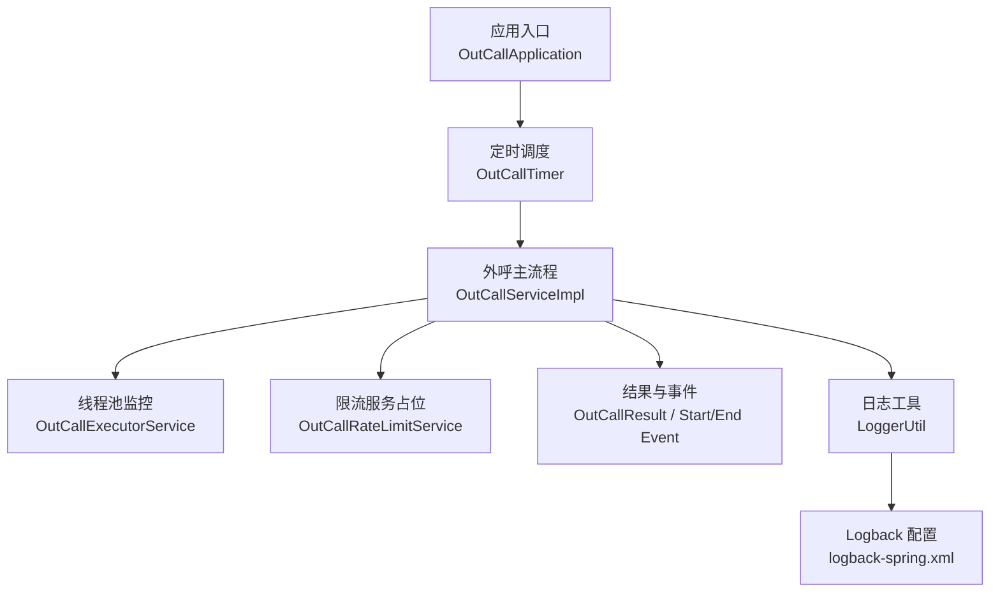
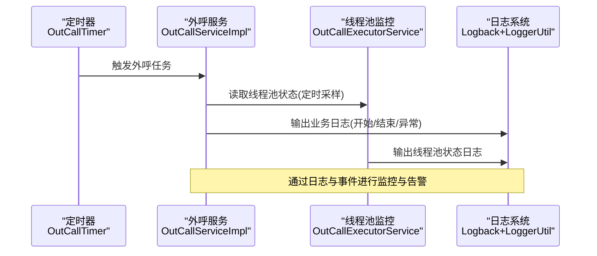
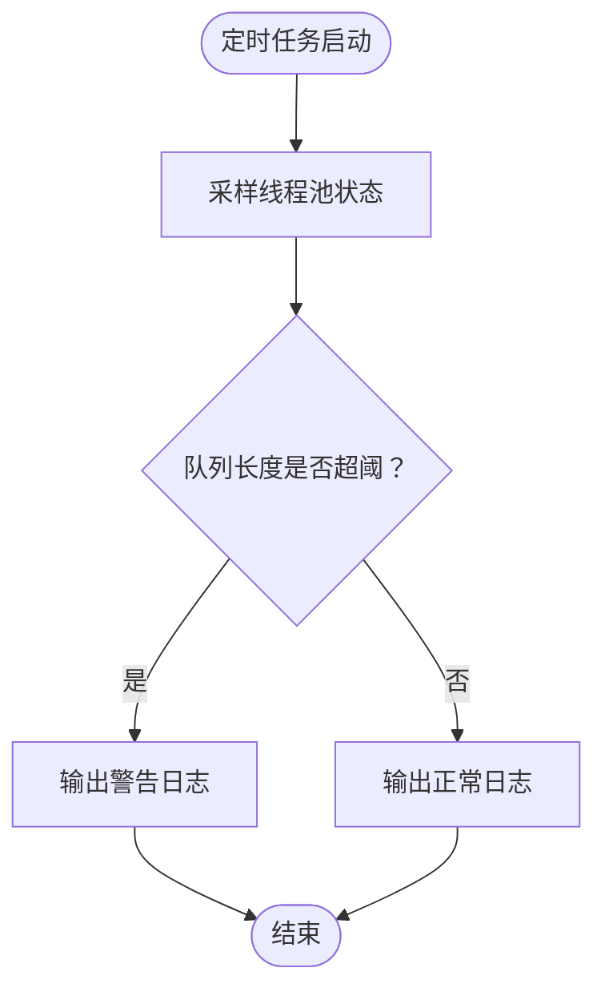
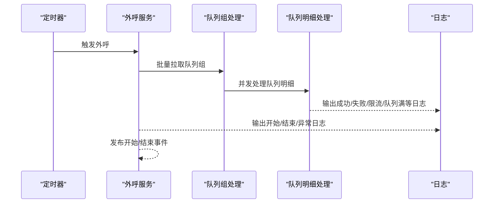
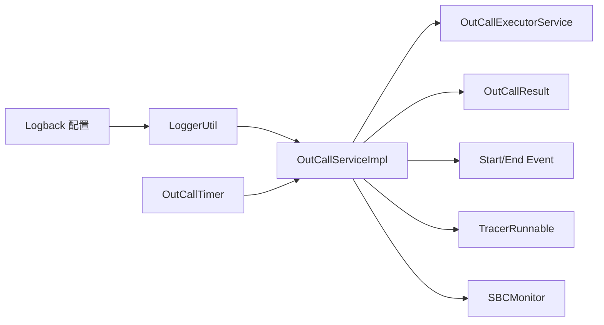

# 监控与日志

<cite>
**本文引用的文件**
- [logback-spring.xml](file://src/main/resources/logback-spring.xml)
- [application.properties](file://src/main/resources/application.properties)
- [LoggerUtil.java](file://src/main/java/org/qianye/LoggerUtil.java)
- [OutCallServiceImpl.java](file://src/main/java/org/qianye/OutCallServiceImpl.java)
- [OutCallExecutorService.java](file://src/main/java/org/qianye/OutCallExecutorService.java)
- [OutCallRateLimitService.java](file://src/main/java/org/qianye/OutCallRateLimitService.java)
- [OutCallTimer.java](file://src/main/java/org/qianye/OutCallTimer.java)
- [OutCallResult.java](file://src/main/java/org/qianye/OutCallResult.java)
- [TracerRunnable.java](file://src/main/java/org/qianye/TracerRunnable.java)
- [SBCMonitor.java](file://src/main/java/org/qianye/SBCMonitor.java)
- [pom.xml](file://pom.xml)
</cite>

## 目录
1. [简介](#简介)
2. [项目结构](#项目结构)
3. [核心组件](#核心组件)
4. [架构总览](#架构总览)
5. [详细组件分析](#详细组件分析)
6. [依赖分析](#依赖分析)
7. [性能考虑](#性能考虑)
8. [故障排查指南](#故障排查指南)
9. [结论](#结论)
10. [附录](#附录)

## 简介
本文件面向 Outcall 系统的监控与日志配置，目标如下：
- 全面说明日志系统的配置与管理，包括 Logback 配置文件结构、日志级别与输出格式定制。
- 解释关键业务指标的监控方案，如外呼成功率、队列处理速度、系统响应时间等。
- 提供性能监控指标的定义与采集方法（线程池与任务队列）。
- 说明告警机制的配置思路与通知渠道建议（基于现有日志与事件）。
- 包含日志轮转与存储策略建议。
- 提供监控仪表板搭建与可视化展示的实践建议。
- 涉及分布式追踪与链路监控的配置方法。

## 项目结构
Outcall 采用 Spring Boot 应用结构，日志与监控相关的关键位置如下：
- 日志配置：resources/logback-spring.xml
- 应用配置：resources/application.properties
- 核心业务与监控：OutCallServiceImpl、OutCallExecutorService、OutCallTimer
- 日志工具：LoggerUtil
- 结果与事件：OutCallResult、OutCallStartEvent、OutCallEndEvent
- 追踪基类：TracerRunnable
- SBC 监控：SBCMonitor
- 依赖与构建：pom.xml

图表来源
- [OutCallTimer.java](file://src/main/java/org/qianye/OutCallTimer.java#L27-L117)
- [OutCallServiceImpl.java](file://src/main/java/org/qianye/OutCallServiceImpl.java#L29-L250)
- [OutCallExecutorService.java](file://src/main/java/org/qianye/OutCallExecutorService.java#L13-L211)
- [OutCallRateLimitService.java](file://src/main/java/org/qianye/OutCallRateLimitService.java#L10-L16)
- [OutCallResult.java](file://src/main/java/org/qianye/OutCallResult.java#L1-L49)
- [LoggerUtil.java](file://src/main/java/org/qianye/LoggerUtil.java#L1-L56)
- [logback-spring.xml](file://src/main/resources/logback-spring.xml#L1-L32)

章节来源
- [logback-spring.xml](file://src/main/resources/logback-spring.xml#L1-L32)
- [application.properties](file://src/main/resources/application.properties#L1-L17)
- [OutCallTimer.java](file://src/main/java/org/qianye/OutCallTimer.java#L27-L117)
- [OutCallServiceImpl.java](file://src/main/java/org/qianye/OutCallServiceImpl.java#L29-L250)
- [OutCallExecutorService.java](file://src/main/java/org/qianye/OutCallExecutorService.java#L13-L211)
- [OutCallRateLimitService.java](file://src/main/java/org/qianye/OutCallRateLimitService.java#L10-L16)
- [OutCallResult.java](file://src/main/java/org/qianye/OutCallResult.java#L1-L49)
- [LoggerUtil.java](file://src/main/java/org/qianye/LoggerUtil.java#L1-L56)
- [pom.xml](file://pom.xml#L1-L91)

## 核心组件
- 日志系统
  - Logback 配置：控制台输出、根日志级别、输出格式。
  - 日志工具：统一 SLF4J 接口封装，支持占位符与异常输出。
- 性能监控
  - 线程池监控：定时输出各线程池活动状态与队列长度。
  - 定时任务：外呼、扫描、状态检查等周期性任务。
- 业务监控
  - 外呼结果枚举：定义失败/重试/限流等原因键值。
  - 事件发布：开始/结束事件用于统计与告警。
  - 追踪基类：可扩展链路追踪能力。
- 告警与通知
  - 基于日志级别与事件发布，结合外部监控平台实现告警。
  - SBCMonitor 提供事件上报占位，便于接入监控系统。

章节来源
- [logback-spring.xml](file://src/main/resources/logback-spring.xml#L1-L32)
- [LoggerUtil.java](file://src/main/java/org/qianye/LoggerUtil.java#L1-L56)
- [OutCallExecutorService.java](file://src/main/java/org/qianye/OutCallExecutorService.java#L60-L137)
- [OutCallTimer.java](file://src/main/java/org/qianye/OutCallTimer.java#L64-L89)
- [OutCallResult.java](file://src/main/java/org/qianye/OutCallResult.java#L1-L49)
- [TracerRunnable.java](file://src/main/java/org/qianye/TracerRunnable.java#L1-L15)
- [SBCMonitor.java](file://src/main/java/org/qianye/SBCMonitor.java#L1-L22)

## 架构总览
Outcall 的监控与日志围绕“日志输出—指标采集—告警—可视化”的闭环展开。定时任务驱动外呼流程，业务层通过统一日志工具输出关键事件；线程池监控定期采样线程池状态；结果与事件用于后续统计与告警。

图表来源
- [OutCallTimer.java](file://src/main/java/org/qianye/OutCallTimer.java#L64-L89)
- [OutCallServiceImpl.java](file://src/main/java/org/qianye/OutCallServiceImpl.java#L74-L105)
- [OutCallExecutorService.java](file://src/main/java/org/qianye/OutCallExecutorService.java#L60-L137)
- [LoggerUtil.java](file://src/main/java/org/qianye/LoggerUtil.java#L10-L54)
- [logback-spring.xml](file://src/main/resources/logback-spring.xml#L12-L31)

## 详细组件分析

### 日志系统与配置
- Logback 配置要点
  - 存储路径变量：通过属性设置日志目录。
  - 控制台输出：ConsoleAppender，PatternLayoutEncoder 定义输出格式。
  - 根日志级别：当前为 INFO。
- 日志工具
  - LoggerUtil 封装 info/error/warn，按级别判断后输出，支持占位符与异常堆栈。
- 输出格式建议
  - 可增加上下文字段（如租户、任务码、分组码），便于检索与聚合。
  - 建议区分业务日志与线程池监控日志，便于分类存储与告警。

章节来源
- [logback-spring.xml](file://src/main/resources/logback-spring.xml#L1-L32)
- [LoggerUtil.java](file://src/main/java/org/qianye/LoggerUtil.java#L1-L56)

### 线程池监控与性能指标
- 监控内容
  - 活动线程数、线程池大小、核心/最大线程数、完成任务数、队列长度。
- 采集频率
  - 每 10 秒定时输出一次，便于观察短期波动。
- 指标意义
  - 队列长度持续增长可能预示线程池过小或下游阻塞。
  - 活跃线程接近最大线程数可能触发拒绝策略。

图表来源
- [OutCallExecutorService.java](file://src/main/java/org/qianye/OutCallExecutorService.java#L60-L137)

章节来源
- [OutCallExecutorService.java](file://src/main/java/org/qianye/OutCallExecutorService.java#L13-L211)

### 外呼流程与关键事件
- 外呼主流程
  - 分页查询进行中任务，异步提交至线程池执行。
  - 限流等待、状态校验、队列过滤、异步处理队列。
  - 成功/失败/限流/队列满/线程池满等场景均有日志输出。
- 事件发布
  - 开始/结束事件用于统计与告警。
- 结果枚举
  - 定义失败/重试/限流/队列限制/线程池满等键值，便于日志解析与统计。

图表来源
- [OutCallTimer.java](file://src/main/java/org/qianye/OutCallTimer.java#L64-L89)
- [OutCallServiceImpl.java](file://src/main/java/org/qianye/OutCallServiceImpl.java#L74-L250)
- [OutCallResult.java](file://src/main/java/org/qianye/OutCallResult.java#L8-L24)

章节来源
- [OutCallServiceImpl.java](file://src/main/java/org/qianye/OutCallServiceImpl.java#L74-L250)
- [OutCallResult.java](file://src/main/java/org/qianye/OutCallResult.java#L1-L49)
- [OutCallStartEvent.java](file://src/main/java/org/qianye/OutCallStartEvent.java#L1-L11)
- [OutCallEndEvent.java](file://src/main/java/org/qianye/OutCallEndEvent.java#L1-L11)

### 限流服务与告警
- 限流服务
  - 当前为占位实现，需根据业务规则完善。
- 告警建议
  - 基于日志关键字（如限流、队列满、线程池满）与事件发布进行告警。
  - 可结合外部监控平台（如 Prometheus/Grafana 或云监控）实现阈值告警与通知。

章节来源
- [OutCallRateLimitService.java](file://src/main/java/org/qianye/OutCallRateLimitService.java#L10-L16)
- [OutCallServiceImpl.java](file://src/main/java/org/qianye/OutCallServiceImpl.java#L469-L484)

### 追踪与链路监控
- 追踪基类
  - TracerRunnable 提供可扩展的 Runnable 基类，便于注入 Trace 上下文。
- 建议
  - 在异步任务与线程池执行的任务中使用 TracerRunnable，统一埋点。
  - 结合外部链路追踪系统（如 SkyWalking、OpenTelemetry）实现端到端链路监控。

章节来源
- [TracerRunnable.java](file://src/main/java/org/qianye/TracerRunnable.java#L1-L15)
- [OutCallServiceImpl.java](file://src/main/java/org/qianye/OutCallServiceImpl.java#L401-L407)

### SBC 监控
- SBCMonitor 提供事件上报占位，可用于定时任务事件的在线/离线状态记录。
- 建议
  - 将事件上报接入监控平台，实现服务健康度可视化。

章节来源
- [SBCMonitor.java](file://src/main/java/org/qianye/SBCMonitor.java#L1-L22)

## 依赖分析
- 日志与配置
  - Logback 控制台输出与根级别。
  - LoggerUtil 统一日志接口。
- 业务与监控
  - OutCallServiceImpl 负责外呼主流程与日志输出。
  - OutCallExecutorService 提供线程池监控与销毁。
  - OutCallTimer 提供定时任务与线程池执行器。
- 结果与事件
  - OutCallResult 定义结果键值。
  - OutCallStartEvent/OutCallEndEvent 用于统计与告警。
- 追踪与监控
  - TracerRunnable 为链路追踪提供基类。
  - SBCMonitor 为事件上报预留扩展点。

图表来源
- [logback-spring.xml](file://src/main/resources/logback-spring.xml#L1-L32)
- [LoggerUtil.java](file://src/main/java/org/qianye/LoggerUtil.java#L1-L56)
- [OutCallServiceImpl.java](file://src/main/java/org/qianye/OutCallServiceImpl.java#L29-L250)
- [OutCallExecutorService.java](file://src/main/java/org/qianye/OutCallExecutorService.java#L13-L211)
- [OutCallTimer.java](file://src/main/java/org/qianye/OutCallTimer.java#L27-L117)
- [OutCallResult.java](file://src/main/java/org/qianye/OutCallResult.java#L1-L49)
- [TracerRunnable.java](file://src/main/java/org/qianye/TracerRunnable.java#L1-L15)
- [SBCMonitor.java](file://src/main/java/org/qianye/SBCMonitor.java#L1-L22)

章节来源
- [pom.xml](file://pom.xml#L24-L81)

## 性能考虑
- 线程池配置
  - 各线程池容量与队列长度已内建，建议结合实际负载调整。
  - 监控队列长度与拒绝策略触发频率，动态优化。
- IO 与数据库
  - MyBatis 日志已开启标准输出，建议在生产关闭或重定向。
- 定时任务抖动
  - 定时器内置随机延迟，降低并发峰值。

章节来源
- [OutCallExecutorService.java](file://src/main/java/org/qianye/OutCallExecutorService.java#L15-L51)
- [OutCallTimer.java](file://src/main/java/org/qianye/OutCallTimer.java#L50-L59)
- [application.properties](file://src/main/resources/application.properties#L14-L16)

## 故障排查指南
- 常见问题定位
  - 限流/队列满/线程池满：查看对应日志关键字与 OutCallResult 键值。
  - 异常堆栈：使用 LoggerUtil 的异常重载输出。
  - 线程池异常：关注线程池监控日志与拒绝策略行为。
- 建议操作
  - 提升日志级别以快速复现问题。
  - 对关键路径增加埋点与耗时日志。
  - 结合事件与日志进行关联分析。

章节来源
- [OutCallResult.java](file://src/main/java/org/qianye/OutCallResult.java#L8-L24)
- [LoggerUtil.java](file://src/main/java/org/qianye/LoggerUtil.java#L28-L42)
- [OutCallExecutorService.java](file://src/main/java/org/qianye/OutCallExecutorService.java#L131-L135)

## 结论
- 日志体系：Logback 控制台输出与 LoggerUtil 统一封装，满足基本可观测性需求。
- 性能监控：线程池监控与定时任务为系统健康提供了基础指标。
- 告警与可视化：建议结合日志关键字与事件发布接入外部监控平台，实现阈值告警与仪表板展示。
- 追踪与扩展：通过 TracerRunnable 与 SBCMonitor 为链路追踪与事件上报提供扩展点。

## 附录

### 日志级别与输出格式建议
- 日志级别
  - 开发：DEBUG/INFO
  - 测试/生产：INFO/WARN/ERROR
- 输出格式
  - 增加上下文字段（租户、实例、任务码、分组码、队列码）。
  - 统一异常输出格式，确保最后一个 Throwable 参数被识别。

章节来源
- [logback-spring.xml](file://src/main/resources/logback-spring.xml#L16-L26)
- [LoggerUtil.java](file://src/main/java/org/qianye/LoggerUtil.java#L10-L54)

### 关键业务指标定义与采集
- 外呼成功率
  - 计算：成功次数 / 总调用次数。可从日志中解析 OutCallResult.success 字段。
- 队列处理速度
  - 计算：单位时间完成队列数。可从“完成队列”日志中统计。
- 系统响应时间
  - 计算：任务开始到结束的时间差。可从开始/结束事件与日志时间戳计算。

章节来源
- [OutCallResult.java](file://src/main/java/org/qianye/OutCallResult.java#L31-L44)
- [OutCallStartEvent.java](file://src/main/java/org/qianye/OutCallStartEvent.java#L1-L11)
- [OutCallEndEvent.java](file://src/main/java/org/qianye/OutCallEndEvent.java#L1-L11)

### 告警机制与通知渠道
- 告警维度
  - 线程池队列超长、限流触发频繁、异常日志占比上升、事件缺失。
- 通知渠道
  - 邮件/IM/电话，结合阈值与收敛策略。

章节来源
- [OutCallExecutorService.java](file://src/main/java/org/qianye/OutCallExecutorService.java#L66-L137)
- [OutCallServiceImpl.java](file://src/main/java/org/qianye/OutCallServiceImpl.java#L469-L484)

### 日志轮转与存储策略
- 建议
  - 使用 Logback 的 RollingFileAppender 进行按天/按大小轮转。
  - 设置保留周期与压缩策略，避免磁盘占用过高。
  - 将日志输出到独立挂载点，保障稳定性。

章节来源
- [logback-spring.xml](file://src/main/resources/logback-spring.xml#L6-L31)

### 监控仪表板搭建与可视化
- 指标来源
  - 线程池监控日志、业务日志、事件发布。
- 展示建议
  - 活动线程数、队列长度、错误率、吞吐量、P95/P99 延迟。
  - 告警看板与历史趋势图。

章节来源
- [OutCallExecutorService.java](file://src/main/java/org/qianye/OutCallExecutorService.java#L66-L137)
- [OutCallTimer.java](file://src/main/java/org/qianye/OutCallTimer.java#L64-L89)

### 分布式追踪与链路监控
- 配置方法
  - 在异步任务与线程池执行的任务中使用 TracerRunnable 注入 Trace 上下文。
  - 结合外部链路追踪系统实现跨进程链路追踪与调用拓扑展示。

章节来源
- [TracerRunnable.java](file://src/main/java/org/qianye/TracerRunnable.java#L1-L15)
- [OutCallServiceImpl.java](file://src/main/java/org/qianye/OutCallServiceImpl.java#L401-L407)