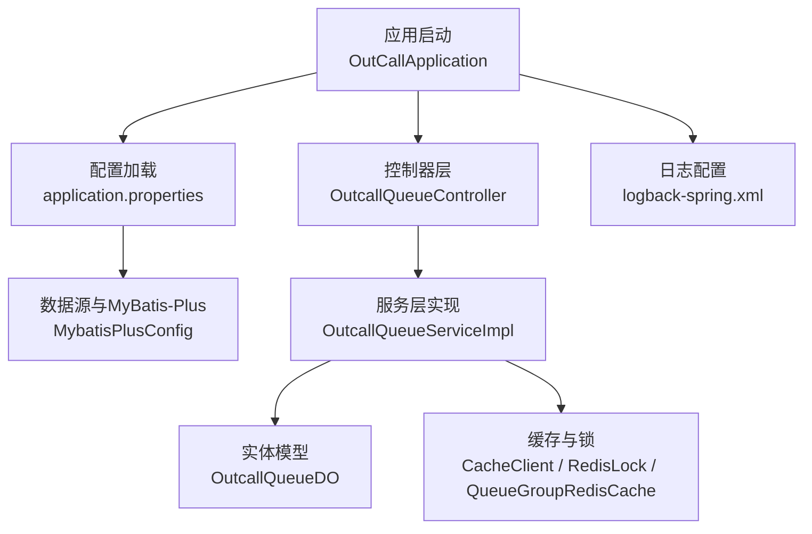
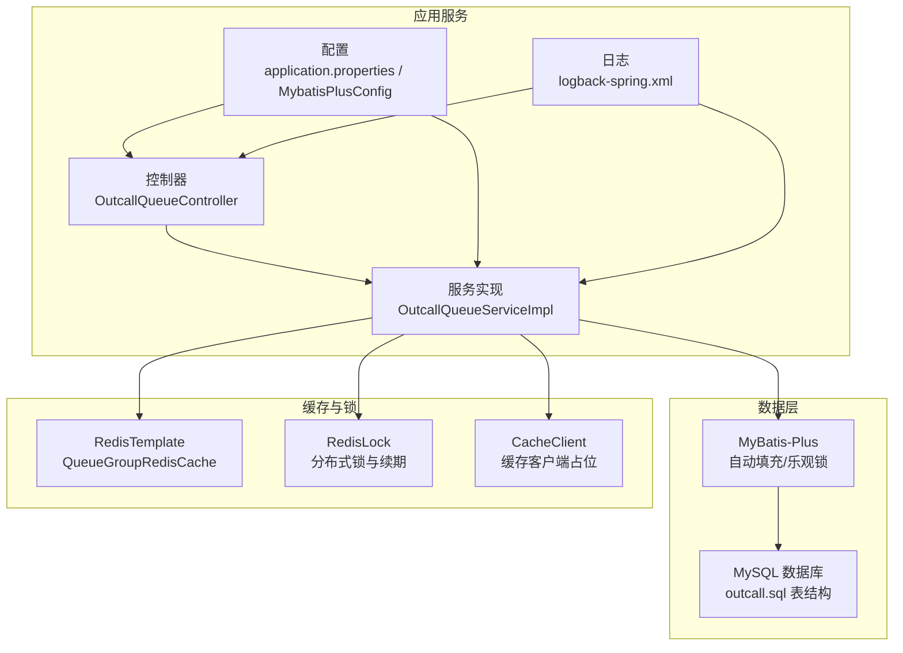
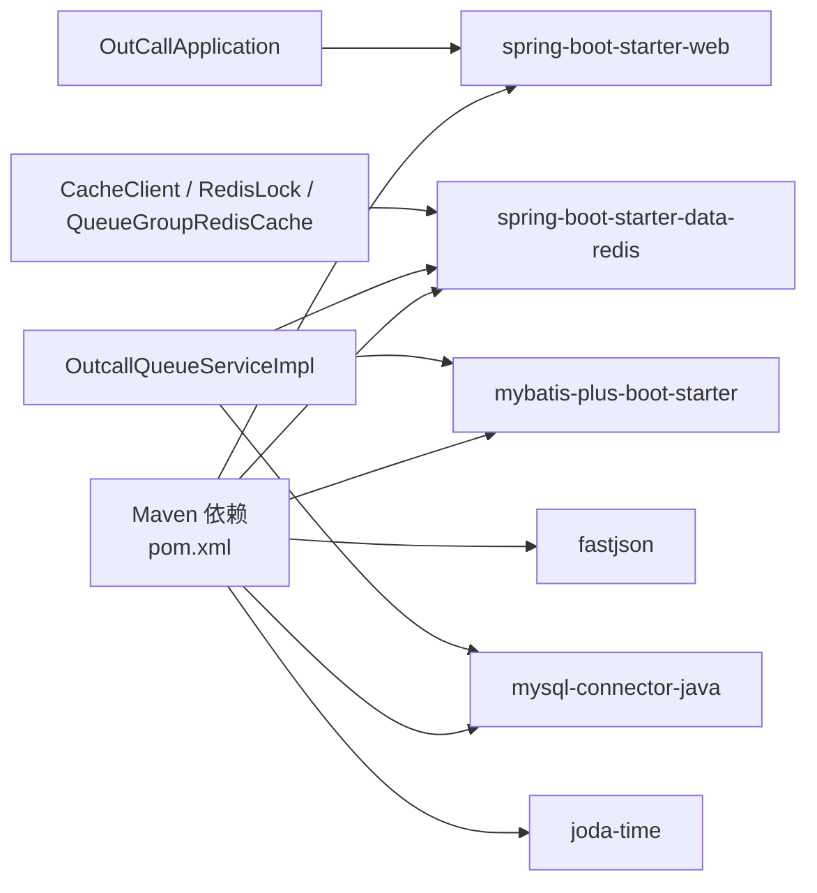

# 部署与运维

<cite>
**本文引用的文件**
- [pom.xml](file://pom.xml)
- [application.properties](file://src/main/resources/application.properties)
- [logback-spring.xml](file://src/main/resources/logback-spring.xml)
- [outcall.sql](file://src/main/resources/outcall.sql)
- [OutCallApplication.java](file://src/main/java/org/qianye/OutCallApplication.java)
- [MybatisPlusConfig.java](file://src/main/java/org/qianye/config/MybatisPlusConfig.java)
- [OutcallQueueController.java](file://src/main/java/org/qianye/controller/OutcallQueueController.java)
- [OutcallQueueServiceImpl.java](file://src/main/java/org/qianye/service/impl/OutcallQueueServiceImpl.java)
- [OutcallQueueDO.java](file://src/main/java/org/qianye/entity/OutcallQueueDO.java)
- [CacheClient.java](file://src/main/java/org/qianye/CacheClient.java)
- [RedisLock.java](file://src/main/java/org/qianye/RedisLock.java)
- [QueueGroupRedisCache.java](file://src/main/java/org/qianye/QueueGroupRedisCache.java)
- [OutCallExecutorService.java](file://src/main/java/org/qianye/OutCallExecutorService.java)
- [OutCallScheduleDrm.java](file://src/main/java/org/qianye/OutCallScheduleDrm.java)
- [RemoteFsApi.java](file://src/main/java/org/qianye/RemoteFsApi.java)
- [SlsEventLogQuery.java](file://src/main/java/org/qianye/SlsEventLogQuery.java)
</cite>

## 目录
1. [简介](#简介)
2. [项目结构](#项目结构)
3. [核心组件](#核心组件)
4. [架构总览](#架构总览)
5. [详细组件分析](#详细组件分析)
6. [依赖关系分析](#依赖关系分析)
7. [性能考虑](#性能考虑)
8. [故障排查指南](#故障排查指南)
9. [结论](#结论)
10. [附录](#附录)

## 简介
本文件面向 Outcall 系统的部署与运维团队，提供从环境准备、数据库初始化、应用打包与启动、缓存与集群配置、容器化与 Kubernetes 部署、监控与日志、性能调优与容量规划、备份恢复与灾备，到运维自动化与 CI/CD 的完整实践指南。内容基于仓库现有配置与源码进行提炼，确保可操作性与可追溯性。

## 项目结构
Outcall 采用 Spring Boot 应用结构，核心模块与职责如下：
- 启动入口：应用通过 Spring Boot 启动类加载上下文
- 配置层：application.properties 提供数据源、MyBatis-Plus 等配置；logback-spring.xml 控制日志输出
- 数据访问：MyBatis-Plus 配置与自动填充；实体类映射数据库表
- 业务层：队列与任务相关服务实现，包含状态检查、通话记录联动、重试策略等
- 控制器层：REST API 对外暴露队列管理接口
- 缓存与分布式锁：Redis 相关组件，支持队列组缓存与锁续期
- 日志与监控：内置日志配置与线程池监控

图表来源
- [OutCallApplication.java](file://src/main/java/org/qianye/OutCallApplication.java#L1-L13)
- [application.properties](file://src/main/resources/application.properties#L1-L17)
- [MybatisPlusConfig.java](file://src/main/java/org/qianye/config/MybatisPlusConfig.java#L1-L49)
- [OutcallQueueController.java](file://src/main/java/org/qianye/controller/OutcallQueueController.java#L1-L71)
- [OutcallQueueServiceImpl.java](file://src/main/java/org/qianye/service/impl/OutcallQueueServiceImpl.java#L1-L800)
- [OutcallQueueDO.java](file://src/main/java/org/qianye/entity/OutcallQueueDO.java#L1-L105)
- [CacheClient.java](file://src/main/java/org/qianye/CacheClient.java#L1-L25)
- [RedisLock.java](file://src/main/java/org/qianye/RedisLock.java#L1-L207)
- [QueueGroupRedisCache.java](file://src/main/java/org/qianye/QueueGroupRedisCache.java#L1-L92)
- [logback-spring.xml](file://src/main/resources/logback-spring.xml#L1-L32)

章节来源
- [OutCallApplication.java](file://src/main/java/org/qianye/OutCallApplication.java#L1-L13)
- [application.properties](file://src/main/resources/application.properties#L1-L17)
- [MybatisPlusConfig.java](file://src/main/java/org/qianye/config/MybatisPlusConfig.java#L1-L49)
- [logback-spring.xml](file://src/main/resources/logback-spring.xml#L1-L32)

## 核心组件
- 应用启动与打包
  - 使用 Spring Boot Maven 插件进行打包，产物为可执行 JAR
  - 启动类负责引导 Spring 上下文
- 数据库与 ORM
  - 数据源配置在 application.properties 中
  - MyBatis-Plus 提供分页与乐观锁插件，MetaObjectHandler 自动填充时间字段
- 控制器与服务
  - REST 控制器提供队列增删改查与分页查询
  - 服务层实现状态检查、通话记录联动、批量查询与状态更新
- 缓存与锁
  - CacheClient 作为缓存客户端占位，RedisLock 提供分布式锁与续期
  - QueueGroupRedisCache 提供队列组的 Redis 缓存能力与 Lua 脚本封装
- 日志
  - logback-spring.xml 输出到控制台，默认 INFO 级别

章节来源
- [pom.xml](file://pom.xml#L82-L89)
- [OutCallApplication.java](file://src/main/java/org/qianye/OutCallApplication.java#L1-L13)
- [application.properties](file://src/main/resources/application.properties#L1-L17)
- [MybatisPlusConfig.java](file://src/main/java/org/qianye/config/MybatisPlusConfig.java#L1-L49)
- [OutcallQueueController.java](file://src/main/java/org/qianye/controller/OutcallQueueController.java#L1-L71)
- [OutcallQueueServiceImpl.java](file://src/main/java/org/qianye/service/impl/OutcallQueueServiceImpl.java#L1-L800)
- [CacheClient.java](file://src/main/java/org/qianye/CacheClient.java#L1-L25)
- [RedisLock.java](file://src/main/java/org/qianye/RedisLock.java#L1-L207)
- [QueueGroupRedisCache.java](file://src/main/java/org/qianye/QueueGroupRedisCache.java#L1-L92)
- [logback-spring.xml](file://src/main/resources/logback-spring.xml#L1-L32)

## 架构总览
Outcall 的运行时架构围绕“应用服务 + 数据库 + 缓存”展开，控制器接收请求后调用服务层，服务层通过实体与 Mapper 访问数据库，并利用 Redis 缓存与锁提升并发与一致性。

图表来源
- [OutcallQueueController.java](file://src/main/java/org/qianye/controller/OutcallQueueController.java#L1-L71)
- [OutcallQueueServiceImpl.java](file://src/main/java/org/qianye/service/impl/OutcallQueueServiceImpl.java#L1-L800)
- [application.properties](file://src/main/resources/application.properties#L1-L17)
- [MybatisPlusConfig.java](file://src/main/java/org/qianye/config/MybatisPlusConfig.java#L1-L49)
- [outcall.sql](file://src/main/resources/outcall.sql#L1-L218)
- [QueueGroupRedisCache.java](file://src/main/java/org/qianye/QueueGroupRedisCache.java#L1-L92)
- [RedisLock.java](file://src/main/java/org/qianye/RedisLock.java#L1-L207)
- [CacheClient.java](file://src/main/java/org/qianye/CacheClient.java#L1-L25)
- [logback-spring.xml](file://src/main/resources/logback-spring.xml#L1-L32)

## 详细组件分析

### 数据库初始化与表结构
- 初始化步骤
  - 准备 MySQL 8.0+ 环境，创建数据库与账号
  - 执行 outcall.sql 中的建表语句，创建队列、队列组、任务、任务规则、择时信息等表
  - 确保索引与表注释按 SQL 文件定义
- 表结构要点
  - 队列表与队列组表包含实例标识、环境标识、任务/组编码、状态、扩展信息等字段
  - 任务与任务规则表包含规则明细、生效/失效时间、环境标志等
  - 择时信息表记录手机号、时间段、来源与标签等
- 初始数据建议
  - 根据业务需要导入初始任务与规则数据
  - 队列数据可通过控制器接口批量导入或通过批处理脚本写入

章节来源
- [outcall.sql](file://src/main/resources/outcall.sql#L1-L218)
- [application.properties](file://src/main/resources/application.properties#L6-L16)

### 应用部署流程
- 环境准备
  - JDK 8（项目属性指定）
  - MySQL 8.0+（驱动与连接器已声明）
  - Redis（用于队列组缓存与分布式锁）
- 构建与打包
  - 使用 Maven 插件生成可执行 JAR
- 配置文件设置
  - application.properties 中设置数据源 URL、用户名、密码
  - 可根据环境切换 env 参数
- 启动方法
  - 通过 Java 命令运行 JAR 包，或结合 systemd/docker 管理进程
- API 验证
  - 通过控制器接口验证队列的增删改查与分页查询功能

章节来源
- [pom.xml](file://pom.xml#L18-L22)
- [application.properties](file://src/main/resources/application.properties#L1-L17)
- [OutCallApplication.java](file://src/main/java/org/qianye/OutCallApplication.java#L1-L13)
- [OutcallQueueController.java](file://src/main/java/org/qianye/controller/OutcallQueueController.java#L1-L71)

### 缓存配置与集群部署
- 缓存配置
  - RedisTemplate 已在 QueueGroupRedisCache 中初始化，使用字符串与 JSON 序列化
  - RedisLock 提供分布式锁与续期线程池，注意锁过期时间与续期阈值
  - CacheClient 为缓存客户端占位，需按生产需求完善 Redis 操作
- 集群部署建议
  - 多实例部署时，确保 Redis 集群可用且网络延迟低
  - 通过环境标识区分实例与环境，避免跨环境数据污染
  - 使用负载均衡对外提供 API 服务

章节来源
- [QueueGroupRedisCache.java](file://src/main/java/org/qianye/QueueGroupRedisCache.java#L1-L92)
- [RedisLock.java](file://src/main/java/org/qianye/RedisLock.java#L1-L207)
- [CacheClient.java](file://src/main/java/org/qianye/CacheClient.java#L1-L25)
- [application.properties](file://src/main/resources/application.properties#L3-L4)

### 容器化与 Kubernetes 部署
- 容器镜像建议
  - 基于官方 JRE 镜像，复制构建产物至镜像内
  - 暴露应用端口，挂载日志目录
- Kubernetes 清单建议
  - Deployment：副本数、资源限制、健康检查探针
  - Service：ClusterIP 或 LoadBalancer
  - ConfigMap：挂载 application.properties
  - Secret：数据库与 Redis 访问凭据
  - PVC：持久化日志目录（如需）

说明：本节为通用实践建议，未直接对应具体清单文件，部署时请结合企业规范补充。

### 监控与日志收集
- 日志配置
  - logback-spring.xml 将日志输出到控制台，默认 INFO 级别
  - 建议在生产环境接入集中式日志系统（如 ELK/云日志服务）
- 运行时监控
  - OutCallExecutorService 内置线程池状态日志，便于观察任务执行情况
  - RedisLock 提供锁续期线程池状态，建议纳入监控告警

章节来源
- [logback-spring.xml](file://src/main/resources/logback-spring.xml#L1-L32)
- [OutCallExecutorService.java](file://src/main/java/org/qianye/OutCallExecutorService.java#L115-L171)
- [RedisLock.java](file://src/main/java/org/qianye/RedisLock.java#L131-L147)

### 性能调优与容量规划
- 数据库层面
  - 根据 outcall.sql 中索引设计，确保高频查询命中索引
  - 控制单次查询范围，避免大 IN 列表（服务层已按批次处理）
- 缓存层面
  - 合理设置队列组缓存过期时间与上限值
  - 使用 Lua 脚本减少多步操作的往返开销
- 并发与线程池
  - 结合业务峰值评估线程池大小与队列长度
  - 监控线程池活跃度与排队长度，防止阻塞
- 容量规划
  - 基于队列规模、任务并发度与 Redis 峰值 QPS 估算资源
  - 预留扩容空间，关注 GC 与内存占用

章节来源
- [OutcallQueueServiceImpl.java](file://src/main/java/org/qianye/service/impl/OutcallQueueServiceImpl.java#L666-L714)
- [QueueGroupRedisCache.java](file://src/main/java/org/qianye/QueueGroupRedisCache.java#L1-L92)
- [OutCallScheduleDrm.java](file://src/main/java/org/qianye/OutCallScheduleDrm.java#L70-L112)
- [OutCallExecutorService.java](file://src/main/java/org/qianye/OutCallExecutorService.java#L115-L171)

### 备份恢复与灾难恢复
- 数据库备份
  - 建议使用物理或逻辑备份策略，定期校验恢复流程
  - 针对队列与任务表制定差异备份计划
- 缓存数据
  - Redis 集群需开启持久化与快照策略
  - 失效时间较长的缓存需有兜底机制
- 灾难恢复
  - 明确 RPO/RTO 指标，演练跨机房/跨地域恢复
  - 验证应用与缓存双栈恢复后的数据一致性

说明：本节为通用运维实践，未直接引用具体源码。

### 运维自动化与 CI/CD
- 构建与测试
  - 使用 Maven 插件进行打包与测试
- 部署自动化
  - 通过流水线将构建产物推送至制品库，再交付到目标环境
- 配置管理
  - 将敏感配置放入密钥管理服务，非敏感配置放入配置中心
- 发布策略
  - 采用蓝绿/金丝雀发布，结合健康检查与回滚策略

说明：本节为通用实践建议，未直接引用具体源码。

## 依赖关系分析
- 外部依赖
  - Spring Boot Web、Redis、MyBatis-Plus、MySQL Connector/J、Fastjson、Joda-Time
- 内部耦合
  - 控制器依赖服务层；服务层依赖实体与 Mapper；缓存组件依赖 RedisTemplate
- 潜在风险
  - 分页插件暂未启用，需在依赖兼容后评估启用
  - 缓存客户端与锁实现为占位，需补齐 Redis 操作

图表来源
- [pom.xml](file://pom.xml#L24-L81)
- [OutCallApplication.java](file://src/main/java/org/qianye/OutCallApplication.java#L1-L13)
- [OutcallQueueServiceImpl.java](file://src/main/java/org/qianye/service/impl/OutcallQueueServiceImpl.java#L1-L800)
- [CacheClient.java](file://src/main/java/org/qianye/CacheClient.java#L1-L25)
- [RedisLock.java](file://src/main/java/org/qianye/RedisLock.java#L1-L207)
- [QueueGroupRedisCache.java](file://src/main/java/org/qianye/QueueGroupRedisCache.java#L1-L92)

章节来源
- [pom.xml](file://pom.xml#L24-L81)

## 性能考虑
- 查询优化
  - 服务层对大 IN 列表采用分批处理，降低 SQL 开销
  - 使用索引字段进行条件过滤，避免全表扫描
- 缓存策略
  - 队列组缓存使用 Lua 脚本原子化操作，减少往返
  - 合理设置过期时间与上限，避免缓存雪崩
- 并发控制
  - RedisLock 提供续期保障，避免锁过期导致的竞态
  - 线程池监控有助于发现瓶颈与积压

章节来源
- [OutcallQueueServiceImpl.java](file://src/main/java/org/qianye/service/impl/OutcallQueueServiceImpl.java#L666-L714)
- [QueueGroupRedisCache.java](file://src/main/java/org/qianye/QueueGroupRedisCache.java#L55-L78)
- [RedisLock.java](file://src/main/java/org/qianye/RedisLock.java#L131-L147)
- [OutCallExecutorService.java](file://src/main/java/org/qianye/OutCallExecutorService.java#L115-L171)

## 故障排查指南
- 启动失败
  - 检查 application.properties 中数据库连接参数与 Redis 可达性
  - 查看 logback 输出的日志级别与路径
- 数据库异常
  - 核对 outcall.sql 是否完整执行
  - 检查索引与字符集设置是否一致
- 缓存问题
  - 确认 RedisTemplate 序列化配置与脚本加载
  - 关注锁续期线程池状态与锁过期时间
- 线程池积压
  - 查看线程池监控日志，评估任务耗时与并发度

章节来源
- [application.properties](file://src/main/resources/application.properties#L1-L17)
- [logback-spring.xml](file://src/main/resources/logback-spring.xml#L1-L32)
- [outcall.sql](file://src/main/resources/outcall.sql#L1-L218)
- [RedisLock.java](file://src/main/java/org/qianye/RedisLock.java#L131-L147)
- [OutCallExecutorService.java](file://src/main/java/org/qianye/OutCallExecutorService.java#L115-L171)

## 结论
本文基于仓库现有配置与源码，给出了 Outcall 系统的部署与运维全景实践。建议在生产环境中进一步完善缓存与锁的具体实现、接入集中式日志与监控、制定数据库与缓存的备份恢复策略，并通过 CI/CD 流水线实现自动化交付。同时，结合容量规划与性能调优，确保系统在高并发场景下的稳定性与可维护性。

## 附录
- API 示例（基于控制器）
  - 新增队列：POST /api/v1/outcall-queue
  - 删除队列：DELETE /api/v1/outcall-queue/{id}
  - 更新队列：PUT /api/v1/outcall-queue
  - 查询队列：GET /api/v1/outcall-queue/query
  - 分页查询：GET /api/v1/outcall-queue/page
  - 更新状态：PUT /api/v1/outcall-queue/status

章节来源
- [OutcallQueueController.java](file://src/main/java/org/qianye/controller/OutcallQueueController.java#L26-L70)