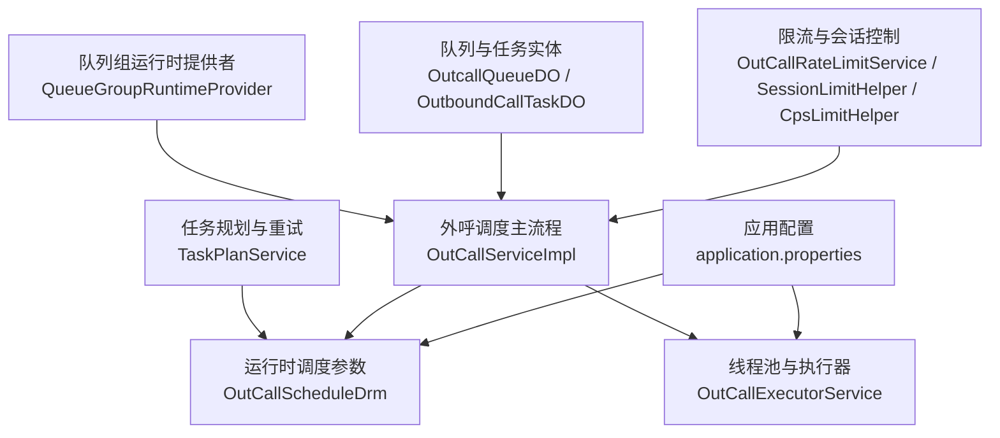
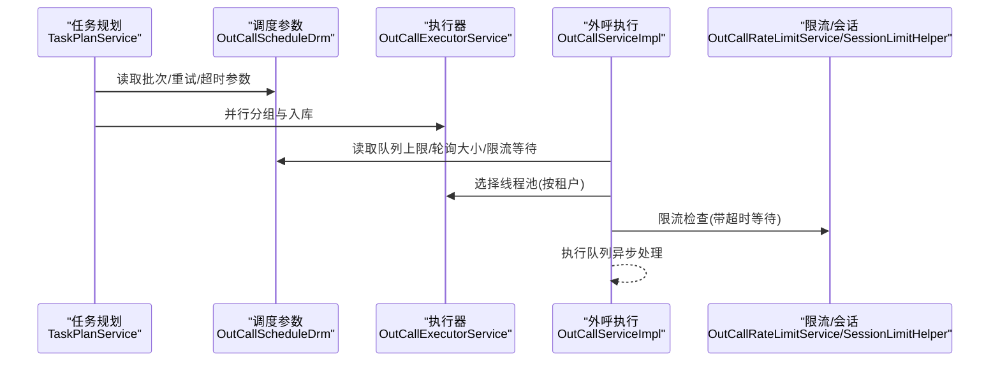
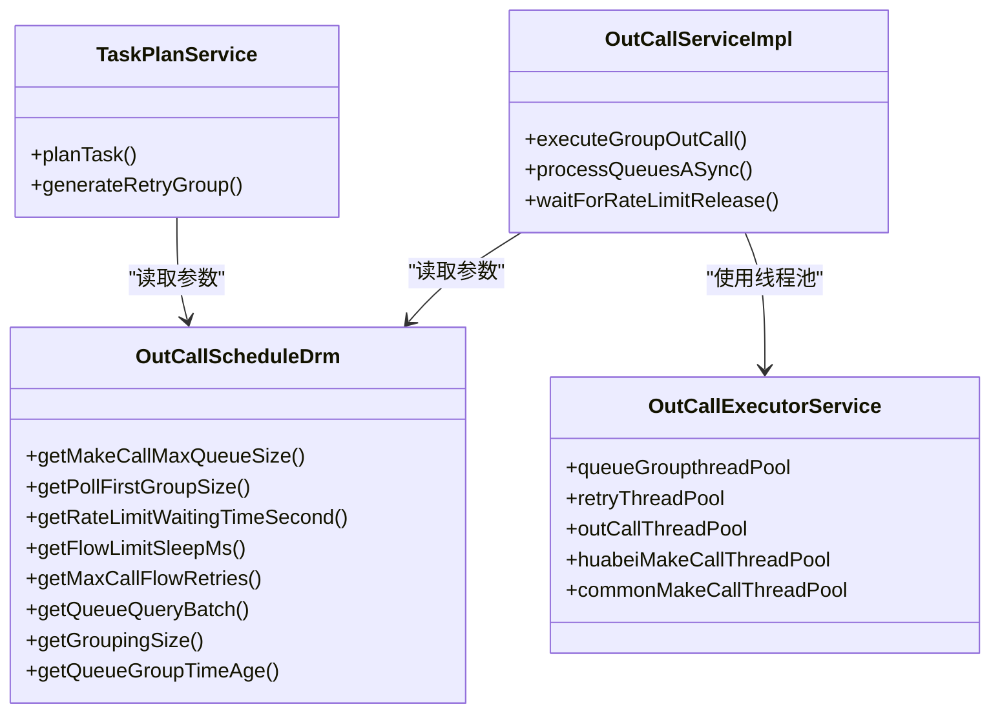

# 业务配置

<cite>
**本文引用的文件**
- [application.properties](file://src/main/resources/application.properties)
- [OutCallServiceImpl.java](file://src/main/java/org/qianye/OutCallServiceImpl.java)
- [OutCallExecutorService.java](file://src/main/java/org/qianye/OutCallExecutorService.java)
- [OutCallScheduleDrm.java](file://src/main/java/org/qianye/OutCallScheduleDrm.java)
- [TaskPlanService.java](file://src/main/java/org/qianye/TaskPlanService.java)
- [OutCallRateLimitService.java](file://src/main/java/org/qianye/OutCallRateLimitService.java)
- [CpsLimitHelper.java](file://src/main/java/org/qianye/CpsLimitHelper.java)
- [SessionLimitHelper.java](file://src/main/java/org/qianye/SessionLimitHelper.java)
- [ScheduleConstants.java](file://src/main/java/org/qianye/ScheduleConstants.java)
- [CommonConstants.java](file://src/main/java/org/qianye/CommonConstants.java)
- [OutboundCallTaskDO.java](file://src/main/java/org/qianye/entity/OutboundCallTaskDO.java)
- [OutcallQueueDO.java](file://src/main/java/org/qianye/entity/OutcallQueueDO.java)
- [QueueGroupRuntimeProvider.java](file://src/main/java/org/qianye/QueueGroupRuntimeProvider.java)
</cite>

## 目录
1. [简介](#简介)
2. [项目结构与配置入口](#项目结构与配置入口)
3. [核心业务配置总览](#核心业务配置总览)
4. [架构概览与配置交互](#架构概览与配置交互)
5. [详细配置项解析](#详细配置项解析)
6. [依赖关系与耦合分析](#依赖关系与耦合分析)
7. [性能影响与调优建议](#性能影响与调优建议)
8. [故障排查与常见问题](#故障排查与常见问题)
9. [结论](#结论)
10. [附录：配置示例与最佳实践](#附录配置示例与最佳实践)

## 简介
本文件面向业务与运维工程师，系统性梳理 Outcall 外呼系统的业务配置，覆盖调度常量、时间窗口、限流参数、线程池与队列管理、重试与超时策略、以及动态生效与热更新机制。文档以代码为依据，结合流程图与类图，帮助读者快速理解并正确配置系统，以满足不同业务场景下的性能与稳定性需求。

## 项目结构与配置入口
- 配置集中于 Java 类与配置文件中：
  - 线程池与调度参数：通过组件类统一提供
  - 运行环境与数据源：通过配置文件集中管理
  - 业务常量与键名：通过常量类统一维护

图表来源
- [application.properties](file://src/main/resources/application.properties#L1-L17)
- [OutCallScheduleDrm.java](file://src/main/java/org/qianye/OutCallScheduleDrm.java#L1-L113)
- [OutCallExecutorService.java](file://src/main/java/org/qianye/OutCallExecutorService.java#L1-L211)
- [OutCallServiceImpl.java](file://src/main/java/org/qianye/OutCallServiceImpl.java#L1-L1191)
- [TaskPlanService.java](file://src/main/java/org/qianye/TaskPlanService.java#L1-L1112)
- [OutCallRateLimitService.java](file://src/main/java/org/qianye/OutCallRateLimitService.java#L1-L17)
- [SessionLimitHelper.java](file://src/main/java/org/qianye/SessionLimitHelper.java#L1-L29)
- [CpsLimitHelper.java](file://src/main/java/org/qianye/CpsLimitHelper.java#L1-L11)
- [OutcallQueueDO.java](file://src/main/java/org/qianye/entity/OutcallQueueDO.java#L1-L105)
- [OutboundCallTaskDO.java](file://src/main/java/org/qianye/entity/OutboundCallTaskDO.java#L1-L96)
- [QueueGroupRuntimeProvider.java](file://src/main/java/org/qianye/QueueGroupRuntimeProvider.java#L1-L19)

章节来源
- [application.properties](file://src/main/resources/application.properties#L1-L17)
- [OutCallScheduleDrm.java](file://src/main/java/org/qianye/OutCallScheduleDrm.java#L1-L113)
- [OutCallExecutorService.java](file://src/main/java/org/qianye/OutCallExecutorService.java#L1-L211)
- [OutCallServiceImpl.java](file://src/main/java/org/qianye/OutCallServiceImpl.java#L1-L1191)
- [TaskPlanService.java](file://src/main/java/org/qianye/TaskPlanService.java#L1-L1112)
- [OutcallQueueDO.java](file://src/main/java/org/qianye/entity/OutcallQueueDO.java#L1-L105)
- [OutboundCallTaskDO.java](file://src/main/java/org/qianye/entity/OutboundCallTaskDO.java#L1-L96)
- [QueueGroupRuntimeProvider.java](file://src/main/java/org/qianye/QueueGroupRuntimeProvider.java#L1-L19)

## 核心业务配置总览
- 调度常量与批处理
  - 任务查询最大批次、择时信息查询最大批次、批量查询限制
- 时间窗口与重试
  - 限流等待超时、轮询间隔、最大重试次数、队列组超时、队列查询批次与分组大小
- 并发与线程池
  - 外呼线程池核心/最大/队列容量、按租户区分的大客户线程池、队列组/重试/计划任务线程池
- 限流与会话
  - 限流检查接口占位、CPS 与会话限流辅助占位
- 队列与任务实体
  - 任务与队列的关键字段与状态枚举使用点

章节来源
- [ScheduleConstants.java](file://src/main/java/org/qianye/ScheduleConstants.java#L1-L16)
- [OutCallScheduleDrm.java](file://src/main/java/org/qianye/OutCallScheduleDrm.java#L1-L113)
- [OutCallExecutorService.java](file://src/main/java/org/qianye/OutCallExecutorService.java#L1-L211)
- [OutCallRateLimitService.java](file://src/main/java/org/qianye/OutCallRateLimitService.java#L1-L17)
- [CpsLimitHelper.java](file://src/main/java/org/qianye/CpsLimitHelper.java#L1-L11)
- [SessionLimitHelper.java](file://src/main/java/org/qianye/SessionLimitHelper.java#L1-L29)
- [OutboundCallTaskDO.java](file://src/main/java/org/qianye/entity/OutboundCallTaskDO.java#L1-L96)
- [OutcallQueueDO.java](file://src/main/java/org/qianye/entity/OutcallQueueDO.java#L1-L105)

## 架构概览与配置交互
外呼调度主流程围绕“任务-队列组-队列”三层结构展开，配置通过调度参数组件与线程池组件贯穿到执行阶段；任务规划服务负责在可呼时段内进行队列分组与重试规划；限流与会话控制作为扩展点预留。

图表来源
- [TaskPlanService.java](file://src/main/java/org/qianye/TaskPlanService.java#L1-L1112)
- [OutCallScheduleDrm.java](file://src/main/java/org/qianye/OutCallScheduleDrm.java#L1-L113)
- [OutCallExecutorService.java](file://src/main/java/org/qianye/OutCallExecutorService.java#L1-L211)
- [OutCallServiceImpl.java](file://src/main/java/org/qianye/OutCallServiceImpl.java#L1-L1191)
- [OutCallRateLimitService.java](file://src/main/java/org/qianye/OutCallRateLimitService.java#L1-L17)
- [SessionLimitHelper.java](file://src/main/java/org/qianye/SessionLimitHelper.java#L1-L29)

## 详细配置项解析

### 1) 调度常量与批处理
- 任务查询最大批次
- 择时信息查询最大批次
- 批量查询限制
- 作用：控制任务规划阶段的分页与子批次大小，避免一次性拉取过多数据导致内存与事务压力。

章节来源
- [ScheduleConstants.java](file://src/main/java/org/qianye/ScheduleConstants.java#L1-L16)
- [TaskPlanService.java](file://src/main/java/org/qianye/TaskPlanService.java#L507-L535)

### 2) 时间窗口与重试
- 限流等待超时（秒）
- 限流轮询间隔（毫秒）
- 最大重试次数
- 队列组超时（分钟）
- 队列查询批次大小
- 分组大小（子批次）
- 组编码数量限制（最小/上限）
- 规划组查询大小
- 作用：在执行阶段控制限流等待、队列组生命周期、分批处理节奏与重试上限，保证系统稳定与可恢复性。

章节来源
- [OutCallScheduleDrm.java](file://src/main/java/org/qianye/OutCallScheduleDrm.java#L1-L113)
- [TaskPlanService.java](file://src/main/java/org/qianye/TaskPlanService.java#L335-L365)

### 3) 并发与线程池
- 外呼线程池
  - 核心/最大/队列容量
  - 拒绝策略
- 队列组线程池
- 重试线程池
- 计划任务线程池
- 大客户专用线程池
- 公共外呼线程池
- 作用：隔离不同阶段的并发负载，避免互相影响；公共池与大客户池按租户区分，提升资源利用率。

章节来源
- [OutCallExecutorService.java](file://src/main/java/org/qianye/OutCallExecutorService.java#L1-L211)
- [OutCallServiceImpl.java](file://src/main/java/org/qianye/OutCallServiceImpl.java#L581-L593)

### 4) 限流与会话
- 限流检查接口占位：需结合外部限流策略实现
- 会话限流辅助：提供计数与时间槽结构，便于按会话维度限流
- CPS 限流辅助：占位，后续可接入 CpsLimitHelper
- 作用：在执行阶段对请求速率与会话并发进行约束，防止下游过载。

章节来源
- [OutCallRateLimitService.java](file://src/main/java/org/qianye/OutCallRateLimitService.java#L1-L17)
- [SessionLimitHelper.java](file://src/main/java/org/qianye/SessionLimitHelper.java#L1-L29)
- [CpsLimitHelper.java](file://src/main/java/org/qianye/CpsLimitHelper.java#L1-L11)
- [OutCallServiceImpl.java](file://src/main/java/org/qianye/OutCallServiceImpl.java#L602-L679)

### 5) 队列与任务实体
- 任务实体关键字段：任务编码、实例ID、任务状态、环境标志、扩展参数等
- 队列实体关键字段：队列编码、状态、任务/分组关联、主被叫、扩展信息等
- 作用：承载业务配置与运行状态，供调度与规划服务读取与更新。

章节来源
- [OutboundCallTaskDO.java](file://src/main/java/org/qianye/entity/OutboundCallTaskDO.java#L1-L96)
- [OutcallQueueDO.java](file://src/main/java/org/qianye/entity/OutcallQueueDO.java#L1-L105)

### 6) 队列组运行时提供者
- 功能：从缓存批量拉取队列组编码，作为执行阶段的输入
- 现状：占位实现，需对接缓存或队列组索引

章节来源
- [QueueGroupRuntimeProvider.java](file://src/main/java/org/qianye/QueueGroupRuntimeProvider.java#L1-L19)
- [OutCallServiceImpl.java](file://src/main/java/org/qianye/OutCallServiceImpl.java#L162-L168)

## 依赖关系与耦合分析
- 调度参数组件与执行器组件解耦，通过方法读取参数，便于集中管理与热更新
- 执行器组件采用静态线程池，初始化与销毁由容器管理，具备监控日志
- 任务规划服务与调度参数强耦合，决定批处理节奏与重试上限
- 限流与会话控制为扩展点，当前实现为空，便于按需接入

图表来源
- [OutCallScheduleDrm.java](file://src/main/java/org/qianye/OutCallScheduleDrm.java#L1-L113)
- [OutCallExecutorService.java](file://src/main/java/org/qianye/OutCallExecutorService.java#L1-L211)
- [OutCallServiceImpl.java](file://src/main/java/org/qianye/OutCallServiceImpl.java#L1-L1191)
- [TaskPlanService.java](file://src/main/java/org/qianye/TaskPlanService.java#L1-L1112)

## 性能影响与调优建议
- 线程池参数
  - 外呼线程池核心/最大/队列容量直接影响吞吐与背压能力；过大可能导致上下文切换开销上升，过小导致排队堆积
  - 大客户专用线程池用于高并发租户隔离，建议按租户规模与峰值流量评估
- 批处理与分组
  - 队列查询批次与分组大小影响数据库压力与内存占用；建议结合数据库连接池与事务超时阈值综合评估
  - 子批次并行处理可提升吞吐，但需关注锁竞争与事务提交压力
- 限流与等待
  - 限流等待超时与轮询间隔需平衡“及时响应”与“CPU占用”；过短轮询增加 CPU，过长可能错过限流解除时机
  - 最大重试次数决定失败恢复能力与资源占用，建议与 SLA 与队列组超时配合设置
- 队列上限与拒绝策略
  - 队列上限过高易引发内存压力，过低则频繁拒绝；建议结合历史峰值与 GC 行为调整
  - 拒绝策略选择应考虑业务容忍度：丢弃 vs 调用线程重试

章节来源
- [OutCallExecutorService.java](file://src/main/java/org/qianye/OutCallExecutorService.java#L1-L211)
- [OutCallScheduleDrm.java](file://src/main/java/org/qianye/OutCallScheduleDrm.java#L1-L113)
- [TaskPlanService.java](file://src/main/java/org/qianye/TaskPlanService.java#L534-L621)
- [OutCallServiceImpl.java](file://src/main/java/org/qianye/OutCallServiceImpl.java#L703-L716)

## 故障排查与常见问题
- 限流等待超时
  - 现象：队列组长时间处于等待状态
  - 排查：确认限流策略是否生效、等待超时与轮询间隔配置是否合理、任务状态与时间窗口是否匹配
- 线程池队列积压
  - 现象：线程池队列长度持续增长
  - 排查：核对队列上限、线程池大小、任务耗时分布；必要时降低批次或增大线程池
- 重试次数耗尽
  - 现象：队列组被标记停止
  - 排查：检查最大重试次数、时间窗口、异常原因；评估是否需要放宽条件或优化下游
- 队列组超时
  - 现象：队列组长时间未完成
  - 排查：核对超时阈值、任务状态、是否存在阻塞操作；必要时缩短超时或优化处理链路

章节来源
- [OutCallServiceImpl.java](file://src/main/java/org/qianye/OutCallServiceImpl.java#L602-L679)
- [TaskPlanService.java](file://src/main/java/org/qianye/TaskPlanService.java#L335-L365)
- [OutCallScheduleDrm.java](file://src/main/java/org/qianye/OutCallScheduleDrm.java#L99-L103)

## 结论
本文基于代码实现对 Outcall 的业务配置进行了系统化梳理，明确了调度常量、时间窗口、限流参数、线程池与队列管理等关键配置项的作用与相互关系，并给出了性能影响分析与调优建议。建议在生产环境中结合业务峰值与 SLA，分场景验证并迭代配置，确保系统在高并发与复杂时间窗口下保持稳定与高效。

## 附录：配置示例与最佳实践

### A. 默认值与推荐设置
- 调度常量
  - 任务查询最大批次：参考批处理限制与数据库性能
  - 择时信息查询最大批次：与任务查询批次协同
  - 批量查询限制：避免单次查询过大
- 时间窗口与重试
  - 限流等待超时：建议 10 秒起步
  - 限流轮询间隔：建议 1 秒起步
  - 最大重试次数：建议 3 次起步
  - 队列组超时：建议 60 分钟起步
  - 队列查询批次：建议 1000 起步
  - 分组大小：建议 100 起步
  - 组编码数量限制：建议最小 10，上限 50 起步
- 线程池
  - 外呼线程池：核心 20，最大 160，队列 10000
  - 公共外呼线程池：核心 80，最大 160，队列 10000
  - 大客户专用线程池：核心 20，最大 160，队列 20000
  - 队列组/重试/计划任务线程池：核心 20，最大 40，队列 1000-2000

章节来源
- [ScheduleConstants.java](file://src/main/java/org/qianye/ScheduleConstants.java#L1-L16)
- [OutCallScheduleDrm.java](file://src/main/java/org/qianye/OutCallScheduleDrm.java#L1-L113)
- [OutCallExecutorService.java](file://src/main/java/org/qianye/OutCallExecutorService.java#L1-L211)

### B. 动态生效与热更新策略
- 线程池参数
  - 当前实现为静态线程池，启动时初始化；若需热更新，建议引入动态配置中心与线程池替换策略
- 调度参数
  - 调度参数组件方法读取配置，可通过配置中心热更新后由组件重新加载；建议在任务规划与执行阶段增加刷新逻辑
- 限流与会话
  - 限流与会话辅助为占位实现，接入后建议支持动态阈值与时间槽配置

章节来源
- [OutCallExecutorService.java](file://src/main/java/org/qianye/OutCallExecutorService.java#L1-L211)
- [OutCallScheduleDrm.java](file://src/main/java/org/qianye/OutCallScheduleDrm.java#L1-L113)
- [OutCallServiceImpl.java](file://src/main/java/org/qianye/OutCallServiceImpl.java#L142-L143)

### C. 不同业务场景下的配置示例
- 高并发大租户
  - 建议启用大客户专用线程池，适当提高公共池与专用池的最大线程数与队列容量
  - 限流等待超时与轮询间隔适度缩短，重试次数适当提高
- 低频长周期任务
  - 建议减小队列查询批次与分组大小，降低数据库压力
  - 限流等待超时可适当延长，减少误判
- 严格 SLA 场景
  - 限流策略与会话限流需完善，确保下游稳定
  - 队列组超时与最大重试次数需与 SLA 对齐

章节来源
- [OutCallScheduleDrm.java](file://src/main/java/org/qianye/OutCallScheduleDrm.java#L1-L113)
- [OutCallExecutorService.java](file://src/main/java/org/qianye/OutCallExecutorService.java#L1-L211)
- [TaskPlanService.java](file://src/main/java/org/qianye/TaskPlanService.java#L507-L535)