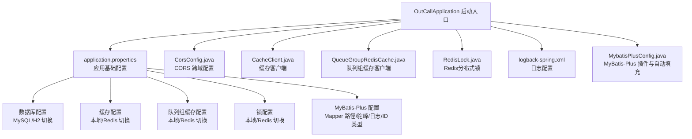
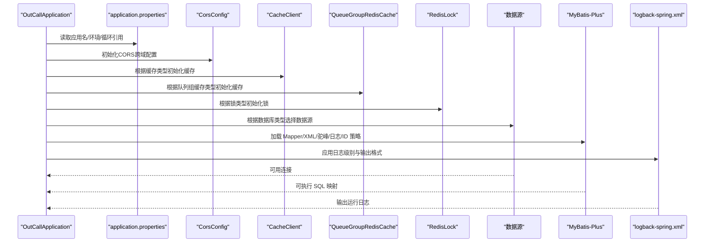
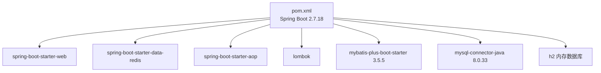

# 应用配置

<cite>
**本文引用的文件**
- [application.properties](file://src/main/resources/application.properties)
- [CorsConfig.java](file://src/main/java/org/qianye/config/CorsConfig.java)
- [CacheClient.java](file://src/main/java/org/qianye/cache/CacheClient.java)
- [QueueGroupRedisCache.java](file://src/main/java/org/qianye/cache/QueueGroupRedisCache.java)
- [RedisLock.java](file://src/main/java/org/qianye/cache/RedisLock.java)
- [MybatisPlusConfig.java](file://src/main/java/org/qianye/config/MybatisPlusConfig.java)
- [logback-spring.xml](file://src/main/resources/logback-spring.xml)
- [pom.xml](file://pom.xml)
- [OutCallApplication.java](file://src/main/java/org/qianye/OutCallApplication.java)
</cite>

## 更新摘要
**变更内容**
- 新增CORS跨域配置支持开发环境
- 新增数据库类型配置，支持MySQL和H2内存数据库切换
- 新增缓存类型配置，支持本地缓存和Redis缓存模式
- 新增队列组缓存类型配置，支持本地缓存和Redis缓存模式，提升可扩展性
- 新增锁类型配置，支持本地锁和Redis锁模式
- 更新数据库配置属性结构，分离MySQL和H2配置

## 目录
1. [简介](#简介)
2. [项目结构](#项目结构)
3. [核心组件](#核心组件)
4. [架构总览](#架构总览)
5. [详细组件分析](#详细组件分析)
6. [依赖关系分析](#依赖关系分析)
7. [性能考虑](#性能考虑)
8. [故障排查指南](#故障排查指南)
9. [结论](#结论)
10. [附录](#附录)

## 简介
本文件面向 Outcall 系统的 Spring Boot 应用配置，系统性梳理基础配置、数据库连接、MyBatis-Plus 配置、缓存配置、跨域配置及默认值，并给出不同环境下的配置示例与验证方法，帮助开发者快速理解并正确配置应用。

## 项目结构
Outcall 采用标准 Spring Boot 结构，配置集中在资源目录中：
- application.properties：应用基础配置（应用名、环境、循环引用、数据库、缓存、MyBatis-Plus）
- CorsConfig.java：CORS 跨域配置，支持开发环境的跨域访问
- CacheClient.java：缓存客户端，支持本地缓存和Redis缓存两种模式
- QueueGroupRedisCache.java：队列组缓存客户端，支持本地缓存和Redis缓存两种模式
- RedisLock.java：Redis分布式锁实现，支持本地锁和Redis锁两种模式
- logback-spring.xml：日志输出配置（控制台输出、格式、级别）
- MybatisPlusConfig.java：MyBatis-Plus 插件与自动填充配置（乐观锁、自动填充时间字段）
- OutCallApplication.java：应用启动入口
- pom.xml：依赖与版本管理（Spring Boot 2.7、MyBatis-Plus、MySQL 驱动、Redis）

**图表来源**
- [OutCallApplication.java](file://src/main/java/org/qianye/OutCallApplication.java#L1-L13)
- [application.properties](file://src/main/resources/application.properties#L1-L39)
- [CorsConfig.java](file://src/main/java/org/qianye/config/CorsConfig.java#L1-L40)
- [CacheClient.java](file://src/main/java/org/qianye/cache/CacheClient.java#L1-L171)
- [QueueGroupRedisCache.java](file://src/main/java/org/qianye/cache/QueueGroupRedisCache.java#L1-L380)
- [RedisLock.java](file://src/main/java/org/qianye/cache/RedisLock.java#L1-L465)
- [logback-spring.xml](file://src/main/resources/logback-spring.xml#L1-L32)
- [MybatisPlusConfig.java](file://src/main/java/org/qianye/config/MybatisPlusConfig.java#L1-L46)

**章节来源**
- [OutCallApplication.java](file://src/main/java/org/qianye/OutCallApplication.java#L1-L13)
- [application.properties](file://src/main/resources/application.properties#L1-L39)
- [CorsConfig.java](file://src/main/java/org/qianye/config/CorsConfig.java#L1-L40)
- [CacheClient.java](file://src/main/java/org/qianye/cache/CacheClient.java#L1-L171)
- [QueueGroupRedisCache.java](file://src/main/java/org/qianye/cache/QueueGroupRedisCache.java#L1-L380)
- [RedisLock.java](file://src/main/java/org/qianye/cache/RedisLock.java#L1-L465)
- [logback-spring.xml](file://src/main/resources/logback-spring.xml#L1-L32)
- [MybatisPlusConfig.java](file://src/main/java/org/qianye/config/MybatisPlusConfig.java#L1-L46)
- [pom.xml](file://pom.xml#L1-L97)

## 核心组件
- 应用基础配置
  - 应用名称：通过属性定义
  - 环境标识：用于区分开发/测试/生产
  - 循环引用允许：显式开启以支持复杂依赖注入场景
- CORS 跨域配置
  - 开发环境跨域支持：允许所有域名、请求头和方法
  - 凭证支持：允许携带Cookie和认证信息
  - 预检请求缓存：1小时有效期
- 数据库配置
  - 数据库类型：通过 app.database.type=MySQL/H2 切换
  - MySQL配置：驱动类名、连接URL、用户名、密码
  - H2内存数据库：开发环境专用，支持Web控制台
- 缓存配置
  - 缓存类型：通过 app.cache.type=local|redis 切换
  - 本地缓存：基于ConcurrentHashMap的高性能本地缓存
  - Redis缓存：基于StringRedisTemplate的分布式缓存
- 队列组缓存配置
  - 队列组缓存类型：通过 app.queue.group.cache.type=local|redis 切换
  - 本地队列组缓存：基于ConcurrentHashMap的高性能本地队列组缓存
  - Redis队列组缓存：基于RedisTemplate的分布式队列组缓存，支持原子操作和Lua脚本
- 锁配置
  - 锁类型：通过 app.lock.type=local|redis 切换
  - 本地锁：基于内存的轻量级锁
  - Redis锁：基于Redis的分布式锁，支持自动续期
- MyBatis-Plus 配置
  - Mapper XML 位置：类路径扫描
  - 驼峰命名转换：下划线到驼峰映射
  - 日志实现：控制台输出
  - ID 类型策略：自增
- 日志配置
  - 控制台输出 appender
  - 日志格式与编码
  - 默认级别 INFO

**章节来源**
- [application.properties](file://src/main/resources/application.properties#L1-L39)
- [CorsConfig.java](file://src/main/java/org/qianye/config/CorsConfig.java#L15-L38)
- [CacheClient.java](file://src/main/java/org/qianye/cache/CacheClient.java#L18-L21)
- [QueueGroupRedisCache.java](file://src/main/java/org/qianye/cache/QueueGroupRedisCache.java#L41-L42)
- [RedisLock.java](file://src/main/java/org/qianye/cache/RedisLock.java#L47-L48)
- [logback-spring.xml](file://src/main/resources/logback-spring.xml#L1-L32)
- [MybatisPlusConfig.java](file://src/main/java/org/qianye/config/MybatisPlusConfig.java#L1-L46)

## 架构总览
下图展示应用启动后，配置如何影响数据访问、缓存、跨域处理与日志输出的关键流程。

**图表来源**
- [OutCallApplication.java](file://src/main/java/org/qianye/OutCallApplication.java#L1-L13)
- [application.properties](file://src/main/resources/application.properties#L1-L39)
- [CorsConfig.java](file://src/main/java/org/qianye/config/CorsConfig.java#L15-L38)
- [CacheClient.java](file://src/main/java/org/qianye/cache/CacheClient.java#L55-L66)
- [QueueGroupRedisCache.java](file://src/main/java/org/qianye/cache/QueueGroupRedisCache.java#L60-L84)
- [RedisLock.java](file://src/main/java/org/qianye/cache/RedisLock.java#L59-L86)
- [logback-spring.xml](file://src/main/resources/logback-spring.xml#L1-L32)
- [MybatisPlusConfig.java](file://src/main/java/org/qianye/config/MybatisPlusConfig.java#L1-L46)

## 详细组件分析

### 基础配置与环境
- 应用名称：用于服务识别与监控
- 环境标识：可用于切换配置文件或行为分支
- 循环引用允许：在复杂依赖注入场景下避免启动失败

建议
- 在多环境部署时，使用 Spring Profiles 或外部化配置覆盖这些属性
- 将敏感信息移至环境变量或配置中心

**章节来源**
- [application.properties](file://src/main/resources/application.properties#L1-L3)

### CORS 跨域配置
- 跨域支持：开发环境允许所有域名、请求头和方法
- 凭证支持：允许携带Cookie和认证信息
- 预检请求：1小时有效期，减少重复预检请求
- 配置范围：对所有路径（/**）生效

注意事项
- 仅在开发环境有效，生产环境应使用更严格的CORS策略
- 预检请求缓存可提高性能，但可能影响跨域策略变更的及时性

**章节来源**
- [CorsConfig.java](file://src/main/java/org/qianye/config/CorsConfig.java#L15-L38)

### 数据库配置
- 数据库类型：通过 app.database.type=MySQL/H2 切换
- MySQL配置：驱动类名、连接URL、用户名、密码
- H2内存数据库：开发环境专用，支持Web控制台
- H2控制台：仅开发环境启用，提供数据库管理界面

数据库类型切换机制
- 当 app.database.type=h2 时，使用H2内存数据库
- 当 app.database.type=mysql 时，使用MySQL数据库
- 默认值为 h2，便于开发环境快速启动

**章节来源**
- [application.properties](file://src/main/resources/application.properties#L5-L31)
- [pom.xml](file://pom.xml#L81-L86)

### 缓存配置
- 缓存类型：通过 app.cache.type=local|redis 切换
- 本地缓存：基于ConcurrentHashMap的高性能本地缓存
- Redis缓存：基于StringRedisTemplate的分布式缓存
- 自动过期：支持过期时间控制
- 并发安全：本地缓存使用ConcurrentHashMap，Redis缓存使用原子操作

缓存操作接口
- putNotExist：仅当key不存在时设置缓存
- put：覆盖已存在的值
- get：获取缓存值
- exists：检查key是否存在
- delete：删除缓存
- clearAll：清空所有缓存

**章节来源**
- [application.properties](file://src/main/resources/application.properties#L8-L9)
- [CacheClient.java](file://src/main/java/org/qianye/cache/CacheClient.java#L18-L171)

### 队列组缓存配置
- 队列组缓存类型：通过 app.queue.group.cache.type=local|redis 切换
- 本地队列组缓存：基于ConcurrentHashMap的高性能本地队列组缓存
- Redis队列组缓存：基于RedisTemplate的分布式队列组缓存，支持原子操作和Lua脚本
- 双模式支持：自动降级机制，Redis不可用时自动回退到本地缓存
- 原子操作：使用Lua脚本保证Redis操作的原子性
- 过期时间：默认24小时过期时间
- 缓存键设计：区分私有组和公共组，支持固定组和普通组

队列组缓存操作接口
- addGroupFromLeft：从左侧添加队列组（支持批量添加）
- popRightGroup：原子性弹出右侧元素
- getGroupSize：获取队列组大小
- listElements：列出队列组元素
- clearGroupCache：清除队列组缓存

**更新** 新增队列组缓存类型配置，支持本地和Redis缓存模式，提升可扩展性

**章节来源**
- [application.properties](file://src/main/resources/application.properties#L14-L15)
- [QueueGroupRedisCache.java](file://src/main/java/org/qianye/cache/QueueGroupRedisCache.java#L23-L84)

### 锁配置
- 锁类型：通过 app.lock.type=local|redis 切换
- 本地锁：基于内存的轻量级锁，适合单实例部署
- Redis锁：基于Redis的分布式锁，支持自动续期
- 分布式锁特性：Lua脚本保证原子性，自动续期机制
- 锁释放：使用Lua脚本确保只有持有者才能释放锁
- 续期机制：超过阈值自动续期，防止锁过期

锁操作接口
- tryLock：尝试获取锁，立即返回结果
- lockWaitTime：带等待时间的锁获取
- unlock：释放锁
- exists：检查锁是否存在

**章节来源**
- [application.properties](file://src/main/resources/application.properties#L11-L12)
- [RedisLock.java](file://src/main/java/org/qianye/cache/RedisLock.java#L32-L86)

### MyBatis-Plus 配置
- Mapper XML 位置：类路径扫描，便于模块化维护
- 驼峰命名转换：自动映射数据库下划线字段到实体驼峰属性
- 日志实现：控制台输出，便于开发调试
- ID 类型策略：自增，适用于主键自增场景

插件与自动填充
- 乐观锁拦截器：防止并发更新冲突
- 自动填充：统一填充创建与修改时间字段

**章节来源**
- [application.properties](file://src/main/resources/application.properties#L34-L39)
- [MybatisPlusConfig.java](file://src/main/java/org/qianye/config/MybatisPlusConfig.java#L14-L46)

### 日志配置
- 控制台输出：便于本地开发观察
- 日志格式：包含时间、线程、级别、Logger 与消息
- 编码：UTF-8
- 默认级别：INFO

建议
- 生产环境可改为文件输出与更严格的级别
- 使用占位符与环境变量动态配置日志路径

**章节来源**
- [logback-spring.xml](file://src/main/resources/logback-spring.xml#L1-L32)

### 应用启动入口
- Spring Boot 启动类，负责加载配置与启动容器

**章节来源**
- [OutCallApplication.java](file://src/main/java/org/qianye/OutCallApplication.java#L1-L13)

## 依赖关系分析
- Spring Boot 版本：2.7.18（父 POM）
- MyBatis-Plus Starter：3.5.5
- MySQL 驱动：8.0.33
- H2内存数据库：用于开发环境
- Redis：用于分布式缓存和锁
- Web、AOP、Lombok 等依赖

**图表来源**
- [pom.xml](file://pom.xml#L24-L87)

**章节来源**
- [pom.xml](file://pom.xml#L1-L97)

## 性能考虑
- 数据库连接池与超时：建议在生产环境增加连接池参数与连接超时配置
- 日志级别：生产环境提升日志级别，减少 IO 压力
- MyBatis-Plus 日志：仅在开发/测试开启控制台日志，生产关闭或改写入文件
- 缓存策略：根据业务场景选择合适的缓存类型和过期时间
- 队列组缓存：Redis队列组缓存支持原子操作，适合高并发场景
- 锁性能：Redis锁适合分布式场景，本地锁适合单实例部署
- CORS配置：生产环境应限制允许的域名和方法，减少安全风险

## 故障排查指南
- 启动报错：循环引用相关
  - 检查是否已开启循环引用允许
  - 排查复杂依赖注入链路
- CORS跨域问题
  - 检查CORS配置是否正确加载
  - 确认开发环境的跨域配置生效
  - 验证预检请求是否正确处理
- 数据库连接失败
  - 校验数据库类型配置
  - 检查对应的数据源配置
  - 确认数据库服务可达与防火墙策略
- 缓存访问异常
  - 检查缓存类型配置
  - 验证Redis连接（如果使用Redis缓存）
  - 确认缓存操作接口调用正确
- 队列组缓存异常
  - 检查队列组缓存类型配置
  - 验证Redis连接（如果使用Redis队列组缓存）
  - 确认Lua脚本执行情况和原子操作
- 锁获取失败
  - 检查锁类型配置
  - 验证Redis连接（如果使用Redis锁）
  - 确认锁的生命周期和续期机制
- MyBatis-Plus 映射异常
  - 检查 Mapper XML 是否在指定位置
  - 确认实体字段与数据库列命名一致性（驼峰已开启）
- 日志无输出或乱码
  - 检查日志级别与编码
  - 确认控制台输出 appender 已启用

**章节来源**
- [application.properties](file://src/main/resources/application.properties#L3-L39)
- [CorsConfig.java](file://src/main/java/org/qianye/config/CorsConfig.java#L15-L38)
- [CacheClient.java](file://src/main/java/org/qianye/cache/CacheClient.java#L55-L139)
- [QueueGroupRedisCache.java](file://src/main/java/org/qianye/cache/QueueGroupRedisCache.java#L60-L84)
- [RedisLock.java](file://src/main/java/org/qianye/cache/RedisLock.java#L59-L86)
- [logback-spring.xml](file://src/main/resources/logback-spring.xml#L28-L31)
- [MybatisPlusConfig.java](file://src/main/java/org/qianye/config/MybatisPlusConfig.java#L14-L46)

## 结论
本文档对 Outcall 系统的 Spring Boot 应用配置进行了全面梳理，涵盖基础配置、CORS跨域、数据库、缓存、队列组缓存、锁、MyBatis-Plus、日志与依赖关系，并提供了不同环境的配置思路与排障建议。新增的配置选项为应用提供了更大的灵活性，支持多种部署场景。特别是新增的队列组缓存类型配置，支持本地和Redis缓存模式，显著提升了系统的可扩展性和性能。建议在生产环境中进一步完善连接池、日志落盘、安全策略和监控配置，并通过环境变量或配置中心进行集中管理。

## 附录

### 配置文件结构与默认值
- application.properties
  - 应用名：由属性定义
  - 环境：由属性定义
  - 循环引用：显式开启
  - 数据库类型：默认 h2
  - MySQL配置：驱动类名、URL、用户名、密码
  - H2配置：驱动类名、URL、用户名、密码
  - H2控制台：开发环境启用
  - 缓存类型：默认 local
  - 队列组缓存类型：默认 local
  - 锁类型：默认 local
  - MyBatis-Plus：Mapper 位置、驼峰、日志实现、ID 类型
- CorsConfig.java
  - 允许所有域名、请求头和方法
  - 支持凭证
  - 预检请求有效期1小时
- CacheClient.java
  - 本地缓存实现
  - Redis缓存实现（可选）
  - 支持过期时间控制
- QueueGroupRedisCache.java
  - 本地队列组缓存实现
  - Redis队列组缓存实现（可选）
  - 支持原子操作和Lua脚本
  - 自动降级机制
- RedisLock.java
  - 分布式锁实现
  - 自动续期机制
  - Lua脚本保证原子性
- logback-spring.xml
  - 控制台输出 appender
  - 日志格式与编码
  - 默认级别 INFO
- MybatisPlusConfig.java
  - 乐观锁拦截器
  - 自动填充 gmtCreate/gmtModified
- pom.xml
  - Spring Boot 2.7.18
  - MyBatis-Plus 3.5.5
  - MySQL 驱动 8.0.33
  - H2内存数据库

**章节来源**
- [application.properties](file://src/main/resources/application.properties#L1-L39)
- [CorsConfig.java](file://src/main/java/org/qianye/config/CorsConfig.java#L1-L40)
- [CacheClient.java](file://src/main/java/org/qianye/cache/CacheClient.java#L1-L171)
- [QueueGroupRedisCache.java](file://src/main/java/org/qianye/cache/QueueGroupRedisCache.java#L1-L380)
- [RedisLock.java](file://src/main/java/org/qianye/cache/RedisLock.java#L1-L465)
- [logback-spring.xml](file://src/main/resources/logback-spring.xml#L1-L32)
- [MybatisPlusConfig.java](file://src/main/java/org/qianye/config/MybatisPlusConfig.java#L1-L46)
- [pom.xml](file://pom.xml#L1-L97)

### 不同环境配置示例
- 开发环境
  - 数据源：H2内存数据库，支持Web控制台
  - 缓存：本地缓存，便于调试
  - 队列组缓存：本地缓存，便于调试
  - 锁：本地锁，简化开发
  - CORS：允许所有跨域请求
  - 日志：控制台输出，便于调试
  - MyBatis-Plus：开启控制台日志
- 测试环境
  - 数据源：独立测试库，最小权限账号
  - 缓存：Redis缓存，模拟生产环境
  - 队列组缓存：Redis缓存，支持原子操作
  - 锁：Redis锁，支持分布式场景
  - CORS：限制允许的域名
  - 日志：INFO 级别，控制台与文件输出
  - MyBatis-Plus：开启控制台日志（可选）
- 生产环境
  - 数据源：高可用数据库，只读账号，连接池参数优化
  - 缓存：Redis缓存，集群部署
  - 队列组缓存：Redis缓存，集群部署，支持原子操作
  - 锁：Redis锁，集群部署
  - CORS：严格限制允许的域名和方法
  - 日志：文件输出，ERROR/WARN 级别为主
  - MyBatis-Plus：关闭控制台日志，使用文件日志

### 配置验证方法
- 启动日志：确认应用名、环境、循环引用状态
- CORS验证：测试跨域请求是否正常
- 数据库连通性：执行一次查询或查看连接池状态
- 缓存功能：测试缓存的增删改查操作
- 队列组缓存功能：测试队列组的原子性操作
- 锁功能：测试分布式锁的获取和释放
- MyBatis-Plus：执行一个简单查询，观察 SQL 输出与日志
- 日志输出：确认控制台/文件输出正常且编码正确