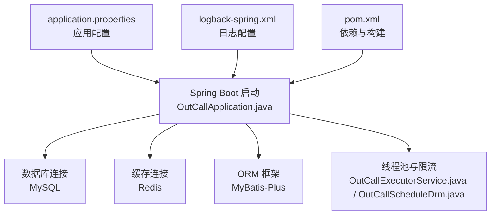
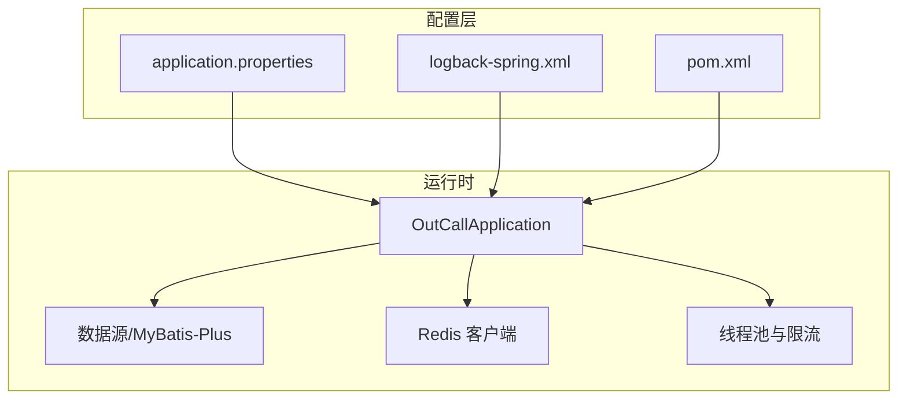
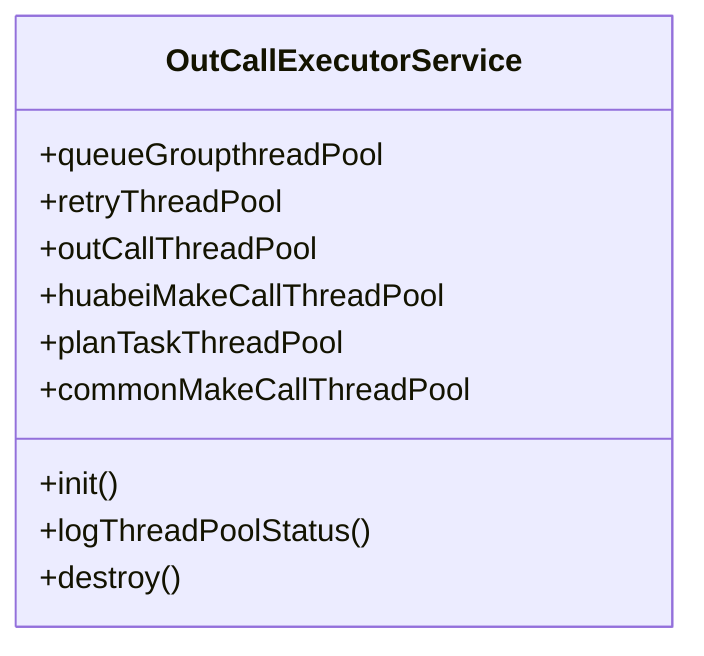
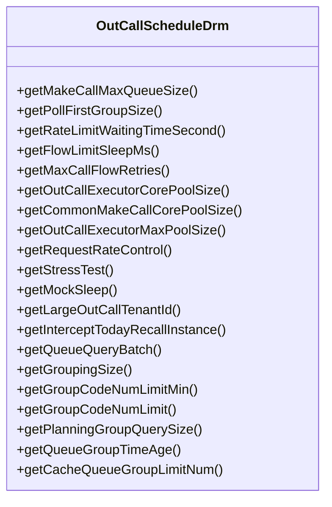
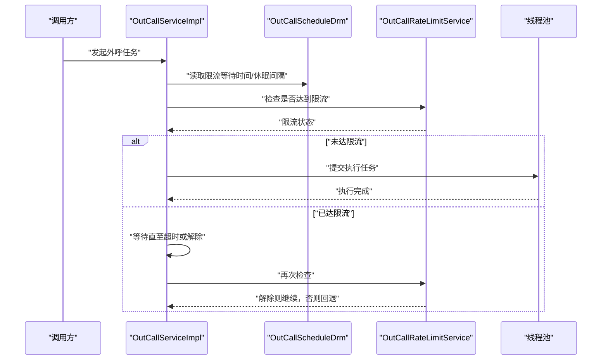
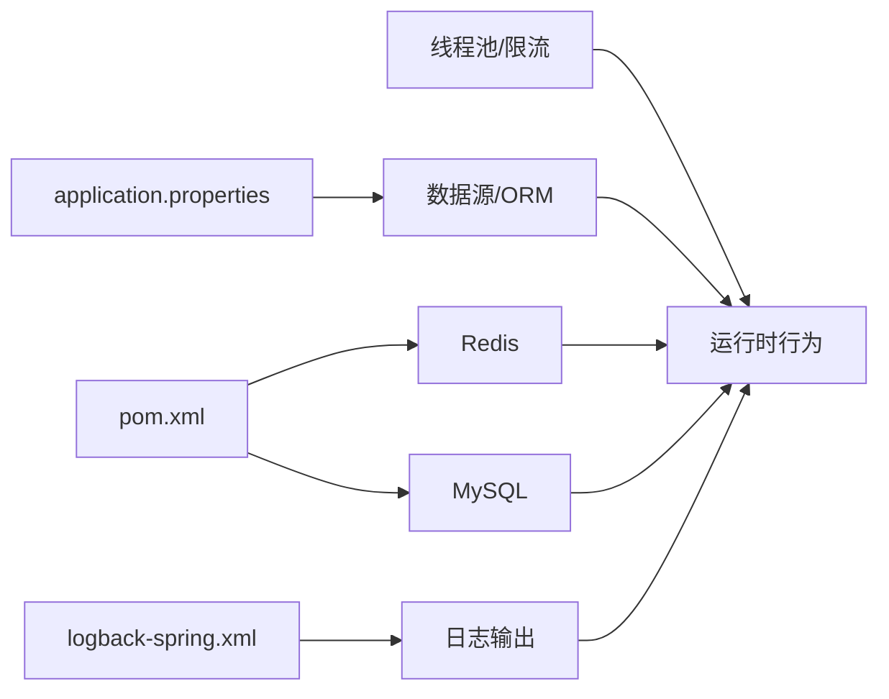

# 配置管理

<cite>
**本文引用的文件**
- [application.properties](file://src/main/resources/application.properties)
- [logback-spring.xml](file://src/main/resources/logback-spring.xml)
- [pom.xml](file://pom.xml)
- [OutCallApplication.java](file://src/main/java/org/qianye/OutCallApplication.java)
- [OutCallExecutorService.java](file://src/main/java/org/qianye/OutCallExecutorService.java)
- [OutCallScheduleDrm.java](file://src/main/java/org/qianye/OutCallScheduleDrm.java)
- [OutCallRateLimitService.java](file://src/main/java/org/qianye/OutCallRateLimitService.java)
- [CacheClient.java](file://src/main/java/org/qianye/CacheClient.java)
- [QueueGroupRedisCache.java](file://src/main/java/org/qianye/QueueGroupRedisCache.java)
- [OutCallServiceImpl.java](file://src/main/java/org/qianye/OutCallServiceImpl.java)
- [OutCallResult.java](file://src/main/java/org/qianye/OutCallResult.java)
- [LoggerUtil.java](file://src/main/java/org/qianye/LoggerUtil.java)
</cite>

## 目录
1. [简介](#简介)
2. [项目结构](#项目结构)
3. [核心组件](#核心组件)
4. [架构总览](#架构总览)
5. [详细组件分析](#详细组件分析)
6. [依赖关系分析](#依赖关系分析)
7. [性能考量](#性能考量)
8. [故障排查指南](#故障排查指南)
9. [结论](#结论)
10. [附录](#附录)

## 简介
本文件面向 Outcall 系统的配置管理，系统基于 Spring Boot 构建，采用 Java 8，使用 MySQL 与 Redis 支撑数据与缓存，日志通过 Logback 输出。本文档聚焦以下方面：
- 应用配置项：数据库连接、MyBatis-Plus、日志级别与输出格式等
- 业务配置参数：外呼参数、限流参数、线程池参数等
- 配置文件结构与默认值
- 配置优先级与覆盖规则
- 不同环境下的配置示例与最佳实践
- 配置验证方法与常见问题排查

## 项目结构
Outcall 的配置主要分布在如下位置：
- 应用配置：application.properties（数据库、MyBatis-Plus、Spring 主要开关）
- 日志配置：logback-spring.xml（控制台输出、根日志级别）
- 依赖与构建：pom.xml（MySQL、Redis、MyBatis-Plus 等依赖）
- 运行入口：OutCallApplication.java（Spring Boot 启动类）

图表来源
- [application.properties](file://src/main/resources/application.properties#L1-L16)
- [logback-spring.xml](file://src/main/resources/logback-spring.xml#L1-L32)
- [pom.xml](file://pom.xml#L24-L80)
- [OutCallApplication.java](file://src/main/java/org/qianye/OutCallApplication.java#L1-L13)

章节来源
- [application.properties](file://src/main/resources/application.properties#L1-L16)
- [logback-spring.xml](file://src/main/resources/logback-spring.xml#L1-L32)
- [pom.xml](file://pom.xml#L24-L80)
- [OutCallApplication.java](file://src/main/java/org/qianye/OutCallApplication.java#L1-L13)

## 核心组件
- 数据源与 ORM：通过 application.properties 配置 MySQL 连接、驱动、MyBatis-Plus 映射与日志实现等
- 日志系统：通过 logback-spring.xml 配置控制台输出、日志模式与根日志级别
- 缓存与连接：pom.xml 引入 spring-boot-starter-data-redis；缓存客户端与 Redis 脚本在 CacheClient 与 QueueGroupRedisCache 中体现
- 线程池与限流：OutCallExecutorService 提供多类线程池；OutCallScheduleDrm 提供业务限流与调度参数；OutCallRateLimitService 为限流接口占位
- 运行入口：OutCallApplication 启动 Spring Boot 应用

章节来源
- [application.properties](file://src/main/resources/application.properties#L6-L16)
- [logback-spring.xml](file://src/main/resources/logback-spring.xml#L12-L31)
- [pom.xml](file://pom.xml#L47-L68)
- [OutCallExecutorService.java](file://src/main/java/org/qianye/OutCallExecutorService.java#L14-L51)
- [OutCallScheduleDrm.java](file://src/main/java/org/qianye/OutCallScheduleDrm.java#L11-L111)
- [OutCallRateLimitService.java](file://src/main/java/org/qianye/OutCallRateLimitService.java#L10-L16)
- [CacheClient.java](file://src/main/java/org/qianye/CacheClient.java#L11-L22)
- [QueueGroupRedisCache.java](file://src/main/java/org/qianye/QueueGroupRedisCache.java#L63-L78)
- [OutCallApplication.java](file://src/main/java/org/qianye/OutCallApplication.java#L6-L11)

## 架构总览
下图展示配置在系统中的作用与影响范围。

图表来源
- [application.properties](file://src/main/resources/application.properties#L1-L16)
- [logback-spring.xml](file://src/main/resources/logback-spring.xml#L1-L32)
- [pom.xml](file://pom.xml#L24-L80)
- [OutCallApplication.java](file://src/main/java/org/qianye/OutCallApplication.java#L6-L11)

## 详细组件分析

### 应用配置（application.properties）
- 作用：定义 Spring 应用名称、环境标识、循环依赖允许、数据库连接、MyBatis-Plus 参数等
- 关键项与默认值
  - spring.application.name：应用名（示例：outcall）
  - env：环境标识（示例：test）
  - spring.main.allow-circular-references：允许循环依赖（示例：true）
  - 数据库驱动与连接：驱动类名、URL、用户名、密码（示例：本地 MySQL）
  - MyBatis-Plus：映射文件位置、下划线转驼峰、日志实现、ID 类型策略
- 取值范围与建议
  - URL 必须指向可用的 MySQL 实例
  - 日志实现可选 StdOutImpl 或其他实现
  - ID 类型策略可选自增或雪花等
- 使用场景
  - 开发环境可使用本地 MySQL；生产环境需替换为高可用实例
  - 下划线转驼峰与日志实现可根据团队规范调整

章节来源
- [application.properties](file://src/main/resources/application.properties#L1-L16)

### 日志配置（logback-spring.xml）
- 作用：定义日志输出目标（控制台）、日志格式、编码与根日志级别
- 关键项与默认值
  - LOG_HOME：日志目录（示例：./log）
  - 控制台 appender：输出格式、编码
  - 根日志级别：INFO
- 取值范围与建议
  - 日志级别可按环境调整（开发：DEBUG；生产：INFO/ERROR）
  - 生产环境建议增加文件输出 appender 并启用异步
- 使用场景
  - 开发调试：提升日志级别以观察 SQL 与流程
  - 生产排障：保留 ERROR 级别，必要时临时提升 INFO

章节来源
- [logback-spring.xml](file://src/main/resources/logback-spring.xml#L6-L31)

### 依赖与构建（pom.xml）
- 作用：声明 Spring Boot、MySQL、Redis、MyBatis-Plus 等依赖
- 关键项与默认值
  - Spring Boot 版本：2.7.18
  - MyBatis-Plus Starter：3.5.5
  - MySQL Connector：8.0.33
  - Redis Starter：spring-boot-starter-data-redis
- 取值范围与建议
  - 保持与 JDK 8 兼容
  - 生产环境建议锁定版本并统一依赖管理
- 使用场景
  - 新增功能模块时，遵循现有依赖版本策略

章节来源
- [pom.xml](file://pom.xml#L12-L17)
- [pom.xml](file://pom.xml#L24-L80)

### 线程池配置（OutCallExecutorService）
- 作用：集中管理多类线程池，含队列分组、重试、外呼、计划任务、通用外呼等
- 默认配置要点
  - 核心池大小、最大池大小、存活时间、队列容量、拒绝策略
  - 定时监控线程池状态并记录日志
- 取值范围与建议
  - 核心池大小与最大池大小应结合 CPU 与 IO 特性调优
  - 队列容量需考虑峰值流量与内存占用
  - 拒绝策略根据业务容忍度选择丢弃或调用者执行
- 使用场景
  - 高并发外呼：增大通用外呼与特定租户线程池规模
  - 重试与失败兜底：使用重试线程池隔离失败任务

图表来源
- [OutCallExecutorService.java](file://src/main/java/org/qianye/OutCallExecutorService.java#L14-L51)
- [OutCallExecutorService.java](file://src/main/java/org/qianye/OutCallExecutorService.java#L55-L137)

章节来源
- [OutCallExecutorService.java](file://src/main/java/org/qianye/OutCallExecutorService.java#L14-L51)
- [OutCallExecutorService.java](file://src/main/java/org/qianye/OutCallExecutorService.java#L55-L137)

### 业务配置参数（OutCallScheduleDrm）
- 作用：提供外呼调度与限流相关参数的默认实现，后续可接入配置中心
- 关键参数与默认值
  - 外呼队列最大长度、轮询首组大小、限流等待时间、限流休眠间隔、最大重试次数
  - 线程池核心/最大大小、请求速率控制、压力测试开关、模拟休眠开关
  - 队列查询批次、分组大小、组编码数量限制、规划组查询大小、队列组超时时间、队列缓存上限
- 取值范围与建议
  - 限流等待时间与休眠间隔需平衡吞吐与延迟
  - 线程池大小与队列容量需结合压测结果迭代
- 使用场景
  - 动态扩缩容：根据租户规模切换 huabei 专用线程池
  - 限流保护：在高峰期降低请求速率或延长等待时间

图表来源
- [OutCallScheduleDrm.java](file://src/main/java/org/qianye/OutCallScheduleDrm.java#L11-L111)

章节来源
- [OutCallScheduleDrm.java](file://src/main/java/org/qianye/OutCallScheduleDrm.java#L11-L111)

### 限流服务（OutCallRateLimitService）
- 作用：限流检查接口占位，当前未实现具体逻辑
- 建议
  - 结合 OutCallScheduleDrm 的等待时间与休眠参数实现基于令牌桶/滑动窗口的限流
  - 在 OutCallServiceImpl 中集成等待与重试逻辑

章节来源
- [OutCallRateLimitService.java](file://src/main/java/org/qianye/OutCallRateLimitService.java#L10-L16)

### 缓存客户端与 Redis（CacheClient、QueueGroupRedisCache）
- 作用：提供 Redis 操作占位与 Lua 脚本初始化，负责队列组的缓存与弹出/移动/补货等操作
- 关键点
  - RedisTemplate 序列化策略与连接工厂装配
  - Lua 脚本初始化，避免重复创建
- 建议
  - 生产环境配置哨兵/集群与连接池参数
  - 对热点键进行分区与降级策略设计

章节来源
- [CacheClient.java](file://src/main/java/org/qianye/CacheClient.java#L11-L22)
- [QueueGroupRedisCache.java](file://src/main/java/org/qianye/QueueGroupRedisCache.java#L63-L78)

### 外呼流程与限流交互（OutCallServiceImpl）
- 作用：外呼主流程，包含限流等待、线程池选择、请求速率控制、并发计数等
- 关键流程
  - 限流等待：基于 OutCallScheduleDrm 的等待时间与休眠间隔
  - 线程池选择：根据租户 ID 切换 huabei 或通用线程池
  - 请求速率控制：按配置进行固定休眠
  - 并发计数：基于时间片的会话限流

图表来源
- [OutCallServiceImpl.java](file://src/main/java/org/qianye/OutCallServiceImpl.java#L602-L626)
- [OutCallServiceImpl.java](file://src/main/java/org/qianye/OutCallServiceImpl.java#L841-L883)
- [OutCallServiceImpl.java](file://src/main/java/org/qianye/OutCallServiceImpl.java#L886-L904)
- [OutCallScheduleDrm.java](file://src/main/java/org/qianye/OutCallScheduleDrm.java#L19-L45)
- [OutCallRateLimitService.java](file://src/main/java/org/qianye/OutCallRateLimitService.java#L12-L15)

章节来源
- [OutCallServiceImpl.java](file://src/main/java/org/qianye/OutCallServiceImpl.java#L602-L626)
- [OutCallServiceImpl.java](file://src/main/java/org/qianye/OutCallServiceImpl.java#L841-L883)
- [OutCallServiceImpl.java](file://src/main/java/org/qianye/OutCallServiceImpl.java#L886-L904)
- [OutCallScheduleDrm.java](file://src/main/java/org/qianye/OutCallScheduleDrm.java#L19-L45)
- [OutCallRateLimitService.java](file://src/main/java/org/qianye/OutCallRateLimitService.java#L12-L15)

### 错误码与状态（OutCallResult）
- 作用：统一外呼结果与错误码，便于限流、队列满、线程池满等场景的判定
- 常见错误码
  - 流量限制：FLOW_LIMIT
  - 队列上限：QUEUE_LIMIT
  - 线程池满：POOL_FULL
  - 最大重试：MAX_RETRIES
  - 执行完成：EXECUTE_FINISH
- 建议
  - 在限流与队列满场景返回明确错误码，便于上层策略处理

章节来源
- [OutCallResult.java](file://src/main/java/org/qianye/OutCallResult.java#L8-L24)

## 依赖关系分析
- 配置对运行时的影响
  - application.properties 决定数据源与 ORM 行为
  - logback-spring.xml 决定日志输出与级别
  - pom.xml 决定缓存与数据库能力
  - OutCallExecutorService 与 OutCallScheduleDrm 决定并发与限流行为
- 配置耦合与内聚
  - 线程池与限流参数相互影响，需协同调优
  - 缓存与数据库配置共同决定数据一致性与性能

图表来源
- [application.properties](file://src/main/resources/application.properties#L6-L16)
- [logback-spring.xml](file://src/main/resources/logback-spring.xml#L12-L31)
- [pom.xml](file://pom.xml#L47-L68)
- [OutCallExecutorService.java](file://src/main/java/org/qianye/OutCallExecutorService.java#L14-L51)
- [OutCallScheduleDrm.java](file://src/main/java/org/qianye/OutCallScheduleDrm.java#L11-L111)

章节来源
- [application.properties](file://src/main/resources/application.properties#L6-L16)
- [logback-spring.xml](file://src/main/resources/logback-spring.xml#L12-L31)
- [pom.xml](file://pom.xml#L47-L68)
- [OutCallExecutorService.java](file://src/main/java/org/qianye/OutCallExecutorService.java#L14-L51)
- [OutCallScheduleDrm.java](file://src/main/java/org/qianye/OutCallScheduleDrm.java#L11-L111)

## 性能考量
- 线程池调优
  - 核心池大小与最大池大小：结合 CPU 核心数与 IO 密集程度设定
  - 队列容量：避免 OOM，同时保证突发流量缓冲
  - 拒绝策略：丢弃 vs 调用者执行，按 SLA 选择
- 限流策略
  - 等待时间与休眠间隔：权衡吞吐与延迟
  - 请求速率控制：在高峰期进行平滑
- 缓存与数据库
  - Redis 连接池与序列化策略：减少序列化开销
  - MySQL 连接池与慢查询：开启慢日志与连接池监控

## 故障排查指南
- 配置验证
  - 数据库连通性：确认 URL、用户名、密码正确，网络可达
  - Redis 连通性：确认连接工厂与序列化配置无误
  - 日志级别：临时提升至 DEBUG 观察 SQL 与流程
- 常见问题
  - 线程池满：查看线程池状态日志，评估队列容量与池大小
  - 限流频繁：检查等待时间与休眠间隔，必要时降低并发或提高阈值
  - 队列积压：检查队列上限与批次大小，优化分组与查询策略
- 错误码定位
  - 使用 OutCallResult 的错误码快速定位失败原因（限流、队列满、线程池满等）

章节来源
- [OutCallResult.java](file://src/main/java/org/qianye/OutCallResult.java#L8-L24)
- [OutCallExecutorService.java](file://src/main/java/org/qianye/OutCallExecutorService.java#L66-L137)
- [OutCallServiceImpl.java](file://src/main/java/org/qianye/OutCallServiceImpl.java#L602-L626)

## 结论
- Outcall 的配置体系围绕 Spring Boot 的标准机制展开，结合业务参数（线程池、限流）形成完整的运行时保障
- 建议在生产环境完善配置中心接入、日志文件输出、Redis 集群与连接池参数，并持续压测与调优
- 通过统一错误码与日志工具，可快速定位与恢复故障

## 附录

### 配置优先级与覆盖规则
- Spring Boot 配置优先级（从高到低）
  1) 命令行参数
  2) SPRING_APPLICATION_JSON
  3) 环境变量
  4) application.properties（resources 下）
  5) Profile-specific 配置
  6) 默认属性
- 覆盖建议
  - 本地开发：使用 application.properties
  - CI/CD：通过环境变量或配置中心注入
  - 生产：通过配置中心集中管理，避免硬编码

### 不同环境下的配置示例与最佳实践
- 开发环境
  - 数据库：本地 MySQL，日志级别 DEBUG
  - Redis：本地或容器化 Redis
  - 线程池：较小规模，便于调试
- 测试环境
  - 数据库：独立实例，开启慢查询
  - Redis：哨兵/集群，连接池参数合理
  - 线程池：按压测结果收敛
- 生产环境
  - 数据库：主从/读写分离，连接池参数优化
  - Redis：集群/哨兵，开启持久化与备份
  - 日志：文件输出 + 异步 + 切割
  - 线程池：动态扩缩容，监控告警

### 配置验证方法
- 启动验证：启动应用后检查日志输出与线程池状态
- 数据库验证：执行简单查询确认连通性
- 缓存验证：执行缓存读写与 Lua 脚本验证
- 限流验证：在测试环境模拟高峰流量，观察限流与恢复行为