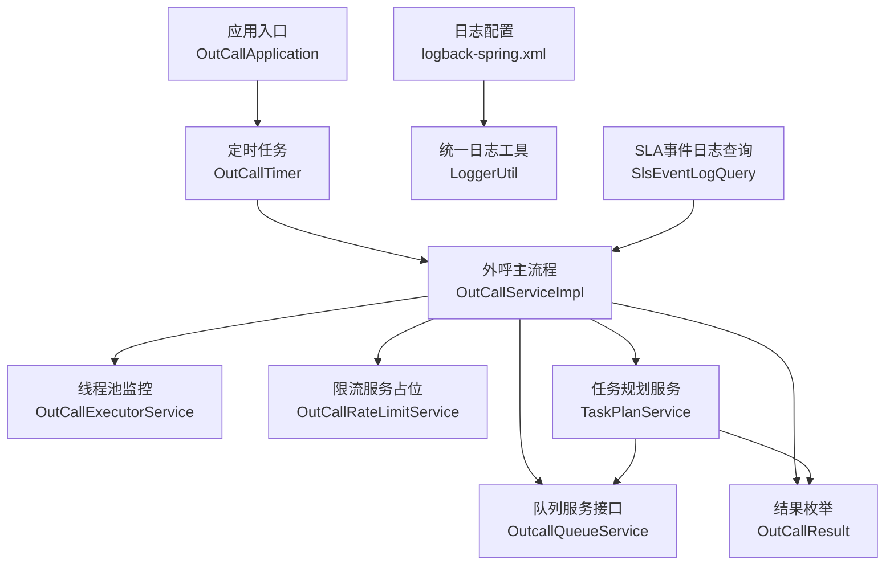
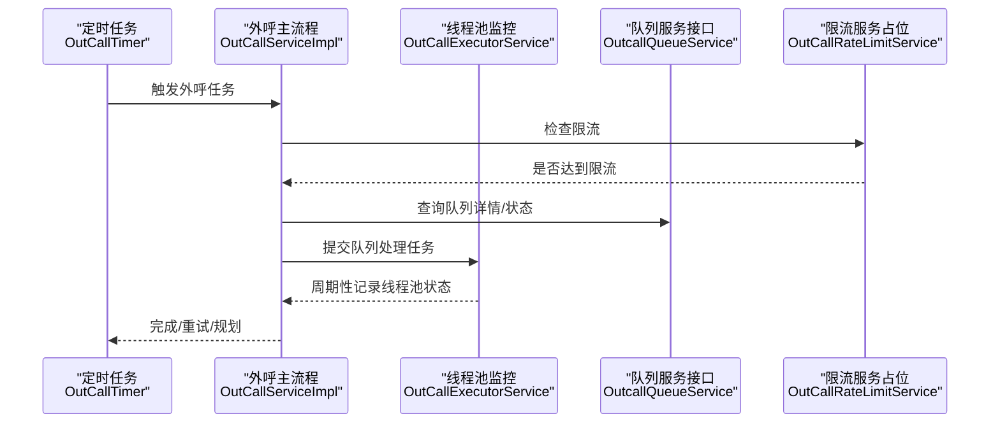
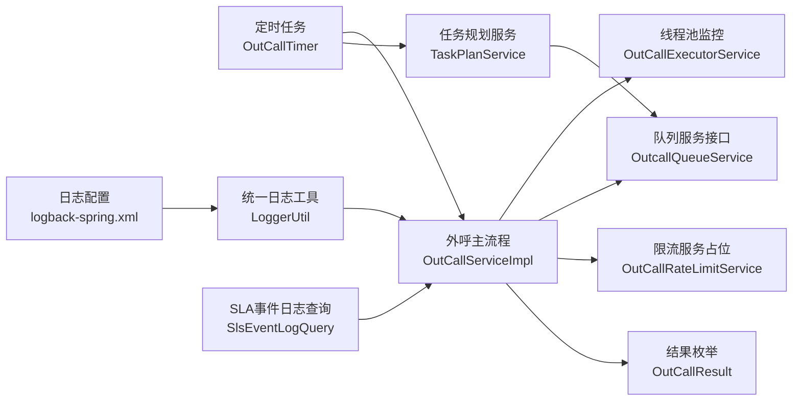

# 监控指标体系

<cite>
**本文引用的文件**
- [OutCallApplication.java](file://src/main/java/org/qianye/OutCallApplication.java)
- [logback-spring.xml](file://src/main/resources/logback-spring.xml)
- [LoggerUtil.java](file://src/main/java/org/qianye/LoggerUtil.java)
- [SlsEventLogQuery.java](file://src/main/java/org/qianye/SlsEventLogQuery.java)
- [OutCallExecutorService.java](file://src/main/java/org/qianye/OutCallExecutorService.java)
- [OutCallServiceImpl.java](file://src/main/java/org/qianye/OutCallServiceImpl.java)
- [OutCallService.java](file://src/main/java/org/qianye/OutCallService.java)
- [OutcallQueueService.java](file://src/main/java/org/qianye/OutcallQueueService.java)
- [CallRecord.java](file://src/main/java/org/qianye/CallRecord.java)
- [CallRecordService.java](file://src/main/java/org/qianye/CallRecordService.java)
- [OutCallRateLimitService.java](file://src/main/java/org/qianye/OutCallRateLimitService.java)
- [OutCallResult.java](file://src/main/java/org/qianye/OutCallResult.java)
- [OutCallTimer.java](file://src/main/java/org/qianye/OutCallTimer.java)
- [TaskPlanService.java](file://src/main/java/org/qianye/TaskPlanService.java)
- [OutCallScheduleDrm.java](file://src/main/java/org/qianye/OutCallScheduleDrm.java)
</cite>

## 目录
1. [引言](#引言)
2. [项目结构](#项目结构)
3. [核心组件](#核心组件)
4. [架构总览](#架构总览)
5. [详细组件分析](#详细组件分析)
6. [依赖分析](#依赖分析)
7. [性能考虑](#性能考虑)
8. [故障排查指南](#故障排查指南)
9. [结论](#结论)
10. [附录](#附录)

## 引言
本文件面向 Outcall 系统的监控指标体系，围绕性能监控与业务监控两大维度，结合现有代码实现，给出可落地的指标设计、采集方法、日志规范、SLA 事件日志查询接口使用方式、可视化与告警配置思路以及健康检查与自检流程建议。目标是帮助运维与开发团队建立统一、可观测、可预警的监控体系。

## 项目结构
Outcall 采用 Spring Boot 应用结构，核心模块包括：
- 应用入口与定时调度：应用入口、定时任务与异步执行器
- 执行与线程池监控：多线程池与周期性状态日志
- 业务流程与状态：外呼主流程、队列与任务规划
- 日志与查询：日志配置、统一日志工具、SLA 事件日志查询占位
- 结果与限流：外呼结果枚举、限流服务占位

图表来源
- [OutCallApplication.java](file://src/main/java/org/qianye/OutCallApplication.java#L1-L13)
- [OutCallTimer.java](file://src/main/java/org/qianye/OutCallTimer.java#L1-L118)
- [OutCallServiceImpl.java](file://src/main/java/org/qianye/OutCallServiceImpl.java#L1-L800)
- [OutCallExecutorService.java](file://src/main/java/org/qianye/OutCallExecutorService.java#L1-L211)
- [OutcallQueueService.java](file://src/main/java/org/qianye/OutcallQueueService.java#L1-L61)
- [OutCallRateLimitService.java](file://src/main/java/org/qianye/OutCallRateLimitService.java#L1-L17)
- [OutCallResult.java](file://src/main/java/org/qianye/OutCallResult.java#L1-L50)
- [TaskPlanService.java](file://src/main/java/org/qianye/TaskPlanService.java#L1-L800)
- [logback-spring.xml](file://src/main/resources/logback-spring.xml#L1-L32)
- [LoggerUtil.java](file://src/main/java/org/qianye/LoggerUtil.java#L1-L56)
- [SlsEventLogQuery.java](file://src/main/java/org/qianye/SlsEventLogQuery.java#L1-L23)

章节来源
- [OutCallApplication.java](file://src/main/java/org/qianye/OutCallApplication.java#L1-L13)
- [logback-spring.xml](file://src/main/resources/logback-spring.xml#L1-L32)

## 核心组件
- 应用入口与启动：负责应用启动与上下文初始化
- 定时任务与异步执行器：提供周期性任务调度与异步线程池配置
- 外呼主流程：负责任务拉取、分组、限流、队列异步处理与重试规划
- 线程池监控：周期性记录各线程池活动状态，便于容量与稳定性观测
- 队列服务接口：抽象队列详情的查询、更新与状态维护
- 日志与查询：日志配置与统一日志工具；SLA 事件日志查询占位
- 结果与限流：外呼结果枚举；限流服务占位

章节来源
- [OutCallTimer.java](file://src/main/java/org/qianye/OutCallTimer.java#L1-L118)
- [OutCallServiceImpl.java](file://src/main/java/org/qianye/OutCallServiceImpl.java#L1-L800)
- [OutCallExecutorService.java](file://src/main/java/org/qianye/OutCallExecutorService.java#L1-L211)
- [OutcallQueueService.java](file://src/main/java/org/qianye/OutcallQueueService.java#L1-L61)
- [LoggerUtil.java](file://src/main/java/org/qianye/LoggerUtil.java#L1-L56)
- [SlsEventLogQuery.java](file://src/main/java/org/qianye/SlsEventLogQuery.java#L1-L23)
- [OutCallResult.java](file://src/main/java/org/qianye/OutCallResult.java#L1-L50)
- [OutCallRateLimitService.java](file://src/main/java/org/qianye/OutCallRateLimitService.java#L1-L17)

## 架构总览
Outcall 的监控相关能力主要集中在以下路径：
- 性能监控：通过线程池监控与日志记录，观测 CPU、内存、线程池与队列积压
- 业务监控：通过外呼结果枚举与日志，统计成功率、响应时间、吞吐量与积压
- 日志与查询：统一日志工具与配置，SLA 事件日志查询接口预留
- 健康检查：定时任务与线程池自检，结合外部探针实现健康度评估

图表来源
- [OutCallTimer.java](file://src/main/java/org/qianye/OutCallTimer.java#L64-L69)
- [OutCallServiceImpl.java](file://src/main/java/org/qianye/OutCallServiceImpl.java#L78-L110)
- [OutCallExecutorService.java](file://src/main/java/org/qianye/OutCallExecutorService.java#L60-L64)
- [OutcallQueueService.java](file://src/main/java/org/qianye/OutcallQueueService.java#L1-L61)
- [OutCallRateLimitService.java](file://src/main/java/org/qianye/OutCallRateLimitService.java#L1-L17)

## 详细组件分析

### 性能监控指标设计与采集
- CPU 使用率与内存占用
  - 采集方式：通过操作系统或容器监控工具采集 JVM 进程级指标（CPU、RSS、堆/非堆内存、GC 次数与耗时），不依赖应用内实现
  - 指标建议：CPU 使用率、内存 RSS、堆内存使用、GC 次数/耗时、线程数
- 线程池状态
  - 采集方式：应用内部通过周期性日志记录各线程池关键指标
  - 指标建议：活跃线程数、池大小、核心池大小、最大池大小、已完成任务数、队列长度
  - 采集频率：每 10 秒一次
- 数据库连接数
  - 采集方式：通过数据库驱动或中间件监控采集连接池指标（连接数、活跃连接、空闲连接、等待连接）
  - 指标建议：总连接数、活跃连接、空闲连接、等待队列长度

章节来源
- [OutCallExecutorService.java](file://src/main/java/org/qianye/OutCallExecutorService.java#L60-L64)
- [OutCallExecutorService.java](file://src/main/java/org/qianye/OutCallExecutorService.java#L66-L137)

### 业务监控指标定义与计算规则
- 外呼成功率
  - 定义：成功外呼次数 / 总外呼尝试次数
  - 计算：基于外呼结果枚举的成功标记与失败原因，统计成功/失败次数
  - 指标来源：外呼结果记录与日志
- 平均响应时间
  - 定义：单次外呼从提交到完成的平均耗时
  - 计算：按任务/组/队列维度统计耗时，取平均值
  - 指标来源：外呼主流程中的耗时统计与日志
- 任务执行吞吐量
  - 定义：单位时间内完成的任务数或队列数
  - 计算：按分钟/小时窗口统计完成任务数
  - 指标来源：定时任务触发与完成日志
- 队列积压情况
  - 定义：等待处理的队列数量与等待时长
  - 计算：统计 WAITING 状态队列数与队列排队时长
  - 指标来源：队列服务接口与状态更新日志

章节来源
- [OutCallResult.java](file://src/main/java/org/qianye/OutCallResult.java#L1-L50)
- [OutCallServiceImpl.java](file://src/main/java/org/qianye/OutCallServiceImpl.java#L113-L255)
- [OutcallQueueService.java](file://src/main/java/org/qianye/OutcallQueueService.java#L1-L61)

### 日志记录规范与日志级别管理策略
- 日志级别使用场景
  - INFO：常规流程、状态变更、周期性监控日志
  - WARN：可恢复异常、限流/排队过载、资源不足警告
  - ERROR：不可恢复异常、关键流程失败、重试规划
- 日志内容规范
  - 统一使用统一日志工具进行格式化输出，避免直接调用 Logger
  - 日志中包含关键上下文：实例 ID、任务/组/队列编码、状态、耗时、原因码
- 日志配置
  - 控制台输出与根级别设置，便于本地调试与生产落盘

章节来源
- [LoggerUtil.java](file://src/main/java/org/qianye/LoggerUtil.java#L1-L56)
- [logback-spring.xml](file://src/main/resources/logback-spring.xml#L1-L32)

### SLA 事件日志查询系统使用方法
- 接口说明
  - SLA 事件日志查询接口目前为占位实现，需在后续接入具体日志平台
- 使用建议
  - 入参：队列集合与查询参数
  - 输出：查询结果（占位返回空）
  - 建议：对接日志平台后，按队列维度与时间窗口进行检索

章节来源
- [SlsEventLogQuery.java](file://src/main/java/org/qianye/SlsEventLogQuery.java#L1-L23)

### 监控数据可视化与仪表板设计建议
- 指标面板建议
  - 性能面板：CPU 使用率、内存、线程池活跃数/队列长度
  - 业务面板：外呼成功率、平均响应时间、吞吐量、队列积压
  - 健康面板：定时任务触发/完成、线程池拒绝/丢弃、限流触发
- 展示建议
  - 使用折线图/面积图展示趋势，柱状图展示分布
  - 设置阈值告警与异常标注，便于快速定位

（本节为通用可视化建议，不直接分析具体文件）

### 监控告警配置、阈值与通知机制
- 告警维度
  - 线程池：队列长度超过阈值、活跃线程长时间饱和、拒绝/丢弃任务
  - 业务：成功率低于阈值、平均响应时间超时、吞吐量骤降
  - 健康：定时任务未按时触发、线程池无法优雅关闭
- 阈值建议
  - 队列长度：参考线程池队列容量的 70%/90%
  - 成功率：按历史基线设定下限
  - 响应时间：按 P95/P99 设定上限
- 通知机制
  - 建议通过统一告警平台集成，区分严重/警告级别，并支持静默窗口与抑制策略

（本节为通用告警建议，不直接分析具体文件）

### 系统健康检查与定期自检流程
- 健康检查点
  - 定时任务是否正常触发与完成
  - 线程池监控是否持续输出状态日志
  - 外呼主流程是否能正确处理任务/队列状态
- 自检流程建议
  - 启动阶段：检查线程池监控是否启动
  - 运行阶段：周期性检查线程池状态与队列积压
  - 关闭阶段：优雅关闭线程池并输出状态

章节来源
- [OutCallExecutorService.java](file://src/main/java/org/qianye/OutCallExecutorService.java#L141-L182)
- [OutCallTimer.java](file://src/main/java/org/qianye/OutCallTimer.java#L64-L69)

## 依赖分析
- 组件耦合
  - 外呼主流程依赖线程池监控、队列服务接口、限流服务占位与结果枚举
  - 定时任务依赖外呼主流程与任务扫描服务
  - 日志工具与配置被广泛使用于各组件
- 外部依赖
  - 日志框架与配置（Logback）
  - Spring 定时与异步执行器
  - 线程池与调度组件

图表来源
- [OutCallTimer.java](file://src/main/java/org/qianye/OutCallTimer.java#L1-L118)
- [OutCallServiceImpl.java](file://src/main/java/org/qianye/OutCallServiceImpl.java#L1-L800)
- [OutCallExecutorService.java](file://src/main/java/org/qianye/OutCallExecutorService.java#L1-L211)
- [OutcallQueueService.java](file://src/main/java/org/qianye/OutcallQueueService.java#L1-L61)
- [OutCallRateLimitService.java](file://src/main/java/org/qianye/OutCallRateLimitService.java#L1-L17)
- [OutCallResult.java](file://src/main/java/org/qianye/OutCallResult.java#L1-L50)
- [TaskPlanService.java](file://src/main/java/org/qianye/TaskPlanService.java#L1-L800)
- [logback-spring.xml](file://src/main/resources/logback-spring.xml#L1-L32)
- [LoggerUtil.java](file://src/main/java/org/qianye/LoggerUtil.java#L1-L56)
- [SlsEventLogQuery.java](file://src/main/java/org/qianye/SlsEventLogQuery.java#L1-L23)

## 性能考虑
- 线程池容量与队列长度
  - 通过线程池监控日志观察队列长度与拒绝/丢弃情况，动态调整核心/最大池大小与队列容量
- 限流与退避
  - 限流服务占位需尽快实现，结合等待超时与睡眠间隔控制请求节奏
- 批处理与并行
  - 任务规划与队列分组采用批处理与并行处理，注意数据库事务与锁竞争

章节来源
- [OutCallExecutorService.java](file://src/main/java/org/qianye/OutCallExecutorService.java#L14-L39)
- [OutCallServiceImpl.java](file://src/main/java/org/qianye/OutCallServiceImpl.java#L602-L679)
- [TaskPlanService.java](file://src/main/java/org/qianye/TaskPlanService.java#L534-L621)

## 故障排查指南
- 线程池相关问题
  - 现象：队列长度持续增长、任务被拒绝/丢弃
  - 排查：查看线程池监控日志，确认池大小与队列容量是否合理
- 业务异常
  - 现象：外呼失败、状态异常
  - 排查：依据外呼结果枚举与日志上下文定位失败原因，检查队列状态与限流
- 定时任务异常
  - 现象：任务未按时执行
  - 排查：检查定时任务配置与异步执行器，确认随机延迟与调度周期

章节来源
- [OutCallExecutorService.java](file://src/main/java/org/qianye/OutCallExecutorService.java#L66-L137)
- [OutCallResult.java](file://src/main/java/org/qianye/OutCallResult.java#L1-L50)
- [OutCallTimer.java](file://src/main/java/org/qianye/OutCallTimer.java#L64-L69)

## 结论
本监控指标体系以现有代码实现为基础，结合性能与业务双维度指标，明确了采集方法、日志规范、查询接口现状与健康检查流程。建议尽快补齐限流服务与 SLA 查询实现，并建立统一的可视化与告警平台，以形成闭环的可观测性体系。

## 附录
- 关键流程与指标对应关系
  - 外呼主流程：吞吐量、队列积压、响应时间
  - 线程池监控：CPU/内存、线程池状态、队列长度
  - 任务规划：分组数量、重试次数、状态变更
  - 日志与查询：事件检索、异常追踪

（本节为汇总性内容，不直接分析具体文件）