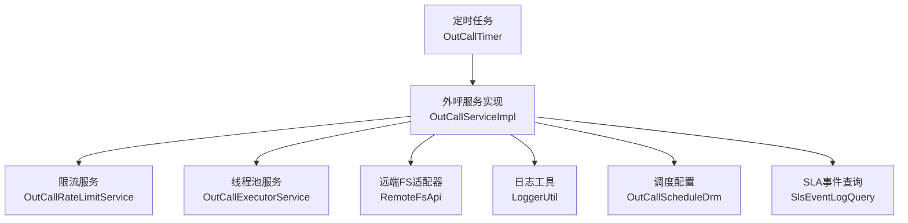
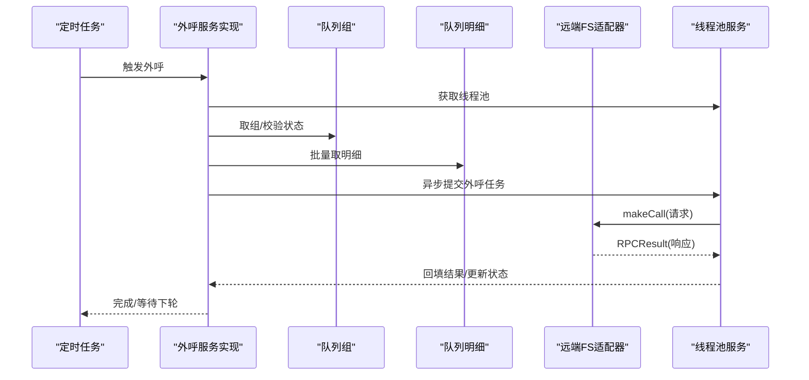
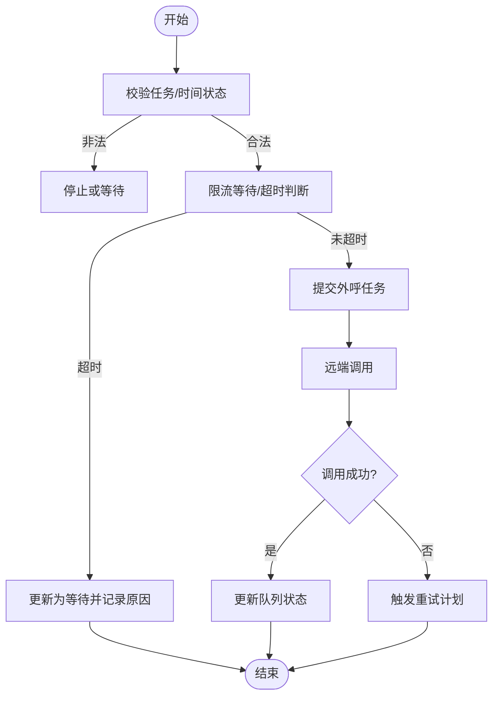
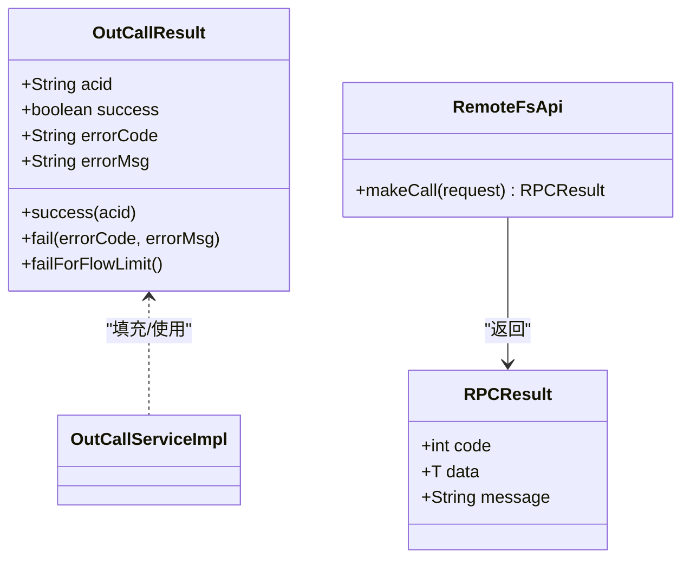
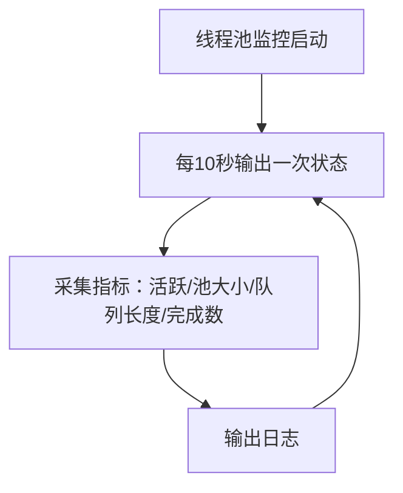
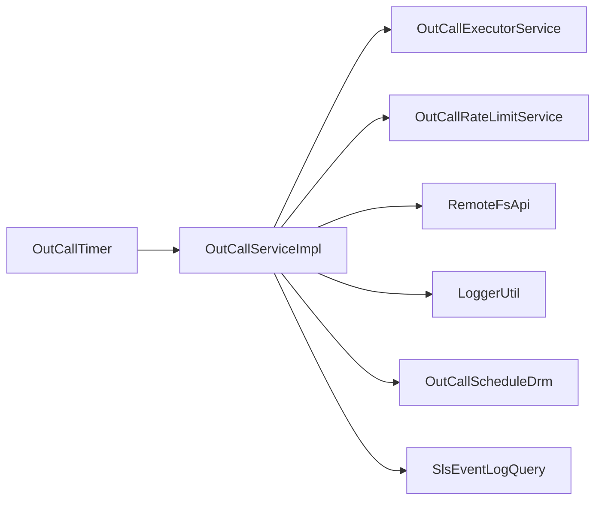

# 错误处理与监控

<cite>
**本文引用的文件**
- [RPCResult.java](file://src/main/java/org/qianye/RPCResult.java)
- [OutCallResult.java](file://src/main/java/org/qianye/OutCallResult.java)
- [LoggerUtil.java](file://src/main/java/org/qianye/LoggerUtil.java)
- [OutCallServiceImpl.java](file://src/main/java/org/qianye/OutCallServiceImpl.java)
- [OutCallService.java](file://src/main/java/org/qianye/OutCallService.java)
- [RemoteFsApi.java](file://src/main/java/org/qianye/RemoteFsApi.java)
- [OutCallExecutorService.java](file://src/main/java/org/qianye/OutCallExecutorService.java)
- [OutCallRateLimitService.java](file://src/main/java/org/qianye/OutCallRateLimitService.java)
- [OutCallScheduleDrm.java](file://src/main/java/org/qianye/OutCallScheduleDrm.java)
- [OutCallTimer.java](file://src/main/java/org/qianye/OutCallTimer.java)
- [SlsEventLogQuery.java](file://src/main/java/org/qianye/SlsEventLogQuery.java)
- [logback-spring.xml](file://src/main/resources/logback-spring.xml)
</cite>

## 目录
1. [简介](#简介)
2. [项目结构](#项目结构)
3. [核心组件](#核心组件)
4. [架构总览](#架构总览)
5. [详细组件分析](#详细组件分析)
6. [依赖分析](#依赖分析)
7. [性能考虑](#性能考虑)
8. [故障排查指南](#故障排查指南)
9. [结论](#结论)
10. [附录](#附录)

## 简介
本文件面向 Outcall 系统的错误处理与监控，覆盖以下主题：
- 错误处理机制：异常分类、重试策略、告警与恢复
- 监控指标体系：线程池与任务队列健康度、限流与队列积压、业务状态变更
- 日志记录规范：日志级别、格式化与最佳实践
- RPCResult 与 OutCallResult 的设计与使用
- SLA 事件日志查询能力现状与扩展建议
- 故障排查工具与调试技巧
- 系统健康检查与性能基准测试建议

## 项目结构
Outcall 采用分层与职责分离的组织方式：
- 控制层：定时任务与入口服务，负责调度与协调
- 业务层：外呼主流程、队列与任务状态管理
- 通信层：对外部系统发起外呼请求的适配器
- 监控与工具：线程池监控、日志工具、限流与调度配置

图表来源
- [OutCallTimer.java](file://src/main/java/org/qianye/OutCallTimer.java#L27-L117)
- [OutCallServiceImpl.java](file://src/main/java/org/qianye/OutCallServiceImpl.java#L31-L110)
- [OutCallExecutorService.java](file://src/main/java/org/qianye/OutCallExecutorService.java#L13-L64)
- [OutCallRateLimitService.java](file://src/main/java/org/qianye/OutCallRateLimitService.java#L10-L16)
- [RemoteFsApi.java](file://src/main/java/org/qianye/RemoteFsApi.java#L9-L15)
- [LoggerUtil.java](file://src/main/java/org/qianye/LoggerUtil.java#L8-L55)
- [OutCallScheduleDrm.java](file://src/main/java/org/qianye/OutCallScheduleDrm.java#L9-L112)
- [SlsEventLogQuery.java](file://src/main/java/org/qianye/SlsEventLogQuery.java#L13-L22)

章节来源
- [OutCallTimer.java](file://src/main/java/org/qianye/OutCallTimer.java#L27-L117)
- [OutCallServiceImpl.java](file://src/main/java/org/qianye/OutCallServiceImpl.java#L31-L110)
- [OutCallExecutorService.java](file://src/main/java/org/qianye/OutCallExecutorService.java#L13-L64)
- [OutCallRateLimitService.java](file://src/main/java/org/qianye/OutCallRateLimitService.java#L10-L16)
- [RemoteFsApi.java](file://src/main/java/org/qianye/RemoteFsApi.java#L9-L15)
- [LoggerUtil.java](file://src/main/java/org/qianye/LoggerUtil.java#L8-L55)
- [OutCallScheduleDrm.java](file://src/main/java/org/qianye/OutCallScheduleDrm.java#L9-L112)
- [SlsEventLogQuery.java](file://src/main/java/org/qianye/SlsEventLogQuery.java#L13-L22)

## 核心组件
- RPCResult：统一的远程调用响应载体，包含状态码、数据与消息
- OutCallResult：外呼结果对象，定义成功/失败、错误码与错误信息，并提供工厂方法
- LoggerUtil：封装 SLF4J 日志调用，支持占位符格式化与异常追加
- OutCallServiceImpl：外呼主流程实现，包含限流等待、队列与组状态管理、异步处理与重试触发
- OutCallExecutorService：线程池集合与周期性健康日志
- OutCallRateLimitService：限流检查接口（待完善）
- OutCallScheduleDrm：调度与限流配置（常量与阈值）
- RemoteFsApi：远端外呼适配器（占位实现）
- SlsEventLogQuery：SLA 事件日志查询（占位实现）

章节来源
- [RPCResult.java](file://src/main/java/org/qianye/RPCResult.java#L6-L10)
- [OutCallResult.java](file://src/main/java/org/qianye/OutCallResult.java#L6-L49)
- [LoggerUtil.java](file://src/main/java/org/qianye/LoggerUtil.java#L10-L54)
- [OutCallServiceImpl.java](file://src/main/java/org/qianye/OutCallServiceImpl.java#L493-L577)
- [OutCallExecutorService.java](file://src/main/java/org/qianye/OutCallExecutorService.java#L66-L137)
- [OutCallRateLimitService.java](file://src/main/java/org/qianye/OutCallRateLimitService.java#L12-L15)
- [OutCallScheduleDrm.java](file://src/main/java/org/qianye/OutCallScheduleDrm.java#L11-L111)
- [RemoteFsApi.java](file://src/main/java/org/qianye/RemoteFsApi.java#L11-L14)
- [SlsEventLogQuery.java](file://src/main/java/org/qianye/SlsEventLogQuery.java#L18-L21)

## 架构总览
Outcall 通过定时任务驱动外呼流程，服务内部通过多线程池并行处理队列与组，结合限流与队列积压保护，异常时写入日志并触发重排或状态回滚。

图表来源
- [OutCallTimer.java](file://src/main/java/org/qianye/OutCallTimer.java#L64-L69)
- [OutCallServiceImpl.java](file://src/main/java/org/qianye/OutCallServiceImpl.java#L680-L783)
- [RemoteFsApi.java](file://src/main/java/org/qianye/RemoteFsApi.java#L11-L14)
- [OutCallExecutorService.java](file://src/main/java/org/qianye/OutCallExecutorService.java#L49-L51)

## 详细组件分析

### 错误处理与重试策略
- 异常分类与处理
  - 任务状态非法：将组状态置为等待或停止，并记录原因
  - 时间不在允许范围：组状态置为等待或停止，并记录原因
  - 限流/队列积压/线程池满：更新明细状态为等待，记录失败原因，触发重试计划
  - 远端调用异常：捕获异常，记录错误，触发重试计划
- 重试策略
  - 异常组重排：通过重试线程池提交重排任务
  - 限流等待：带超时的等待与轮询，超时后降级为等待
  - 最大重试次数：由调度配置提供阈值
- 告警与恢复
  - 日志中记录异常与降级路径，便于后续审计与告警
  - 状态回滚：异常时将组/队列状态回退至等待或停止

图表来源
- [OutCallServiceImpl.java](file://src/main/java/org/qianye/OutCallServiceImpl.java#L472-L577)
- [OutCallServiceImpl.java](file://src/main/java/org/qianye/OutCallServiceImpl.java#L602-L679)
- [OutCallServiceImpl.java](file://src/main/java/org/qianye/OutCallServiceImpl.java#L700-L777)
- [OutCallScheduleDrm.java](file://src/main/java/org/qianye/OutCallScheduleDrm.java#L27-L29)

章节来源
- [OutCallServiceImpl.java](file://src/main/java/org/qianye/OutCallServiceImpl.java#L472-L577)
- [OutCallServiceImpl.java](file://src/main/java/org/qianye/OutCallServiceImpl.java#L602-L679)
- [OutCallServiceImpl.java](file://src/main/java/org/qianye/OutCallServiceImpl.java#L700-L777)
- [OutCallScheduleDrm.java](file://src/main/java/org/qianye/OutCallScheduleDrm.java#L27-L29)

### RPCResult 与 OutCallResult 设计与使用
- RPCResult
  - 字段：状态码、数据、消息
  - 使用场景：远端调用返回体，承载远端结果
- OutCallResult
  - 字段：acid、success、errorCode、errorMsg
  - 工厂方法：success/fail/failForFlowLimit
  - 错误码常量：涵盖重试、停止、失败、限流、队列积压、线程池满、未知错误等

图表来源
- [RPCResult.java](file://src/main/java/org/qianye/RPCResult.java#L6-L10)
- [OutCallResult.java](file://src/main/java/org/qianye/OutCallResult.java#L6-L49)
- [RemoteFsApi.java](file://src/main/java/org/qianye/RemoteFsApi.java#L11-L14)
- [OutCallServiceImpl.java](file://src/main/java/org/qianye/OutCallServiceImpl.java#L728-L730)

章节来源
- [RPCResult.java](file://src/main/java/org/qianye/RPCResult.java#L6-L10)
- [OutCallResult.java](file://src/main/java/org/qianye/OutCallResult.java#L6-L49)
- [RemoteFsApi.java](file://src/main/java/org/qianye/RemoteFsApi.java#L11-L14)
- [OutCallServiceImpl.java](file://src/main/java/org/qianye/OutCallServiceImpl.java#L728-L730)

### 监控指标体系
- 线程池健康度
  - 指标：活跃线程数、池大小、核心/最大线程、完成任务数、队列长度
  - 输出：周期性日志输出，便于观察积压与饱和
- 限流与队列积压
  - 限流等待：超时则降级为等待并记录原因
  - 队列积压：线程池队列超过阈值时，明细置为等待并记录原因
- 业务状态变更
  - 组/队列状态：等待、处理中、停止、完成
  - 异常回滚：异常时回滚状态并触发重试计划

图表来源
- [OutCallExecutorService.java](file://src/main/java/org/qianye/OutCallExecutorService.java#L60-L137)

章节来源
- [OutCallExecutorService.java](file://src/main/java/org/qianye/OutCallExecutorService.java#L60-L137)
- [OutCallScheduleDrm.java](file://src/main/java/org/qianye/OutCallScheduleDrm.java#L11-L13)
- [OutCallServiceImpl.java](file://src/main/java/org/qianye/OutCallServiceImpl.java#L703-L708)

### 日志记录规范与最佳实践
- 日志级别
  - INFO：常规流程、状态切换、周期性监控输出
  - WARN：中断/降级/异常但可恢复
  - ERROR：严重异常、重试计划触发
- 格式化与占位符
  - 使用 LoggerUtil 统一封装，支持占位符与异常堆栈追加
- 最佳实践
  - 在关键节点输出上下文信息（实例ID、任务/组/队列编码）
  - 对异常统一捕获并记录，避免吞异常
  - 区分业务异常与系统异常，分别走不同处理路径

章节来源
- [LoggerUtil.java](file://src/main/java/org/qianye/LoggerUtil.java#L10-L54)
- [logback-spring.xml](file://src/main/resources/logback-spring.xml#L29-L31)
- [OutCallServiceImpl.java](file://src/main/java/org/qianye/OutCallServiceImpl.java#L107-L109)
- [OutCallServiceImpl.java](file://src/main/java/org/qianye/OutCallServiceImpl.java#L209-L214)

### SLA 事件日志查询
- 现状
  - 提供 SLA 事件日志查询接口，当前为占位实现
- 建议
  - 明确查询维度（实例ID、任务/组/队列编码、时间范围、错误码）
  - 结合日志与数据库状态，输出可检索的事件列表
  - 支持导出与聚合统计

章节来源
- [SlsEventLogQuery.java](file://src/main/java/org/qianye/SlsEventLogQuery.java#L18-L21)

## 依赖分析
- 组件耦合
  - OutCallServiceImpl 依赖线程池、限流、远端适配器、日志工具与调度配置
  - OutCallTimer 仅通过接口注入服务，保持低耦合
- 外部依赖
  - 远端 FS 调用为占位实现，需接入真实 RPC
  - 限流与 SLA 查询亦为占位实现，需完善

图表来源
- [OutCallTimer.java](file://src/main/java/org/qianye/OutCallTimer.java#L38-L38)
- [OutCallServiceImpl.java](file://src/main/java/org/qianye/OutCallServiceImpl.java#L34-L69)
- [OutCallExecutorService.java](file://src/main/java/org/qianye/OutCallExecutorService.java#L13-L64)
- [OutCallRateLimitService.java](file://src/main/java/org/qianye/OutCallRateLimitService.java#L10-L16)
- [RemoteFsApi.java](file://src/main/java/org/qianye/RemoteFsApi.java#L9-L15)
- [LoggerUtil.java](file://src/main/java/org/qianye/LoggerUtil.java#L8-L55)
- [OutCallScheduleDrm.java](file://src/main/java/org/qianye/OutCallScheduleDrm.java#L9-L112)
- [SlsEventLogQuery.java](file://src/main/java/org/qianye/SlsEventLogQuery.java#L13-L22)

章节来源
- [OutCallTimer.java](file://src/main/java/org/qianye/OutCallTimer.java#L38-L38)
- [OutCallServiceImpl.java](file://src/main/java/org/qianye/OutCallServiceImpl.java#L34-L69)

## 性能考虑
- 线程池配置
  - 多类线程池并行处理：队列组、重试、外呼、计划任务、通用外呼
  - 通过周期性日志观测队列长度与饱和度，及时调整核心/最大线程与队列容量
- 限流与节流
  - 限流等待超时阈值与睡眠间隔可调
  - 队列积压阈值保护，避免内存压力
- 并发控制
  - 组级锁避免重复处理
  - 任务状态与时间范围校验，减少无效工作

章节来源
- [OutCallExecutorService.java](file://src/main/java/org/qianye/OutCallExecutorService.java#L15-L51)
- [OutCallScheduleDrm.java](file://src/main/java/org/qianye/OutCallScheduleDrm.java#L19-L25)
- [OutCallServiceImpl.java](file://src/main/java/org/qianye/OutCallServiceImpl.java#L690-L695)
- [OutCallServiceImpl.java](file://src/main/java/org/qianye/OutCallServiceImpl.java#L703-L708)

## 故障排查指南
- 常见问题定位
  - 任务状态异常：查看任务状态与时间范围校验日志
  - 组/队列状态异常：关注等待/停止/处理中状态切换
  - 限流/队列积压：检查线程池队列长度与限流等待日志
  - 远端调用失败：核对 RPCResult 返回与异常日志
- 调试技巧
  - 开启更细粒度日志（如 DEBUG），配合上下文字段定位
  - 使用 SLA 事件查询接口按条件检索历史事件
  - 临时调整调度配置（如等待时间、队列阈值）验证问题根因
- 健康检查
  - 观察线程池监控日志，确认队列长度与完成数趋势
  - 核对定时任务执行频率与随机延迟，避免并发峰值

章节来源
- [OutCallServiceImpl.java](file://src/main/java/org/qianye/OutCallServiceImpl.java#L127-L133)
- [OutCallServiceImpl.java](file://src/main/java/org/qianye/OutCallServiceImpl.java#L144-L149)
- [OutCallServiceImpl.java](file://src/main/java/org/qianye/OutCallServiceImpl.java#L400-L413)
- [OutCallExecutorService.java](file://src/main/java/org/qianye/OutCallExecutorService.java#L66-L137)
- [SlsEventLogQuery.java](file://src/main/java/org/qianye/SlsEventLogQuery.java#L18-L21)

## 结论
Outcall 的错误处理与监控以“可观测+可恢复”为核心：通过严格的日志与线程池监控、限流与队列积压保护、以及异常时的状态回滚与重试计划，形成闭环。建议尽快完善远端 RPC、限流与 SLA 查询的具体实现，以提升系统的稳定性与可运维性。

## 附录
- 监控告警配置建议
  - 基于线程池监控日志设置阈值告警（队列长度、饱和度、完成数异常）
  - 基于 OutCallResult 错误码聚合统计，对限流、队列积压、线程池满等进行告警
- SLA 事件日志查询使用建议
  - 明确查询参数（实例ID、任务/组/队列编码、时间范围、错误码）
  - 支持导出与聚合统计，便于事后复盘